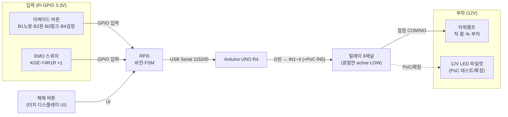

# 인터락 결선도 (확정본 v1)

> 작업 문서(Claude 작성, README "코드·배선도 = Claude"). **정밀 회로도 정본은 Drive·통합문서 §12.**
> 통신 경로 정본 = 통합문서 §5.2. 부품 정본 = Drive 구매 리스트.
> 전 부품 실물·데이터시트 확인 완료(2026-06-12). 최초 작성 2026-06-11.
> 🖼️ **시각 도면(drawio)**: Google Drive `PC 공유폴더` — `인터락_결선도_핀맵.drawio`(핀 단위), `인터락_결선도.drawio`(블록 개요).
> ⏭️ **다음 = 코드 작성**: [`코드작업_핸드오프.md`](코드작업_핸드오프.md) 참조.

## 결정 사항 (2026-06-12 확정)
- **릴레이 모듈 = 8채널 SZH-RLBG-009** (탑재 릴레이 칩 = JQC-3FF-S-Z) — 1차 구매분 보유. **최종 = 타워램프 4채널(적·황·녹·갈)** + 여유 4.
- **EMO = Pi GPIO 입력** — FSM이 직접 즉시 BLOCK + 해제 시 기대단계=1 리셋 처리.
- **버튼 = Pi GPIO 입력** (§5.2 정본).
- **릴레이 코일 전원 = 방법 A** (Arduino 5V, PoC·최종 공통). 방법 B(별도 5V·JD-VCC 분리)는 선택적 안전마진.
- **12V LED 파일럿 램프 = PoC 테스트 부하 전용** (타워램프 대신 안전 검증) + **최종은 확장 후보**(CH5). 최종 확정 구성엔 미포함.
- **시스템 팬 ×4 = 12V 직결 상시 ON** (릴레이 X — 냉각은 상시·고신뢰).
- **BLOCK 시 차단 시각화 = 녹색 램프 OFF**(정상 가동 중단). 별도 시뮬부하는 확장 시 추가.

---

## 1. 인터락 전장 부품 (확정)

| 역할 | 부품 | 전원 | 확정 스펙 |
|---|---|---|---|
| 제어기 | Arduino UNO R4 Minima | 5V (Pi USB) | 5V 로직, USB-C |
| Pi↔Arduino | USB-A↔Type-C | — | Serial `/dev/ttyACM0` 115200 |
| 차단 소자 | **8채널 5V 릴레이 모듈 SZH-RLBG-009** (릴레이 칩 JQC-3FF-S-Z) | 5V | 광절연(옵토커플러), active LOW, 접점 10A 250VAC |
| 경보(안돈) | 큐라이트 ST45L-BZ-3-12 | **12V** | 3단(적·황·녹)+부저, LED 단당 40mA·부저 40mA |
| 부하 전원 | 12V 2A 아답터 (SZH-PSU03) | AC→12V | 타워램프+쿨러 합계 ~0.76A / 2A |
| 비상정지 | EMO 푸쉬록턴 KGE-Y4R1R ×**1** | 무전원(접점) | 30파이 적색, 푸쉬록·턴리셋 |
| 공정 버튼 | 아케이드 30mm (노랑·흰·핑크·검정) | 무전원(접점) | **LED 없음**, 순수 마이크로스위치 |
| (PoC) 테스트 부하 | **12V LED 파일럿 램프(저항 내장)** | 12V | PoC 릴레이 검증용(타워램프 대신) + 최종 확장 후보. 확정 구성 미포함 |
| 배선 | 점퍼 40P, 브레드보드, WAGO, 터미널단자 2.8mm | — | — |

---

## 2. 전체 토폴로지

---

## 3. 핀맵 (확정)

### 3.1 RPi5 GPIO (3.3V, BCM) — 입력
| 신호 | BCM | 물리핀 | 결선 |
|---|---|---|---|
| B1 (노랑) | GPIO5 | 29 | 한쪽→GPIO, 반대→GND, `INPUT_PULLUP`, 눌림=LOW |
| B2 (흰) | GPIO6 | 31 | 〃 |
| B3 (핑크) | GPIO13 | 33 | 〃 |
| B4 (검정) | GPIO19 | 35 | 〃 |
| EMO | GPIO26 | 37 | EMO **NC쌍**(1a1b 중)→GPIO·GND, `INPUT_PULLUP`. 평소 LOW=정상 / 누름·단선=HIGH=비상(fail-safe) |

> 해제 버튼(WARNING→MONITOR / BLOCK→READY)은 **터치 디스플레이 UI**. 물리 GPIO 불필요.

### 3.2 Arduino UNO R4 → 릴레이 8채널 (최종 = 타워램프 4채널)
| Arduino 핀 | 릴레이 | 부하 |
|---|---|---|
| D7 | IN1 | 타워램프 **적**(BLOCK) |
| D6 | IN2 | 타워램프 **황**(WARNING) |
| D5 | IN3 | 타워램프 **녹**(정상/RUN) |
| D4 | IN4 | 타워램프 **부저**(BLOCK) |
| (D3) | (IN5) | **12V LED 파일럿** — *PoC 테스트 부하 / 최종 확장 후보* |
| — | IN6~8 | 여유(확장) |
| 5V/GND | VCC/GND | 릴레이 전원 = Arduino 5V (방법 A, §4 참조) |

> **PoC 테스트**: 타워램프 고장 방지를 위해 IN5 + 12V LED 파일럿으로 릴레이 스위칭·FSM 동작을 먼저 검증 → 검증 후 타워램프(CH1~4) 연결.

### 3.3 릴레이 접점 → 12V 부하 (극성 무관·공통=흑)
- 12V(+) → 타워램프 **공통선(흑)**
- 12V(−) → 각 릴레이 **COM** (공통 − 레일)
- 적선(적) → CH1 **NO** / 황선(황) → CH2 **NO** / 녹선(녹) → CH3 **NO** / 부저선(**갈색**) → CH4 **NO**
- (PoC) 12V LED 파일럿(+) → CH5 **NO** (저항 내장 → 직렬저항 불필요)
- (✅ 실물 확인 2026-06-12: 적=적색등·황=황색등·녹=녹색등·**갈=부저**·**흑=공통**)
- **시스템 팬 ×4 = 12V 직결 상시 ON** (릴레이 X)

> 릴레이 **active LOW**(데이터시트 확정): Arduino 핀 LOW → 채널 ON. 부팅 시 핀 초기값을 `setup()`에서 명시(정상상태=녹 ON).

---

## 4. 상태별 릴레이 동작 (FSM 정합)

| FSM 상태 | 적 | 황 | 녹 | 부저 | (시뮬부하·확장) | 의미 |
|---|---|---|---|---|---|---|
| IDLE/READY/RUN (정상) | · | · | **ON** | · | (ON) | 장비 정상 가동 |
| WARNING | · | **ON** | · | · | (ON) | 경고(아직 차단 전) |
| BLOCK | **ON** | · | · | **ON** | (OFF) | **차단 — 녹 OFF로 가동중단 표시** |

> 최종 확정 구성은 **타워램프 4채널**. 차단 시각화 = **녹색 OFF + 적·부저 ON**. ()안 시뮬부하 컬럼은 파일럿 확장 시 적용.

## 5. Serial 프로토콜 (FSM 콜백 → 명령)
FSM 콜백: `on_interlock(bool)`, `on_feedback(NONE/WARNING/BLOCK)`.

| 방향 | 메시지 | 트리거 | Arduino 동작 |
|---|---|---|---|
| Pi→Ard | `RUN\n` | feedback(NONE)+interlock(False) | 녹 ON, 나머지 OFF |
| Pi→Ard | `WARN\n` | feedback(WARNING) | 황 ON, 녹 OFF |
| Pi→Ard | `BLOCK\n` | feedback(BLOCK)+interlock(True) | 적+부저 ON, 녹 OFF |
| Ard→Pi | `ACK\n` | 명령 수신 | — |

> EMO는 Pi GPIO로 직접 감지 → FSM이 `BLOCK` 전이 → 위 `BLOCK\n` 송신. (별도 EMO 메시지 불필요)

---

## 6. 확인 항목 현황 (웹 확인 2026-06-12)
1. ✅ **릴레이 active LOW = 확정** — SZH-RLBG-009 데이터시트 "IN1~IN8 are active low". Arduino 핀 LOW=채널 ON. 물리확인 불필요.
2. ✅ **릴레이 코일 전원 = 확정** — 릴레이 = **JQC-3FF-S-Z (5VDC)**(실물 마킹, SRD-05VDC-SL-C 호환). 코일 5VDC·**71.4mA**·69Ω, 접점 **Form C(COM·NO·NC)** 10A 250VAC/15A 125VAC/30VDC. 활성 채널당 ~75mA. 우리 동시 ON 2채널(~150mA) → **방법 A(Arduino 5V)로 충분**(Pi USB 여유 안). 위험한 12V 부하측은 릴레이 접점이 이미 격리. 방법 B(JD-VCC 별도 5V)는 선택적 안전마진. 접점 10A는 우리 부하(<0.2A)에 50배+ 여유.
3. ✅ **EMO 접점 = 확정(1a1b: NO 1 + NC 1, 단자 4개)** — 실물 확인 2026-06-12. 안전상 **NC쌍 사용**. 배선 시 NC쌍 단자만 식별(각인 11-12 또는 LED 간이 통전).
4. ✅ **타워램프 전선색 = 확정** — 실물 확인 2026-06-12: 적=적색등·황=황색등·녹=녹색등·**갈=부저**·흑=공통.
5. ✅ **시뮬부하 = 12V LED 파일럿 램프(저항 내장)** 확정. 녹색/백색 권장. 구매 필요(미보유 시).

> 결론: 1·2 웹 완전확정, 3·4 웹+표준관례로 코드·설계 진행 충분. 물리확인은 **실제 배선 시점의 10초 최종 대조**로 격하(블로커 아님).

---

## 7. 배선 명세 (구간별 종단 + 전선)

### 7.1 구간별 종단·전선
| # | 구간 | A측 종단 | B측 종단 | 사용 전선 | 22AWG 단선 |
|---|---|---|---|---|---|
| **입력 (3.3V)** | | | | | |
| 1 | 버튼 B1~B4 → Pi GPIO | 2.8mm 페이스톤 탭 | 2.54mm 헤더 | 2.8mm 압착케이블 + 점퍼(F) | ❌ |
| 2 | EMO(NC쌍) → Pi GPIO26·GND | 나사단자 | 2.54mm 헤더 | **22AWG 단선** + Pi측 점퍼(F) | ✅ 2가닥 |
| **제어** | | | | | |
| 3 | Pi → Arduino | USB-A | USB-C | USB-A↔C 케이블 | ❌ |
| 4 | Arduino D4~D7 → 릴레이 IN1~4 | 암헤더 | 수핀 | 점퍼 M/F | ❌ |
| 5 | Arduino 5V·GND → 릴레이 VCC·GND | 암헤더 | 수핀 | 점퍼 M/F | ❌ |
| **출력 (12V)** | | | | | |
| 6 | 릴레이 NO → 타워램프 색선(적·황·녹·갈) | KF301 나사 | 전선끝 | 타워램프 자체 전선 | ❌ |
| **전원 (12V)** | | | | | |
| 7 | 12V 아답터 → 분배점 | DC잭 | WAGO | DC잭 케이블 NT10-AF04 | ❌ |
| 8 | 12V(+) → 타워램프 흑·팬+·[파일럿+] | WAGO | 전선끝/리드 | **22AWG 단선(빨강)** | ✅ |
| 9 | 12V(−) → 릴레이 4 COM·팬− | WAGO/나사 | KF301 나사 | **22AWG 단선(검정)** | ✅ |
| 10 | 시스템팬 ×4 → 12V 레일 | 팬 리드 | WAGO | 팬 자체 리드(+WAGO) | △ 연장 시 |
| **GND** | | | | | |
| 11 | 로직 GND 공통(Pi·Arduino·릴레이) | — | — | USB+점퍼(이미 공통) | ❌ |

> ★ 릴레이 접점은 코일/로직과 절연 → **12V 부하측 GND(−)와 로직측 GND는 공유 안 함**. 로직 GND는 USB+점퍼로 이미 공통.

### 7.2 22AWG 단선 적용 구간 (3곳)
| 구간 | 색 | 가닥 |
|---|---|---|
| ① EMO → Pi GPIO·GND | 신호색(노랑) | 2 |
| ② 12V(+) 분배 | 빨강 | 2~4 |
| ③ 12V(−) + 릴레이 COM 공통 | 검정 | 4~5 |

→ 필요량: 빨강·검정·신호색 각 **1~2m** (짧은 점프 다수).

### 7.3 전선 연결 방법
- **헤더(Pi·Arduino·릴레이 IN)** = 점퍼선 (보유)
- **서로 다른 전선/나사·전원 분배** = **WAGO 221-415** (보유, 단선·연선·다른굵기 혼합 OK, 공구 불필요)
- **신호선 임시 연결(PoC)** = 브레드보드 (단선·수점퍼만, 암점퍼·연선 ❌, 저전류 ~1A)
- **최종 고정 배선** = WAGO 또는 납땜+열수축
- **연선을 빵판/나사에 쓸 때** = 끝을 tinning(납적심) 또는 페룰 압착

### 7.4 추가 구매 필요
- **UL1007 22AWG 단선** (빨강·검정·신호색) — 12V 분배·EMO용. (점퍼·압착단자·WAGO·DC잭케이블은 보유)
- (선택) 페룰·포크단자 — 나사단자 마감용

---

## 다음 단계
확정본 → `interlock.py`(pyserial, FSM 콜백→Serial) + Arduino 스케치(.ino, IN1~5 제어·setup 초기화) 작성 → 루프백/소프트 검증 → HW 실연결 검증 → §12 정본 반영.
