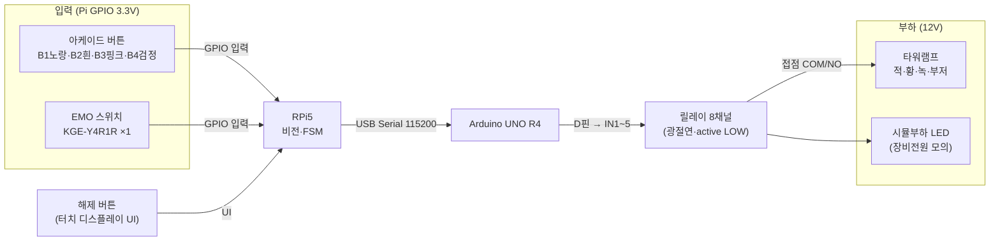

# 인터락 결선도 (확정본 v1)

> 작업 문서(Claude 작성, README "코드·배선도 = Claude"). **정밀 회로도 정본은 Drive·통합문서 §12.**
> 통신 경로 정본 = 통합문서 §5.2. 부품 정본 = Drive 구매 리스트.
> **⚠️[가정]** 표기는 HW 실물·데이터시트 확인 후 확정. 최초 2026-06-11 / 확정 2026-06-12.

## 결정 사항 (2026-06-12 확정)
- **릴레이 = 8채널 (SZH-RLBG-009)** — 1차 구매분 보유. 타워램프 적·황·녹·부저 독립 + 시뮬부하 + 여유 3.
- **EMO = Pi GPIO 입력** — FSM이 직접 즉시 BLOCK + 해제 시 기대단계=1 리셋 처리.
- **버튼 = Pi GPIO 입력** (§5.2 정본).
- **시뮬부하 = 12V LED 파일럿 램프(저항 내장)** — "장비 전원" 표시등. PoC 테스트 시 타워램프 대신 사용(고장 방지), 최종 콘솔에도 장착 유지. 저항 내장이라 12V 직결.

---

## 1. 인터락 전장 부품 (확정)

| 역할 | 부품 | 전원 | 확정 스펙 |
|---|---|---|---|
| 제어기 | Arduino UNO R4 Minima | 5V (Pi USB) | 5V 로직, USB-C |
| Pi↔Arduino | USB-A↔Type-C | — | Serial `/dev/ttyACM0` 115200 |
| 차단 소자 | **8채널 5V 릴레이 (SZH-RLBG-009)** | 5V | 광절연(옵토커플러), 접점 250VAC 10A |
| 경보(안돈) | 큐라이트 ST45L-BZ-3-12 | **12V** | 3단(적·황·녹)+부저, LED 단당 40mA·부저 40mA |
| 부하 전원 | 12V 2A 아답터 (SZH-PSU03) | AC→12V | 타워램프+쿨러 합계 ~0.76A / 2A |
| 비상정지 | EMO 푸쉬록턴 KGE-Y4R1R ×**1** | 무전원(접점) | 30파이 적색, 푸쉬록·턴리셋 |
| 공정 버튼 | 아케이드 30mm (노랑·흰·핑크·검정) | 무전원(접점) | **LED 없음**, 순수 마이크로스위치 |
| 시뮬부하 | **12V LED 파일럿 램프(저항 내장)** | 12V | "장비 전원" 표시등 — 차단 대상. 타워램프 대용 겸용 |
| 배선 | 점퍼 40P, 브레드보드, WAGO, 터미널단자 2.8mm | — | — |

---

## 2. 전체 토폴로지

---

## 3. 핀맵 (확정)

### 3.1 RPi5 GPIO (3.3V, BCM) — 입력
| 신호 | BCM | 물리핀 | 결선 |
|---|---|---|---|
| B1 (노랑) | GPIO5 | 29 | 한쪽→GPIO, 반대→GND, `INPUT_PULLUP`, 눌림=LOW |
| B2 (흰) | GPIO6 | 31 | 〃 |
| B3 (핑크) | GPIO13 | 33 | 〃 |
| B4 (검정) | GPIO19 | 35 | 〃 |
| EMO | GPIO26 | 37 | EMO **NC쌍**(1a1b 중)→GPIO·GND, `INPUT_PULLUP`. 평소 LOW=정상 / 누름·단선=HIGH=비상(fail-safe) |

> 해제 버튼(WARNING→MONITOR / BLOCK→READY)은 **터치 디스플레이 UI**. 물리 GPIO 불필요.

### 3.2 Arduino UNO R4 → 릴레이 8채널
| Arduino 핀 | 릴레이 | 부하 |
|---|---|---|
| D7 | IN1 | 타워램프 **적**(BLOCK) |
| D6 | IN2 | 타워램프 **황**(WARNING) |
| D5 | IN3 | 타워램프 **녹**(정상/RUN) |
| D4 | IN4 | 타워램프 **부저**(BLOCK) |
| D3 | IN5 | **12V LED 파일럿 램프** (장비전원/시뮬부하) |
| — | IN6~8 | 여유(확장) |
| 5V/GND | VCC/GND | 릴레이 전원 (코일 전원은 ⚠️ 아래 4절 참조) |

### 3.3 릴레이 접점 → 12V 부하 (극성 무관·공통=흑)
- 12V(+) → 타워램프 **공통선(흑)**
- 12V(−) → 각 릴레이 **COM** (공통 − 레일)
- 적선(적) → CH1 **NO** / 황선(황) → CH2 **NO** / 녹선(녹) → CH3 **NO** / 부저선(**갈색**) → CH4 **NO**
- 12V LED 파일럿 램프(+) → CH5 **NO** (저항 내장 → 직렬저항 불필요)
- (✅ 실물 확인 2026-06-12: 적=적색등·황=황색등·녹=녹색등·**갈=부저**·**흑=공통**)

> 릴레이 **active LOW ⚠️[가정]**: Arduino 핀 LOW → 채널 ON. 부팅 시 핀 초기값을 `setup()`에서 명시(정상상태=녹·시뮬부하 ON).

---

## 4. 상태별 릴레이 동작 (FSM 정합)

| FSM 상태 | 적 | 황 | 녹 | 부저 | 시뮬부하 | 의미 |
|---|---|---|---|---|---|---|
| IDLE/READY/RUN (정상) | · | · | **ON** | · | **ON** | 장비 정상 가동 |
| WARNING | · | **ON** | · | · | ON | 경고(아직 차단 전) |
| BLOCK | **ON** | · | · | **ON** | **OFF** | **전기 차단** |

## 5. Serial 프로토콜 (FSM 콜백 → 명령)
FSM 콜백: `on_interlock(bool)`, `on_feedback(NONE/WARNING/BLOCK)`.

| 방향 | 메시지 | 트리거 | Arduino 동작 |
|---|---|---|---|
| Pi→Ard | `RUN\n` | feedback(NONE)+interlock(False) | 녹+시뮬부하 ON, 나머지 OFF |
| Pi→Ard | `WARN\n` | feedback(WARNING) | 황 ON, 녹 OFF |
| Pi→Ard | `BLOCK\n` | feedback(BLOCK)+interlock(True) | 적+부저 ON, 녹·시뮬부하 OFF |
| Ard→Pi | `ACK\n` | 명령 수신 | — |

> EMO는 Pi GPIO로 직접 감지 → FSM이 `BLOCK` 전이 → 위 `BLOCK\n` 송신. (별도 EMO 메시지 불필요)

---

## 6. 확인 항목 현황 (웹 확인 2026-06-12)
1. ✅ **릴레이 active LOW = 확정** — SZH-RLBG-009 데이터시트 "IN1~IN8 are active low". Arduino 핀 LOW=채널 ON. 물리확인 불필요.
2. ✅ **릴레이 코일 전원 = 확정** — 릴레이 = **JQC-3FF-S-Z (5VDC)**(실물 마킹, SRD-05VDC-SL-C 호환). 코일 5VDC·**71.4mA**·69Ω, 접점 **Form C(COM·NO·NC)** 10A 250VAC/15A 125VAC/30VDC. 활성 채널당 ~75mA. 우리 동시 ON 2채널(~150mA)이면 USB 5V로 가능, **코일 전원은 JD-VCC 별도 5V 분리 권장**. 접점 10A는 우리 부하(<0.2A)에 50배+ 여유.
3. ✅ **EMO 접점 = 확정(1a1b: NO 1 + NC 1, 단자 4개)** — 실물 확인 2026-06-12. 안전상 **NC쌍 사용**. 배선 시 NC쌍 단자만 식별(각인 11-12 또는 LED 간이 통전).
4. ✅ **타워램프 전선색 = 확정** — 실물 확인 2026-06-12: 적=적색등·황=황색등·녹=녹색등·**갈=부저**·흑=공통.
5. ✅ **시뮬부하 = 12V LED 파일럿 램프(저항 내장)** 확정. 녹색/백색 권장. 구매 필요(미보유 시).

> 결론: 1·2 웹 완전확정, 3·4 웹+표준관례로 코드·설계 진행 충분. 물리확인은 **실제 배선 시점의 10초 최종 대조**로 격하(블로커 아님).

---

## 다음 단계
확정본 → `interlock.py`(pyserial, FSM 콜백→Serial) + Arduino 스케치(.ino, IN1~5 제어·setup 초기화) 작성 → 루프백/소프트 검증 → HW 실연결 검증 → §12 정본 반영.
