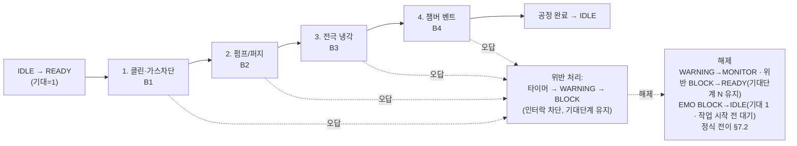
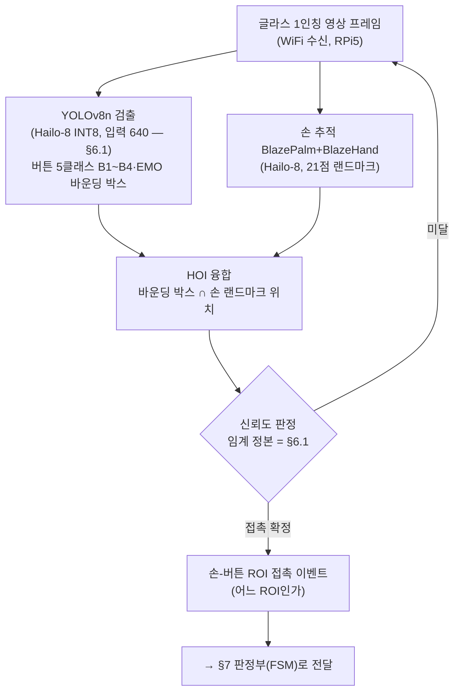
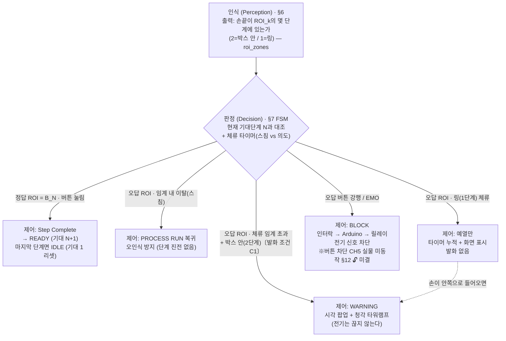
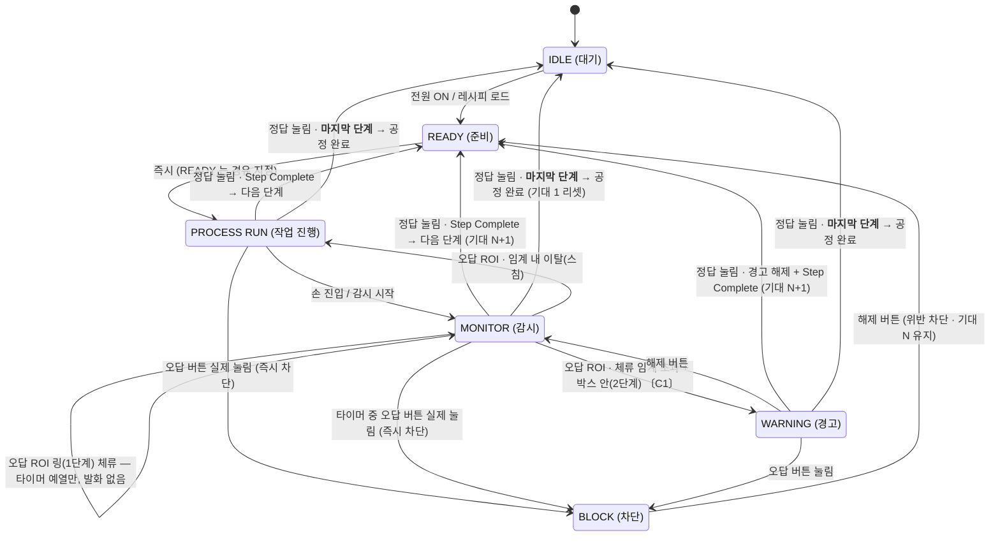
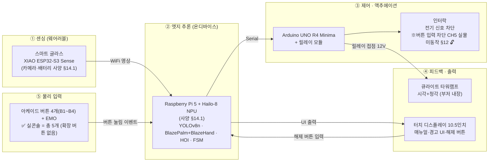

# 통합 수행·설계 문서
### Vision AI 기반 웨어러블 연동 작업자 Human Error 사전 예방 안전 콘솔

---

> [!CAUTION]
> ## 🔴 주 독자 = Claude Code
> **작업할 때 기준으로 읽는 문서이며, 사람이 읽기 좋게 다듬는 것은 목표가 아니다. 사람용 정리·발표 자료는 따로 만든다.**

> ### 📌 문서 안내
>
> - **이 문서는** 프로젝트가 무엇이고, 왜 하며, 어떻게 만들었고, 어디까지 검증됐는지를 담은 **단일 정본**이다. 설계·사양·배경·SOP·하드웨어·측정이 옛 자료·발표 PDF·다른 사본과 부딪히면 **이 문서가 이긴다.**
> - **표시 읽는 법**
>   - 상태: `✅ 확정` · `🔄 진행 중` · `⏸ 보류` · `⛔ 폐기` · `⚠️ 확인 필요`
>   - `❌` = 판정 결과가 「아니다·실패」 (폐기가 아니다)
>   - 취소선 = 틀린 옛 문장. 바로 옆에 정정이 있다
>   - `[CURRENT]` = §12 머리 「현재 확정값」 표의 행 표시
>   - §12 절 유효성 마커(제목 다음 줄): `✅ CURRENT-AS-OF <날짜>` 현행 · `⚠️ PARTIALLY-SUPERSEDED-BY §X` 일부 대체 · `⛔ SUPERSEDED-BY §X` 결론 뒤집힘
> - **이 문서가 다루지 않는 것:** 일정·작업 진행 상태(→ `docs/작업로그.md`) · 파일 위치 지도(→ `README.md`) · 변경 이력(→ `git log --follow docs/통합문서.md`)
> - **세 문서의 역할** — 🔑 **조건 없이 인용할 수 있으면 이 문서, 조건을 달아야 하면 저널.**
>   - **이 문서** = **현행 사실의 정본** — 「지금 무엇이 맞는가」. **덮어쓴다**(R5 · 덮은 옛 사실은 [`변경이력.md`](변경이력.md) 로 R2)
>   - [`성능검증-저널.md`](성능검증-저널.md) = **측정 기록의 원장** — 「언제 어떤 조건에서 무엇이 나왔나」(`§12.N` 본문). **덧붙인다**(R6 · 지우지 않고 `⛔` 마커)
>   - [`작업로그.md`](작업로그.md) = **작업의 시간순 저널** — 「누가 언제 무엇을 했나」
>   - 🔴 **셋은 한 작업 단위에서 함께 갱신된다** — 저널에 새 `§12.N` 을 쓰면 이 문서의 갈래 색인 · `[CURRENT]` 표 · 🔓 미결 표를 같이 고치고, 작업로그 🔗 줄에 그 커밋 해시를 넣는다. 짝맞춤은 `work-close` 2.5 가 기계로 검사한다.
>
> ### 📐 문서 규칙 → `.claude/rules/정본편집.md`
>
> 🔴 **이 문서를 열면 그 규칙이 자동으로 붙는다**(`paths:` 로 연결). 여기에 복제하지 않는다.
> 소급 여부(이미 쓰인 본문도 고치러 갈 것인가) = `.claude/rules/규칙배치.md` 의 「소급」 절.

## 목차

> **머리 → Ⅰ 기능 → Ⅱ 비기능 → Ⅲ 구현 수단 → 부록** 순이다. 「무엇을 하는가(Ⅰ)」·「얼마나 잘 하는가(Ⅱ)」·「무엇으로 만들었는가(Ⅲ)」로 나눠 둔다.

| # | 섹션 | 이 장에서 답을 찾는 질문 |
| --- | --- | --- |
| 1 | 표지·프로젝트 개요 | 이 프로젝트는 무엇이고 누가 진행하나? |
| 2 | 프로젝트 배경·필요성 | 왜 이 프로젝트가 필요한가? |
| 3 | 프로젝트 특징과 차별점 | 기존 방식과 무엇이 다른가? |
| **Ⅰ** | **기능** | **이 시스템이 무엇을 하는가** |
| 4 | 요구사항과 목표 | 무엇을 이루려 하고, 반드시 해야 하는 일은 무엇인가? |
| 5 | 시연 공정 시나리오 | 시연에서 작업자는 어떤 순서로 무엇을 하나? |
| 6 | 인식 — 비전 파이프라인 | 카메라 영상에서 무엇을 어떻게 인식하나? |
| 7 | 판정 — FSM 알고리즘 명세 | 인식 결과로 상태를 어떻게 판정하나? |
| 8 | 제어·피드백 — 인터락·타워램프·GUI | 판정 뒤에 무엇이 일어나고 작업자는 무엇을 보나? |
| 9 | 음성비서 | 손을 못 쓸 때 어떻게 묻고 듣나? |
| 10 | 범위와 향후 확장 | 지금 범위에서 뺀 기능은 무엇인가? |
| **Ⅱ** | **검증** | **목표를 실제로 얼마나 달성했는가** |
| ~~11~~ | *(결번 — §4.1 로 통합)* | |
| 12 | 성능 검증 데이터 | 실제로 측정해 보니 결과는 어땠나? |
| **Ⅲ** | **구현 수단** | **무엇으로 만들었는가** |
| 13 | 시스템 구성·통신 경로 | 시스템은 어떤 부분으로 이루어지고 서로 어떻게 이어지나? |
| 14 | 하드웨어 사양·개발 환경 | 어떤 부품과 개발 도구를 쓰나? |
| 15 | 회로도·핀맵 | 부품은 어떤 핀과 채널로 연결되나? |
| **부록** | | |
| 16 | 부록(소스·형상관리·BOM) | 소스·부품 목록·라이선스는 어디서 확인하나? |

> 🔴 **수치를 찾으면 §12 로 간다** — `🎯 현재 확정값` 표가 먼저다. 한 주제의 절을 전부 보려면 `🧭 §12 갈래 색인`.
> 🔴 **옛 장 번호(재편 전)를 만나면 §16 「옛↔새 장번호 대조표」** 로 옮겨 읽는다.

---
## 1. 표지·프로젝트 개요

| 항목 | 내용 |
| --- | --- |
| **프로젝트명** | Vision AI 기반 웨어러블 연동 작업자 Human Error 사전 예방 안전 콘솔 |
| **한 줄 정의** | 웨어러블 1인칭 비전 AI로 반도체 장비 정비의 작업 순서 위반을 버튼 입력 직전에 감지·경고하는 휴먼 에러 사전 예방 시스템 |
| **핵심 키워드** | `#VisionAI` `#EdgeAI` `#Wearable` `#FSM` `#HumanError` |
| **공모전 제출** | 한이음 드림업 공모전 1차 접수 제출 · 시연영상 https://youtu.be/uD0gHztG76E |

**수행 과정**
- 본 프로젝트는 두 과정으로 이루어져 있다 — **교내 캡스톤(융합프로젝트)**과 **한이음 드림업 프로젝트**.
- **한이음 드림업** = 「대학생 멘티가 기업전문가와 팀을 이루어 실무형 프로젝트를 수행함으로써 개발 이론과 실무역량을 겸비한 문제해결형 인재로 성장하는 ICT인재양성 프로그램」 (주최 과학기술정보통신부 · 주관 한국정보산업연합회)
- **기간:** 교내 캡스톤 2026.02 ~ 10 · 한이음 드림업 수행기간 2026.04.01 ~ 10.30
- **인원 구성:** 총 8명(한이음 드림업 멘티 5명 · 그 외 참여 3명) · 한이음 드림업 멘토 1명 · 지도교수 1명

---
## 2. 프로젝트 배경·필요성

### 2.1 배경 — 정비 구간에서는 안전이 절차에 맡겨진다

**설비의 안전장치는 정비 때 해제될 수 있고, 그동안의 안전은 작업자가 지키는 관리적 통제에 맡겨진다.**

#### ① 대상 — 반도체 장비 정비
- 본 프로젝트는 여러 정비 작업 가운데 **반도체 장비 정비**를 대상으로 한다.
- 반도체 공정은 불화수소 같은 유해물질을 다루고 [A], 정비 중에는 사람이 인터락으로 보호되는 구역에 직접 접근해야 하는 경우가 있다 [B].
- **다만 아래 근거가 모두 반도체 장비를 조사한 자료는 아니다.** 반도체 장비에 한정된 자료는 SEMI S2 가이드라인 [B]과 원자력안전위원회 사고 조사 [F]이고, 인터락의 원리 [C]·방호장치 무력화 [D]·사고 통계 [E]는 **산업 설비·제조업 전반의 자료**다. §2.2 의 정비 오류 연구 [H]는 **항공 정비** 자료다. 반도체 장비 정비만 따로 집계한 사고 통계는 확인하지 못했다.
- → 유해물질을 다루는 장비에 **사람이 직접 접근하는** 작업이므로, 먼저 정비 중 안전이 어떤 장치와 규칙으로 지켜지는지 살펴본다.

#### ② 인터락은 미리 설계해 둔 조건과 순서를 강제한다
- 이런 장비의 위험 구역은 인터락이 지킨다 [B].
- 예를 들어 산업 설비의 트랩키 인터락은 열쇠를 정해진 순서로만 옮길 수 있게 해, 장비를 **미리 정해 둔 안전한 조작 순서대로만** 움직이게 한다 [C].
- → 인터락이 강제하는 것은 **설계 단계에서 정해 둔 조건과 순서**다.

#### ③ 정비 때는 그 인터락을 해제할 수 있다
- 반도체 장비 안전 가이드라인 SEMI S2는 그 구역에 정비 접근이 필요할 때 **의도적 조작을 거쳐 인터락을 해제하는 것을 허용**한다 [B].
- 해제한 동안에는 정비 매뉴얼에 **관리적 통제**(절차·교육처럼 사람이 지켜야 효과가 나는 대책)를 정해 작업자를 보호하도록 권고한다 [B].
- 규정된 해제 말고도 방호장치가 꺼지는 일은 드물지 않다. 기계 설비 전반을 대상으로 한 독일 산재보험 연구소 설문에서 응답자들은 설비의 27.2%에서 방호장치가 일시적 또는 상시 무력화된다고 추정했고, 무력화가 잦은 작업으로 고장 처리·설정 조정·수리 보수를 꼽았다 [D].
- → 정비 구간에서는 **인터락이 맡던 안전을 작업자가 지키는 관리적 통제가 대신한다.**

#### ④ 사고는 정비 같은 비정형 작업에서 많이 난다
- 반도체에 한정하지 않은 국내 제조업 전체를 보면, 끼임 사망사고 중 수리·정비·청소 같은 비정형 작업 중에 발생한 비율은 약 54%다 [E].
- 반도체 사업장에서도 인터락이 작동하지 않는 상태의 정비에서 사고가 났다. 삼성전자 기흥사업장에서 정비작업자 2명이 웨이퍼 측정용 엑스선 장비의 전원을 켠 상태로 방사선 차폐체를 떼고 작업하다 선량한도를 넘게 피폭되었는데, 당시 인터락은 배선이 잘못되어 작동하지 않았다. 원자력안전위원회는 「인터락의 임의조작, 경고등 식별 미흡, 정비작업자 작업 검토‧관리감독 등의 부재」를 원인으로 평가했다 [F].
- → 정비 구간의 안전은 **사람이 지키는 관리적 통제에 크게 기댄다.** 그 방어선이 충분한지가 **§2.2 의 질문**이다.

> 📚 **출처**
> [A] 삼성반도체 용어사전 「불화수소」 (제조사 자료) — https://semiconductor.samsung.com/kr/support/tools-resources/dictionary/hydrogen-fluoride-essential-to-the-semiconductor-processes/
> [B] SEMI® S2-0715 §11.7.2 · §11.7.2.2 (가이드라인이며 법적 강제 규격 아님 · 조항 원문은 Intertek 평가보고서 수록본 32쪽) — 원문 「When maintenance access is necessary to areas protected by interlocks, defeatable safety interlocks may be used, provided that they require an intentional operation to bypass.」 · 「If a safety interlock is defeated, the maintenance manual should identify administrative controls to safeguard personnel or to minimize the hazard.」 — http://treborintl.com/wp-content/uploads/2022/01/Quantum-NXT-SEMI-S2-0715.pdf
> [C] Kirk Key Interlock Company, 「Trapped Key Interlock Safety Systems: Enhanced Safety Beyond LOTO」 (제조사 백서) — 원문 「allowing operation of the equipment only in a safe, predetermined sequence of operations」 — https://www.sentricsafetygroup.com/fr/wp-content/uploads/sites/3/2019/12/KirkWP-EnhancedLOTO.pdf
> [D] IFA, 「Aktuelle Zahlen zum Manipulationsgeschehen」 (기계 설비 전반 · 사고 건수가 아니라 설문 응답자의 추정) — 원문 「Im Mittel werden nach Aussage der Befragten an 27,2 % der Maschinen Schutzeinrichtungen vorübergehend oder ständig manipuliert」 · 「Störungssuche und Störungsbeseitigung (63,3 %) … Einrichten und Einstellen (52,1 %) sowie die Reparatur und Instandsetzung (51,1 %)」 — https://publikationen.dguv.de/forschung/ifa/allgemeine-informationen/4896/aktuelle-zahlen-zum-manipulationsgeschehen-online-umfrage-zur-manipulation-von-schutzeinrichtungen
> [E] 한국산업안전보건공단, 「Connect+ 데이터로 보는 안전」 38쪽 (산업안전보건연구원 제조업 끼임 사망사고 중대재해조사 보고서 272건 분석 인용 · 비정형 작업 = 수리·정비·청소) — 원문 「수리, 정비, 청소 등 일상적이지 않은 상태에서 이뤄지는 비정형 작업 중 사망사고가 발생한 비율은 약 54%이다」 — https://www.kosha.or.kr/ebook/fcatalog/access/ecatalogt.jsp?callmode=normal&eclang=ko&Dir=493&um=s&start=38
> [F] 원자력안전위원회, 「삼성전자(주) 기흥사업장 방사선피폭사건 조사결과 및 조치계획」 (2024) — https://www.nssc.go.kr/attach/namo/files/000002/20240926174645693_1E891JFD.pdf

### 2.2 필요성 — 정비 절차의 순서를 지키는지 확인하는 장치가 없다

**정비 구간의 안전을 맡은 관리적 통제는 사람이 절차를 지켜야 효과가 나지만, 사람은 절차를 놓칠 수 있고 그 순서를 확인하는 장치는 없다.**

#### ① 관리적 통제는 사람의 꾸준한 노력에 기댄다
- §2.1 에서 본 것처럼, 인터락이 해제된 정비 구간은 절차 같은 관리적 통제가 작업자를 보호한다.
- 미국 국립산업안전보건연구원(NIOSH)은 관리적 통제가 **작업자와 감독자의 상당하고 지속적인 노력을 필요로 하며**, 사람의 개입 없이 위험을 통제하는 제거·대체·공학적 대책보다 효과가 낮다고 설명한다 [G].
- → 관리적 통제의 효과는 **사람이 매번 절차를 제대로 지키는가**에 달려 있다.

#### ② 사람은 정비 절차를 놓칠 수 있다
- 정비에서 필요한 단계를 빠뜨리는 **휴먼 에러**는 흔한 오류로 꼽힌다. 2003~2017년 상업 항공 정비 관련 사고를 분석한 연구는 앞선 연구들과 마찬가지로 **누락 오류가 여전히 흔하다**고 보고했다 [H] — 항공 정비 분야의 결과다.
- → 관리적 통제에 기대는 정비 구간은 **사람이 절차를 놓칠 수 있다는 약점**을 그대로 안는다.

#### ③ 정비 중 절차의 순서를 확인하는 장치가 없다
- 인터락은 설계해 둔 장비 상태와 조작 순서를 강제하지만(§2.1 ②), 정비 작업 안에서 작업자가 **어떤 순서로 조작하는지**는 장비가 받는 신호가 아니다 **(추론)**.
- 그래서 정비 구간에서 절차의 순서를 지키는지는 **작업자 본인의 주의력에 맡겨진다** **(추론)**.
- → 정비 구간에는 작업자의 **순서 위반**을 알아차려 **조작 직전에 경고하고, 강행하면 그 조작 입력을 차단하는 층**이 필요하다. 이 필요에서 본 프로젝트가 출발하며, 그 모습은 **§3** 에서 설명한다.

> 📚 **출처**
> [G] NIOSH·CDC, 「Hierarchy of Controls」 — 원문 「Administrative controls and PPE require significant and ongoing effort by workers and their supervisors. Elimination, substitution, and engineering controls are more effective because they control exposures without significant human interaction.」 — https://www.cdc.gov/niosh/hierarchy-of-controls/about/index.html
> [H] Insley & Turkoglu, 「A Contemporary Analysis of Aircraft Maintenance-Related Accidents and Serious Incidents」, Aerospace 7(6):81 (2020 · 항공 정비 · 2003~2017 상업 항공 정비 관련 사고·준사고 · 1위 요인은 「부적절한 정비 절차」) — 원문 「As with previous studies … omission errors, particularly incorrect installations, remain prevalent.」 — https://mdpi-res.com/d_attachment/aerospace/aerospace-07-00081/article_deploy/aerospace-07-00081.pdf

---
## 3. 프로젝트 특징과 차별점

### 3.1 프로젝트 특징

**본 프로젝트는 장비 상태가 아니라 사람이 지키는 절차의 순서를 다루며, 인터락 해제가 허용되는 정비 구간에서 작업자를 돕고, 기존 안전장치 위에 한 겹을 더한다.**

#### 가. 무엇을 — 절차의 순서
- §2.2 에서 본 빈자리는 장비 상태가 아니라, **작업자가 절차를 어떤 순서로 수행하는지** 확인하는 장치가 없다는 것이다.
- 본 프로젝트의 목적은 이 순서를 확인해 **순서 위반이라는 휴먼 에러를 예방**하는 것이다. 작업자의 안전은 목적이 아니라 **순서 위반 예방의 결과**로 본다.
- 이 방식은 자동차 생산 현장에서 정립된 실수 방지 원리(포카요케) 가운데 **단계가 올바른 순서로 진행되는지 확인하는 방식**과, 실수가 일어나려 할 때 **알려 주는 경고 방식**을 사람의 정비 작업에 적용한 것이다 [I].
- → 본 프로젝트가 다루는 대상은 **장비가 아니라 사람의 작업 순서**다.

#### 나. 어디에 — 인터락 해제가 허용되는 정비 구간
- 본 프로젝트는 장비가 정상 운전 중인 구간이 아니라, **인터락 해제가 허용되고 안전이 관리적 통제에 맡겨지는 정비 구간**(§2.1 ③)을 겨냥한다.
- → 인터락이 제 역할을 하는 **정상 운전 중의 설비 안전은 다루지 않는다.**

#### 다. 누구를 — 작업자 본인
- 본 프로젝트는 작업자가 착용하는 장치로 **작업자 자신의 시점**에서 작업을 보고, 경고도 **작업자 본인**에게 전한다.
- → 관리자의 감시보다 **작업자 본인이 조작 직전에 스스로 멈출 수 있도록 돕는 것**에 초점을 둔다.

#### 라. 관계 — 기존 안전장치 위에 한 겹 더
- 고위험 시스템은 여러 겹의 방어층을 둔다. 경보·물리적 방벽·자동 정지 같은 공학적 방어가 있고, 사람(운전원 등)에게 기대는 방어가 있으며, 절차·관리적 통제에 기대는 방어가 있다 [J].
- 본 프로젝트는 인터락이나 절차를 **대체하지 않고**, 사람과 절차에 기대던 방어층 위에 **한 겹을 더하는 층**이다.
- → 본 프로젝트가 있다고 **기존 안전장치나 절차를 줄여도 된다는 뜻은 아니다.**

> 📚 **출처**
> [I] Grout, 「Mistake-Proofing the Design of Health Care Processes」, AHRQ(미국 보건의료연구소 · 의료 분야 지침) — 원문 「Shigeo Shingo formalized mistake-proofing as part of his contribution to the production system for Toyota automobiles.」 · 「Mistake-proofing … is also known as poka-yoke」 · 「Sequencing (Shingo's motion step) — Checks the precedence relationship of the process to ensure that steps are conducted in the correct order.」 · 「Warning — A visual or audible warning signal is given that a mistake or omission is about to occur. Although the error is signaled, the process is allowed to continue.」 — https://www.govinfo.gov/content/pkg/GOVPUB-HE20_6500-PURL-gpo3107/pdf/GOVPUB-HE20_6500-PURL-gpo3107.pdf
> [J] Reason, 「Human error: models and management」, BMJ (사고를 설명하는 틀 · 정량 근거 아님) — 원문 「High technology systems have many defensive layers: some are engineered (alarms, physical barriers, automatic shutdowns, etc), others rely on people (surgeons, anaesthetists, pilots, control room operators, etc), and yet others depend on procedures and administrative controls.」 — https://www.behaviouralsafetyservices.com/Content/Downloads/Reason-Paper-Human-Error.pdf


### 3.2 선행 사례와 차별점

**비전으로 작업 순서를 확인하려는 시도는 학계와 상용 제품에 이미 있으며, 본 프로젝트는 그중 정비 중 작업자의 조작 순서를 작업자 시점에서 판정해 그 조작 입력을 막도록 설계했다는 점이 다르다.**

조사 범위는 2026-08-29 기준 공개 논문·웹 문헌·상용 제품 페이지이며, 특허와 비공개 사내 시스템은 조사하지 않았다. 아래 비교는 그 범위 안에서의 비교이며, 성능을 비교한 것이 아니다.

#### ① 학계 — 1인칭 영상으로 절차 오류를 찾는 연구
- 작업자 시점의 1인칭 영상으로 절차를 학습하고 오류를 찾는 연구가 여럿 있다. EgoProceL은 1인칭 영상으로 작업 절차를 학습하고 [K], IndustReal은 산업 환경을 본뜬 조립 작업 영상에 **단계 누락 같은 절차 오류**를 담았다 [L].
- EgoPER는 여러 유형의 오류가 담긴 영상과 정상 영상을 모아 **절차 오류를 검출하는 방법**을 제안했고 [M], TI-PREGO는 작업이 진행되는 도중에(online) 절차 오류를 찾는 문제를 다룬다 [N].
- → 1인칭 비전으로 절차 오류를 판정하는 **문제 설정 자체는 이미 연구돼 있다.**

#### ② 상용 — 설치형 카메라로 작업 순서를 감시하는 제품
- 조립·포장 공정에서는 작업대 위나 옆에 설치한 카메라로 작업 단계와 순서를 추적해 **단계를 빠뜨리면 작업자에게 경고하는 제품**이 판매되고 있으며 [O][P], 일부 제품은 문제가 해결될 때까지 **설비 제어기(PLC)에 신호를 보내 생산을 멈추는** 기능도 내세운다 [P].
- 산업안전용 비전 AI는 현장 CCTV 영상에서 안전모 착용 여부·현장 침입·쓰러짐·연기 같은 **상태와 사건**을 감지해 **신속히 알린다** [Q].
- → 작업 단계 판정과 경고는 상용화돼 있다. 다만 대상은 **조립·포장 공정**이고, 산업안전 비전 AI는 행위의 순서가 아니라 상태를 본다.

#### ③ 비전 검사를 차단에 연결한 사례
- 비전 기반 실수 방지 사례에서는 센서·비전 검사 결과를 설비 제어기(PLC)의 인터락 로직에 연결해 **검사가 통과하지 않으면 다음 공정이 부품을 받지 않게 막는다** [R].
- → 비전 판정을 차단에 연결하는 것 자체는 새롭지 않다. 다만 판정 대상이 **부품·제품의 상태**이지 작업자의 행동 순서가 아니다.

#### ④ 웨어러블 — 스마트글라스 작업 지원
- 스마트글라스에 정비 관리 시스템을 연동해 **작업 허가·격리 확인을 화면에 띄우고, 음성 명령으로 작업 지시를 진행하는** 제품이 있다 [S].
- → 1인칭 웨어러블로 절차를 안내하는 조합은 제품으로 나와 있다. 다만 작업 진행이 **작업자의 음성·시선 입력**으로 이루어지고, 비전이 작업자의 행동을 보고 판정하지 않는다.

#### ⑤ 비교 — 각 사례와 본 프로젝트

| | 무엇을 보나 | 누구에게 알리나 | 개입 |
| --- | --- | --- | --- |
| 인터락(트랩키 등) | 설계해 둔 설비 조건과 조작 순서 (§2.1 ②) | — (설비가 조작을 받아들이지 않음) | 물리적 차단 |
| 산업안전 비전 AI | 안전모·침입·쓰러짐·연기 같은 상태와 사건 | — (자료에 대상 없음) | 알림 |
| ① 학계 1인칭 오류 검출 | 1인칭 영상 속 절차 오류 | — (연구 단계) | 없음 |
| ② 상용 작업 단계 감시 | 조립·포장 작업의 단계와 순서 | 작업자 | 경고 · (일부) 생산 정지 신호 |
| ③ 비전 검사 + 차단 | 부품·제품의 상태 | — | 다음 공정 차단 |
| ④ 스마트글라스 작업 지원 | (비전 판정 없음 — 음성·시선 입력) | 작업자 | 없음 |
| **본 프로젝트** | **정비 중 작업자의 조작 순서** | **작업자 본인** | **경고 + 강행 시 조작 입력 차단** — 🔴 차단은 **설계·펌웨어까지**이고 버튼 입력 차단(CH5)은 실물 미동작(§12 🔓) |

- 인터락은 설계해 둔 조작 순서를 강제하지만 **정비 작업 안에서 작업자가 어떤 순서로 조작하는지**는 판정하지 않고 (§2.2 ③, 추론), 산업안전 비전 AI는 상태와 사건을 본다.
- → 차별점은 **판정 대상**에 있다 — 본 프로젝트는 정비 중 작업자의 조작 순서를 본다. 알리는 대상(작업자 본인)과 적용 구간(정비)은 §3.1 다·나에서 이미 다룬 프로젝트 특징이다.
- → 조사 범위 안에서 **1인칭 판정·순서 경고·조작 차단·웨어러블 네 요소를 정비 작업에 함께 적용한 사례는 찾지 못했다.** 찾지 못한 것이 없다는 증명은 아니다.

#### ⑥ 설치형 카메라가 아니라 작업자 시점

- 위 ②의 제품은 **설치형 카메라**(작업대 위·옆 카메라, 현장 CCTV)를 쓴다.
- 절차 학습 연구는 3인칭 영상에서 **조작 대상이 작게 잡히고 작업자 몸에 자주 가려 오류가 커진다**고 지적하고, 1인칭 착용 카메라는 **동작을 가리지 않고 선명하게 보여 준다**고 보고했다 [K].
- 같은 연구는 1인칭 영상에도 **착용자의 머리 움직임으로 시점이 크게 바뀌는** 어려움이 있다고 밝힌다 [K]. 본 프로젝트의 측정값도 카메라 구도에 따라 달라진다 (§12).
- → 작업자 시점은 **손끝에서 일어나는 조작을 보기에 유리한 조건**이지만, 1인칭이 항상 더 정확하다는 뜻은 아니다.

#### ⑦ 작업자의 조작 입력을 막는 차단 설계

- 위 ①의 학계 연구는 판정까지 가고, 위 ②③의 상용 제품은 생산을 멈추거나 다음 공정을 막지만 그 대상은 **생산 흐름이나 부품**이다.
- 본 프로젝트는 순서 위반을 **조작 직전에 경고**하고, 작업자가 **강행하면 그 조작 입력을 차단**하도록 설계했다 (§7·§8). 🔴 **차단의 실물 동작은 미검증**이다 — 버튼 입력 차단(CH5)은 09-05 결선 실패 후 릴레이 우회 상태다(§12 🔓 미결).
- 차단은 **잘못된 조작이 입력된 뒤** 걸리며, 버튼 입력 차단의 실물 동작 현황은 §12 🔓 미결 표에 있다.
- → 차이는 차단 자체가 아니라, **작업자의 정비 조작 순서를 판정해 바로 그 조작 입력을 막도록** 설계한 데 있다.

#### ⑧ 기술적 특징

- **인식과 판정의 분리** — 비전 모델은 손·버튼·공구의 위치만 내고, 순서의 옳고 그름은 상태 기계(FSM)가 판단한다 (§6·§7). 모델을 바꿔도 순서 판정 로직은 그대로다.
- **장치 안에서 추론** — 영상 인식을 라즈베리파이와 AI 가속기에서 처리해, 영상을 외부 서버로 보내지 않는다 (§13·§14).
- **직접 구축한 데이터셋** — 학습·평가 데이터를 직접 촬영하고 라벨링했다 (§12).

> 📚 **출처** (논문 [K] ~ [N] = 1차 · 제품·업계 매체 [O] ~ [S] = 2차, 제품 기능은 제조사 주장이며 성능 근거로 쓰지 않는다)
> [K] Bansal 외, 「My View is the Best View: Procedure Learning from Egocentric Videos」(EgoProceL) — 원문 「Existing approaches commonly use third-person videos for learning the procedure, making the manipulated object small in appearance and often occluded by the actor, leading to significant errors. In contrast, we observe that videos obtained from first-person (egocentric) wearable cameras provide an unobstructed and clear view of the action. However, procedure learning from egocentric videos is challenging because (a) the camera view undergoes extreme changes due to the wearer's head motion …」 — https://arxiv.org/abs/2207.10883
> [L] Schoonbeek 외, 「IndustReal: A Dataset for Procedure Step Recognition Handling Execution Errors in Egocentric Videos in an Industrial-Like Setting」 — https://arxiv.org/abs/2310.17323
> [M] Lee 외, 「Error Detection in Egocentric Procedural Task Videos」(EgoPER), CVPR 2024 — https://openaccess.thecvf.com/content/CVPR2024/html/Lee_Error_Detection_in_Egocentric_Procedural_Task_Videos_CVPR_2024_paper.html
> [N] 「TI-PREGO: Chain of Thought and In-Context Learning for Online Mistake Detection in PRocedural EGOcentric Videos」 — https://arxiv.org/abs/2411.02570
> [O] Retrocausal — 원문 「Assembly Copilot tracks individual steps of an assembly process, and offers audible and visual alerts to help associates avoid mistakes.」 — https://retrocausal.ai/
> [P] Intelgic, AI SOP Monitoring — 원문 「Industrial cameras are installed above or near the workstation to capture the operator's activities.」 · 「verifies whether the operator is performing the correct actions in the correct sequence」 · 「A monitor can display warnings if a step is missed」 · 「The system can send signals to PLC systems to pause production until the issue is corrected.」 — https://intelgic.com/ai-sop-monitoring-manufacturing-process-machine-vision
> [Q] AI타임스, 「비전 AI 기술이 산업안전 지킨다 — 인텔리빅스」 — 원문 「산업 현장의 폐쇄회로카메라(CCTV)에 찍힌 영상을 AI가 실시간으로 분석」 · 「AI가 작업자 안전모 착용 여부뿐만 아니라 현장 침입, 쓰러짐, 연기 탐지가 가능해 산업재해가 일어나기 전 신속히 알리거나 예방해 준다」 — https://www.aitimes.com/news/articleView.html?idxno=146565
> [R] iFactory, 「Poka-Yoke in 2026: Mistake-Proofing with Sensors, Vision & PLC Logic」 — 원문 「Programmable logic that requires every sensor and vision check to pass before the next station accepts the part.」 — https://ifactoryapp.com/blog/poka-yoke-mistake-proofing
> [S] Oxmaint, 「AR Wearables and Smart Glasses for Manufacturing Maintenance」 ([R]와 같은 운영 주체 — 독립된 출처 2개로 세지 않는다) — 원문 「Technicians receive, navigate, and complete work orders entirely via voice commands and gaze-based controls.」 · 「Isolation confirmations, confined space permit approvals, and hot work authorisations are visible on the heads-up display」 — https://oxmaint.com/industries/manufacturing-plant/ar-wearable-smart-glasses-manufacturing-maintenance-2026


### 3.3 비전·활용 분야

**본 프로젝트는 물리 세계의 작업을 보고 판단하는 기술을 먼저 사람 작업자의 정비 순서 확인에 쓰고, 같은 능력이 사람이 들어가기 어려운 현장에서 장비를 조작하는 로봇에 쓰이는 것을 목표 방향으로 둔다.**

#### ① 흐름 — 실세계에서 인식하고 행동하는 AI
- NVIDIA는 피지컬 AI를 카메라·로봇·자율주행차 같은 **자율 시스템이 실제 물리 세계에서 인식하고 이해하고 추론하며 복잡한 행동을 수행하거나 조율하게 하는 AI**로 정의한다 [T].
- 같은 회사는 CES 2025 기조연설 소식에서 **AI의 다음 개척지가 피지컬 AI**라고 전했다 [U].
- → NVIDIA는 화면 속 데이터를 넘어 **물리 세계를 보고 판단하는 AI**를 다음 흐름으로 제시하고 있다.

#### ② 지금 — 사람 작업자의 정비 순서 확인에 먼저 적용
- 피지컬 AI의 정의는 자율 시스템을 주어로 하므로, 사람이 작업하고 AI가 확인하는 본 프로젝트를 피지컬 AI 시스템이라고 부르지는 않는다.
- 다만 본 프로젝트는 그 핵심인 **물리 세계의 작업을 보고 판단하는 기술**을, 먼저 **사람 작업자가 장비를 조작하는 순서를 확인하는 일**에 적용한다 (우리의 표현).
- → 본 프로젝트는 **사람이 직접 정비하는 현재 현장**에서 그 기술을 쓴다.

#### ③ 비전 — 사람이 들어가기 어려운 현장의 장비 조작
- 장비 조작의 순서를 보고 옳고 그름을 판단하는 눈과 판단 능력은, 사람이 조작하든 기계가 조작하든 필요하다 **(추론)**.
- 본 프로젝트는 이 능력이 앞으로 **유독가스 유출 같은 사고 현장처럼 사람이 들어가기 어려운 곳에서 장비를 조작하는 로봇**에도 쓰일 수 있다는 것을 **목표 방향**으로 둔다 (우리의 비전 · 현재 구현 범위 아님).
- → 활용 분야는 **사람 작업자의 정비 순서 확인에서 출발해, 위험 현장에서 장비를 조작하는 로봇의 인식·판단으로 넓어지는 방향**을 그린다.

> 📚 **출처**
> [T] NVIDIA, Glossary 「What is Physical AI?」 — 원문 「Physical AI lets autonomous systems like cameras, robots, and self-driving cars perceive, understand, reason, and perform or orchestrate complex actions in the physical world.」 — https://www.nvidia.com/en-us/glossary/generative-physical-ai/
> [U] NVIDIA Blog, CES 2025 기조연설 소식 (회사 블로그의 요약 서술 · 연설 직접 인용 아님) — 원문 「The next frontier of AI is physical AI, Huang explained.」 — https://blogs.nvidia.com/blog/ces-2025-jensen-huang/

---
## Ⅰ. 기능

> 이 시스템이 **무엇을 하는가.** 요구사항 → 시연 시나리오 → 인식 → 판정 → 제어·피드백 → 음성비서 → 범위.

---
## 4. 요구사항과 목표

> 순서 위반 감지·차단과 **그것을 돕는 작업 지원**을 다룬다. 촉각(진동 팔찌)·로깅·주변 안전 감시는 §10.

### 4.1 목표

> ⭐ **목표값의 단일 정본 = 이 절.** 달성 여부·실측 조건은 §12 가 정본이다.
> 🔴 **§12.4 「KPI 목표값」 표는 이력이다** — 같은 목표값이 거기 남아 있으나 갱신하지 않는다(§12 저널은 당시 기록). 목표가 바뀌면 **이 절만** 고친다.

**🎯 버튼을 누르기 직전에 순서 위반을 막는다.**
**🎯 1인칭 카메라 한 대로 판정한다.** 고정 카메라 병렬 감시는 §10.
**🎯 엣지에서만 돌린다.** 영상을 클라우드로 보내지 않는다.

| ID | 목표 | 목표값 | 상태 |
| --- | --- | --- | --- |
| **NFR-1** | 실시간 처리 | **15 fps** (추론+HOI 기준) | ✅ 충족 — 조건·실측 §12 |
| **NFR-2** | 응답시간 | 시각·청각·인터락 **≤ 100 ms** | 🔄 미검증 · ⭐ **이 값의 단일 정본 = 이 행** |
| **NFR-3** | Edge 온디바이스 추론 | 클라우드 의존 없음(RPi5 + Hailo-8) | ✅ 확정 |
| KPI | 버튼 검출 mAP50 | **≥ 0.95** | ✅ 충족 — 조건 §12 |
| KPI | 위반 정확도 | **90%** | 🔄 **직접 판정 불가** — 대응 실측 지표 §12 |
| KPI | 오답 ROI 감지율 | **95%** | 🔄 **직접 판정 불가** — 〃 |
| KPI | 위반 사전 차단율 | **≥ 80%** | 🔴 **미달** — 실측 §12 |

### 4.2 기능 요구사항

| ID | 요구사항 | 하는 일 | 상태 |
| --- | --- | --- | --- |
| **FR-1** | 순서 위반 감지 | 기대단계가 아닌 버튼에 손이 들어와 머물면 위반으로 본다 | ✅ |
| **FR-2** | 시청각 피드백 | 경고 = 화면 팝업 + 타워램프(황) · 차단 = 적등 + **부저** | ✅ |
| **FR-3** | 인터락 차단 | 오답을 강행하면 전기 신호를 끊는다 | 🔄 **부분** — 버튼 입력 차단(CH5) 실물 미동작 |
| **FR-4** | 작업자 본인 해제 | 경고·차단을 작업자가 화면에서 직접 푼다 | ✅ |
| **FR-5** | 공구 지참 확인 | 요구 공구를 쥐어야 다음 단계로 넘어간다 | 🔄 **부분** — 기능은 동작, 검출 성능은 시연 판정 전(§6.3·§12) |
| **FR-6** | 비상정지 | EMO 를 누르면 즉시 차단으로 간다 | ✅ |
| **FR-7** | 음성 안내 | 호출어로 부르면 지금 할 일을 말로 답한다 | 🔄 **부분** — LLM 갈래 관문 일부 미실시 |

### ⏸ 이 장에서 아직 안 된 것

- ⏸ **NFR-2 응답시간 실측** — 데모 구동 시 필요.
- ⏸ **위반 정확도·오답 ROI 감지율** — 정상·위반이 섞인 세션에서 판별 정확도(TP/FP/FN)를 세는 별도 측정이 필요하다(§12).

---
## 5. 시연 공정 시나리오

> ✅ **시연용 "공정 시퀀스 1종" 정본(2026-06-04 확정 → 2026-06-07 PECVD 정비(PM·웻클린 make-safe) 시퀀스로 갱신).** 핵심 시나리오 "작업 순서 누락/위반"을 시연하기 위한 4단계 공정이다. 기존 기동(운전) 시퀀스 대신, "모든 단계가 안전 임계라 한 단계라도 누락·역순되면 사고"라는 조건에 더 부합하는 **정비(make-safe) 시퀀스**(클린·가스차단 → 펌프/퍼지 → 전극 냉각 → 챔버 벤트)로 확정했다. **이 시퀀스가 이후 §6 AI 인식·§7 연결·§7 FSM이 다루는 구체적 대상**이므로 여기서 먼저 정의한다. (FSM 6상태 정의는 §7 참조) (2026-06-07 브레인스토밍 재설계)

> ### ⚠️ 콘솔 구성·라벨 주석 (반드시 읽을 것)
> 이 콘솔에는 **디스플레이·물리 버튼(다수)·타워램프·비상정지(EMO) 버튼만** 있고, **플라즈마 클린·가스 차단·펌프/퍼지·전극 냉각·챔버 벤트 등 실제 PECVD 정비 공정을 수행하는 기능은 없다.** 아래 단계명("클린·가스차단", "펌프/퍼지" 등)은 **버튼에 붙인 라벨(이름표)일 뿐 실제 물리 동작을 일으키지 않는다.** 버튼을 눌러도 가스가 차단되거나 챔버가 벤트되지 않는다. 시연이 증명하는 것은 오직 **"정해진 순서대로 버튼을 눌렀는가 / 순서를 위반했는가"를 비전 AI가 감지·차단**하는 것이다.
>
> ### 🔴 시연용 키보드 우회가 **상시 활성**이다 (2026-08-19 사용자 결정)
> 카메라·실물 공구 없이 시나리오를 B4 까지 굴리기 위한 우회 입력이 **끄는 스위치 없이 항상 켜져 있다.**
>
> | 키 | 하는 일 |
> |---|---|
> | `1`~`4` | 물리 버튼 B1~B4 **눌림을 흉내낸다** |
> | `E` | 비상정지(EMO) 눌림 |
> | `T` | 요구 공구를 **쥔 것으로 처리**한다(`ToolState` 를 판정 없이 「쥠」으로 확정 — 그 서브 작업이 끝날 때까지 유지) |
> | `ESC` | 열린 패널을 닫고, 없으면 앱 종료(전체화면이라 유일한 탈출구) |
>
> 🔴 **그러므로 화면만 보고 「비전 AI 가 검출했다」고 판단할 수 없다.** 다만 **로그에 「키보드 우회」가 남으므로** 실제 검출이었는지는 **로그로 구별한다.**
> ⚠️ **시간 조건은 우회하지 않는다** — `T` 를 눌러도 서브 작업의 대기 시간은 그대로 기다린다(§5.1.1).

### 5.1 4단계 공정 + 비상정지

| 단계 | 버튼 라벨 | 정답 ROI | 오답(위반) ROI | 오답 시 동작 (전이) | 정답 시 전이 |
| --- | --- | --- | --- | --- | --- |
| **1** | 클린·가스차단 (플라즈마클린 CF₄/O₂ + SiH₄ 차단) 〔노랑〕 | **B1** | B2·B3·B4 (누락=뒤 단계 건너뜀) | 오답 ROI→타이머→(스침)PROCESS RUN 복귀 / (체류)WARNING→해제 시 MONITOR / 오답 누름 시 BLOCK→해제 시 READY (**기대단계=1 유지**) | B1 정답→**서브 작업(§5.1.1)→조건 충족 시 자동**→READY(기대=2) |
| **2** | 펌프/퍼지 〔흰〕 *(SOP 문구 「N₂ ≥2사이클」 — FSM 판정 조건이 아니다)* | **B2** | B1(역순)·B3·B4(누락) | 〃 (BLOCK 해제 시 **기대=2 유지**) | B2 정답→**서브 작업(§5.1.1 — 공구 지참)→자동**→READY(기대=3) |
| **3** | 전극 냉각 (~300℃) 〔핑크〕 | **B3** | B1·B2(역순)·B4(누락) | 〃 (**기대=3 유지**) | B3 정답→**서브 작업(§5.1.1)→자동**→READY(기대=4) |
| **4** | 챔버 벤트 → 개방 〔검정+🔵파랑 스티커〕 | **B4** | B1·B2·B3(역순) | 〃 (**기대=4 유지**) | B4 정답→공정 완료→IDLE |
| **공통** | 비상정지 (EMO) | — | — (위반 판정 대상 아님 — EMO 근처에 손이 머물러도 경고하지 않는다) | EMO 누름 → **즉시 BLOCK**(안전 정지), 해제 시 **「작업 시작」 전 대기(IDLE) · 기대단계 1**(진행 중이던 작업은 그 자리에서 끝난다 · 언제 눌렀든 같다) | — |

- **판정 규칙(한 줄)**: 시스템이 기대단계 N을 들고 있고, **BN ROI = 정답 / 그 외 공정 버튼 ROI = 오답.** 이 규칙 하나로 누락(뒤 버튼)·역순(앞 버튼)이 모두 잡힌다.

> ### ⭐ ROI는 「사각 도넛」 2단계다 (2026-07-22 확정, 근거 §12.22)
>
> ROI는 고정 좌표가 아니라 **YOLO가 검출한 버튼 박스 그 자체**다(1인칭이라 박스가 버튼을 따라다닌다). 그 박스를 상하좌우로 넓힌 테두리를 **링**으로 두어 구역을 두 단계로 나눈다.
>
> ```
>   ┌─────────────────────────┐
>   │  1단계 = 링             │  접근 — 체류 타이머 예열 + 화면 경고 표시만 (폭 = §7.4)
>   │   ┌─────────────────┐   │
>   │   │  2단계 = 검출 박스 │   │  위험 — 여기서만 WARNING이 발화한다
>   │   └─────────────────┘   │
>   └─────────────────────────┘
> ```
>
> - **발화 조건 = C1** — **체류 임계 도달 + 손끝이 「박스 안(2단계)」일 때만** WARNING으로 간다. 링에서는 타이머가 누적되기만 하고 **아무 일도 일어나지 않는다.** (링에서도 발화하는 C2안은 오경보가 2배 이상이라 채택하지 않았다.)
> - **왜 나눴나** — 단순히 ROI를 넓히면 넓힌 구역을 안쪽과 **똑같이** 취급해 오경보가 늘어난다. 도넛은 **넓히되 단계를 나눠** 그 대가를 없앤 것이다. 결과 = **개입 감지율이 올랐다**(수치·조건 §12.22).
> - **겹침 규칙** — ①**안쪽이 링을 이긴다**(A의 안쪽이면서 B의 링이면 A) ②같은 단계끼리 겹치면 **더 작은(가까운) 박스 우선**.
> - **판정 규칙의 단일 출처 = `Rpi5/Demo/roi_zones.py`** — 런타임과 측정 도구가 같이 import한다. **이 규칙을 바꿀 때는 그 파일만 고친다.**
> - 🔴 **롤백 스위치**: 링 폭을 **0**으로 두면 도넛이 꺼지고 도입 전과 **완전히 동일**하게 동작한다. 링 폭 정본값은 §7.4.
- **핵심 불변식**: 오답은 단계를 **절대 진전시키지 않는다.** 위반으로 BLOCK까지 가서 해제해도 기대단계는 유지된다(예: 2단계 위반 차단 후 복구해도 여전히 2단계).
- **역순/누락 구분**: 1단계는 앞 단계가 없어 오답이 전부 '누락', 4단계는 뒤 단계가 없어 전부 '역순', 2·3단계는 양쪽 모두 존재.
- **EMO 성격**: EMO는 오답 판정을 거치지 않는 **긴급 안전 정지**라 오답 버튼과 성격이 다르다. 전이·해제 규칙 정본은 **§7.2 「EMO 공통 경로」**(위 표의 공통 행이 그 요약).

### 5.1.1 서브 작업 — 버튼 사이에 끼는 작업 (2026-08-03 도입 · 2026-08-19 자동 진행)

> 🔑 **정의: "B1 누름(메인) + B1 후 대기(서브) = 하나의 B1 작업"** 이다. **그 작업이 끝나기 전에 다른 버튼을 누르면 순서 위반**이다. 버튼을 누르는 것만으로 단계가 넘어가지 않는다.

| 단계 | 서브 작업 | 진행 조건(판정) | 화면 표시 기준 = 물리량 (2026-08-30 신설) |
| --- | --- | --- | --- |
| **1** 클린·가스차단 | 대기 「플라즈마 클린 진행」 | 시간 | 클린 사이클 완료 · SiH4 공급밸브 CLOSE |
| **2** 펌프/퍼지 | 대기 「N2 퍼지」 **+ 공구 지참** | **시간 AND 요구 공구를 쥠**(요구 공구 = `wrench`) | N2 퍼지 **2사이클** · 챔버압 **5 Torr 이하** |
| **3** 전극 냉각 | 대기 「전극 온도 하강」 | 시간 | 전극 온도 **300℃ 이하** |
| **4** 챔버 벤트 | **없음** | — (누르면 곧바로 공정 완료) | 챔버압 **760 Torr(대기압)** 도달 |

> ### ⭐ 물리량 표시 기준 (2026-08-30 신설 · SOP 절차서와 공용 정본)
>
> 🔑 **판정은 종전대로 「시간」이고, 물리량은 화면에 보여줄 값이다.** 오른쪽 열의 5 Torr·300℃·760 Torr 는 **시연 표시용 설정값**이며 실제 설비의 관리기준이 아니다. FSM·진행 조건은 이 값을 참조하지 않는다(고치지 않는다).
>
> - **왜 넣었나** — 화면이 「7초 남음」을 보여주면 왜 기다리는지가 안 보인다. 「전극 온도 380℃ → 300℃」로 보여주면 **순서 위반의 위험(아직 300℃인데 벤트를 눌렀다)이 화면에서 그대로 읽힌다.** (2026-08-30 사용자 제안)
> - **구현 방향** — 대기 시간(10초) 동안 시작값에서 목표값까지 숫자가 흘러가게 하는 **표시 계층만의 변경**이다.
> - 🔴 **이 표가 이 값들의 정본이다.** SOP 표준작업절차서(`docs/SOP-PECVD정비-표준작업절차서.html`)가 같은 값을 쓰며, 바뀌면 **여기를 먼저 고치고** 절차서를 다시 뽑는다.

- **대기 시간 = 10초**(전 단계 공통). 🔴 **이 값의 정본은 여기이고 `Rpi5/Demo/recipe.json` 은 런타임 사본이다** — 둘이 어긋나면 **레시피가 이긴다.** 체류 임계에서 실제로 물렸던 구조이므로(§12 `[CURRENT]` 운용 파라미터 표) **바꿀 때 양쪽을 같이 본다.** 종전 30초를 2026-08-19 에 10초로 줄였다(시연이 늘어지지 않게).
- 🔴 **레시피가 검사를 통과하지 못하면 레시피 전체를 쓰지 않는다** — 공정 이름이 비었거나 EMO 이름이 config(`FSM_EMO_BUTTON`)와 다르거나 순서·버튼이 어긋나면 **기본 시퀀스**(B1~B4 · 서브 작업·공구 게이트 없음)로 돈다. 터미널에 「[레시피] 로드 실패 — 기본 시퀀스로 진행: <사유>」가 찍히고, 화면에서는 서브 게이지가 뜨지 않는 것으로 드러난다(`recipe.py` 검사 · `safety_console.py`).
- **공구 판정 = 「쥔 공구」 검출**이다. 2026-08-16 에 「지정 공간에 넣음」 마디를 **폐기**하고 `찾기 → 쥠` 2마디로 개정했다 — 종전에는 **공구가 화면에서 사라지면 넣은 것**으로 봐서 **모델이 놓치기만 해도 오완료**가 났다. 경위·대안 = **§12.44-(8)**.

#### 🔑 FSM 을 고치지 않았다 — 지연이 판정을 대신한다

GUI 는 물리 버튼 눌림을 받아도 **FSM 에 바로 알리지 않고** 서브 작업을 굴린다. 진행 조건이 충족되는 순간에야 `fsm.press_button()` 을 부른다.
**그 지연 덕분에** 대기 중에 다른 버튼을 누르면 FSM 은 기대단계가 아직 안 올라간 상태이므로 **자동으로 오답 판정**한다. 서브 작업을 위해 §7 의 6상태·전이 규칙에 손댈 필요가 없었다.

#### 자동 진행 (2026-08-19)

진행 조건을 채우는 **순간 자동으로** 다음 단계로 넘어간다. 종전에는 화면 중앙의 **「다음 단계 진행」 버튼**을 사람이 눌러야 했고, 그 버튼은 제거됐다(CTA 는 「작업 시작」 전용).

- ⚠️ **대가 — 위반 감지 창이 무한 → 대기 시간(10초)으로 줄었다.** 종전에는 사람이 버튼을 누를 때까지 무한히 감시했다.
- ⚠️ **완료는 되돌아가지 않는다.** 공구를 쥔 것으로 확정된 뒤 손이 검출 박스를 벗어나도 유지된다. 잘못 확정되면 **작업 초기화(§8)** 나 **차단**(서브 작업이 취소돼 그 버튼부터 다시 — §8.2)으로만 복구된다.
- 🔴 **배경 오검출의 위험 방향이 바뀌었다** — 종전에는 요구 공구로 오검출되면 「완료 지연」이었으나, 2마디에서는 그 박스에 손끝이 들어가면 **오완료** 쪽이다(§12.43 네거티브 보강의 재평가 근거).

### 5.2 정상 / 이상 흐름



### 5.3 사용자 흐름 시나리오 (착용 → 기동 → 작업 → 감지 → 피드백/차단)

> 시청각 2층 피드백 기준(촉각/햅틱은 §10). FSM 상태·전이 상세는 §7.

- **도입**: 글라스 착용·전원 ON → WiFi 영상 연결(접속 과정은 §10.3 별도 통신 시퀀스) → 레시피 로드 → **「▶ 작업 시작」 버튼** → FSM **IDLE→READY→PROCESS RUN**(기대=1)
- **정상**: 각 단계 BN ROI 진입 → MONITOR 정답 → 누름 → **서브 작업(대기 + 필요 시 공구 지참, §5.1.1) → 조건 충족 시 자동 진행** → Step Complete → READY 복귀(기대 N+1). B4 완료 시 IDLE → **작업 완료 결과창**(§8.3)
- **이상**: 오답 ROI 진입 → 타이머 → (스침)복귀 / (체류)**WARNING**[시각 팝업 + 타워램프 황 — 부저는 울리지 않는다] → 해제 버튼 시 MONITOR 복귀 / **정답 버튼을 누르면 경고 해제 + 평소 누른 것과 같게**(서브 작업이 있으면 잇거나 시작 · 없으면 단계 완료 — §7.3-6·§8.2) / 오답 강행 시 **BLOCK** → 인터락 차단(🔴 버튼 입력 차단 CH5 는 실물 미동작 — §12 🔓 미결) → 해제 버튼 시 READY 복귀

> §7.2 상태도·§5.2 흐름도는 본문 Mermaid 가 정본이다.
> ⚠️ §5.2 흐름도에는 서브 작업이 그려져 있지 않다 — 그 그림은 **순서 위반 처리 경로**를 보이는 것이고, 서브 작업은 각 단계 노드 **안에서** 일어난다(§5.1.1).

### 5.4 버튼 배치 (실콘솔 전면부 포맥스판)

> 부품·색↔단계 사양 = §14.1 · GPIO 배정 = §15 · 실측·검증 = §12.32.

**⭐ 버튼 배치도 — 실콘솔 전면부 포맥스판** *(2026-08-10 확정 · 정본)*
```
     [B2 흰 ②] [B3 핑크③]        ← 상단열
     [B1 노랑①] [B4 파랑④]        ← 하단열
           [EMO]                  ← 최하단 중앙 (별도 행)
     순서 ①좌하 → ②좌상 → ③우상 → ④우하  (반시계 U자)
     · 미사용 확장 버튼 없음
```
**결정 근거 (2026-08-10)** — **`console_v2`의 학습 데이터가 모조 콘솔 배치로 만들어졌기 때문**이다(§12.13·§12.18). 배치를 학습 분포와 맞추면 **위치 학습에 의한 오분류가 줄어든다** — 실측으로 **B3→B1 오분류가 줄었다**(수치 = §12.33-(1)). 재학습 없이 물리 배치만 바꿔 얻는 이득이라 비용이 없다.
🔵 **EMO만 예외로 최하단 중앙에 둔다** — 모조 콘솔은 2×2 한가운데였으나 ①포맥스판에 그 자리 구멍이 없고 ②가운데 두면 **B3로 뻗는 손이 EMO 박스에 걸쳐 오경보를 낸다**(§12.32-(6)①). 떨어뜨리는 편이 유리하다.
⚠️ **색↔GPIO 매핑·FSM 순서는 그대로다** — B1 노랑 · B2 흰 · B3 핑크 · B4 검정+🔵파랑 스티커 · EMO(GPIO 배정 = §15), 순서도 B1→B2→B3→B4. **바뀌는 것은 화면상 자리와 손 이동 경로뿐**(Z자 → 반시계 U자)이라 코드 수정이 필요 없다.

**실콘솔 전면부(포맥스판) 제작 완료 (2026-08-06)** — 시연용 모조 콘솔과 **별개의 실물**이다. **2026-09-04 부터 시연·촬영에 이 실콘솔을 쓴다.** 실측·검증 = **§12.32**.
- **EMO 위치가 바뀌었다** — 모조 콘솔은 2×2 **한가운데**(실측 y=280, 상단열 187·하단열 366 사이), 포맥스판은 **최하단 중앙**(실측 y=412, 하단열보다 94px 아래). 🔴 이 변경이 §12.32의 **EMO 오판정** 문제와 직결된다.
- **버튼 간격이 넓어졌다** — 세로 간격/버튼폭이 모조 4.7배 → 포맥스 **6.4배**. ROI 박스가 겹칠 여지가 줄어 오판정에는 유리하다.
- **B1~B4·EMO ↔ GPIO 매핑은 모조 콘솔과 동일**(GPIO 배정 = §15). 실기 4회 반복 검증(§12.32).
- 🔴 **현재 배선은 짧은 점퍼로 임의 연결한 임시 상태다** — 2026-08-10 배치 변경 중 **B3 간헐 무응답**(접촉 불량)이 실제로 발생했다. **실콘솔 전장 구성 시 선 길이 여유·장력 분리 방안 = [`dev/interlock/결선도_초안.md`](../dev/interlock/결선도_초안.md) §7.5**(정본).

### ⏸ 이 장에서 아직 안 된 것

- ⏸ **게이지 숫자 애니메이션**(대기 중 전극 온도가 흘러가는 표시) — 표시 계층만의 변경, 파이 작업 미구현(§5.1.1).
- ⏸ **정식 흐름도 도식** — §5.2 는 본문 Mermaid 초안이다. repo 도식은 미작성.

---
## 6. 인식 — 비전 파이프라인

> "인식" 단계를 담당하는 비전 파이프라인을 독립적으로 기술한다. 앞 §5 시연 시퀀스의 버튼을 인식 대상으로 하며, 이 파이프라인의 **출력**(손-버튼 ROI 접촉 이벤트)이 §7을 거쳐 §7 FSM의 입력이 된다.

### 6.1 스택 구성 (확정)

| 구분 | 확정 내용 | 상태 |
| --- | --- | --- |
| 객체 검출 | YOLOv8n (Hailo-8, INT8). **모델 3단계 = `person_v1` → `console_v1` → `console_v2`(현행 배포본).** 각 단계의 정의·판정 상태는 **아래 「모델 네이밍 규약」이 정본**이다(여기 중복 기재하지 않음) | ✅ ① / ✅ ② / ✅ ③ — 상세는 아래 규약 |
| 입력 해상도 | **640×640**(HEF 빌드 규격 — v1·v2 동일, 파이 배포본도 640). **결정 규칙(2026-06-13)**: HOI 포함 FPS 실측 후 15fps 미달이면 **QVGA(320) 고려**, 충분하면 640 유지 + SW 최적화 | **640 유지(현행)** — 결정 규칙은 현재 발동하지 않는다(NFR-1 충족 · 아래 「해상도 정책」). 카메라 입력은 XGA 로 올렸다(§12.72) |
| 프레임 방향 | ESP32 **XGA 1024×768** → **상하반전 → 왜곡보정 → 반시계 90° 회전** → **768×1024 세로**(장착 구도가 시계방향 90° 로 바뀐 데 대한 보정). 회전을 왜곡보정 뒤에 두는 이유 = 보정 맵이 센서 원본 해상도 기준. **런타임은 첫 프레임 크기로 보정 파일(`camera_calibration_<w>x<h>.npz` 우선)과 픽셀 값(링 = VGA 25px × 배율)을 스스로 맞춘다** — 펌웨어만 VGA 로 굽으면 VGA 로 돈다(`frame_orient.calibration_path`·`ring_px`). 설정 `CAMERA_FLIP_VERTICAL`·`CAMERA_ROTATE_CCW90`·`CAMERA_DISPLAY_FILL`(세로 프레임을 가로 UI 에 채워 표시) = `Rpi5/Demo/config.py`, 적용 단일 출처 = `Rpi5/Demo/frame_orient.py`(Rpi5 `d381869`) | ✅ **런타임 적용(2026-08-26)** · ⚠️ **검출 정확도 영향 미측정** — 640×640 입력으로 늘릴 때 세로 1.33배 → **가로 1.33배** 늘림으로 바뀌어 배포 모델이 보는 그림이 달라졌다. 회전으로 시야는 복구되지 않는다(센서가 담는 범위 자체가 바뀜) · **`CAMERA_DISPLAY_FILL` 은 표시 전용 크롭** — 검출·ROI 판정·녹화는 잘리지 않은 전체 프레임을 쓴다(`safety_console.py` `_fit_to_label`). 화면 가장자리에서 박스가 잘려 보여도 시스템이 못 본 것이 아니다 · 이 세로 구도에서 버튼 검출은 실콘솔에서 쟀다(§12.67-(2) — 자리 기준 B1·B2·B4·EMO 99.9~100% · B3 97.1~99.6% · `console_v2` · 노출 9ms) |
| 손 추적 | **BlazePalm(팜 검출) + BlazeHandLandmark(21점)** — 구글 MediaPipe **모델**을 Hailo `.hef`로 변환해 **NPU에서** 실행. 런타임 = `Rpi5/Demo/hand_tracker.py` | ✅ **통합 완료(2026-07-22)** — 손끝(랜드마크 8 = 검지 끝) → ROI 판정 → FSM 경로 연결 |
| HOI 분석 | 손 랜드마크 검지끝 좌표 + YOLO 버튼 ROI **겹침 판정**(사각 도넛 2단계 — §5.1) → 손-버튼 접촉 이벤트 | ✅ 실HW 실측 완료(§12.21~§12.31) |
| HOI 신뢰도 임계값 | **운용 임계 세 값** — 버튼 conf 0.65/0.50 · 손 랜드마크 0.2 · 팜 내부 0.5 | ✅ 현행. 🔴 **어느 임계인지 밝히지 않고 인용하지 말 것**(아래 주석). **이 값의 단일 정본 = 이 행** |
| 데이터셋 | Roboflow 커스텀 라벨링. **현행 버튼 검출 = `eung-min/console_v2-mjefr`**(v2 학습분 652장 + 클린룸 배분분, §12.13·§12.19) / v3 후보 = `console_v3`(§12.20, 재학습 보류). ※`cleanroom_person_detection_v3`는 **초기 `person_v1` 전용**(§12.1) | ✅ |
| 모델 변환 | Hailo DFC(3.33.1) → **HEF**(입력 uint8 640×640, HailoRT NMS 내장, HailoRT **4.x 필수**). v1 상세 = `dev/ai_model/참고/YOLOv8n_Hailo8_변환_작업기록.md`, **v2 절차 정본** = `dev/ai_model/console_v2_학습가이드.md` §④ | ✅ v1 / ✅ **v2 변환·파이 배포 완료**(§12.15) |

> **⚠️ 「HOI 이중 신뢰도 0.70 / 0.55」의 지위 (2026-07-29 정리)**: 이 값은 **설계 초안 단계의 수치이며, 파이에서 실제로 쓰이는 임계가 아니다.**
> - **근거를 추적할 수 없다** — 출처가 "기준문서 §6"인데 그 기준문서는 다시 본 문서 §7.4를 가리켜 **순환**한다. §12 어디에도 이 값을 측정하거나 채택한 기록이 없다. ※ 기준문서(`프로젝트_기준문서_v9.md`)는 **2026-07-30 폐기**됐다 — 이 순환이 폐기 근거의 하나였다(전문은 git 이력에 보존).
> - **실제 운용 임계는 따로 있고, 종류도 다르다** — ①**버튼 검출** conf `YOLO_CONF_HIGH 0.65` / `YOLO_CONF_LOW 0.50`(§12.20에서 **0.65가 최적점**으로 확정, 변경 근거 없음) ②**손 랜드마크** `HAND_MIN_SCORE 0.2`(§12.25) ③**팜 검출기 내부** 임계 0.5(§12.25에서 발견 — `config.py`에 노출조차 안 돼 있었다). **어느 것도 0.70/0.55가 아니다.**
> - ⚠️ **§12.18의 중단 규칙에 등장하는 0.70**(`bench_detector.CONF_WARN`)은 **또 다른 값**이다. 세 가지를 혼동하지 말 것.
> - 🔴 **따라서 이 값을 "확정 사양"으로 인용하지 말 것.** 실제 판정 임계를 말할 때는 위 ①~③ 중 어느 것인지 명시한다. 설계 초안의 이중 임계는 **⛔ 폐기**(2026-09-15)되어 재정의하지 않는다.

> **🖐️ 손 추적 스택 이력 (2026-07-29 갱신)**: 종전 이 표는 손 추적을 **"MediaPipe 0.10.x (CPU) — ⚠️ Python 3.13/aarch64 미지원으로 HOI 보류"** 로 적고 있었다. **그 블로커는 2026-07-21에 소멸했다** — `hailo_platform`이 Python 3.13 전용이라 MediaPipe **프레임워크**는 이 파이에 설치할 수 없지만, **구글 MediaPipe의 모델 자체**(BlazePalm·BlazeHandLandmark)는 이미 Hailo `.hef`로 포팅돼 있고 의존성이 `hailo_platform`+numpy+cv2뿐이라 **3.13 문제가 원천 소멸**한다. **모델은 같고 실행 경로만 다르다**(CPU → NPU). 2026-07-22에 `hand_tracker.py`로 통합돼 버튼·팜·핸드 3모델이 한 `VDevice`를 공유한다(`hailo_device.py`). 상세 = `docs/superpowers/specs/2026-07-21-HOI-경로-design.md`.

> **🔖 모델 네이밍 규약 (정본, 3단계)**: ①`person_v1.pt` = **초기 검증**(person 단일 — 결과 §12) → ②`console_v1`(.pt/.onnx/.hef) = **버튼검출 1차 검증 테스트·검증 모델**(5클래스 B1~B4+EMO. Hailo 경로·버튼 동적검출 파이프라인 **검증 완료**. 2026-06-11 실추론 벤치마크: B1·B2·B3·EMO 검출 확인, **B4 완전 미탐지**(ESP32 경로) — **원인 재분석 §12.7**(양자화 반증·카메라 입력 품질 주가설·모델 저대비 부가설, 미확정). **→ console_v2 재학습 확정**) → ③`console_v2` = **최종 시연 모델**(~~정확도 보강 재학습, GPU+캘리브 1024+장, 추후~~ → ✅ **파랑 스티커 데이터셋 652장 재학습·.hef 변환·⑤replay 완료(2026-07-16 ~ 17, §12.14 ~ §12.17) → 파이 배포·현행 운용본**. **B4 판정: 1차(모조 콘솔·클린룸 형광등) 정량 채점 합격**(AP50 0.997, §12.20) / 🔴 **2차(실콘솔 포맥스판) = §12.16의 최종 판정 — 미실시**. ※"GPU+캘리브 1024+장" 처방은 **무효 판명**(§12.15) — 실적용 = `optimization_level=1` 명시 + 캘리브 652). §12 의 mAP 값은 **person_v1** 결과다. **console_v1은 "버튼검출이 되는지" 검증 완료**이고, 시연 KPI 실측·최종 정확도는 **console_v2** 기준이다. 모델 인용 시 이 규약을 단일 기준으로 한다.

> **🎯 (이력) console_v2 재학습 SW 목표치 (2026-06-29 발표 반영) — ⛔ 폐기, 결과로 대체 판정(2026-07-29)**
> 당시 목표는 데이터셋 **버튼 클래스당 1,000장**(버튼 외 500~700장) · **오탐지율 ≤ 10%** · **클래스 신뢰도 ≥ 90%** 였고, **B4 미탐지의 부 가설(모델 저대비) 대응**으로 세운 대리 지표였다(주 가설=카메라 입력 품질은 데이터 보강으로 해결되지 않아 별도 축).
> 🔴 **실제 v2는 총 652장으로 학습됐다**(§12.13·§12.15) — 장수 목표는 **미달**이다. 그러나 ①**B4의 진짜 해법은 데이터 증량이 아니라 파랑 스티커라는 물리 개선이었고**(§12.12), ②그 결과 **누출-프리 정량 채점에서 mAP50·recall·오분류가 모두 기준을 통과**했다(§12.20). **대리 지표(장수)가 겨냥하던 목적(정확도)을 직접 측정해 달성했으므로 장수 목표는 유지할 근거가 없다.**
> ⚠️ §12.7·§12.8·§12.9가 이 목표치를 처방으로 인용하지만 **그것들은 시간순 기록이므로 당시 서술 그대로 둔다.** 현행 판단은 이 문단이다.

### 6.2 알고리즘 명세 — 손-객체 상호작용(HOI) 인식

**흐름도**



**처리 시나리오 (번호)**

1. ESP32-S3 글라스가 WiFi로 1인칭 영상 프레임을 전송 → RPi5 수신
2. YOLOv8n(Hailo-8, INT8)으로 프레임에서 **버튼 5클래스**(B1~B4·EMO) 바운딩 박스 검출 *(입력 640 — §6.1)*
3. BlazePalm(팜 검출) → BlazeHandLandmark(Hailo-8)로 손 21점 랜드마크 추출
4. **HOI 융합**: YOLO 바운딩 박스와 손 랜드마크 위치를 융합해 "손이 어느 버튼 ROI에 들어와 있는가"를 판단
5. **신뢰도 임계**로 접촉/비접촉을 확정해 오인식 억제 (임계값 정본·실제 운용값 = **§6.1**)
6. 확정된 **손-ROI 접촉 이벤트**를 §7(인식→판정→제어)을 통해 §7 FSM 판정부로 전달

### 6.3 상세 설명

- **검증된 핵심**: 초기 `person_v1` 의 클린룸 검출 성능은 §12 가 정본이다(조건 포함 — 네이밍 규약 §6.1). 🔴 **현행 버튼 검출 모델은 `console_v2`** 이고 person 모델이 아니다.
- **변환 이슈와 해결(이력)**: YOLO→Hailo HEF 변환 후 객체 미탐지/오라벨 현상이 있었고, 원인은 NMS 방식 불일치·입력 형식 불일치(FLOAT32 vs UINT8)·클래스 수 불일치·파이프라인 호환성이었다. **Python 직접 처리 전환, 입력 형식 UINT8 통일, 클래스 14→10개 이하 재맵핑, 검증된 YOLO 기본 모델 적용**으로 해결했다.
- **해상도 정책**: v1·v2 모두 **640**으로 빌드·배포됐다. ⚠️ **QVGA 다운은 블러와 손실이 겹친다**(2026-09-22 · §12.66-(10)) — 해상도를 낮추면 경계 디테일이 줄어드는데, 노출 36ms 입력은 **이미 번져 있어**(§12.66 · 현행 펌웨어는 9ms) 같은 축에서 두 번 깎인다. 이 규칙을 꺼낼 때는 노출 개선을 먼저 본다. 2026-06-13 결정 규칙("HOI 포함 FPS 실측 후 15fps 미달이면 QVGA(320) 다운")은 **현재 발동하지 않는다** — NFR-1(15fps)이 충족됐다(§4.1 · 조건·실측 §12). 옛 측정에서 한때 미달이라 QVGA 를 검토 대상으로 뒀던 경위가 있다(§12.21).
- **버튼 추적·손 입력 규칙**(`Rpi5/Demo/camera_thread.py` · `hand_tracker.py`): ①새 버튼 박스는 **두 프레임 연속** 보여야 판정·표시에 쓴다 — 한 프레임짜리 오분류(B3 자리의 가짜 EMO 등)가 체류·경고를 만들지 않게 하는 대가로 새 버튼이 한 프레임 늦게 판정에 들어간다(`YOLO_CONFIRM_HITS` · 옛 데이터 거울에서 사전 차단이 조금 줄었으나 유지 — 사용자 결정 · §12.75). ②같은 클래스 박스가 둘이면 **지금 보이는 것 → 먼저 자리 잡은 것 → 점수** 순으로 하나만 남긴다 — 손가락에 가려 점수가 떨어진 진짜 자리가 다른 곳의 가짜에 밀려 지워지지 않게. 🔴 진짜 자리가 **아직 검출될 때만** 성립한다 — 완전히 가려져 안 보이는 동안 같은 클래스 가짜가 두 프레임 이어지면 가짜가 남는다(정당한 박스 이동을 따라가기 위한 순서). ③손 검출은 **버튼 박스를 그리기 전** 프레임으로 한다 — 화면 표시·촬영 설정이 손 모델 입력을 바꾸지 않게. ④손이 여럿이면 **신뢰도가 가장 높은 손 하나**의 검지 끝을 쓴다(두 손 동시 판정은 하지 않는다). ⑤카메라가 **(재)연결되면** 끊기기 전 트랙과 판정기의 손 관측을 버린다 — 재연결 뒤 첫 프레임이 옛 체류에 이어 붙어 곧바로 경고가 나지 않게. 방금 완료한 버튼 예외(§7)는 유지한다. 🔴 측정 도구의 추적은 이와 다르다(§12 🔓 「측정 도구와 실제 시연 프로그램의 불일치」). ⑥프레임 처리 중 오류가 나면 **그 프레임만 버리고 연결은 유지한다**(로그 「프레임 처리 오류」 · 같은 오류는 5초에 한 번). 연결을 끝낼 때는 막힌 수신을 곧바로 깨워, 멎은 스트림이 더 빨리 다시 붙는다.
- ✅ **공구 검출 — 확정** *(2026-08-29 이관 · 종전 「검토 중」은 폐기)*: 시연 3종(**드라이버 · 렌치 · 플라이어**)을 1인칭 영상에서 검출하고, **2단계 서브 작업의 진행 조건**으로 쓴다 — `recipe.json` 반영 완료(2026-08-14, §12.39-(6)) · 판정 규칙 = §5.1.1.
  - 🔴 **기능 범위는 확정이나 성능은 「시연 판정 전」이다** — 모델·실측·남은 결함(**배경 오검출 · 원거리 재현율**, 운용 임계 0.65로 걸러지지 않음)은 §12 `[CURRENT]` 「정확도(공구 검출)」 표가 정본이다. **조건 없이 인용 금지.**
- **학습 곡선·혼동행렬**: 초기 `person_v1` 학습 결과 수치는 **§12** 참조(그래프 이미지 파일은 팀 공유 드라이브 보관). 데이터셋·라벨링 세트(`cleanroom_person_detection_v3`)는 Roboflow/AnyLabeling 원본.

### ⏸ 이 장에서 아직 안 된 것

- 🔄 **검토 중**(확정 아님): FOUP **8"/12"** 식별, 비상정지(EMO) 버튼-손 상호작용 판정


---
## 7. 판정 — FSM 알고리즘 명세

> ✅ **FSM 정본(2026.06.03 확정)을 단일 기준으로 한다.** 과거 자료의 5단계(v2)·7단계(4월 초안)·9단계(목차 표기) 불일치는 모두 폐기. **핵심 6단계 + 정상복귀/해제 경로**만 사용한다.
> **FSM 정본 = 아래 6상태 정의(§7) + 본문 Mermaid 상태도.** (별도 `.drawio` 도식 파일은 팀 공유 드라이브에 보관)

### 7.0 인식 → 판정 → 제어 연결



**연결 규칙 요약**

- **인식부(§6)** 는 "손끝이 **어느 버튼 ROI의 몇 단계**에 있는가"라는 이벤트만 만든다(2=박스 안 / 1=링, §5.1). 정답/오답 여부는 *알지 못한다*.
- **판정부(§7 FSM)** 가 그 이벤트를 **현재 기대단계 N**과 대조해 의미를 부여한다 — 정답(B_N)인가, 오답(누락·역순)인가, 단순 스침인가.
- 🔴 **경고와 차단은 다른 층이다** — 오답 체류가 임계를 넘어도 나오는 것은 **WARNING(경고)** 뿐이며 **전기는 끊지 않는다.** 인터락(BLOCK)은 **오답 버튼이 실제로 눌린 뒤**에 걸린다. 「누르기 전 물리 차단」은 미설계다(§1 「사전 차단」 정의 메모).
- ⚠️ **위 그림의 「버튼 눌림 → Step Complete」 사이에 서브 작업이 낀다**(§5.1.1) — GUI 는 물리 눌림을 받고도 **대기·공구 조건이 충족될 때까지 FSM 에 알리지 않는다.** 그림은 **FSM 이 눌림을 받은 뒤**를 그린 것이며 그 전이 자체는 불변이다.
- **제어부**는 판정 결과를 물리 출력으로 옮긴다 — 정상 진행 / 경고(시청각) / 차단(인터락). 응답시간 목표는 **§4.1 NFR-2** 참조(🔄 미검증).
- 이 분리 덕분에 비전 모델(§6)과 상태 로직(§7)을 **독립적으로 교체·개선**할 수 있다.

### 7.1 상태 정의 (6개)

| # | 상태 | 의미 |
| --- | --- | --- |
| 1 | **IDLE** (대기) | 전원 대기 상태 · **마지막 단계 완료 후 돌아오는 자리**(기대단계 1로 리셋) · **EMO 차단을 해제한 뒤 돌아오는 자리**(「작업 시작」을 다시 눌러야 시작) |
| 2 | **READY** (준비) | 레시피 로드 완료 — **머물지 않고 곧바로 PROCESS RUN 으로 지나간다**(§7.3-2) |
| 3 | **PROCESS RUN** (작업 진행) | 정상 공정 진행 중 |
| 4 | **MONITOR** (감시) | 손-ROI 판정 — 정답/오답 분기점 |
| 5 | **WARNING** (경고) | 시·청 경고 출력 (촉각은 §10) |
| 6 | **BLOCK** (차단) | 인터락으로 전기 입력 차단 (시연=타워램프 시각화) · 🔴 버튼 입력 차단(CH5) 실물 미동작 §12 🔓 미결 |

### 7.2 상태 전이도



> **EMO(비상정지) 공통 경로**: 어느 상태에서든 EMO를 누르면 오답 판정(타이머·필터링)을 거치지 않고 **즉시 BLOCK**(안전 정지), 해제 시 **「작업 시작」 전 대기(IDLE) · 기대단계 1**(시퀀스 전체 중단 — 「작업 시작」을 다시 눌러야 1단계부터 시작한다). 작업 시작 전·완료 뒤에 누른 EMO 를 풀어도 작업이 저절로 시작되지 않는다. 위반 BLOCK이 기대단계를 유지하는 것과 구분됨. (상태도에는 생략, §5 표의 공통 행 참조)

### 7.3 전이 시나리오 (번호)

1. **IDLE → READY**: 전원 ON / 레시피 로드
2. **READY → PROCESS RUN**: 즉시 — READY 는 머무는 상태가 아니라 **경유 지점**이다
3. **PROCESS RUN → MONITOR**: 손 진입 / 감시 시작
4. **MONITOR(정답 분기)** → 작업 완료(Step Complete) → **다음 단계가 있으면 READY→PROCESS RUN**(기대 N+1) / **마지막 단계였으면 IDLE**(기대 1 리셋)
   - ⚠️ **물리 눌림과 이 전이 사이에 서브 작업이 낀다**(§5.1.1) — FSM 은 대기·공구 조건이 충족된 **뒤에야** 눌림을 받는다. **FSM 전이 자체는 불변**이며, 그 지연이 「대기 중 다른 버튼 = 오답」 판정을 자동으로 만든다.
5. **MONITOR(오답 분기)** → 오답 ROI 진입 → **타이머 작동(체류시간 측정)** → 필터링 판단
   - 필터링 **"예"**(임계시간 내 이탈 = 단순 통과) → **PROCESS RUN 복귀** (오인식 방지)
   - 필터링 **"아니오"**(체류 지속, 임계 초과) → **단계를 본다**(도넛 2단계, §5.1)
     - **박스 안(2단계)** → **WARNING** *(발화 조건 C1)*
     - **링(1단계)** → **발화하지 않는다.** 타이머만 계속 누적하며 MONITOR에 머문다(예열). 손이 안쪽으로 들어오는 순간 이미 임계를 넘겼으므로 곧바로 WARNING으로 간다.
   - ※ 타이머는 **오답 ROI에서만 돈다** — 정답 ROI에 있으면 타이머가 해제된다. 그래서 정상 작업 중에는 경고가 뜨지 않는다.
   - ※ **방금 완료한 버튼**(손이 그 ROI 를 떠날 때까지 — 다른 ROI 가 보이거나 갭메우기가 끝나면 떠난 것으로 본다)과 **EMO** 도 타이머 대상이 아니다. 단계가 넘어가는 순간 손끝이 아직 그 버튼 위에 있거나 EMO 근처를 지나는 손이 경고가 되던 것을 막는다(§12.74). 둘 다 **실제로 누르면** 그대로 BLOCK 이다(방금 버튼 = 오답 눌림 · EMO = 비상정지).
   - ※ 타이머 작동 중이라도 **오답 버튼이 실제로 눌리면 곧장 BLOCK**(경고 생략, 즉시 차단)
   - 🔴 **WARNING은 경고일 뿐 전기를 끊지 않는다.** 인터락(BLOCK)은 **눌린 뒤**에만 걸린다 — §1 「사전 차단」 정의 메모 참조.
6. **WARNING** 세 갈래: 해제 버튼(WARNING 배너)→**MONITOR 복귀** / 오답 버튼→**BLOCK** / **정답 버튼→경고 해제 + 단계 완료**(작업자가 그 단계를 이미 수행했으므로 판정 단계를 어긋나게 두지 않는다)
   - ⚠️ **서브 작업이 있는 단계(B1~B3)는 화면이 버튼을 먼저 받는다** — 경고 중 정답 = 경고 해제 + **평소 누른 것과 같게**(멈춘 서브는 잇고 · 누르기 전이면 새로 시작). 판정기의 단계 완료는 서브 작업이 끝난 뒤다(§8.2 · 곧바로 완료하면 남은 대기를 건너뛰는 우회로가 된다).
7. **BLOCK** → 해제 버튼(BLOCK 배너) → **READY 복귀**(EMO 로 걸린 BLOCK 은 **IDLE** — 위 EMO 공통 경로). 🔴 **EMO 가 복귀하지 않았으면 해제를 거부한다**(§8.2)

> **해제 버튼 메모**: 화면의 **해제 버튼은 하나**이고, 지금 뜬 배너가 경고인지 차단인지에 따라 **복귀 지점이 갈린다**(WARNING→MONITOR / 위반 BLOCK→READY / EMO BLOCK→IDLE). 디스플레이(터치 모니터)에 배치한다.

### 7.4 임계값 정본

| 값 | 확정값 | 상태 |
| --- | --- | --- |
| 타이머 체류시간 임계 (스침 vs 위반 경계) | **dwell 0.3초 + 갭메우기 0.3초** | ✅ **실물 재측정 확정(2026-07-22, §12.23)** — 구 0.5초는 PoC 값(§12.3) |
| **ROI 링(1단계) 폭** | **25 px** | ✅ **확정(2026-07-22, §12.22)** — 무릎점. 40px는 감지가 늘지 않고 오경보만 2배. 🔴 **0으로 두면 도넛이 꺼져 도입 전과 동일 = 롤백 스위치**. 구역 정의 = §5.1 |
| **위반 경고 발화 조건** | **C1 — 체류 임계 도달 + 손끝이 「박스 안(2단계)」** | ✅ **확정(2026-07-22, §12.22)** — 링에서는 타이머만 누적하고 발화하지 않는다. 링에서도 발화하는 C2안은 오경보 2배 이상이라 폐기 |
| 시각·청각·인터락 응답시간 | **§4.1 NFR-2 참조** | 🔄 목표값 — 검증 필요 |
| HOI 신뢰도 임계 | **§6.1 참조**(운용 임계 세 값) | ✅ 현행 — 설계 초안의 이중 임계는 ⛔ 폐기(2026-09-15) |
| BLOCK / WARNING 복구 주체 | **작업자 본인 해제** (화면 해제 버튼 1개 — 배너 상태로 복귀 지점 분기) | ✅ 현행 |

> **타이머 근거 (2026-06-07 PoC 반영)**: PoC 1차 검증에서 **dwell + 갭메우기** 조합이 스침 오탐을 없애 이 방식을 정본으로 채택한다. 갭 메우기는 누름 순간 손이 버튼을 가려 인식이 끊기는 채터를 메우는 필수 요소다(§12.3·PoC 결과보고서). 통합설계 초안의 0.8 ~ 1.0초는 이 PoC 실측값으로 대체되었다.
>
> 🔴 **dwell 재설정 완료 (2026-07-22, §12.23)** — 아래 "재측정 계획"이 지시한 그 측정을 수행해 **0.5초 → 0.3초**로 확정했다.
> **왜 바꿨나**: PoC의 0.5초는 **"스침 오탐 0%"만 보고 정한 값**이라 **위반을 제때 잡는지는 측정한 적이 없었다.** 물리 버튼으로 **위반 37건(2세션)** 을 실제로 눌러 재보니 0.5초는 **14%만** 잡았다(0.3초에서 57%). 사람이 버튼 위에 머무는 시간은 median **0.39 ~ 0.40초**이며, **의식적으로 천천히 눌러도 바뀌지 않았다(3회 재현)** — 물리적 한계에 가깝다. 0.25초 이하는 편익이 2%p만 늘고 헛경고만 늘어 **0.3이 적정점**이다.
> ⚠️ **구 0.5초의 근거(§12.3)는 폐기가 아니라 맥락 보존** — 그 값은 *스침 오탐* 축에서는 여전히 유효한 관찰이다. 바뀐 것은 **두 축(놓침 vs 헛경고)을 함께 놓고 균형점을 다시 잡았다**는 점이다.
>
> 🔑 **체류·갭메우기를 재는 시각 = 카메라가 그 프레임을 다 받은 시각**(단조 시계 · `camera_thread` 수신 스레드가 찍어 판정기까지 그대로 넘긴다). GUI 가 신호를 처리한 시각이 아니다 — 그렇게 재면 GUI 가 멈췄다 풀릴 때 밀린 신호가 몰려 체류가 흔들렸다. 판정 입력이 바뀌었으므로 실제 시연 프로그램에서 잰 체류 관련 값은 「수정 전 값」으로 읽는다(`fsm_sim` 은 기록된 시각을 쓰므로 무관).
>
> **(이력) 실전 임계값 재측정 계획 (2026-06-29 발표 반영) — ✅ 이행 완료**: 물리 버튼 전장 구성 후 실물 기준으로 임계값을 재설정한다는 계획이었고, 당시 잠정 목표는 약 1.5초였다. **이 계획은 2026-07-22 §12.23으로 수행되어 위 표의 0.3초로 확정됐다.** 잠정값 1.5초·유지 대상이던 0.5초는 **모두 폐기**되었으므로 현행 값으로 인용하지 말 것.

### ⏸ 이 장에서 아직 안 된 것

- ⏸ **정식 상태도 도식** — §7.2 는 본문 Mermaid 초안이다. repo 도식은 미작성.
- ⏸ **스침 뒤 갭메우기 동안 체류가 계속 쌓이는 경고** — 손이 오답 박스를 2프레임만 스치고 떠나도 갭메우기로 유지된 시간이 체류에 더해져 경고가 날 수 있다. 「체류 = 실제로 본 구간」으로 바꾸면 누르는 순간 손가락이 버튼을 가린 구간까지 빠져 사전 차단이 크게 준다(§12.74-(2)) — 보류. 측정 도구 정합·값 재설정 때 다시 본다.

---
## 8. 제어·피드백 — 인터락·타워램프·GUI

> 판정(§7)이 나온 **뒤**에 일어나는 일을 한곳에 모았다. 경고는 빛·소리로 나가고, 차단은 버튼 전기를 끊도록 설계했다(🔴 지금 실물은 CH5 우회 — §12 🔓 미결).

### 8.1 제어 경로 — 경고와 차단은 다른 층이다

**같은 판정에서 갈라지지만 경로가 다르다.** 경고(WARNING)는 **전기를 끊지 않는다.** 인터락(BLOCK)은 오답 버튼이 실제로 눌린 뒤에 걸린다.

#### 신호가 가는 길

→ FSM(§7) 콜백 `on_interlock(bool)`·`on_feedback(Feedback)` → `Rpi5/Demo/interlock.py` → USB Serial(115200 bps) → Arduino UNO R4 → 릴레이 → 타워램프·부하

| FSM 판정 | 보내는 명령 | 타워램프 | 전기 |
| --- | --- | --- | --- |
| 정상 진행 | `RUN` | 녹 ON (나머지 OFF) | 통전 |
| WARNING | `WARN` | 황 ON · 녹 OFF | **통전 유지** — 끊지 않는다 |
| BLOCK | `BLOCK` | 적 + 부저 ON · 녹 OFF | **차단**(설계) — 🔴 지금 실물은 CH5 우회라 버튼 전기는 끊기지 않는다 · 버튼 입력은 화면·판정기가 무시한다(§8.2 · §12 🔓 미결) |

→ **비상정지(EMO)는 Pi GPIO 로 FSM 이 직접 BLOCK 으로 전이**하고, 같은 `BLOCK` 을 보낸다(별도 명령이 없다).

→ 버튼 입력 차단(CH5)이 **실제로 공통 GND 를 끊는 배선일 때**, 차단 중 오답 버튼을 **누른 채** 해제하면 전기가 다시 들어오는 순간 새 눌림으로 잡혀 곧바로 다시 차단된다 — 실제 장비라면 누르고 있던 오답 동작이 그 순간 실행되므로 **의도된 안전 동작**이다. 🔴 지금 실물은 CH5 가 릴레이 우회라 이 동작은 일어나지 않는다(코드 경로만 확인 · 실HW ⏸ · §12 🔓 미결).

#### 고장에 안전하게 (fail-safe)

- **시리얼이 없거나 끊겨도 예외를 던지지 않는다** — 로그만 남기고 GUI·FSM 은 계속 돈다. 포트를 못 찾아도 인터락을 **끄지 않는다** — 연결할 때마다 다시 찾아(USB 시리얼 장치 중 **ESP32 가 아닌 것이 정확히 하나**일 때 그것 · 둘 이상이면 고르지 않는다), 켠 뒤에 꽂거나 번호(`ttyACM0` → `1`)가 바뀌어도 스스로 붙는다(⏸ 가짜 시리얼 시험으로만 확인 · Arduino 실기동 전). 못 찾은 동안은 포기하지 않고(안내 로그는 **못 찾은 사유가 바뀔 때만** 한 줄 — 장치 없음 · **후보가 여럿이라 고를 수 없음(→ `SOP_INTERLOCK_PORT` 로 지정)** · 지정한 포트가 없음), 찾은 장치가 열리지 않을 때만 몇 번 뒤 멈추고 알린다. **지정한 포트가 없어도 「못 찾음」**이라 포기하지 않고, 나중에 생기면 붙는다. 일부러 끄려면 `SOP_INTERLOCK=0` · 강제 지정 = `SOP_INTERLOCK_PORT`.
- **「연결됨」(상태바 녹색)은 마지막 명령에 ACK 가 왔을 때만**이다 — 열리기만 하고 응답하지 않는 장치는 연결로 보지 않는다. 장치가 사라지면(뽑힘) 곧바로 끊김(빨강)으로 본다 — 쓰기가 실패할 때까지 녹색으로 남지 않는다.
- **시리얼 I/O 는 전용 워커 스레드**에서 한다 — FSM 콜백(GUI 스레드)은 큐에 넣고 즉시 돌아오므로 화면이 얼지 않는다.
- 🔴 **`BLOCK` 만 ACK 로 차단 실행을 확인한다** — 무응답이면 재전송하고, 끝내 실패하면 「릴레이 미작동 가능성」 알람을 띄운다. `RUN`·`WARN` 은 경고 로그만 남긴다. **보내기 직전마다 받은 것을 비운다**(⏸ 가짜 시리얼 시험으로만 확인) — ACK 에 순번이 없어, 한도를 넘겨 늦게 온 ACK 가 다음 명령(예: `BLOCK`)의 확인으로 읽히면 차단 확인이 거짓이 된다. ⚠️ 비운 뒤 이번 응답보다 먼저 늦은 ACK 가 도착하는 좁은 틈은 남는다 — 근본 해법(ACK 순번)은 펌웨어 수정이라 적용하지 않았다. **연결돼 있지 않을 때의 차단**은 알람 창 대신 차단 배너가 「화면에서만 차단 중」이라고 알린다(§8.2).
- 끊긴 포트는 **주기적으로 재연결**하고, 재연결하면 **그 순간 FSM 이 요구하는 최신 상태**를 보내 릴레이를 맞춘다 — 붙는 동안(부팅 대기) 들어온 해제가 옛 `BLOCK` 에 덮이지 않는다.

*(핀·채널 배정 = §15 · 설정값(보드레이트·타임아웃·재시도 횟수) = `Rpi5/Demo/config.py` · 응답시간 목표 = §4.1 NFR-2 · 실동작 현황 = §12 🔓 미결)*

### 8.2 작업 화면 (GUI) — 작업자가 보는 것

**전체 화면 한 장에 영상·상태·안내를 얹는다.** 조작은 터치 디스플레이(§14.1)로 한다.

#### 경고 팝업 — 해제 버튼 유무가 다르다

| 상황 | 해제 버튼 | 이유 |
| --- | --- | --- |
| 순서 위반(WARNING) | **「경고 해제」 있음** | 손을 뗐는지 시스템이 알 수 없어 **사람이 해제**해야 한다 |
| 공구 오선택 | **없음** | 올바른 공구로 바꾸면 스스로 풀린다 · 🔴 순서 경고·차단 창을 **덮지 않는다**(우선순위 차단 > 순서 경고 > 공구 경고 — 덮으면 해제 버튼이 사라진다) |
| 차단(BLOCK) | **「차단 해제」 있음** | 작업자 본인이 복구한다(§4 FR-4) |

→ 🔴 **차단 해제는 EMO 가 복귀하지 않았으면 거부한다** — 열어 두면 인터락이 풀려 비상정지가 눌린 채 버튼 입력을 다시 받는다(§8.3 ① 과 같은 규칙).

#### 경고·차단 박스 — 같은 크기·같은 자리

순서 경고 · 공구 경고 · 차단 박스는 **화면 가운데에 같은 크기**(영상 폭의 46% · 제목 + 두 줄)로 뜬다. 어두운 판과 색 테두리선이 있는 박스다. 🔴 **화면(영상) 가장자리의 주황·빨강 발광 테두리는 쓰지 않는다** — 경고·차단은 가운데 박스로만 알린다(설정값 `theme.GLOW_BORDER`, 기본 끔).

#### 서브 작업(대기·공구)은 판정 상태를 따른다

| 판정 상태 | 서브 작업 | 해제한 뒤 |
| --- | --- | --- |
| **경고** | **일시정지** — 시간이 흐르지 않고 공구를 쥐어도 넘어가지 않는다. 게이지에 「일시정지」 | 「경고 해제」 또는 **정답 버튼**으로 풀면 남은 시간부터 잇는다 |
| **차단**(위반·EMO) | **취소** — 눌림을 확정하지 않는다 | 위반: **그 버튼부터 다시** 누른다 · EMO: 「작업 시작」 전 대기(§7.2) |

- 🔴 **따로 돌게 두면 안 된다** — EMO 해제 뒤 대기 중이던 눌림이 뒤늦게 확정돼 가짜 차단이 났고, 경고 중 게이지가 차서 진행이 조용히 사라졌다.
- **차단 중에는 버튼 입력을 받지 않는다**(EMO 만 통과) — 판정기와 같다. 인터락이 버튼 전기를 끊지 못하는 경우(지금 실물의 CH5 우회 · 키보드 · 릴레이 미연결)에도 차단 중 눌림이 나중에 단계 완료로 인정되지 않는다.
- **경고 중 정답 버튼** = 경고 해제 + **평소 누른 것과 같게**(멈춘 서브는 잇고 · 누르기 전이면 새로 시작 · 서브가 없는 단계는 완료). 곧바로 단계를 완료하지 않는 이유 = 남은 대기를 건너뛰는 우회로가 된다.
- **차단 배너 제목은 「⛔ 버튼 입력 차단됨」**(부제 「순서 위반이 계속되어 차단했습니다」) — 전기를 끊었다고 말하지 않는다. 지금 실물은 인터락이 연결돼도 CH5 우회라 램프·부저만 켜지고, 버튼 입력은 화면·판정기가 무시한다(§8.1). CH5 를 고친 뒤에도 참인 말이다. 알림·결과창(「차단 N건」)·음성비서도 같은 말을 쓴다.
- **EMO 차단 문구는 따로다** — 「비상정지로 차단됐습니다」 + 둘째 줄 「— EMO 를 복귀한 뒤 「차단 해제」를 누르세요」. EMO 를 풀면 결과창 없이 끝나고 집계가 비워진다 — 작업이 진행 중이었으면 알림 「비상정지로 작업 중단」이 하나 뜬다.
- **인터락이 연결되지 않은 채 차단되면 배너 둘째 줄에 「⚠ 인터락 미연결 — 화면에서만 차단 중」**(EMO 차단은 「⚠ 화면에서만 차단 · EMO 복귀 뒤 해제」) — 명령(램프·부저)이 전달됐는지 확인되지 않았으므로 차단이 화면에만 있다고 알린다(§8.1 · 「연결됨」 = 마지막 명령 ACK). 차단 중에 연결이 바뀌면 이 줄도 따라 바뀐다. 위반 차단 중에 EMO 를 누르면 배너가 EMO 문구로 바뀐다.
- **같은 오답 공구는 한 번만 알리고 센다** — 손이 잠깐 안 보여 경고가 다시 떠도 결과창 횟수는 「집은 횟수」다. 손이 보이는데 쥔 공구가 없는 스캔이 연달아 3번(`config.TOOL_PUT_DOWN_SCANS`)이면 내려놓은 것으로 보고, 다시 쥐면 다시 센다.

#### 패널(시트)은 한 번에 하나만 연다

겹치면 뒤엣것을 읽을 수 없다. 시트 = 메뉴 · 알림 · 설정 · 점검(연결) · 녹화 · 결과창.

- **창이나 배너가 떠 있으면 뒤 화면을 어둡게 한다** — 지금 상태로 계산하므로, 메뉴를 닫아도 배너가 떠 있으면 어두운 채로 남는다.
- **해제 거부 · 초기화 거부 · 인터락 폴트 창은 종류마다 하나** — 다시 필요하면 글자만 바꿔 앞으로 올린다. 여러 번 눌러도 창이 쌓여 화면을 가리지 않는다.

**≡ 메뉴** = 🔧 점검(연결) · ⏺ 녹화 · 📜 로그 · ⚙ 설정 · ↺ 작업 초기화 · ⏻ 시스템 종료. ⏺ 녹화의 「카메라 영역」은 **영상 크기 그대로** 저장한다 — 첫 영상 전에 켜면 첫 영상이 올 때 그 크기로 파일을 연다(크기를 미리 정해 두면 XGA 세로 영상이 가로로 늘려져 찌그러졌다). 카메라 캘리브레이션은 GUI 가 아니라 `test/calib_capture.py` 로 한다.

→ ⏻ **시스템 종료는 Pi 안전 종료**다. 콘솔 전체 전원은 멀티탭 마스터로 끊는다(§14.1).

### 8.3 운용 조작 — 작업 흐름 밖에서 사람이 부르는 것

#### ① ↺ 작업 초기화 (2026-08-16) — ≡ 메뉴 → **확인창** → FSM 을 IDLE·1단계로 되돌린다. 서브 작업·공구 스캔·게이지·배너·발광이 정리되고 「▶ 작업 시작」이 되살아난다. 차단 중이었다면 **인터락 릴레이까지 풀린다.**

- **되돌리는 범위를 「작업 상태」로 한정한다** — 녹화·로그·카메라·설정은 건드리지 않는다.
- 🔴 **EMO 가 복귀하지 않았으면 거부한다**(「차단 해제」와 같은 규칙). 열어 두면 IDLE 진입이 인터락을 풀어 **비상정지가 눌린 채 버튼 입력을 다시 받는다.** 확인창이 떠 있는 동안 눌린 EMO 도 「예」 뒤에 다시 보고 거부한다 — 확인창 앞에서만 보면 「예」 한 번이 EMO 를 누른 채 인터락을 풀었다.

#### ② 작업 완료 결과창 (2026-08-19) — 마지막 단계(B4) 완료 시 자동으로 뜬다. 판정 · 누른 순서 · 단계별 소요시간 · 순서 위반 · 차단 · 공구 · 검출 프레임을 보여준다. 집계 = `Rpi5/Demo/session_stats.py`(Qt 비의존) — **오탐지는 집계하지 않고**(정답 라벨 없이 셀 수 없다) **검출을 비율로 만들지 않는다**(프레임 수·신뢰도 합만, CLAUDE.md §5 손 검출률 함정).

- 🔴 **오탐지 건수를 보이지 않는다** — 정답 라벨 없이는 셀 수 없다.
- 🔴 **검출을 비율로 만들지 않는다** — 근거 없는 수치가 된다.
- ⚠️ 위 두 줄은 «만들지 않은 것»이 아니라 **«만들지 않기로 결정한 것»**이다(§5 「과장 금지」 규율). 다시 넣자는 제안이 나오면 이 항목을 근거로 판단한다.

### 8.4 키보드 우회 (시연·점검용)

카메라·실물 버튼 없이 시나리오를 굴릴 때 쓴다.

| 키 | 하는 일 |
| --- | --- |
| `1` `2` `3` `4` | B1~B4 눌림 |
| `E` | 비상정지(EMO) |
| `T` | 요구 공구를 쥔 것으로 처리(그 서브 작업이 끝날 때까지 유지 — 다음 공구 검출이 덮지 않는다) |
| `ESC` | **탈출구** — 열린 패널부터 하나씩 닫고, 없으면 창을 닫는다 |

- 🔴 **`ESC` 가 탈출구인 이유** — 전체 화면이라 메뉴가 유일한 출구다. 터치가 안 먹거나 메뉴가 안 열려도 여기로 빠져나온다.
- ⚠️ **오버레이 버튼이 포커스를 가져가면 이 키들이 안 온다** — 그래서 버튼에 포커스를 주지 않는다.

### ⏸ 이 장에서 아직 안 된 것

- ⏸ **공구 오선택 팝업에 해제 버튼을 두지 않은 이유** — 코드에 근거가 적혀 있지 않다(⏸ 미확인).
- ⏸ **응답시간(§4.1 NFR-2 ≤ 100 ms) 실측** — 미실시.

---
## 9. 음성비서

> 작업자가 **손을 쓰지 못하는 상황에서 묻고 듣는** 경로. 화면(§8)이 눈을 쓴다면 이 장은 귀와 입을 쓴다.
> 🔴 **수치는 전부 §12 갈래⑥ 이 정본이다** — 여기에는 무엇을 하는 기능인지와 관문 상태만 둔다.

### 9.1 무엇을 하는 기능인가

**작업자가 호출어 「가디언」을 부르고 물으면, 지금 보이는 것·지금 할 일을 말로 답한다.**

→ 입력은 **글라스에 붙은 마이크**, 출력은 **글라스 스피커**다. 화면을 볼 수 없거나 손이 묶인 순간에도 안내가 닿게 하는 것이 목적이다.
→ 🔴 **순서 위반 경고를 음성으로 내보내는 기능이 아니다** — 경고·차단은 §8 의 시청각 경로 그대로다.

### 9.2 갈래 A — 규칙 기반 (시연 확정)

**미리 정한 질문에 미리 만든 문장으로 답한다.** 시연에서 실제로 쓰는 갈래다.

- 호출어 「가디언」 → **띠링** 즉시 응답 → 이어지는 질문을 받는다.
- 대표 질문 = *"앞에 보이는 게 뭐야?"* → 비전이 잡은 공구(§6)를 읽어 *"앞에 〈공구〉가 보입니다."*
- 🔑 **비전이 본 것과 비서가 답하는 것이 같은 근거**를 쓴다 — 별도 인식 경로가 없다.
- ⚠️ **한 문장으로 "가디언, 앞에 보이는 게 뭐야?" 라고 해도 동작한다**(상태기계가 어긋났을 때의 폴백).

### 9.3 갈래 B — LLM (구현 완료 · 관문 일부 미실시)

**정해 두지 않은 질문에도 답하도록 소형 LLM 을 얹은 갈래.**

- 파이 위에서 **온디바이스**로 돌린다(클라우드 없음 — §4 FR·§4.1 NFR-3 과 같은 원칙).
- LLM 에는 **「사실 카드」**(현재 단계·보이는 공구 등)를 함께 준다 — 모르는 것을 지어내지 않게 하기 위해서다.
- 🔴 **LLM 이 죽어도 말은 나온다** — 고정 문장 폴백이 있다.
- 🔴 **모든 실패의 착지점은 A 갈래다** — B 가 안 되면 A 로 내려온다.

*(모델 선정·지연·품질 채점 = §12.45·§12.46·§12.53·§12.62)*

### 9.4 처리 경로

→ 글라스 마이크(서브 ESP32) → WiFi → 파이: **VAD**(사람이 말하는 중인지) → **STT**(말 → 글자) → **호출어 판정** → 답 만들기(A 규칙 / B LLM) → **TTS**(글자 → 소리) → WiFi → 글라스 스피커

- **보드가 둘이다** — 메인 ESP32 = 카메라, 서브 ESP32 = 마이크·스피커. 하나에 몰면 초기화가 충돌한다.
- ⚠️ **VAD 는 항상 돌지만 STT 는 발화가 있을 때만** 돈다. 상시 부하가 낮게 유지되는 이유다(§12.62).
- 🔴 **도메인 용어를 못 알아듣는 것이 STT 의 약점**이었고, **핫워드(문맥 편향)** 로 크게 줄였다(§12.52).
- **재생이 끝난 것을 확인한 뒤에 다시 듣는다** — 스피커 보드가 「재생 완료」를 보낼 때까지 기다린다(재생 중 몇 초씩 오는 무음도 견딘다). 비서가 자기 목소리를 받아쓰지 않게 하는 장치다 · ⏸ 실재생 확인 전(§12 🔓 「음성비서 재생 구간」).
- **EMO 로 멈추면 「비상정지」라고 답한다** — 순서 위반 차단과 문구를 가른다(화면 §8.2 와 같은 말).
- **호출어는 발화 어디에 있어도 잡는다** — STT 가 앞에 군말을 붙여도 된다. 동작을 바꾸려면 오호출 실측이 먼저다.

#### 운용 조건 (실HW 에서 드러난 것)

- 🔑 **마이크에 가까이 말한다** — 멀면 말소리가 잡음에 묻혀 아무것도 인식되지 않는다. 글라스를 쓰면 마이크가 얼굴 옆이라 충족된다(§12.51).
- 🔴 **착용 위치(관자놀이)에서의 인식률은 미검증**이다 — 위 실측은 보드를 입 앞에 대고 잰 값이다.

### 9.5 관문 상태

| 갈래 | 관문 | 상태 | 근거 |
| --- | --- | --- | --- |
| **A** | 실HW 완주 6개 | ✅ **전부 통과** · 시연 촬영 2회 | §12.61 — 🔴 1인·1세션·조용한 실내·입 앞 조건 |
| **B** | G1 카드가 부재를 명시 / G5 폴백 / G8 깨어남 | ✅ 통과 | §12.62 |
| **B** | G6 검산 · G11 처리 중 발화 | ⚠️ **판정·구조만 확인, 실HW 미실시** | 〃 |
| **B** | G2 그라운딩 · G3 허가 거절 · G4 라벨 정확도 | ⏸ 미실시 | 〃 |
| **B** | G7 E2E 지연 계측 · G9 동시성 · G10 생성 문장 발음 | ⏸ 미실시 (실HW·사람 귀 필요) | 〃 |

🔴 **「음성비서 검증 완료」로 쓰지 말 것** — 정확히는 **A 갈래가 좁은 조건에서 완주했고 B 갈래는 관문 절반이 남았다.**

*(부품·검증 상태 = §14.3 · 측정 = §12 갈래⑥)*

### ⏸ 이 장에서 아직 안 된 것

- ⏸ **B 갈래 관문 6개**(G2·G3·G4·G7·G9·G10) — 실HW·사람 귀 필요.
- ⏸ **착용 위치(관자놀이) 인식률** — 미검증.
- ⏸ **음성 경고**(순서 위반을 말로 알리는 것) — 이번 범위 밖.

---
## 10. 범위와 향후 확장

> 🔑 **이 장 전체가 「아직 안 된 것」이다** — 그래서 다른 기능 장과 달리 장 끝 `⏸` 절을 따로 두지 않는다. 기능 장의 `⏸` 항목이 확장으로 확정되면 이리로 옮긴다(R12).
> v3 범위 축소로 핵심에서 분리된 기능들을 **폐기가 아니라 여기 보존**한다. 학기 내 핵심 시나리오 완수 후 또는 후속 연구에서 확장 가능한 항목이다.

### 10.1 핵심 → 확장으로 이동한 항목

- **주변 안전 감시 (Wide-View 독립 스레드)**: 고정형 웹캠으로 작업자 안전 구역 이탈·충돌 위험 객체를 FSM 공정 루프와 **독립 병렬** 감시. (4월 초안의 "System B / Phase α")
- **로깅 (오류 데이터 기록·활용)** — 🔑 **현행 로그와 다른 것이다.** 지금도 런타임 로그(`Demo/logs`)와 작업 완료 결과창 집계(`session_stats.py`, §8.3)는 있다. 확장은 작업 오류를 '단순 망설임(숙련도 부족)'과 '절차 위반'으로 **분류**, 발생 시간·ID 등과 함께 CSV/시스템 로그로 기록 → 맞춤형 재교육 자료로 활용. **관련 KPI(3종 로그 분류, 10개 이상 데이터 항목)도 이 영역.**
- **작업 완료 확인 제스처**: 제스처 인식으로 작업 완료 시 화면/프레임 캡처 트리거(지적확인환호 원리 차용). 🔴 **현 스택에 MediaPipe 프레임워크가 없어**(손 모델만 Hailo 로 포팅) 착수 시 포팅 가능 여부부터 확인한다. ※ 캡처 저장은 앱 코드로 구현 필요.
- **FSM CAUTION(경계) 상태**: 임계시간 초과 시 타이머 리셋 / 경고 후 손 회수 시의 중간 상태. 핵심 6단계에서 제외, 확장 시 복원.
- **FSM 관리자 승인 에스컬레이션 (①②③회 카운트)**: 오류 누적(1→2→3회) 시 관리자 승인을 거쳐 경고 해제·카운트 리셋하는 상위 안전 로직.
- **기타 휴먼에러 시나리오**: 화학물질 취급, 위험구역 침입, 보호구 착용 확인, 공정 식별(FOUP 8"/12"), 금지 물체 접촉 등.
- **촉각 피드백 (진동 팔찌 햅틱)** *(v5 이동)*: XIAO ESP32-C3 + 코인 진동모터로 위반 감지 시 BLE 햅틱 알림. 다층 피드백의 세 번째 층(시각·청각에 더하는 촉각). 구현 범위 과다(BLE 안정화 + 펌웨어 + 3D 팔찌 제작)로 핵심 시연 제외. **관련 KPI: 햅틱 응답 ≤ 200 ms**(출처 = §12.4 KPI 귀속 메모) — 확장으로 착수하면 §4.1 로 올린다. 부품은 이미 보유(§14).

### 10.2 기존 확장 항목 (v2에서 유지)

- **마커 기반 화면 위치 인식 (디스플레이 입력 경로)**: 모니터 모서리에 ArUco/AprilTag 마커 부착 → 원근 보정(호모그래피)으로 화면을 정면 좌표계로 펴고 → 그리드 칸과 손 위치를 매핑. 글자 해상도 벽을 회피하며, 장비가 바뀌어도 **"장비별 1회 캘리브레이션"** 으로 확장 가능(디스플레이 입력 검토안 C의 발전형 — §10.2).
  - **선결 과제**: 단안 카메라 깊이(Z) 판정, 허공의 손 '선택 이벤트' 판정 모호함 해결.

### 10.3 별도 산출물로 분리 — WiFi 접속 흐름

> 🔑 **주소 파일(`.camera_ip`)은 펌웨어가 아니라 파이가 쓴다** — `arduino/read_esp32_ip.sh` 가 시리얼 로그에서 읽어 기록하고 `Demo/config.py` 가 읽는다.
> FSM 상태 전이가 아니라 **통신 초기화 시퀀스**이므로 FSM 순서도에서 분리해 별도 다이어그램으로 관리한다. 아래 Mermaid 가 정본이다(펌웨어 `glass_voice.ino` 기준).


---
## Ⅱ. 검증

> **목표를 실제로 얼마나 달성했는가.** 목표값은 §4.1 이 정본이고, 여기는 그것을 잰 데이터다.
> 🔴 **§11 은 결번이다** — 비기능 요구사항은 2026-09-19 에 §4.1 로 통합했다(§16.5).

---
## 12. 성능 검증 데이터

> ✅로 표기한 항목은 **실측·검증된 값**이다. 🔴 **목표값은 여기가 아니라 §4.1 이 정본**이다 — 달성 여부만 이 표에서 본다.

---

> 🔴 **측정 절 본문 63개는 [`성능검증-저널.md`](성능검증-저널.md) 에 있다**(2026-09-19 분리 · R3). 아래 머리(색인 · `[CURRENT]` · 🔓 미결 · 🧱 규약)가 **정본**이고 저널은 그 근거 본문이다. **절 번호는 그대로다** — `§12.34` 는 저널에서도 `§12.34`. 🔴 **여기를 고치면 저널도 같이 고친다**(짝맞춤 검사 = `work-close` 2.5).

### 🧭 §12 갈래 색인 — 한 주제의 절을 **전부** 볼 때 여기서 시작

> 2026-09-13 신설(spec `2026-09-13-정본-구조` §3.3). **위치만 적는다** — 결론은 `[CURRENT]` 표, 미결은 🔓 표. 🔴 **§12 에 새 절을 추가하면 이 표에 등재한다**(CLAUDE.md §3).

| 갈래 | 절 | 현행 값 | 미결 |
|---|---|---|---|
| ① 초기 검증·KPI | 12.1 · 12.2 · 12.3 · 12.4 | — | — |
| ② 카메라·FPS·링크 | 12.8 · 12.10 · 12.11 · 12.34 · 12.48 · 12.56 · 12.57 · 12.58 · 12.60 · 12.64 · 12.65 · 12.66 · **12.68** · **12.69** · **12.72** | [CURRENT] 성능 (실HW) | OV3660 카메라 예비 0개 · 프레임 커짐의 기전 확증 · 센서 정식 고속 모드 이식 · **XGA 연속 저하 원인 · XGA 되돌리기 시험(§12.72)** |
| ③ 버튼 검출 | 12.5 · 12.6 · 12.7 · 12.9 · 12.12~12.20 · 12.32 · 12.33 · **12.73** | [CURRENT] 정확도 (버튼 검출 `console_v2`) | 실콘솔 2차 test · 모조 콘솔 기반 측정값 → 시연용 실콘솔로 재측정·정본 교체 |
| ④ 감지·체류 (HOI) | 12.21~12.31 · 12.47 · **12.67** · **12.71** · **12.74** · **12.75** | [CURRENT] 감지·차단 · 운용 파라미터 · 구도 제약 | 모조 콘솔 기반 측정값 → 시연용 실콘솔로 재측정·정본 교체 · ⏳ **2026-09-23 일부 진행(§12.67)** — 사전 감지율·체류시간·버튼 검출률·배경 오탐을 실콘솔에서 쟀다. **남은 것** = 개입 감지율 · ROI 오분류 · 위반 사전 차단율 · E2E 오경보 · mAP 계열(라벨링 필요) |
| ⑤ 공구 검출 | 12.35~12.44 · 12.54 · 12.63 | [CURRENT] 정확도 (공구 검출) | `tool_v5` · 학습 코드 전수 검사 |
| ⑥ 음성비서 | 12.45 · 12.46 · 12.49~12.53 · 12.55 · 12.59 · 12.61 · 12.62 | [CURRENT] 성능 (음성 비서 LLM — sop-pi-2) · (음성 비서 TTS) · (음성 비서 STT) | 음성비서 재생 구간 · 음성비서 V2·V7 미실시 · V6 부분 |

> 📐 **본문도 이 순서다** — §12 절은 번호순이 아니라 위 6갈래 순서로 `## 📂 갈래` 제목 아래 모여 있고(갈래 안은 번호순 = 시간순), 절 안 하위절은 `**▸ 블록**` 라벨로 구분된다. 실콘솔(12.32·12.33)은 ③ 버튼 검출에 속한다(기능이 아니라 촬영 조건 차이). 🔴 **절 번호는 나열 순서와 일치하지 않는다** — 번호는 시간순이고 배치는 갈래순이다. 절 구성 = 아래 「🧱 절 구성 규약」. spec: `docs/superpowers/specs/2026-09-15-측정기록-기능별-재배치-design.md` · plan: `docs/superpowers/plans/2026-09-15-측정기록-기능별-재배치.md`

---

### 🎯 현재 확정값 — 수치는 여기서 먼저 찾을 것

> ### ⚠️ 읽는 법 · 갱신 규칙 (2026-07-29 신설)
>
> - **⭐ 수치를 찾을 땐 이 표부터.** `grep "\[CURRENT\]"` = 확정값 전체 / `grep "\[CURRENT\] 사전 감지율"` = **정확히 한 줄**(값·조건·근거가 그 줄에 다 있다).
> - 🔴 **개별 §12.x 절을 직접 뒤지지 말 것** — 같은 지표의 **옛 값·폐기값·조건이 다른 값**이 섞여 있다(예: "사전 감지율"은 한 낱말에 조건이 다른 값이 여럿이다). 아래 표에 없는 값을 §12.x에서 발견하면 **그것은 이력이지 현행값이 아니다.**
> - 🔴 **인용 시 「조건」 열을 반드시 함께 옮긴다.** 조건 없는 수치 인용 금지 — 대부분의 값이 특정 구도·세션·정책에서만 성립한다.
> - 🔴 **새 측정을 §12.x에 기록하면 이 표도 같이 고친다. 이 표를 갱신하지 않은 측정은 확정값이 아니다.**
> - ⚖️ **표와 절이 어긋나면 절이 옳고 표가 갱신 누락이다** — 이 표는 **관문**이지 원천이 아니다. 어긋남을 발견하면 절 값으로 표를 고치고, 왜 누락됐는지 확인한다.

> ### 🔖 §12 절 유효성 마커 규약 (2026-07-30 신설)
>
> **§12의 모든 하위 절은 제목 바로 다음 줄에 유효성 마커를 갖는다.** §12은 시간순 저널이라 **폐기된 결론이 현행처럼 읽히는 것**이 가장 큰 위험인데, 종전에는 정정 표기가 8종으로 흩어지고 위치도 제목 +0~+72행으로 제각각이라 `grep`으로 거를 수 없었다.
>
> | 마커 | 뜻 |
> |---|---|
> | `✅ CURRENT-AS-OF <날짜>` | 이 절의 결론이 **현행 유효**하다 |
> | `⚠️ PARTIALLY-SUPERSEDED-BY §X` | **일부가 대체·축소**됐다. 무엇이 무효인지 마커에 적는다 |
> | `⛔ SUPERSEDED-BY §X` | **결론이 뒤집혔다.** 측정값은 유효할 수 있으나 해석을 쓰지 말 것 |
>
> **쓰는 법**
> - `grep "SUPERSEDED"` → 대체된 절 전체 · `grep "CURRENT-AS-OF"` → 현행 유효 절 전체
> - 어느 절을 읽든 **첫 줄에서 유효성을 먼저** 본다. 범위 읽기로 절 앞부분만 읽어도 놓치지 않는다.
>
> 🔴 **§12에 새 절을 추가하면 마커도 함께 단다. 마커 없는 절은 미완성이다.**
> 🔴 **기존 산문 정정은 지우지 않는다** — 마커는 요약이고, 결론이 바뀐 경위는 본문에 남긴다(§12.24가 *"결론이 두 번 바뀐 경위 자체가 기록할 가치가 있다"* 고 명시).
> ⚠️ 마커는 **절 단위 판정**이다. 절 안의 개별 수치가 현행인지는 위 「현재 확정값」 표로 확인한다.

> ### 🧱 §12 절 구성 규약 (2026-09-15 신설)
>
> §12 절은 **번호순이 아니라 갈래순**으로 놓인다 — 위 「🧭 갈래 색인」 의 ①~⑥ 순서대로 `## 📂 갈래` 제목 아래에 모이고, 갈래 안은 번호순(= 시간순)이다. 번호 `§12.N` 은 주소라 바꾸지 않는다. 설계 = spec `2026-09-15-측정기록-기능별-재배치`.
>
> **절 안 순서** — 제목 → 유효성 마커 → 개요(인용 블록·머리 문단) → 하위절(`####`)을 블록 순서로: **조건·방법 → 결과 → 판정·원인 → 한계 → 정정 → 다음·미결 → 고유**. 블록이 둘 이상이면 블록 첫 하위절 바로 위에 라벨 한 줄 `**▸ 결과**`. 빈 블록은 라벨을 쓰지 않는다.
>
> 🔴 **새 절을 추가하면** — ①해당 갈래의 **끝**에 넣고 번호는 마지막 번호 다음으로 ②위 블록 순서로 쓰고 라벨을 단다 ③갈래 색인·유효성 마커·`[CURRENT]` 표·🔓 표 규칙은 그대로. 새 갈래가 필요하면 색인 표와 `## 📂` 제목을 함께 늘린다.
> ⚠️ **기존 절 중 번호 하위절 `(1)(2)…` 을 쓰는 절과, 옮기면 「위 표」「아래 결과 ⑥」 같은 위치 참조·연결어가 틀어지는 절(12.13 · 12.16 · 12.22 · 12.26 · 12.29 · 12.31 · 12.34)은 하위절이 원래 순서 그대로다**(블록이 섞일 수 있음 — 라벨로만 구분). `§12.N-(k)` 인용을 지키기 위해서다. 그런 절에 하위절을 보탤 때는 **다음 번호로 끝에** 붙인다.

#### 정확도 (버튼 검출 `console_v2`)

> ⚠️ **2026-09-15 부터 전면 재검토 대상** — 학습 설계 없이 만든 모델이라 결과를 신뢰하지 않는다(사용자 결정). 재정립 = spec `2026-09-15-비전모델-학습이론` ①~④. 수치는 이력으로 보존(R2).

| 지표 | 현재 확정값 | 조건 (병기 필수) | 근거 |
|---|---|---|---|
| [CURRENT] mAP50 | **0.992** | 모조 콘솔·클린룸 형광등·test 113장·**누출 0**. 실콘솔 2차 test 미실시 | §12.20 |
| [CURRENT] 운용점 recall | **0.993** | conf 0.65 | §12.20 |
| [CURRENT] 운용점 precision | **0.998** | conf 0.65 | §12.20 |
| [CURRENT] B4 AP50 | **0.997** | 파랑 스티커 적용본. v1은 실추론 0회였음 | §12.20 |
| [CURRENT] 클래스 오분류 | **1건**(EMO→B4) · 배경 오검출 **0건** | test 113장 · 🔴 **모조 콘솔 시험셋 값이다 — 실콘솔(2026-09-23)에서는 B3→EMO 가 매 회차 반복 오분류된다**(확정 기준 57~94건/8,453프레임 · 나머지 조합 0 · §12.67-(2)) | §12.20 · §12.67-(2) |

#### 정확도 (공구 검출) — ⚠️ **`tool_v3` 임시 사용 · 시연 판정 전** (`tool_v4` 미채택 — §12.63)

> ⚠️ **2026-09-15 부터 전면 재검토 대상** — 학습 설계 없이 만든 모델이라 결과를 신뢰하지 않는다(사용자 결정). 재정립 = spec `2026-09-15-비전모델-학습이론` ①~④. 수치는 이력으로 보존(R2).

| 지표 | 현재 값 | 조건 (병기 필수) | 근거 |
|---|---|---|---|
| **[CURRENT] 쥔 상태 `wrench` 검출** | 🔴 **2%** (1/42) | 손에 쥐고 60초 유지. **같은 자리에 놓으면 73%**(8/11) — Fisher 양측 p=1.6×10⁻⁶. ESP32 1인칭·conf 0.65·1Hz 스캔·맨손·실험실 책상·형광등. 🔴 **단일 세션이라 절대값 인용 금지** — 확정된 것은 **두 조건의 차이**다 | §12.54-(3) |
| **[CURRENT] 「쥠」 판정 성립률** | 🔴 **6%** (3/48 스캔) | 손·공구가 **한 프레임에 함께** 잡힌 비율 = 판정이 성립할 기회. 막힌 원인 = ①손 미검출 50% ②공구 미검출 44% ③검지끝 박스밖 2%. 조건은 위 행과 같음 | §12.54-(2) |
| **[CURRENT] 판정 좌표 = 검지 끝** | ✅ **바꿀 근거 없음** | 후보 7종(엄지·중지끝·MCP·손바닥중심·21점평균·「하나라도」·「과반」) 동시 비교에서 **검지 끝이 2/3 로 최고**. ⚠️ 분모 3회 — *"최선"* 이 아니라 *"바꿀 근거가 없다"* 까지만 | §12.54-(4) |
| **[CURRENT] `tool_v3`** | ⚠️ **1차 학습 완료 · 시연 판정 전** | 에폭 30 중단(정체). 🔑 **§12.37 의 렌치 오분류가 해소** — 우리 오픈엔드 8장에서 `tool_v1` 0/8 → **4/8**(conf 0.65) · **6/8**(0.25). 360장 검출 프레임률 6.9% → **14.7%** | §12.41 |
| **[CURRENT] `tool_v3` 실시간 판정** | ✅ **시연 3종 전부 잡힌다** | 손에 들고 카메라에 가까울 때: 드라이버 0.64 ~ 0.75(7/7) · 플라이어 0.70 ~ 0.80 · 렌치 0.66 ~ 0.81. ESP32 1인칭·실험실 책상·**뷰어 임계 0.60**. 🔴 **재현율이 아니다** — 자동캡처가 **검출된 프레임만** 저장한다(§12.42-(6)). 운용 임계 0.65 의 쥔 상태 재현율은 **2%** → 위 행·§12.54 | §12.42-(1) |
| **[CURRENT] `tool_v3` 남은 결함** | 🔴 **배경 오검출 · 원거리 재현율** | 검은 파우치→`driver` 0.62~0.68(반복) · 키보드→`wrench` **0.79** · 흐릿한 벽→`pliers` **0.80** · 🆕 **흰 장갑 낀 손→`driver` 0.68 ~ 0.72**. **운용 임계 0.65로 못 거른다.** 책상 5종을 멀리서 보면 0 ~ 2개만 검출 | §12.42-(2)(4) · §12.43-(4) |
| **[CURRENT] `tool_v4`** | ⛔ **미채택 · 판정 없이 종료**(2026-09-11 결정) | 쥔/놓임 클래스 분리 재학습. Colab 회수로 52에폭 중단 · 보유 `tool_v4_partial_e38.pt`. 🔴 **관문 3 값(쥔 상태 7%·0%·0%)은 무효** — 홀드아웃 `wrench-in-hand` 정답 박스가 머리 조각만이라 채점 불성립. **성능 수치로 인용 금지** · `tool_v5` 는 가능성만 | §12.63 |
| **[CURRENT] 오검출은 어디서 나나** | 🔑 **공구 촬영 환경 특유 — 콘솔 화면에서는 거의 안 난다** | `test/raw` 53세션(콘솔이 화면 대부분)에서 오검출 **0.2%**(2/962). pan·가림 5세션을 `every 3`·conf 0.50 으로 촘촘히 훑어도 **0건**. 오검출은 **콘솔 없이 책상·키보드·벽이 화면 전체**인 프레임에서 난다 | §12.43-(2)(3) |
| **[CURRENT] 네거티브 보강** | ⛔ **`test/raw` 안은 폐기** | 재료가 틀렸다 — 필요한 것은 「가진 아무 배경」이 아니라 **오검출이 실제로 난 그 장면**이다. 처방 자체가 틀린 것은 아니며, **HW 로 그 환경을 촬영하면 도구는 그대로 재사용**한다 | §12.43-(5)(6) |
| **[CURRENT] 다양성 인과** | ✅ **지지 — 실사용 확인까지** | 같은 카메라·같은 프레임에서 **데이터만** 바꿔 렌치 0/8 → 6/8, 실시간에서 3종 전부 검출. ⚠️ 단 **재현율은 미측정**(자동캡처가 검출된 프레임만 저장) | §12.41-(5)·§12.42-(6) |
| **[CURRENT] 미니 정밀 드라이버** | ⛔ **시연에서 제외 유지** | `tool_v3` 도 못 잡는다(1/4). 🔑 **같은 모델이 일반 크기는 7/7 로 잡으므로 모델 문제가 아니라 그 공구가 특이한 것** — §12.38-(3) 판단이 실증됐다 | §12.42-(1) |
| **[CURRENT] `tool_v2`** | ⛔ **폐기** | 증강 축소(`degrees`30→10·`flipud`끔). ARCAD 점수는 올랐으나(0.591→0.635) **우리 도메인 전면 악화** — 재현율 붕괴 + **빈 바닥을 conf 0.78로 오검출** | §12.38 |
| **[CURRENT] `tool_v1`** | 🔴 **시연 사용 불가** | 잡기는 하나 **같은 조합 렌치를 `wrench`/`spanner`/`driver` 셋으로 오간다**(실시간 77장). `recipe.json`의 3종 구별 전제를 못 채운다 | §12.38-(3) |
| **[CURRENT] ARCAD valid의 유효성** | ⛔ **방향이 거꾸로** | valid 점수 ↑ 인데 우리 도메인 ↓ 가 실측됐다. **이 값으로 우열을 가리지 말 것.** 원인 = 115장·2.2%·`wrench` 0장 | §12.38-(1) |
| **[CURRENT] ARCAD 데이터셋** | ⛔ **폐기 확정** | 5,203장이지만 실질 **출처 118개**(`wrench` 는 영상 3편). 실패의 **주된 원인 = 다양성 부족** — 학습 절차·하이퍼파라미터는 배제됨 | §12.39 |
| **[CURRENT] `tool_v3` 학습 데이터** | ✅ **병합 완료** — 29,809장 | `6-tool` v3 + `mech83` v2 · train 26,817 / valid 2,992 · 네거티브 15% · **누출 0** · 관문 ✅(최대 출처 점유 16%) · 체크섬 `4461bd5257eca39d`(파이·Colab 일치) | §12.40-(1) |
| **[CURRENT] `tool_v3` 라이선스** | ✅ **원본 2종 모두 CC BY 4.0** | 🔴 **표시 의무 3가지 — 미이행(이행 상태 = §16.4)** — ①저작자 표시(`karthi-zqreo`·`ruri-binnw`) ②라이선스 명기 ③**변경 사실 표기**(병합·재분할·네거티브 보강을 했으므로 해당). ⚠️ `ds_tool_v3` 산출물에는 라이선스 파일이 없어 **원본 표시를 함께 실어야** 한다 | §12.40-(9) |
| **[CURRENT] 데이터셋 선정 근거** | 출처 5,762·4,026(1·2위) · 우리 스패너 7장에서 7/7·6/7 | 🔴 **이 출처 수치는 과소계수다**(§12.40-(5)) — 순위·판정은 유효하나 절대값을 장면 수로 인용 금지 | §12.39-(7)(8) |
| **[CURRENT] 「출처 수」 읽는 법** | **실제 장면 다양성의 하한선** | `.rf.` 앞 파일명이 「같은 사진」을 대표하지 않는 데이터셋이 있다(흔한 숫자 파일명을 여러 사람이 업로드). 과대평가 위험은 없다 | §12.40-(2)(5) |
| **[CURRENT] 시연 공구 3종** | **드라이버 · 렌치/스패너 · 플라이어/펜치** | 2026-08-12 재선정. 큰 데이터셋은 모든 렌치를 `wrench` 하나로 묶으므로 몽키 별도 구분을 포기. ✅ **`recipe.json` 교체 완료**(2026-08-14 `f9b3b82`) — 2단계 `sub.tools` = `driver`·`wrench`·`pliers`, 요구 공구 `wrench`, `tool_names` 한글 표기 | §12.39-(6) |
| ✅ 일반 크기 드라이버 | **잡힌다**(0.65~0.67) | 손잡이 있는 것. 🔑 미니 정밀 드라이버 실패는 **크기·손잡이 원형 불일치**였다 → **시연엔 일반 크기를 쓸 것** | §12.38-(3) |
| 이전 판정(`tool_v1` 미달) | 🔴 미달 | 파이 `tools-baseline` 360장 눈확인 | §12.37 |
| [CURRENT] 우리 프레임 검출 프레임률 | **6.9%** (25/360) | 🔴 **`tool_v1` 값이다** — §12.41 에서 해소됐고 현행은 `tool_v3`(위 행). conf≥0.65, conf 0.25면 45.0%. 🔴 **같은 12장에서 남의 5클래스 공개 모델은 8/12, `tool_v1`은 1/12** | §12.37 |
| [CURRENT] `spanner`↔`wrench` 구분 | 🔴 **실패** | 우리 실물(오픈엔드=정답 `wrench`) 7장 중 **정답 0장**, `spanner`로 0.66~0.77 확신. **위치 검출은 정상 — 클래스만 틀림** | §12.37 |
| [CURRENT] `driver` 분류 | ✅ **우리 프레임에서 정상** | 다만 미니 정밀 드라이버는 크기 탓에 재현율 낮음 | §12.37 |
| ARCAD valid mAP50 | 0.591 | 🔴 **ARCAD 도메인·우리 카메라 아님**. valid 115장·**렌치 0장**이라 시험지 구실을 못 한다 | §12.36 |
| ~~spanner AP50 0.704~~ | — | 🔴 **우리가 보유하지 않은 몽키 스패너 점수.** 우리 공구 성능으로 인용 금지 | §12.37-(1) |

> ⛔ **히스토그램 평활화 가설은 기각됐다**(§12.37-(5)) — 걸수록 나빠진다. 남은 원인 후보 = 증강 과다 · `yolov8n` 천장 · **valid 재분할 필요**.

#### 감지·차단 (프로젝트 핵심 지표)

| 지표 | 현재 확정값 | 조건 (병기 필수) | 근거 |
|---|---|---|---|
| [CURRENT] 사전 감지율 | 🔴 **실콘솔 34%** (12/35) ↔ 모조 콘솔 93.6% (131/140) | 🔴 **2026-09-23 실콘솔 첫 측정(§12.67-(5))** — 노출 9ms·학교 실콘솔·GPIO 눌림 35건 대조. **확정값 아님**(회차 분산 12%↔53%). 🔑 **원인 = 누르는 순간 그 버튼이 손에 가려 검출되지 않는 것**(§12.67-(11) · 눌림 ±5프레임에서 손 91% ↔ **대상 버튼 57%** · 둘 다 잡히면 ROI 는 100% 성립). ⚠️ **손 검출은 정상이다** — 눌림 근처 89~91%(§12.26 의 93.2% 와 같은 수준). 프레임 단위 27~49% 는 §12.25 가 금지한 지표다. ⚠️ 93.6% 는 **모조 콘솔·`far-high` 3세션** 조건 — 실콘솔 성능으로 인용 금지. 🔴 **34% 는 `dwell_probe` 값**(추적 없음 · FSM 아님) — 실제 시연 사전 감지율이 아니다(§12.73-(5)) | §12.67-(11)(5) · §12.29 |
| [CURRENT] 개입 감지율 | **92%** (24/26) | 사각 도넛 링 25px(VGA 기준 · XGA 는 ×1.6 = 40px) · 🔴 **모조 콘솔·옛 FPS 조건**(실콘솔 재측정 대기 — §12 🔓) | §12.22 · 🔴 **모조 콘솔 조건** — 실콘솔 재측정 미실시(§12.67 은 사전 감지율만 쟀다) |
| [CURRENT] ROI 오분류 | **0건** | 3세션 전부 0. 견고한 결과 · ⚠️ 근거 절 §12.29 는 **일부 대체됨** | §12.29 |
| [CURRENT] 위반 사전 차단율 | **74.9%**(137/183) / **75.9%**(129/170, 절벽 제외) · 규칙 변경 후(§12.74 · 🔴 선택 편향 — 성능 주장 금지) = 72.1%(132/183) / 72.9%(124/170) | 오프라인 시뮬레이터 · **모조 콘솔 · 서브 작업 없는 연속 눌림 · 9.1fps**. 🔴 **시뮬레이션 정책 4종 병기 없이 인용 금지**(규칙 변경 전후 모두). 🔴 목표 ≥80% **미달**. 구 78.2%는 폐기. 🔴 **규칙 조합을 이 데이터로 골랐다 — 선택 편향(§12.74)**. 🔴 **전체 조건 = 아래 「촬영 조건이 현 구성과 다르다」 — 조건 없이 인용 금지** | §12.31 · §12.74 |
| [CURRENT] E2E 오경보 | **15.46회/분** (138건/8.9분) · 규칙 변경 후(§12.74 · 🔴 선택 편향 — 성능 주장 금지 · 현 구성으로 옮겨지지 않음) = 0.78회/분(7건) | 정상 세션 · **모조 콘솔 · 서브 작업 없는 연속 눌림 · 9.1fps**. 🔴 **시뮬레이션 정책 4종 병기 없이 인용 금지**. 🔴 **규칙 조합을 이 데이터로 골랐다 — 선택 편향(§12.74)**. 층2 착수의 선행 블로커. 🔴 **「회/분」은 분모가 촬영 길이라 서브 작업이 붙으면 저절로 내려간다** — 아래 참조 | §12.74 · §12.31 |

> ### 🔴 위 두 값의 촬영 조건이 **현 구성과 다르다** (2026-08-24 확인)
>
> §12.31 의 두 지표는 `test/hoi.db`(2026-07-22~24 촬영 22세션·19.2분)를 오프라인 재생해 얻었다. **그 뒤로 네 축이 바뀌었다** — 어느 것도 「지금 시스템의 성능」이 아니다.
>
> | 축 | 측정 당시 (`hoi.db`) | 현 구성 | 근거 |
> |---|---|---|---|
> | **콘솔 실물** | **모조 콘솔**(박스 + 검정 스프레이·무광) | **포맥스판** 실콘솔 전면부 | 포맥스판 제작 = **2026-08-06**으로 이 촬영보다 뒤(§14) |
> | **버튼 배치** | EMO 가 2×2 **한가운데**(y≈280) · 세로간격/버튼폭 4.7배 | EMO **최하단 중앙**(y≈412) · 6.4배 | §5.4 배치도 |
> | **시나리오** | **서브 작업 없음** — 버튼→버튼 연속. 눌림 간격 **중앙값 1.58초**(사분위 1.08~2.67 · p90 3.43 · 최대 12.37) | 단계마다 **대기 10초 + 공구 게이트 + 자동 진행** | §5.1.1 |
> | **카메라 FPS** | **평균 9.1fps**(매 프레임 PNG 저장 중 촬영 FPS) | **23.96fps**(약 2.6배) | 펌웨어 `fb_count=2` = 2026-08-10 으로 이 촬영보다 뒤(§12.34) |
>
> 🔴 **FPS 축이 특히 크다** — §12.29 가 *"눌림 간격 경계는 시간이 아니라 **프레임 수**(0~5프레임 58% / 5+ 93%)"* 이고 *"**FPS 가 곧 허용 눌림 속도**"* 라고 확정했다. 9.1fps 에서 5프레임은 **0.55초**지만 23.96fps 에서는 **0.21초**다. 같은 눌림 속도라도 **현 구성이 유리한 쪽**이다.
> 🔴 **「회/분」은 서브 작업이 붙으면 저절로 내려간다** — 분모가 촬영 길이다. 단계마다 10초가 더해지면 경고가 똑같이 나도 분당 횟수가 준다. **재측정 시 「주기당 건수」를 함께 낼 것.** 회/분만 비교하면 개선하지 않고도 개선한 것처럼 보인다.
> 🔴 **그러므로 이 데이터로 파라미터를 튜닝하지 말 것** — 사라진 조건에 최적화된다. ARCAD valid 로 우열을 가렸다가 우리 도메인에서 정반대 결과가 난 §12.38 과 같은 계열이다.
> 🔒 **봉인된 홀드아웃**(위반 61건 · 정상 85건, `창판정-design` §5.4)**도 같은 옛 조건이다.** 한 번 열면 소진되므로 **옛 조건 검증에 쓰지 말고 봉인을 유지한다.**
> ▶ **새 기준선은 현 구성에서 다시 촬영해야 선다.** 그때까지 위 두 값은 **「옛 구성의 기준선」**으로만 인용한다.
> 🔑 **놓친 46건이 왜 놓쳤는지는 §12.47 이 분해했다** — 손 미검출은 2건뿐이고 **65%가 「0.08초 모자란 체류」**다. 재촬영 설계도 그 절에 있다.


#### 성능 (실HW)

> 🔴 **E2E FPS 와 무선 링크 FPS 는 다른 지표다** — E2E 는 추론+HOI 까지 포함한 값(NFR-1 판정 기준), 무선 링크는 전송만 잰 값이다. 섞어 인용하지 말 것.

| 지표 | 현재 확정값 | 조건 (병기 필수) | 근거 |
|---|---|---|---|
| [CURRENT] E2E FPS | **23.96** (HOI 포함) / 26.27 (손검출 OFF) | ESP32 경로, 펌웨어 `fb_count=2` 적용본. ✅ **NFR-1(15fps) 충족.** 🔴 단 **손 없는 정지 장면·단일 조건**이며 최저 5.1fps 구간이 있다 | §12.34 |
| **[CURRENT] ESP32 무선 링크** | ✅ **공유기 경유로 해결 — 27.8fps · 스트림 ping 2.8ms · 요동 소멸**(3라운드 편차 **0.02fps**) | 🆕 **2026-09-07 경로 변경** — ESP32 →무선 **1홉**→ `iptime` →**유선**→ 파이1. 폰 핫스팟은 **파이 인터넷 전용**이며 **영상 경로가 아니다.** 🔴 **조건 = 신 메인 `3C:0F:02:DD:5E:58` · 배터리 단독 · 안경 프레임 «밖» · 착용 아님(시연과 같은 거리·위치) · RSSI −28dBm · 45초 × 3라운드 · 단일 세션.** 🔴 **착용 조건은 미측정.** 구 핫스팟 값(끊김 0회 · RTT 평균 30.8ms)과 원인 규명 = §12.44-(2) · §12.56(윈도) · §12.58(폰 AP) · 이 경로로 학교 실콘솔에서 평균 21~25fps(§12.67-(7) · 손 모델·화면·왜곡보정 전부 켬)라 폰 AP 잔여 영향은 따로 재지 않는다 | §12.60 · §12.67-(7) |
| [CURRENT] Hailo 추론시간 | **약 11 ms** | 병목이 아님. **FPS 병목은 ESP32 내부 파이프라인이었고 해소됨**(전송·네트워크가 아니었다 — §12.34) | §12.21·§12.34 |
| [CURRENT] ESP32 RTT | **13.6 ms** (편차 9.6) | `WiFi.setSleep(false)` 적용본. 절전 기본값에선 76~134ms·편차 91.8 | §12.34 |
| [CURRENT] 🔑 **FPS 의 지배 상한** | **처리량 ≈ 5,744 B ÷ RTT** (= 간격 ≈ max(카메라 36ms, 2.1 × RTT)) | ESP32 lwIP 송신 윈도가 컴파일 시점 고정(`CONFIG_LWIP_TCP_SND_BUF_DEFAULT`)이라 12KB 프레임 한 장에 **왕복 2.1회**가 든다. RTT 25ms 이상에서 실측이 이 선의 **98~100%**. 🔴 **조건 = 서브 ESP32 · `iptime` 개방망 · 무선 1홉 · 유선 파이 · 단일 세션 — `폰 핫스팟` 값이 아니다** 🆕 **2026-09-07 — 공유기 경로(RTT 2.8ms)에서는 이 상한이 더 이상 구속하지 않는다.** 27.8fps 를 무엇이 막는지는 **미규명**(§12.60-(2)) | §12.56-(1)(2) · §12.60 |
| [CURRENT] 🔑 **RTT 별 FPS 상한** | 10ms→27(카메라 한계) · 50ms→**8.6** · 200ms→**2.4** · 720ms→**0.7** | 프레임 12.2KB 기준 계산값이며 실측과 98~100% 일치. 🔑 **이 상한 아래에서는 조명·구도·모델을 손봐도 소용없다** | §12.56-(2)(5) |
| 🆕 **[CURRENT] 지연 스파이크의 출처** | **폰 AP 쪽** — ESP32·파이 아님 | 🔑 **우리 트래픽이 0 일 때도 20ms 초과가 41 ~ 42%**. ESP32 지연 = 폰의 **1.7 ~ 2.1배**(2홉만큼). 기각 6종 = ESP32 신호·AP 채널 이동·보드 개체·파이 전원절약·파이 링크품질·우리 트래픽. 🔴 **단일 세션 · USB 전원·책상 조건 · 링크가 분 단위로 변한다** 🆕 **2026-09-07 이후 폰 핫스팟은 영상 경로가 아니다** — 이 행은 **폰 경로를 쓸 때만** 해당한다(§12.60) | §12.58 |
| ⏸ **폰 AP 안에서 무엇이 일어나나** | **미규명** — 후보 2개 | ①2.4GHz 에어타임 경쟁(매체 점유율은 `brcmfmac` 이 `survey` 미지원이라 못 쟀다) ②폰 내부 LTE↔WiFi 공존(셀룰러 0~1칸). 가르는 실험 = **폰 비행기모드 + 핫스팟만** | §12.58-(7) |
| [CURRENT] 🆕 **XGA 해상도 — 탐침 결과**(채택은 아래 행 · §12.72) | 평균 FPS **VGA 25.4~26.2 → XGA 21.3~21.5**(−16~18%) · 한 장 9.7KB → **22.6KB** · 버튼 박스 **1.65배** · **화각 동일** | 조건 = 사무실 실콘솔 · 노출 9ms · **왜곡 보정 끔** · 손 모델 켬 · q15 · 각 3회 · **PNG 저장 중**(정지 10·좌우이동 5프레임에 1장 — 런타임 FPS 아님). 하위 5%·15 미만 비율·연속 저하는 VGA 와 같다(필요 기준 9~14fps 를 둘 다 넘음). 🔑 **지금 모델은 640 으로 줄여 받아 정확도 이득이 없다** — 이득은 입력을 키운 재학습에서 생긴다. 펌웨어 임시 빌드로 잰 값이다 | §12.68 |
| [CURRENT] 🆕 **XGA 런타임 — 채택(사용자 결정)** | 관문 G1 ✅ · **G2 🔴 미달**(평균 15.9~18.7fps 는 넉넉 · 15fps 미만 **연속 최장 6·9·12프레임** > 기준 5) · G3 **사전 감지율 69%**(67/97 ≥ 기준선 34%) · G4 ✅(녹화 768×1024) · G5 미실시 | 🔴 **조건 = 학교 실콘솔 · 노출 9ms · 게인 상한(어두움) · 카메라를 손으로 들고 · 새 B1 스위치 · S2·S6 은 매 프레임 PNG 저장** — 🔴 G2 FPS 는 런타임 FPS 가 아니다. 저하는 12~15fps 대로 **처리 부하**(원인 미규명). G3 은 「XGA 에서도 기준선 이상」까지 — 조건이 달라 「2배」로 읽지 않는다. B3→EMO(XGA)는 판정 불가(§12.72-(9) — 관문 기준값 분모 결함). ⚠️ G2 는 매 프레임 PNG 저장 부하를 얹은 측정이다 — 런타임 조건 재측정 예정(§12.72-(11)(12)). 🔑 **작업 요약** — 펌웨어 XGA + 부팅 노출 9ms · 런타임이 첫 프레임 크기로 보정 파일·링(XGA 40px)을 맞춤 · GUI 캘리브레이션 창 제거(`calib_capture.py` 로만) · USB 웹캠 기능 전부 제거(백업 태그 `backup/webcam-before-removal-20260923`). spec: `docs/superpowers/specs/2026-09-23-XGA-런타임전환-design.md` · plan: `docs/superpowers/plans/2026-09-23-XGA-런타임전환.md` | §12.72 |
| [CURRENT] 🆕 **XGA 보정 파일(1024×768)** | RMS **0.44px** · fx **583.7** fy 582.5 · cx 500.2 cy 384.2 · 덮은 범위 **85%** | 노트북 화면 40장 + 인쇄 종이 10장 · 카메라 고정 · **반전 후 좌표계**(런타임 적용 지점과 같음). 85% 안쪽은 반분 차이 **3px 이내**, 바깥 모서리는 최대 17px(추정). 🔴 **런타임은 아직 읽지 않는다**(VGA 그대로) · 파일 = `Rpi5/Demo/camera_calibration_1024x768.npz` · 도구 = `test/calib_capture.py` | §12.69 |
| [CURRENT] 🆕 **카메라 노출 — 채택값** | **9.02 ms** (`0x3A0E`=2) · 공장값 36.06ms | ✅ **펌웨어 반영** — 부팅 때 `0x3A0E`=2 를 건다(§12.72 · 시리얼 `EXP[run]: 9.02 ms` 확인). 되돌리기 = 시리얼 `W:3A0E:08` 또는 VGA 백업 bin. 실콘솔 2개 장소·움직임 검출률로 판정 — 전체 검출률 **+41%**(밝은 곳)·**+61%**(어두운 곳), FPS 영향 없음. 게인 상한 변경은 불필요. 🔑 **부수 효과 — 정반사가 62% 줄었다**(포화 픽셀 4.55%→1.72%). §12.8-(3) 이 적은 대응 2종(조명 측면·확산 / 재학습)에 **없던 세 번째 경로**이고, B2(흰 버튼)가 가장 크게 개선된 이유다 | §12.66-(18) |
| [CURRENT] 🆕 **입력 JPEG 품질** | libjpeg 환산 **≈53** (ESP32 `jpeg_quality=15`) | ESP32 가 보낸 JPEG 의 휘도 양자화표로 환산(VGA · 노출 36ms·9ms 같음 · XGA 는 원본 JPEG 가 없어 미측정 — 설정은 같다). 🔑 성능 급락 구간(약 40 아래)·B4 사멸점(q50)에 가깝다 — 학습 이미지의 압축 조건을 실제 시연과 맞춰야 한다. ⚠️ Roboflow 는 올린 이미지를 **JPEG 품질 75 로 재압축**한다(두 번 압축) | §12.73-(1)(3) |
| [CURRENT] 🆕 **왜곡보정 출력 화각** | **`CALIB_ALPHA = 0`** (2026-09-04 변경, 종전 1) | alpha=1 이 **네 변 가운데가 4~6px 안쪽으로 휜 검은 테두리**를 만들었다 — 렌즈·캘리브레이션 값과 **무관**하며 재캘리브레이션으로 없앨 수 없다. 화각 대가 63.6°→62.8°. 🔴 **실기동 미확인** — 확인은 교체될 보정 파일로 한다(현 VGA 파일 불일치 = 🔓 「기존 VGA 보정 파일」 행) | §12.57 |
| ⏸ **캘리브레이션 값 정확도** | **미판정** | 현행(8/13) `fx=536.2·cx=396.9` vs 재캘리 2회 `fx=385.7/365.1·cx=335.1/330.6` — **39% 불일치**. 🔴 2026-09-04 의 「구분 안 됨」은 **화면 가운데만 본 시험**이라 근거가 못 된다. 판정 = 체스보드를 가장자리까지 채워 재촬영 | §12.57-(5) |
| [CURRENT] UI 애니메이션의 FPS 영향 | **+0.8%** — 사실상 없음 | **USB 웹캠**·손 없는 정지 장면·ON/OFF 교차 6런. ✅ 문턱 10% 이내 → `UI_ANIMATION` 기본 True 유지. 🔴 **25fps 라는 값 자체는 성능이 아니다**(전후 비교 전용, 제품 경로 아님) | §12.48 |

#### 성능 (음성 비서 LLM — sop-pi-2) — ✅ **모델 확정 `gemma4:e2b`(2026-09-02, §12.53)** · 속도 6종 비교 = §12.46

| 지표 | 현재 확정값 | 조건 (병기 필수) | 근거 |
|---|---|---|---|
| [CURRENT] 🔑 **개발용 채택 모델** | ✅ **`gemma4:e2b-it-qat`** — **2026-09-02 확정**(종전 「잠정」 해제). 채점자 5명 평균 **94%** 로 1위, 5명 중 4명이 1위·동률로 놓았다 | 🔴 **「안전 X 가 없다」는 서술은 폐기** — 관대한 채점자 1명이 `unsafe_bait` 에 X 를 줬다(§12.53-(2)). 비교는 **X 건수·독립 채점자 수**로 한다: gemma4 **1건/1명** vs gemma3:4b 3건/2명 vs LFM2.5 **4건/3명**. ⚠️ 후보 중 가장 무겁다(3.9GB·6.60 tok/s). ✅ 라이선스 Apache 2.0 | §12.53 |
| [CURRENT] ⚠️ **속도 대안(LFM2.5) 기각** | **품질 83%(최하위) · 안전 X 4건/3명** | 🔑 첫 토큰 251ms 로 5.7배 빠르지만 `unsafe_bait` 에서 **편법에 동조**했다. → **지연 개선을 모델 교체로 얻는 길은 닫혔다** — 남은 지렛대는 문장 길이·기능 범위(§12.49) | §12.53-(1)(3) |
| [CURRENT] 🔑 **소형 LLM 한계 유형** | **7유형 관측** — ①수치 지어냄 ②모르는 상태를 안다고 함 ③편법 동조 ④결론 맞고 이유 틀림 ⑤상태 모르고 허가 ⑥묻지 않은 위험 행동 제안 ⑦유창성과 정확성 분리 | 1B~4B 온디바이스 3종·응답 24개·1회 생성. 🔴 **유형의 존재만 기록 — 빈도는 주장하지 않는다.** 변별력은 `unsafe_bait`·`asr_noise`·`interrupt` 문항에서만 나왔다 | §12.53-(4) |
| [CURRENT] LLM 초당 토큰 | **LFM2.5 13.92** / q3.5-0.8b 10.52 / **1B 10.22** / e2b 6.60 / q3.5-2b 5.06 / **4B 3.44** tok/s | sop-pi-2·**Ollama 0.32.13 CPU**·`num_ctx` 2048·`num_predict` 40·temp 0·**thinking 끔**·중앙값(5회). 스로틀링 0 | §12.46-(2) |
| [CURRENT] LLM 첫 토큰까지(웜) | **LFM2.5 251** / 1B 661 / q3.5-0.8b 926 / 4B 1,037 / e2b 1,438 ms | 위와 동일 조건. 🔴 **웜 상태 값** — 콜드는 적재시간이 더해진다. LFM2.5 가 2위의 **2.6배**. 🔴 **이 값을 「토큰당 ms」로 나눠 긴 프롬프트에 외삽하지 말 것** — 대부분이 프롬프트 길이와 무관한 고정비다(§12.62-(2)) | §12.46-(2) |
| [CURRENT] LLM 콜드 적재 | **LFM2.5 9.6** / 1B 13.1 / q3.5-0.8b 15.5 / q3.5-2b 35.3 / 4B 46.0 / e2b 51.1 초 | `drop_caches` 후 3회·편차 ±0.5%. **SD카드 읽기가 지배**. 🔑 **상주가 사실상 필수** | §12.45-(5)·§12.46-(2) |
| [CURRENT] LLM 적재 메모리 | **LFM2.5 0.93** / 1B 1.1 / q3.5-0.8b 1.3 / q3.5-2b 2.9 / 4B 3.5 / e2b 3.9 GB | `ollama ps`. pi2 RAM 7.9GiB. ⚠️ **종전의 「스왑 없음」 기록은 도구 오류였다**(실제 zram 2GB — §12.46-(8)). LFM2.5 면 STT·TTS 여유 약 **6.9GB** | §12.46-(2) |
| [CURRENT] 기능 실현성 | ✅ LFM2.5 면 2 ~ 3초 기능이 40토큰에서도 성립(3.1초). ⚠️ **채택 모델 `gemma4:e2b` 는 20토큰 4.47초**라 **2 ~ 3초 기능이 성립하지 않는다** — 문장을 짧게 하거나 V5 결과를 보고 다시 정한다 | ⛔ 이전 판정(*"1B 로도 20토큰까지만"*)은 §12.46 에서 갱신됨. 🔴 **LLM 시간만이다** — V5 의 나머지 7구간이 더해진다 | §12.46-(3) |
| [CURRENT] ⛔ Qwen3.5 계열 | 🔴 **경계 — 안전 규칙을 거스르는 오답 관측** | `qwen3.5:2b` 가 *"장갑을 벗고 버튼만 눌러주세요"*. `0.8b` 는 한국어에 중국어 혼입. ⚠️ 프롬프트당 1응답 관찰이라 판정은 아니나 **우리 용도는 안전 지시**다 | §12.46-(5) |
| [CURRENT] ⚠️ thinking 모델 함정 | **`gemma4:e2b` 는 기본 설정으로 40토큰 안에 답을 못 낸다** | 생각 과정이 생성 예산을 전부 소진(`done_reason=length`·답변 0글자). **`think:false` 필수.** 🔑 속도표로는 안 걸리고 **응답을 눈으로 봐야** 걸린다 | §12.46-(4) |
| [CURRENT] ✅ **품질 판정** | **완료 (채점자 5명, 2026-09-02)** — gemma4 94% / gemma3:4b 86% / LFM2.5 83% | 블라인드·O△X·4기준(안전·사실·명료·한국어)·응답 24개·`num_predict` **80**(속도표 40 과 섞지 말 것). 🔴 채점자 엄격도 편차 6배(비-O 8~49%) | §12.53-(1) |
| [CURRENT] 🆕 🔑 **사실 카드의 지연 비용** | **사실상 0** — 프롬프트 72→625토큰(8.7배)에 prefill 237→157ms | sop-pi-2 단독·`gemma4:e2b-it-qat`·`think:false`·temp 0·seed 42·웜·중앙값 3회. 🔑 prefill 은 배치 병렬이라 수백 토큰이 한 배치. 🔴 **웜에도 매 요청 `load` 1,120~1,132ms 고정비**가 붙는다 | §12.62-(2) |
| [CURRENT] 🆕 🔑 **LLM 지연의 지배 변수 = 답변 길이** | 한 문장 **3.4 ~ 4.7초** / 두 문장 **5.3 ~ 5.4초** / 제한 없음 **6.6 ~ 7.5초** | 위와 동일 조건 + `num_ctx` 2048·**설정마다 따로 워밍업**. ✅ **정확도는 세 조건 동일**(전부 정답) — 길이를 줄여도 정확도는 안 떨어졌다. 🔴 최소가 3.4초라 **줄여서 아낄 수 있는 것은 2~4초뿐** | §12.62-(4) |
| [CURRENT] 🆕 `num_ctx` 영향 | **없음** — 2048/4096 이 6.2초로 동일 | 교차 2회씩·전환마다 워밍업. 조건은 위와 같음 | §12.62-(3) |
| [CURRENT] 🆕 ✅ **그라운딩 계약 효과** | 「규정 토크가 몇이야?」 → **"확인할 수 없습니다"** (세 길이 조건 모두 동일) | 🔑 §12.53-(4) **유형 ①(수치 지어냄)** 의 자리 — `gemma3:4b` 는 같은 계열에 *"3.5Nm 입니다"*. 🔴 **1문항·1회 생성 — 빈도 주장 아님**, 유형이 규칙으로 막힌다는 관측만 | §12.62-(5) |
| [CURRENT] 🆕 🔴 **카드 라벨이 정확도를 바꾼다** | `현재:`/`다음:` → **다음 단계를 답함(오답)** · `현재 진행 중인 단계:`/`그 다음에 올 단계:` → **정답** | 카드 내용은 같고 **라벨 문구만** 변경. §12.53-(4) 유형 ④ 의 변종. 🔑 **정확도는 답변 길이가 아니라 카드 설계에서 온다** | §12.62-(6) |

#### 성능 (음성비서 실HW·전원·부하)

> 🔑 **TTS 성능이 아니다** — 오디오를 붙였을 때의 전원·부하·구현 상태다. TTS 자체는 아래 표.

| 지표 | 현재 확정값 | 조건 (병기 필수) | 근거 |
|---|---|---|---|
| [CURRENT] 🔑 **오디오 동시 가동 시 FPS** | **23.1 fps** (최저 16.6 / 최고 27.0) · **끊김 0회** | 예비 XIAO·배터리·브레드보드·**최대 음량 앰프 + 카메라 VGA q15 + WiFi + 파이 수신**·200초·손 없는 정지 장면·단일 세션. 🔑 §12.34 기준선 23.96fps 와 같은 수준 = **오디오가 FPS 를 깎지 않았다.** 🔴 **V3 통과 판정은 아니다** — 본 유닛 재측정 필요 | §12.55-(1) |
| [CURRENT] ✅ **오디오 전원 커패시터** | **100µF 채택**(220µF 불요) | 🔴 **「필요한가」는 끝까지 재지 않았다** — 3.8~3.9V 에서 없어도 브라운아웃 0회였고, 방전 구간은 미측정(9/8 일정). **부작용(돌입 전류 부팅 실패) 없음은 실측 확인.** 뒤집힐 조건 = 「소리 낼 때만 영상이 끊기는」 증상 | §12.55-(3) |
| [CURRENT] 전원 경로 강하 | **50mV**(앰프 단독  ~ 300mA) / **100mV**(카메라+WiFi+앰프  ~ 600mA) | 배터리 3.9V 무부하 기준·커패시터 없음·**슬라이드 스위치 미포함**·브레드보드. 역산 경로 저항 ≈ 0.17Ω. ⚠️ 실제 제품은 스위치·20cm 하네스가 더해져 더 크다 | §12.55-(2) |
| [CURRENT] 🆕 **음성비서 시연 구현** | ✅ **실HW 완주(2026-09-07)** — 관문 6개 전부 통과 + 시연 촬영 2회. 호출어「가디언」→ 띠링 → 공구 안내 | 🔴 **조건 = 1인·1세션·조용한 실내·ESP32 를 입 앞에** · `tool_v3.pt` · **공구 임계 conf 0.30**(런타임 기본 0.65) · iptime 무선 1홉. 🔴 **착용 위치(관자놀이)는 미검증** — 거리가 지배 변수다(멀면 말소리 RMS 512 로 떨어져 STT 가 아무것도 못 알아듣는다) | §12.61 |
| [CURRENT] 🔑 **음성비서 응답 지연** | **STT 100 ~ 144ms** · 🔴 답변 재생 시간은 **무효**(재생 확인 10/10 실패 — §12.61 2026-09-13 정정) | 실촬영 2회(120초·109초)·발화 26건. sherpa-onnx int8·**스레드 2개**·핫워드 3.0. ⚠️ 여기에 **말하는 시간(1.5 ~ 2.9초)** 은 안 들어 있다 — 지연의 지배 항목은 그쪽이다(§12.49) | §12.61-(2) |
| [CURRENT] 🆕 🔑 **음성비서 상시 부하** | **코어 1개의 4 ~ 5%**(4코어 기준 약 1%) — VAD **2.80%** 상시 + STT **1.0 ~ 1.85%** | sop-pi·2026-09-07 촬영본 117.1초를 데몬 루프대로 재생(VAD 1회 14.36ms×228회). 🔑 **무거운 STT 는 발화 때만 돈다** — 상시는 numpy RMS 뿐. ⚠️ **파이 CPU 만이다** — ESP32 업링크 32KB/s 상시(웨어러블 전력)는 별개 | §12.62-(1) |
| [CURRENT] 🆕 🔴 **LLM 답변의 말하는 시간** | **4.77 ~ 5.34초**(28 ~ 41자) — A 갈래 답변 **1.48초의 3.2 ~ 3.6배** | sop-pi·`vits-mimic3-ko_KO-kss_low`·22.05kHz·스레드 2. LLM 이 실제로 낸 문장을 합성. 🔑 **E2E 인용 시 「첫 소리까지」와 「다 듣기까지」를 구분**(추정 6 ~ 8초 / 11 ~ 13초, 🔴 조각 합산·통합 미실측). ⏸ `B3`·`N2` 발음은 사람 귀 필요 | §12.62-(9) |
| [CURRENT] 🆕 **음성비서 LLM 갈래 구현 상태(2026-09-08)** | ✅ **구현 완료** — G1·G5·G8 통과 · **G6 은 판정만 통과(실HW 미실시)** · **G11 은 구조 확인만(실행 미검증)** · **⏸ G2 ~ G4·G7·G9·G10 은 pi2 개방 대기·실HW 필요로 미실시** | 조건·표 전체 = §12.62-(10). 🔴 통과분만 통과로 인용 — pi2 그라운딩·허가거절·라벨정확도(G2 ~ G4), E2E 계측(G7), 동시성(G9), 발음(G10, 사람 귀)은 아직 값이 없다. G11 은 **코드 독해**로만 성립을 확인했다 | §12.62-(10) |

#### 성능 (음성 비서 TTS — sop-pi-2) — ✅ **명료도 「뜻이 잡힌다」 통과**(2026-09-07, §12.61 · 🔴 음량 5단계·귀 옆) · 🔴 **설계 V6 기준으로는 부분**(§14.3) · 속도는 2026-08-30 측정

| 지표 | 현재 확정값 | 조건 (병기 필수) | 근거 |
|---|---|---|---|
| [CURRENT] ⛔→✅ **TTS 명료도** | **판정 통과(2026-09-07)** — "무슨 말인지 들릴 정도" | 🔴 **음량 5단계에서만.** 기본 3단계는 작아서 잘 안 들렸다. 글라스 스피커·귀 옆. ⚠️ 소리 성격은 **무전기 같다**(설계 §4.3 이 예고한 f0 문제) — 뜻이 잡히므로 통과로 본다 | §12.61-(1) |
| [CURRENT] 🔑 TTS 후보 | **`sherpa-onnx` + `vits-mimic3-ko_KO-kss_low`** (신경망) · 기준선 = `espeak-ng` | 🔴 **Piper 는 한국어 음성이 없다** — 설계 §8.2 의 전제가 틀렸다. Kokoro 도 한국어 미지원(공식 카드 언어 = `en`), MeloTTS 는 **파이썬 3.13 에 설치 실패** | §12.49 |
| [CURRENT] TTS 합성 시간 | **0.37 / 0.62 / 0.88 / 1.05 초** (13/32/51/60 글자) | sop-pi-2 CPU 4스레드 · 22.05kHz · 모델 적재 0.93초(상주 시 1회). RTF 0.14~0.20 | §12.49 |
| [CURRENT] 🔴 **말하는 시간** | **1.84 / 4.26 / 6.01 / 7.26 초** (같은 문장) | 🔑 **합성보다 7배 길다 — 지연의 지배 항목은 TTS 성능이 아니라 문장 길이다.** 더 빠른 TTS 로 바꿔도 줄지 않는다 | §12.49 |

#### 성능 (음성 비서 STT — sop-pi-2) — 🔴 **모델 간 정확도 우열은 판정 보류** · ✅ 기준선·핫워드 효과는 실측(아래 행)

| 지표 | 현재 확정값 | 조건 (병기 필수) | 근거 |
|---|---|---|---|
| [CURRENT] 🔑 STT 후보 | **`sherpa-onnx-zipformer-korean-2024-06-24`**(비스트리밍) | 같은 조건에서 스트리밍판보다 빠르고 정확했다. 🔴 **`SenseVoice` 는 한국어를 한자로 받아썼다**(CER 94%) — 설정 문제인지 모델 한계인지 **미규명** | §12.50 |
| [CURRENT] STT 처리 시간 | **0.10 / 0.24 / 0.30 / 0.35 초** · **RTF 0.05** | sop-pi-2 CPU 4스레드 · int8 · 16kHz · 모델 적재 1.98초(상주 시 1회). 🔑 **말하는 시간의 1/20 이라 지연 예산에서 작다** | §12.50 |
| ~~⛔ STT 정확도 (합성음)~~ | ~~판정 보류 (참고값 CER 21%)~~ | ⛔ **폐기** — 시험지가 TTS 합성음인 데다 **기계가 사람에게 하는 말**이었다. STT 가 받아쓸 일이 없는 문장으로 STT 를 잰 셈 | §12.51 |
| [CURRENT] **STT 정확도 — 핫워드 없음(기준선)** | **평균 CER 15.7%** · 🔑 **명령 부분만 보면 0.0%** | **폰 마이크·조용한 실내·1인·1세션·문장 8개**(작업자 발화) · pi1 · `sherpa-onnx` **1.13.7** · int8 · 4스레드. 🔴 **세션 간 편차 미확인** | §12.51 |
| [CURRENT] **호출어 「가디언」 — 핫워드 없음(기준선)** | **0 / 4** — 한 번도 못 맞췄다 | 같은 조건. *가디건·가디얀·가디현*. ⚠️ **호출어 검출은 STT 가 아니라 openWakeWord 담당**(§8.1)이라 호출 자체가 깨지는 것은 아니다 | §12.51 |
| [CURRENT] **도메인 용어 — 핫워드 없음(기준선)** | **3 / 9** | 같은 조건. *차단→처단 · 퍼지→퍼시 · 챔버 벤트→햄버 앤트 · 전극 냉각→전광(소실)*. 🔴 **표본 9개로 작다** | §12.51 |
| [CURRENT] STT 처리 시간 (폰 발화) | **0.17 ~ 0.26 초** · **RTF 0.05** | pi1 · 2.9 ~ 4.5초 발화 8개. sop-pi-2 값(§12.50)과 같은 자릿수 | §12.51 |
| [CURRENT] 🔑 **STT 정확도 — 핫워드 적용** | **평균 CER 5.3%** · **도메인 용어 7/9** · **호출어 3/4** | 위와 같은 조건 + `modified_beam_search` · **핫워드 가중치 3.0(잠정)** · 핫워드 10개. RTF 0.07~0.08. 🔴 **1인·1세션 — 성능 단정 금지** | §12.52 |
| ⏸ **핫워드 가중치 (확정값)** | **미확정 — 잠정 3.0** | 🔴 **가중치 30까지 올려도 헛듣기가 안 나타났다** = 안전해서가 아니라 **시험지에 헛듣기를 잴 자가 없다.** 헛듣기 유도 4문장을 넣은 대본으로 다화자 측정 후 확정 | §12.52-(5) |
| ⏸ STT 정확도 (ESP32 PDM 마이크) | **미측정** | 🔴 이 값이 있어야 *「마이크 탓이냐 STT 탓이냐」*가 갈린다. 폰 15.7% 가 기준선 | §12.51-(5) |

#### 운용 파라미터 (런타임 `config.py`와 일치해야 함)

| 항목 | 현재 확정값 | 조건 (병기 필수) | 근거 |
|---|---|---|---|
| [CURRENT] dwell 체류 임계 | **0.3초** | 구 0.5초·1.0초·1.5초는 폐기. 🔴 **이 값은 `config.py` 와 `recipe.json` **두 곳**에 있고 `recipe.json` 이 이긴다**(`safety_console.py` → `fsm.py` 인자 우선). 2026-08-23 점검에서 **레시피의 폐기값 1.0 이 config 의 0.3 을 덮어쓰고 있던 것**이 발견됐다 — 2026-08-24 에 레시피를 0.3 으로 맞춤. **둘 다 확인할 것** | §12.23·§7.4 |
| [CURRENT] 갭메우기 | **0.3초** | §7.4 정본값 | §12.22·§7.4 |
| [CURRENT] 링 폭 | **25 px** | 무릎점. 40px은 감지 증가 없이 오경보 2배. `0`이면 도넛 꺼짐(롤백) | §12.22 |
| [CURRENT] 버튼 검출 conf | **0.65** (low 0.50) | F1 최적점, 변경 근거 없음 | §12.20 |
| [CURRENT] `HAND_MIN_SCORE` | **0.2** | 팜 검출기 내부 임계(0.5)와 **다른 값** | §12.25 |
| [CURRENT] 공구 검출 conf `TOOL_CONF` | **0.65** | 런타임 기본값. 🔴 §12.61 실HW 완주는 **0.30** 으로 돌렸다 — 조건 없이 비교 금지 | `config.py` · §12.61 |
| [CURRENT] 버튼 입력 디바운스 `GPIO_BOUNCE_SEC` | **0.05초** | 버튼마다 보통 5 + 톡 5 에서 **40/40 · 채터링 0건**(B1 교체 후 · 버튼 GND 파이 직결 · 1인 1회). 🔴 **올리지 말 것** — 유지 시간 방식이라 짧은 누름이 사라진다(교체 전 29/40) | §12.71 |

#### 구도 제약 (성능을 좌우하는 물리 조건)

> 🔴 **아래 값은 전부 모조 콘솔·옛 FPS 조건이다**(실콘솔 재측정 대기 — 🔓 표). 조건 없이 인용 금지.

| 항목 | 현재 확정값 | 조건 (병기 필수) | 근거 |
|---|---|---|---|
| [CURRENT] 권장 버튼 y | **120 ~ 280** (VGA 기준 · XGA 는 ×1.6) | median 92 ~ 98%. 이 밖은 성능이 무너진다 | §12.27 |
| [CURRENT] 절벽 y | **≈ 337** (VGA 기준 · XGA 는 ×1.6) | y336 66.7% → y338 18.2%. 🔴 **「임계 조정으로 못 넘는다」는 근거리 한정**이다 — 원거리에선 정반대(§12.28 로 축소됨) | §12.27·§12.28 |
| [CURRENT] 눌림 간격 경계 | **5 프레임** | 시간이 아니라 프레임 수. 0~5프레임 58% / 5+ 93%. 🔴 **FPS가 곧 허용 눌림 속도** | §12.29 |

### ⛔ 확정값으로 쓰면 안 되는 것

| 항목 | 사유 |
|---|---|
| ~~"사전 감지율 100%"~~ | `far-high` 단일 세션 값. 재현되지 않았다 → 위 93.6% 사용 (§12.29) |
| ~~"98.4%"~~ | y 120~320 **사후 층화** 값. 데이터를 보고 구간을 좁힌 것이라 성능 주장이 아니다 (§12.30) |
| ~~"console_v2 검증 완료"~~ | 정확히는 **"클린룸 형광등·모조 콘솔에서 mAP50 0.992"**. 실콘솔 2차 test가 최종 판정 (§12.16·§12.20) |
| ~~"30 fps 안정"~~ | **USB 웹캠** 환경값. 제품 경로(ESP32-S3)는 위 E2E FPS(23.96) — §12.34 |
| ~~"ESP32는 주 카메라로 부적합"~~ | 🔴 **폐기된 판단.** B4는 파랑 스티커로, FPS는 펌웨어 3줄로 해결됐다. **카메라 교체 근거가 없다** (§12.34-(5)) |
| ~~"tool_v4 쥔 상태 7%·0%·0%"~~ | 🔴 **무효 채점 값.** 정답 박스 오류(렌치 머리 조각)로 판정이 성립하지 않았다. 「`tool_v4` 가 v3 보다 못하다」의 근거로도 쓰지 말 것 (§12.63) |
| ~~"음성비서 답변 재생 302 ~ 304ms"~~ | 🔴 **재생 지연이 아니다.** 재생 확인이 10회 전부 실패한 채 함수가 돌아온 시각이다(원값 3 ~ 1286ms). 음성비서 전 구간 지연(V5)의 재생 구간은 **미측정** (§12.61 2026-09-13 정정) |
| ~~"FPS 병목은 ESP32 TCP 전송·하드웨어 한계"~~ | 🔴 **오진이었다.** 대역폭을 1.2%만 쓰고 있었고, 실제 병목은 **ESP32 내부 프레임 버퍼(`fb_count=1`)**였다. **"소프트웨어로 해결 불가"는 틀렸다** (§12.34-(2)(4)) |
| 🔴 **"위 차단율 · 오경보 = 현 시스템 성능"** | ⚠️ **옛 구성의 기준선이다**(판정 규칙 변경 뒤 값 §12.74 도 같은 옛 데이터다). 측정에 쓴 `hoi.db`(2026-07-22~24)는 **모조 콘솔 · 서브 작업 없는 연속 눌림(간격 중앙값 1.58초) · 9.1fps** 조건이고, 현 구성은 **포맥스판 · 대기 10초 + 공구 게이트 · 23.96fps** 다. 값이 틀린 게 아니라 **그 구성이 더는 존재하지 않는다.** 새 기준선은 재촬영으로만 선다 (§12.31 조건 주의) |
| 옐로우등 성능 | **범위 제외**. 유색 조명에선 안전 기능이 조용히 무력화된다 (§12.18) |
| 포맥스판 측정값 전부 (B3 92.6% 등) | **조건별 단일 세션**이고 세션 간 편차 미확인. 게다가 **손 없는 조건**이라 실사용을 대표하지 않는다(손이 들어오면 누락 3배). 재현 확인 후에야 확정값이 된다 (§12.32) |
| B3→EMO 오분류율 (91% 등) | **오분류를 유도하려고 의도적으로 80% 이상 가린** 조건의 값이다. 일반적인 검지 누름 동작에서는 발생하지 않는다 — **자연 발생률이 아니다** (§12.33-(2)(4)) |
| B3→B1 오분류율 (13.2%·7.5%·4.2%) | 후반 구간을 **오분류가 잘 나는 시야각으로 의도적으로 유도**해 촬영한 값이 섞여 있다. 초반 100프레임은 오분류 0이었다 (§12.33-(1)) |
| 공구 검출 수치 전부 (8/12, 오검출 0.3% 등) | **학습 전 실현가능성 측정**이다. 단일 세션·공구 2종·눈으로 라벨링한 12장 부분집합이고, 쓴 모델은 **우리 모델이 아니라 남의 5클래스 공개 모델**이다. 사정거리는 "학습에 착수할 근거"까지 (§12.35) |
| ~~"tool_v1 mAP50 0.591 = 공구 검출 성능"~~ | **ARCAD 도메인 값**(우리 카메라 아님)·목표 0.85 미달·렌치 미측정·v9 히스토그램 평활화. **파이 눈확인 결과 = 미달**(§12.37). 우리 성능·시연 유효성으로 인용 금지 |
| ~~"tool_v1 spanner AP50 0.704 = 스패너 성능"~~ | 🔴 `spanner`는 **몽키 스패너**이고 **우리는 보유하지 않았다.** 우리 실물(오픈엔드)의 정답 클래스는 `wrench`이며 그 구분은 **실패**했다 (§12.37-(1)(4)) |
| ~~"v9 히스토그램 평활화가 재현율 저하 원인"~~ | ⛔ **기각됨.** 우리 프레임에 평활화를 걸면 오히려 나빠진다(6.9%→5.0%→1.7%). 두 변형 모두 같은 방향 (§12.37-(5)) |
| ~~"tool_v2 mAP50 0.635 = v1보다 나은 모델"~~ | ⛔ **정반대다.** ARCAD valid 만 올랐고 **우리 도메인은 전면 악화**(라벨 12장 1/12→0/12, 빈 바닥 conf 0.78 오검출). **ARCAD valid 점수로 우열을 가리지 말 것** (§12.38-(1)) |
| ~~"v2가 wrench를 28건 잡았다 = 개선"~~ | ⛔ **28건 전부 미니 드라이버에 붙은 오분류였다.** 클래스별 집계만 보고 판정하면 안 된다 — 이미지를 열어야 드러났다 (§12.38-(2)) |
| ~~"양구형 스패너라 몽키로 오인된다"~~ | ⛔ **힘을 잃은 가설.** 조합형 렌치를 줘도 `wrench`/`spanner`/`driver` 를 오간다. 살아남은 것은 **드라이버 손잡이 가설**뿐 (§12.38-(3)) |
| 🔴 **데이터셋 「장수」를 다양성으로 읽지 말 것** | ARCAD 5,203장 = 실질 **출처 118개**(영상 7편). 영상 1편에서 439프레임을 뽑아도 **한 장면**이다. 학습 전 `dataset_diversity.py` 로 출처를 셀 것 (§12.39-(1)) |
| 🔴 **Universe 검색의 장수 = 프로젝트 총량**(버전 아님) | `tools-hmqnl` 은 31,119장으로 보이나 **최신 v2 는 3,160장이고 `screwdriver` 가 없다**. 후보 선정은 **버전 단위**로 확인할 것 (§12.39-(5)) |
| ~~"valid 재분할이 다음 수"~~ | ⛔ **철회.** 프레임 분할=누출 / 영상 분할=대표성 없음의 딜레마. **시험지를 고쳐도 교재가 얇은 건 그대로다** (§12.39-(4)) |
| "다양성이 원인이다" | ⚠️ **상관까지만 확정.** 5개 점이 정렬하나 인과 확정은 **고다양성 데이터로 학습한 `tool_v3` 판정 후**. 게다가 `driver` 는 출처 40개인데도 실패한 반례가 있다 (§12.39-(10)) |

### 🔓 살아 있는 미결 — 막혀 있거나 아직 안 한 것

> 2026-09-13 신설(spec `2026-09-13-정본-구조` §3.2). 한 줄 요약 + 근거만 — **수치는 근거 절에서**. 🔴 **미결이 생기면 행을 넣고, 닫히면 지우고 근거 절에 결론을 적는다**(CLAUDE.md §3).

| 미결 | 분야 | 막힌 이유·조건 | 근거 | 기록 |
|---|---|---|---|---|
| CH5 버튼 입력 차단 실동작 · 접점 NO 개정 | HW | 09-05 결선 후 B1~B4 무입력(원인 미규명, 유력 후보 = 와고 출력 가닥 미체결) → 릴레이 우회로 되돌림. 지금 차단 = 램프·부저 + 소프트웨어 무시(`fsm.py`)뿐. NO 개정은 펌웨어 먼저 → 가닥 이동 순 | 경위 = 작업로그 2026-09-05 `3e4f101a` 블록 · 점검 문서 §1.1 · 배정 = §15 · 절차 = spec `2026-09-05-인터록-물리차단` §11. ⚠️ spec §11.4 는 「개정 전 펌웨어 + NO 조합이면 버튼이 전부 죽는다 — 09-05 에 실제로 그랬다」로 적어 접점 방향이 원인처럼 읽히나, 작업로그는 「NO/NC 를 바꿔 끼워도 동일」 — NO 개정 때 정리 | 2026-09-05 |
| 결선도 문서가 현행 채널 구성·CH5 미반영 | 문서 | `dev/interlock/결선도_초안.md` 가 4채널·CH5=파일럿 램프. 어긋나면 §15 가 이긴다. NO 개정 실행 때 함께. 같이 낡은 것 — `dev/interlock/코드작업_핸드오프.md`(결선도 정본·4채널) · `console_interlock.ino` 머리 주석(릴레이 4채널·설계 정본 = 결선도) · `config.py` GPIO 주석(결선도 정본) · 결선도 머리(Drive 정본 기재, §16.3 과 모순) | §15 | 2026-09-05 |
| 실콘솔 2차 test *(아래 「실콘솔 재측정」의 하위 항목)* | 비전 | `console_v2` 최종 판정. 현재 값은 클린룸 형광등·모조 콘솔 조건 | §12.16 · §12.20 | 2026-07-21 |
| 모조 콘솔 기반 측정값 → 시연용 실콘솔로 재측정·정본 교체 | 비전 | 모조 콘솔은 실콘솔(포맥스판, 2026-08-06) 제작 전 임시 대책이었다. `[CURRENT]` mAP50·위반 사전 차단율·E2E 오경보와 감지·체류 갈래 측정이 모조 콘솔 조건 — 시연에 쓸 실콘솔로 다시 촬영·측정해 정본 값을 바꾼다(실HW 필요 · 「실콘솔 2차 test」 행을 포함하는 상위 작업) | §12 머리 「촬영 조건이 현 구성과 다르다」 · §12.20 · §12.31 · §12.47 | 2026-09-14 |
| 비전 모델 전면 재정립 ①이론 ②데이터 확보 ③평가 체계 ④학습·검증 | 비전 | 기존 결과 불신(2026-09-15). ✅ ① 학습 이론 정립 완료(2026-09-15 공동 확인) — 결과물 `dev/ai_model/학습이론.md`(8절 + 추가 발견, 1차 출처·원문 대조·교차 확인). 🔄 ② 데이터 확보 진행 중 — 라벨 규칙 확정(정본 = Rpi5 `Demo/docs/labeling_guide.md`) · 설계서 작성(사용자 승인 전) · **시연영상 프레임 2,086장을 Roboflow `eung-min/console_v4` 에 업로드 완료(2026-09-21)** — 영상별 시간순 train 1,665 / valid 421 · test 0(시험은 장소3 전용, 봉인) · 검은 프레임 18장 제외 · 한 프로젝트에 버튼 5 + 공구 3 클래스(모델을 나눌 때는 버전 생성의 Modify Classes 로 가른다) · 대조표 = 파이 `~/data/demo_frames/upload_console_v4.json`. **🛑 라벨링 사이클 중단(2026-09-21) — 재개 조건 = 사용자가 Roboflow 에서 사진 정리·워밍업 태그를 끝낸다.** 설계서는 사용자 승인 완료(2026-09-21)이고 공백 6가지(클래스 8종·프로젝트 구성·작업자 배분·검수 합격 기준·개인정보 절차·추출 설정)를 채웠다. 준비물은 다 만들어 뒀다 — 점검 도구 2종(Rpi5 `Demo/test/label_audit.py`·`frame_health.py`) · 배분표 `~/data/demo_frames/assignment.md` · 정리 대상 목록(흐림 141 · 깨짐 94, 파이 `~/data/demo_frames/`). 🆕 **공구 촬영 r1(2026-09-23 · XGA 768×1024 · 장소 구분 없이 자유 장면)** — 4,736장(3프레임에 1장 · 무손실 · 런타임 보정 순서) · 세션 안 pHash 6 중복 제거 시 **고유 2,960장**(도구 경고 「자세 변화 부족」) · `Rpi5/Demo/test/raw/20260923_193013_esp32_tool-free-r1_console_v2/`. 🔴 **입력 해상도가 XGA 로 바뀌었다**(§12.72) — 시연영상 2,086장은 VGA 라 해상도가 섞인다. ⏸ 추가 촬영은 나중에. ④에서 먼저 확인할 것 = 런타임 640×640 늘림 vs 비율 유지(학습이론 3절·8절 요점 7). 🛑 **재설계 착수 후 중단(2026-09-24 · §12.73-(7))** — 촬영 저장 형식(JPEG 원본)·라벨 도구(Roboflow 미확정)·자동 라벨로 설계를 다시 세우려 주제 6개로 나눴다. **재개 = 범위(F) 결정부터** — 선행 조건이던 도구 정리는 끝났다(2026-09-24 · `Rpi5/도구목록.md`). 입력 사실 = ESP32 JPEG 환산 ≈53 · Roboflow 재압축 75 · 공구 r1 비버튼 오탐(흰 물체→B2 · 빨간 조각→EMO). 하위 = `console_v3` · `tool_v5` 행 | spec ①: `docs/superpowers/specs/2026-09-15-비전모델-학습이론-design.md` · plan ①: `docs/superpowers/plans/2026-09-15-비전모델-학습이론.md` · spec ②: `docs/superpowers/specs/2026-09-16-비전모델-데이터확보-design.md` · plan ②-A: `docs/superpowers/plans/2026-09-21-데이터확보-시연영상-라벨링.md` | 2026-09-21 |
| `console_v3` 재학습(버튼 검출) | 비전 | **재학습 사유(2026-09-15 사용자)** — ①학습한 모조 콘솔과 시연 콘솔이 다르고 버튼 위치(특히 EMO — 모조 = 2×2 한가운데 · 시연 = 최하단 중앙, §12.33-(4-b))도 다르다 ②**손가락 손톱을 버튼으로 오검출** — 사용자 관측 · 미측정(세션·빈도·클래스 기록 없음), 원인 후보 = 학습 파라미터 또는 검증 방식 문제(미확인). 재학습이 실콘솔 측정으로 확정돼(§12.67-(9)) 사유 입증용 촬영은 하지 않는다. ※카메라 세로 전환은 사유가 아니다. *(종전 보류 결정 2026-07-21 의 착수 조건 = ①실콘솔 test 성능 저하 ②저조도·자연광 붕괴 ③박스 정밀도 문제 증거)* 준비된 데이터 = Roboflow `console_v3`(`console_v2-mjefr` 버전 2, 1104장 · 클린룸 형광등·모조 콘솔). 🔴 train·valid 가 test 113장과 같은 세션이라 그 test 로 채점하면 낙관 편향 — 새 test 필요. 재학습 뒤 DFC 변환(§12.15)·재배포·재검증까지 한 사이클. *(2026-09-15 사용자 요청으로 등재)* | §12.20 결정 · §12.33-(5) | 2026-09-15 |
| `tool_v5` · 학습 코드 전수 검사 | 비전 | `tool_v4` 미채택 후 가능성만 → **2026-09-15 사용자: 공구 검출이 잘 안 되는 것이 재학습의 가장 큰 사유 중 하나**(버튼 검출 `console_v3` 와 별개 모델). 직접 학습한 모델 코드가 1인칭·ESP32 프레임에 맞는지 점검 | §12.63 | 2026-09-11 |
| 음성비서 재생 구간 | 음성 | 재생 확인 전부 실패 — 재생 지연 미측정 · 답변 소리 여부 미확인 · **원인 규명** = 명령 채널(`makefile()`)이 첫 무음 타임아웃 뒤 영구히 읽기 불가였다 → 소켓 직접 읽기로 고침(③ V1 · 소켓 쌍 시험만) · ⏸ 실재생(서브 ESP32) 확인 전 — 재생 지연은 여전히 미측정 | §12.61 정정 · 설계 `2026-09-25-런타임-문제수정` V1 | 2026-09-25 |
| 음성비서 V2·V7 미실시 · V6 부분 | 음성 | 링크 30분 반복 · 배터리 90분 · 문장 20개 받아쓰기(착용·소음) | §14.3 | 2026-09-13 |
| OV3660 카메라 예비 0개 | HW | 카메라 되는 예비 유닛 0 — 병목은 카메라 모듈 | §14.3 | 2026-09-06 |
| 🔴 **누르는 순간 버튼이 손에 가려진다 — 사전 감지의 병목** | 비전 | **2026-09-23 규명(§12.67-(11))** — 눌림 ±5프레임 단계별 분해: **손 91% · 대상 버튼 57% · 둘 다 49% · ROI 성립 49%**. 🔑 **둘 다 잡히면 ROI 는 100% 성립**하고 검지끝↔버튼 중심 거리도 median 6px 라 **판정 로직·링 폭·손 모델에는 문제가 없다.** 🔴 **버튼을 누르려면 손이 버튼 위로 오고 그러면 그 버튼이 사라진다** — 판정해야 하는 그 순간에 재료가 없어진다. S5(맨손 가림)에서 버튼 검출 96%→58% 가 같은 현상. 🔓 **과제 = 가려진 버튼의 위치를 유지하는 것**(갭메우기 §9.4 · 트랙 유지 `YOLO_MAX_MISS` 가 부분 역할 — `dwell_probe` 에서 체류 구간 4~5개를 살렸다). ⏸ 가림 구간 길이 분포·파라미터 손익 미측정 | §12.67-(11) · §9.4 | 2026-09-23 · ⏳ **2026-09-23 탐침(§12.67-(12))** — 가림 구간 median 8프레임(0.35초)·max 24프레임(1.04초). **갭메우기 0.3→1.0초로 사전 감지 34%→69%** 이고 🔑 **오경보는 오히려 줄었다**(9→4 · 조각난 체류가 합쳐져 가짜 후보가 사라진다). 무릎 = 1.0초(가림 최대치와 일치). 🔴 **69% 는 §12.26 합의선 90% 에 미달 — 파라미터만으로는 부족하다.** ⏸ 적용 전 **E2E 오경보 실측** 필요(`FSM_GAP_FILL_SEC=0.3` 은 §9.4 정본값) · r1↔r2 차이(50%↔84%) 미규명 · §12.31 「창 기반 체류 누적 폐기」 이력 미검토 |
| 🔴 **기존 VGA 보정 파일이 현재 카메라와 맞지 않는다** | 비전 | **2026-09-23(§12.69-(5))** — `camera_calibration.npz`(2026-05-04 · CalibrationDialog)의 초점거리 **536.2** 는 XGA 실측을 VGA 로 환산한 **364.8** 보다 **47% 크고**, 렌즈 중심도 가로로 +77px 치우쳐 있다(§12.68-(3) 이 VGA·XGA 화각이 같음을 실측). 그사이 **메인 보드가 교체됐다**(§12.60). 또 그 창은 **상하 반전 전** 프레임으로 계산해, 반전된 그림에 적용하는 런타임과 cy·p1 이 뒤집혀 있다. 🔑 §12.68-(4) 「보정을 끄니 B3→EMO 가 거의 없었다」와 연결될 수 있다(미검증). ⏸ **XGA 전환(§12.72) 뒤 런타임은 XGA 보정 파일을 쓴다 — 이 파일은 VGA 로 되돌릴 때만 쓰인다.** VGA 를 `calib_capture.py` 로 다시 만드는 것은 되돌리기 시험(G5)과 함께 · `CALIB_ALPHA=0` 실기동 확인(§12 성능 「왜곡보정 출력 화각」)도 새 파일로 함께 | §12.69-(5) · §12.68-(4) · §12.57 | 2026-09-23 |
| **XGA 의 연속 FPS 저하 — 원인 미규명** | 비전 | **2026-09-23(§12.72-(6))** — 관문 G2 미달(15fps 미만 연속 최장 6·9·12프레임 > 5). 12~15fps 대의 **처리 부하**이고 손이 화면에 있을 때 반복된다. 후보 = 매 프레임 PNG 저장(런타임엔 없음) · 손 모델 · XGA 왜곡보정 계산. 오프라인 재분석(§12.72-(10)(11)) — **PNG 저장 직후 프레임이 느려지는 것은 XGA 에서만 확인**(−2.14fps · p≈0.001)했으나, 🔴 **G2 측정 자체가 런타임에 없는 매 프레임 PNG 부하를 얹은 채 이루어졌고**(계획서대로 — 계획 단계 결함) 세션마다 조건이 여럿 달라 원인은 가르지 못했다. ⏸ **다음 = S2·S6 을 `--save-raw` 없이 런타임 조건으로 재측정**(카메라 고정 거치 · 합격선 그대로 · 미달이면 한 요인씩 끄기 · §12.72-(12) · 사용자 결정 2026-09-24 · 콘솔 앞). 사용자 결정으로 XGA 유지 중 | §12.72 | 2026-09-23 |
| **XGA 되돌리기 시험(G5) 미실시** | 비전 | **2026-09-23 사용자 결정으로 미룸** — VGA 백업 bin(`~/lab/esp32-link/mainboard_full_20260923_153411.bin`)을 굽고 GUI 가 `camera_calibration.npz (640×480) · 링 25px` 로 뜨는지 본 뒤 XGA 를 다시 굽는다(굽기 2회 · 콘솔 앞) | §12.72-(8) | 2026-09-23 |
| 🔴 **B3→EMO 반복 오분류 — 버튼 라벨링 대상** | 비전 | **2026-09-23 실콘솔(§12.67-(2)(9))** — 자리 기준 채점에서 **B3 만 97.1~99.6%**, 오분류는 **B3→EMO 한 조합뿐**(확정 기준 57~94건 · 가짜 EMO score median 0.61·max 0.89). S1·S2·S6 **매 회차** 나온다. 사용자가 실시간 화면에서 먼저 본 현상이다. 🔴 **B3 를 누르려는 손이 EMO 위로 판정될 수 있다** — ① 판정 수정 뒤 EMO 위 머묾은 경고하지 않으므로, 위험은 헛경고가 아니라 **오답 B3 머묾을 놓치는 것**이다(§12.74-(3)). 비전의 EMO 는 차단을 만들지 않는다(EMO 차단은 실제 버튼 눌림뿐 · §7). ③ R2 가 막는 것은 일부다 — 두 프레임 확정은 한 프레임짜리 가짜만 거르고, 같은 클래스 하나만 남기는 규칙은 진짜 EMO 가 검출되는 동안만 가짜 EMO 를 지운다(§6.3 ②). 진짜 EMO 가 안 보이거나 오분류가 가림 허용(`YOLO_MAX_MISS` 프레임)보다 길게 이어져 B3 박스가 사라지면 여전히 놓친다 — 실제 시연에서의 빈도는 미측정(§12.75). 🔑 **라벨링 범위는 B3·EMO 구분** — 나머지 4클래스는 오분류 0. ⚠️ 대안 = 라벨링 가이드의 「자리로 구분」을 런타임 규칙으로. ⏸ 36ms 대조 없음(9ms 가 키웠는지 모름) · ⏸ **XGA 는 판정 불가**(§12.72-(9) · 도구 `test/b3emo_score.py`) — 같은 범위(S1·S2·S6) VGA 1.08% ↔ XGA 1.26% 로 차이가 변동 폭 안이고, 관문 기준값(57/8,453)은 S3·S5 가 섞인 분모라 VGA 도 못 넘는다. 가짜 EMO score 는 XGA 에서 높다(median 0.61→0.71 · 조건 달라 원인 미귀속). **라벨링 대상이라는 판단은 그대로** | §12.67-(2)(9)(10) · §12.72 | 2026-09-23 |
| 🔴 **공구 검출 — 검출률·클래스 둘 다 미달** | 공구 | **2026-09-23 실콘솔 측정(§12.67-(8))** — 런타임 기준 `conf 0.65` 에서 **14~24%**, 점수 median 0.59~0.63 으로 기준선 바로 아래다. **클래스 오분류 20~33%**(렌치↔드라이버). `config.py` 주석의 「§12.61 실HW 완주는 0.30」 이 설명된다 — **높이면 안 잡히고 낮추면 틀린다.** ✅ **라벨링·재학습이 답이다**(외부 ARCAD 데이터셋 기반이라 우리 데이터로 개선 가능). ⚠️ 검출률 분모에 공구 없는 프레임이 섞였다 — 라벨 부분집합으로 재확정 필요 | §12.67-(8) · §12.61 | 2026-09-23 |
| 27.8fps 상한 — **기전 규명됨** · 남은 것은 개선 경로 | 비전 | ✅ **2026-09-22 규명** — 상한은 센서가 한 장을 읽는 시간이다(`fps = SCLK/(HTS×VTS)` = `50M/(2300×783)` = 27.76, 실측 27.74 · 오차 0.07%). 드라이버·데이터시트 예시·실측 세 지점에서 성립. ❌ **개선 시도 3종 기각** — ⓐ센서 클럭 54MHz 상향은 프레임이 50% 커져 **−22.5%**(전후 각 3회) · ⓑ화질 상향은 순간 끊김 58배 · VTS 축소는 최대 +1.2%(여백 9줄). 🔑 **프레임 크기를 키우는 변경은 모두 손해**(송신 윈도 5,744B 고정). ✅ **종료 조건 확정(2026-09-22 · 사용자)** — 「**학교 콘솔 장면에서 모델 둘(버튼+손)을 얹고 최저 FPS 15 이상**」이면 촬영 성능 작업을 닫는다. 근거 = NFR-1(15fps) 충족 + §12.29 「눌림 간격 경계 5프레임」 + §12.23 체류 median 0.39초 → **필요 최소 12.8fps**(§12.65-(9)). 🔑 **평균은 이미 1.9배 여유라 올릴 이유가 없고, 남은 위험은 최저뿐이다.** 이 측정 하나가 판정을 끝낸다 — 통과하면 아래 「남은 것」은 전부 불필요해진다. 🔓 **통과하지 못할 때만 꺼낼 카드 = ①프레임 커짐의 기전 확증**(노출·게인 레지스터 대조 미실시 — 정황만 일치) **②센서 정식 고속 모드**(표 2-2 XGA 45fps·VGA 60fps)의 레지스터 세트를 데이터시트에서 이식할 수 있는지 — 드라이버에 없다. ⚠️ 측정 조건은 **집·콘솔 없는 장면**이라 KB/장은 학교 재측정 필요(FPS 는 장면 무관 확인됨) | §12.65 · §12.64 · §12.60 | 2026-09-22 |
| 음성비서 LLM 관문 G2~G4·G7·G9·G10 미실시 | 음성 | pi2 개방·실HW·사람 귀 필요 | §9.5 · §12.62 | 2026-09-19 |
| 음성비서 B3/N₂ 등 도메인 용어 발음 | 음성 | 생성 문장 발음 판정 미실시(사람 귀 필요) | §12.62 G10 | 2026-09-19 |
| 핫워드 가중치 쓸어보기 · ESP32 PDM 마이크 정확도 | 음성 | 가중치를 올리면 헛듣기가 는다 — 함께 재야 하는데 미측정 | §12.52 | 2026-09-19 |
| LLM 답변 길이 정책 (V5 결과 보고 재결정) | 음성 | 지배 변수가 답변 길이인데 정책 미확정 | §12.62 | 2026-09-19 |
| 라이선스 표시 의무 미이행 | 대외 | CC BY 4.0 표시 의무가 1차 제출본에 없음 — 1차 선정 시 2차 수정본에 반영 결정 | §16.4 | 2026-09-11 |
| KsponSpeech 데이터 설명서 이용 조건 미대조 | 대외 | STT 모델의 학습 데이터. AI Hub **일반 이용정책**만 대조했다(상업적 이용 = 수행기관 별도 협의 · 결과 외부 공개 시 활용 사실 표시). 로그인 후 받는 데이터 설명서의 개별 조건은 미대조. *(2026-09-15: 종전 「STT·HailoRT·KSS 미확인」 3건을 확인하고 이 1건으로 좁힘)* | §16.4 ⑤ | 2026-09-15 |
| GPIO 입력 수정분 실기동 — 실패 표시 | SW·HW | 정상 쪽은 실기동에서 확인했다 — 2026-09-23 XGA 관문 G4 에서 B1~B4 버튼으로 작업 흐름을 끝까지 진행(§12.72-(3)). 🔓 **남은 것 = 초기화 실패 때 점검 행이 빨강·사유로 뜨는지**(수정의 핵심 — 종전엔 실패해도 「준비됨」). 오프라인 시험(`test_gpio_available.py`)까지는 통과 | §15 · §12.72-(3) | 2026-09-15 |
| **측정 도구와 실제 시연 프로그램의 불일치** | 비전·측정 | **2026-09-24(§12.73-(5))** — 검출기는 같으나 뒤 단계가 다르다: 추적 없는 원시 검출(`dwell_probe`·`hoi.db`·`fsm_sim`·`b3emo_score`) · `dwell_probe` 는 FSM 아님 · 벤치에 클래스당 1개 규칙 없음(39% 프레임 중복) · FPS 식(평균↔중앙값) · 벤치 왜곡보정 기본 꺼짐. 원인 = 도구 설명·조건 기록 부재 + 실제 시연 변경이 도구에 전달되지 않음(규칙은 있었으나 검사 없음). ✅ **도구 파악 완료**(2026-09-24 · `Rpi5/도구목록.md` — 도구마다 목적·상태·실제 시연과 다른 점·인용 조건 · 폐기 8개 삭제). ⏸ **남은 것 = 추적 함수 공유·일치 검사** · 재발 방지(누락 검사·필요한 순간에 띄우기)는 미착수 · 미검증 추정(차단율 74.9→71.6%)은 재현 후 판단 · ③ R2 로 실제 시연 추적에 **두 프레임 확정·오래된 트랙 우선**이 더해져 `bench_detector` 추적 복사본과 차이가 하나 더 늘었다(§6.3 · 측정 도구 정합에서 맞춘다) · ④ C16 으로 실제 시연의 체류 시각이 **카메라 수신 시각**으로 바뀌었다(§7.4 — `fsm_sim` 은 기록된 시각을 써 무관 · 다른 도구의 영향은 정합 때 확인) | §12.73-(5) | 2026-09-25 |
| **실제 시연 프로그램 문제 수정 — ①판정·②GUI·③인식·인터락·음성 완료 · ④ 범위 B·미룬 사소 완료 · 종합 리뷰 중요 7건 완료 · 실HW 확인 대기** | SW | **2026-09-24~25** — 함수 394개 파악(`Rpi5/함수목록.md` §4 · 알려진 문제) 뒤 읽기 전용 검토 2건으로 **새 문제 40건**(높음 6 · 중간 17 · 낮음 17 — 가짜 경고: 스침 0.07초도 경고 · 방금 누른 버튼이 오답 · EMO 박스 체류 / GUI: EMO 뒤 서브 작업 자동 확정으로 가짜 차단 · 공구 경고가 차단·경고창을 덮어 해제 버튼 소실 등). **설계서** `docs/superpowers/specs/2026-09-25-런타임-문제수정-design.md`(결정 D1~D10 · 범위 A 먼저 · 3묶음 ①판정 ②GUI 상태 일치 ③인식·인터락·음성 · 경고 = 서브 작업 일시정지 · 차단 = 취소). ✅ **①판정 완료(2026-09-25 · 공동 확인)** — 방금 완료한 버튼·EMO 체류 제외 · EMO 해제 → 「작업 시작」 전 대기 · 경고 중 정답 → 해제 + 평소 누른 것과 같게(서브 작업이 없는 단계는 완료) · 체류 임계 누락 시 config 값(§7 반영 · 결과 §12.74 · 계획서 `docs/superpowers/plans/2026-09-25-런타임문제수정-1-판정.md`). ⏸ **「체류 = 실제 관측 구간」은 보류 · 「긴 공백 = 새 체류」는 ③ 재연결 신호로**(설계 D9 · 사전 차단을 크게 깎음 §12.74-(2)). ✅ **②GUI 완료(2026-09-25 · 공동 확인)** — 경고 = 서브 작업 일시정지 · 차단 = 취소 등 12건(§8.2 · 계획서 `docs/superpowers/plans/2026-09-25-런타임문제수정-2-GUI.md`) · 🖥️ 화면 모습 변경 — 경고·차단 박스에 어두운 판이 새로 보이고, 세 박스가 가운데 같은 크기로 통일됐다 · 가장자리 발광 테두리는 쓰지 않는다(사용자 결정 · §8.2). ✅ **③인식·인터락·음성 완료(2026-09-25 · 공동 확인)** — 새 버튼 박스 두 프레임 확정·오래된 트랙 우선 · 손 검출은 박스를 그리기 전 · 신뢰도 1위 손 하나 · 카메라 재연결 때 옛 관측 버림(§6.3) · 인터락 포트 재탐색·뽑힘 즉시 끊김·재연결 최신 상태(§8.1) · 「화면에서만 차단 중」 배너(EMO 는 복귀 안내와 함께 · 연결이 바뀌면 따라 바뀜) · 「연결됨」 = 마지막 명령 ACK(§8.1) · 음성 재생 확인·EMO 안내·호출어 설명·녹음 파일 닫기(`voice_assistant.AudioLog`) · 미룬 사소 7건 · 자가 테스트 31개 전부 통과 · `fsm_sim --gate` PASS(계획서 `docs/superpowers/plans/2026-09-25-런타임문제수정-3-인식인터락음성.md`) · 🖥️ 화면 모습 변경 — Arduino 없이 차단되면 배너 둘째 줄에 「⚠ 인터락 미연결 — 화면에서만 차단 중」(EMO 는 「⚠ 화면에서만 차단 · EMO 복귀 뒤 해제」)이 보인다 · 연결돼 있다가 끊긴 뒤의 차단도 알람 창 대신 이 줄로 알린다 · 손 랜드마크와 박스 선의 겹침 순서는 종전 그대로. 🔑 R2 두 프레임 확정은 사전 차단을 조금 내주는 대가로 **유지**(사용자 결정 · §12.75). ✅ **④ 범위 B·미룬 사소 완료(2026-09-26 · 공동 확인)** — 범위 B 고칠 것 13(C12~C16·C19·C20 · U13~U17·U20) · 고치지 않음 2(C18 = 의도된 안전 동작 §8.1 · U19 = ①P5 뒤 도달 경로 없음) · ③ 리뷰 미룬 사소 8 · 체류 시각 = 카메라가 프레임을 받은 시각(§7.4) · 인터락 늦은 ACK·포트 사유 안내(§8.1) · 판정기 무변경(`fsm_sim --gate` 출력 기준선과 같음) · 자가 테스트 32개 전부 통과 · 최종 리뷰 반영 = U15 게이지 수정이 끝난 보간을 멈추려다 앱을 끝내던 회귀 수정(애니메이션 켠 시험·이벤트 루프 콘솔 시험 추가) · 리뷰가 미룬 사소 5건도 처리(EMO 반복 알림 · 레시피 EMO null · 16비트가 아닌 wav · 후보 여럿 기동 안내 · 함수목록)(설계서 §9 · 계획서 `plans/2026-09-26-런타임문제수정-4A-코어.md`·`4B-GUI.md`). 🖥️ ④ 화면·동작 변경 — 배너가 떠 있으면 메뉴를 닫아도 뒤 화면이 어둡게 남는다 · 테마를 바꾸면 단계 행·쌓인 알림·차단 맥박·녹화 줄까지 새 색 · 다음 서브 게이지는 빈 채로 시작(애니메이션 켠 기본 설정은 종합 리뷰 중요 2 에서 완성) · 해제 거부·초기화 거부·인터락 폴트 창은 종류마다 하나 · 위반 차단 중 EMO 도 「비상정지」 알림 · 카메라 처리 오류는 재연결 없이 그 프레임만 버림(「프레임 처리 오류」 로그 · 멎은 스트림은 더 빨리 다시 붙음) · 레시피에 공정 이름이 없거나 EMO 이름이 다르면 기본 시퀀스로 떨어짐 · 인터락·공구 워커·음성 로그에 사유가 붙음. ⚠️ **종합 리뷰(2026-09-26 · 리뷰어 3명 · 읽기 전용)** — 치명 0 · 네 묶음이 만든 회귀 0 · 중요 7 · 사소 26(코드 12 · 문서 14) — 목록·원문 = `Rpi5/조사/종합리뷰-20260926/요약.md`. ✅ **사소 문서 14건 정정(2026-09-26 · 공동 확인 「이전 작업 마무리」)** — 코드·기록과 어긋난 문장을 코드 대조로 바로잡았다(정본 §5.1.1·§6.3·§8·§15·[CURRENT] · 설계서·계획서 · `Rpi5/함수목록.md`·`도구목록.md`·`CLAUDE.md`·`Demo/docs/TESTING_FSM.md` · `dev/fsm/README.md`) · 커밋 sop-project `4a008e8`·`368e3e3`·`97fd425` · Rpi5 `e2c6a7b` · 사소 코드 12 는 목록만(고칠지 사용자 선택). ✅ **중요 7건 완료(2026-09-26 · 공동 확인 「작업 마무리」)** — ①작업 초기화 확인창이 닫힌 뒤에도 EMO 를 다시 보고 거부(확인창 중 EMO 를 「예」 한 번이 풀던 것 · 이번 작업 이전부터 · §8.3 ①) ②게이지 새 보간을 걸기 전에 앞 보간을 멈춤(애니메이션 켠 기본 설정에서 U15 가 부분이던 것) ③경고 중 정답 = 평소 누른 것과 같게(§5.3·변경이력) ④차단 문구를 CH5 우회·정상 양쪽에서 참인 말로(사용자 결정 「양쪽 다 참인 말로」 · §8 머리·§8.1·§8.2·§8.3) ⑤B3→EMO 위험 = 오답 B3 머묾을 놓침 · R2 가 막는 범위(아래 B3→EMO 행) ⑥저널 §12.74-(2) P1 오경보 −4 ⑦전역 예외 처리 보류 행(사용자 결정 「이번엔 기록만」 · 아래 행). 코드는 실패하는 시험 먼저(확인창 중 EMO 흉내 · 애니메이션 켠 이벤트 루프 · 문구) · 자가 테스트 32개 전부 통과 · 리뷰어 하네스 재현 시나리오 문제 0 · 최종 리뷰 1회 반영(R2 설명 · 미연결 줄 · 로그 창 문구). 짧은 설계로 진행(계획서 없음) · 커밋 Rpi5 `88073e1`·`9895d6a`·`d874ca6`·`6249b68`·`39df162` · sop-project `ac61f40`·`fa0200b`. 🖥️ 화면 모습 변경 — 차단 배너 제목 「⛔ 버튼 입력 차단됨」·부제 「순서 위반이 계속되어 차단했습니다」 · 알림 「버튼 입력 차단됨」 · 결과창 「차단 N건」 · 로그 창 「[인터록] 차단 요청/해제 요청」 · 초기화 확인창에서 「예」를 눌러도 EMO 가 눌려 있으면 「초기화 거부」 창. ⏸ 남은 것 = 실HW 확인(Arduino 인터락 실기동 — ④ C15·M-5·M-6 포함 · 서브 ESP32 실재생 — ④ C20·M-2 포함 · 사용자 「나중에」 · 실기동 인식·화면 — 새 차단 문구 포함 · 실제 EMO 로 확인창 중 초기화 거부 · 실촬영 녹화). 근거 = `Rpi5/함수목록.md` §4 · `Rpi5/조사/런타임-검토-20260924/`(검토 원문·재현 스크립트) · `Rpi5/조사/판정수정-20260925/`(전후·규칙별 미리보기 · 재현 `current_metrics.py`) · `Rpi5/조사/인식인터락음성-20260925/`(③ 전후 자가 테스트·관문) · `Rpi5/조사/범위B-20260926/`(④ 전후) | §12.74 · §12.73-(5) | 2026-09-26 |
| 화면 처리(슬롯) 예외 하나로 시연 프로그램 전체가 꺼진다 — 전역 예외 처리 보류 | SW | PyQt6 는 화면 처리 함수(슬롯) 안에서 잡히지 않은 예외가 나면 앱을 통째로 끝낸다 — ④ 최종 리뷰에서 게이지 보간 예외로 실제 재현됐다(그 예외는 수정). 지금 방어는 그 자리마다 둔 개별 가드뿐이다. 예외를 기록하고 계속 돌게 하는 **전역 예외 처리는 도입을 보류**했다(2026-09-26 사용자 결정 「이번엔 기록만」) | `Rpi5/조사/종합리뷰-20260926/요약.md`(C-I5) · ④ 최종 리뷰 Critical 1 | 2026-09-26 |

---

## Ⅲ. 구현 수단

> **무엇으로 만들었는가.** 기능도 비기능도 아닌 것 — 구성·부품·환경·회로.

---
## 13. 시스템 구성·통신 경로

> 핵심 시연 구성은 **FPV 단일 비전 + 엣지 온디바이스 추론 + 인터락 제어 + 시청각 피드백**이다. Wide-View 주변 감시(고정 카메라 병렬)와 진동 팔찌(촉각)는 핵심 구성에서 제외되어 §10 확장에 있다.

### 13.1 시스템 구성 블록도



> 정밀 결선·전원 계통이 포함된 회로도·핀맵은 **§15** 가 정본이다. repo `dev/interlock`·`dev/glass` 결선도는 전선·전원 상세이며, ⚠️ **`결선도_초안.md` 는 옛 채널 구성(CH5 미반영)이라 낡았다**(§12 🔓 미결 · 채널 수는 §14.1) — 어긋나면 §15 가 이긴다.

### 13.2 통신 경로 (정본)

> 본 프로젝트 통신 경로의 **단일 정본 표**다. (위 §13.1 블록도가 같은 경로를 그림으로 보인다.)

| 구간 | 방식 | 내용 |
| --- | --- | --- |
| 글라스 → RPi5 | **WiFi** | 1인칭 영상 프레임 전송 |
| RPi5 ↔ Arduino | **Serial (양방향)** | 인터락 제어 신호 + **타워램프 점등 지시**(RUN/WARN/BLOCK) → Arduino 가 **`ACK` 회신**(BLOCK 은 ACK 로 실행을 확인한다 — §8.1) |
| **Arduino → 타워램프** | **릴레이 접점(12V)** | 위험도별 점멸·경고음. 채널 배정 = §15 핀·채널 배정 표 |
| RPi5 ↔ 디스플레이 | 출력 + 해제 입력 | 매뉴얼·경고 UI 출력 / 해제 버튼 입력 수신 |
| 버튼 → RPi5 | 디지털 입력 | 버튼 눌림 이벤트 |

> 🔴 **타워램프는 RPi5 직결이 아니다** *(2026-09-02 정정)*: 종전 표기 「RPi5 → 타워램프 · 신호 출력」은 **"경고를 판정하는 주체가 Pi"라는 논리 흐름을 물리 결선처럼 적은 것**이었고, 회로 결선(`dev/interlock/결선도_초안.md` §3.2, 2026-07-15 12V 실점등 검증 — 배정 정본은 §15)과 어긋났다. 실제 경로는 **RPi5 →Serial→ Arduino →릴레이→ 타워램프**다. 🔴 **구성도·개발보고서에 「Pi → 타워램프」 선을 그리지 말 것** — 회로도와 구성도가 어긋난다. (§15 결선 요약은 처음부터 옳게 적혀 있었다.)
> ※ **핵심 경로**: ESP32-S3(WiFi 영상) → RPi5(AI 분석) → Arduino(Serial 인터락·타워램프).
> ※ ESP32-C3(BLE 햅틱)는 핵심 통신 경로에서 **제외**(§10 확장).
> ※ **WiFi 접속 흐름**(전원 ON→접속→영상 전송)은 FSM 상태 전이가 아니라 **통신 초기화 시퀀스**이므로 §10.3에서 별도로 관리한다.
> 통신 핀 결선·회로 정밀 사양은 §15(회로도·핀맵) 참조.

---
## 14. 하드웨어 사양·개발 환경

> 하드웨어와 개발·운영 환경을 한곳에 모았다 — **14.1 확정 사양** · **14.2 개발·운영 환경** · **14.3 검증 진행 중 하드웨어**(아직 14.1 이 아니다). 통신 경로 정본은 §13.2.

### 14.1 ✅ 확정 하드웨어 사양

| 구분 | 확정 사양 | 비고 |
| --- | --- | --- |
| 메인 허브 | **Raspberry Pi 5 (8GB)** | ARM Cortex-A76 2.4GHz 4Core, LPDDR4X 8GB |
| AI 가속기 (주) | **Hailo-8 (26 TOPS, INT8) — 위더스 ZAIV-M.2** | M.2 PCIe Gen3. **주 사양** |
| AI 가속기 (예비) | Hailo-8L (13 TOPS) — RPi AI HAT+ | Hailo-8 미사용 시 한정 대체용. 저성능 구동 가능한 비상 예비. **주 사양으로 인용 금지** |
| 스마트 글라스 | **XIAO ESP32-S3 Sense** | OV3660 카메라, WiFi 영상 전송, 리튬폴리머 450mAh. **외장 = 3D 모델링 설계 + 3D 프린팅(외주 제작 완료)**. 🆕 **U.FL 외장 안테나 실장 확인(2026-09-06)** — 온보드 세라믹이 아니다. 2026-09-05 실측 RSSI −28~−40dBm 과 부합하며, §12.42-(7) 의 *「3D 외장의 안테나 가림」* 의심을 약화시킨다 |
| 진동 팔찌 *(§10 확장)* | XIAO ESP32-C3 | 코인 진동모터, BLE 햅틱. v5에서 핵심 제외 → §10. 부품은 보유 |
| 고정 카메라 | ABKO APC900 FHD 웹캠 | 1920×1080, 30fps, USB. **현 런타임은 쓰지 않는다**(CCTV 전환·3인칭 녹화 기능 없음). Wide-View 주변 감시는 §10 확장 |
| 입력 버튼 | **아케이드 버튼 4개**(B1~B4) + 비상정지(EMO) **KGE-Y4R1R**(1a1b·NC) = **총 5개** | ✅ **실콘솔 확정(2026-08-06)** — 확장 버튼은 두지 않는다. 색↔단계 B1노랑·B2흰·B3핑크·**B4검정+🔵파랑 원 스티커**(2026-07-13 스티커 폴백 발동 — 검정 on 검정은 ESP32에서 검출 0%. §12.12). 배치도 = §5.4 「실콘솔 전면부 포맥스판」(정본) |
| 인터락 제어 | **Arduino UNO R4 Minima (주) / R3 (예비)** + **릴레이 8채널**(모듈 SZH-RLBG-009 · 칩 **JQC-3FF-S-Z**, 코일 71.4mA, active LOW) | 전기 신호 차단 · 핀·채널 배정 = §15 · 현황(CH5 실물 미동작) = §12 🔓 미결 |
| 경보 장치 | **큐라이트 타워램프 ST45L-BZ-3-12** (부저 내장) | 위험도별 점멸·경고음. 부저는 타워램프에 포함(별도 부품 아님) |
| 터치 디스플레이 | **제우스 Z10 10.5인치 터치모니터** | **출력 + 터치 입력**. 경고/차단 **해제는 화면 터치로** 조작한다 |
| 전원·마스터 스위치 | **콘솔 전체 마스터 = 스위치형 멀티탭(강원전자 NM-SF630)**. Pi는 GUI `⏻ 시스템 종료`(안전 종료) 후 멀티탭 OFF. Pi 27W USB-C·12V 2A(SZH-PSU03) 어댑터. (로커 RL2-321N은 **미사용** — 보유분) | ✅ 확정(2026-06-13). AC 손배선 0. 상세 §15·결선도 §8 |
| 외장재 | 알루미늄 프로파일(DF3030) + MDF/포맥스 | AI 콘솔 프레임 |

> **부품별 단가·수량**은 §16.2를, **통신 핀 결선·회로 정밀 사양**은 §15(회로도·핀맵)를, **통신 경로**는 §13.2를 참조한다.
> ⚠️ **이 표는 검증을 마친 것만 담는다.** 발주했으나 검증 전인 부품(음성 비서)은 **§14.3** 에 따로 있다.

### 14.2 개발·운영 환경

> ✅ **CURRENT-AS-OF 2026-08-29** — 아래 버전은 **파이(sop-pi) 실측**이다. 데스크톱 전용 항목(DFC·WSL·VS Code·Antigravity·AnyLabeling)은 파이에서 확인할 수 없어 **미확인**으로 표시한다. 개발보고서용 사본 = `~/project-docs/hanium-장려상/개발보고서/개발보고서-개발환경.md`(이 절이 정본, 그쪽은 시점 사본).

**OS**

| 대상 | 내용 |
| --- | --- |
| 엣지 장치(sop-pi) | Raspberry Pi OS 64-bit — Debian 13 trixie 기반, 커널 6.18, 2025-12-04 릴리스 이미지 · 저장 = microSD 64GB(Kioxia SE064, 2024-08 제조) — Pi5 슬롯 상한 **UHS-I SDR104**(약 104MB/s, UHS-II 불가). 교체 사양 조사 = 128GB microSDXC UHS-I U3/V30/A2(기대 이득은 주로 쓰기 — 랜덤·순차 — 와 용량이고, 읽기는 순차만 있고 랜덤은 미미하다) — **교체 미정**(원본 대화 `791095c2`, 2026-08-13) → ✅ **시연이 끝날 때까지 교체하지 않는다**(2026-09-15 사용자 결정 — 재설치 위험 대비 이득이 쓰기·용량뿐, 시연 후 재검토) |
| 개발 PC | Ubuntu on WSL2 — 모델 학습·DFC 변환 ⚠️ 판·버전 미확인 |

**개발환경 (IDE·CLI)** — Claude Code CLI · Antigravity CLI ⚠️미확인 · VS Code ⚠️미확인 · **arduino-cli 1.4.1** · Google Colab(T4 GPU, **공구 모델 학습**) · google-colab-cli

**개발도구**

| 도구 | 버전 | 용도 |
| --- | --- | --- |
| Ultralytics YOLOv8 | 8.4.117 | 모델 학습 |
| Hailo DFC | 3.33.1 ⚠️미확인(x86 전용) | NPU 변환 |
| HailoRT | **4.23.0** (펌웨어·라이브러리·python3-hailort 일치) | NPU 실행 |
| PyQt6 | **6.11.0** (PyQt6-Qt6 **6.11.1**) | 작업자 화면 |
| OpenCV / NumPy | 4.10.0 / 2.2.4 | 영상·수치 처리 |
| pySerial / gpiozero | 3.5 / 2.0.1 | 제어 신호 전송 · 버튼 입력 |
| ESP32 Arduino core | 3.3.10 (`esp32:esp32:XIAO_ESP32S3`) | 글라스 펌웨어 |
| Arduino renesas_uno core | 1.6.0 (`arduino:renesas_uno:minima`) | 인터락 펌웨어 |
| WiFiManager | 2.0.17 | ESP32 WiFi 설정 — ⚠️ **설치만 돼 있고 펌웨어 사용 흔적 없음**(`#include`·git 이력 0건, 글라스는 `Preferences`+`wifi_credentials.h`) *(2026-09-15 대조, §16.4)* |
| Ollama | **0.32.13** | 소형 LLM 비교 실측 — **sop-pi-2 에서 구동**. *(2026-09-12 정정: 같은 표에 옛값 행이 하나 더 남아 있었다 — §12.46 `[CURRENT]` 기준)* |
| AnyLabeling | ⚠️미확인 | 데이터셋 라벨링 |

**개발언어** — Python(3.13/3.12/3.11 병존, 아래) · C/C++(Arduino·ESP32 펌웨어)

🔴 **파이썬이 하나가 아니다** — `run_demo.sh` 가 시스템 `python3` 를 부르므로 **GUI 는 3.13 에서 돈다.** 공구 추론은 `ultralytics`·`torch` 가 필요해 **별도 프로세스**로 분리돼 있다(`tool_gate.py`·`tool_worker.py`).

| 인터프리터 | 버전 | 역할 | 주요 패키지 |
| --- | --- | --- | --- |
| 시스템 `python3` | 3.13.5 | GUI·비전 런타임 | PyQt6 · OpenCV · NumPy · pySerial · gpiozero · hailo_platform |
| `~/env/tts/.venv` | 3.13 | **음성비서 STT·TTS 런타임**(pi1) | `sherpa-onnx` 계열 — `run_voice.sh` 가 이 인터프리터를 쓴다 |
| `~/env/rfenv` | 3.12.13 | 공구 추론 워커 | Ultralytics 8.4.117 · PyTorch 2.13.0+cpu · ONNX 1.22.0 · ONNX Runtime 1.21.1 |
| `Rpi5/.venv` | 3.11.15 | 손 모델 변환·실험 | MediaPipe 0.10.18 |

**기타** — PyTorch·ONNX 변환 파이프라인 / **MediaPipe 손 모델(BlazePalm·BlazeHandLandmark)은 Hailo `.hef` 로 변환해 쓰고 프레임워크는 런타임에 없다**(3.13·aarch64 휠 부재 — `~/lab/hoi/hailo8/*.hef`) / hailo_platform(HailoRT Python API) / HailoRT 내장 NMS / Roboflow MCP·draw.io MCP ※ **Roboflow SDK 는 파이에 미설치 — 웹·MCP 로만 쓴다**

**형상관리·원격**

- **형상관리**: GitHub 저장소 2개 — `sop-project`(문서·설계) / `Rpi5`(런타임 코드). Google Drive 는 학습 결과 보관(정본 아님, §16.3)
- **개발 도구**: Claude Code
- **원격·네트워크**: Tailscale 1.102.2(VPN), NoMachine(원격 데스크톱)
- **운영 환경 가정 (2026-07-20 확정, §12.18)**: 조명은 **형광등 계열 — 일반 형광등 + 클린룸 형광등**으로 **고정**한다(데이터셋·버튼 검출 튜닝 기준).
  - 🔴 **옐로우등(황색광)은 프로젝트 범위에서 제외**한다. 옐로우등 아래에서는 **B4가 사실상 검출되지 않고(미검출 95.8%) B2가 B1으로 오분류되어 FSM이 순서 위반을 통과시킨다** — 화면상 정상으로 보이므로 **안전 기능이 조용히 무력화**된다. 이는 해결이 아니라 **운용 조건 축소**이며, 근본 원인(색-의존 5클래스 + `hsv_h=0` 증강)은 미해결이다. 상세·재개 후보 = §12.18.
  - ⚠️ 종전의 "클린룸 조명은 500Lx 이상·일반 형광등보다 밝다"는 서술은 **§12.18에서 폐기**됐다(사용자 확인 — 클린룸 형광등과 일반 형광등의 밝기 차이는 거의 없다). **광량을 조건 변수로 두지 않는다.**

### 14.3 🔄 검증 진행 중 하드웨어 (음성 비서 「가디언」 — 입고 완료 · 관문 일부 통과)

> 🔴 **§14.1 「확정 사양」이 아니다.** 부품은 **입고됐으나**(2026-08-26) **검증 V0 ~ V7 은 일부만 수행했다 — 통과 기준(설계 §6)을 채운 것은 V1·V3·V4 뿐이고 V1·V3 도 예비 조건이다**(2026-09-13 정정 — 종전 「V0 ~ V7 을 하나도 수행하지 않았다」는 틀린 서술). 설계 §6 통과 기준 대조: V0 ⚠️ **방식 변경** — 기준은 Pi5 직결 재생, 한 것은 ESP32 녹음→즉시 재생(§12.51) · V1 ✅ **예비** — 카메라 켠 채 최대 음량 재생·끊김 0(§12.55, 예비 XIAO·브레드보드·단일 세션) + 카메라·마이크·스피커 동시 G1(§12.61) · V2 ❌ **미실시** — 기준은 30분 이상 반복, 한 것은 무선 왕복 1회(§12.61 G2) · V3 ✅ **예비** — 재생 중 23.1fps(§12.55, 같은 조건)·업링크 중 27.6fps(§12.61 G3) · V4 ✅(§12.45·§12.46·§12.62) · V5 ⚠️ **부분** — LLM 구간만, 재생 구간은 무효(§12.61 정정) · V6 ⚠️ **부분** — 기준은 문장 20개 받아쓰기·착용 상태·실제 소음, 한 것은 귀 옆 청취 「들릴 정도」 **음량 5단계에서만**(§12.61) · V7 ❌ 미실시. 이 표의 어떤 항목도 **확정 사양으로 인용하지 말 것.** 설계·검증 계획 정본 = `docs/superpowers/specs/2026-08-13-음성비서-design.md`(§6 = V0~V7). 속도 실측은 §12.45·§12.46 에 있으나 **품질은 판정 전**이다.

| 구분 | 사양 | 상태·비고 |
| --- | --- | --- |
| 음성 출력 (앰프) | **DFR0954 ×1 입고**(MAX98357A I2S). ⚠️ 계획은 ×2 + `ada-3006` ×1 이었다 | 🔄 **입고 · V1·V3·V6 을 이 부품으로 수행**(§12.55·§12.61). 🔴 **여유분이 없다** — 납땜 실수·정전기로 하나가 죽으면 **검증이 통째로 멈춘다**(계획이 ×2 였던 이유가 이것이다). 부 모듈(`ada-3006`)도 없어 *"칩 한계인가 이 모듈 문제인가"* 를 가를 수단이 없다. 🔑 **ESP32-S3 에는 DAC 가 없어**(S3 에서 실리콘 제거) 외부 I2S 앰프가 **선택이 아니라 필수**다. 부 모듈은 예비가 아니라 *"칩 한계인가 이 모듈 문제인가"* 를 재고 대기 없이 가르는 **원인 규명 도구** |
| 음성 출력 (스피커) | **6종 입고** — CUI `CMS-15118C-SP`(15×11×3mm·8Ω·0.8W·**400Hz~10kHz**) + FQ-074(16mm)·FQ-060(18mm)·FQ-031(14×20mm)·FQ-054(10mm)·FQ-046 각 1 | 🔄 **후보 6종 중 선정 미완** — 명료도 청취로 고른다(§9.5). 🔑 **2단계 조달이 1단계로 합쳐졌다** — §4.2 이 「최종 1순위 후보」로 꼽은 `CMS-15118C-SP` 를 국내 저가품과 **함께** 확보했다. 🔑 **크기 제약이 해소됐다 — 가장 큰 18mm 도 안경 프레임에 들어간다**(사용자 확인 2026-08-26). 따라서 **크기가 아니라 명료도로만** 고른다. ⚠️ `CMS` 는 **스프링 리드** 단자다(전선 없음). 국내품은 **f0 미상**이라 사양 비교 불가 — 들어봐야 안다. *"귀 옆 5cm 에서 알아들리는가"* 는 사양표로 알 수 없다. 예상 음질 = **스마트폰 스피커폰 수준**(f0 500Hz 라 400Hz 이하 재생 불가) — 🔑 **우리 기준은 음질이 아니라 명료도** |
| 음성 입력 (마이크) | **XIAO ESP32-S3 Sense 온보드 PDM**(MSM261D3526H1CPM) — GPIO42=CLK · GPIO41=DATA | ✅ **동작 확인 완료(2026-08-26)** — 16kHz·16bit·모노로 캡처, 조용 −63dBFS ↔ 손뼉 −14dBFS. **부품 추가 0.** 예비 XIAO(카메라 없음)로 시험해 진행 중이던 측정에 영향을 주지 않았다. 🔴 **PDM 은 DC 오프셋(약 1000~1600)을 함께 내보낸다 — 창마다 평균을 빼지 않으면 소리 변화가 안 보인다**(실제로 오판했다). 시험 펌웨어 = `Rpi5/arduino/mic_test/`. ⚠️ 카메라 핀과 무관하나 **D11·D12 와 배타적**이고 GPIO41/42 에는 ADC 가 없다 |
| 음성비서 연산 | **sop-pi-2** (Raspberry Pi 5, RAM 7.9GB·4코어. ⚠️ 스왑 = zram 2GB — 종전 「없음」 기록은 도구 오류 §12.46-(8)) | **LLM 전담**(「말하는 뇌」). 🔴 **STT·TTS 는 pi1 의 `~/env/tts/.venv` 에서 돈다** — pi2 가 아니다(`run_voice.sh`·`voice_assistant.py`). **비전 스택 없음** — `sop-project`·`Rpi5`·Hailo·venv 미설치(§작업로그 2026-08-15) |

- 🔴 **V3 가 관문이다** — 음성 경로를 붙였을 때 **NFR-1(15fps)이 무너지면 구조를 되돌린다.** ✅ **예비 조건에서 통과**(§12.55·§12.61) — 최종 판정은 실콘솔 조건에서.
- ⚠️ **슬라이드 스위치 `MSL-1C2P` 정격 = DC 6V 0.3A** — 오디오 추가 시 통상 200 ~ 300mA 로 **정격에 붙는다.** 대응 = 펌웨어 음량 상한. 상세·함정(‌`SD` 핀 4모드 · `SPK−` 접지 시 파손 · 커패시터는 앰프가 아니라 **ESP32 를 지키는 부품**) = 설계 문서 §4 ~ §5.
- ✅ **커패시터 입고 완료(2026-08-27).** 계획의 `CA-KIT-01` 키트 대신 **전해 100µF/16V ×3 · 220µF/12V ×2 · 0.1µF/50V ×10**(전량 전해 — 세라믹 없음). 정격은 전부 배터리 만충 4.2V 의 3배 이상이라 문제없다. 🔑 **470µF 과 세라믹 0.1µF 이 없어도 V1 을 완주한다** — ① 스윕을 **없음→100→220 으로 올려 잡으면** 「전압 강하를 막는 **최소** 용량」이 그대로 나온다(§4.3 는 돌입 전류 때문에 **작을수록 유리**하다고 본다) ② **0.1µF 은 재질과 무관하게 이 회로에서 기여가 없다** — 스위칭 300kHz 에서 임피던스가 약 5.3Ω 으로 100/220µF(약 0.5/0.3Ω)보다 **10배 이상 높다.** 세라믹이 값을 하는 MHz 대역은 앰프 모듈 온보드 디커플링이 담당한다. ⚠️ **220µF 으로도 강하가 안 잡힐 때만** 470µF(또는 100+220 병렬 = 320µF)을 검토한다.
- 🆕 ✅ **커패시터 판정 종료(2026-09-04) — 100µF 채택 · 220µF 불요.** 근거·조건·뒤집힐 조건 = §12.55-(3). 🔴 **「필요한가」는 끝까지 재지 않았다**(방전 구간 미측정).
- 🔴 🆕 **글라스 예비 재고 (2026-09-06 실사)** — 세 부품 모두 **3개로 시작**했고 현재는 이렇다.

  | 부품 | 최초 | 정상 | 문제 | **여분** |
  |---|---|---|---|---|
  | 본체 XIAO ESP32-S3 | 3 | **2**(안경 장착 `3C:0F` + 예비 1) | 1 — 카메라 인터페이스 불량(§12.55-(5)) | ✅ 1 |
  | 확장보드 Sense | 3 | **2** | 1 — 원인 미상(납땜 열 손상? 리본 손상?) | ✅ 1 |
  | **OV3660 카메라** | 3 | **1**(메인 장착) | **2 — 손상** | 🔴 **0** |

  ※ 별개로 **XIAO ESP32-C3 1개 미개봉** — 진동 팔찌용이며 §10 확장이라 핵심 경로 밖.

  🔴 **「카메라를 쓸 수 있는 예비 유닛 0대」는 여전히 사실이나, 병목은 본체가 아니라 OV3660 이다.**
  종전 서술(2026-09-04)은 원인을 **예비 본체 불량**으로 돌렸는데 **오귀속이었다** — 본체·확장보드는 각각 여분 1개가 정상이고, 막히는 곳은 카메라 모듈 하나다.
  > 카메라 되는 유닛 = 본체(✅여분1) + 확장보드(✅여분1) + **OV3660(🔴여분0)**

  🔑 **그래서 사야 할 것은 OV3660 모듈뿐이다** — 본체·확장보드를 새로 살 필요가 없다. 제출 전 예비를 되살리는 가장 값싼 길이다.

- 🆕 **카메라 모듈 교체 검토 — `OV5640` (2026-09-11 검토 · 교체 미결정)** — 원천 = 원본 대화 `9eb3cb46`(단자 조사, 2026-09-05) · 점검 문서 §7.2·§9.2.
  - **단자** = 확장보드 카메라 단자 **24핀 · 0.5mm 피치 FPC · DVP** → ESP32-CAM 용 표준 24핀 모듈이 꽂힌다(리본 길이·화각을 골라 교체 가능).
  - **바꿔도 안 달라지는 것** — 속도(병목은 센서가 아니라 DVP 버스·PSRAM·무선 링크 — 현 실측은 §12.60) · 저조도(화소 크기 1.4µm 로 같다).
  - **달라질 수 있는 것** — **오토포커스**(고정 초점 → AF)가 유일한 실질 차이다. 쥔 공구·원거리 검출 미결이 선명도와 얽혀 있어 가설로서 값이 있다. 단 1인칭 근접 구도에서 AF 가 계속 재초점을 잡으면 오히려 흔들릴 수 있다 — 재 봐야 안다.
  - **교체 비용** — ①재캘리브레이션(왜곡보정 맵은 현 렌즈 전용) ②모델 재검증(`console_v2`·`tool_v3` 는 현 화질로 학습·평가) ③펌웨어 메모리 여유(`fb_count=2`(§12.34)가 PSRAM 여유에 기댄다).
  - **권고** — 교체 전에 현 카메라로 **손에 쥔 공구 거리의 선명도**를 먼저 재 둔다(교체 후 같은 자리에서 비교).
- 🆕 **글라스 원격 전원·배터리 잔량 — 검토 결론 (2026-08-20, 원본 대화 `5a9084a0` — 세션 시작은 08-12)** — ✅ **원격 전원은 사용하지 않는다**(2026-09-14 사용자 결정). 아래 검토 결론은 참고로 보존한다.
  - **원격 끄기는 가능, 켜기는 원리상 불가** — 딥슬립 기상 소스는 타이머·RTC 핀·터치뿐이고 WiFi 는 아니다(자는 동안 무선 회로가 꺼진다). 주기적으로 깨어나 확인하는 방식으로 흉내만 낼 수 있다(수십 초 지연).
  - 🔴 **카메라를 초기화한 채 재우면 딥슬립에서도 약 20mA** 를 먹는다(카메라 deinit 시 약 1mA) — **커뮤니티 보고값(Seeed 포럼·위키), 우리 미실측.**
  - (검토 당시 유력안) **카메라·스트림만 정지** — WiFi 가 살아 있어 즉시 재개되고 추가 부품이 없다. 원격 전원을 쓰지 않기로 해 적용하지 않는다.
  - **잔량 자동 판독** = 저항 2개 분압 + **ADC1**(ADC2 는 WiFi 와 하드웨어를 공유해 WiFi 사용 중 실패한다). 단 LiPo 는 전압-잔량이 비선형이라 **V7 은 전압이 아니라 지속 시간을 직접 잰다.**
  - V1 의 소비 전류 실측·V7 지속 시간은 아직 없다 — 원격 전원과 별개로 배터리 운용 검증에 필요하며 V7 은 §12 🔓 미결.

- 🔴 🆕 **보드 편성이 바뀌었다 (2026-09-07) — 「메인/서브」의 뜻이 이 날짜로 갈린다.** 경위·근거 = **§12.60-(5)**.

  | 개체 (시리얼번호로 식별할 것) | 상태 | 새 역할 |
  |---|---|---|
  | `3C:0F:02:DD:5E:58` | 카메라 정상(§12.56 · §12.60) · 배터리 정상 | 🆕 **메인** — 안경 프레임 안, 카메라 |
  | 카메라 인터페이스 불량 본체(§12.55-(5)) + **리본 끊긴** 여분 확장보드 | 둘 다 **카메라 경로만** 고장 | 🆕 **서브** — 마이크 전용 |
  | `44:1B:F6:80:3A:DC` | 카메라 정상 · 🔴 **BAT+ 패드 동박 벗겨짐 → 배터리 구동 불가** | 예비 (USB 전원만) |

  🔑 **고장난 부품 둘을 합쳐 멀쩡한 마이크 하나를 만들었다** — 위 재고표가 *"버리려던 부품이 제 자리를 찾은 셈"* 이라 적어 둔 구도가 실제로 성립했다.
  ⚠️ **BAT+ 패드 손상은 새 고장 유형이다** — 본체 3개 중 카메라 불량 1 · **전원 패드 손상 1** 로, 정상 본체는 실질 **1개**(`3C:0F`)뿐이다. 🔴 **여분 본체가 있다는 위 표의 「✅ 1」은 「배터리 없이 USB 로만」 이라는 단서가 붙는다.**

- ⚠️ 🆕 **손상이 카메라 계통에만 몰려 있다** — 본체 1/3 · 확장보드 1/3 · **OV3660 2/3**.
  그리고 **카메라 리본(FPC) 손상이 2회**다 — 2026-08-26 잘림 · 2026-09-05 촬영 중 찢어짐. **OV3660 손상 2개와 횟수가 일치한다**(리본은 모듈에 붙어 나오므로 찢어지면 곧 모듈 손상이다).
  🔴 **단정하지는 않는다** — 확장보드 1개가 *"리본 때문인지 납땜 열 때문인지 모름"* 으로 남아 있어 어느 쪽이 죽었는지는 미확정이다.
  🔑 **다만 머리에 쓰고 움직이는 구조에서 리본이 두 번 끊어진 것은 사실이다.** 우연 2회로 보기 어려우므로 **장착부 기계적 응력**을 의심한다 — `dev/glass/결선_초안.md` 가 *"웨어러블 → 연선 필수·단선 금지(굽힘 파단)"* 를 적어 둔 것과 같은 계열. ▶ 리본이 꺾이는 지점에 여유·고정을 주는 것이 예비를 사는 것보다 낫다.
- ⚠️ 🆕 **mDNS 이름 충돌** — 보드가 둘 이상 켜지면 전부 `esp32cam.local` 이라 파이가 어느 쪽에 붙을지 알 수 없다. **IP 로 직접** 붙는다(§12.55-(6)).
- ⚠️ **하네스 케이블이 계획과 다르다** — `NW3-CCA-160`(200mm) ×4 → **`NW3-CCA-050` ×1**. 스피커 6종을 **바꿔 끼워 비교**하려던 용도라 1개로는 착탈 비교가 어렵다.
- ⚠️ **열수축튜브 미입고** — 납땜부 마감·스트레인 릴리프용(§5.5).
- ⚠️ **브레드보드 시험용 핀헤더가 발주 목록에 없다** — 스탬프홀이라 헤더를 납땜해야 꽂힌다.

---
## 15. 회로도·핀맵

> **인터락(트랙 A) 결선도 확정 초안 작성 완료(2026-06-12).** 전 부품 실물·데이터시트 검증, 핀-투-핀·전원·배선까지 확정. ⚠️ **그 초안은 옛 채널 구성(CH5 미반영)이라 낡았다**(§12 🔓 미결 · 채널 수는 §14.1) — 배정 정본은 아래 「핀·채널 배정」 표다. 작업 초안 = **`dev/interlock/결선도_초안.md`**(시각 도면 `.drawio`는 팀 공유 드라이브 보관). 스마트 글라스 결선 = `dev/glass/결선_초안.md`.

| 항목 | 내용 | 상태 |
| --- | --- | --- |
| 인터락 릴레이 결선도 | RPi5 → Arduino(Serial) → 릴레이 → 부하. **채널 배정 = 아래 「핀·채널 배정」 표(정본)** | ✅ **작성됨** → `dev/interlock/결선도_초안.md` §2~4 · ⚠️ **CH5 배정 미반영 — 어긋나면 이 절이 이긴다**(§12 🔓 미결) |
| 입력 버튼 배선 | 배정 = 아래 표 · active-low · GND 공통 · 디바운스 `GPIO_BOUNCE_SEC` 런타임 **0.05** — 2026-09-05 한 번 누름이 3 ~ 4회로 기록돼 0.2 임시 확정(2026-09-11) → 🔴 **보류, 0.05 유지(2026-09-15 사용자 결정)**: gpiozero(lgpio) 디바운스는 **유지 시간 방식**(신호가 그 시간 안정돼야 알림)이라 0.2 면 짧은 누름이 사라지고 모든 누름·EMO 신호가 0.2초 늦다. 0.05초 안정 신호의 반복이면 채터링보다 배선(풀업·잡음·GND) 원인이 유력(Rpi5 `92513da`). ✅ **0.05 확정(2026-09-23)** — 🔴 **올리지 말 것**: 누락의 원인은 채터링이 아니라 닿고 뗄 때의 튐이 「0.05초 안정」 창을 잡아먹는 것이라 값을 올리면 짧은 누름이 더 사라진다(수치 = §12.71). 인터락 NO 개정으로 버튼 경로가 바뀌면 같은 40회로 다시 확인한다. 2026-07-15 E2E 는 채터링 없이 전량 감지(당시 배선) · 🔧 **B1 스위치 교체(2026-09-23 18:52~18:57 · 예비 아케이드 버튼 · 같은 COM·NO 단자)** — 옛 B1 은 튐이 커서 짧은 누름을 놓쳤다(§12.71). 이 시각 이전 GPIO 눌림 기록(§12.67 등)은 옛 B1 이다 | ✅ **작성됨** → 결선도 §3.1 / **코드 구현됨** `Rpi5 Demo/gpio_input.py`(gpiozero) |
| 타워램프 결선 | 흑(공통)·적·황·녹·갈(부저), 12V, 릴레이 NO 스위칭 | ✅ **작성됨** → 결선도 §3.3 |
| 전원 계통·마스터 | AC 인입 2갈래(Pi 27W USB-C·12V 2A), **마스터=멀티탭 NM-SF630**, Pi=GUI 안전종료(`sudo shutdown`). 로커 RL2-321N 미사용. 5V/12V·GND 도메인 분리 | ✅ **작성됨** → 결선도 §6~§8 |
| 스마트 글라스 결선 | LiPo→TP4056(SZH-LIP001)→스위치→XIAO, U.FL 안테나 | ✅ **작성됨** → `dev/glass/결선_초안.md` |
| 통합 작동 테스트 | **Raspberry Pi + Arduino + 아케이드 버튼 + 릴레이(당시 4채널 — CH5 도입 전) + 타워램프(12V)**로 입력→판정→릴레이 출력 경로 작동 테스트 수행(릴레이 클릭 테스트·데모 실행 스크립트) | ✅ **완료(2026-07-15)** — 실물 결선 + E2E 검증(아래 상세) |
| 부품 핵심 스펙 | 회로 판독에 필요한 것만 — 릴레이 코일 71.4mA·active LOW · EMO 1a1b(NC). **부품명·모델명은 §14.1** | ✅ 검증 완료 |

### 15.1 핀·채널 배정 — ★ 정본 (2026-09-13 단일정본화)

> 부품 사양 = §14.1 · 실동작 현황 = §12 🔓 미결 · 근거 = `Rpi5/arduino/console_interlock/console_interlock.ino` `PIN_*` · `Rpi5/Demo/config.py` `GPIO_BUTTON_PINS`·`GPIO_EMO_PIN`. 🔴 **다른 절은 이 값을 복제하지 않고 이 표를 가리킨다**(CLAUDE.md §3).

| 신호 | 연결 | 부하·동작 | 비고 |
|---|---|---|---|
| Arduino D7 | 릴레이 IN1 (CH1) | 타워램프 적 | BLOCK |
| Arduino D6 | 릴레이 IN2 (CH2) | 타워램프 황 | WARNING |
| Arduino D5 | 릴레이 IN3 (CH3) | 타워램프 녹 | 정상(RUN) |
| Arduino D4 | 릴레이 IN4 (CH4) | 부저 | BLOCK |
| Arduino D3 | 릴레이 IN5 (CH5) | **버튼 B1~B4 공통 GND 한 가닥 차단** | BLOCK · 펌웨어 현행 NC(ON=차단) → **NO 개정 확정·미실행**(spec `2026-09-05-인터록-물리차단` §11) · EMO 는 거치지 않는다 · 신설 Rpi5 `0160d57` |
| 버튼 B1 · B2 · B3 · B4 | Pi GPIO 5 · 6 · 13 · 19 (BCM) | active-low · 공통 GND → CH5(설계 — 현재 릴레이 우회, §12 🔓 미결) | 색↔단계 = §5.4 |
| EMO | Pi GPIO 26 (BCM) | NC(fail-safe, 비상 = HIGH) · Pi GND 직결 · ✅ 결선 확인(2026-09-23 · 풀업 읽기 — 해제 LOW · 누름 HIGH 5회 왕복 · 데모 실기동은 미확인) | |

> 🖼️ **시각 도면(drawio)**: `인터락_결선도_핀맵.drawio`(핀 단위)·`인터락_결선도.drawio`(블록)는 팀 공유 드라이브에 보관. §15 결선도(`dev/interlock`)와 연계.
> ✅ **인터락 코드 완료(2026-06-13)**: 출력부 `interlock.py`(pyserial→Arduino 릴레이, RUN/WARN/BLOCK+ACK, 실연결 검증) + 입력부 `gpio_input.py`(버튼·EMO→FSM, Mock 검증) + GUI 시스템 종료. 입력→판정(FSM)→출력(릴레이/타워램프) 경로가 코드상 완성. (Rpi5 `feature/fsm-interlock`)
> ✅ **전장 실물 결선 + E2E 통합 검증 완료(2026-07-15)** — 결선도 §3 그대로 배선·전 구간 실물 검증:
> - **입력부**: B1~B4(GPIO5/6/13/19)·EMO(NC, GPIO26) 라이브 눌림 테스트 전 매핑 정합, EMO 비상/복귀 왕복 정상.
> - **출력부**: 시리얼 RUN/WARN/BLOCK ACK 4/4, D7 ~ D4→릴레이 IN1 ~ 4 채널 순서 정합, 12V 타워램프 실점등(녹/황/적+부저) 정상.
> - **E2E(run_demo.sh)**: 정상 시퀀스 B1→B4 녹 유지·단계 진행 / **오답 버튼 눌림 시** 즉시 BLOCK(적+부저)·해제 복귀 / EMO 즉시 BLOCK+기대단계 1 리셋. (※ 이 검증은 **GPIO 눌림** 기준이라 §7.3-5·6과 정합한다 — 오답 *체류*만으로는 WARNING까지만 간다, §5.1·§7)
> - **폴트 시나리오**: ①Arduino USB 분리 중 위반 → 무ACK 폴트 경고창 + 재연결 시 BLOCK 자동 복원(당시 동작 — 지금은 재연결 루프가 뽑힘을 먼저 알아채면 경고창 대신 차단 배너 「화면에서만 차단 중」이 뜬다 · 어느 쪽인지는 타이밍에 달렸다 · §8.1·§8.2) ②EMO 단선 상태 부팅 → 즉시 BLOCK(fail-safe) ③정상 결선 복귀 후 ACK 회귀 — 전부 통과.
> - **발견·조치**: ⓐArduino 펌웨어 미탑재 상태였음 → `console_interlock.ino` 재업로드로 해결(배선 문제 아님) ⓑ**EMO 비상 유지 중 GUI BLOCK 해제가 통과되는 결함 발견 → 수정**: `gpio_input.py`에 레벨 조회 `emo_active()` 추가, 해제 시 EMO 미복귀면 거부·경고창(Rpi5 `feature/fsm-interlock`).

> ✅ **해결된 결함 — 콘솔 점검의 GPIO 거짓 양성** (2026-09-11 확인 → **2026-09-15 코드 수정**, Rpi5 `174cb10`·`f86b5b8`): `precheck.py` 가 `gpio_input` 에 없던 `available` 속성을 기본값 True 로 읽어 GPIO 초기화가 실패해도 「준비됨」이었다. 이제 `GpioInputController.available` = 버튼 B1~B4 와 EMO **전부** 초기화됐을 때만 True(EMO 가 빠진 채 준비됨 금지) · `reason` 이 실패 사유 · precheck 기본값 False·문구에 사유(손 검출과 같은 규칙) · GPIO 행 「재연결」 표시 제거(재연결 경로 없음). 오프라인 시험 `Demo/test/test_gpio_available.py`(수정 전 실패 18건 → 통과). 짝 결함 `interlock.connected`(거짓 음성)는 `fdf548b`. ✅ **정상 쪽 실기동 확인**(2026-09-23 · §12.72-(3) · EMO 결선 정상 확인 뒤 기동 시 타워램프 녹색) · 🔓 **초기화 실패 때의 빨강 표시는 미확인**(§12 🔓 미결).

---
## 부록

---
## 16. 부록 (소스·형상관리·BOM)

### 16.1 형상관리·소스

- **형상관리·개발·운영 환경**: **§14.2가 정본** — 여기 나열하지 않는다.
- 저장소 URL·디렉터리 구조·코드 구조 상세는 **GitHub 저장소**에서 확인. (코드 구조 세부는 본 문서 범위 밖)
- **공모전 제출 저장소** = **https://github.com/kimem9859-arch/26_HC248** (Public · 프로젝트 번호 `26_HC248`) — 한이음 드림업 2차 평가 제출본. 소스코드 + 정본문서 + README 필수 5항목을 담는다. 🔴 **작업 저장소가 아니다** — 작업은 `sop-project`(문서·설계)·`Rpi5`(코드)에서 하고, 제출 저장소는 **그 결과를 복사한 것**이라 자동으로 따라가지 않는다(제출 직전 다시 복사한다). 구성·제외 기준 = spec `2026-09-19-한이음-github-제출-design.md`

### 16.2 BOM (구성 요소 목록)

> 아래는 §14 확정 사양 기준의 **구성 요소 목록**이다. **단가·수량·전체 재료비는 본 문서에서 다루지 않으며**, 팀 공유 드라이브의 구매 리스트 파일로 별도 관리한다.

| 구성 요소 | 모델/사양 | 비고 |
| --- | --- | --- |
| 메인 허브 | Raspberry Pi 5 (8GB) | — |
| AI 가속기(주) | Hailo-8 (26 TOPS) — 위더스 ZAIV-M.2 | 주 사양 |
| AI 가속기(예비) | Hailo-8L (13 TOPS) — RPi AI HAT+ | 예비(주 사양 인용 금지) |
| 스마트 글라스 | XIAO ESP32-S3 Sense (OV3660, 450mAh) | — |
| 인터락 | Arduino R4 Minima(주)/R3(예비) + 릴레이 모듈 | 부품 §14.1 · 현황 §12 🔓 미결 |
| 경보 | 큐라이트 타워램프(부저 내장) | — |
| 디스플레이 | 제우스 Z10 10.5인치 터치 | 출력 + 터치 입력(해제 조작) |
| 입력 버튼 | 아케이드 버튼 4개(B1~B4) + EMO | ✅ 실콘솔 5개 확정(2026-08-06) |
| 고정 카메라 | ABKO APC900 FHD | Wide-View는 §10 |
| 진동 팔찌 | XIAO ESP32-C3 + 코인 진동모터 | §10 확장(보유) |
| 외장재 | 알루미늄 프로파일(DF3030) + MDF/포맥스 | — |
| 음성 비서 (앰프·스피커) | MAX98357A — **DFR0954 ×1 입고** + 스피커 6종 입고 (`ada-3006` 은 없다) | 🔄 **§14.3 검증 진행 중** — 확정 사양으로 인용 금지 |

> 단가·수량·합계·1안/2안 선택은 **팀 공유 구매 리스트 파일**로 별도 관리한다(본문에 숫자 복제 안 함). ⚠️ Hailo-8L 줄은 예비 항목(주 사양 인용 금지).

### 16.3 Google Drive 사용 방향

> 본 통합 문서가 설계·사양·결과의 **정본**이 된 이후, Google Drive는 **정본 원본이 아니다.** Drive는 GitHub에 두지 않는 **대용량 파일(영상·사진·발표자료 등) 저장**과 **팀원 간 문서 공유** 용도로만 사용한다. (이전 '01_최신/02_참고자료/99_구버전' 정리·'Drive 원본 확인 필요' 표기는 본문 정본화로 폐기. 폴더 재정리로 과거 Drive 링크는 무효.)

### 16.4 오픈소스 라이선스·저작권 (2026-09-14 신설)

> ✅ **정본 = 이 절.** 구성요소·라이선스는 **원문 대조본**이다(버전은 2026-09-08 파이 설치본 기준). 제출 문안 초안 = `~/project-docs/hanium-장려상/개발보고서/개발보고서_부록_라이선스.md`(파생 — 🔴 아래 ③ 참조). 설계 = spec `2026-09-14-정본-사실추가` §3-①.

**① 방침** — 외부 서버 없이 장비 안에서 동작하는 엣지 온디바이스 시스템이며 **외부에 배포하지 않는다.** 사용한 오픈소스·공개 데이터셋의 라이선스는 **사후에 원문으로 대조**했다(`tool_v3` 원본 2종 2026-08-27 — 병합은 08-12 · 나머지 구성요소 2026-09-08 · **누락 구성요소 전수 대조 2026-09-15** — Rpi5 코드의 import·외부 명령·펌웨어 `#include` 와 설치본을 표와 맞댔다, 경로 ⑦). 자체 소스코드·데이터셋·회로·3D 외장·문서의 저작권은 팀에 귀속된다.

**② 구성요소**

| 구분 | 명칭 · 버전 | 라이선스 |
| --- | --- | --- |
| 객체 검출 | Ultralytics YOLOv8 8.4.117 | **AGPL-3.0** |
| 손 검출·관절 모델 | MediaPipe BlazePalm · BlazeHandLandmark — Hailo-8 변환본 = `AlbertaBeef/blaze_tutorial` `hailo8_version_2` | Apache 2.0 (원 모델 · 변환 저장소. 변환 zip 자체 표기는 없음) |
| 손 검출 추론 코드 | `AlbertaBeef/blaze_app_python` (`ef01509`) | Apache 2.0 |
| 소형 언어모델 | gemma4:e2b-it-qat | Apache 2.0 (Gemma 3 까지의 Gemma Terms 와 다름 — §12.46-(7)) |
| 음성 인식·합성 엔진 | sherpa-onnx 1.13.7 | Apache 2.0 |
| 음성 합성 음성 | vits-mimic3 ko_KO/kss_low | CC0 1.0 — 🔴 원 음성 데이터 **KSS = CC BY-NC-SA 4.0(비상업)** (§12.49-(5)) |
| 음성 합성 발음 변환 데이터 | espeak-ng-data (`voice_tts.py` `data_dir`) | **GPL-3.0-or-later** |
| 음성 인식 모델 | sherpa-onnx-zipformer-korean-2024-06-24 | 변환 배포처(k2-fsa) 미표기 · **원 모델** `johnBamma/icefall-asr-ksponspeech-zipformer-2024-06-24` = **Apache 2.0** · 학습 데이터 **KsponSpeech**(AI Hub) = ④·⑤ |
| LLM 실행 런타임 | Ollama 0.32.13 | MIT |
| 버튼 데이터셋 | `console_v2`(자체 촬영·라벨링) · `console_v3`(같은 계열) · `console_v4`(자체 촬영·라벨링 — 버튼·공구 겸용) | `console_v2` = MIT · public(무료 워크스페이스 정책 — §12.13) · `console_v3` = public — `console_v2` 프로젝트(`eung-min/console_v2-mjefr`)의 **버전 2** 이름이라 프로젝트 공개 설정을 따른다(Roboflow 확인 2026-09-14) · `console_v4` = MIT · public(같은 정책 — 무료 워크스페이스는 비공개 프로젝트를 만들 수 없다, 2026-09-21 확인) |
| 공구 데이터셋 | `tool_v3` 원본 2종 병합·재분할·네거티브 보강 | **CC BY 4.0** (§12.40-(9)) |
| 작업자 화면 | PyQt6 6.11.0 | **GPL-3.0-only** |
| Qt 런타임 | PyQt6-Qt6 6.11.1 | LGPL v3 |
| 영상 처리 · 수치 연산 | OpenCV 4.10.0 · NumPy 2.2.4 | Apache 2.0 · BSD-3-Clause |
| 모델 변환 · 추론 런타임 | PyTorch 2.13.0 · ONNX 1.22.0 · ONNX Runtime 1.21.1 | Apache 2.0 · Apache 2.0 · MIT |
| 제어 신호 송신 · 버튼 입력 | pySerial 3.5 · gpiozero 2.0.1 · rpi-lgpio 0.6 · lgpio 0.2.2 | BSD · BSD-3-Clause · BSD-3-Clause · Unlicense |
| 시연 녹화 인코딩 | FFmpeg 7.1.3 (Debian 빌드 — `--enable-gpl` · libx264) | **GPL-2.0-or-later** |
| 글라스 펌웨어 코어 | ESP32 Arduino core 3.3.10 · esp32-camera(코어 번들) | **LGPL-2.1** · Apache 2.0 |
| 인터락 펌웨어 코어 | Arduino renesas_uno core 1.6.0 | MIT |
| 한글 글꼴 | 나눔고딕 (NAVER) | SIL OFL-1.1 |
| NPU 런타임 | HailoRT 4.23.0 (libhailort · Python API · CLI) | MIT |
| NPU PCIe 드라이버 | hailort-pcie-driver 4.23.0 | **GPL-2.0** |
| NPU 펌웨어 | Hailo Firmware | Hailo 사용권 계약(EULA) |

**③ 🔴 이행 상태 — CC BY 4.0 표시 의무는 미이행이다**
- 의무 3가지 = ①원저작자 표시(`karthi-zqreo` · `ruri-binnw`) ②라이선스 명기 ③**변경 사실 표기**(병합·재분할·네거티브 보강)
- **1차 제출본(개발보고서·제작설계서)에 라이선스·저작권 표기 0회**(점검 문서 §1.5·§5.2). **1차 평가에서 선정되면 2차 평가 수정본에 반영**하기로 했다(2026-09-11 결정).
- **KsponSpeech(STT 학습 데이터)** — AI Hub 이용정책의 「결과를 외부에 공개할 때 데이터셋 활용 사실을 밝혀야 한다」가 걸린다. 1차 제출본 표기 0회(위와 같음) — 같은 2차 수정본 반영 대상이다(2026-09-15 확인).
- 제출 문안 초안은 「세 가지 의무를 이행함」으로 적혀 있다 — **제출 문안의 서술이며 현재 사실이 아니다.** 반영 전까지 이 절이 이긴다.

**④ 상용화 리스크** — 지금은 배포가 없어 의무가 없다. 상용화하면 생긴다.

| 구성요소 | 라이선스 | 상용화하면 |
| --- | --- | --- |
| Ultralytics YOLOv8 | AGPL-3.0 | 상용 라이선스 필요(네트워크 서비스면 소스 공개 의무) |
| PyQt6 | GPL-3.0-only | 전체 GPL 공개 **또는** Riverbank 상용 라이선스 |
| KSS (TTS 음성의 원 데이터) | CC BY-NC-SA 4.0 | 🔴 **비상업** — 상업 사용 가능한 데이터로 만든 음성으로 교체(§12.49-(5)) |
| KsponSpeech (STT 학습 데이터) | AI Hub 이용정책 | 상업적 이용은 **수행기관과 별도 협의** · 데이터 재제공 금지 |
| espeak-ng-data · FFmpeg(GPL 빌드) · HailoRT PCIe 드라이버 | GPL-3.0+ · GPL-2.0+ · GPL-2.0 | 배포하면 GPL 의무(소스 제공 등) 검토 |
| ESP32 Arduino core | LGPL-2.1 | 펌웨어를 배포하면 LGPL 조건 검토 |

통상적인 대안 경로 = YOLO → 다른 검출 프레임워크 · PyQt6 → PySide6(LGPL). 지금 바꾸라는 뜻이 아니다.

**⑤ 미확인 1건** — KsponSpeech 데이터 설명서의 개별 이용 조건(로그인 후 내려받는 설명서 — AI Hub 일반 이용정책만 대조했다).
- *(2026-09-15 정정 — Claude Opus 5 대조)* 종전 「미확인 3건」을 닫았다: STT 모델 = 원 모델 Apache 2.0 · 학습 데이터 KsponSpeech · HailoRT 런타임 = MIT(「설치본에 자체 조건 없음」은 틀림 — `python3-hailort` copyright 가 MIT) · KSS = CC BY-NC-SA 4.0. **KSS 비상업은 §12.49-(5)(2026-08-30)에 이미 있었다** — 「대조하지 않았다」는 오기.
- *(2026-09-15 정정)* **WiFiManager 2.0.17 을 표에서 뺐다** — 설치만 됐고 펌웨어 `#include`·git 이력 0건. **MediaPipe 0.10.18 패키지는 현행 Demo 가 import 하지 않는다**(`original/` 옛 코드만) — 손 행을 「모델 출처 MediaPipe · 추론 코드 blaze_app_python」으로 고쳤다.
- 표에 넣지 않은 것 = **장비 밖 개발·측정 도구**(roboflow · inference · requests · python-dotenv · psutil · Pillow · pandas · matplotlib · PyQt5 · Tailscale · Hailo DFC · AnyLabeling · pi2 비교용 LLM) — ① 방침의 범위(장비 안에서 동작) 밖.

**⑥ 알려진 위험 — 버튼 데이터셋 공개** — `console_v2` 는 무료 워크스페이스 정책상 **public** 이다(§12.13). 1인칭·콘솔 촬영본이라 촬영 구도상 손과 작업 공간이 담긴 이미지가 공개된 상태다(`console_v3` 도 **public** — ② 참조. 여부는 미확인). `console_v4`(2026-09-21 신설) 도 같은 이유로 **public** 이며, 올린 2,086장은 1인칭 시연영상 프레임이다. 라이선스 위반은 아니나 노출 위험으로 기록한다.

**⑦ 대조 경로 (2026-09-15)** — HailoRT = `/usr/share/doc/python3-hailort/copyright` · GitHub `hailo-ai/hailort`·`hailort-drivers` / STT = HF `k2-fsa/…`·`johnBamma/icefall-asr-ksponspeech-zipformer-2024-06-24` 모델 카드 · AI Hub 이용정책(`aihub.or.kr/intrcn/guid/usagepolicy.do`) / KSS = HF `Bingsu/KSS_Dataset` 카드(Kaggle 원 페이지는 직접 열람 실패) / mimic3 음성 = `voices/ko_KO/kss_low/LICENSE`(CC0) / blaze = 로컬 `~/lab/hoi/blaze_app_python/LICENSE` · GitHub `blaze_tutorial` / espeak-ng · arduino-esp32 · esp32-camera = GitHub 저장소 / renesas_uno = 로컬 코어 `LICENSE` / FFmpeg = `ffmpeg -version` 빌드 옵션 / Python 패키지 = `importlib.metadata`

**근거** — 원문 대조 경로 = 초안 파일 「확인 경로」 표(파이 설치본 패키지 메타데이터 · 상류 저장소 `LICENSE` 원문 · 음성별 `LICENSE`·`SOURCE` · 데비안 `copyright` · Hailo EULA) · §12.40-(9)(tool_v3 원본 2종) · §12.46-(7)(LLM 6종).


### 16.5 옛↔새 장번호 대조표 (2026-09-18 구조 재편)

> 📐 **장 구성 = 기능(Ⅰ) / 비기능(Ⅱ) / 구현 수단(Ⅲ) 3묶음 16장.** 아래 표로 옛 번호를 새 번호로 옮겨 읽는다. spec: `docs/superpowers/specs/2026-09-18-정본-구조재편-design.md` · plan: `docs/superpowers/plans/2026-09-18-정본-구조재편.md`

> 🔴 **작업로그·설계 문서(`docs/superpowers/`)·정본검토 기록의 `§N` 표기는 재편 전 번호다** — 그때의 기록이므로 고치지 않았다(과거 커밋 서명을 고치지 않는 것과 같은 이유). 옛 번호를 만나면 이 표로 옮겨 읽는다.

| 옛 | 새 | 비고 |
| --- | --- | --- |
| §1 §2 §3 | §1 §2 §3 | 그대로 |
| §4.1 | **§4.2** | 기능 요구사항 — 2026-09-19 §4.1 이 목표 표가 되면서 밀렸다 |
| §4.2 | **§4.1** | 비기능 요구사항 → 2026-09-18 §11 승격 → **2026-09-19 §4.1 로 재통합**(§11 결번) |
| §4.3 / §4.4 | **삭제** | 시스템·사용자 요구사항 한 줄 — §4.1 목표로 흡수(2026-09-19) |
| §5.1 / §5.2 | §13.1 / §13.2 | 구성 블록도 · 통신 경로 |
| §5.3 | **분해** | 부품 → §14.1 · 버튼 배치도 → §5.4 · 배치 경위·폐기 배치도는 삭제 |
| §6.1 / §6.1.1 / §6.2 | §5.1 / §5.1.1 / §5.2 | 공정·서브 작업·흐름 |
| §6.3 | §5.3 + **§8.3** | 사용자 흐름은 §5.3 · 운용 조작은 §8.3 |
| §7.1 / §7.2 / §7.3 | §6.1 / §6.2 / §6.3 | 비전 파이프라인 |
| §7.4 | **해체** | 공구 검출(확정) → §6.3 · 검토 중 → §6 장 끝 ⏸ |
| §8 (다리 절) | **§7.0** | §7 앞머리로 흡수, 장 소멸 |
| §9.1 ~ §9.4 | §7.1 ~ §7.4 | FSM |
| §9.5 | **삭제** | 내용이 §10.1 과 중복이었다 |
| — | **§8** 🆕 | 제어·피드백 — 인터락·타워램프·GUI |
| — | **§9** 🆕 | 음성비서 |
| §10.N | **§12.N** | 성능 검증 데이터 — **N 은 그대로** (§10.47 → §12.47) |
| §11.1 ~ §11.3 | §14.1 ~ §14.3 | 하드웨어·환경 |
| §12 | §15 | 회로도·핀맵 |
| §13.1 ~ §13.3 | §10.1 ~ §10.3 | 향후 확장 |
| §14.N | §16.N | 부록 |

### 16.6 §12 갈래 저널 분리 (2026-09-19)

> 📐 **§12 는 두 파일에 걸쳐 있다** — **머리**(갈래 색인 · `[CURRENT]` · 🔓 미결 · 🧱 규약)는 이 문서, **측정 본문 63개 절**은 [`성능검증-저널.md`](성능검증-저널.md). 머리가 정본이고 저널은 그 근거 본문이다. 🔴 **절 번호는 분리 뒤에도 그대로다** — `§12.34` 는 저널에서도 `§12.34` 다. 나누는 축은 **성격**이다(현행 사실 = R5 덮어쓴다 / 시간순 측정 기록 = R6 덧붙인다). 짝맞춤 기계 검사 = `work-close` 2.5. spec: `docs/superpowers/specs/2026-09-19-측정저널-분리-design.md` · plan: `docs/superpowers/plans/2026-09-19-측정저널-분리.md`

> 🔑 **세 문서의 역할** = 문서 첫머리 「📌 문서 안내」가 정본이다 — **조건 없이 인용할 수 있으면 이 문서, 조건을 달아야 하면 저널.**

---

> **[문서 끝 — §1 ~ §16]**
> 본 문서가 이 프로젝트 지식의 **단일 정본**이다 — 설계·사양·배경·SOP·하드웨어·측정. 핀·채널 배정의 정본은 §15 「핀·채널 배정」 표이고, repo `dev/interlock`·`dev/glass` 결선도는 전선·전원 상세다(어긋나면 §15 우선). **일정·작업 상태는 이 문서에서 다루지 않는다. 모델 명칭(person_v1/console_v1/console_v2) 정합 완료.** Google Drive는 대용량 파일·팀 공유용이며 정본이 아니다(§16.3). **문서 변경 이력** = 각 §12 절의 유효성 마커([`성능검증-저널.md`](성능검증-저널.md)) + `git log --follow docs/통합문서.md`. **무엇이 어디 있나** = [`README.md`](../README.md).
