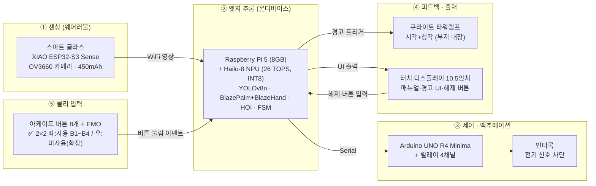
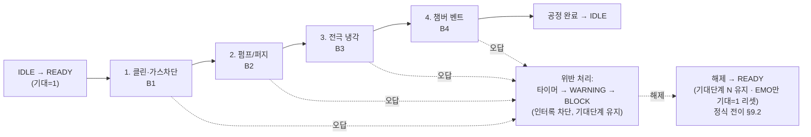
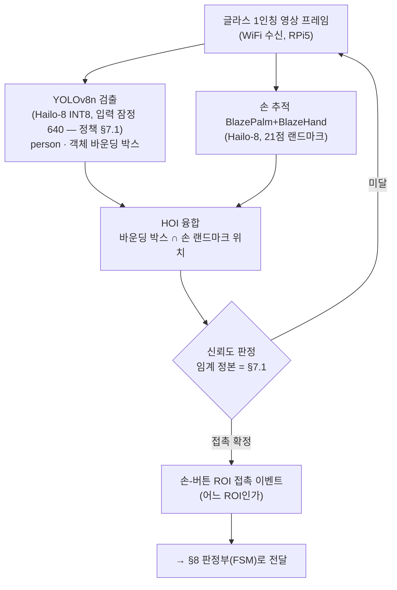
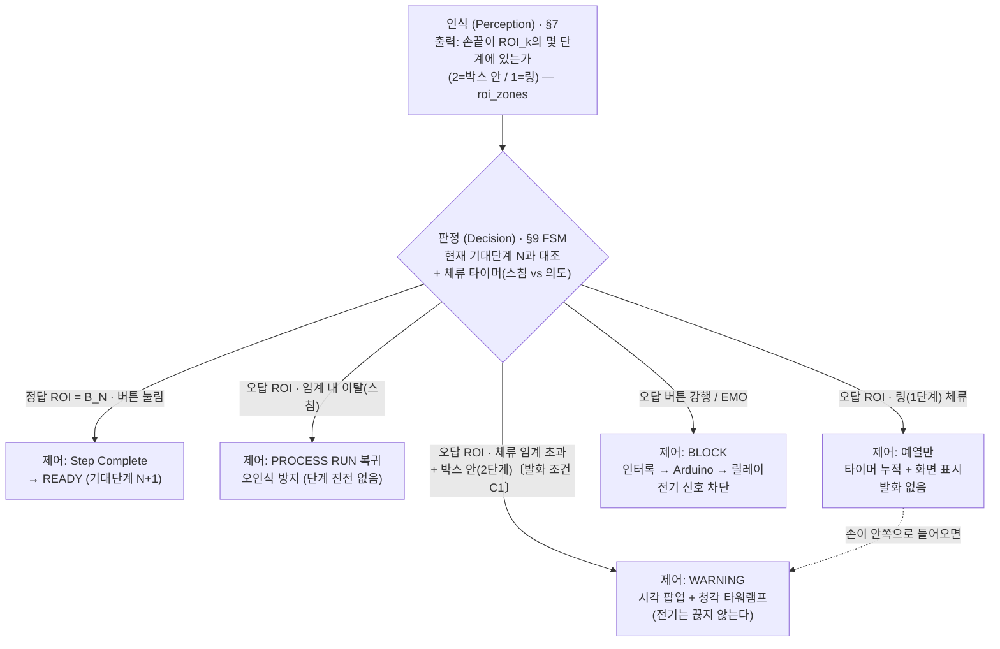
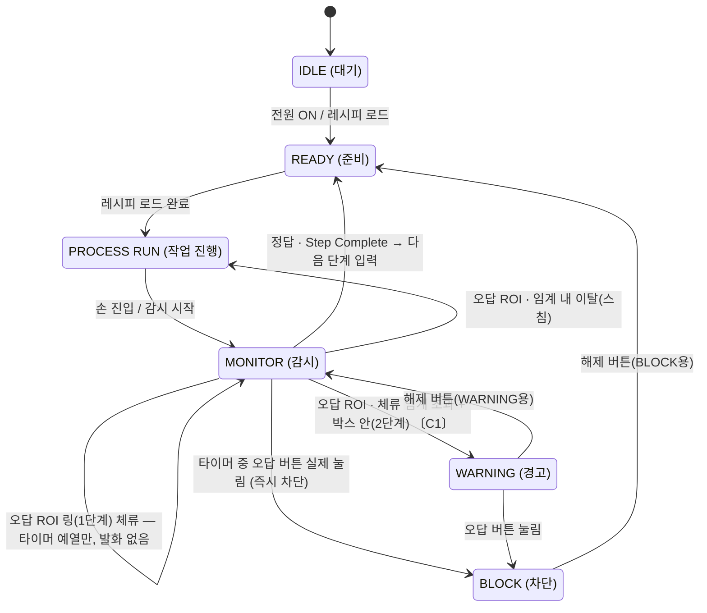

# 통합 수행·설계 문서
### 휴먼 에러 사전 예방 안전 시스템 — 1인칭 Vision AI × 웨어러블 기반 작업 순서 위반 실시간 감지·차단
#### 한국폴리텍대학 청주캠퍼스 · 반도체시스템과 · 4조

---

> ### 📌 문서 안내
>
> **이 문서 하나로 프로젝트가 무엇을·왜·어떻게·어디까지 검증됐는지 모두 알 수 있게 하는 본체 문서**다. 전 14개 섹션(§1~§14)을 모두 담는다.
>
> ### 🤖 이 문서의 소비자 = Claude Code (2026-07-29 명시)
>
> 이 문서는 **Claude Code가 작업 시 참조하는 단일 정본**이다. **사람이 읽기 좋게 정돈하는 것은 목표가 아니며**, 사람용 정리·발표 자료는 **별도로 제작**한다. 이 문서의 역할은 다른 문서를 만들고 고칠 때의 **기준**이 되는 것이다.
>
> - **편집 우선순위**: ① **모순 없음** → ② **폐기/현행 구분의 명확성** → ③ **검색 가능성**. **서술의 매끄러움은 뒤로 둔다.**
> - **분량은 제약이 아니다.** 이력을 지워 줄이지 말고, **폐기 마커로 무효화**하고 남긴다.
> - 🔴 **소비 방식은 RAG가 아니라 `grep` + 범위 읽기다.** 임베딩·벡터 검색이 없어 **의미 유사도가 작동하지 않고**, `grep`은 **매칭된 한 줄만** 돌려준다. 따라서:
>   - **수치는 조건과 같은 줄에 둔다** — 조건이 다른 문단에 있으면 CC는 조건 없이 값만 집는다.
>   - **같은 지표의 값이 여러 개면 반드시 구분 키를 준다** — 현행 측정값은 §10 머리 「현재 확정값」 표가 태그로 구분한다.
>   - **폐기·정정 표지는 리터럴 키 하나로 통일**한다(표기가 갈리면 grep으로 못 거른다).
> - ⚠️ **판단 기준을 사람 독자 기준으로 바꾸지 말 것.** 2026-07-29에 이 선언이 없어 "§10이 76%라 읽기 어려우니 분리하자"는 잘못된 권고가 나왔다. **분리는 grep 대상을 쪼개 CC가 한쪽만 읽는 실패를 만든다 — 하지 않는다.**
>
> - **단일 기준(Source of Truth) = 본 문서**: 설계·사양·배경·SOP·하드웨어·측정은 **이 문서가 단일 정본**이다. 과거 자료·발표 PDF·드라이브 사본과 충돌하면 **항상 본 문서 우선**(아래 「자료 정본」 항과 동일 취지). ※ 모델 명칭(`person_v1`/`console_v1`/`console_v2`) 정합 완료. ※ **일정·작업 상태는 이 문서에서 다루지 않는다**. §12 회로도·핀맵 정본 = repo `dev/interlock`·`dev/glass` 결선도. Google Drive는 대용량 파일·팀 공유용(정본 아님, §14.3). **문서 변경 이력** = 각 §10 절의 유효성 마커 + `git log --follow docs/통합문서.md`. **무엇이 어디 있나** = [`README.md`](../README.md).
> - **상태 표기**: `✅ 확정` / `🔄 검토·진행 중` / `⏸ 보류` / `❌ 폐기` / `[확인 필요]`
> - **구조 형식**: 이브와 제작설계서의 *시스템 구성도·알고리즘 명세서* 형식을 차용(화면설계서 자리를 FSM·AI·공정 로직으로 대체). 형식만 참고하며 그쪽 내용(화면·ERD·코드)은 따르지 않는다.
> - **자료 정본 = 본 문서 + repo**: 설계·사양·로직·결과는 본 통합 문서가 정본이며, 결선도·도식 등은 repo(`dev/*`)와 본문 Mermaid를 정본 초안으로 한다. **Google Drive는 정본이 아니라** 대용량 파일(영상·사진·발표자료) 저장·팀 공유용이다(§14.3). (이전 'Drive 원본 확인 필요' 표기 및 과거 Drive 링크는 폐기·무효)
> - **📖 읽기 순서 설계** *(부차적 — 사람이 통독할 때의 참고 순서이며, CC 소비에는 적용되지 않는다)*: 배경(§2) → 현재문제·개선방향(§3 AS-IS/TO-BE) → 요구사항(§4) → 시스템 개관(§5) → **시연이 무엇인지(§6 공정 시퀀스)** → 그것을 어떻게 인식·판정·차단하는지(§7 AI → §8 연결 → §9 FSM) → 검증·HW(§10~§12) 순으로, 구체적 시연 시나리오를 먼저 보여준 뒤 기술 상세로 들어가도록 배치했다.

## 목차

| # | 섹션 | 요약 |
| --- | --- | --- |
| 1 | 표지·프로젝트 개요 | 프로젝트명·정의·팀(8인)·두 트랙 |
| 2 | 프로젝트 배경·필요성 | 지식 기반 착오, 사후 반응 한계, 피지컬 AI 포지셔닝, 단일 공정 범위 한정, 진척 회고 |
| 3 | AS-IS / TO-BE | 사후 반응 → 사전 차단 레이어(＋α) |
| 4 | 요구사항 정의 | 기능/비기능/시스템/사용자 요구 |
| 5 | 시스템 구성도 | 센싱→추론→제어→피드백→입력 |
| 6 | 시연용 공정 시퀀스 (4단계) | B1~B4 + EMO, 순서 위반 감지 |
| 7 | AI·비전 파이프라인 (독립 A) | YOLOv8n · 손 추적(BlazePalm+BlazeHand) · HOI |
| 8 | 〈연결〉 인식→판정→제어 | AI(§7)와 FSM(§9)을 잇는 다리 |
| 9 | FSM 알고리즘 명세 (독립 B) | 정본 6단계 상태머신 |
| 10 | 성능 검증 데이터 | 학습 결과 · 통합 테스트 · PoC 순서인식 · KPI |
| 11 | 하드웨어 사양·개발 환경 | 확정 사양표 · 개발환경 |
| 12 | 하드웨어 상세 설계(회로도·핀맵) | ✅ 결선도 작성(2026-06-12) + **인터락 전장 실물 결선·E2E 검증 완료(2026-07-15)** — dev/interlock·dev/glass + Drive drawio |
| 13 | 향후 확장 | 핵심에서 분리·보존된 기능 |
| 14 | 부록(소스·형상관리·BOM) | 형상관리 · 소스 · BOM · Drive 사용 방향 |

---

## 1. 표지·프로젝트 개요

| 항목 | 내용 |
| --- | --- |
| **프로젝트명** | 휴먼 에러 사전 예방 안전 시스템 |
| **부제** | 1인칭 Vision AI × 웨어러블 기반 작업 순서 위반 실시간 감지·차단 |
| **한 줄 정의** | 단일 **PECVD(플라스마 화학기상증착) 콘솔**에서 **공정 정비(PM·웻클린 make-safe) 시퀀스의 작업 순서 위반(누락·역순)** 을 비전 AI로 실시간 감지해, **버튼 입력 직전에 감지·경고**하고 **오조작을 강행하면 인터록으로 차단**하는 **휴먼 에러 사전 예방 시스템**(포카요케·인터락 기반). 순서 위반을 막아 공정·설비 손상과 작업자 안전 리스크를 함께 줄인다 |
| **소속** | 한국폴리텍대학 청주캠퍼스 · 반도체시스템과 · 2학년 B반 · 4조 |
| **지도교수** | 허주회 |
| **핵심 키워드** | `#VisionAI` `#EdgeAI` `#Wearable` `#FSM` `#HumanError` `#Pokayoke` |

**팀 구성 (8인)**

| 이름 | 역할 |
| --- | --- |
| 김응민 | 프로젝트 총괄 |
| 김동현 | 기획·발표 총괄 |
| 박송빈 | SW 책임 |
| 이재모 | HW 책임 |
| 김태현 | 운영 지원 책임 |
| 신희재 | SW–AI 데이터 담당 |
| 김선원 | HW 설계·제작 담당 |
| 천희동 | 운영 지원 담당 |

**두 트랙 관계 (한 줄)**
본 과제는 **융합프로젝트실습(학교 캡스톤, 본체)** 으로 진행되며, **한이음 드림업 프로젝트**는 별도 과제가 아니라 그 융합프로젝트의 **예산·멘토링 확보 및 공모전 출품을 위해 연계한 외부 프로그램**이다. (융합프로젝트 2026.02~10 / 한이음 수행기간 2026.04.01~10.30)

> **정의 범위 메모**: "단일 공정 시퀀스 1종의 순서 위반"으로 적용 범위를 **명시적으로 한정**한다(만능 시스템으로 보이지 않도록). (한정 배경·확장 분리 상세 = §2.5)
>
> **목적 프레이밍 메모 (2026-06-13 확정)**: 본 시스템의 핵심 목적은 **작업 순서 위반(휴먼 에러)의 사전 예방**이다. '안전'은 목적이 아니라 그 **결과**(공정·설비 손상 방지 + 작업자 안전 리스크 감소)로 위치시킨다. 라이트커튼·세이프티도어 같은 **직접적 인적 보호장치가 아니며**, '안전'은 인적 안전보다 **공정 안전(make-safe)**에 가깝다. 따라서 '능동형 Fail-Safe'·'(전기 신호) 원천 차단' 같은 과장 표현은 지양하고, 'fail-safe'는 EMO NC 배선 등 **실제로 그러한 부분에만** 한정해 쓴다.
>
> **⭐ 「사전 차단」의 정의 메모 (2026-07-29 명확화)**: 본 시스템의 개입은 **두 층**으로 이루어진다 — ① **버튼 입력 직전의 감지·경고**(비전이 오답 ROI 접근·체류를 읽어 WARNING, 전기는 끊지 않음) ② **오조작 강행 시 인터록 차단**(오답 버튼이 실제로 눌리면 BLOCK). **이 둘의 조합이 본 문서가 말하는 '사전 예방·사전 차단'** 이며, 사고가 나기 전에 막는다는 뜻이다. 정식 명세는 §9.2·§9.3-5·6.
> 🔴 **다만 「누르기 전에 전기를 끊는 물리 차단」(경고 단계에서의 인터록, 이하 '층2')은 아직 설계·구현되지 않았다.** 현재 인터록은 ②에서만 걸린다. 층2가 필요한 이유(체류 0.06~0.14초 위반은 어떤 임계로도 경고가 못 뜬다)와 선행 조건(E2E 오경보 저감 — §10.31)은 §10.22-정정·§10.23 참조. **인용 시 "누르기 전에 전기를 끊는다"로 확대 해석하지 말 것.**
>
> **공정 특정 메모 (PECVD)**: 본 통합 문서는 시연 공정을 **PECVD(플라스마 화학기상증착)** 로 구체화한다. PECVD는 **CVD(화학기상증착) 계열의 한 변형**이다(PECVD ⊂ CVD, 물리기상증착 PVD와는 다른 계열). 현재 4단계 시퀀스(클린·가스차단 → 펌프/퍼지 → 전극 냉각 → 챔버 벤트, §6)가 PECVD **정비(PM·웻클린 make-safe) 절차**와 대응한다(2026-06-07 갱신, 기존 기동 절차 대체). 기존 'CVD·PVD 설비 가정'을 **CVD 계열의 PECVD로 좁힌** 것이다.

---

## 2. 프로젝트 배경·필요성

> 본 배경은 **사회적 바탕 1개 + 제작자(팀) 도출 2개**로 구성한다. 휴먼 에러가 산업적으로 큰 문제라는 **외부·사회적 근거**(§2.1) 위에, 우리 팀이 공정 현장 맥락에서 직접 도출한 **두 가지 문제** — ① 기존 장비의 '사후 반응' 한계(§2.2), ② 작업 순서 위반의 위험성(§2.3) — 를 얹는다.

### 2.1 [사회적 바탕] 휴먼 에러는 산업 전반의 큰 문제다

제조·산업 현장에서 휴먼 에러가 차지하는 비중은 거시적으로도 작지 않다. 제조 품질 결함의 약 **80%** 가 휴먼 에러에서 비롯된다 *(미국 NIST 제조업 손실 분석·국제 공학연구 저널(IJERA) 데이터 기준, 중간발표 자료 재인용)*. 이것이 "왜 휴먼 에러를 다룰 가치가 있는가"에 대한 외부·사회적 근거다.

최근 국내 반도체 현장에서도 화재·유독가스 누출 사고가 단기간에 잇따랐다 — ① **2026.06.01 SK하이닉스 청주 4캠퍼스 화재**(가스룸 화재·불소 누출, 약 3,600명 대피), ② **2026.06.12 같은 캠퍼스 M15X 화재**(같은 달 두 번째), ③ **2026.05.31 충북 보은 반도체 특수가스 업체 폭발**(독성 포스핀(PH3) 누출)(인명 중상 없음). 반도체 공정은 유독가스·화학물질·고온을 다루는 단계가 많다. *(출처: MBC·한국경제·조선비즈, 2026.05~06)*

> ⚠️ 단, 이는 거시 배경일 뿐 본 프로젝트가 그 문제 전체를 푼다는 뜻이 아니다. 본 시스템은 그중 단일 공정의 순서 위반 1종만 다룬다(§2.5).

### 2.2 [제작자 도출 ①] 기존 장비의 '사후 반응' 구조적 한계

우리 팀이 공정 조작 맥락에서 도출한 첫 번째 문제는, 기존 콘솔 장비가 작업자가 **물리 버튼을 누른 '사후'에만 반응**한다는 점이다. 즉 "무엇을 먼저 해야 하는지 알지만 순서를 빠뜨리거나 뒤바꾸는" **지식 기반 착오(Mistake)** 가 이미 입력되어 장비가 오작동한 *뒤에야* 그 사실을 인지하는 구조이며, 이 한계는 두 갈래로 나타난다.

- **사후 대응의 한계** — 사고가 발생한 뒤 보고·조사하는 방식으로는 *예방*이 불가능하다. → **사전 예측·예방형** 안전 장치가 필요하다.
- **인간 주의력 의존의 한계** — 반복 작업과 피로가 누적되면 인지 오류가 생긴다. 순서 검증을 사람의 집중력에만 맡길 수 없다. → 작업 맥락을 인식하는 **안전 알고리즘**이 필요하다.

> 이 도출은 안전공학으로도 뒷받침된다 — NIOSH **통제의 위계(Hierarchy of Controls)** 상, 경고·교육·절차 같은 **행정적 통제**는 사람이 매번 지켜야 해 신뢰성이 낮은 반면, 사람 행동과 무관하게 작동하는 **엔지니어링 제어**가 더 효과적·신뢰성 높은 것으로 분류된다. 본 시스템의 **인터록**이 바로 그 엔지니어링 제어다 *(미국 NIOSH·CDC·OSHA 위험 예방·통제 권고 기준)*. → 사후 경고 위에 사전 인터록을 더하는 §3 TO-BE의 근거.

### 2.3 [제작자 도출 ②] 작업 순서 위반(누락·역순)의 위험성

두 번째로 도출한 문제는 순서 위반 자체의 위험이다. 정해진 공정에는 **반드시 선행되어야 하는 단계**가 있어, 예컨대 가스를 차단하기 전에 다음 단계로 넘어가거나, 전극이 충분히 냉각되기 전에 챔버를 벤트·개방하는(누락) 식으로 단계를 건너뛰거나, 이미 지난 단계로 되돌아가 버튼을 누르면(역순), **장비 오작동·공정 불량·설비 손상, 나아가 작업자 안전 사고**로 이어질 수 있다. 순서 위반은 단순한 실수가 아니라 **앞 단계의 안전 전제가 무너진 상태에서 다음 동작이 실행되는 것**이기 때문에 위험하다. 본 시스템이 겨냥하는 지점이 바로 이 "잘못된 순서의 버튼 입력"이다.

> **🎯 도메인 앵커 — PECVD 웻클린 정비(PM)**
> 본 시스템이 겨냥하는 구체 시나리오는 **PECVD 챔버의 웻클린 정비(maintenance, make-safe) 작업**이다. 정비는 **플라즈마 클린·가스 차단 → 펌프/퍼지 → 전극 냉각 → 챔버 벤트**의 순서가 전부 안전 임계로 묶여 있어, 한 단계라도 누락·역순되면 잔류 가스·고온·잔압이 남은 상태에서 다음 동작이 실행되어 사고로 이어질 수 있다. 본 시스템은 이러한 정비 단계의 순서 위반을 **버튼 입력 직전에 사전 감지·차단**하는 것을 목표로 한다. (공정 4단계 정의는 §6, 시퀀스는 제조사 정비 매뉴얼류에 앵커링)

### 2.4 기술 포지셔닝 — 피지컬 AI(Physical AI)

> **🚀 피지컬 AI의 '눈'을 작업자에게 입힌다**
>
> 화면 속 데이터를 넘어 실세계를 직접 인식하고 물리적으로 행동하는 **피지컬 AI(Physical AI)**는 최근 산업계의 핵심 화두로 떠올랐다 *(젠슨 황(NVIDIA)이 CES 2025·2026 키노트에서 '피지컬 AI'를 차세대 핵심 흐름으로 제시)*. 앞서 짚은 정비 현장의 위험(작업 순서 위반, §2.3·§6)은 모니터 너머가 아니라 **사람의 손이 실제 장비를 다루는 물리 세계**에서 일어난다. 그래서 이런 위험은 데이터를 분석하는 소프트웨어 AI만으로는 막기 어렵고, **실세계를 직접 보고 물리적으로 개입하는 AI**라야 사고 이전에 차단할 수 있다.
>
> 로봇이 사람을 대신해 위험한 일을 떠맡는 흐름은 이미 현실이다 — 현대자동차그룹 무인 소방로봇은 사람이 들어갈 수 없는 화재 현장에 투입돼, 사람 눈이 닿지 못하는 곳을 적외선으로 대신 본다 *(현대자동차그룹이 자사 무인 소방로봇을 공식 'Physical AI' 사례로 소개)*. 같은 이치라면 위험한 반도체 정비도 로봇이 통째로 대신하는 것이 가장 이상적일 것이다. 그러나 위험한 정비를 사람 없이 대신하는 **완전자율 로봇은 아직 상용화되지 않았다.** 그래서 본 프로젝트는 **로봇 본체를 새로 만드는 대신, 피지컬 AI의 핵심인 '비전(눈)'만 떼어내 작업자가 착용하는 웨어러블 스마트 글라스(§5·§11)에 이식**하는 길을 택했다 — 작업자의 몸과 손은 그대로 두고 그 위에 피지컬 AI의 인식·판단을 얹어, **사람이 곧 로봇의 몸, AI가 그 눈과 두뇌가 되는** 구조다.
>
> 그 비전을 중심축으로, 작동은 피지컬 AI의 **폐루프 3요소**를 완성한다: ① 1인칭 비전으로 손동작을 **인식**(눈, §7) → ② SOP 순서 위반을 **판정**(두뇌, FSM §9) → ③ 위반을 **경고**하고 강행 시 **인터록으로 물리 차단**(손발, §8). 사후에 반응하던 기존 안전을 **사고 이전의 인식·개입**으로 바꾸는 것이 본 시스템의 피지컬 AI 포지셔닝이다. *(§3 TO-BE의 '＋α 안전 레이어'와 정합)*

### 2.5 본 프로젝트의 범위 — 단일 공정·순서위반 1종으로 한정

> **🎯 범위 단서 (반드시 함께 읽을 것)**
> 본 시스템은 휴먼 에러 전반을 막는 만능 시스템이 **아니다.** 위 거대한 문제 중에서도 **"작업 순서 위반(누락·역순)"이라는 단일 유형**을, **단일 PECVD 콘솔의 정해진 공정 시퀀스 1종**에 한정해 감지·차단하는 **시스템**이다. (콘솔은 시연용 모조품 — §6.)
>
> 이는 멘토 피드백("벤처급으로 방대한 범위를 학생 학습 목적에 맞게 좁히고 단순화하라")을 반영한 의도적 스코프 설정이며, 검증된 자산(YOLO person 검출, 손-객체 HOI, FSM, 정답/오답 ROI)이 전부 이 단일 시나리오용이라는 점과도 일치한다. 그 외 시나리오(주변 안전 감시·로깅·기타 휴먼에러 등)는 **폐기가 아니라 §13 향후 확장**으로 분리되어 있다.

### 2.6 진척 회고 — 상반기 지연 원인

> 상반기(2~5월) 진행에서 발생한 지연의 배경을 기록한다. 결과보고서·회고 자산으로 보존하는 서술이며, 일정·작업 상태의 실시간 추적은 이 문서의 범위 밖이다.

상반기에는 여러 작업을 착수했으나 준완성(팀 공유·확정 전) 상태가 많았고, 5/27 중간발표 시점의 진척은 제한적이었다. 주요 지연 원인은 다음 네 가지였다.

1. **물품 배송 지연**: 2차 물품이 약 6주간 지연 도착(04.04 신청 → 05.20 도착)하여 하드웨어 통합 착수가 밀렸다.
2. **1차 물품 성능 부족**: 초기 확보한 부품의 성능이 부족해 AI 가속기를 추가 발주(3차, 05.13)했다.
3. **초기 기획 완성도 부족**: 범위가 방대해 핵심 시나리오 확정·문서화가 늦어졌고, 이후 범위 축소(PECVD 순서 위반 감지로 한정)로 재정비했다.
4. **학사 일정 집중**: 중간고사·체육대회 등 학사 일정과 겹쳐 개발 가용 시간이 줄었다.

> 위 지연을 반영해 6월 이후 일정을 현실적으로 재수립했으며, 일정 추적 자체는 이 문서에서 다루지 않는다.

---

## 3. AS-IS / TO-BE

> 기존 콘솔(AS-IS)과 본 시스템(TO-BE)의 1:1 대응. 핵심 메시지는 **"대체가 아니라 에러 예방(안전) 레이어의 추가"** 다. §2 배경에서 도출한 두 문제(사후 반응·순서 위반)에 대한 개선 방향을 보인다.

| 구분 (비교 축) | AS-IS (기존 콘솔) | TO-BE (본 AI 콘솔) |
| --- | --- | --- |
| **Viewpoint (시점)** | 3인칭 고정 CCTV | **작업자 1인칭** 웨어러블 스마트 글라스 |
| **Timing (반응 시점)** | 물리 버튼이 눌린 **'사후'에만** 반응 (오작동 후 인지) | 버튼 입력 **직전에 감지·경고**하고 **강행 시 차단**하는 **레이어를 추가** |
| **순서 검증 방식** | 순서 위반을 **작업자의 주의력에 의존** | **비전 AI가 ROI 기준으로 자동 판정** (정답/오답 분기) |
| **Response (대응 대상)** | **관리자**에게 알림 | **작업자 본인**에게 즉시 알림·피드백 |
| **사고 대응 (차단)** | 오작동 발생 후 **보고·조사**(사후 처리) | **오조작 강행 시 인터록으로 전기 신호 차단**(사고 이전 개입). ※본 시연은 실장비 없이 타워램프로 시각화 |
| **Processing (처리)** | **클라우드 서버** | **엣지 온디바이스**(Pi5 + Hailo-8) |

> **💡 핵심 메시지 — 플러스알파(＋α)**
> 본 시스템은 기존 콘솔을 **대체하거나 부정하지 않는다.** 기존 콘솔의 '사후 반응' 위에 **'버튼 입력 직전의 감지·경고 + 강행 시 차단 레이어'를 얹는** 개선이다(두 층의 정의 = §1 메모). 즉 기존 장비와의 대결 구도가 아니라, 그 위에 **에러 예방(안전) 레이어를 더하는(＋α)** 구조다.
>
> **구현 순서**: 사전 예방 레이어(본 시스템)를 **먼저 구현**하고, 기존 콘솔 계열 기능(와이드뷰 카메라·관리자 경고 해제 등)은 이후 **추가 확장**한다(§13).

---

## 4. 요구사항 정의

> 핵심 시나리오(작업 순서 위반 감지·차단)를 기준으로 한 요구사항이다. 촉각(진동 팔찌 햅틱)·로깅·주변 안전 감시 등은 핵심 범위 밖(§13 확장)이므로 여기 포함하지 않는다.

### 4.1 기능 요구사항 (Functional Requirements)

| ID | 요구사항 | 설명 | 상태 |
| --- | --- | --- | --- |
| **FR-1** | 작업 순서 위반 감지 | 현재 기대단계 N 기준, **정답 ROI 외의 버튼 ROI**에 손이 접근하면 누락·역순을 위반으로 판정 | ✅ 확정 |
| **FR-2** | 시청각 피드백 | 위반 시 **시각(화면 팝업) + 청각(타워램프·부저)** 2층 피드백 출력 | ✅ 확정 *(촉각은 §13 확장)* |
| **FR-3** | 인터록 차단 | 오조작 강행 시 **장비로 가는 전기 신호를 차단**(인터록). ※본 시연은 타워램프로 시각화 | ✅ 확정 |
| **FR-4** | 작업자 본인 해제 | 경고·차단 상태를 **작업자 본인이 디스플레이의 해제 버튼**으로 복구 (WARNING→감시 복귀 / BLOCK→준비 복귀) | ✅ 확정 *(관리자 승인 에스컬레이션은 §13)* |

### 4.2 비기능 요구사항 (Non-Functional Requirements)

| ID | 요구사항 | 목표값 | 상태 |
| --- | --- | --- | --- |
| **NFR-1** | 실시간 처리 | **15 fps** 안정 처리 (2026-06-13 하향 확정) | ✅ **충족 (2026-08-10, §10.34)** — HOI 포함 **23.96 fps**(손 검출 OFF 26.27), 15fps 미만 프레임 93%→15%. **ESP32 펌웨어 3줄**(`fb_count=2`·`GRAB_LATEST`·`setSleep(false)`)로 해결. 🔴 **단 손 없는 정지 장면·단일 조건**이며 **최저 5.1fps 구간**이 남아 있다 — "안정 처리"까지 단정하지 말 것. ⚠️ **감지 성능에 직결** — §10.29⑥대로 **FPS가 곧 허용 눌림 속도**(5프레임 경계 → 15fps면 0.33초, 24fps면 0.21초) |
| **NFR-2** | 응답시간 | 시각·청각·인터록 응답 **≤ 100 ms** | 🔄 목표값 — 데모 구동 시 실측 검증 필요. **⭐ 이 값의 단일 정본 = 이 행**(§8·§9.4·§10.4는 포인터만) |
| **NFR-3** | Edge 온디바이스 추론 | 클라우드 의존 없이 **엣지(RPi5 + Hailo-8)에서 온디바이스 추론** | ✅ 확정 |

### 4.3 시스템 요구사항 (한 줄)

**"FPV 단일 비전 + FSM 6상태 + 인터록 아키텍처를 구현한다."** — 즉 1인칭 웨어러블 카메라 한 대의 영상으로 손-ROI를 판정하고, 6단계 유한 상태 머신(FSM 6상태 정의는 §9)으로 정상/위반을 분기하며, 위반 강행 시 인터록으로 전기 입력을 차단하는 구조를 갖춘다. (Wide-View 주변 감시 병렬 구성은 §13 확장)

### 4.4 사용자 요구사항 (한 줄)

**"작업자가 잘못된 순서를 시도하면 시스템이 이를 감지하고, 시청각으로 피드백하며, 필요 시 입력을 차단한다."** (작업자 관점)

---

## 5. 시스템 구성도

> 핵심 시연 구성은 **FPV 단일 비전 + 엣지 온디바이스 추론 + 인터록 제어 + 시청각 피드백**이다. Wide-View 주변 감시(고정 카메라 병렬)와 진동 팔찌(촉각)는 핵심 구성에서 제외되어 §13 확장에 있다.

### 5.1 시스템 구성 블록도



> 정밀 결선·전원 계통이 포함된 회로도·핀맵은 **§12 및 repo `dev/interlock`·`dev/glass` 결선도** 참조.

### 5.2 통신 경로 (정본)

> 본 프로젝트 통신 경로의 **단일 정본 표**다. (위 §5.1 블록도가 같은 경로를 그림으로 보인다.)

| 구간 | 방식 | 내용 |
| --- | --- | --- |
| 글라스 → RPi5 | **WiFi** | 1인칭 영상 프레임 전송 |
| RPi5 → Arduino | **Serial** | 인터록 제어 신호 |
| RPi5 → 타워램프 | 신호 출력 | 위험도별 점멸·경고음 트리거 |
| RPi5 ↔ 디스플레이 | 출력 + 해제 입력 | 매뉴얼·경고 UI 출력 / 해제 버튼 입력 수신 |
| 버튼 → RPi5 | 디지털 입력 | 버튼 눌림 이벤트 |

> ※ **핵심 경로**: ESP32-S3(WiFi 영상) → RPi5(AI 분석) → Arduino(Serial 인터록).
> ※ ESP32-C3(BLE 햅틱)는 핵심 통신 경로에서 **제외**(§13 확장).
> ※ **WiFi 접속 흐름**(전원 ON→접속→영상 전송)은 FSM 상태 전이가 아니라 **통신 초기화 시퀀스**이므로 §13.3에서 별도로 관리한다.
> 통신 핀 결선·회로 정밀 사양은 §12(회로도·핀맵) 참조.

### 5.3 구성 요소 요약 (블록도 판독용)

> 전체 **확정 하드웨어 사양표**는 §11에서 정리한다. 여기서는 블록도를 읽는 데 필요한 수준만 요약한다.

- **메인 허브** ✅: Raspberry Pi 5 (8GB)
- **AI 가속기 (주)** ✅: Hailo-8 (26 TOPS, INT8) — M.2 PCIe Gen3. *예비: Hailo-8L(13 TOPS)은 비상 대체용일 뿐 **주 사양으로 인용 금지**(§11).*
- **스마트 글라스** ✅: XIAO ESP32-S3 Sense (OV3660, WiFi 영상)
- **인터록 제어** ✅: Arduino UNO R4 Minima(주)/R3(예비) + 릴레이 4채널(주)/8채널(예비)
- **경보** ✅: 큐라이트 타워램프(부저 내장 — 별도 부품 아님)
- **터치 디스플레이** ✅: 제우스 Z10 10.5인치 — **출력 전용**(입력 아님), 단 해제 버튼 UI는 여기 배치
- **물리 입력 버튼** ✅ (2026-06-09 배치 확정): 동일 아케이드 버튼 **8개**(4색 흰·검·핑크·노랑 ×2개씩) + 비상정지(EMO). **좌 2×2 = 사용(하드웨어 연결) B1~B4 / 우 2×2 = 미사용(확장용)**. 색↔단계 = **B1 노랑·B2 흰·B3 핑크·B4 검정+🔵파랑 원 스티커**. 좌·우 색 중복은 **미사용(우) 버튼 클릭면 스티커**로 구분, 비전은 **사용(좌) 그룹만 ROI**로 인식.
  - 🔵 **B4 스티커 폴백 발동(2026-07-13 확정, §10.12)**: 당초 "검정은 무광 배경·유광 버튼 대비로 검출, **미흡 시 스티커 폴백**"으로 설계했는데, **그 미흡이 실제로 확인**됐다(검정 버튼 on 검정 패널 → 대비 8~15/255, ESP32에서 B4 검출 0%). → **버튼 면에 파랑 원 스티커 부착**. 채도 대비 ΔS 9.1 → **98.0**(10.8배), 블러·JPEG·저해상도에 **무손상**. B4가 색으로 구분되는 클래스가 됐다.
> **버튼 배치도 (2×2, 1인칭 시야 가운데 집중 — PoC 성공 배치 재현)**
> ```
>    사용(B1~B4) ─ 하드웨어 연결        미사용(확장) ─ 클릭면 스티커
>      [B1 노랑①] [B2 흰 ②]              [ ] [ ]
>      [B3 핑크③] [B4 검정+🔵파랑스티커④]   [ ] [ ]
>          순서 ①→②→③→④ (Z자)              · EMO는 별도 배치
> ```
  - 🆕 **실콘솔 전면부(포맥스판) 제작 완료 (2026-08-06)** — 시연용 모조 콘솔과 **별개의 실물**이다. 전면 포맥스판에 버튼만 꽂아 배선까지 마친 상태이며 **프레임 조립 전**이다. 실측·검증 = **§10.32**.
    - **버튼 5개만 쓴다** — 모조 콘솔에 있던 미사용 확장 2×2(4개)는 **두지 않는다. 확장하지 않는 방향으로 확정**(2026-08-06). 비전이 볼 오검출 소스가 그만큼 줄었다.
    - **EMO 위치가 바뀌었다** — 모조 콘솔은 2×2 **한가운데**(실측 y=280, 상단열 187·하단열 366 사이), 포맥스판은 **최하단 중앙**(실측 y=412, 하단열보다 94px 아래). 🔴 이 변경이 §10.32의 **EMO 오판정** 문제와 직결된다.
    - **버튼 간격이 넓어졌다** — 세로 간격/버튼폭이 모조 4.7배 → 포맥스 **6.4배**. ROI 박스가 겹칠 여지가 줄어 오판정에는 유리하다.
    - **B1~B4·EMO ↔ GPIO 매핑은 모조 콘솔과 동일**(B1 GPIO5·B2 GPIO6·B3 GPIO13·B4 GPIO19·EMO GPIO26). 실기 4회 반복 검증(§10.32).
    - 🔴 **현재 배선은 짧은 점퍼로 임의 연결한 임시 상태다** — 2026-08-10 배치 변경 중 **B3 간헐 무응답**(접촉 불량)이 실제로 발생했다. **실콘솔 전장 구성 시 선 길이 여유·장력 분리 방안 = [`dev/interlock/결선도_초안.md`](../dev/interlock/결선도_초안.md) §7.5**(정본).
> ## ⭐ 버튼 배치도 — 실콘솔 전면부 포맥스판 **(2026-08-10 확정 · 정본)**
> ```
>      [B2 흰 ②] [B3 핑크③]        ← 상단열
>      [B1 노랑①] [B4 파랑④]        ← 하단열
>            [EMO]                  ← 최하단 중앙 (별도 행)
>      순서 ①좌하 → ②좌상 → ③우상 → ④우하  (반시계 U자)
>      · 미사용 확장 버튼 없음
> ```
> **결정 근거 (2026-08-10)** — **`console_v2`의 학습 데이터가 모조 콘솔 배치로 만들어졌기 때문**이다(§10.13·§10.18). 배치를 학습 분포와 맞추면 **위치 학습에 의한 오분류가 줄어든다** — 실측으로 B3→B1 오분류가 **7.5% → 4.2%**로 감소했다(§10.33-(1)). 재학습 없이 물리 배치만 바꿔 얻는 이득이라 비용이 없다.
> 🔵 **EMO만 예외로 최하단 중앙에 둔다** — 모조 콘솔은 2×2 한가운데였으나 ①포맥스판에 그 자리 구멍이 없고 ②가운데 두면 **B3로 뻗는 손이 EMO 박스에 걸쳐 오경보를 낸다**(§10.32-(6)①). 떨어뜨리는 편이 유리하다.
> ⚠️ **색↔GPIO 매핑·FSM 순서는 그대로다** — B1 노랑 GPIO5 · B2 흰 GPIO6 · B3 핑크 GPIO13 · B4 파랑 GPIO19 · EMO GPIO26, 순서도 B1→B2→B3→B4. **바뀌는 것은 화면상 자리와 손 이동 경로뿐**(Z자 → 반시계 U자)이라 코드 수정이 필요 없다.
>
> <details><summary>이전 배치 (2026-08-06 제작 당시, 폐기)</summary>
>
> ```
>      [B1 노랑①] [B2 흰 ②]
>      [B3 핑크③] [B4 파랑④]
>            [EMO]
>          순서 ①→②→③→④ (Z자)
> ```
> 제작 당시에는 §5.3 배치도(위 2026-06-09 항목)를 따라 만들었으나, **그 배치도가 모조 콘솔 실물과 어긋나 있었다**(아래 대조표). 학습 데이터와 맞추기 위해 2026-08-10에 위 배치로 변경했다.
> </details>
> ### 배치 통일 경위 (2026-08-06 발견 → 2026-08-10 해소)
>
> | 화면 자리 | **모조 콘솔** = 학습 데이터 | 포맥스판 (제작 당시, 폐기) | **포맥스판 (현행 확정)** |
> |---|---|---|---|
> | 좌상 | B2 흰 | B1 노랑 | **B2 흰** ✅ |
> | 우상 | B3 핑크 | B2 흰 | **B3 핑크** ✅ |
> | 좌하 | B1 노랑 | B3 핑크 | **B1 노랑** ✅ |
> | 우하 | B4 파랑 | B4 파랑 | **B4 파랑** ✅ |
> | EMO | 2×2 한가운데 | 최하단 중앙 | **최하단 중앙** 🔵 (의도적 예외) |
>
> **경위** — `console_v2`의 학습 데이터(§10.13·§10.18)는 전부 모조 콘솔로 찍었는데, 포맥스판은 제작 당시 §5.3 배치도(2026-06-09)를 따라 만들어 **학습 분포와 세 자리가 어긋났다**. 특히 **학습에서 좌하는 B1(노랑)**인데 포맥스판에서는 **좌하에 B3(핑크)**가 왔고, 실측 오분류가 정확히 **B3 → B1**이었다(§10.32). → 2026-08-10에 배치를 학습 분포로 통일해 **오분류 7.5% → 4.2%** 감소를 확인했다(§10.33-(1)).
> ※ §5.3 배치도(2026-06-09, 위 항목)는 **모조 콘솔 실물과 불일치**한다 — 배치도가 만들어진 뒤 모조 콘솔이 다르게 조립된 것으로 보인다. **실물·학습 데이터가 정본이며, 현행 확정 배치는 위 ⭐ 배치도다.**
- **외장재** ✅: 알루미늄 프로파일(DF3030) + MDF/포맥스
- *고정 카메라(ABKO APC900): Wide-View 주변 감시 용도는 §13 확장. 진동 팔찌(XIAO ESP32-C3): §13 확장.*

---

## 6. 시연용 공정 시퀀스 (4단계)

> ✅ **시연용 "공정 시퀀스 1종" 정본(2026-06-04 확정 → 2026-06-07 PECVD 정비(PM·웻클린 make-safe) 시퀀스로 갱신).** 핵심 시나리오 "작업 순서 누락/위반"을 시연하기 위한 4단계 공정이다. 기존 기동(운전) 시퀀스 대신, "모든 단계가 안전 임계라 한 단계라도 누락·역순되면 사고"라는 조건에 더 부합하는 **정비(make-safe) 시퀀스**(클린·가스차단 → 펌프/퍼지 → 전극 냉각 → 챔버 벤트)로 확정했다. **이 시퀀스가 이후 §7 AI 인식·§8 연결·§9 FSM이 다루는 구체적 대상**이므로 여기서 먼저 정의한다. (FSM 6상태 정의는 §9 참조) (2026-06-07 브레인스토밍 재설계)

> ### ⚠️ 콘솔 구성·라벨 주석 (반드시 읽을 것)
> 이 콘솔에는 **디스플레이·물리 버튼(다수)·타워램프·비상정지(EMO) 버튼만** 있고, **플라즈마 클린·가스 차단·펌프/퍼지·전극 냉각·챔버 벤트 등 실제 PECVD 정비 공정을 수행하는 기능은 없다.** 아래 단계명("클린·가스차단", "펌프/퍼지" 등)은 **버튼에 붙인 라벨(이름표)일 뿐 실제 물리 동작을 일으키지 않는다.** 버튼을 눌러도 가스가 차단되거나 챔버가 벤트되지 않는다. 시연이 증명하는 것은 오직 **"정해진 순서대로 버튼을 눌렀는가 / 순서를 위반했는가"를 비전 AI가 감지·차단**하는 것이다. (§2.5 "단일 공정 범위 한정" 전제와 정합)

### 6.1 4단계 공정 + 비상정지

| 단계 | 버튼 라벨 | 정답 ROI | 오답(위반) ROI | 오답 시 동작 (전이) | 정답 시 전이 |
| --- | --- | --- | --- | --- | --- |
| **1** | 클린·가스차단 (플라즈마클린 CF₄/O₂ + SiH₄ 차단) 〔노랑〕 | **B1** | B2·B3·B4 (누락=뒤 단계 건너뜀) | 오답 ROI→타이머→(스침)PROCESS RUN 복귀 / (체류)WARNING→해제 시 MONITOR / 오답 누름 시 BLOCK→해제 시 READY (**기대단계=1 유지**) | B1 정답→Step Complete→READY(기대=2) |
| **2** | 펌프/퍼지 (N₂ ≥2사이클) 〔흰〕 | **B2** | B1(역순)·B3·B4(누락) | 〃 (BLOCK 해제 시 **기대=2 유지**) | B2 정답→READY(기대=3) |
| **3** | 전극 냉각 (~300℃) 〔핑크〕 | **B3** | B1·B2(역순)·B4(누락) | 〃 (**기대=3 유지**) | B3 정답→READY(기대=4) |
| **4** | 챔버 벤트 → 개방 〔검정〕 | **B4** | B1·B2·B3(역순) | 〃 (**기대=4 유지**) | B4 정답→공정 완료→IDLE |
| **공통** | 비상정지 (EMO) | — | — (위반 판정 대상 아님) | EMO 누름 → **즉시 BLOCK**(안전 정지), 해제 시 **READY 복귀 + 기대단계=1로 리셋**(시퀀스 전체 중단·재시작) | — |

- **판정 규칙(한 줄)**: 시스템이 기대단계 N을 들고 있고, **BN ROI = 정답 / 그 외 공정 버튼 ROI = 오답.** 이 규칙 하나로 누락(뒤 버튼)·역순(앞 버튼)이 모두 잡힌다.

> ### ⭐ ROI는 「사각 도넛」 2단계다 (2026-07-22 확정, 근거 §10.22)
>
> ROI는 고정 좌표가 아니라 **YOLO가 검출한 버튼 박스 그 자체**다(1인칭이라 박스가 버튼을 따라다닌다). 그 박스를 상하좌우로 넓힌 테두리를 **링**으로 두어 구역을 두 단계로 나눈다.
>
> ```
>   ┌─────────────────────────┐
>   │  1단계 = 링 (25px)       │  접근 — 체류 타이머 예열 + 화면 경고 표시만
>   │   ┌─────────────────┐   │
>   │   │  2단계 = 검출 박스 │   │  위험 — 여기서만 WARNING이 발화한다
>   │   └─────────────────┘   │
>   └─────────────────────────┘
> ```
>
> - **발화 조건 = C1** — **체류 임계 도달 + 손끝이 「박스 안(2단계)」일 때만** WARNING으로 간다. 링에서는 타이머가 누적되기만 하고 **아무 일도 일어나지 않는다.** (링에서도 발화하는 C2안은 오경보가 2배 이상이라 채택하지 않았다.)
> - **왜 나눴나** — 단순히 ROI를 넓히면 넓힌 구역을 안쪽과 **똑같이** 취급해 오경보가 늘어난다. 도넛은 **넓히되 단계를 나눠** 그 대가를 없앤 것이다. 결과: 개입 감지 62% → **92%**, 오경보 분당 1.1회.
> - **겹침 규칙** — ①**안쪽이 링을 이긴다**(A의 안쪽이면서 B의 링이면 A) ②같은 단계끼리 겹치면 **더 작은(가까운) 박스 우선**.
> - **판정 규칙의 단일 출처 = `Rpi5/Demo/roi_zones.py`** — 런타임과 측정 도구가 같이 import한다. **이 규칙을 바꿀 때는 그 파일만 고친다.**
> - 🔴 **롤백 스위치**: 링 폭을 **0**으로 두면 도넛이 꺼지고 도입 전과 **완전히 동일**하게 동작한다. 링 폭 정본값은 §9.4.
- **핵심 불변식**: 오답은 단계를 **절대 진전시키지 않는다.** 위반으로 BLOCK까지 가서 해제해도 기대단계는 유지된다(예: 2단계 위반 차단 후 복구해도 여전히 2단계).
- **역순/누락 구분**: 1단계는 앞 단계가 없어 오답이 전부 '누락', 4단계는 뒤 단계가 없어 전부 '역순', 2·3단계는 양쪽 모두 존재.
- **EMO 성격**: EMO는 오답 판정을 거치지 않는 **긴급 안전 정지**라 오답 버튼과 성격이 다르다. 전이·해제 규칙 정본은 **§9.2 「EMO 공통 경로」**(위 표의 공통 행이 그 요약).

### 6.2 정상 / 이상 흐름



### 6.3 사용자 흐름 시나리오 (착용 → 기동 → 작업 → 감지 → 피드백/차단)

> 시청각 2층 피드백 기준(촉각/햅틱은 §13). FSM 상태·전이 상세는 §9.

- **도입**: 글라스 착용·전원 ON → WiFi 영상 연결(접속 과정은 §13.3 별도 통신 시퀀스) → 레시피 로드 → FSM **IDLE→READY**(기대=1)
- **정상**: 각 단계 BN ROI 진입 → MONITOR 정답 → 누름 → Step Complete → READY 복귀(기대 N+1). B4 완료 시 IDLE
- **이상**: 오답 ROI 진입 → 타이머 → (스침)복귀 / (체류)**WARNING**[시각 팝업 + 청각 타워램프] → 해제 버튼 시 MONITOR 복귀 / 오답 강행 시 **BLOCK** → 인터록 전기 차단 → 해제 버튼 시 READY 복귀

> §9.2 상태도·§6.2 흐름도는 본문 Mermaid를 정본 초안으로 한다(정식 도식은 추후 repo에 작성 예정).

---

## 7. AI · 비전 파이프라인 〔독립 섹션 A〕

> "인식" 단계를 담당하는 비전 파이프라인을 독립적으로 기술한다. 앞 §6 시연 시퀀스의 버튼을 인식 대상으로 하며, 이 파이프라인의 **출력**(손-버튼 ROI 접촉 이벤트)이 §8을 거쳐 §9 FSM의 입력이 된다.

### 7.1 스택 구성 (확정)

| 구분 | 확정 내용 | 상태 |
| --- | --- | --- |
| 객체 검출 | YOLOv8n (Hailo-8, INT8). **모델 3단계 = `person_v1` → `console_v1` → `console_v2`(현행 배포본).** 각 단계의 정의·판정 상태는 **아래 「모델 네이밍 규약」이 정본**이다(여기 중복 기재하지 않음) | ✅ ① / ✅ ② / ✅ ③ — 상세는 아래 규약 |
| 입력 해상도 | **640×640**(HEF 빌드 규격 — v1·v2 동일, 파이 배포본도 640). **결정 규칙(2026-06-13)**: HOI 포함 FPS 실측 후 15fps 미달이면 **QVGA(320) 고려**, 충분하면 640 유지 + SW 최적화 | ⚠️ **640 유지(현행)** — 단 규칙의 발동 조건은 충족됐다(§10.21 HOI 포함 11.0fps < 15). **QVGA 검토는 미실시** |
| 손 추적 | **BlazePalm(팜 검출) + BlazeHandLandmark(21점)** — 구글 MediaPipe **모델**을 Hailo `.hef`로 변환해 **NPU에서** 실행. 런타임 = `Rpi5/Demo/hand_tracker.py` | ✅ **통합 완료(2026-07-22)** — 손끝(랜드마크 8 = 검지 끝) → ROI 판정 → FSM 경로 연결 |
| HOI 분석 | 손 랜드마크 검지끝 좌표 + YOLO 버튼 ROI **겹침 판정**(사각 도넛 2단계 — §6.1) → 손-버튼 접촉 이벤트 | ✅ 실HW 실측 완료(§10.21~§10.31) |
| HOI 신뢰도 임계값 | **이중 0.70 / 0.55** (설계 초안값) | ⚠️ **미검증 설계값 — 실제 운용값이 아니다**(아래 주석). **이 값의 단일 정본 = 이 행**(§7.2·§9.4는 포인터만) |
| 데이터셋 | Roboflow 커스텀 라벨링. **현행 버튼 검출 = `eung-min/console_v2-mjefr`**(v2 학습분 652장 + 클린룸 배분분, §10.13·§10.19) / v3 후보 = `console_v3`(§10.20, 재학습 보류). ※`cleanroom_person_detection_v3`는 **초기 `person_v1` 전용**(§10.1) | ✅ |
| 모델 변환 | Hailo DFC(3.33.1) → **HEF**(입력 uint8 640×640, HailoRT NMS 내장, HailoRT **4.x 필수**). v1 상세 = `dev/ai_model/참고/YOLOv8n_Hailo8_변환_작업기록.md`, **v2 절차 정본** = `dev/ai_model/console_v2_학습가이드.md` §④ | ✅ v1 / ✅ **v2 변환·파이 배포 완료**(§10.15) |

> **⚠️ 「HOI 이중 신뢰도 0.70 / 0.55」의 지위 (2026-07-29 정리)**: 이 값은 **설계 초안 단계의 수치이며, 파이에서 실제로 쓰이는 임계가 아니다.**
> - **근거를 추적할 수 없다** — 출처가 "기준문서 §7"인데 그 기준문서는 다시 본 문서 §9.4를 가리켜 **순환**한다. §10 어디에도 이 값을 측정하거나 채택한 기록이 없다. ※ 기준문서(`프로젝트_기준문서_v9.md`)는 **2026-07-30 폐기**됐다 — 이 순환이 폐기 근거의 하나였다(전문은 git 이력에 보존).
> - **실제 운용 임계는 따로 있고, 종류도 다르다** — ①**버튼 검출** conf `YOLO_CONF_HIGH 0.65` / `YOLO_CONF_LOW 0.50`(§10.20에서 **0.65가 최적점**으로 확정, 변경 근거 없음) ②**손 랜드마크** `HAND_MIN_SCORE 0.2`(§10.25) ③**팜 검출기 내부** 임계 0.5(§10.25에서 발견 — `config.py`에 노출조차 안 돼 있었다). **어느 것도 0.70/0.55가 아니다.**
> - ⚠️ **§10.18의 중단 규칙에 등장하는 0.70**(`bench_detector.CONF_WARN`)은 **또 다른 값**이다. 세 가지를 혼동하지 말 것.
> - 🔴 **따라서 이 값을 "확정 사양"으로 인용하지 말 것.** 실제 판정 임계를 말할 때는 위 ①~③ 중 어느 것인지 명시한다. 이 행의 정리(무엇을 재는 임계인지 재정의할지, 폐기할지)는 **미결**이다.

> **🖐️ 손 추적 스택 이력 (2026-07-29 갱신)**: 종전 이 표는 손 추적을 **"MediaPipe 0.10.x (CPU) — ⚠️ Python 3.13/aarch64 미지원으로 HOI 보류"** 로 적고 있었다. **그 블로커는 2026-07-21에 소멸했다** — `hailo_platform`이 Python 3.13 전용이라 MediaPipe **프레임워크**는 이 파이에 설치할 수 없지만, **구글 MediaPipe의 모델 자체**(BlazePalm·BlazeHandLandmark)는 이미 Hailo `.hef`로 포팅돼 있고 의존성이 `hailo_platform`+numpy+cv2뿐이라 **3.13 문제가 원천 소멸**한다. **모델은 같고 실행 경로만 다르다**(CPU → NPU). 2026-07-22에 `hand_tracker.py`로 통합돼 버튼·팜·핸드 3모델이 한 `VDevice`를 공유한다(`hailo_device.py`). 상세 = `docs/superpowers/specs/2026-07-21-HOI-경로-design.md`.

> **🔖 모델 네이밍 규약 (정본, 3단계)**: ①`person_v1.pt` = **초기 검증**(person 단일·mAP50≈0.96 완료) → ②`console_v1`(.pt/.onnx/.hef) = **버튼검출 1차 검증 테스트·검증 모델**(5클래스 B1~B4+EMO. Hailo 경로·버튼 동적검출 파이프라인 **검증 완료**. 2026-06-11 실추론 벤치마크: B1·B2·B3·EMO 검출 확인, **B4 완전 미탐지**(ESP32 경로) — **원인 재분석 §10.7**(양자화 반증·카메라 입력 품질 주가설·모델 저대비 부가설, 미확정). **→ console_v2 재학습 확정**) → ③`console_v2` = **최종 시연 모델**(~~정확도 보강 재학습, GPU+캘리브 1024+장, 추후~~ → ✅ **파랑 스티커 데이터셋 652장 재학습·.hef 변환·⑤replay 완료(2026-07-16~17, §10.14~§10.17) → 파이 배포·현행 운용본**. **B4 판정: 1차(모조 콘솔·클린룸 형광등) 정량 채점 합격**(AP50 0.997, §10.20) / 🔴 **2차(실콘솔 포맥스판) = §10.16의 최종 판정 — 미실시**. ※"GPU+캘리브 1024+장" 처방은 **무효 판명**(§10.15) — 실적용 = `optimization_level=1` 명시 + 캘리브 652). §10의 mAP 0.96은 **person_v1** 결과다. **console_v1은 "버튼검출이 되는지" 검증 완료**이고, 시연 KPI 실측·최종 정확도는 **console_v2** 기준이다. 모델 인용 시 이 규약을 단일 기준으로 한다.

> **🎯 (이력) console_v2 재학습 SW 목표치 (2026-06-29 발표 반영) — ⛔ 폐기, 결과로 대체 판정(2026-07-29)**
> 당시 목표는 데이터셋 **버튼 클래스당 1,000장**(버튼 외 500~700장) · **오탐지율 ≤ 10%** · **클래스 신뢰도 ≥ 90%** 였고, **B4 미탐지의 부 가설(모델 저대비) 대응**으로 세운 대리 지표였다(주 가설=카메라 입력 품질은 데이터 보강으로 해결되지 않아 별도 축).
> 🔴 **실제 v2는 총 652장으로 학습됐다**(§10.13·§10.15) — 장수 목표는 **미달**이다. 그러나 ①**B4의 진짜 해법은 데이터 증량이 아니라 파랑 스티커라는 물리 개선이었고**(§10.12), ②그 결과 **누출-프리 정량 채점에서 mAP50·recall·오분류가 모두 기준을 통과**했다(§10.20). **대리 지표(장수)가 겨냥하던 목적(정확도)을 직접 측정해 달성했으므로 장수 목표는 유지할 근거가 없다.**
> ⚠️ §10.7·§10.8·§10.9가 이 목표치를 처방으로 인용하지만 **그것들은 시간순 기록이므로 당시 서술 그대로 둔다.** 현행 판단은 이 문단이다.

### 7.2 알고리즘 명세 — 손-객체 상호작용(HOI) 인식

**흐름도**



**처리 시나리오 (번호)**

1. ESP32-S3 글라스가 WiFi로 1인칭 영상 프레임을 전송 → RPi5 수신
2. YOLOv8n(Hailo-8, INT8)으로 프레임에서 person·객체 바운딩 박스 검출 *(입력 해상도 잠정 640 — 결정 규칙 §7.1)*
3. BlazePalm(팜 검출) → BlazeHandLandmark(Hailo-8)로 손 21점 랜드마크 추출
4. **HOI 융합**: YOLO 바운딩 박스와 손 랜드마크 위치를 융합해 "손이 어느 버튼 ROI에 들어와 있는가"를 판단
5. **신뢰도 임계**로 접촉/비접촉을 확정해 오인식 억제 (임계값 정본·실제 운용값 = **§7.1**)
6. 확정된 **손-ROI 접촉 이벤트**를 §8(인식→판정→제어)을 통해 §9 FSM 판정부로 전달

### 7.3 상세 설명

- **검증된 핵심**: 클린룸 person 검출 성능(mAP@50 ≈ 0.96 등)은 §10에서 정리한다(초기 `person_v1` 결과 — 네이밍 규약 §7.1).
- **변환 이슈와 해결(이력)**: YOLO→Hailo HEF 변환 후 객체 미탐지/오라벨 현상이 있었고, 원인은 NMS 방식 불일치·입력 형식 불일치(FLOAT32 vs UINT8)·클래스 수 불일치·파이프라인 호환성이었다. **Python 직접 처리 전환, 입력 형식 UINT8 통일, 클래스 14→10개 이하 재맵핑, 검증된 YOLO 기본 모델 적용**으로 해결했다.
- **해상도 정책**: v1·v2 모두 **640**으로 빌드·배포됐다. 2026-06-13 결정 규칙("HOI 포함 FPS 실측 후 15fps 미달이면 QVGA(320) 다운")의 **발동 조건은 §10.21에서 충족됐으나(11.0fps) QVGA 검토는 아직 하지 않았다** — 미결 과제. (§10.6·§10.21)

### 7.4 🔄 검토 중 / 확장 분리

- 🔄 **검토 중**(확정 아님): 공구 탐지(드라이버·스패너 등), FOUP **8"/12"** 식별, 비상정지(EMO) 버튼-손 상호작용 판정
- **§13 확장으로 이동**: 작업 완료 확인 제스처(MediaPipe `Thumb_Up`)·캡처 로깅은 로깅 기능과 함께 핵심에서 분리됨
- **학습 곡선·혼동행렬**: 초기 `person_v1` 학습 결과 수치는 **§10** 참조(그래프 이미지 파일은 팀 공유 드라이브 보관). 데이터셋·라벨링 세트(`cleanroom_person_detection_v3`)는 Roboflow/AnyLabeling 원본.

---

## 8. 〈연결〉 인식 → 판정 → 제어 흐름

> AI 파이프라인(§7, 독립 A)과 FSM(§9, 독립 B)을 잇는 **다리** 섹션이다. 비전 파이프라인의 출력이 어떻게 FSM 판정으로 들어가고, 그 판정이 어떻게 물리 제어(인터록·피드백)로 이어지는지를 한 장에 보인다.



**연결 규칙 요약**

- **인식부(§7)** 는 "손끝이 **어느 버튼 ROI의 몇 단계**에 있는가"라는 이벤트만 만든다(2=박스 안 / 1=링, §6.1). 정답/오답 여부는 *알지 못한다*.
- **판정부(§9 FSM)** 가 그 이벤트를 **현재 기대단계 N**과 대조해 의미를 부여한다 — 정답(B_N)인가, 오답(누락·역순)인가, 단순 스침인가.
- 🔴 **경고와 차단은 다른 층이다** — 오답 체류가 임계를 넘어도 나오는 것은 **WARNING(경고)** 뿐이며 **전기는 끊지 않는다.** 인터록(BLOCK)은 **오답 버튼이 실제로 눌린 뒤**에 걸린다. 「누르기 전 물리 차단」은 미설계다(§1 「사전 차단」 정의 메모).
- **제어부**는 판정 결과를 물리 출력으로 옮긴다 — 정상 진행 / 경고(시청각) / 차단(인터록). 응답시간 목표는 **§4.2 NFR-2** 참조(🔄 미검증).
- 이 분리 덕분에 비전 모델(§7)과 상태 로직(§9)을 **독립적으로 교체·개선**할 수 있다.

---

## 9. FSM 알고리즘 명세 〔독립 섹션 B〕

> ✅ **FSM 정본(2026.06.03 확정)을 단일 기준으로 한다.** 과거 자료의 5단계(v2)·7단계(4월 초안)·9단계(목차 표기) 불일치는 모두 폐기. **핵심 6단계 + 정상복귀/해제 경로**만 사용한다.
> **FSM 정본 = 아래 6상태 정의(§9) + 본문 Mermaid 상태도.** (별도 `.drawio` 도식 파일은 팀 공유 드라이브에 보관)

### 9.1 상태 정의 (6개)

| # | 상태 | 의미 |
| --- | --- | --- |
| 1 | **IDLE** (대기) | 전원 대기 상태 |
| 2 | **READY** (준비) | 레시피(공정 매뉴얼) 로드 완료, 감시 대기 |
| 3 | **PROCESS RUN** (작업 진행) | 정상 공정 진행 중 |
| 4 | **MONITOR** (감시) | 손-ROI 판정 — 정답/오답 분기점 |
| 5 | **WARNING** (경고) | 시·청 경고 출력 (촉각은 §13) |
| 6 | **BLOCK** (차단) | 인터록으로 전기 입력 차단 (시연=타워램프 시각화) |

### 9.2 상태 전이도



> **EMO(비상정지) 공통 경로**: 어느 상태에서든 EMO를 누르면 오답 판정(타이머·필터링)을 거치지 않고 **즉시 BLOCK**(안전 정지), 해제 시 **READY 복귀 + 기대단계=1로 리셋**(시퀀스 전체 중단·처음부터 재시작). 위반 BLOCK이 기대단계를 유지하는 것과 구분됨. (상태도에는 생략, §6 표의 공통 행 참조)

### 9.3 전이 시나리오 (번호)

1. **IDLE → READY**: 전원 ON / 레시피 로드
2. **READY → PROCESS RUN**: 레시피 로드 완료
3. **PROCESS RUN → MONITOR**: 손 진입 / 감시 시작
4. **MONITOR(정답 분기)** → 작업 완료(Step Complete) → **다음 단계 버튼 입력 → READY 복귀** *(다단계 정상 루프)*
5. **MONITOR(오답 분기)** → 오답 ROI 진입 → **타이머 작동(체류시간 측정)** → 필터링 판단
   - 필터링 **"예"**(임계시간 내 이탈 = 단순 통과) → **PROCESS RUN 복귀** (오인식 방지)
   - 필터링 **"아니오"**(체류 지속, 임계 초과) → **단계를 본다**(도넛 2단계, §6.1)
     - **박스 안(2단계)** → **WARNING** *(발화 조건 C1)*
     - **링(1단계)** → **발화하지 않는다.** 타이머만 계속 누적하며 MONITOR에 머문다(예열). 손이 안쪽으로 들어오는 순간 이미 임계를 넘겼으므로 곧바로 WARNING으로 간다.
   - ※ 타이머는 **오답 ROI에서만 돈다** — 정답 ROI에 있으면 타이머가 해제된다. 그래서 정상 작업 중에는 경고가 뜨지 않는다.
   - ※ 타이머 작동 중이라도 **오답 버튼이 실제로 눌리면 곧장 BLOCK**(경고 생략, 즉시 차단)
   - 🔴 **WARNING은 경고일 뿐 전기를 끊지 않는다.** 인터록(BLOCK)은 **눌린 뒤**에만 걸린다 — §1 「사전 차단」 정의 메모 참조.
6. **WARNING** 두 갈래: 해제 버튼(WARNING용)→**MONITOR 복귀** / 오답 버튼→**BLOCK**
7. **BLOCK** → 해제 버튼(BLOCK용) → **READY 복귀**

> **해제 버튼 2종 메모**: WARNING 해제(→MONITOR)와 BLOCK 해제(→READY)는 **복귀 지점이 다른 별도의 두 버튼**으로 설계하며, 둘 다 디스플레이(터치 모니터)에 배치한다.

### 9.4 임계값 정본

| 값 | 확정값 | 상태 |
| --- | --- | --- |
| 타이머 체류시간 임계 (스침 vs 위반 경계) | **dwell 0.3초 + 갭메우기 0.3초** | ✅ **실물 재측정 확정(2026-07-22, §10.23)** — 구 0.5초는 PoC 값(§10.3) |
| **ROI 링(1단계) 폭** | **25 px** | ✅ **확정(2026-07-22, §10.22)** — 무릎점. 40px는 감지가 늘지 않고 오경보만 2배. 🔴 **0으로 두면 도넛이 꺼져 도입 전과 동일 = 롤백 스위치**. 구역 정의 = §6.1 |
| **위반 경고 발화 조건** | **C1 — 체류 임계 도달 + 손끝이 「박스 안(2단계)」** | ✅ **확정(2026-07-22, §10.22)** — 링에서는 타이머만 누적하고 발화하지 않는다. 링에서도 발화하는 C2안은 오경보 2배 이상이라 폐기 |
| 시각·청각·인터록 응답시간 | **§4.2 NFR-2 참조** | 🔄 목표값 — 검증 필요 |
| HOI 신뢰도 임계 (이중) | **§7.1 참조** | ⚠️ 미검증 설계값 — 실제 운용 임계와 다름(§7.1 주석) |
| BLOCK / WARNING 복구 주체 | **작업자 본인 해제** (디스플레이 해제 버튼 2종) | 🔄 신규 정책 |

> **타이머 근거 (2026-06-07 PoC 반영)**: PoC 1차 검증에서 **dwell 0.5초 + 갭메우기(채터 제거) 0.3초** 조합이 스침 오탐 0%·순서 정확 인식을 달성해 이 값을 정본으로 채택한다. 갭 메우기는 누름 순간 손이 버튼을 가려 인식이 끊기는 채터를 메우는 필수 요소다(§10.3·PoC 결과보고서). 통합설계 초안의 0.8~1.0초는 이 PoC 실측값으로 대체되었다.
>
> 🔴 **dwell 재설정 완료 (2026-07-22, §10.23)** — 아래 "재측정 계획"이 지시한 그 측정을 수행해 **0.5초 → 0.3초**로 확정했다.
> **왜 바꿨나**: PoC의 0.5초는 **"스침 오탐 0%"만 보고 정한 값**이라 **위반을 제때 잡는지는 측정한 적이 없었다.** 물리 버튼으로 **위반 37건(2세션)** 을 실제로 눌러 재보니 0.5초는 **14%만** 잡았다(0.3초에서 57%). 사람이 버튼 위에 머무는 시간은 median **0.39~0.40초**이며, **의식적으로 천천히 눌러도 바뀌지 않았다(3회 재현)** — 물리적 한계에 가깝다. 0.25초 이하는 편익이 2%p만 늘고 헛경고만 늘어 **0.3이 적정점**이다.
> ⚠️ **구 0.5초의 근거(§10.3)는 폐기가 아니라 맥락 보존** — 그 값은 *스침 오탐* 축에서는 여전히 유효한 관찰이다. 바뀐 것은 **두 축(놓침 vs 헛경고)을 함께 놓고 균형점을 다시 잡았다**는 점이다.
>
> **(이력) 실전 임계값 재측정 계획 (2026-06-29 발표 반영) — ✅ 이행 완료**: 물리 버튼 전장 구성 후 실물 기준으로 임계값을 재설정한다는 계획이었고, 당시 잠정 목표는 약 1.5초였다. **이 계획은 2026-07-22 §10.23으로 수행되어 위 표의 0.3초로 확정됐다.** 잠정값 1.5초·유지 대상이던 0.5초는 **모두 폐기**되었으므로 현행 값으로 인용하지 말 것.

### 9.5 §13 확장으로 분리된 FSM 요소

- **CAUTION(경계) 상태**: 임계시간 초과 시 타이머 리셋 / 경고 후 손 회수 시의 중간 상태 — 핵심 6단계에서 제외
- **관리자 승인 에스컬레이션(①②③회 카운트)**: 오류 누적 시 관리자 승인을 거쳐 해제·리셋하는 상위 안전 로직 — 핵심 복구 주체(작업자 본인)와 구분

> 복원 조건·확장 맥락은 §13.1 참조.

---

## 10. 성능 검증 데이터

> ✅로 표기한 항목은 **실측·검증된 값**, KPI는 **달성 목표값**이다. 목표값 중 일부(위반 정확도·오답 ROI 감지율·응답시간)는 데모 구동 시 실측 검증이 필요하다.

---

## 🎯 현재 확정값 — 수치는 여기서 먼저 찾을 것

> ### ⚠️ 읽는 법 · 갱신 규칙 (2026-07-29 신설)
>
> - **⭐ 수치를 찾을 땐 이 표부터.** `grep "\[CURRENT\]"` = 확정값 전체 / `grep "\[CURRENT\] 사전 감지율"` = **정확히 한 줄**(값·조건·근거가 그 줄에 다 있다).
> - 🔴 **개별 §10.x 절을 직접 뒤지지 말 것** — 같은 지표의 **옛 값·폐기값·조건이 다른 값**이 섞여 있다(예: "사전 감지율"은 30히트에 서로 다른 값이 12개). 아래 표에 없는 값을 §10.x에서 발견하면 **그것은 이력이지 현행값이 아니다.**
> - 🔴 **인용 시 「조건」 열을 반드시 함께 옮긴다.** 조건 없는 수치 인용 금지 — 대부분의 값이 특정 구도·세션·정책에서만 성립한다.
> - 🔴 **새 측정을 §10.x에 기록하면 이 표도 같이 고친다. 이 표를 갱신하지 않은 측정은 확정값이 아니다.**
> - ⚖️ **표와 절이 어긋나면 절이 옳고 표가 갱신 누락이다** — 이 표는 **관문**이지 원천이 아니다. 어긋남을 발견하면 절 값으로 표를 고치고, 왜 누락됐는지 확인한다.

> ### 🔖 §10 절 유효성 마커 규약 (2026-07-30 신설)
>
> **§10의 모든 하위 절은 제목 바로 다음 줄에 유효성 마커를 갖는다.** §10은 시간순 저널이라 **폐기된 결론이 현행처럼 읽히는 것**이 가장 큰 위험인데, 종전에는 정정 표기가 8종으로 흩어지고 위치도 제목 +0~+72행으로 제각각이라 `grep`으로 거를 수 없었다.
>
> | 마커 | 뜻 |
> |---|---|
> | `✅ CURRENT-AS-OF <날짜>` | 이 절의 결론이 **현행 유효**하다 |
> | `⚠️ PARTIALLY-SUPERSEDED-BY §X` | **일부가 대체·축소**됐다. 무엇이 무효인지 마커에 적는다 |
> | `⛔ SUPERSEDED-BY §X` | **결론이 뒤집혔다.** 측정값은 유효할 수 있으나 해석을 쓰지 말 것 |
>
> **쓰는 법**
> - `grep "SUPERSEDED"` → 대체된 절 전체 · `grep "CURRENT-AS-OF"` → 현행 유효 절 전체
> - 어느 절을 읽든 **첫 줄에서 유효성을 먼저** 본다. 범위 읽기로 절 앞부분만 읽어도 놓치지 않는다.
>
> 🔴 **§10에 새 절을 추가하면 마커도 함께 단다. 마커 없는 절은 미완성이다.**
> 🔴 **기존 산문 정정은 지우지 않는다** — 마커는 요약이고, 결론이 바뀐 경위는 본문에 남긴다(§10.24가 *"결론이 두 번 바뀐 경위 자체가 기록할 가치가 있다"* 고 명시).
> ⚠️ 마커는 **절 단위 판정**이다. 절 안의 개별 수치가 현행인지는 위 「현재 확정값」 표로 확인한다.

### 정확도 (버튼 검출 `console_v2`)

| 지표 | 현재 확정값 | 조건 (병기 필수) | 근거 |
|---|---|---|---|
| [CURRENT] mAP50 | **0.992** | 모조 콘솔·클린룸 형광등·test 113장·**누출 0**. 실콘솔 2차 test 미실시 | §10.20 |
| [CURRENT] 운용점 recall | **0.993** | conf 0.65 | §10.20 |
| [CURRENT] 운용점 precision | **0.998** | conf 0.65 | §10.20 |
| [CURRENT] B4 AP50 | **0.997** | 파랑 스티커 적용본. v1은 실추론 0회였음 | §10.20 |
| [CURRENT] 클래스 오분류 | **1건**(EMO→B4) · 배경 오검출 **0건** | test 113장 | §10.20 |

### 정확도 (공구 검출) — 🔴 **쓸 수 있는 모델이 없다**

| 지표 | 현재 값 | 조건 (병기 필수) | 근거 |
|---|---|---|---|
| **[CURRENT] `tool_v2`** | ⛔ **폐기** | 증강 축소(`degrees`30→10·`flipud`끔). ARCAD 점수는 올랐으나(0.591→0.635) **우리 도메인 전면 악화** — 재현율 붕괴 + **빈 바닥을 conf 0.78로 오검출** | §10.38 |
| **[CURRENT] `tool_v1`** | 🔴 **시연 사용 불가** | 잡기는 하나 **같은 조합 렌치를 `wrench`/`spanner`/`driver` 셋으로 오간다**(실시간 77장). `recipe.json`의 3종 구별 전제를 못 채운다 | §10.38-(3) |
| **[CURRENT] ARCAD valid의 유효성** | ⛔ **방향이 거꾸로** | valid 점수 ↑ 인데 우리 도메인 ↓ 가 실측됐다. **이 값으로 우열을 가리지 말 것.** 원인 = 115장·2.2%·`wrench` 0장 | §10.38-(1) |
| **[CURRENT] ARCAD 데이터셋** | ⛔ **폐기 확정** | 5,203장이지만 실질 **출처 118개**(`wrench` 는 영상 3편). 실패의 **주된 원인 = 다양성 부족** — 학습 절차·하이퍼파라미터는 배제됨 | §10.39 |
| **[CURRENT] 다음 데이터셋** | **`6-tool-dataset` + `mechanical-tools-83ynn` 병합** | 출처 5,762·4,026(1·2위) · 우리 스패너 7장에서 7/7·6/7(1·2위). 합계 약 26,000장 | §10.39-(7)(8) |
| **[CURRENT] 시연 공구 3종** | **드라이버 · 렌치/스패너 · 플라이어/펜치** | 2026-08-12 재선정. 큰 데이터셋은 모든 렌치를 `wrench` 하나로 묶으므로 몽키 별도 구분을 포기. `recipe.json` 교체 필요(미실시) | §10.39-(6) |
| ✅ 일반 크기 드라이버 | **잡힌다**(0.65~0.67) | 손잡이 있는 것. 🔑 미니 정밀 드라이버 실패는 **크기·손잡이 원형 불일치**였다 → **시연엔 일반 크기를 쓸 것** | §10.38-(3) |
| 이전 판정(`tool_v1` 미달) | 🔴 미달 | 파이 `tools-baseline` 360장 눈확인 | §10.37 |
| [CURRENT] 우리 프레임 검출 프레임률 | **6.9%** (25/360) | conf≥0.65. conf 0.25면 45.0%. 🔴 **같은 12장에서 남의 5클래스 공개 모델은 8/12, `tool_v1`은 1/12** | §10.37 |
| [CURRENT] `spanner`↔`wrench` 구분 | 🔴 **실패** | 우리 실물(오픈엔드=정답 `wrench`) 7장 중 **정답 0장**, `spanner`로 0.66~0.77 확신. **위치 검출은 정상 — 클래스만 틀림** | §10.37 |
| [CURRENT] `driver` 분류 | ✅ **우리 프레임에서 정상** | 다만 미니 정밀 드라이버는 크기 탓에 재현율 낮음 | §10.37 |
| ARCAD valid mAP50 | 0.591 | 🔴 **ARCAD 도메인·우리 카메라 아님**. valid 115장·**렌치 0장**이라 시험지 구실을 못 한다 | §10.36 |
| ~~spanner AP50 0.704~~ | — | 🔴 **우리가 보유하지 않은 몽키 스패너 점수.** 우리 공구 성능으로 인용 금지 | §10.37-(1) |

> ⛔ **히스토그램 평활화 가설은 기각됐다**(§10.37-(5)) — 걸수록 나빠진다. 남은 원인 후보 = 증강 과다 · `yolov8n` 천장 · **valid 재분할 필요**.

### 감지·차단 (프로젝트 핵심 지표)

| 지표 | 현재 확정값 | 조건 (병기 필수) | 근거 |
|---|---|---|---|
| [CURRENT] 사전 감지율 | **93.6%** (131/140) | `far-high` 구도 **3세션 통합**. 🔴 **단일 세션 값(86/96/98%) 인용 금지** | §10.29 |
| [CURRENT] 개입 감지율 | **92%** (24/26) | 사각 도넛 링 25px | §10.22 |
| [CURRENT] ROI 오분류 | **0건** | 3세션 전부 0. 견고한 결과 | §10.29 |
| [CURRENT] 위반 사전 차단율 | **74.9%**(137/183) / **75.9%**(129/170, 절벽 제외) | 오프라인 시뮬레이터. 🔴 목표 ≥80% **미달**. 구 78.2%는 폐기 | §10.31 |
| [CURRENT] E2E 오경보 | **15.46회/분** (138건/8.9분) | 정상 세션. 🔴 **시뮬레이션 정책 4종 병기 없이 인용 금지**. 층2 착수의 선행 블로커 | §10.31 |

### 성능 (실HW)

| 지표 | 현재 확정값 | 조건 (병기 필수) | 근거 |
|---|---|---|---|
| [CURRENT] E2E FPS | **23.96** (HOI 포함) / 26.27 (손검출 OFF) | ESP32 경로, 펌웨어 `fb_count=2` 적용본. ✅ **NFR-1(15fps) 충족.** 🔴 단 **손 없는 정지 장면·단일 조건**이며 최저 5.1fps 구간이 있다 | §10.34 |
| [CURRENT] Hailo 추론시간 | **약 11 ms** | 병목이 아님. **FPS 병목은 ESP32 내부 파이프라인이었고 해소됨**(전송·네트워크가 아니었다 — §10.34) | §10.21·§10.34 |
| [CURRENT] ESP32 RTT | **13.6 ms** (편차 9.6) | `WiFi.setSleep(false)` 적용본. 절전 기본값에선 76~134ms·편차 91.8 | §10.34 |

### 운용 파라미터 (런타임 `config.py`와 일치해야 함)

| 항목 | 현재 확정값 | 조건 (병기 필수) | 근거 |
|---|---|---|---|
| [CURRENT] dwell 체류 임계 | **0.3초** | 구 0.5초·1.5초는 폐기 | §10.23·§9.4 |
| [CURRENT] 갭메우기 | **0.3초** | §9.4 정본값 | §10.22·§9.4 |
| [CURRENT] 링 폭 | **25 px** | 무릎점. 40px은 감지 증가 없이 오경보 2배. `0`이면 도넛 꺼짐(롤백) | §10.22 |
| [CURRENT] 버튼 검출 conf | **0.65** (low 0.50) | F1 최적점, 변경 근거 없음 | §10.20 |
| [CURRENT] `HAND_MIN_SCORE` | **0.2** | 팜 검출기 내부 임계(0.5)와 **다른 값** | §10.25 |

### 구도 제약 (성능을 좌우하는 물리 조건)

| 항목 | 현재 확정값 | 조건 (병기 필수) | 근거 |
|---|---|---|---|
| [CURRENT] 권장 버튼 y | **120 ~ 280** | median 92~98%. 이 밖은 성능이 무너진다 | §10.27 |
| [CURRENT] 절벽 y | **≈ 337** | y336 66.7% → y338 18.2%. **임계 조정으로 못 넘는다** | §10.27 |
| [CURRENT] 눌림 간격 경계 | **5 프레임** | 시간이 아니라 프레임 수. 0~5프레임 58% / 5+ 93%. 🔴 **FPS가 곧 허용 눌림 속도** | §10.29 |

### ⛔ 확정값으로 쓰면 안 되는 것

| 항목 | 사유 |
|---|---|
| ~~"사전 감지율 100%"~~ | `far-high` 단일 세션 값. 재현되지 않았다 → 위 93.6% 사용 (§10.29) |
| ~~"98.4%"~~ | y 120~320 **사후 층화** 값. 데이터를 보고 구간을 좁힌 것이라 성능 주장이 아니다 (§10.30) |
| ~~"console_v2 검증 완료"~~ | 정확히는 **"클린룸 형광등·모조 콘솔에서 mAP50 0.992"**. 실콘솔 2차 test가 최종 판정 (§10.16·§10.20) |
| ~~"30 fps 안정"~~ | **USB 웹캠** 환경값. 제품 경로(ESP32-S3)는 위 E2E FPS(23.96) — §10.34 |
| ~~"ESP32는 주 카메라로 부적합"~~ | 🔴 **폐기된 판단.** B4는 파랑 스티커로, FPS는 펌웨어 3줄로 해결됐다. **카메라 교체 근거가 없다** (§10.34-(5)) |
| ~~"FPS 병목은 ESP32 TCP 전송·하드웨어 한계"~~ | 🔴 **오진이었다.** 대역폭을 1.2%만 쓰고 있었고, 실제 병목은 **ESP32 내부 프레임 버퍼(`fb_count=1`)**였다. **"소프트웨어로 해결 불가"는 틀렸다** (§10.34-(2)(4)) |
| 옐로우등 성능 | **범위 제외**. 유색 조명에선 안전 기능이 조용히 무력화된다 (§10.18) |
| 포맥스판 측정값 전부 (B3 92.6% 등) | **조건별 단일 세션**이고 세션 간 편차 미확인. 게다가 **손 없는 조건**이라 실사용을 대표하지 않는다(손이 들어오면 누락 3배). 재현 확인 후에야 확정값이 된다 (§10.32) |
| B3→EMO 오분류율 (91% 등) | **오분류를 유도하려고 의도적으로 80% 이상 가린** 조건의 값이다. 일반적인 검지 누름 동작에서는 발생하지 않는다 — **자연 발생률이 아니다** (§10.33-(2)(4)) |
| B3→B1 오분류율 (13.2%·7.5%·4.2%) | 후반 구간을 **오분류가 잘 나는 시야각으로 의도적으로 유도**해 촬영한 값이 섞여 있다. 초반 100프레임은 오분류 0이었다 (§10.33-(1)) |
| 공구 검출 수치 전부 (8/12, 오검출 0.3% 등) | **학습 전 실현가능성 측정**이다. 단일 세션·공구 2종·눈으로 라벨링한 12장 부분집합이고, 쓴 모델은 **우리 모델이 아니라 남의 5클래스 공개 모델**이다. 사정거리는 "학습에 착수할 근거"까지 (§10.35) |
| ~~"tool_v1 mAP50 0.591 = 공구 검출 성능"~~ | **ARCAD 도메인 값**(우리 카메라 아님)·목표 0.85 미달·렌치 미측정·v9 히스토그램 평활화. **파이 눈확인 결과 = 미달**(§10.37). 우리 성능·시연 유효성으로 인용 금지 |
| ~~"tool_v1 spanner AP50 0.704 = 스패너 성능"~~ | 🔴 `spanner`는 **몽키 스패너**이고 **우리는 보유하지 않았다.** 우리 실물(오픈엔드)의 정답 클래스는 `wrench`이며 그 구분은 **실패**했다 (§10.37-(1)(4)) |
| ~~"v9 히스토그램 평활화가 재현율 저하 원인"~~ | ⛔ **기각됨.** 우리 프레임에 평활화를 걸면 오히려 나빠진다(6.9%→5.0%→1.7%). 두 변형 모두 같은 방향 (§10.37-(5)) |
| ~~"tool_v2 mAP50 0.635 = v1보다 나은 모델"~~ | ⛔ **정반대다.** ARCAD valid 만 올랐고 **우리 도메인은 전면 악화**(라벨 12장 1/12→0/12, 빈 바닥 conf 0.78 오검출). **ARCAD valid 점수로 우열을 가리지 말 것** (§10.38-(1)) |
| ~~"v2가 wrench를 28건 잡았다 = 개선"~~ | ⛔ **28건 전부 미니 드라이버에 붙은 오분류였다.** 클래스별 집계만 보고 판정하면 안 된다 — 이미지를 열어야 드러났다 (§10.38-(2)) |
| ~~"양구형 스패너라 몽키로 오인된다"~~ | ⛔ **힘을 잃은 가설.** 조합형 렌치를 줘도 `wrench`/`spanner`/`driver` 를 오간다. 살아남은 것은 **드라이버 손잡이 가설**뿐 (§10.38-(3)) |
| 🔴 **데이터셋 「장수」를 다양성으로 읽지 말 것** | ARCAD 5,203장 = 실질 **출처 118개**(영상 7편). 영상 1편에서 439프레임을 뽑아도 **한 장면**이다. 학습 전 `dataset_diversity.py` 로 출처를 셀 것 (§10.39-(1)) |
| 🔴 **Universe 검색의 장수 = 프로젝트 총량**(버전 아님) | `tools-hmqnl` 은 31,119장으로 보이나 **최신 v2 는 3,160장이고 `screwdriver` 가 없다**. 후보 선정은 **버전 단위**로 확인할 것 (§10.39-(5)) |
| ~~"valid 재분할이 다음 수"~~ | ⛔ **철회.** 프레임 분할=누출 / 영상 분할=대표성 없음의 딜레마. **시험지를 고쳐도 교재가 얇은 건 그대로다** (§10.39-(4)) |
| "다양성이 원인이다" | ⚠️ **상관까지만 확정.** 5개 점이 정렬하나 인과 확정은 **고다양성 데이터로 학습한 `tool_v3` 판정 후**. 게다가 `driver` 는 출처 40개인데도 실패한 반례가 있다 (§10.39-(10)) |

---

### 10.1 ✅ AI 학습 결과 (검증됨)

> ✅ **CURRENT-AS-OF 2026-07-30** — `person_v1`(person 단일) 학습 결과의 유효한 기록. 단 **현행 버튼 검출 모델이 아니다** — 현행은 `console_v2`(§10.20).

**초기 모델 `person_v1`** — 데이터셋 `cleanroom_person_detection_v3` / YOLOv8n / 약 40 epochs / **객체 = person 단일 클래스**

| 지표 | 값 |
| --- | --- |
| mAP@50 | **≈ 0.96** |
| mAP@50-95 | **≈ 0.74** |
| Precision | **≈ 0.94 – 0.97** |
| Recall | **≈ 0.90 – 0.93** |

> **모델 단계 메모**: 위 수치는 **초기 모델 `person_v1`**(person 단일 클래스)의 검증 결과다. 버튼검출 **`console_v1`(1차 검증 테스트)** 은 학습(mAP50 0.993, §10.5)·실추론 벤치마크(§10.6) 모두 완료했으나 실추론에서 **B4 미탐지**(원인 재분석 §10.7 — 양자화 반증·카메라 입력 품질 주가설)이며, 최종 mAP는 **`console_v2` 기준으로 측정 완료**(§10.20 — 클린룸 형광등·모조 콘솔·누출 0). 시연 KPI(위반 정확도·오답 ROI 감지율)는 **§10.21~§10.31에서 실HW 실측**됐다(지표 대응은 §10.4 각주 참조). 네이밍 규약 §7.1 참조.

### 10.2 ✅ 통합 테스트 (검증됨)

> ⚠️ **PARTIALLY-SUPERSEDED-BY §10.21·§10.34** — **"30 fps 안정"은 USB 웹캠 환경값**이라 제품 경로(ESP32-S3) 성능이 아니다. 현행 E2E FPS는 **23.96**(HOI 포함, §10.34). 탐지 신뢰도·검출 건수는 유효.

RPi5 + Hailo + USB 웹캠 환경

- 탐지 신뢰도 **60% 이상**
- 실시간 처리 **30 fps 안정** *(USB 웹캠 — 제품 경로 ESP32-S3는 아래 주석 참조)*
- 정상 탐지 **3,921건** (단일 세션 기준)

> ⚠️ **실제 글래스 경로 확인 단서 (2026-06-07 추가 / 2026-06-11 실측 확정)**: 위 "30 fps 안정"은 **RPi5 + Hailo + USB 웹캠 + 초기 person 모델** 환경의 실측값이다. 실제 제품 경로인 **XIAO ESP32-S3(OV3660) WiFi TCP 스트리밍 + console_v1** 조합은 2026-06-11 `bench_detector.py`로 **실측 완료**: 전체 파이프라인 평균 **~13fps**(Hailo 추론 단독 ~11ms = 90fps급이나 TCP 수신 상한이 ~13fps). 640×480 TCP 경로 병목이 하드웨어 한계이며 소프트웨어 최적화로 해결 불가. **→ NFR-1 30fps 목표 달성 불가 — 카메라 경로 변경 또는 해상도 정책(§7.1) 재검토 필요. §10.6 참조.**
> 🔴 **위 진단은 틀렸다 (2026-08-10 정정, §10.34)** — *"하드웨어 한계이며 소프트웨어 최적화로 해결 불가"*라고 단정했으나, **ESP32 펌웨어 3줄**(`fb_count=2`·`GRAB_LATEST`·`setSleep(false)`)로 **HOI 포함 23.96fps**가 나왔다. 병목은 TCP 경로가 아니라 **ESP32 내부 프레임 버퍼**였고, 대역폭은 1.2%만 쓰고 있었다. ⚠️ **"측정으로 상한을 확인했다"와 "원인을 규명했다"는 다르다** — ~13fps라는 관측은 맞았지만 그 원인을 전송으로 지목한 것이 오진이었고, 그 오진이 **"카메라 교체 필요"라는 결론까지 끌고 갔다.**

### 10.3 ✅ PoC 1차 — 1인칭 비전 순서 인식 (검증됨, 2026-06-07)

> ⚠️ **PARTIALLY-SUPERSEDED-BY §10.23** — **"확정 파라미터 dwell 0.5초"는 폐기**됐다(현행 0.3초). 순서 인식 성립성·프레이밍 교훈은 유효.

> **PoC 범위**: 버튼 검출 모델 없이 **사전학습 MediaPipe 손 + 색 기반 버튼 ROI + dwell**만으로, 1인칭 영상에서 "작업자가 어느 버튼을 어떤 순서로 조작했는가"를 비전이 읽는지 검증. (핵심 가설: 실제 '누름'은 하드웨어 신호, 비전은 누르기 직전 손-버튼 ROI를 사전 인식 — §6 콘솔 전제와 정합) 계측 `dev/poc/roi_hover.py`, 채점 `dev/poc/score.py`.

| 클립 | 손 검출률 | 검출 순서 vs 정답 | 판정 |
| --- | --- | --- | --- |
| 정상 | **100%** | 13/13, **편집거리 0 (완벽 일치)** | ✅ |
| 위반 | 97% | 13/14, 편집거리 1 | ✅ |
| 스침 | 100% | **오탐(잘못된 dwell) 0개** | ✅ |

- **성공기준 충족**: 순서 일치도 ≥80% → **정상 100% / 위반 93%**, 스침 오탐율 ≤10% → **0%**.
- **확정 파라미터**: dwell 0.5초 + 갭메우기 0.3초(§9.4), 색 기반 동적 ROI(핸드헬드 흔들림 자동 흡수).
- **핵심 교훈**: ① 프레이밍이 결정적 — 손 전체가 화면 안(버튼 가운데/글래스 화각)이어야 하며, 가장자리 버튼은 누를 때 손이 잘려 검출 실패. ② 검출 실패 원인은 색·조명이 아니라 늘 "손이 화면 밖"(가장자리 버튼·빠른 모션). ③ "접근→잠깐 멈춤→누름" 동작이면 누름 순간 가려져도 멈춤 구간에 ID를 확정해 순서가 정확.
- **한계·다음 단계**: 가림 순간 색 ID 미확보는 구조적 한계 → 실제 시스템에선 하드웨어 누름·접근 시 lock-on이 보완. **다음 = `console_v1` 버튼 동적 검출 통합·실추론(§7.1)** — 최종 정확도는 `console_v2`.

> 원본: `dev/poc/PoC_결과보고서.md`, 계측 결과 `dev/poc/out3/`, 시각화 `media/overlay_{정상,위반,스침,dwell데모}.mp4`.
> ※ 위 §10.3 수치는 **색 기반(MediaPipe 손 + 색 ROI) 사전검증값**이며, §10.4 KPI(위반 정확도 등)는 **`console_v1`/`console_v2`(YOLO 버튼 검출) 기준의 별개 측정**이다. 둘은 측정 대상이 달라 직접 비교·대체되지 않는다.

### 10.4 🔄 KPI 목표값 (달성 목표)

> ⚠️ **PARTIALLY-SUPERSEDED-BY §10.20·§10.31** — mAP50은 충족, **데이터셋 규모 KPI는 폐기**(§7.1), **위반 정확도·오답 ROI 감지율은 직접 판정 불가**(정의 불일치 — 아래 대응표). 목표값 자체는 유효.

| KPI | 목표 | 상태 |
| --- | --- | --- |
| mAP50 | ≥ 0.95 | ✅ **충족** — person_v1 0.96 / console_v1 학습 0.993(§10.5) / **console_v2 = 누출-프리 정량 채점 통과**(§10.20 참조). 단 조건 명시 필수 = **모조 콘솔·클린룸 형광등**이며, 실콘솔 2차 test는 미실시(§10.16) |
| **위반 정확도** | **90%** | 🔄 **직접 판정 불가** — 유사 지표는 실측됐으나 **정의가 다르다**(아래 대응표) |
| 오답 ROI 감지율 | 95% | 🔄 **직접 판정 불가** — 위와 같음 |
| 인터록 응답 | §4.2 NFR-2 | 🔄 목표 — 실측 필요 |
| 시각·청각 응답 | §4.2 NFR-2 | 🔄 목표 — 실측 필요 |
| 데이터셋 규모 | > 1,000장 / 3종 | ⛔ **폐기 — 결과로 대체 판정**. v2 학습셋은 652장으로 미달이나, 이 지표가 겨냥한 정확도를 §10.20에서 직접 달성. 근거 = §7.1 목표치 이력 문단 |

> ### 🔴 KPI ↔ §10 실측 지표 대응표 (2026-07-29 신설)
>
> §10.21~§10.31이 실HW로 잰 지표들은 **위 KPI와 이름도 정의도 다르다.** §10.24가 스스로 *"지표 이름을 혼용하지 말 것"* 이라 경고한 사항이라, 대응 관계를 명시한다. **수치 자체는 §10 머리 「현재 확정값」 표가 정본**이며 여기 복제하지 않는다.
>
> | KPI (설계 목표) | KPI가 묻는 것 | 가장 가까운 실측 지표 | 실측이 실제로 묻는 것 |
> |---|---|---|---|
> | **위반 정확도 90%** | 어떤 행동이 위반인지 **아닌지 판별**하는 정확도 | **위반 사전 차단율** (§10.31) | 위반을 **실제로 막았는가** — 🔴 목표 80%에도 미달 |
> | **오답 ROI 감지율 95%** | 오답 ROI 진입을 **놓치지 않는가** | **사전 감지율** (§10.29) + **개입 감지율** (§10.22) + **ROI 오분류** (§10.29) | 눌리기 **전에 봤는가** / 도넛 진입을 잡았는가 / 엉뚱한 버튼으로 읽지 않았는가 |
>
> 🔴 **위 실측값을 KPI 달성 여부로 인용하지 말 것.** 셋 다 겨냥하는 바가 다르다 —
> - KPI는 **판별 정확도**(위반 vs 정상을 옳게 가르는가)인데, 실측은 **관측·개입 성공률**(제때 보고 막았는가)이다. 후자가 100%여도 정상 작업을 위반으로 오판하면 KPI는 나쁘다.
> - **오경보(false positive)를 재는 축이 KPI 쪽에 없다.** §10.31이 처음 잰 E2E 오경보는 별도 지표이며, 「위반 정확도」에 흡수되지 않는다.
> - ⚠️ **위반 사전 차단율은 오프라인 시뮬레이터 값**이고 정책 전제가 붙는다(§10.31). 실 GUI 운용과 다르다.
>
> **⇒ 두 KPI는 여전히 미측정 상태로 둔다.** 직접 재려면 **정상·위반이 섞인 세션에서 판별 정확도(TP/FP/FN)를 세는 별도 측정**이 필요하다.

> **KPI 귀속 메모(v6 정리)**:
> - ✅ **"위반 정확도 90%"** 는 *어떤 행동이 위반인지 아닌지를 **감지**하는 정확도*(ⓑ 의미)로 확정된 **핵심 KPI**다.
> - 오류 **유형 분류**('단순 망설임 vs 절차 위반', ⓐ 의미) 정확도와 **로깅 전용 KPI**(3종 로그 분류, 10개 이상 데이터 항목 등)는 로깅 기능과 함께 **§13 확장 목표**로 분리한다.
> - **햅틱 응답 ≤ 200 ms** 도 §13 확장 항목(촉각 피드백)으로 분리한다.
> - 핵심 시나리오의 1차 KPI는 **mAP50 · 위반 정확도 · 오답 ROI 감지율 · 인터록/피드백 응답시간**으로 한정한다.

> **초기 `person_v1` 학습 결과**(학습 곡선·혼동행렬·PR/F1 곡선)의 그래프 이미지 파일은 팀 공유 드라이브에 보관한다(본문엔 수치만). ※ 위 수치는 초기 `person_v1` 결과(네이밍 규약 §7.1).

### 10.5 ✅ console_v1 학습 결과 (Colab T4, 2026-06-11)

> ⚠️ **PARTIALLY-SUPERSEDED-BY §10.14** — **라벨 규칙이 Amodal→Modal로 바뀌었다**(v2부터). v1의 학습 수치·데이터셋 구성은 당시 기록으로 유효하나, **분할이 랜덤이라 낙관 편향**이 있다.

> 버튼검출 모델 `console_v1`의 **학습 단계** 검증값이다. COCO 사전학습 `yolov8n.pt`를 버튼 5클래스로 **전이학습**(출력 head 80→5 교체, backbone 재사용), 학습은 Google Colab(T4). 상세 데이터셋·라벨링·학습·`.hef` 변환 과정은 `dev/ai_model/참고/세션_작업정리.md`·`dev/ai_model/참고/YOLOv8n_Hailo8_변환_작업기록.md` 참고.

#### 데이터셋
- 라벨 **1,589개 전부 박스 형식**(폴리곤 0개 → SAM3 회피 검증), 5클래스 균형: B1 320 / B2 323 / B3 308 / **B4 342(최다)** / EMO 296
- 분할: train 369 / valid 35 / test 18 (증강 3×), 배경 Null 3장. `data.yaml` `nc:5`
- 라벨 규칙: 가린 버튼도 amodal 박스로 라벨(※ v1 당시 규칙 — **v2부터는 Modal(보이는 부분만)로 정정**, COCO 표준. 기준 = `Rpi5/Demo/docs/labeling_guide.md`. 2026-07-14 Fable 점검 정정), **색 증강 금지**(hsv 억제 — 클래스를 색으로 구분하므로)

#### 학습 성능 (Test)
| 지표 | 값 |
|---|---|
| mAP50 | **0.993** |
| mAP50-95 | **0.835** |
| 클래스별 mAP50 | B1 0.991 / B2 0.995 / B3 0.995 / **B4 0.987** / EMO 0.995 |

- Ultralytics 8.4.63, 100 epoch 설정 → **58ep 조기종료**(best=ep38), 색 증강 억제(`hsv_h 0 / s 0.2 / v 0.3`)
- B3↔EMO 색 혼동 없음(색 증강 억제 효과)
- ⚠️ **지표 낙관 주의**: train/val/test가 **같은 2개 영상**의 랜덤 분할이라 프레임이 닮은꼴 → 다른 환경 배포 시 새 영상으로 재검증 필요.

#### 🔑 학습 vs 실추론 대조 (B4)
| 단계 | B4 결과 |
|---|---|
| 학습 (.pt) | mAP50 **0.987 — 정상** |
| 파이 실추론 (.hef) | **0회 탐지** (§10.6) |

→ **B4 미탐지는 학습/데이터 문제가 아니다**(.pt·양자화 모두 정상 검출). **실제 원인 재분석은 §10.7 참조** (양자화 반증·카메라 입력 품질 주가설).

---

### 10.6 ✅ console_v1 실추론 벤치마크 (2026-06-11)

> ⚠️ **PARTIALLY-SUPERSEDED-BY §10.9·§10.23** — **B4 미탐지의 원인은 §10.9에서 확정**됐고(카메라 입력 품질+모델 취약), **트랙 안정성 판정의 기준 1.0초는 폐기된 초안값**이다(현행 0.3초). 측정값 자체는 유효.

> RPi5 + Hailo-8 + ESP32-S3 TCP 스트림 환경에서 `console_v1.hef`(5클래스 B1~B4+EMO) 실추론 성능을 측정한 첫 실측값이다. 총 5회 측정(900+600프레임). 측정 도구: `Rpi5/Demo/test/bench_detector.py`, 원시 데이터: `test-artifacts` 브랜치.

#### 성능 (FPS / 추론 지연)

| 항목 | 실측값 | 판정 |
|---|---|---|
| Hailo 추론 시간 | **11ms** | ✅ 가속기 자체 성능 충분 |
| 전체 파이프라인 평균 FPS | **~13fps** (MediaPipe 미포함) | NFR-1 목표 30fps→**15fps 하향**(2026-06-13). MediaPipe 포함 시 재측정 필요 |
| FPS 병목 원인 | ESP32-S3 TCP 스트림 한계 (~13fps 상한) | 소프트웨어 최적화로 해결 불가 |

> **NFR-1 = 15fps로 하향 확정(2026-06-13)**: 30fps는 ESP32-S3 WiFi TCP 경로상 달성 불가(~13fps 상한). ⚠️ 이 ~13fps는 **MediaPipe 미포함** 값이라 HOI 추가 시 더 낮아질 수 있음 → **15fps 목표에 맞춰 SW 최적화**하는 방향. 해상도(640 유지 vs 320 다운)는 **MediaPipe 포함 실측 후** 결정(§7.1).

#### 클래스별 탐지율 (900프레임, 최적화 전 3회 합산)

| 클래스 | 탐지 횟수 | 평균 신뢰도 | 판정 |
|---|---|---|---|
| B1 (노랑) | 414회 | 0.727 | ✅ |
| B2 (흰) | 499회 | 0.742 | ✅ |
| B3 (핑크) | 375회 | 0.715 | ✅ |
| **B4 (검정)** | **0회** | — | 🔴 **완전 미탐지** |
| EMO (빨강) | 439회 | 0.706 | ✅ |

> **B4 미탐지 원인 분석**: 이 벤치마크는 **ESP32-S3(OV3660) TCP 경로** 측정임에 유의. 600프레임 추가 측정에서도 동일하게 0회. **원인 재분석 = §10.7** — 당초 'level-0 양자화 + 저대비' 추정이었으나 2026-07-03 에뮬레이션으로 **양자화 원인은 반증**되었고, **카메라 입력 품질(주가설)·모델 저대비(부가설)** 로 정정(미확정, 재테스트로 확정 예정).

#### 트랙 안정성 (YOLO_MAX_MISS=5 적용 후, 600프레임)

> ⚠️ **판정 기준 주석(2026-07-29 추가)**: 아래 판정은 **측정 시점(2026-06-11)의 잠정 임계 1.0초** 기준이다. 그 1.0초는 통합설계 초안값(0.8~1.0초)이며 **§9.4 각주가 이미 폐기를 선언**했고, 이후 PoC 0.5초를 거쳐 **2026-07-22 실물 재측정으로 0.3초로 확정**됐다(§10.23·§9.4). **현행 임계로 읽지 말 것** — 현행 0.3초 기준으로는 아래 전 클래스가 여유 있게 충족된다.

| 클래스 | 평균 트랙 수명 | 최장 수명 | 판정 (당시 임계 1.0초 기준) |
|---|---|---|---|
| B1 | 19.7프레임 (~1.5초) | 110프레임 | ✅ 충족 |
| B2 | 13.5프레임 (~1.0초) | 72프레임 | ✅ 임계 경계 |
| B3 | 13.9프레임 (~1.1초) | 41프레임 | ✅ |
| EMO | 26.5프레임 (~2.0초) | 98프레임 | ✅ |

#### 클래스 혼동
**없음** — B3↔EMO 색 혼동 우려가 있었으나 전 측정 구간에서 발생하지 않음.

#### 종합 판단

| 항목 | 결과 |
|---|---|
| Hailo 추론 속도 | ✅ 충분 (11ms) |
| 전체 FPS | ⚠️ ~13fps — ESP32 한계, 소프트웨어 해결 불가 |
| B4 탐지 | 🔴 **완전 실패 → console_v2 재학습 필요** |
| 트랙 안정성 | ✅ MAX_MISS=5 적용 후 FSM 체류 판정 충족 수준 |
| 클래스 혼동 | ✅ 없음 |

---

### 10.7 🔬 console_v1 B4 미탐지 원인 재분석 (2026-07-03, Hailo 에뮬레이션 검증)

> ⚠️ **PARTIALLY-SUPERSEDED-BY §10.9** — **"이중 가설 미확정"이 해소**됐다 — §10.9에서 주·부 가설이 **둘 다 참**으로 확정. 양자화 반증은 유효.

> §10.6의 하드웨어 B4=0을 당초 'level-0 양자화'로 추정했으나, 실제 `.hef`를 재검증하여 **원인을 정정**한다.

#### 검증 방법
실제 `console_v1` 컴파일 HAR(`D:\Hailo_DFC/yolov8n.har`, compiled 상태 = native+quantized 포함)을 Hailo SDK 에뮬레이터로 **native(float)/quantized(int8, 온칩 NMS 포함)** 두 모드에 동일 이미지를 추론해 B4 검출 여부를 대조.

#### 결과 — 양자화 모델은 B4를 정상 검출
| 단계 | B4 결과 | 판정 |
|---|---|---|
| float .pt (에뮬) | max 0.94, 40장 중 35장 검출 | ✅ 정상 |
| **양자화 int8 (실 .hef·온칩 NMS)** | **max 0.95, 60장 중 55장 검출(최다)** | ✅ **정상** |
| 하드웨어 실추론 (ESP32-S3) | **0회** (§10.6) | 🔴 실패 |

#### 🔑 확정 결론 (데이터 기반)
- **양자화는 B4 미탐지의 원인이 아니다(반증).** level-0 양자화가 일어난 것은 사실(캘리브 64장·GPU 미사용)이나, 그 `.hef`가 깨끗한 이미지에서 B4를 최고 신뢰도로 검출하므로 B4를 죽이지 않았다.
- 고장은 **"양자화 모델 ↔ 파이 실환경" 사이**, 즉 모델 변환이 아니라 **배포·입력 단계**에 있다.

#### 🟡 이중 가설 (미확정 — 재테스트로 확정 예정)
- **주 가설 = 카메라 입력 품질**: ESP32-S3(OV3660) 저해상도 + JPEG/TCP 압축이 **저대비 검정 버튼(B4)을 입력 단계에서 소실**. 5세션 내내 정확히 0회(타 클래스 1000+건)인 계통적 실패와 부합.
- **부 가설 = 모델 B4 저대비 취약**: USB 웹캠(FHD)에선 B4가 **검출됐으나** EMO 오인·저신뢰였다는 2026-06월 테스트 증언(단 **raw 미저장·기억 의존** → 미확정).

#### 확정에 필요한 재테스트 (raw 데이터 미보유)
1. **USB 웹캠 vs ESP32 동일조건 비교** — 같은 콘솔·조명·모델·스크립트, **카메라만 변수**. 클래스별 검출률·신뢰도 분포·**B4→EMO 오인 카운트** raw 저장.
2. **ESP32 수신 프레임 원본을 HAR에 직접 입력** — har가 B4 검출 시 '카메라 화질' 확정, 미검출 시 파이프라인/도메인.

#### console_v2 함의
데이터 보강(§7.1의 클래스당 1000장·오탐 ≤10%·신뢰도 ≥90%)은 **부 가설(모델 저대비) 대응**으로 유효하나, **주 가설=카메라 입력 품질은 재학습으로 해결되지 않는다** → **카메라/입력 품질 대응을 별도 축**으로 다뤄야 한다(카메라 업그레이드·전처리 대비 보정·USB 경로 등).

#### 근거 raw
- ④ 하드웨어 5세션 클래스별 합산(`test-artifacts` 브랜치): B1 1,124 / B2 1,362 / B3 1,001 / EMO 1,074 / **B4 0**.
- ⑤ 에뮬레이션(이번 세션, `D:\Hailo_DFC` HAR): 위 결과표.

---

### 10.8 🔬 USB vs ESP32 카메라 대조 실측 (2026-07-10, 1차)

> ⚠️ **PARTIALLY-SUPERSEDED-BY §10.9** — **1차 측정은 카메라 위치·정반사가 미통제**라 §10.9의 2차 통제 측정이 결론을 대체한다. 정반사 오분류의 조건부 위험 분석은 유효.

> §10.7이 요구한 재테스트를 파이에서 수행. 같은 `.hef`·같은 추론 코드·같은 임계값, **카메라만 변수**.
> 계측 도구 = `Rpi5/Demo/test/bench_detector.py`(`--source {esp32,usb}`). **트래킹 이전 raw 검출(≥`YOLO_CONF_LOW` 0.50)** 로깅을 신설 — 기존 로그는 confirmed 트랙(≥`YOLO_CONF_HIGH` 0.65)만 담아 저신뢰 구간이 보이지 않았다.

#### 결과 — confirmed 트랙 클래스 분포

| 카메라 | 프레임 | B1(노랑) | B2(흰) | B3(핑크) | B4(검정) | EMO(빨강) |
|---|---|---|---|---|---|---|
| ESP32-S3 (OV3660) | 349 | 175 (13%) | 718 (53%) | 159 (12%) | **0 (0%)** | 292 (22%) |
| USB 웹캠 (APC900) | 350 | 6 (0%) | **1,166 (94%)** | **0 (0%)** | **55 (4%)** | 12 (1%) |

B4 raw 검출(≥0.50) 상세 — ESP32: **1건**(max 0.526, 임계값 0.65 **한 번도 미달**) / USB: **29건**(median 0.622, **max 0.813**, 13건이 임계값 통과).

#### 🔑 1차 판정 — 주가설(카메라 입력 품질) 지지
- **같은 모델·같은 코드에서 카메라만 바꾸자 B4가 살아났다.** ESP32는 349프레임 내내 B4가 confirm 임계값을 넘지 못했고, USB는 55회 confirmed 트랙으로 등장.
- **과노출 덕분이라는 반론은 반증됨**: USB의 B4 raw 29건 중 **28건이 자동노출 수렴 이후**(61프레임~) 발생. 화면이 날아간 초반 구간 기여는 1건뿐.
- ⚠️ 1차는 카메라 위치·각도 미통제 + **양쪽 카메라 모두 정반사 오염**(USB 99.1% / ESP32 37.5%, 아래 참조) → **2차 측정(아래 §10.9)으로 확정.**

#### ⚠️ 조건부 위험 — 정반사에 의한 B1·B3 → B2 오분류 (각도·재질 의존, 통제 시 무시 가능)

> ⚠️ **2026-07-13 재검증으로 정정**. 최초 기술은 "USB 고유 문제"로 읽혔고 ESP32 근거로 단발 관찰(`B2 0.88`)을 들었으나, **양쪽 카메라 모두에서 발생**함이 확인됐다. 아래는 재검증 후 확정 내용이다.
>
> ⚠️ **톤 정정(2026-07-16) — "구조적 약점" → "조건부 위험".** 아래 표가 스스로 보여주듯 오분류율은 **촬영 조건에 좌우**된다: 극단값 99.1%는 **USB+AE+각도흔들기** 최악 조합이고, **데이터셋을 만든 ESP32 실촬영은 1.5%·통제(정지)는 양쪽 0%**다. ESP32 AE가 포화를 물리적으로 억제한다(§10.13). 즉 상시 발현하는 구조적 결함이 아니라 **각도·재질에 의존하는 조건부 위험**이다. 다만 ① 배포는 1인칭 헤드캠이라 각도 변동이 크고 ② 실콘솔(포맥스판) 재질 반사특성이 미확인이므로 **0으로 치부하지는 않는다**. → 증강에서는 **"보험 수준 소량"**(정반사 합성), 주력은 저조도(`augmentation_plan.md`·§10.13).

- **현상**: 아케이드 버튼은 표면이 광택이라 조명이 정반사되면 버튼 면이 하얗게 포화된다. **B1·B2·B3는 형태가 완전히 동일하고 오직 색으로만 구분**되므로, 색이 날아가면 전부 "흰 버튼 = B2"가 된다.

- **계측 지표 = 프레임당 B2 중복 검출(≥2건)**. 흰 버튼은 1개뿐이므로 한 프레임에 B2가 2개 이상이면 다른 버튼이 B2로 오인된 것이다.
  ※ **`confusion_log`로는 잡히지 않는다** — 그 로그는 *트랙의 클래스 전환*만 기록하는데, 실제 오분류는 **처음부터 B2로 인식**되어 전환이 없다. 6개 세션 전부 confusion 0건인데도 오분류는 실재했다. **계측 도구의 사각지대**(→ 중복 검출 지표를 별도로 봐야 함).

| 세션 | 촬영 조건 | B2 중복 프레임율 |
|---|---|---|
| USB 1차 | **AE 자동** · 각도 변화 | **99.1%** |
| **ESP32 1차** | 수동 촬영 · **각도 변화** | **37.5%** |
| USB raw | 노출 고정 · 각도 변화 | 3.0% |
| ESP32 raw | 각도·거리 변화 | 1.5% |
| ESP32 2차 | 삼각대 고정 · **정지** | **0.0%** |
| USB 2차 | 노출 고정 · **정지** | **0.0%** |

- **🔑 결정 요인은 카메라 종류가 아니라 촬영 조건(각도·조명)이다.** ESP32도 각도를 흔든 1차에서 **37.5%** 오분류가 났고(프레임 156: 노란 버튼 중심이 포화되어 `B2 0.89`, B1 라벨 소실 — 육안 확인), 삼각대 고정 정지 장면에서는 **0%** 였다. **USB의 자동 노출(AE)은 원인이 아니라 악화 요인**이다(99.1% vs 37.5%).
- **⚠️ ESP32의 색 마진이 오히려 더 낮다**: 버튼 표면 채도 실측 — B1 118.9(USB 153.4) / B3 96.0(120.8) / EMO 101.3(128.6). **ESP32가 20~25% 낮다.** 정반사에 구조적으로 강한 것이 아니라, 조건이 나빠지면 **ESP32가 먼저 무너질 수도** 있다.

- **B4 미탐지와 별개 문제**: B4(검정)는 **형태·경계 디테일**로 구분해야 해 해상도가 부족하면 죽고, B1·B3는 **색 충실도**가 필요해 정반사에 죽는다. 실패 축이 다르다.

- **대응(3축)**:
  1. **촬영/입력** — 조명을 **측면·확산**으로 돌려 정반사 억제(가장 근본적). 웹캠은 AE·AWB 수동 고정(`bench_detector.py --lock-exposure`, 노출값은 `test/tune_exposure.py --detect`로 선정).
  2. **console_v2 재학습** — 정반사·포화 상태 이미지를 학습 데이터에 포함(증강), 색 이외 특징(테두리·각인·위치)도 학습되도록 데이터 구성. §7.1의 클래스당 1,000장 목표에 **정반사 조건 분량 배정** 필요.
  3. **계측** — 중복 검출 지표를 벤치에 추가(현 `confusion_log`는 이 오분류를 못 잡음).

- **🔴 실콘솔 이관 시 재검증 필수**: 테스트에 쓴 모조 콘솔은 **박스 + 검정 스프레이(무광)**, 실콘솔은 **포맥스판**이다. 재질이 바뀌면 반사 특성이 바뀌므로 **어느 카메라든** 정반사가 심해질 수 있다. 실콘솔 제작 후 **버튼 표면 채도·포화도 측정**으로 확인한다. (근거는 "ESP32에서 관측됐다"가 아니라 "재질이 바뀌면 양쪽 다 당한다"이다.)

#### 근거 raw
- 로그·영상: `Rpi5/Demo/test/logs/20260710_160822_esp32_*`, `20260710_162050_usb_*` + `videos/*_bench.mp4` (gitignore → `test-artifacts` 브랜치 보관).

---

### 10.9 ✅ B4 미탐지 원인 확정 (2026-07-10, 2차 통제 측정 + 요인 분리)

> ⚠️ **PARTIALLY-SUPERSEDED-BY §10.12** — **"블러·JPEG·저해상도 증강으로 재학습"이라는 처방은 전제가 소멸**했다(파랑 스티커로 B4가 색-의존이 됨). 원인 규명·요인 분리 실측은 유효.

> 1차(§10.8)의 교란(카메라 위치 미통제·정반사 오염)을 제거한 **정지 장면·노출 고정** 조건의 재측정. 삼각대 고정, 5버튼 모두 화면 내, 각 400프레임. USB는 `--lock-exposure`(exposure 250, WB 자동).

#### 2차 결과 — 오직 B4만 갈린다

| 클래스 | ESP32 프레임율 / median / max | USB 프레임율 / median / max |
|---|---|---|
| B1 | 99.0% / 0.725 / 0.889 | 100.0% / 0.755 / 0.774 |
| B2 | 100.0% / 0.813 / 0.904 | 100.0% / 0.893 / 0.912 |
| B3 | 96.8% / 0.751 / 0.876 | 100.0% / 0.776 / 0.813 |
| **B4** | **0.0% (raw 검출 0건)** | **100.0% / 0.736 / 0.816** |
| EMO | 100.0% / 0.884 / 0.939 | 100.0% / 0.710 / 0.828 |

confirmed 트랙: ESP32 = B1 413 · B2 405 · B3 398 · **B4 0** · EMO 405 / USB = 5클래스 각 ~400.
**정반사 오염 없음** — B2 중복 검출 프레임율이 **양쪽 0.0%**(삼각대 고정·정지 장면). ※ 이 판정의 근거는 `confusion_log`(양쪽 0건)가 **아니다** — 그 로그는 오분류를 못 잡는다(§10.8 계측 사각지대). **B2 중복 검출 지표**로 별도 확인한 값이다.
**B1·B2·B3·EMO가 양쪽 97~100%로 동일**하므로 장면·노출·프레이밍은 대등했다. 그 조건에서 **B4만 0% vs 100%**. ESP32 영상에서 B4는 육안으로 명확히 보이나 검출 박스가 붙지 않는다.

#### 🔬 요인 분리 — USB raw 프레임에 저하를 인위적으로 가함
USB 실시간 raw 프레임(노출 250)에 ESP32 경로의 열화 요인을 하나씩 적용하고 `console_v1.hef`로 추론:

| 조건 | B4 검출 | B1·B2·B3·EMO |
|---|---|---|
| 원본 USB raw | **20/20** (median 0.687) | 모두 정상 |
| 해상도↓(버튼 28px 상당 = ESP32와 동일 크기) | **0/20** | 모두 정상 |
| JPEG q=30 | **0/20** | 모두 정상 |
| JPEG q=12 | **0/20** | 모두 정상 |

**해상도 저하와 JPEG 압축이 각각 단독으로 B4를 죽인다. 다른 4개 클래스는 모든 조건에서 무사하다.**

임계점 탐색 (15프레임):

| JPEG 품질 | ≤50 | 70 | 80 | 90 | 95 |
|---|---|---|---|---|---|
| B4 검출 | 0/15 | 1/15 | 8/15 | 15/15 | 15/15 |
| median | – | 0.519 | 0.563 | **0.629** ⚠️ | 0.694 |

| 리샘플 scale | 0.74(28px) | 0.90(34px) | 0.95(36px) | 1.00(38px) |
|---|---|---|---|---|
| B4 검출 | 0/15 | 0/15 | 1/15 | **15/15** |

| 가우시안 블러 σ | 0.0 | 0.5 | 0.8 |
|---|---|---|---|
| B4 검출 | 15/15 (0.691) | 15/15 (**0.603** ⚠️) | **0/15** |

#### 🔑 확정 결론 — 이중 가설은 둘 다 참이며 서로 맞물린다
- **주가설(카메라 입력 품질) = 확정.** 통제된 조건에서 카메라만 바꾸자 B4가 0% → 100%. ESP32 경로(저해상도 + JPEG/TCP 압축)가 B4를 죽인다.
- **부가설(모델 B4 취약) = 실증.** 단, 단순 '저대비 취약'이 아니라 **모델의 B4 표현이 고주파 경계에만 의존**한다. **σ=0.8 블러 / JPEG q≤50 / 5% 리샘플**만으로 붕괴하고, q=90에서도 median 0.629로 confirm 임계값(0.65) 아래다. 정상적인 검출기라면 이 정도 열화로 무너지지 않는다.
- **근본 원인**: B4는 **검은 버튼이 검은 패널 위**에 있어 색·밝기 대비가 거의 없다(패널 대비 최대 ~15/255). 오직 경계·광택 하이라이트로만 검출되므로 고주파 성분이 조금만 손상돼도 사라진다.

#### 대응 (2축, 둘 다 필요)
1. **입력 경로** — ESP32 JPEG 품질 상향(q≥95)으로 되살릴 여지는 있으나 q=90에서도 임계값 미달이라 **여유가 없다**. 대역폭·FPS(§10.6) 트레이드오프도 있어 **카메라 경로 개선만으로는 불안정**.
2. **console_v2 재학습(필수)** — **블러·JPEG 압축·저해상도 증강**을 학습에 포함해 고주파 의존을 깨야 한다. §7.1의 클래스당 1,000장에 **열화 조건 분량을 배정**한다. 추가로 **B4 대비 자체를 높이는 물리적 개선**(밝은 베젤·패널 색 분리 등)을 검토한다.

> ⚠️ **정정(2026-07-16) — 위 "2. 재학습" 처방은 검정 B4 전용이며 전제가 소멸했다.** §10.12에서 **파랑 원 스티커**로 B4가 색-의존(저주파) 클래스가 되어 블러·JPEG·저해상도에 무손상이 됐다(§10.12 열화내성표). 따라서 **블러·JPEG·저해상도 증강의 목표(고주파 의존 깨기)는 더 이상 유효하지 않다.** 5클래스 전부 색-의존이 된 현재, 증강이 방어할 적은 **"고주파 손실"이 아니라 "색 손실(저조도 ≫ 정반사)"**이다. 재설계된 증강 스펙 = **§10.13 하단 + `Rpi5/Demo/docs/augmentation_plan.md`**. (위 "1. 입력 경로"의 화질↔FPS 충돌은 §10.11의 별개 과제로 유효)

#### ⚠️ 측정상 유의
- 요인 분리는 **시뮬레이션**(USB raw에 인위적 열화)이며 ESP32 실제 파이프라인과 1:1은 아니다. ESP32 펌웨어의 실제 JPEG 품질은 미확인. USB 프레임도 UVC MJPG 협상 시 이미 1회 압축됐을 수 있어 **임계값의 절대치는 참고치**, 방향성(압축·블러가 B4만 죽인다)이 결론이다.
- ✅ **raw 저장 요건 해소(2026-07-10)** — `bench_detector.py`가 저장하던 영상은 **검출 오버레이가 그려진 mp4**라 재분석 불가였다(위 요인분리를 그 영상으로 시도했다가 원본에서도 B4 0/20이 나와 무효, 실시간 재실행함). → **`--save-raw`** 신설: `detect()`에 건네지는 배열을 **무손실 PNG**(~250KB/frame)로 저장 + `manifest.json`(소스·플립·노출·hef·임계값). 손실 압축 금지 — B4는 JPEG q90에도 임계값 아래로 떨어지므로 저장 행위가 증거를 파괴한다. 짝 도구 **`test/replay_raw.py`** 로 임의 `.hef` 재생(`--hef`)·열화 재현(`--ablation`)·임계값 튜닝(`--conf-high`) 가능 → **console_v2를 v1이 실패한 바로 그 프레임에 하드웨어 재세팅 없이 평가**할 수 있다.

---

### 10.10 📐 입력 품질의 직접 측정 — 선명도 지표와 열화 재현 (2026-07-10, raw 확보 후)

> ✅ **CURRENT-AS-OF 2026-07-30** — 선명도(Laplacian) 지표로 입력 품질을 직접 측정한 유효 기록. ESP32 경로의 열화 메커니즘 2종 분리.

> `--save-raw` 도입 후 ESP32·USB 각 2세션(200프레임씩, 각도·거리 변화 포함)의 **무손실 raw**를 확보. 지금까지의 요인 분리는 'USB에 인위적 열화'라는 시뮬레이션이었으나, 이제 **실제 ESP32 입력**과 직접 대조할 수 있다.

#### raw 충실성 검증
저장된 PNG를 `replay_raw.py`로 재추론한 결과가 **라이브 측정 CSV와 4세션 × 5클래스 = 20항목 전부 정확히 일치**. raw는 라이브 촬영과 동등한 자격을 가진다(= `detect()`에 건네진 배열 그대로).

#### 🔑 입력 품질을 숫자로 — 선명도(Laplacian 분산)
같은 640×480인데 고주파 에너지가 **60배** 차이난다. PNG 용량(68KB vs 366KB)도 같은 이야기다.

| | ESP32-S3 (OV3660) | USB (APC900) |
|---|---|---|
| Laplacian 분산 | **16.3** | **984.0** |
| PNG 크기(프레임당) | 68~84 KB | 366~372 KB |

지금까지 '카메라 입력 품질'은 **추론 결과를 통한 간접 추정**이었으나, 이 지표로 **입력 자체를 직접 측정**한다.

#### 🔬 열화 재현 — 고주파 손실만으로 ESP32 서명이 재현된다
USB raw(60프레임)에 가우시안 블러만 가해 선명도를 ESP32 수준으로 낮춤:

| 조건 | Lap.분산 | B1 | B2 | B3 | **B4** | EMO |
|---|---|---|---|---|---|---|
| USB 원본 | 984 | 99% | 100% | 100% | **50%** | 99% |
| USB + σ0.8 | 108 | 95% | 100% | 100% | **15%** | 100% |
| USB + σ1.2 | 33 | 98% | 100% | 100% | **0%** | 100% |
| USB + σ1.6 | 12 | 100% | 100% | 100% | **0%** | 100% |
| **실제 ESP32** | **16** | 53% | 77% | 88% | **0%** | 95% |

**고주파 손실 하나만으로 'B4만 0, 나머지 4개는 정상'이라는 ESP32의 실패 서명이 완전히 재현된다.** ESP32의 선명도 16.3은 B4 사멸 임계점(σ0.8 ≈ 108)을 한 자릿수 이상 지나쳐 있다.

#### 두 개의 독립된 열화 메커니즘
- **블러·저해상도** = 경계를 **지운다**. Lap.분산이 함께 떨어진다.
- **JPEG 압축** = 경계를 **가짜 블로킹 노이즈로 오염**시킨다. Lap.분산은 오히려 유지된다(q12에서도 724). 그런데도 B4는 죽는다(§10.9).
→ 두 메커니즘은 별개이며 **ESP32는 둘 다** 겪는다. 그래서 선명도 지표만으로 안심할 수 없다.

#### console_v2 평가 준비 완료
확보한 raw 4세션(ESP32 2 + USB 2, 각 200프레임)은 **console_v2의 시험대**다. 재학습 후 하드웨어 재세팅 없이:
```
python3 test/replay_raw.py test/raw/<esp32세션> --hef models/console_v2.hef
```
로 **v1이 B4를 0/200으로 놓친 바로 그 프레임**에 v2를 평가한다. 목표는 이 ESP32 raw에서 B4 검출률·신뢰도를 임계값(0.65) 위로 올리는 것.

#### 근거 raw
- `Rpi5/Demo/test/raw/20260710_173555_esp32/`, `_173621_esp32/`, `_173711_usb/`, `_173727_usb/` (각 200 PNG + manifest.json, 총 166MB).
- 2차 통제 측정 로그: `test/logs/20260710_170402_esp32_*`, `20260710_170249_usb_*`.
- gitignore → `test-artifacts` 브랜치 보관.

---

### 10.11 🎥 카메라 적합성 판단 — ESP32(OV3660) vs USB (2026-07-10 결정)

> ⛔ **SUPERSEDED-BY §10.21·§10.34** — 🔴 **"ESP32는 주 카메라로 부적합"의 근거 둘이 모두 무효화됐다.** ①B4 = 파랑 스티커(§10.12) 이후 정상 검출 ②**FPS = 펌웨어 3줄로 해결**(10.15 → 23.96, NFR-1 충족 — §10.34). 게다가 **원인 진단도 틀렸다** — 전송(네트워크)이 아니라 **ESP32 내부 파이프라인**(`fb_count=1`)이었고, 대역폭은 1.2%만 쓰고 있었다. 🔴 **"부적합"·"카메라 교체 필요"를 인용하지 말 것.** 측정값 자체(USB 대조 등)는 유효하다.

> §10.8~§10.10의 실측을 근거로 **주 카메라 기기의 적합성**을 평가하고 방향을 결정한다.

#### 실측 대조 (추론시간은 양쪽 동일 — 병목은 카메라 경로)

| 항목 | ESP32-S3 (OV3660) | USB (APC900) | 목표 |
|---|---|---|---|
| B4 검출률 | **0%** | 100% | — |
| 선명도(Laplacian 분산) | **16.3** | 984.0 | — |
| **전체 FPS** | **12.5** | 30.2 | **15 (NFR-1)** |
| Hailo 추론 시간 | 11.3 ms | 10.9 ms | — |

**추론 시간이 양쪽 11ms로 동일** = Hailo는 병목이 아니다. FPS 격차는 **전적으로 카메라 경로**(ESP32 WiFi TCP + JPEG) 때문이다.

#### 🔴 결정적 문제 — ESP32에서 화질과 속도가 정면 충돌한다
- B4를 살리려면 **JPEG 품질 상향**(q≥95, §10.9) → **프레임당 바이트 증가**
- TCP 경로가 이미 FPS 병목(§10.6) → **FPS는 더 떨어진다**
- 그런데 FPS는 **이미 NFR-1 미달**(12.5 < 15). 게다가 이 수치는 **MediaPipe(HOI) 미포함**이라 HOI 추가 시 더 낮아진다.

→ **ESP32에서는 하나를 고치면 다른 하나가 나빠진다. 여유가 없다.**

#### 판단
- **현재 구성 그대로의 ESP32-S3(OV3660)는 주 카메라로 부적합**하다(B4 0% + FPS 미달).
- 그러나 **USB 전환은 단순한 부품 교체가 아니다** — USB 웹캠은 **고정 카메라**이고, 주 카메라로 쓰면 본 프로젝트의 핵심인 **"1인칭 Vision AI × 웨어러블"** 컨셉(§1)이 사라진다. 스마트글라스 3D 외장은 제작 완료 상태다.
- **B4 실패는 아직 모델과 교란돼 있다**: 카메라 화질뿐 아니라 **console_v1의 B4 표현이 고주파 경계에만 의존하는 취약성**(σ0.8 블러로도 사멸, §10.9)도 원인이다. **블러·압축 증강으로 학습한 console_v2라면 ESP32 화질에서도 B4를 잡을 가능성이 실재**한다.

#### ✅ 결정 (2026-07-10) — ESP32 유지 + console_v2로 구제 시도
1. **console_v2를 블러·JPEG압축·저해상도 증강으로 학습** → **ESP32 raw에 평가**(`replay_raw.py --hef console_v2.hef`, 시험대 §10.10 확보됨). 하드웨어 재세팅 불필요.
2. **B4가 살아나면** → 남는 문제는 FPS뿐. 별도 과제로 다룬다(해상도 정책 §7.1 재검토·스트림 최적화·NFR 재조정).
3. **B4가 여전히 죽으면** → **카메라 하드웨어 교체가 확정**된다. 이 경우에도 웨어러블 컨셉 유지를 위해 **USB 전환이 아니라 웨어러블 카메라 업그레이드**(더 나은 센서·스트림 모듈)를 우선 검토한다.

> ⚠️ **FPS 미달(12.5 < 15)은 console_v2로 해결되지 않는다.** 이는 카메라 경로의 문제이며 **이미 확정된 별개 실패**다. 위 결정은 B4 원인의 모델 측 교란을 먼저 제거하자는 것이지, FPS 문제를 유보하는 것이 아니다.

---

### 10.12 🔵 B4 물리 개선 — 파랑 원 스티커 (2026-07-13, 확정)

> ✅ **CURRENT-AS-OF 2026-07-30** — 파랑 원 스티커 = **현행 하드웨어 사양**. B4가 색-의존 클래스가 된 근거.

> §10.9의 근본 원인("검은 버튼 on 검은 패널 → 고주파 경계에만 의존")에 대한 **물리적 해법**.
> 재학습으로 없는 정보를 복원시키려는 대신, **입력 신호 자체를 만들어냈다.**

#### 조치
B4(검정 아케이드 버튼) **표면에 파랑 원 스티커**를 부착(버튼 면 전체). 테두리 링 방식도 시험했으나 얇아서 원거리에서 절반이 소실 → **면적을 채우는 원**으로 확정.

#### ESP32 실측 — 검출 채널이 바뀌었다

| 항목 | 검정(기존) | 파랑 링 | **파랑 원(확정)** |
|---|---|---|---|
| 파랑 면적 | – | 254 px | **1,107 px** |
| B4 채도 | 37.4 | 71.5 | **117.2** |
| **채도 대비 ΔS** | **9.1** | 46.4 | **98.0** (10.8배) |
| 밝기 대비 ΔL | 3.4 | 0.3 | 7.9 |

#### 🔑 열화 내성 — 사실상 무손상
ESP32 실측 프레임에 §10.9의 사멸 조건을 그대로 가해도 채도 대비가 유지된다:

| 조건 | ΔS |
|---|---|
| 원본 | 98.0 |
| 블러 σ3.0 (B4 사멸점 σ0.8의 4배) | 98.6 |
| JPEG q12 | 104.1 |
| 해상도 25% | 98.7 |
| **25% 축소 + σ2.0 + q20 (3중 복합)** | **102.8** |

**이유**: 블러·JPEG·저해상도는 **고주파를 공격**하는데, 면적이 큰 색 영역은 **저주파 신호**다. 경계가 뭉개져도 "이 영역이 파랗다"는 정보는 남는다. B1·B2·B3·EMO가 ESP32에서 멀쩡히 검출되는 이유가 바로 색 의존이었고, **B4가 그 대열에 합류**한 것이다.

#### 색 충돌 없음
5클래스 Hue 분리도(ESP32 실측): B1 22.1 / EMO 46.4 / B2 85.5(채도 6.5 = 무채색) / **B4 109.1** / B3 178.4.
B4는 **채도 170.5로 5개 중 최고** — 정반사가 생겨도 가장 늦게 무너진다.

#### 함의
- **§10.11의 "ESP32 유지 + console_v2 구제" 성공 확률이 크게 상승.** ESP32의 저선명도(16.3)는 더 이상 B4의 사형선고가 아니다. 증강 학습이 "없는 정보를 복원하라"는 무리한 요구에서 "잘 보이는 색을 읽어라"는 평범한 과제로 바뀌었다.
- ⚠️ **console_v1으로는 여전히 B4 검출 0%다.** v1은 검정 버튼으로 학습돼 파랑 원은 **학습 분포 밖**이다. 이는 실패가 아니라 당연한 결과이며, **console_v2 재학습으로만 효용이 발현**된다.
- 🔴 **기존 데이터셋·raw(검정 B4)는 B4 학습용으로 무효.** 파랑 스티커 상태로 **전면 재촬영 필요**(→ §10.13).
- 🔴 **스티커 사양(제품명·지름·재질·색) 기록 + 여분 확보 필수.** 실콘솔에 동일한 것을 붙여야 두 데이터셋이 호환된다. 참조값: Hue 109.1 · 채도 170.5 · 근거리 bbox 38×39px.
- ⚠️ 스티커는 **유광**(하이라이트 강도 146.4). 무광 스티커를 전 버튼에 붙이면 §10.8의 정반사 오분류도 물리적으로 차단할 수 있으나, **이번에는 채택하지 않았다**(현 상태로 v2를 학습해 결과를 보고 판단).

---

### 10.13 📸 console_v2 학습 데이터 촬영 (2026-07-13, 모조 콘솔)

> ⚠️ **PARTIALLY-SUPERSEDED-BY §10.16·§10.18** — **증강 우선순위는 재설정**됐고(고주파→색 손실), **test는 2단계로 분리**됐으며, **옐로우등은 범위에서 제외**됐다(§10.18). 촬영·중복/누출 방법론은 유효.

> 파랑 스티커 부착 상태로 **전면 재촬영**. v1의 데이터 실패(§10.5 각주: 같은 2개 영상을 프레임 랜덤 분할 → mAP 0.993인데 실추론 B4 0%)를 반복하지 않는 것이 설계 목표다.

#### 🔑 설계 원칙 — 두 함정을 분리해서 막는다
연속 프레임이 낳는 문제는 **두 가지이고 해법이 다르다**. 섞으면 안 된다.

| 문제 | 증상 | 해법 |
|---|---|---|
| **중복(redundancy)** | 같은 그림 여러 장 → 라벨링 낭비·과적합 | **pHash 제거** (`dedupe_raw.py`) |
| **누출(leakage)** | train/test에 닮은 프레임 → **mAP가 거짓말** | **세션 단위 분할** (프레임 섞기 금지) |

> Ultralytics 창시자 권고(정적 배경·소수 영상 상황): *"정적 카메라·배경에서 프레임을 섞으면 거의 항상 장면 단서가 누출되어 mAP가 부풀려진다. 테스트 영상 하나를 통째로 떼어놓고 개발 내내 건드리지 마라."*

**실측으로 확인한 사실**: 고유 프레임 수는 촬영 장수가 아니라 **자세를 얼마나 실제로 바꿨는가**로 결정된다. 7/10 세션(소극적 이동)은 200장 중 고유 39장(중복 80%)이었으나, 7/13 세션(적극적 자세 변화)은 800장 중 **고유 447장**(중복 44%)이었다.

#### 촬영 결과 (ESP32, `--save-raw --raw-every 5`)

| 세션 | 촬영 | 저장 | **고유** | 조건 |
|---|---|---|---|---|
| `20260713_174153` | 4,000 | 800 | **447** | 각도(±30°)·거리 변화 |
| `20260713_175129` | 1,200 | 240 | **174** | 정반사(라이트) — B2 중복 오분류 13% |
| `20260713_175658` | 800 | 160 | **105** | 원거리 + 배경 다양(냉장고·제빙기·선반) |
| `20260713_180016` | 800 | 160 | **122** | **저조도**(밝기 중앙 37.6, 선명도 7.6) |
| **합계** | 6,800 | 1,360 | **848장** | 중복 38% 제거 |

#### 🔬 촬영 중 발견 — ESP32의 자동 노출(AE)이 조명 조건을 방어한다
- **정반사를 물리적으로 만들기 어렵다.** 핸드폰 라이트를 비춰도 AE가 전체 노출을 낮춰 하이라이트를 억제한다. 강한 포화(≥15%) 프레임은 1%뿐. 밝기가 109~156에 갇힌다.
- **역광·저조도도 AE가 보정한다.** 1차 저조도 시도는 밝기가 전혀 안 내려갔다(중앙 122).
- **다만 AE에도 한계가 있다.** 조명을 충분히 끄자 밝기 중앙 **37.6**까지 떨어졌고(어두운 프레임 100%), 이때 **B3(핑크)가 완전 미검출(0%)**, EMO도 64%→29%로 반감했다. **저조도에서는 B3도 B4처럼 죽는다** — 지금까지 B4만 문제라 여겼으나 새로 드러난 위험이다.
- 함의: 실전에서 ESP32는 조명 변화에 **어느 정도 자체 방어**된다(좋은 소식). 억지로 극단 조건을 만들기보다 **증강으로 합성**하는 편이 통제하기 쉽다.

#### 준비 도구 (`Rpi5/Demo/test/`)
- **`dedupe_raw.py`** — pHash 중복 제거. 파일명에 세션명을 넣어 **출처 보존**(세션 단위 분할이 필수이므로). `--report`로 측정만 가능.
- **`export_labels.py`** — `rawdet_log.csv` → YOLO 라벨. **v1의 검출을 프리라벨로 재사용**한다. 배경 오탐 필터: 실측 15,577건 기준 버튼 bbox는 **폭 19~94px·종횡비 ~1.0**이므로 그 밖(배경의 둥근 흰 물체, 예: 제빙기 뚜껑 폭 116px)을 제외.

#### ⚠️ 프리라벨의 한계 — 수작업이 절반 남는다
v1이 그려주는 것은 프레임당 **2~3개**(5개 중)다. 검수 없이 쓰면 v1의 오류를 그대로 물려받는다.

| 클래스 | 프레임당 프리라벨 | 수작업 |
|---|---|---|
| B1 | 0.20~0.60 | 40~80% 보충 |
| B2 | 0.43~0.87 | 13~57% 보충 |
| B3 | **0.00~0.53** | 47~**100%**(저조도는 전무) |
| **B4** | **0.00** | **전량 수동** (파랑 스티커 = 학습 분포 밖) |

**정반사 세션의 정답 라벨은 "진짜 버튼 정체"다** — 노란 버튼이 하얗게 보여도 **B1**로 라벨링해야 색 이외의 단서를 학습한다.

#### Roboflow 업로드 (2026-07-13)
- 프로젝트 **`eung-min/console_v2-mjefr`**(무료 워크스페이스는 public만 가능 → MIT). **848장 · train 677 / valid 171 / test 0**(업로드 시점).
  - ⭐ **최종 상태(2026-07-16, 라벨링 완료 후)**: 라벨링 중 **흔들림·잔상 프레임을 제거**해 **848 → 652장**. **세션별 시간순 80/20 재분할 = train 522 / valid 130 / test 0**(세션별 장수 174153:311 · 175129:141 · 175658:78 · 180016:122). ⚠️ Roboflow 자동 Rebalance(무작위) 금지 — **세션마다 뒤 20%(시간순 마지막)를 valid로 수동 지정**(누출 방지·각 조건이 train·valid 양쪽에 존재, 특히 저조도 180016). 버전 생성 **Preprocessing = Auto-Orient + Resize "Stretch 640×640"**(파이 `detector.py`의 `cv2.resize` stretch 추론과 정합·letterbox 아님) · **Augmentation = 0**(증강은 학습 코드에서, `augmentation_plan.md`).
- **분할은 업로드 시점에 명시**한다(Roboflow 자동 랜덤분할 금지 — 프레임을 섞으면 누출). train/valid는 **세션 내 시간순 80/20** — 세션을 통째로 떼면 그 조건(저조도 등)이 학습에서 완전히 빠지므로.
- 🔴 **두 번 물린 함정**(재현 절차서 `Rpi5/Demo/docs/dataset_pipeline.md`에 기록):
  ① `annotation_labelmap` 없으면 클래스가 **숫자("0","1")로** 올라간다(YOLO 라벨은 클래스가 숫자뿐).
  ② `annotation_overwrite=True` 없으면 Roboflow의 **이미지 해시 캐시** 때문에 `already annotated`로 스킵되고 **옛 라벨이 그대로 남는다.** 프로젝트를 지워도 캐시가 살아 있어 새 프로젝트에서도 재현됐다.
  → **전량 업로드 전 3장으로 검증**하는 절차 필수.
- ❌ **색 기반 자동 라벨러는 채택하지 않았다.** 달성률 42%→79%로 오르고 B4(파랑 스티커)도 81% 잡지만, **EMO↔B3 오분류 122건**이 발생한다(빨강·핑크는 Hue가 인접). **틀린 라벨은 없는 라벨보다 해롭다** → v1 프리라벨을 쓰고 B4·오분류는 사람이 Roboflow에서 수정한다.

#### 증강은 Roboflow가 아니라 학습 코드에서
Roboflow 증강은 **오프라인**이라 데이터셋을 물리 복제하고 매 epoch 같은 증강본을 본다. 학습 시 **실시간 증강(Albumentations)** 이 매 epoch 다른 변형을 보여 더 효과적이다. 게다가 우리에게 필요한 **JPEG 압축·저해상도 다운스케일·정반사 합성**이 Roboflow에 **없다**.
> **증강의 목적은 양 보완이 아니라 강건성 학습이다.** v1의 실패 원인이 "B4 표현이 고주파 경계에만 의존"이었고, 블러·압축·저해상도 증강이 **바로 그 처방**이다. 증강으로 양을 3배 늘려도 새 정보가 생기지는 않는다 — 양이 부족하면 **더 찍어야** 한다.

> ⚠️ **증강 우선순위 재설정(2026-07-16) — 파랑 버튼 기준.** 위 "JPEG·저해상도·정반사·블러" 우선순위는 **검정 B4 시절 것**이다. §10.12 파랑 스티커로 **5클래스 전부 색-의존**이 되어, 방어 대상이 **고주파 손실 → 색 손실**로 바뀌었다. 재설계 스펙:
> - **광도**: **저조도(밝기·채도↓+노이즈) = 주력**(§10.13 저조도서 B3 사멸·EMO 반감) / **정반사 합성 = 보험(소량)**(AE가 방어·B4 최내성) / 블러·JPEG·저해상도 = **강등**(파랑 무손상) / **Hue jitter = 금지**(`hsv_h=0`, 색이 클래스 정의).
> - **기하**: translate·scale·소폭회전(**±10~15°만**, 180° 뒤집기 금지)·mosaic로 위치 지름길 방어. **EMO 상대위치는 증강 불가 → 데이터로**(실콘솔 EMO 위치가 모조와 다름).
> - ⚠️ **저조도에서 파랑 B4 생존 여부 미측정**(v1 프리라벨 0) → 저조도 세션(`test/raw/20260713_180016`) raw로 `replay_raw.py --hef console_v2.hef` 평가에서 확인. **단 그 평가는 학습 데이터로 시험 보는 것이라 한계가 있다 — 유효한 판정법(세션 간 비교)은 §10.16.**
> - **스펙 정본 = `Rpi5/Demo/docs/augmentation_plan.md`**(GPU 재학습 시점 참조).

#### 🔴 남은 것
- **test 세션 미촬영** — 반드시 **다른 날·다른 조명**으로 별도 촬영하고 **학습에 단 한 장도 넣지 않는다**. 이것이 없으면 v2의 성능을 정직하게 알 수 없다.
- ✅ **라벨링(사람) 완료(2026-07-16)** — B4 전량 추가 · 배경 오탐 삭제 · 정반사 오분류 수정(**정답은 진짜 버튼 정체** — 노란 버튼이 하얗게 보여도 B1) · 저조도 B3 보충. 흔들림·잔상 제거로 **652장 확정**(위 업로드 항목의 최종 상태 참조). → ▶ 다음 = 데이터셋 export → 데스크톱 GPU 재학습(`dev/ai_model/console_v2_학습가이드.md`).
- 실콘솔(포맥스판) 제작 후 추가 촬영 → 합류. ~~**test는 실콘솔로만 구성**(§10.8의 재질 변경 재검증과 연동).~~
  - ⭐ **정정(2026-07-17) — test를 2단계로 분리.** 실콘솔 제작 일정이 길어져(사용자 확인), "실콘솔로만 구성"을 고수하면 **그 기간 내내 정직한 평가가 완전 공백**으로 남는다. 그 비용이 부분 평가의 한계보다 크다.
    | 단계 | 콘솔 | 얻는 것 | 못 얻는 것 |
    |---|---|---|---|
    | **1차 (지금)** | **모조** | **시간·조명·장소 일반화**, 누출-프리 **정량 채점**(라벨 시 mAP — `replay_raw`엔 정답이 없어 못 하던 것), 저조도에서 B4 confidence 마진(§10.17의 0.802) 실측 | 재질·EMO 위치 |
    | **2차 (제작 후)** | **실콘솔** | **포맥스판 재질 정반사**(§10.8 재검증)·**EMO 위치 차이**(모조=중앙) → **최종 판정** | — |
  - 🔴 **1차 촬영 규칙**: ①**장소·배경을 바꿀 것**(같은 방 재촬영은 중복만 쌓임 — 위 "데이터 양 부족 인지" 항목) ②**다른 날**(같은 날은 AE·조명이 사실상 동일 → 일반화 신호 약함) ③**저조도 포함**(B4 마진이 얇은 자리) ④**파랑 스티커 동일 사양 유지**(§10.12) ⑤**넉넉히 찍어 절반은 train 보충 / 절반은 끝까지 손대지 않는 test로 미리 분리**.
  - ⏰ **Roboflow 체험 만료 7/27** — 정량 채점하려면 팀 워크플로가 살아있는 기간 내 라벨링이 유리. **test는 작게(100~150장)** 잡으면 소수로도 가능(정직한 소량 > 못 채점하는 대량).
- **데이터 양 부족 인지**: 848장은 Ultralytics 권고(클래스당 1,500장)의 1/2 수준. 다만 우리 문제는 고정 5버튼·단일 장면이라 훨씬 쉽다. **일단 학습해 기준선을 만들고 부족하면 보강**한다. 보강 시 **같은 방에서 더 찍어봐야 중복만 쌓인다 — 장소·배경을 바꾸는 것이 가장 효과적**이다(세션 간 교차중복은 1%였으나 세션 내부는 배경 고정이라 반복적).
- ~~**DFC 캘리브레이션 1024+장 vs 고유 848장**~~ → ✅ **해소(2026-07-16) — 단, "1024장 확보"라는 과제 자체가 무효였다.** DFC 3.33.1 소스(`mo_config.py`) 확인 결과 **전제가 둘 다 틀렸다**: ①**GPU가 없으면 장수와 무관하게 optimization level 0**으로 덮어써진다(`if dataset_length < 1024: opt=1` **다음에** `if not has_gpu: opt=0`) ②**`calibset_size` 기본값이 64**라 이미지를 더 넣어도 64장만 쓴다(v1이 122장 넣고 64장만 쓴 원인 — 버그가 아니었다).
  → **실제 해법 = 레벨 명시로 자동 축소 우회**(`optimization_level=1`, GPU 불필요한 `bias_correction`까지 획득) + **`calibset_size=652` 명시**. 채택 = **학습 이미지 652장 그대로**(raw 추출·오프라인 증강본 **둘 다 불필요**). 근거·절차 = `dev/ai_model/console_v2_학습가이드.md` §④.
  - **증강본을 캘리브에 넣지 않는다** — 캘리브는 **실제 배포 입력 분포**를 대표해야 하는데 합성 저조도·플레어는 실제 입력이 아니어서 양자화 범위를 비현실적으로 벌린다. 실제 저조도는 이미 652장 안에 있다(180016 세션 122장).
  - **raw를 쓰지 않는 이유**: 652장은 이미 **640×640 Stretch** = 파이 추론 입력과 동일 형식이라 리사이즈 재현 오차 위험이 없다. raw는 파이의 stretch를 직접 재현해야 하고 어긋나면 **조용히** 캘리브가 틀어진다. 또 중복 제거되어 같은 장수로 커버리지가 넓다.
  - ⚠️ 652장엔 **버튼 없는 프레임이 0장**(학습 스캔 `0 backgrounds`). 실전엔 있다 → ⑤에서 **배경 오탐이 실측으로 드러나면** 그때 raw 배경 프레임을 섞어 재변환(현재는 근거 없어 보류).
- **Roboflow 유료 체험 만료일 = 2026-07-27** (시작 7/13, 14일 무료 체험 — 사용자 확인 2026-07-14). 만료 시 팀 2명으로 축소 → **라벨링(7/19)·검수(7/18)는 여유 있게 기간 내**, 만료 후엔 Review 워크플로·팀 20명 개방이 사라짐을 전제로 계획할 것.

---

### 10.14 ✅ console_v2 학습 결과 (데스크톱 RTX 5060 + WSL2, 2026-07-16)

> ✅ **CURRENT-AS-OF 2026-07-30** — `console_v2` 학습 결과 = **현행 배포 모델**의 학습 단계 기록. 단 valid 점수는 자기 시험지라 성능 근거가 아니다(최종 판정 = §10.20).

> 파랑 스티커 B4(§10.12) 데이터셋 652장(§10.13)으로 재학습한 **학습 단계** 검증값. 절차·환경 = `dev/ai_model/console_v2_학습가이드.md`, 실행 스크립트 = `dev/ai_model/train_console_v2.py`, 증강 근거 = `Rpi5/Demo/docs/augmentation_plan.md`.
> **🔴 이 절의 수치로 B4 미탐지 해결을 판정할 수 없다** — 근거는 아래 "B4 판정 불가" 참조.

#### 환경·설정
- RTX 5060(8GB, sm_120) + WSL2 / `torch 2.11.0+cu128` · **Ultralytics 8.4.96** · `albumentations 2.0.8` (v1은 Colab T4·Ultralytics 8.4.63)
- `yolov8n.pt` 전이학습, imgsz 640(Stretch), batch 16, **workers 2**(WSL2 필수 — 8이면 pin memory에서 CUDA OOM), seed 0
- 증강: `hsv_h=0`(색 동결)·`hsv_s 0.3`·`hsv_v 0.4`·`degrees 12`·`translate 0.1`·`scale 0.5`·`fliplr 0.5`·`flipud 0`·`mosaic 1.0` + 커스텀 albumentations 6종(저조도 주력)을 **공식 `augmentations=` 파라미터**로 주입(몽키패치 불요). 로그에서 `ToGray`·`CLAHE` 제거 및 지정값 적용 확인.
- **200 epoch 설정 → 153ep 조기종료**(patience 40, best = **ep113**), 학습 시간 **9.6분**

#### 학습 성능 (valid 130장)
| 지표 | 값 |
|---|---|
| mAP50 | **0.995** |
| mAP50-95 | **0.797** |
| 클래스별 mAP50 | B1 0.995 / B2 0.995 / B3 0.995 / **B4 0.993** / EMO 0.995 |
| 클래스별 mAP50-95 | B1 0.817 / B2 0.789 / B3 0.823 / **B4 0.728(최저)** / EMO 0.829 |
| 추론 속도(데스크톱 GPU) | 1.3ms/장 (전처리 0.1 / 후처리 2.1) |

- 수렴: ep5에 mAP50 0.980 → ep11에 0.994(천장) → ep113까지 mAP50-95만 완만히 개선(박스 정밀도 다듬기). 정상 패턴.
- 산출물 `console_v2.pt`(6.3MB) — 클래스맵 `{0:B1, 1:B2, 2:B3, 3:B4, 4:EMO}` 검증(파이 `detector.py` 규격과 일치).

#### ⚠️ v1 대비 — **직접 비교 불가**
| | console_v1 (§10.5) | console_v2 |
|---|---|---|
| 측정 셋 | **test 18장**(증강 3×) | **valid 130장** |
| mAP50 | 0.993 | 0.995 |
| mAP50-95 | **0.835** | **0.797** |
| B4 mAP50 | 0.987 | 0.993 |

**v2의 mAP50-95가 낮은 것은 성능 저하가 아니다.** 조건이 다르다:
1. 🔴 **라벨 규칙 변경(Amodal→Modal)** — v1은 가린 부분까지 그려 박스 크기가 일정했고, v2는 보이는 부분만 그려 가림 정도에 따라 크기가 변한다. **mAP50-95(정밀 IoU) 하락은 구조적으로 당연**하다.
2. **분할 방식** — v1은 같은 2개 영상 **랜덤 분할**(누출 심함 → 낙관), v2는 **세션별 시간순 80/20**(상대적으로 정직).
3. **측정 셋 크기** — v1의 test 18장은 통계적으로 불안정.
4. **데이터셋 자체가 다름** — v1 검정 B4·2개 영상 / v2 파랑 B4·4세션 652장.
→ **두 숫자를 우열로 읽지 말 것.** v2의 0.797이 오히려 더 정직한 측정일 가능성이 높다.

#### 🔑 B4 판정 불가 — v1이 남긴 반례
| 모델 | B4 학습(.pt) | B4 파이 실추론(.hef) |
|---|---|---|
| console_v1 | mAP50 **0.987 — 정상** | **0회 탐지** (§10.6) |
| console_v2 | mAP50 **0.993 — 정상** | **미측정** |

**v1은 `.pt`에서 B4가 정상이었는데도 실추론에서 0회였다**(원인 = 카메라 입력 품질 주·모델 저대비 부, §10.7·§10.9에서 둘 다 참으로 확정). v2의 0.993도 **v1이 이미 통과했던 관문**이므로 B4에 대해 아무것도 증명하지 않는다.
→ **B4 판정은 `.pt` 단계에서 불가능하다.** 다음 관문 = `.hef` 변환 후 `replay_raw.py`로 실 ESP32 raw 세션 재생(저조도 `20260713_180016` · 정반사 `20260713_175129`)이지만, **⑤도 최종 판정은 못 한다(누출·정답 없음) — 한계와 올바른 판정 기준은 §10.16 참조.** 최종 판정의 유일한 근거는 **미촬영 test 세션**이다.

#### ⚠️ 이 수치의 한계 (valid = 자기 시험지)
- best.pt를 **valid로 골랐으므로** valid 점수는 낙관적이다.
- valid 130장은 **train과 같은 4세션에서 시간순으로 자른 옆 프레임**(같은 날·조명·모조 콘솔, 몇 분 차). **ep11에 이미 mAP50 0.994에 도달**한 것 자체가 valid의 변별력이 거의 없다는 증거다.
- → **다른 날·조명·위치·배경(실콘솔)의 test 세션이 없으면 v2의 일반화는 알 수 없다**(§10.13 "남은 것" 참조). test가 **위치·배경 소재가 다른 실콘솔**이면 그것은 일반화 시험이 아니라 **도메인 전이 시험**이며, 실패 시 처방은 증강이 아니라 **데이터 보충**이다(§10.13 증강 재설정: "EMO 상대위치는 증강 불가 → 데이터로").

---

### 10.15 ✅ console_v2 .hef 변환 (DFC 3.33.1 · CPU, 2026-07-16)

> ✅ **CURRENT-AS-OF 2026-07-30** — `console_v2.hef` = **현재 파이에서 도는 모델**. HailoRT 4.x 필수.

> `console_v2.pt`(§10.14) → `console_v2.hef`. 절차·근거 정본 = `dev/ai_model/console_v2_학습가이드.md` §④, v1 원본 기록 = `dev/ai_model/참고/YOLOv8n_Hailo8_변환_작업기록.md`.
> **🔴 이 절의 수치로도 B4 미탐지 해결을 판정할 수 없다** — v1의 `.hef`도 아래 검증을 전부 통과하고 에뮬레이션서 B4를 0.95로 검출했으나 파이 실추론에선 0회였다(§10.5·§10.6·§10.7). 판정 = ⑤ `replay_raw` 실 ESP32 프레임.

#### 환경·설정
- **DFC 3.33.1 / hailo_model_zoo 2.18.0 / `~/hailo-venv`(Python 3.12.3)** — v1 구축분 재사용(model zoo `v2.18` + 패치 4개).
- **CPU 전용** — RTX 5060(Blackwell/sm_120)은 DFC의 TF 2.18에 커널이 없어 **사용 불가**(근거·대안 GPU 목록 = 학습가이드 §④).
- ONNX: opset 11 · 입력 `[1,3,640,640]` · 출력 `[1,9,8400]`(= 4 bbox + 5 cls) · `--end-node-names` 6개(헤드 conv, v1과 동일 노드명).
- alls = 기본 `yolov8n.alls` + **2줄**: `model_optimization_flavor(optimization_level=1)` · `model_optimization_config(calibration, calibset_size=652)`
- 캘리브 = **학습 이미지 652장**(train 522 + valid 130, 640×640 Stretch, 4세션 전부). raw 추출·오프라인 증강본 **미사용**(근거 §10.13 정정 항목).

#### 소요 시간 (CPU)
| 단계 | 시간 |
|---|---|
| Statistics Collector (652장) | 1분 31초 |
| **Bias Correction (652장, 73블록)** | **29분 21초** (23.82초/블록) |
| Layer Noise Analysis | 1분 27초 |
| Mapping / HEF 빌드 | 13초 / 6초 |
| **전체** | **약 35분** |

#### 산출물·리소스
| 항목 | console_v2 | console_v1 (참고) |
|---|---|---|
| `.hef` 크기 | **4,444,519 B (4.4MB)** | 4,429,033 B |
| optimization level | **1** (equalization + **bias_correction**) | 0 (equalization만) |
| calibset_size | **652** | 64 |
| compression level | 0 | 0 |
| 하드웨어 할당 | control 75% / compute **43.2%** / memory **27.6%** | control 75% / compute 43% / memory 28% |

- **v1이 받던 `Reducing optimization level to 0 ... there's no available GPU` 경고가 뜨지 않았다** — `optimization_level` 명시로 자동 축소를 우회(§10.13 정정). 대신 `Reducing compression level to 0 because requested optimization level equal or less than 1`(= 의도된 동작, 4bit 압축 회피).
- 할당률이 v1과 사실상 동일 → 같은 아키텍처·클래스 수 확인.

#### ✅ HAR 검증 — §10.6 3대 미탐지 원인 차단 (전부 통과)
| 항목 | 결과 |
|---|---|
| 입력 형식 | `normalization1`이 **네트워크 내부**에 존재 → 입력 **uint8**(raw 0–255). 파이에서 float 정규화 금지 |
| NMS | `yolov8_nms_postprocess`(meta_arch=yolov8, engine=cpu), 출력 **`[-1, 5, 5, 100]`** = [클래스5, bbox 5값, 최대제안 100] |
| 클래스 수 | nms config **`"classes": 5`** (원본 COCO 80 → hailomz 자동 수정 확인) + 출력 shape 이중 확인 |
| sigmoid 위치 | cls(conv42/53/63) = **sigmoid** / reg(conv41/52/62) = **linear** |
| 입력 shape | `[-1, 640, 640, 3]` (NHWC) |

#### ▶ 다음 — ⑤ replay 평가 (파이에서). **판정 기준 정본 = 아래 §10.16**
`console_v2.hef` → `Rpi5/Demo/models/` 배포 완료(2026-07-16, Rpi5 `a1c54f3`). ※ **HailoRT 4.x 유지 필수**(DFC 3.33.1 `.hef`와 호환 / 5.x 금지). ※ `config.HEF_MODEL_PATH`도 **v2로 전환**(2026-07-16) — `bench_detector.py`·`run_demo.sh`엔 `--hef` 옵션이 없어 config가 유일한 모델 선택 수단이라 실시간 테스트를 하려면 전환이 필요했다. 🔴 **전환은 검증이 아니다** — B4는 여전히 미판정(§10.16). ⑤가 하한선에서 실패하면 config를 v1로 되돌린다. (`replay_raw.py`만 `--hef`로 런타임 지정 가능)

---

### 10.16 ⚠️ ⑤ replay 평가의 한계와 올바른 판정 기준 (2026-07-16 정정)

> ✅ **CURRENT-AS-OF 2026-07-30** — 판정 기준 정본. **2차(실콘솔) test는 여전히 미실시**이므로 이 절의 요구가 살아 있다.

> **⑤에 "v1 대비 B4 검출률 상승"이라는 기준을 쓰면 안 된다.** 그 기준은 무의미하며, 아래가 정본이다. (기존에 §10.13·학습가이드·`Rpi5/CLAUDE.md`·`augmentation_plan.md`에 퍼져 있던 "v1 대비" 문구를 이 절로 통일)

#### 무엇을 하는 평가인가 (사실관계)
`replay_raw.py`는 **`test/raw/<세션>`의 무손실 PNG**를 `.hef`에 먹인다. 그 PNG는 `detector.detect()`에 건네진 **바로 그 배열**(수직플립·undistort 반영 후)이라 **파이 실추론의 입력을 100% 재현**한다 — 입력 충실도는 매우 높다.
**그러나 그 폴더가 곧 학습 데이터의 출처다**(`dataset_pipeline.md`: 촬영 → `test/raw/<세션>` → dedupe → Roboflow → 652장 → 학습). 즉 **학습에 쓴 이미지(와 dedupe로 걸러진 그 쌍둥이)로 시험을 본다.**

#### 🔴 "v1 대비 비교"가 무의미한 이유 — 양쪽 다 결과가 예정돼 있다
| 모델 | 이 프레임(파랑 B4)에서 | 이유 |
|---|---|---|
| v1 | **0%가 당연** | v1은 **검정 B4로 학습** → 파랑 스티커는 **학습 분포 밖**(§10.12에 이미 "v1으론 여전히 0%(학습 분포 밖 — 당연)"로 기록됨) |
| v2 | **잘 나오는 게 당연** | **이 프레임들로 학습**했다 |

⚠️ **두 개의 "B4 0%"를 혼동하지 말 것**: ①§10.6의 0회(6월, **검정** B4, 원인 = 카메라 입력 품질 §10.9) ②파랑 프레임에서 v1의 0%(단순 분포 밖). **완전히 다른 현상이다.**

#### ✅ ⑤가 실제로 답할 수 있는 것 (이것만 쓴다)
1. **하한선(치명 여부)** — v2가 **자기 학습 데이터에서조차** B4를 못 잡으면 → 즉시 중단·원인 재분석. *(실패는 강한 증거, 통과는 약한 증거 — 비대칭 테스트)*
2. **세션 간 비교 (⭐ 핵심)** — 누출이 **4세션에 균등**하므로 상쇄된다. **저조도(`180016`)만 다른 세션 대비 무너지면 그 차이는 누출이 아니라 조명 탓** = 유효한 신호. 이것이 §10.13 **"저조도 파랑 B4 생존 미측정"** 플래그에 답하는 유일한 경로다.
3. **`.hef` vs `.pt` 대조** — 같은 프레임에 둘 다 돌려 **양자화 손실만** 분리 측정(변인 통제됨). 라벨 있는 valid 130장에 돌리면 정답 기준 측정도 가능.

#### ❌ ⑤가 답할 수 없는 것
- **실전 성능** — 누출 + `replay_raw`는 **정답(ground truth)이 없다**(출력 = 검출 수·프레임율·median/max confidence뿐. precision/recall/mAP 없음 → "B4 검출"이 올바른 위치·클래스인지 알 수 없다).
- **일반화** — 같은 날·같은 조명·모조 콘솔 2세션뿐. 실시간 AE 적응·움직임·타이밍도 없다.
- **전체 파이프라인** — 손 검출(MediaPipe)·FSM·인터락 미포함.

#### 🔴 정직한 판정은 test 세션 없이는 불가능
| 평가 | 답하는 질문 | 상태 |
|---|---|---|
| ③ valid mAP (§10.14) | (거의 아무것도 — 자기 시험지) | 완료 |
| ④ HAR 검증 (§10.15) | 규격이 맞나 (v1도 통과했음) | 완료 |
| **⑤ replay** | **v1 실패 모드의 부검 · 저조도 하한선** | 대기 |
| **test 세션** | **실전에서 되나** | 🔴 **미촬영 — 최종 판정의 유일한 근거** |

→ **test 세션 촬영**(다른 날·조명, 저조도 포함, 실콘솔) 시 **B4 파랑 스티커 동일 사양 필수**. 위치·배경 소재가 다르면 그것은 일반화가 아니라 **도메인 전이** 시험이며, 실패 시 처방은 증강이 아니라 **데이터 보충**이다(§10.13). 넉넉히 촬영해 **절반은 train 보충용 / 절반은 끝까지 손대지 않는 test용**으로 미리 분리할 것.

> ⭐ **2026-07-17 — test는 2단계로 분리됨**(실콘솔 제작 지연). **1차 = 모조**(시간·조명·장소 일반화 + 누출-프리 정량 채점) → **2차 = 실콘솔**(재질·EMO 위치 → **최종 판정**). 위 표의 "test 세션" 행이 답하는 **"실전에서 되나"는 2차에서만 완결**되며, 1차는 그 부분집합(조명·시간·장소)만 답한다. 상세 = §10.13 정정 항목.

---

### 10.17 ✅ ⑤ console_v2 replay 평가 실측 (파이, 2026-07-17)

> ✅ **CURRENT-AS-OF 2026-07-30** — ⑤ replay 실측 기록. 저조도 붕괴 소멸 확인. 단 **통과는 약한 증거**라는 이 절의 단서도 함께 유효.

> §10.16의 판정 기준을 그대로 적용한 결과. **"v1 대비 상승"은 쓰지 않았다**(무의미 — §10.16).

#### 실행 조건
`console_v2.hef`(4.4MB, §10.15) · **hailo_platform 4.23.0**(4.x 요건 충족) · `/dev/hailo0` · `conf_high=0.65` · `replay_raw.py --hef models/console_v2.hef`(런타임 지정 — config 무관). 5세션 전량.

#### 결과 — 프레임 검출율 (원본, 열화 미적용)

| 세션 | 조건 | 프레임 | B1 | B2 | B3 | **B4** | EMO | 학습 사용 |
|---|---|---|---|---|---|---|---|---|
| `174153` | 각도·거리 **(기준선)** | 800 | 91.5% | 90.0% | 84.8% | **83.8%** | 89.0% | ✅ |
| `175129` | 정반사 | 240 | 90.0% | 95.4% | 96.2% | **87.5%** | 96.7% | ✅ |
| `175658` | 원거리·배경 | 160 | 91.9% | 91.9% | 87.5% | **90.0%** | 94.4% | ✅ |
| **`180016`** | **저조도** | 160 | 91.9% | 93.8% | 92.5% | **92.5%** | 91.9% | ✅ |
| **`173728`** | (누출-프리) | 53 | 94.3% | 100% | 100% | **94.3%** | 100% | ❌ **미사용** |

**B4 confidence 상세** (median / max):
`174153` 0.876/0.946 · `175129` 0.905/0.946 · `175658` 0.861/0.909 · **`180016` 0.802/0.876** · `173728` 0.881/0.920

#### 🔑 판정 (§10.16 기준으로만)
1. **하한선 = ✅ 통과.** v2가 자기 학습 데이터에서 B4를 **83.8~92.5%** 검출. 즉시 중단·`config` v1 롤백 사유 **없음**.
2. **⭐ 세션 간 비교 = ✅ 저조도가 무너지지 않았다 (유일한 유효 신호).** v1 시절 저조도에서 **B3 완전 미검출(0%)·EMO 64%→29% 반감**이던 것(§10.13)이, v2에서는 **B3 92.5% · EMO 91.9% · B4 92.5%** 로 **기준선(`174153`: B3 84.8%·B4 83.8%)보다 오히려 높다.** → **저조도 붕괴 소멸.** §10.13의 **"저조도 파랑 B4 생존 미측정"** 플래그에 답: **B4 92.5%로 생존**.
3. **누출-프리 보너스** — 학습에 **쓰지 않은** 유일한 파랑 세션 `173728`에서 B4 94.3%·전 클래스 94~100%. 53프레임·같은 날·같은 방이라 강한 증거는 아니나, **학습 프레임 암기가 아니라는 약한 반증**은 된다.
4. **`.hef` vs `.pt` 대조(§10.16 기준③) = 미실시** — 파이에서 불가(`replay_raw`는 `--hef`만 받고 `create_detector()`가 `config.INFERENCE_BACKEND`를 읽으며, 파이에 `console_v2.pt`가 없다). 필요 시 데스크톱 DFC 에뮬레이션으로(§10.7이 쓴 방식).

#### ⚠️ 남는 신호 두 가지
- **B4의 confidence 마진이 저조도에서 가장 얇다** — median **0.802**(타 세션 0.861~0.905), max **0.876**(유일하게 0.9 미만). 검출률은 높으나 임계값 0.65 대비 **여유가 상대적으로 적다.** 실전 저조도가 더 나빠지면 **B4가 먼저 흔들릴 자리**다.
- **`173728`에서 B3 검출 54건 > 53프레임** — 일부 프레임에 B3가 2개(버튼은 1개뿐) = **중복 검출**. §10.8의 B2 중복 지표와 같은 성격이나 소수. `replay_raw`엔 정답이 없어 어느 쪽이 오검인지는 **판별 불가**.

#### 🔴 그래도 "B4 해결"은 선언하지 않는다
§10.16대로 **통과는 약한 증거**다(비대칭 테스트) — 학습에 쓴 장면으로 시험 봤고, `replay_raw`엔 **정답이 없어 위치·클래스 정확성을 알 수 없다**. v1도 `.pt` mAP·HAR 검증은 전부 통과했으나 파이 실추론에서 0회였다(§10.5~§10.7).
→ **최종 판정의 유일한 근거 = 미촬영 test 세션**(다른 날·조명·실콘솔, 파랑 스티커 동일 사양).

---

### 10.18 📸 console_v2 실테스트 세션 구성 — 1차 모조 (파이, 2026-07-20)

> ✅ **CURRENT-AS-OF 2026-07-30** — **옐로우등 범위 제외 결정이 살아 있다** — 운용 조건은 형광등 계열로 고정(§11.2와 정합).

> §10.13의 **1차 = 모조** 단계 실행분. 대상은 **동일 모조 콘솔**(파랑 스티커 B4 동일 사양). 모델 = `console_v2.hef`(config 유일 선택 수단). 측정 결과 수치는 분석 후 이 절에 추가한다.
> 실행 = `Rpi5/Demo/run_bench_test.sh`(바탕화면 바로가기) → `test/bench_detector.py --condition <슬러그> --frames 300 --save-raw`. 산출물 파일명이 `{ts}_{src}_{condition}_{model}` 규약을 따라 조건·모델을 자체 기술한다(Rpi5 `caed0e9`).

#### 촬영 조건 정의

| 슬러그 | 조명 | 장소 | 세션 |
|---|---|---|---|
| `fluorescent` | 일반 형광등 | 학습 데이터(7/13) 수집 환경과 **동일** | 2 (좌우상하 / 원근거리) |
| `cleanroom-fluorescent` | **클린룸 형광등** | 클린룸 | 5 (16시 이전) |
| `cleanroom-yellow` | **옐로우등** | 클린룸 | 5 (16시 이후) |

- **클린룸 형광등과 옐로우등은 서로 다른 조명**이다. 클린룸 세션 10건은 이 둘이 섞여 있어 조건을 분리했다(2026-07-20).
- ⭐ **정정(2026-07-20) — "클린룸 조명은 일반 형광등보다 높은 lux(500~800 추정)"는 폐기한다.** 사용자 확인 결과 **클린룸 형광등은 일반 형광등(조건1)과 밝기 차이가 거의 없거나 약간 밝은 정도**다. 조명 **종류**는 다르지만(색은 비슷) **광량 차이를 조건 변수로 두지 않는다.** 따라서 `cleanroom-fluorescent`가 답하는 것은 **광량이 아니라 장소·배경·조명 종류의 일반화**다.
- 🔴 **조건1(`fluorescent`)은 일반화 시험이 아니다** — 장소·조명이 학습 데이터 수집 환경과 같아 누출이 남는다. 일반화 신호는 **장소가 바뀐 클린룸 2조건에서만** 나온다.
- ⏸ **미실시**: 저조도(`lowlight`) · 야외 자연광 유입 실내(`daylight`). 조건4를 먼저 수행해 순서가 바뀌었다.

#### 판정 규칙 (중단 기준)

각 세션 직후 적용하며, 하나라도 걸리면 **다음 조건으로 넘어가지 않고 원인 분석**에 들어간다. 판정은 **`rawdet`**(트래킹 이전, ≥`YOLO_CONF_LOW`) 기준 — confirmed 트랙만 보면 저신뢰 B4가 사각지대에 숨는다(v1에서 실제로 그랬다).

1. 5클래스(B1~B4·EMO) 중 **raw 검출 0회**인 클래스가 있다
2. 어떤 클래스의 **평균 신뢰도 < 0.70**(`bench_detector.CONF_WARN`)

자동 판정 도구 = `Rpi5/Demo/test/verdict.py`.

#### 🔴 이 단계로도 "B4 해결"은 선언하지 않는다
§10.16의 2단계 구조가 유효하다 — 1차(모조)는 **조명·시간·장소**만 답하고, **재질(포맥스판 정반사)·EMO 위치**는 2차(실콘솔)에서만 완결된다. 또한 `bench_detector`에는 정답 라벨이 없어 **검출의 위치·클래스 정확성은 알 수 없다**(§10.17과 같은 한계). 정량 채점은 raw를 라벨링한 뒤에 가능하다.

#### 실측 — 조건별 클래스 검출 (rawdet 기준, ≥`YOLO_CONF_LOW` 0.50)

값 = **검출 프레임율(%)** / **평균 confidence**.

| 조건 | 프레임 | B1 | B2 | B3 | **B4** | EMO | FPS |
|---|---|---|---|---|---|---|---|
| `fluorescent` | 600 | 100 / 0.912 | 100 / 0.898 | 100 / 0.886 | **100 / 0.887** | 100 / 0.910 | 12.6 |
| `cleanroom-fluorescent` | 1500 | 96.3 / 0.907 | 93.0 / 0.892 | 92.1 / 0.879 | **94.6 / 0.875** | 96.6 / 0.902 | 10.0 |
| **`cleanroom-yellow`** | 1500 | 97.5 / 0.828 | **11.9 / 0.718** | 91.1 / 0.880 | **🔴 4.2 / 0.584** | 86.5 / 0.894 | 9.2 |

추론 시간은 세 조건 모두 10.9~11.4ms로 동일 — **FPS 차이는 모델이 아니라 ESP32 TCP 경로**(§10.11)다. ※ **MediaPipe 미포함 값**이라 §4 NFR-1의 15fps 판정에는 쓸 수 없다(§10.6의 요구 = MediaPipe 포함 재측정, HOI 보류로 미실시).

#### ✅ 통과 — 장소 일반화
`cleanroom-fluorescent`는 92~97%·conf 0.875~0.907로 **중단 규칙 양쪽을 통과**했다. **장소·배경이 바뀌어도 견뎠다** — §10.13이 요구한 "장소를 바꾼 촬영"에 대한 첫 긍정 신호다. 조건1(`fluorescent`)은 학습 환경과 동일해 누출이 남으므로 이 판단의 근거가 아니다.

#### 🔴 실패 — 옐로우등에서 B4 붕괴·B2 오분류 (중단)

**중단 규칙 ②에 걸렸다**(B4 평균 conf **0.584** < 0.70). B4 미검출 프레임 **1437/1500 = 95.8%**. **5세션 전부 동일 패턴**(B4 프레임율 0.3~9.7%)이라 재현되는 실패다.

- **B2는 미검출이 아니라 `B1`으로 오분류된다.** 프레임 기하로 확정: 형광등에서 B1은 B2보다 **+4.37 박스높이** 아래에 있는데, 옐로우등에서 검출된 "B1 2개"의 간격이 **+4.47**로 일치한다. 결정적으로 **B1이 2개이면서 B2가 0개인 프레임이 598개**(B1 중복 652개 중 92%)다. 형광등에서 B1 중복은 **2개뿐**이다.
  - 🔴 **오분류는 미검출보다 위험하다** — FSM이 "B2를 눌렀다"를 "B1을 눌렀다"로 읽으면 **순서 위반을 통과시킨다**(§9). 미검출은 판정을 못 하지만 오분류는 **틀린 판정을 한다**.
- **B4는 오분류가 아니라 완전 미검출**이다. B3·EMO에 중복 검출이 없어 다른 클래스로 흡수된 흔적이 없다.

**원인 가설(미검증) — 조명 색에 의한 색 정보 붕괴.** §10.12에서 B4를 **파랑 스티커**로 바꾸며 5클래스가 전부 색-의존이 됐는데, 옐로우등은 청색 성분이 거의 없어 **파랑이 반사할 빛 자체가 없다.** 
→ ⚠️ **§10.13 증강 설계의 사각지대가 드러났다.** 당시 **`hsv_h=0`(색상 지터 금지)** 을 택했고 "색이 클래스를 정의하므로 hue를 흔들면 안 된다"는 판단은 **분류 혼동 방지로는 옳았으나**, 그 대가로 **조명 색 변화에 대한 내성이 0**이 됐다. 방어 대상을 **"색 손실 = 저조도"**로 좁게 잡은 것이 문제다 — 실제 적은 **밝기 손실(저조도)과 색온도 이동(유색 조명)의 둘**이었다.

#### ⭐ 결정 (2026-07-20) — 옐로우등을 프로젝트 범위에서 제외, 운용 조건을 형광등으로 고정

**결정**: 시나리오 환경을 **일반 형광등 + 클린룸 형광등**으로 고정하고, **옐로우등 환경은 프로젝트 범위에서 제외**한다.

**근거**: 옐로우등 대응은 데이터 재촬영 → 라벨링 → 재학습 → `.hef` 재변환의 전체 사이클이 필요한데(§10.14·§10.15 기준 최소 수일), **남은 일정에 그 시간이 없다**(사용자 판단). 범위를 좁히는 대신 남은 시간을 **형광등 조건의 정량 채점**(§10.16이 요구하는 최종 판정)에 쓴다.

**⚠️ 이것은 해결이 아니라 운용 조건 축소다.** 아래를 반드시 함께 명시한다:
- **시연·운용은 형광등 계열 조명에서만 유효하다.** 옐로우등(또는 청색 성분이 부족한 유색 조명) 아래에서는 **B4가 사실상 검출되지 않고(미검출 95.8%) B2가 B1으로 오분류되어 FSM이 순서 위반을 통과시킨다.** 즉 **안전 기능이 조용히 무력화된다** — 화면상 정상 동작으로 보이므로 더 위험하다.
- 근본 원인(색-의존 5클래스 + `hsv_h=0` 증강)은 **미해결로 남는다.** 실제 반도체 팹 클린룸에 옐로우등(황색광) 구역이 흔하다는 점에서 **실배포 시 반드시 재검토해야 할 제약**이다.
- `cleanroom-yellow` raw 1500장은 **이 제약의 증거로 보존**한다(삭제 금지). 라벨링·학습에는 사용하지 않는다.

**향후 재개 시 후보**(지금은 착수하지 않음): ①옐로우등 데이터 보강 재학습 ②증강 재설계(`hsv_h=0` 재검토 — 단 색이 클래스를 정의하므로 색상 지터는 클래스 혼동을 부를 수 있어 **조명 색온도 시뮬레이션**이 더 적절) ③버튼 식별을 색 단독이 아닌 **위치·형상 병용**으로 전환(구조적 개선).

### 10.19 📋 정량 채점 준비 — 데이터 배분·업로드 (2026-07-20)

> ✅ **CURRENT-AS-OF 2026-07-30** — §10.20 채점의 데이터 배분 근거. 흔들림 제거로 test 130→113장(2026-07-29 보강).

§10.16이 최종 판정 근거로 지목한 **정량 채점(mAP)** 을 위한 준비. 대상은 `cleanroom-fluorescent` 5세션(장소가 바뀐 조건 — 일반화 신호가 여기서만 나온다). 조건1(`fluorescent`)은 학습 환경과 동일해 누출이 남아 **제외**했다.

#### ⭐ 순서 결정 — v2 채점 먼저, 재학습은 그 다음

재학습(v3)을 먼저 하고 v3만 채점하는 안을 검토했으나 **v2를 먼저 채점**하기로 했다.
- **채점 결과가 재학습을 불필요하게 만들 수 있다** — 정확성까지 좋으면 재학습 사이클(라벨링→학습→DFC 변환→배포, 수일)을 통째로 아낀다. 재학습을 먼저 하면 이 판단 기회가 사라진다.
- **총 작업량은 같다** — test 세트는 모델과 무관하게 한 번만 만들면 되고, 그것으로 v2든 v3든 채점한다. 순서만 바꾸면 중간에 결과가 하나 확보된다.
- **비교값이 생긴다** — 같은 test로 v2·v3를 채점하면 클린룸 데이터 보충의 기여가 수치로 나온다. v3만 채점하면 절대값 하나뿐이라 효과를 알 수 없다.
- **⭐ v2 점수가 과학적으로 더 깨끗하다** — v2는 클린룸 이미지를 **한 장도 학습하지 않았다**(학습분 = 7/13 촬영 652장). 따라서 test 113장에 대해 **누출이 전혀 없는 완전한 홀드아웃**이다. 반면 v3는 train/valid가 test와 같은 세션에서 나와 낙관적 편향이 남는다.
- 마감 위험 — Roboflow 체험 만료(7/27) 전에 재학습까지 밀어붙이다 막히면 **v2도 v3도 점수가 없는 상태**가 된다.

#### 데이터 배분

원본 1500장 → pHash 중복 제거(`test/dedupe_raw.py`) → **고유 495장**(중복 67% 제거) → **흔들림·잔상 제거 43장** → **최종 452장**.

| 세션 | 촬영 변화 | 고유 | 흔들림 제거 | **최종** |
|---|---|---|---|---|
| 154730 | 좌우+위아래 각도 | 93 | 3 (3%) | 90 |
| 154851 | 원근거리 | 74 | 4 (5%) | 70 |
| 154947 | 가림 | 126 | **26 (21%)** | 100 |
| 155039 | 카메라+콘솔 회전 | 107 | 9 (8%) | 98 |
| 155119 | 좌우각도 | 95 | 1 (1%) | 94 |
| **합계** | | **495** | **43 (8.7%)** | **452** |

**split별 배분**: 배분 시점 **test 130 / train 292 / valid 73**(고유 495 기준) → 흔들림분 제거 후 **test 113 / train 275 / valid 64**(최종 452 기준).

> 🔴 **§10.20의 채점 대상이 113장인 이유가 이것이다(2026-07-29 보강).** 종전 이 절은 배분 시점 수치(130)만 적고 흔들림 제거 단계를 누락해, §10.20의 113장과 어긋나 보였다.
> - **제거 기준 = v2 때와 동일**(잔상이 보이거나 흔들림이 심하면 제거, 사용자 육안 검토). v2는 848→652장(**23.1%**)이었으나 이번은 **8.7%** — 촬영 시 흔들림을 의식하고 찍은 결과다.
> - **기계적 임계 절단이 아니다** — 제거분 선명도 중앙값 17.2 / 잔존분 32.4로 판단은 일관되나, 제거분 최고 선명도(57)보다 흐린 잔존 이미지가 414장이다. 한 장씩 "버튼을 식별할 수 있나"로 판단했다.
> - `154947`(가림)에 26장이 몰린 것은 손이 움직이며 찍혀 잔상이 생기기 쉬운 세션이기 때문이다.
> - ⚠️ **제거는 train·valid·test에 일괄 적용**됐으므로 test만 쉬워지도록 고른 것은 아니다. 다만 **흐린 프레임을 뺀 만큼 test 세트가 실제 영상 스트림보다는 쉽다**는 점은 §10.20 점수 해석 시 감안할 것.
> - 상세 = `Rpi5/Demo/dataset/cleanroom_eval_20260720/ALLOCATION.md`

- **세션 단위로 통째 가르지 않고 세션마다 나눠 할당했다.** 각 세션이 서로 다른 촬영 변화 축이라, 세션을 통째로 test에 주면 **그 변화 축이 학습에서 빠지고** 반대도 마찬가지다. (§10.13의 "분할은 세션 단위" 지침은 **같은 조건 세션이 여럿일 때**의 누출 방지책이며, 세션마다 변화 축이 다른 이번 구성에는 그대로 적용되지 않는다.)
- 추출은 **균등 간격**(시간축 전체) — 한 구간만 뽑으면 그 세션의 변화 범위를 다 담지 못한다.
- 원본 raw는 **보존**(잘라내지 않고 복사). 배분 상세·취급 규칙 = `Rpi5/Demo/dataset/cleanroom_eval_20260720/ALLOCATION.md`.

#### ⚠️ test는 모델 프리라벨을 쓰지 않는다
`test/export_labels.py`는 **모델 검출 결과**를 라벨로 변환하는 도구이고(색 기반 `autolabel.py`는 §10.13에서 채택 안 함), 오늘 로그가 곧 v2 검출이라 v2 프리라벨이 즉시 가능하다. **그러나 평가 대상 모델로 정답을 만들면 모델의 오류를 사람이 "정답"으로 승인하게 되어 채점이 순환논리가 된다.** → **test는 전량 수동 라벨링.** (train/valid는 학습 데이터라 프리라벨을 써도 무방하나, 이번에는 사용자 판단으로 전량 수동 진행.)

#### 업로드 완료 (2026-07-20)
Roboflow `eung-min/console_v2-mjefr`(v2 학습에 쓴 프로젝트)에 **split을 명시**해 업로드. 같은 프로젝트에 두면 Roboflow가 test split을 **학습에서 자동 제외**해 "실수로 학습에 섞임"이 구조적으로 막히고, v3 재학습 워크플로가 그대로 이어진다.

| 배치 | 장수 | split |
|---|---|---|
| `cleanroom-test-20260720` | **113** | test |
| `cleanroom-train-20260720` | **275** | train |
| `cleanroom-valid-20260720` | **64** | valid |

전 배치 **중복 0·오류 0**. 업로드 직후는 Annotate 배치에 머물며, 라벨링 완료 후 Dataset에 반영된다.

#### ▶ 다음
1. **test 113장 수동 라벨링**(Roboflow) — 임계 경로. 기준 = `Rpi5/Demo/docs/labeling_guide.md`(진짜 버튼 정체 기준·애매하면 안 그림·B3↔EMO 위치 구분)
2. **채점 스크립트 작성** — `.pt`가 아니라 **파이에서 실제 도는 `.hef`** 를 채점(§10.16의 취지). 지표 = mAP@50·클래스별 AP·**운용점(conf 0.65) precision/recall**(FSM이 실제로 보는 값)·**혼동행렬**(옐로우등에서 드러난 B2→B1 유형 오분류를 형광등에서도 확인)
3. **v2 채점 → 재학습 여부 결정**

⏰ Roboflow 체험 만료 **2026-07-27**.

---

### 10.20 ✅ console_v2 정량 채점 실측 — 클린룸 형광등 (2026-07-21)

> ✅ **CURRENT-AS-OF 2026-07-30** — ⭐ **현행 정확도 정본.** 단 조건 = 모조 콘솔·클린룸 형광등이며 실콘솔 2차 test는 미실시(§10.16).

> §10.16이 **"최종 판정의 유일한 근거"** 로 지목한 정량 채점의 실행 결과. §10.18까지의 수치는 "검출됐다"의 **빈도**였고, 이 절이 처음으로 **"맞는 위치에 맞는 클래스로 검출했는가"** 를 측정한다.

#### 측정 조건

| 항목 | 값 |
|---|---|
| 대상 모델 | **`console_v2.hef`** (`.pt` 아님 — 파이에서 실제 도는 것) |
| test 세트 | **113장**, 클린룸 형광등, 전량 **수동 라벨링**(프리라벨 금지 — 순환논리 방지) |
| 누출 | **없음** — v2 학습분은 7/13 촬영 652장뿐, 클린룸 이미지 0장 |
| 도구 | `Rpi5/Demo/test/score_hef.py` + `score_lib.py` |
| 합격 기준(사전 합의) | **mAP50 ≥ 0.85 · 운용점 recall ≥ 0.90** |

⚠️ 이미지는 **로컬 원본 PNG**(640×480)를 쓰고 Roboflow에서는 **라벨만** 받았다. Roboflow export는 JPG 재인코딩될 수 있고 §10.9에서 **B4는 JPEG q90만으로도 사라지는 것**이 측정됐다. 정규화 YOLO 좌표는 축별 stretch에 불변이라 전처리와 무관하게 안전하다.

#### ✅ 결과 — 합격

| 지표 | 결과 | 기준 | |
|---|---|---|---|
| **mAP50** | **0.992** | ≥ 0.85 | ✅ |
| 운용점(conf 0.65) **recall** | **0.993** | ≥ 0.90 | ✅ |
| 운용점 precision | **0.998** | — | |
| mAP50-95 | 0.592 | — | ⚠️ 아래 해석 |

| 클래스 | AP50 | AP50-95 | TP | FP | FN |
|---|---|---|---|---|---|
| B1 | 0.991 | 0.512 | 110 | 0 | 1 |
| B2 | **1.000** | 0.627 | 105 | 0 | 0 |
| B3 | **1.000** | 0.617 | 105 | 0 | 0 |
| **B4** | **0.997** | 0.567 | 106 | 1 | 0 |
| EMO | 0.973 | 0.638 | 109 | 0 | 3 |
| **전체** | **0.992** | 0.592 | 535 | 1 | 4 |

- ⭐ **B4 = AP50 0.997.** v1에서 실추론 **0회**였던 클래스가(§10.6), 다른 날·다른 장소·누출 없는 정직한 평가에서 사실상 만점이다. **파랑 스티커 재학습(§10.12)의 효과가 정량으로 확정**됐다.
- **혼동행렬: 클래스 간 오분류 1건**(EMO→B4), **배경 오검출 0건**. §10.18에서 옐로우등이 보인 B2→B1 붕괴는 형광등에서 **재현되지 않는다.**
- **임계값 스윕**: F1이 conf 0.60~0.65에서 0.995로 최고, 0.85부터 급락(0.946). **현 운용값 0.65는 최적점**이며 변경 근거가 없다.

#### ⚠️ mAP50-95 0.592의 원인 = 박스 크기 규칙 차이 (성능 저하 아님)

정답 박스와 v2 예측 박스의 넓이를 직접 비교했다:

| 클래스 | 정답 넓이 | v2 예측 넓이 | 비율 |
|---|---|---|---|
| B1 | 885 | 1065 | 1.20 |
| B2 | 937 | 1029 | 1.10 |
| B3 | 944 | 1076 | 1.14 |
| B4 | 956 | 1057 | 1.11 |
| EMO | 1406 | 1614 | 1.15 |
| **전체** | 1027 | 1170 | **1.14** |

**v2 예측 박스가 정답보다 넓이 기준 14% 크다**(한 변당 +7%). 평균 IoU 0.790, IoU≥0.75 비율 77.0%.

→ **test 라벨링(2026-07-21)이 7월 초 라벨링보다 타이트했다**는 뜻이다. 검출·분류는 맞고 박스 크기만 다르다. **§10.14가 기록한 것과 같은 현상** — Amodal→Modal 규칙 변경 때도 mAP50-95만 0.835→0.797로 떨어지고 mAP50은 올랐다. **박스 규칙 차이는 mAP50-95만 때리고 mAP50은 거의 건드리지 않는다.**

실사용 영향은 작다 — FSM은 손-버튼 **ROI 겹침**으로 접촉을 판정하므로(§7~§9) 박스가 7% 큰 것은 판정을 거의 바꾸지 않는다.

#### ⭐ 결정 — 재학습(v3) 보류

데이터는 준비돼 있으나(Roboflow `console_v3` = 버전 2, 1104장) **지금은 재학습하지 않는다.**

1. **개선 여지가 없다** — mAP50 0.992·recall 0.993·오분류 1건. 며칠짜리 사이클로 얻을 것이 0.008이다.
2. ⭐ **v2 점수가 v3 점수보다 신뢰도가 높다** — v2는 클린룸 데이터를 전혀 안 봐서 **누출 0**이다. 반면 v3는 train/valid가 test와 **같은 세션**에서 나와(§10.19 한계) 낙관 편향이 남는다. **v3가 더 높은 점수를 받아도 그것이 실제 개선인지 판별할 수 없다.**
3. **비용** — 라벨 재검수 → 학습 → DFC 변환(§10.15의 Blackwell 제약) → 재배포 → 재검증.
4. **더 급한 미지**가 있다 — 실콘솔 2차 test·HOI 통합·저조도/자연광. 이 중 **실콘솔 재질 문제는 모조 콘솔 데이터로 재학습해도 해결되지 않는다.**

**재학습 착수 조건**: ①실콘솔 test에서 성능 저하 ②저조도·자연광에서 붕괴 ③박스 정밀도가 실제 문제를 일으킨다는 증거.

#### 🔴 이 결과로 말할 수 있는 것과 없는 것

**말할 수 있다**: "모조 콘솔을 **클린룸 형광등**에서 쓰는 것"은 검증됐다 — 다른 날·다른 장소·다른 조명 종류·누출 없음.

**말할 수 없다**(과장 금지):
- ~~"console_v2 검증 완료"~~ → 정확히는 **"클린룸 형광등·모조 콘솔 조건에서 mAP50 0.992"**
- **실콘솔(포맥스판) 재질·EMO 위치** = §10.16의 **2차, 최종 판정** — 미실시
- **저조도·자연광** = 미실시(§10.18 중단 규칙) / **유색 조명** = 실패 확정·범위 제외

---

### 10.21 ⭐ HOI 실측 — 사전 감지율·FPS·B4 재확인 (파이 실HW, 2026-07-22)

> ⚠️ **PARTIALLY-SUPERSEDED-BY §10.22·§10.29·§10.34** — **사전 감지율 56%는 개선됐다**(도넛+갭메우기 → 현행 93.6%). **"선행시간이 짧은 것은 사람이 빨라서"라는 해석도 무효**(검출이 끊긴 탓 — §10.22). 🔴 **FPS 11.0·NFR-1 미달도 무효** — 현행 23.96(§10.34). **"병목은 ESP32 전송"이라는 진단도 부정확**했다(실제는 ESP32 내부 파이프라인). B4 재확인은 유효.

> 카메라·GPIO·인터락을 모두 연결한 첫 세션. **처음으로 정답(GPIO 눌림)에 붙은 측정**이다. §10.6~§10.20이 전부 "검출됐는가"를 물었다면, 이 절은 **"버튼이 눌리기 전에 봤는가"** 를 묻는다 — §1의 핵심 명제를 직접 재는 첫 수치.
>
> 설계·후속 계획 = `docs/superpowers/specs/2026-07-22-손검출률-개선-design.md`

#### 측정 조건

| 항목 | 값 |
|---|---|
| 카메라 | ESP32-S3(OV3660) TCP · 640×480 · 핫스팟(`Eung Min`) 경유 |
| 모델 | `console_v2.hef` + Hailo 팜/핸드(BlazePalm·BlazeHandLandmark) |
| 도구 | `bench_detector.py`(`--hand`·`--gpio` 신설분) · `dwell_probe.py` · `cam_probe.py` |
| 촬영 | 버튼 누름 시뮬 2세션 각 400프레임 — 개발용(눌림 16회) / **홀드아웃**(눌림 24회, 미개봉) |

#### ① 사전 감지율 — 9/16 (56%)

물리 버튼이 눌린 16회 중 **비전이 누르기 전에 본 것은 9회**뿐이다.

| 지표 | 값 |
|---|---|
| **사전 감지율** | **9/16 (56%)** |
| ROI 일치율 | 9/16 — ⭐ **본 경우엔 항상 올바른 버튼**(오분류 0) |
| 선행시간 | median 0.46s · **min 0.02s** · max 0.75s |
| 오경보 후보 | 1개 |

🔴 **놓친 눌림의 패턴** — B3 4회 **전부**, B2 5회 중 3회 미검출. B1·B4는 전부 성공.

⚠️ **min 0.02s** = 가장 촉박한 눌림은 비전이 본 직후 눌렸다. dwell 임계를 낮춰도 이 건은 사전 차단이 원리적으로 불가능할 수 있다.

#### ② 원인 — 손 검출 실패의 분해

`hand_tracker.detect()` 400프레임 계측:

| 구간 | 프레임 | 비율 |
|---|---|---|
| ✅ 최종 성공 | 203 | 50.7% |
| 🔴 랜드마크 score < 0.5 | 110 | **27.5%** |
| 🔴 팜 검출 0개 | 87 | 21.8% |

랜드마크 score median 0.693 · **p25 0.360**(하위 사분위가 임계 아래).

⚠️ **"50.7%"를 성능 지표로 쓰지 말 것** — 400장 전부에 손이 있는 게 아니다(손을 뻗었다 뺐다 했다). 분모가 부정확하다. **성능 지표는 사전 감지율 하나다.**

#### ③ 파라미터 완화의 한계 (조합 스윕)

손 추론 결과를 캐시해 재추론 없이 조합별 재평가:

| 설정 | 사전 감지 | 오경보 후보 |
|---|---|---|
| **현재**(conf 0.5·margin 0·gap 0) | 9/16 (56%) | 1개 |
| conf 0.3 | 10/16 (62%) | 1개 |
| conf 0.3 + margin 25 + gap 0.5 | **14/16 (88%)** | 2개 |

- 🔴 **갭메우기 단독은 효과 0** — conf 0.5·margin 0에서 gap 0.3/0.5 모두 9/16 그대로. 놓친 구간엔 **이어붙일 검출이 아예 없어** 메울 갭이 없다.
- 🔴 **최대로 풀어도 88%**, 남은 2회는 **어떤 설정에서도 안 보인다**(손 미검출 프레임).
- ⭐ **margin 25에서도 ROI 오분류 0** — 박스를 넓혀도 엉뚱한 버튼으로 오인하지 않았다(한 세션 결과, 홀드아웃에서 재확인 필요).

#### ④ FPS — NFR-1(15fps) 미달, 그러나 **병목은 카메라**

| 조건 | 평균 FPS | 버튼 추론 |
|---|---|---|
| 손검출 OFF | 12.8 | 10.7ms |
| **손검출 ON (HOI 포함)** | **11.0** | 18.7ms |

손 검출 자체 21.3ms(최대 34.0ms) · 검출 234/300 프레임.

⭐ **추론 합계 32ms = 이론상 31fps인데 실효 10.1fps.** 추론 없이 잰 원시 프레임 전송(`cam_probe`)도 **8.2~11.2fps**였다. → **병목은 NPU가 아니라 ESP32 전송**이다(§10.11의 판단과 일치).

#### ⑤ ⭐ B4 — §10.11의 "부적합" 근거 하나가 무효화됨

| 세션 | B4 raw 검출 | median conf | B4↔EMO 오인 |
|---|---|---|---|
| 300프레임 | 272프레임 | 0.876 | **0회** |
| 400프레임(누름 시뮬) | 296프레임 | 0.894 | **0회** |
| 400프레임(홀드아웃) | 351프레임 | 0.883 | **0회** |

§10.11이 "ESP32는 주 카메라로 부적합"이라 한 근거는 **둘**이었다:
- ~~B4 검출률 0%~~ → **무효**(§10.12 파랑 스티커 + §10.20 채점에 이어 실시간에서도 확정)
- FPS 15 미만 → **재확인됨**(11.0fps). 단 위 ④대로 **원인은 전송이지 모델이 아니다**

#### ⑥ §9.4 갭메우기 — 체류 구간에서는 근거 재확인

| | 체류 구간 수 | dwell 0.5s 이상 |
|---|---|---|
| 갭메우기 없음 | 26개 | 8개 |
| **갭메우기 0.3s** | 20개 | **10개** |

체류 판정 측면에서는 §9.4 값이 유효하다(2개를 살림). ⚠️ 단 ③대로 **사전 감지율에는 효과가 없다** — 두 지표가 다른 것을 재고 있다.

#### 🔴 이 결과로 말할 수 있는 것과 없는 것

**말할 수 있다**: 시연 경로 전 구간이 실HW에서 동작한다(GUI·카메라·5클래스 검출·손 랜드마크·GPIO·인터락 RUN(ACK)). B4는 실시간에서도 해결됐다.

**말할 수 없다**(과장 금지):
- ~~"사전 차단이 동작한다"~~ → 현재 **56%**다. 절반 가까이 놓친다
- **NFR-1 미달**(11.0fps < 15) — 달성했다고 쓰지 말 것
- 모두 **모조 콘솔·형광등·핫스팟 망** 조건. 실콘솔·클린룸 재측정은 미실시

⚠️ **§10.22에서 이 절의 해석 하나가 정정됐다** — 여기 기록한 "선행시간 median 0.46s"는 **사람이 빨리 눌러서가 아니라 우리 검출이 끊겨서** 짧게 측정된 값이었다. 갭메우기를 적용하면 같은 데이터에서 크게 늘어난다. 수치 자체는 유효하나 **"사람이 빠르다"는 해석으로 쓰지 말 것.**

---

### 10.22 ⭐ 사각 도넛 2단계 ROI — 개입 감지 92% (파이 실HW, 2026-07-22)

> ✅ **CURRENT-AS-OF 2026-07-30** — ⭐ **현행 판정 구조.** 사각 도넛 2단계·링 25px·발화 조건 C1이 설계 섹션(§6.1·§8·§9)에 반영돼 있다.

> §10.21이 사전 감지율 56%를 드러낸 뒤, 개선 시도의 실측 기록. **사용자 아이디어**(ROI를 사각 도넛으로 나눠 버튼 크기만큼은 2단계 위험, 바깥 테두리는 1단계 경고)가 출발점이다.
>
> 설계 = `docs/superpowers/specs/2026-07-22-도넛-2단계-ROI-design.md` · 선행 = `…손검출률-개선-design.md`(§6에서 손 트래킹 폐기)
> 🔴 **구현 전 측정이다.** 아래 수치는 캐시된 실촬영 데이터에 규칙을 적용해 계산한 것이며, **런타임 반영·홀드아웃 검증은 미실시**.

#### 재촬영한 이유 — 앞 세션의 결함 2개

| 결함 | 내용 |
|---|---|
| 동작 속도 | "잠깐 멈췄다 누르기"로 촬영했으나 실제로 빨랐다 → 대표성 의심 |
| 🔴 오경보 계산 오염 | 촬영 시 **요청한 "오답 버튼 왕복"** 을 오경보로 세고 있었다. 그건 **잡아야 할 위반**이지 헛경보가 아니다 |

→ 3세션을 새로 촬영했다. **정상 순서만 누르는 세션을 따로 둬** 진짜 오경보를 분리했다.

| 세션 | 눌림 | 프레임 | 용도 |
|---|---|---|---|
| ① `press-sim-slow` | 26회 | 600 | 튜닝 |
| ② `falsealarm-clean` | 23회 | 600 (57초) | **정상 순서만** → 진짜 오경보 |
| ③ `press-sim-slow-holdout` | 29회 | 600 | 🔒 최종 판정 (**미개봉**) |

⚠️ 동작을 천천히 하도록 요청했으나 **선행시간 median은 0.37s→0.38s로 거의 변화가 없었다**(갭메우기 미적용 기준). **행동 변경은 실패했고**, 아래 개선은 행동이 아니라 **판정 방식**에서 나왔다.

#### ⭐ 핵심 발견 — 짧았던 선행시간은 사람이 아니라 **검출 단절**이었다

(세션 ① · conf 0.2 · 링 25px)

| 갭메우기 | 개입 감지 | 선행 median |
|---|---|---|
| 0 | 22/26 (85%) | 0.38s |
| **0.3s** | **24/26 (92%)** | **0.55s** |
| 0.6s | 24/26 (92%) | 0.58s |

**갭메우기 0.3초만으로 선행시간이 0.38s → 0.55s로 뛴다.** 손은 버튼 위에 계속 있었는데 검출이 잘게 끊겨 "연속 구간"이 쪼개져 있었다. 그 **0.3초는 §9.4 정본값 그대로**이며, **여태 구현돼 있지 않았다.**

🔴 **§10.21③의 "갭메우기 단독 효과 0"과 모순이 아니다** — 그것은 **링 없이 "눌리는 그 프레임" 지표**로만 봤을 때다. **세 지표가 서로 다른 것을 잰다**: 체류 구간 수 / 눌림 프레임 적중 / 선행시간. 인용 시 **어느 지표인지 반드시 명시할 것.**

#### 링 폭 — 25px가 무릎점

(세션 ① 감지 · 세션 ② 오경보 · conf 0.2 · 갭메우기 0.3)

| 링폭 | 개입 감지 | 선행 median | 선행 ≥0.5s | 오경보 |
|---|---|---|---|---|
| 0 (현행) | 16/26 (62%) | 0.23s | 4회 | **0개** |
| 10 | 22/26 (85%) | 0.45s | 9회 | 1개 |
| 15 | 23/26 (88%) | 0.50s | 10회 | 1개 |
| **25** | **24/26 (92%)** | **0.55s** | **14회** | **1개 (분당 1.1회)** |
| 40 | 24/26 (92%) | 0.56s | 14회 | **2개** |

40px는 감지가 늘지 않고 오경보만 2배가 된다.

#### 오경보 1건의 정체 — 검출 오류가 아니다

```
B2 위에 1.02초 체류(그중 5프레임은 박스 안쪽) → 2.42초 뒤 B3 누름 · score 0.65~0.90
```

B3로 가는 길에 손이 **B2 위를 1초간 천천히 지나갔다.** 시스템 관점에서는 "기대 단계가 아닌 버튼에 1초 체류"라 **경고가 오히려 정상 동작**이다. 순수한 헛경보가 아니라 **판단이 애매한 사람 동작**이다.

#### 발화 조건 — C1 확정

| 모드 | 발화 조건 | 오경보 |
|---|---|---|
| **C1** | 임계 도달 **+ 안쪽(2단계)일 때만** | 8개 |
| C2 | 임계 도달하면 **링에서도** | 18~19개 |

⚠️ 절대값은 **오염된 앞 세션 기준**이라 쓰지 않는다. **C1이 2배 이상 낫다는 비교만** 유효.

#### 도출된 설정값 (구현 대상)

| 값 | 현행 | 제안 | 근거 |
|---|---|---|---|
| `HAND_MIN_SCORE` | 0.5 | **0.2** | 정확한 검출이 버려지고 있었다(§10.21②·설계 §6-2). 0.2 아래는 포화 |
| `HAND_ROI_RING_PX` | (없음) | **25** | 위 무릎점 |
| `FSM_GAP_FILL_SEC` | (없음) | **0.3** | §9.4 정본, 미구현이었다 |
| `FSM_DWELL_THRESHOLD_SEC` | 1.0 | **0.5** | §9.4 정본. 코드-정본 불일치 해소 |

#### ✅ 구현 후 실측 — 🔒 홀드아웃 개봉 (같은 날, Rpi5 `d7e7f1c`)

위 설정을 런타임에 반영하고(`roi_zones.py` 신설 · `fsm.update_vision(roi, now, level)` · `config` 4값) **촬영 후 한 번도 열지 않은 홀드아웃 세션 ③(29회)** 을 개봉했다. 개선 전/후를 같은 자리에서 한 번씩 돌렸다.

| 지표 | 개선 전 | **개선 후** |
|---|---|---|
| **사전 감지율** | 24/29 (83%) | **29/29 (100%)** |
| ROI 오분류 | 0 | **0** |
| 오경보 후보 | 0개 | 1개 |
| 선행시간 median | 0.23s | 0.32s |
| ROI 판정률 | 32.3% | 43.8% |

**합격선**(27/29 이상 + 오경보가 세션 ②의 2개보다 악화 없음) **통과.**

- **재현 확인**: 튜닝 세션 ①에서 24/26(92%)·선행 median 0.55s로 위 계산값과 일치 — 구현이 설계대로 동작한다.
- 실시간 GUI에서도 확인: 로그에 `손 접근: B3 (링)` → `손 진입: (박스 안)` 순으로 기록된다.

⚠️ **재현 과정에서 측정 도구를 두 번 고쳤다**(구현이 아니라 도구 문제였다) — `dwell_probe`가 ①`--conf`를 0.5로 고정하고 ②눌림 대조를 **갭메우기 적용 전** 시계열로 하고 있었다. **런타임이 갭메우기를 하게 됐으므로 측정도 그것을 모델해야 한다**(이전엔 미구현이라 안 메우는 것이 맞았다). 이후 도구는 `config`에서 값을 읽는다.

#### 🔴 이 결과로 말할 수 있는 것과 없는 것

**말할 수 있다**: 이 조건에서 판정 방식을 바꾸자 **홀드아웃 사전 감지율이 83% → 100%** 가 됐다. **ROI 오분류는 0** 이고 오경보는 1건 늘었다. 튜닝 세션과 홀드아웃 양쪽에서 재현됐고, 누출 없는 평가다.

**말할 수 없다**(과장 금지):
- 🔴 ~~"사전 차단 100%"~~ → **감지 ≠ 차단.** 여기서 잰 것은 **"비전이 그 버튼을 보고 있었는가"** 이지 **"위반을 막았는가"** 가 아니다. 아래 §10.22-정정 참조.
- **"100%"를 성능 상수로 인용하지 말 것** — 표본 **29회**다. 한 건이 3.4%p이고, 90%와 100%를 이 표본으로 구분할 수 없다.
- 조건 = **모조 콘솔·일반 실내·핫스팟 망·8~10fps**. **실콘솔·클린룸·저조도 미검증.**
- **오경보의 일반화 미검증** — 세션 ②는 57초짜리 한 번이다.

#### 🔴 정정 — "차단 타이밍이 늦다"는 이 데이터로 성립하지 않는다 (2026-07-22, 같은 날 발견)

최초 기재에서 *"선행시간 median 0.32s인데 임계가 0.5초라 대부분 차단이 늦는다"* 고 썼으나 **틀렸다.** `fsm.update_vision`을 다시 확인한 결과:

```python
if roi == self.correct_roi:
    self._reset_dwell()      # 정답 버튼이면 타이머를 리셋
    return
# 오답 ROI 에서만 체류 타이머가 돈다
```

**체류 타이머는 오답 ROI 에서만 돈다.** 그런데 §10.22의 선행시간 29건은 **거의 전부 정답 버튼을 누른 경우**다(촬영을 B1→B2→B3→B4 정상 순서로 했다). **정답 버튼 체류는 경고 대상이 아니다** — 경고하면 그게 오히려 오작동이다. 따라서 그 수치로 "차단이 늦다"를 말할 수 없다. **재본 적 없는 것을 추론으로 단정한 것**이었다.

##### 실제 구조 — "감지 ≠ 차단"에는 층이 둘이다

| 층 | 무엇 | 현재 상태 |
|---|---|---|
| 1 | 감지 → **WARNING**(시·청각 경고) | 오답 ROI 체류 ≥ dwell. **전기는 안 끊는다** |
| 2 | 경고 → **BLOCK**(인터락=전기 차단) | 🔴 **오답 버튼이 실제로 눌렸을 때만** 발생(§9.3-5·6, 코드 일치) |

⭐ **현재 설계에서 인터락은 누른 뒤에 걸린다.** 누르기 전에 물리적으로 막는 것이 아니라 **경고로 사람을 멈춰 세우는 것**이 사전 차단의 실체다. 이는 임계값과 무관한 **구조**이며, 진짜 물리적 사전 차단을 원하면 WARNING에서 인터락을 거는 **설계 변경**이 필요하다(미결).

##### 🔴 핵심 명제가 아직 한 번도 실측되지 않았다

- 촬영에 넣은 **오답 왕복은 GPIO 이벤트를 남기지 않는다**(누르지 않았으므로) → 정답이 없어 판정 불가
- **오답 버튼을 실제로 누른 사례가 데이터에 0건**이다

→ **"순서 위반을 누르기 전에 잡는다"를 아직 측정하지 못했다.** §10.21·§10.22가 잰 것은 전부 **정상 작업**이다.

##### 임계값 — 비용만 알고 편익을 모른다

세션 ②(정상 순서만, 57초)에서 dwell 별 오경보(체류가 임계를 넘었으나 그 버튼을 누르지 않은 구간):

| dwell | 오경보 | 분당 |
|---|---|---|
| **0.5초**(§9.4 정본) | 1개 | 1.1회 |
| 0.4초 | 3개 | 3.2회 |
| **0.3초** | 5개 | 5.3회 |
| 0.2초 | 6개 | 6.3회 |

**0.5 → 0.3 하향은 헛경보를 5배로 만든다.** 편익(위반을 얼마나 더 잡는가)은 위반 데이터가 없어 **미지**다. **비용만 알고 편익을 모르는 상태에서 안전 임계를 낮추지 않는다** — 위반 세션 촬영이 선행 조건.

참고로 홀드아웃 선행시간 분포(정답 접근)는 `0.04 … 0.32(median) … 0.54`로 **0.5초를 넘는 것이 하나도 없다.** 사람은 버튼 위에 그리 오래 머물지 않는다는 크기감은 유효하다.

---

### 10.23 ⭐ 위반 실측 — 체류 임계 0.5초 → 0.3초 재설정 (파이 실HW, 2026-07-22)

> ⚠️ **PARTIALLY-SUPERSEDED-BY §10.31** — **차단율 57%·14%는 재현되지 않는다**(도구 상태 재구성 불가) — 새 기준선은 §10.31. **dwell 0.3초 확정과 체류 median 0.39~0.40초는 유효.**

> §10.22-정정이 지적한 **"핵심 명제가 한 번도 실측되지 않았다"** 를 해소한 절. §9.4가 예고한 **"물리 버튼 전장 완료 후 실물 기준 임계값 재설정"** 이 이것이다.
> 🔴 이 절의 결과로 **§9.4 정본이 dwell 0.5 → 0.3초로 갱신**됐다.

#### 방법 — 처음으로 "위반"을 찍었다

지금까지의 모든 촬영은 **정상 순서**였다(§10.21·§10.22). 체류 타이머는 **오답 ROI에서만** 도므로 그 데이터로는 위반 감지를 평가할 수 없었다.

- 기대 단계를 `B1`로 가정하고 **`B2`·`B3`·`B4`를 실제로 눌렀다**(전부 순서 위반, `B1` 0건)
- **2세션** — ①자연스러운 속도 20건 ②신중한 속도 17건. **합계 37건**
- GPIO가 "언제 눌렸는가"의 정답을 남기므로 **"경고가 눌림보다 먼저 떴는가"** 를 임계별로 계산할 수 있다

#### ⭐ 결과 ① — 사람은 천천히 누르려 해도 못 누른다

| 세션 | 위반 | 비전이 본 것 | 체류시간 median | min~max |
|---|---|---|---|---|
| ① 자연스러운 속도 | 20건 | 16건 (80%) | **0.39s** | 0.06~0.87 |
| ② 신중한 속도 | 17건 | 10건 (**59%**) | **0.40s** | 0.14~0.58 |

**의식적으로 신중하게 눌러도 체류시간이 0.39 → 0.40초로 바뀌지 않았다.** 같은 시도가 **3회 모두 실패**했다(정상 순서 촬영에서도 0.37→0.38초, §10.22). → **0.4초 안팎이 사람의 물리적 한계에 가깝다**는 재현된 관찰이며, 임계 결정이 한 세션의 우연에 기대지 않게 됐다.

#### ⭐ 결과 ② — 임계별 편익·비용

편익 = 위반 37건 중 눌림 전에 경고가 뜬 비율 / 비용 = `falsealarm-clean` 세션(정상 순서만·57초)의 오경보.

| dwell | 위반 사전경고 | 오경보(57초) |
|---|---|---|
| **0.5초** (구 정본) | **5/37 (14%)** | 2개 |
| 0.4초 | 13/37 (35%) | — |
| 0.35초 | 18/37 (49%) | — |
| **0.3초 (신 정본)** | **21/37 (57%)** | 7개 |
| 0.25초 | 22/37 (59%) | — |

- 🔴 **구 정본 0.5초는 위반의 14%만 잡았다** — 사실상 경고가 거의 뜨지 않았다.
- **0.25초 이하는 편익이 2%p만 늘고 헛경고만 는다** → **0.3이 적정점.**
- 0.4초는 0.35초에 지배당한다(비용 동일·편익 열세).

#### 🔴 결과 ③ — 이제 더 큰 병목은 임계가 아니라 손 검출이다

**사전 감지율이 80% / 59%** 로 흔들렸다. 임계를 어떻게 정해도 **못 본 프레임은 판정 자체가 불가능**하다.

못 잡은 위반의 구성(세션 ① 기준): **미검출 4건** + **체류 0.06~0.14초 3건**(어떤 임계로도 불가). → **천장이 약 57~65%** 다.

> 🔴 **정정 2건 (2026-07-24, 근거 = §10.24)** — 이 소절의 종전 서술에 오류가 있었다.
> 1. ~~"비전이 **손을 본 비율**이 80% / 59%"~~ → **그 값은 사전 감지율(눌림 단위)이지 손 검출률이 아니다.** 프레임 단위 손 검출률은 **42.8% / 22.2%** 로 훨씬 낮다. **두 지표를 같은 이름으로 부르지 말 것.**
> 2. ~~"**신중하게 움직일 때** 오히려 더 못 봤다"~~ → **오귀인이다.** 두 세션은 속도만 다른 게 아니라 **카메라 구도가 약 100px 달랐고**(콘솔이 프레임 하단에 잡힘), 차이의 대부분은 그것으로 설명된다. **속도는 원인이 아니다**(§10.24 절제 실험).

#### ✅ 실시간 검증 — 처음으로 순서 위반 경고가 발동했다

`run_demo.sh` 실기동(기대 단계 `B1`, `B2`에 손 체류):

```
손 접근: B2 (링) → 손 진입: B2 (박스 안) → ⚠ 경고 → MONITOR → WARNING → 인터락 WARN(ACK)
```

**1초 안에 경고**가 떴고, WARNING 해제(→MONITOR)도 동작했다. 도넛(§10.22)·체류 0.3초·FSM 전이·인터락 전달이 **전 구간 연결돼 동작**함을 확인했다.

#### 🔴 이 결과로 말할 수 있는 것과 없는 것

**말할 수 있다**: 임계를 0.5 → 0.3초로 바꾸면 이 조건에서 **위반 사전경고가 14% → 57%** 로 오른다. 근거는 **위반 37건·2세션**이고, 체류시간의 물리적 한계(0.4초)는 **3회 재현**됐다. 실시간 GUI에서 전 구간 발동도 확인했다.

**말할 수 없다**(과장 금지):
- ~~"순서 위반을 막는다"~~ → **57%다. 위반 3건 중 1건 이상은 여전히 못 잡는다.**
- 🔴 **여전히 "경고"이지 "차단"이 아니다** — 인터락(전기 차단)은 **오답 버튼이 눌린 뒤에만** 걸린다(§10.22-정정 층2). 누르기 전 물리 차단은 **미설계**.
- **오경보의 실제 부담 미검증** — 57초·23회 눌림의 조밀한 조작 기준이라 상한값이다. 실제 정비는 더 느려 덜 뜬다.
- 표본 37건·2세션. 조건 = 모조 콘솔·일반 실내·핫스팟 망·8~10fps. **실콘솔·클린룸·저조도 미검증.**

---

### 10.24 손 검출률 원인 규명 ① — 카메라 구도의 영향 (오프라인 재분석, 2026-07-24)

> ⛔ **SUPERSEDED-BY §10.26** — 🔴 **결론이 뒤집혔다** — 변수를 "카메라 구도"로 놓은 것이 틀렸고, 진짜 변수는 **버튼의 프레임 내 y**다. **측정값은 유효, 해석만 무효.** 절제 실험이 바꾼 것도 구도가 아니라 버튼 y였다.

> ⭐ **재정정 — 변수를 잘못 잡았던 것이다 (2026-07-24 저녁, 근거 = §10.26)**
> 이 절과 §10.25는 변수를 **"카메라 구도 / 콘솔 자세"** 로 놓고 다퉜다(단정 → 철회). **둘 다 변수 설정이 틀렸다.**
> **진짜 변수는 「버튼이 프레임에서 얼마나 위에 있는가」(버튼 박스 중심 y) 하나다.** 이 변수로 놓으면 **8세션 29조합이 한 줄로 설명**되고, **y ≈ 340 부근에 절벽**이 있다(§10.26).
> - 콘솔을 세우면 버튼을 위쪽에 두기 **쉬워질 뿐**이다. 세워도 아래로 내려가면 똑같이 무너진다(세움 홀드아웃 B1 y=360 → **23.9%**).
> - 반대로 **누워 있어도 위쪽이면 100%** 다(누움 `press-sim`, 버튼 y 70~223 → 전 버튼 100%).
> - 따라서 아래 본문의 절제 실험("아래로 밀면 54.5% → 30.0%")은 **옳았고, 그 해석만 틀렸다** — 그 조작이 바꾼 것은 "구도"가 아니라 **버튼 y**였다.
>
> 🔴 **아래 옛 정정 주석은 이력으로 남긴다** — 같은 데이터에서 결론이 두 번 바뀐 경위 자체가 기록할 가치가 있다.

> 🔴 **(옛 정정) 제목·결론 정정 (2026-07-24, 근거 = §10.25)** — 이 절은 원래 **"병목은 카메라 구도다"** 라는 제목으로 **구도를 지배 요인으로 단정**했다. **같은 날 4세션으로 넓혀 보니 과했다.**
> - 상관 **r = −0.950 → −0.623**(2세션 → 4세션·14 버튼조합)
> - **반례**: ③`press-sim-holdout`의 B2는 y=148(높은 위치)인데 47.3%, 같은 세션 B1은 y=333(낮은 위치)인데 84.8%. ④`press-sim`은 **가장 멀리서**(EMO 폭 43) 찍혔는데 눌림 근처 **100%** — "가까울수록 좋다"도 성립하지 않는다.
> - **구도는 요인 중 하나이지 단일 원인이 아니다.** 직접 원인은 §10.25가 특정한 **팜 검출기 내부의 두 번째 임계 0.5**다.
> 아래 본문의 측정값 자체는 유효하다(2세션 범위 안에서). **일반화 주장만 철회한다.**

> §10.23 결과③이 남긴 **"손 검출률이 80% / 59%로 흔들리고 신중히 움직일 때 오히려 더 못 봤다"** 를 규명한 절.
> **결론: 두 서술이 모두 틀렸다.** 지표를 혼동했고, 원인을 행동으로 오귀인했다.
> 🔴 이 절의 결과로 **§10.23 결과③에 정정 주석이 달렸다.** 촬영은 새로 하지 않았다 — 기존 2세션의 raw 프레임을 재분석했다.

#### 방법 — 파이프라인을 단계별로 계측했다

`bench_detector`가 남긴 raw PNG 1200장(2세션 × 600)에 손 모델을 다시 돌리며 **프레임마다 3단계를 분리 기록**했다.

| 단계 | 기록값 | 여기서 끊기면 |
|---|---|---|
| **A** 팜 검출(BlazePalm) | 검출 박스 수 | 검출기가 손을 아예 못 봄 |
| **B** 랜드마크 신뢰도 | `flag` | 찾아놓고 게이트에서 버림 (§10.21②의 원인) |
| **C** 손끝 ROI 판정 | 검지끝 좌표 | 손은 봤으나 버튼 밖 |

#### ⭐ 결과 ① — 끊기는 곳은 A다. B가 아니다

| 단계 | ① `violation-press` | ② `violation-press-slow` |
|---|---|---|
| A 팜 검출 0개 | 319/600 (53.2%) | **464/600 (77.3%)** |
| B `flag` <0.2로 버림 | 24 | **3** |
| **최종 손 검출(프레임)** | **257/600 (42.8%)** | **133/600 (22.2%)** |

- 🔴 **프레임 단위 손 검출률은 42.8% / 22.2%다.** §10.23이 "손을 본 비율"이라 부른 80%/59%는 **사전 감지율(눌림 단위)** 이었다 — **다른 지표다.**
- **§10.21②(신뢰도 게이트가 정확한 검출을 버린다)는 ②에서 거의 작동하지 않는다**(3프레임). 그 원인은 `HAND_MIN_SCORE` 0.2 반영으로 이미 해소됐고, **지금 남은 병목은 팜 검출 자체**다.

#### ⭐ 결과 ② — 콘솔이 프레임 아래에 잡힐수록 못 잡는다

두 세션은 **속도만 다른 게 아니었다.** 콘솔이 프레임에서 차지하는 위치가 달랐다(EMO 박스 중심 y 기준, 프레임 480px).

| 구간(100프레임) | 세션 | 콘솔 y | 콘솔 폭 | 팜 검출 |
|---|---|---|---|---|
| f0–99 | ① | 265 | 57 | 36.4% |
| f200–299 | ① | 228 | 58 | 42.0% |
| f400–499 | ① | **166** | 60 | **57.0%** |
| f0–99 | ② | 316 | 53 | 23.2% |
| f400–499 | ② | 299 | 51 | 29.0% |

- **12구간 상관: 콘솔 y ↔ 팜 검출률 r = −0.950.** ⚠️ **이 값은 2세션 한정이다** — 4세션으로 넓히면 **−0.623**으로 떨어진다(§10.25).
- ⭐ **거리는 지배 요인이 아니다** — ① 내부에서 콘솔 폭은 57~60(변화 3px)로 사실상 고정인데 검출률은 36.4% → 57.0%로 변했다. 변한 것은 **y뿐**이다. (④`press-sim`이 가장 멀리서 찍고도 100%인 것도 같은 방향의 증거 — §10.25)

#### ⭐ 결과 ③ — 절제 실험으로 인과 확정

①의 최고 구간(f300–499)을 **아래로 밀기만** 하고 재추론했다. 장면·손동작·조명이 전부 동일하고 **구도만 바뀐다.**

| 이동량 | 콘솔 y | 팜 검출 |
|---|---|---|
| +0px | ~170 | **54.5%** |
| +50px | ~220 | 44.5% |
| +100px | ~270 | 36.0% |
| +130px | ~300 | **30.0%** |
| (②의 실측) | ~307 | **22.2%** |

**②의 값이 재현됐다.** 상관이 아니라 **인과**다.

#### 🔴 메커니즘 — BlazePalm은 손바닥이 있어야 한다

육안 확인(② f254 = 놓친 B4 눌림 / ① f348 = 잡은 B4 눌림):

- **②**: 콘솔이 아래·작게 잡혀, 버튼에 닿는 순간 **손가락 끝만 프레임 하단 가장자리로 들어온다. 손바닥은 프레임 밖이다.**
- **①**: 콘솔이 프레임을 채워 **손바닥까지 전부 보인다.**

**BlazePalm은 손바닥을 검출하는 모델**이므로 손바닥이 프레임을 벗어나면 잡을 것이 없다. 팜이 실패하면 랜드마크·ROI·FSM이 **연쇄로 죽는다**.

이것이 §10.23에서 **놓친 눌림이 B4에 몰린 이유**이기도 하다 — B4·B1은 콘솔 아랫줄이라 ②에서 프레임 하단 76~93px에 위치했다.

#### ⭐ 부수 발견 — 놓친 눌림은 두 종류다

②의 7건을 나눠 보면:

| 유형 | 건수 | 성격 |
|---|---|---|
| 손 자체를 못 봄 (팜 0개) | **5** | 구도 문제 |
| 손은 봤으나 손끝이 ROI 밖 | **2** (f484·f578) | 판정 문제 |

지금까지 이 둘을 **한 덩어리로 세고 있었다.** 대응이 다르므로 분리해서 세야 한다.

#### 🔴 이 결과로 말할 수 있는 것과 없는 것

**말할 수 있다**: ~~손 검출률의 지배 요인은 **카메라 구도**~~ → **정정(§10.25)**: 카메라 구도는 손 검출률에 **실제로 영향을 준다** — 같은 프레임을 아래로 밀기만 해도 54.5% → 30.0%로 떨어진다(절제 실험). 다만 **지배 요인이라 부를 수 없다**(4세션 r = −0.623, 반례 존재). **행동 속도가 원인이 아니라는 것은 유효하다.**

**말할 수 없다**(과장 금지):
- ~~"구도만 고치면 해결"~~ → **최고 구간에서도 54.5%다.** 구도는 병목의 **일부**일 뿐이고, 절반은 여전히 못 본다.
- **최적 구도는 미측정** — y를 얼마로 두는 것이 최선인지, 그 구도가 **작업자에게 자연스러운지**(1인칭 글라스라 착용자가 고개를 들어야 한다면 실용성 문제)는 재촬영이 필요하다.
- 절제 실험은 **평행이동**이라 실제 카메라 각도 변경(원근·왜곡 변화)과 완전히 같지 않다. **방향은 확정, 값은 근사.**
- 표본 2세션·1200프레임·모조 콘솔·일반 실내. **실콘솔·클린룸·저조도 미검증.**

---

### 10.25 ⭐ 손 검출률 원인 규명 ② — 노출되지 않은 두 번째 임계 (오프라인 재분석, 2026-07-24)

> ⚠️ **PARTIALLY-SUPERSEDED-BY §10.26** — **변수 설정("구도는 요인 중 하나")은 §10.26에서 재정정**됐다. **팜 검출기 내부 임계 0.5의 발견과 A안(트래킹) 폐기는 유효.**

> §10.24가 남긴 **"최고 구도에서도 54.5%"** 의 나머지를 규명한 절. 촬영은 하지 않았다 — 기존 **4세션 2000프레임**을 재분석했다.
> 🔴 이 절의 결과로 **§10.24의 "구도가 지배 요인"이 철회**됐다.

#### ⭐ 결과 ① — "손 검출률"의 분모가 오염돼 있다

①`violation-press`에서 **눌림으로부터의 거리별** 팜 검출률:

| 눌림으로부터 | 팜 검출 |
|---|---|
| ±5프레임 (±0.5초) | **85.8%** (181/211) |
| ±6~10 | 52.2% (59/113) |
| ±11~20 | 17.3% (23/133) |
| ±21~40 | 16.5% (16/97) |
| 그 밖 | **4.3%** (2/46) |

먼 구간 프레임을 육안 확인한 결과 **손이 실제로 프레임에 없다**(버튼 사이에 손을 내린다). 즉 **잡을 손이 없는 프레임이 분모에 대량 포함**돼 있었다.

- 🔴 **프레임 단위 손 검출률(§10.24의 42.8% / 22.2%)은 성능 지표로 쓸 수 없다.** 의미 있는 값은 **눌림 근처 검출률** — ① **85.8%** / ② **52.4%**.
- **"남은 45%"의 대부분은 실패가 아니라 지표의 문제였다.**

#### 결과 ② — 진짜 실패는 아랫줄 버튼에 몰린다

눌림 ±5프레임의 팜 검출률(4세션 × 버튼):

| 세션 | 버튼 | 프레임 내 y | 팜 검출 |
|---|---|---|---|
| ④`press-sim` | B3·B2·B4·B1 | 70~223 | **전부 100%** |
| ①`violation-press` | B2 / B3 | 136 / 141 | 100% / 97.4% |
| ①`violation-press` | **B4** | 306 | **63.2%** |
| ②`violation-press-slow` | B3 / B2 | 232 / 238 | 77.9% / 77.3% |
| ②`violation-press-slow` | **B4** | 387 | **6.1%** |
| ③`press-sim-holdout` | B2 / B3 | 148 / 152 | **47.3%** / 75.3% |
| ③`press-sim-holdout` | B1 / B4 | 333 / 336 | **84.8%** / 66.7% |

- **버튼 y ↔ 검출률 r = −0.623** (14 조합). §10.24의 −0.950은 **2세션 한정**이었다.
- 🔴 **반례가 분명하다** — ③의 B2는 높은 위치인데 47.3%, B1은 낮은 위치인데 84.8%. ④는 **가장 멀리서**(EMO 폭 43, 4세션 중 최소) 찍고도 **전 버튼 100%**. **구도만으로는 설명되지 않는다.**

#### ⭐ 결과 ③ — 직접 원인: 0.5짜리 임계가 하나 더 있었다

`blaze_app_python`의 `blazepalm` 설정에 **`min_score_thresh = 0.5`** 가 있다. 이는 **팜 검출기 내부 임계**로, **`config.py`에 노출조차 돼 있지 않다.**

🔴 **2026-07-22에 낮춘 `HAND_MIN_SCORE`(0.5 → 0.2)는 이것이 아니다** — 그것은 **랜드마크 `flag` 게이트**다(§10.21②·설계 §6-2). **같은 값 0.5를 쓰는 서로 다른 임계 두 개 중 하나만 내렸다.**

원래 전부 실패한 프레임에 팜 임계만 바꿔 재추론:

| 팜 `min_score_thresh` | ①B4 실패 회복 | ③B2 실패 회복 | **손 없는 프레임 오검출** |
|---|---|---|---|
| **0.5 (현재)** | 0/28 | 0/29 | **0/125 (0%)** |
| 0.4 | 14.3% | 20.7% | 13.6% |
| 0.3 | 32.1% | 34.5% | 31.2% |
| **0.2** | **64.3%** | **72.4%** | **56.0%** |
| 0.1 | 92.9% | 100% | 88.0% |

#### 🔴 결과 ④ — 그러나 이번 완화는 공짜가 아니다

**회복률과 오검출률이 거의 1:1로 붙어 움직인다.** `HAND_MIN_SCORE` 때(56% → 75%, **오경보 불변**)와 **성격이 다르다** — 선택적으로 손을 더 찾는 것이 아니라 문턱을 낮춰 전부 더 잡는 것이다.

⚠️ 다만 **팜 오검출이 곧 오경보는 아니다.** 뒤에 게이트가 셋 더 있다 — 랜드마크 `flag`(≥`HAND_MIN_SCORE`) → ROI/링 판정(§10.22) → 체류 0.3초(§10.23). **최종 비용은 E2E로만 측정 가능**하며, 그것은 측정 도구 변경을 요구하므로 **설계·승인 사안이다(미착수).**

#### ⚠️ 방법론 함정 — NMS가 점수 측정을 오염시킨다

원점수를 보려고 `min_score_thresh`를 0.01로 낮췄더니 **가중 NMS가 저점수 앵커까지 섞어 평균내면서 점수가 끌어내려졌다** — 같은 조작이 검출 실험에선 16/28을 살렸는데 점수 측정에선 max 0.267(전부 0.5 미만)로 나와 **"임계 근처가 아니다"라는 반대 결론**이 나올 뻔했다.

→ **임계 효과는 임계를 실제로 바꿔가며 파이프라인을 그대로 돌려 측정한다.** 게이트를 열고 내부 점수를 읽는 방식은 이 모델에서 유효하지 않다.

#### 🔴 이 결과로 말할 수 있는 것과 없는 것

**말할 수 있다**: 눌림 근처 손 검출 실패의 **64~72%는 팜 검출기 내부 임계 0.5 때문**이며, 그 임계는 **우리가 설정 가능한 곳에 노출돼 있지도 않았다.** "손 검출률 42.8%"는 **분모 오염된 값**이고 실제 눌림 근처는 **85.8%** 다.

**말할 수 없다**(과장 금지):
- ~~"임계를 0.2로 내리면 해결"~~ → **오검출이 0% → 56%로 같이 오른다.** 최종 비용은 **E2E 미측정**이며, 측정 전에는 **어떤 값도 권고하지 않는다.**
- ~~"구도는 상관없다"~~ → 구도의 인과는 §10.24 절제 실험으로 **확인됐다**(54.5% → 30.0%). **지배 요인이 아닐 뿐이다.**
- **③의 B2 반례(47.3%)는 미설명** — 손이 크고 온전히 보이는데도 실패한다. 팜 임계 완화로 72.4% 회복되나 **왜 낮은 점수가 나오는지는 규명 안 됨.**
- 표본 4세션·2000프레임·모조 콘솔·일반 실내. **실콘솔·클린룸·저조도 미검증.**

---

### 10.26 ⭐ 세운 콘솔 촬영 — 진짜 변수는 「버튼의 프레임 내 y」다 (파이 실HW, 2026-07-24)

> ⚠️ **PARTIALLY-SUPERSEDED-BY §10.27** — **절벽 위치 추정(y≈340)이 y≈337로 좁혀졌다.** 「진짜 변수는 버튼 y」·홀드아웃 반증은 유효.

> **발단(사용자 지적)**: §10.21~§10.25의 모든 HOI 측정은 **누운 콘솔을 위에서 내려다본** 것인데, **실콘솔은 세워진 패널을 정면으로 보는** 구도다. 즉 실전과 다른 도메인에서 재고 있었다.
> 설계·관문·거부한 대안 = `docs/superpowers/specs/2026-07-24-세운콘솔-촬영-design.md`
> 🔴 이 절의 결과로 **§10.24·§10.25의 변수 설정이 재정정**됐다.

#### 방법 — 4세션, 팜 임계 0.5 그대로

세션마다 600프레임·`--save-raw --gpio`·`--hand` 미사용(7/22 `manifest`가 `hand:False`라 맞춤)·`console_v2.hef`·팜 임계 **0.5 유지**(변수를 하나만 바꾸기 위해).

| 세션 | 눌림 | 실효 FPS | 성격 |
|---|---|---|---|
| ① `upright-normal` | 24 (`B1B2B3B4`×6) | 9.4 | 정상 순서 |
| ② `upright-violation` | 24 (B2·B3·B4 각 8, **B1 0·EMO 0**) | 9.5 | 기대 `B1` 고정·오답만 |
| ③ `upright-falsealarm` | 30 (6주기 완전 + 꼬리) | 9.7 | 정상만·오답 회피 |
| ④ `upright-holdout` 🔒 | 32 (8주기 완전) | 9.2 | 촬영 후 미개봉 |

⚠️ **7/22(11.3·10.2fps)보다 느리다** — 눌림당 관측 프레임이 적어 검출률에 불리한 방향의 교란이다.

#### 결과 ① — ①②③은 판정선을 넘었다

주 지표 = **눌림 ±5프레임(±0.5초) 팜 검출률**. 사전 합의선 **≥90%**.

| 세션 | 팜 검출 | **사전 감지율** | 선행 median | 오경보 후보 |
|---|---|---|---|---|
| ① normal | **93.2%** | **24/24 (100%)** | 0.49s | **0** |
| ② violation | **95.1%** | **22/24 (92%)** | 0.46s | 5 |
| ③ falsealarm | **91.8%** | **29/30 (97%)** | 0.36s | **0** |

7/22 누운 세션 대조: 팜 검출 52.4~86.3%, **위반 사전 감지율 80% / 59%**(§10.23).
⭐ **B4(우하단)가 6~63% → 91~94%** 로 회복. §10.24가 지목한 붕괴가 사라졌다.

#### 🔴 결과 ② — 홀드아웃이 반증했다

| ④ `upright-holdout` | 사전 감지율 **22/32 (69%)** · 손 검출 38.5% · 오경보 0 |
|---|---|

①②③(100·92·97%)과 크게 어긋난다. **①②③만 봤다면 "세우면 해결"로 결론지었을 것이다.**

원인은 **버튼별로 보면 즉시 드러난다** — ④는 윗줄이 멀쩡하고 **아랫줄만** 무너졌다.

| ④ 버튼 | 프레임 내 y | 팜 검출 |
|---|---|---|
| B2 | 190 | 95.5% |
| B3 | 190 | 97.7% |
| **B4** | **355** | **42.4%** |
| **B1** | **360** | **23.9%** |

④는 콘솔이 ①②③보다 **30~50px 아래**에 잡혔고(EMO 중심 y: ①239 ②226 ③256 **④276**), 그것이 아랫줄을 **y≈355 이하**로 밀어냈다.

#### ⭐ 결과 ③ — 8세션 29조합이 한 변수로 정렬된다

누움 4세션(7/22) + 세움 4세션(7/24)의 **버튼×세션 29조합**을 버튼 y로 정렬:

| 버튼 y | n | median | min |
|---|---|---|---|
| 0~200 | 14 | **97.7%** | 47.3% |
| 200~280 | 4 | 89.0% | 77.3% |
| 280~340 | 8 | 82.6% | 63.2% |
| **340~400** | **3** | **23.9%** | **6.1%** |

- **y ≈ 340 부근에 절벽이 있다.** 그 아래로 내려간 3조합(세움④ B1·B4, 누움② B4)이 전부 6~42%다.
- 전체 상관 **r = −0.626**.

#### 🔴 그래서 변수 설정이 틀렸었다

> ~~"누운 콘솔 vs 세운 콘솔"~~ → **"버튼이 프레임에서 얼마나 위에 있는가"**

- 콘솔을 세우면 버튼을 위쪽에 두기 **쉬워질 뿐**이다. **세워도 내려가면 무너진다**(세움④).
- **누워 있어도 위쪽이면 100%** 다 — 7/22 `press-sim`은 누운 콘솔인데 버튼 y가 70~223이라 **전 버튼 100%** 였다.
- §10.24의 절제 실험(아래로 밀면 54.5% → 30.0%)은 **측정이 옳았고 해석만 틀렸다** — 그 조작이 바꾼 것은 "구도"가 아니라 **버튼 y**다.

#### ⚠️ 촬영 중 발생한 사건 (재현 시 주의)

- 🔴 **B3 GPIO가 죽어 있었다** — 첫 ① 세션에서 B3 눌림 **0건**. 레벨 폴링으로 확인하니 대기 HIGH는 정상인데 눌러도 LOW로 안 떨어졌다 → **버튼·배선 문제**(콘솔을 세우며 빠진 것으로 추정). **버튼 교체 후 복구.** 해당 세션은 삭제·재촬영.
- ⚠️ **"23회를 맞춰 눌러 달라"는 지시가 혼선을 낳아** ③을 두 번 재촬영했다. **횟수를 지정하지 말고 "주기를 끝까지 반복"으로 지시할 것.**
- ⚠️ **`cam_probe`(10프레임 표본)는 게이트로 쓰기엔 분산이 너무 크다** — 5분 사이 4.0~13.9fps로 튀었으나 실제 세션 600프레임 평균은 9.2~9.7로 안정적이었다. **파국 감지용으로만 쓰고, 비교 가능성은 세션 자체의 평균으로 판정할 것.**

#### 🔴 이 결과로 말할 수 있는 것과 없는 것

**말할 수 있다**: 손 검출 성능을 지배하는 것은 **버튼의 프레임 내 y**이며, **y ≲ 330**을 유지하면 눌림 근처 팜 검출 **92~95%**·위반 사전 감지율 **92%** 가 나온다(팜 임계 0.5 그대로). 오경보는 정상 세션에서 **0개**였다.

**말할 수 없다**(과장 금지):
- ~~"세운 콘솔로 바꿔서 해결됐다"~~ → **자세가 아니라 버튼 y다.** 세워도 ④처럼 내려가면 69%로 떨어진다.
- ~~"92%가 이 시스템의 성능"~~ → **착용 위치에 따라 69~100%로 흔들린다.** 아직 **착용 기준이 없다** — 그것을 정하고 검증하는 것이 다음 과제다.
- ~~**절벽의 정확한 위치는 미확정** — y 340~400 구간의 표본이 **3개뿐**이다.~~ → ✅ **해소(§10.27)** — 5세션을 더해 49조합으로 **y ≈ 337**로 좁혔다(y336 66.7% → y338 18.2%). 다만 **위쪽(y<120)에도 저하가 있다는 신규 발견**이 함께 나왔다.
- **최대 이상치가 남아 있다** — 누움③ B2는 y=148(높은 위치)인데 47.3%다. §10.25에서 "미설명"으로 남긴 그 반례가 그대로다.
- **팜 임계 0.2(§10.25)는 쓰지 않았다** — 오검출 56%라는 대가 없이 목표를 넘었다. ~~다만 **④ 같은 저위치 구간에서도 통하는지는 미측정**.~~ → ✅ **측정 완료(§10.27)** — **저위치에서는 통하지 않는다**(24% → 36%에 그침). **절벽은 임계로 넘을 수 없는 물리적 한계**다. 반대로 경계(y280~340)·근접(y<120) 구간에서는 100%로 끌어올린다.
- 표본 = 모조 콘솔·일반 실내·9.2~9.7fps. **실콘솔·클린룸·저조도 미검증.**

---

### 10.27 ⭐ 절벽 위치 확정 + 팜 임계 0.5↔0.2 대조 (파이 실HW + 오프라인, 2026-07-24)

> ⚠️ **PARTIALLY-SUPERSEDED-BY §10.28** — **"절벽은 임계로 못 넘는다"·"0.2는 밑지는 거래"는 근거리 한정**으로 축소됐다(원거리에선 정반대). 절벽 y≈337·권장 구간 y 120~280은 유효.

> §10.26이 남긴 두 미결을 함께 해소한 절.
> ①**"절벽 위치가 표본 3개라 미확정"** ②**"팜 임계 0.2가 저위치 구간에서도 통하는지 미측정"**
> 설계 = `docs/superpowers/specs/2026-07-24-세운콘솔-촬영-design.md` §10

#### 방법 ① — 자세를 바꿔 버튼 y를 흩뿌린 5세션

세션당 **300프레임**(§10.26의 절반)·`--save-raw --gpio`·`--hand` 미사용·팜 임계 **0.5**.
눌림 = `[정답] B1B2B3B4` → `[위반] B2B3B4`(기대 `B1` 고정).

| 세션 | 지정 자세 | 윗줄 y (B2/B3) | 아랫줄 y (B1/B4) | EMO 폭 | 눌림 |
|---|---|---|---|---|---|
| `ypos5` | 낮게·정면 | 56 / 64 | 286 / 284 | **71** | 16 |
| `ypos4` | 낮게·대각 | 92 / 99 | 272 / 268 | 55 | 11 |
| `ypos3` | 중간·정면 | 187 / 190 | 367 / 366 | 57 | 14 |
| `ypos1` | 높게·대각 | 214 / 212 | 338 / 346 | 49 | 18 |
| `ypos2` | 높게·정면 | 274 / 276 | 436 / 442 | 51 | 11 |

⚠️ **직관과 반대다** — 카메라를 **낮게** 두면(올려다봄) 콘솔이 **화면 위쪽**에, **높게** 두면(내려다봄) **화면 아래쪽**에 잡힌다.

#### ⭐ 결과 ① — 절벽 확정, 그리고 **위쪽에도 벽이 있다**

기존 8세션 29조합 + 신규 5세션 20조합 = **49 버튼×세션 조합**.

| 버튼 y | n | median | 범위 |
|---|---|---|---|
| 0~120 | 6 | **83.0%** | 54.5~100 |
| **120~200** | 14 | **97.7%** | 47.3~100 |
| **200~280** | 10 | **92.4%** | 69.7~100 |
| 280~340 | 11 | 80.3% | 18.2~95.5 |
| **340~400** | 6 | **24.4%** | 6.1~61.8 |
| 400~480 | 2 | **12.1%** | 0~24.2 |

- 🔴 **절벽 = y ≈ 337** — `y336 → 66.7%` 바로 다음이 `y338 → 18.2%`다. §10.26의 추정(≈340)이 좁혀졌다.
- ⭐ **위쪽에도 저하가 있다(신규 발견)** — y<120에서 median 83.0%(최저 54.5%). **"위쪽일수록 좋다"는 틀렸다.**
  - 원인 추정 = **너무 가까워 손이 화면을 가득 채운다.** y가 가장 작은 `ypos5`가 EMO 폭 **71**로 4세션 중 가장 근접하다. §10.25가 발견한 *"손이 너무 크면 팜 검출기가 놓친다"* 와 같은 실패 모드이며, 거기서 **미설명으로 남긴 이상치(누움③ B2, y=148인데 47.3%)** 도 같은 성격으로 보인다.
  - 🔴 **미확정** — 이번 촬영에서 **y와 콘솔 크기가 같이 변해** 두 변수가 분리되지 않았다.

> ⭐ **권장 운용 구간 = 버튼 y 120~280** (median 92~98%)

#### 방법 ② — 같은 영상을 두 임계로 재분석

🔴 **촬영을 다시 하지 않았다.** `bench_detector`는 `--hand` 없이 찍으므로 **촬영 중 손 검출을 돌리지 않는다** — 팜 임계는 **분석 시점 파라미터**다. 따라서 **같은 raw PNG를 0.5와 0.2로 각각 돌려** 교란 없이 대조했다.
※ 임계는 **분석 스크립트 안에서만** 바꿨다(런타임·`config.py` 미변경). §10.25의 함정대로 **사후 필터링이 아니라 파이프라인을 임계별로 다시 돌렸다.**

#### ⭐ 결과 ② — 절벽은 임계로 넘을 수 없다 (🔴 **근거리 한정 — §10.28 정정**)

> 🔴 **정정 (2026-07-24 저녁, 근거 = §10.28)** — 아래 결론은 **모두 근거리(EMO 폭 49~71) 촬영에서 나온 것**이다. 원거리(EMO 폭 33)에서 다시 재면 **정반대에 가깝다**:
> - 절벽 아래(y 400대)에서 0.2가 **14.8% → 61.4%** 로 크게 듣는다(근거리는 12.1% → 25.0%에 그쳤다).
> - 오검출 대가가 **0%p** 다(근거리는 최대 +39%p).
> **거리와 임계가 상호작용한다** — 아래 표의 "0.2는 밑지는 거래"는 **근거리에서만 참이다.**

**편익** (6세션 24조합, 눌림 ±5프레임 팜 검출률):

| 버튼 y | n | 0.5 | **0.2** | 변화 |
|---|---|---|---|---|
| 0~120 | 4 | 78.0% | **100.0%** | +22.0%p |
| 120~280 | 10 | 96.6% | **100.0%** | +3.4%p |
| 280~340 | 3 | 63.6% | **100.0%** | +36.4%p |
| **340~480** | 7 | 24.2% | **36.4%** | **+12.2%p** |

**비용** (손 없는 프레임의 오검출 — 🔴 **육안 검증 완료**, `ypos5` f17~f41은 손이 전혀 없는데 0.2에서 검출):

| 세션 | n | 0.5 | 0.2 |
|---|---|---|---|
| `ypos5` | 41 | 0.0% | **39.0%** |
| `ypos1` | 82 | 0.0% | **31.7%** |
| `ypos4` | 59 | 16.9% | 25.4% |
| `ypos3` | 76 | 1.3% | 3.9% |
| `ypos2` | 130 | 0.0% | 1.5% |

#### 🔴 결론 — 답은 임계가 아니라 구도다

1. **절벽은 물리적 한계다.** y>340에서 0.2를 써도 **24% → 36%** 에 그친다(다른 구간은 전부 100%). **손바닥이 프레임 밖이면 임계를 낮춰도 없는 것을 찾을 수 없다** — §10.24의 메커니즘이 재확인됐다.
   - 🔴 **정정(§10.28)**: **"절벽이 물리적 한계"는 유효하나(거리로도 안 없어진다), "임계로 못 넘는다"는 근거리 한정이다.** 원거리에서는 손이 화면에서 작아져 **팜이 부분적으로 남고**, 낮은 임계가 그것을 건진다 — 같은 y 400대에서 **0.5 14.8% → 0.2 61.4%**.
2. **최적 띠에서 0.2는 밑지는 거래다.** y 120~280은 0.5로 이미 **96.6%** 이고, 0.2로 얻는 건 **+3.4%p**인데 오검출은 최대 **+39%p** 다.
3. **0.2의 값어치는 "경계·근접" 구간의 보험이다** — y 280~340(63.6→100%)·y<120(78→100%). **상시 켜둘 설정이 아니다.**

> **권고: 버튼을 y 120~280에 두고 팜 임계는 0.5를 유지한다. 0.2는 구도를 통제할 수 없을 때의 대비책으로 남긴다.**

#### 🔴 말할 수 없는 것 (과장 금지)

- **팜 오검출 ≠ 오경보** — 뒤에 flag → ROI/링 → 체류 0.3초 게이트가 셋 더 있다. **최종 오경보는 여전히 미측정**이다.
- **오검출 표본이 작다**(41~130프레임). 300프레임에 눌림이 촘촘해 "손 없는 구간"이 짧다.
- **오검출 증가폭이 1.5~39%로 세션마다 크게 다른데 원인 미규명.**
- **대각 vs 정면은 분리 못 했다** — 같은 "높게"인 `ypos1`(대각)과 `ypos2`(정면)의 버튼 y가 338/346 vs 436/442로 크게 달라 **높이가 통제되지 않았다.**
- **위쪽 저하의 원인(근접/손 크기)은 추정**이며, y와 크기가 같이 변해 미분리다.
- `ypos4`는 전 주기에 `B1`이 들어가 **위반 구간이 없다**(y 분석엔 무방, 사전 감지율 대조엔 부적합).
- 표본 = 모조 콘솔·일반 실내·9~13fps. **실콘솔·클린룸·저조도 미검증.**

---

### 10.28 ⭐ 원거리 촬영 — 거리는 절벽을 못 없앤다, 그러나 임계의 손익을 뒤집는다 (파이 실HW, 2026-07-24)

> ⚠️ **PARTIALLY-SUPERSEDED-BY §10.29** — 🔴 **`far-high` 사전 감지율 100%는 재현되지 않았다**(3회 통합 93.6%). 거리×임계 상호작용·실용 지침은 유효.

> §10.27이 남긴 두 미결을 겨냥한 2세션.
> ①**"위쪽 저하가 y 때문인가 근접 때문인가"**(미분리) ②**"멀리 서면 절벽이 우회되는가"**(미측정)
> 🔴 이 절의 결과로 **§10.27의 "절벽은 임계로 못 넘는다"가 근거리 한정으로 정정**됐다.

#### 방법

**300프레임 · 팜 임계 0.5로 촬영**(팜 임계는 분석 시점 파라미터 — §10.27) · `--hand` 미사용 · 눌림 14회(`정답 B1B2B3B4 ×2` → `위반 B2B3B4 ×2`). 촬영 후 **같은 raw를 0.5·0.2로 각각 재분석**.

카메라가 머리에 있으므로 "멀리"는 **팔을 뻗고 상체를 뒤로 빼서** 만들었다.

| 세션 | EMO 폭 | 윗줄 y | 아랫줄 y | span |
|---|---|---|---|---|
| `far-high` | **41** | 138 / 144 | 270 / 272 | 130 |
| `far-low` | **33** (최원거리) | 312 / 314 | 414 / 416 | **102** |

⭐ **멀어지면 span이 줄어든다** — 130·102로, 근거리 세션들(146~225)보다 훨씬 작다.

#### ⭐ 결과 ① — `far-high`: 4버튼을 전부 최적 띠에 넣은 첫 세션, 99.4%

| 버튼 | y | 0.5 | 0.2 |
|---|---|---|---|
| B2 | 138 | 97.7% | 97.7% |
| B3 | 144 | 100% | 100% |
| B1 | 270 | 100% | 100% |
| B4 | 272 | 100% | 100% |
| **전체** | | **99.4%** | **99.4%** |

- ⭐ **§10.27의 "4버튼을 전부 120~280에 넣는 것은 물리적으로 거의 불가능"이 반증됐다** — **멀어지면 가능하다**(span 130).
- ⭐ **구도가 좋으면 임계가 무의미하다** — 0.5와 0.2가 **완전히 동일**(99.4% ↔ 99.4%).
- 버튼 검출도 멀쩡하다(297~305/300, EMO 폭 41).

#### 🔴 결과 ② — `far-low`: 거리는 절벽을 없애지 못한다

| 버튼 | y | 0.5 | **0.2** |
|---|---|---|---|
| B2 | 312 | 90.9% | 90.9% |
| B3 | 314 | 100% | 100% |
| **B4** | **414** | **20.5%** | **77.3%** |
| **B1** | **416** | **9.1%** | **45.5%** |
| **전체** | | **61.7%** | **83.1%** |

- 🔴 **최원거리(EMO 폭 33)인데도 y 414·416에서 20.5%·9.1%** 다. 근거리 y 400대(0%·24.2%)와 **사실상 같다.**
- → **"멀면 y 제약이 완화된다"는 성립하지 않는다.** 버튼이 화면 아래에 있으면 **거리와 무관하게** 손이 하단 가장자리에서 들어와 손바닥이 프레임 밖으로 나간다(`f240` 육안 확인).

#### ⭐ 결과 ③ — 그러나 **거리가 임계의 손익을 뒤집는다** (핵심)

같은 **y 400대**인데 거리에 따라 0.2의 효과가 완전히 다르다.

| 조건 | 0.5 | **0.2** | 오검출 대가 |
|---|---|---|---|
| **근거리** (§10.27, EMO 폭 49~71) | 12.1% | **25.0%** | 최대 **+39%p** |
| **원거리** (`far-low`, EMO 폭 33) | 14.8% | **61.4%** | **+0%p** (0.5·0.2 모두 0%) |

**멀면 손이 화면에서 작아져 팜이 부분적으로라도 남고, 낮은 임계가 그것을 건진다.** 그리고 배경이 작아진 만큼 **헛검출도 사라진다.**

🔴 **§10.27의 "0.2는 밑지는 거래"는 근거리 한정이었다.** **거리 × 임계 상호작용**이 있다.

#### ⭐ 결과 ④ — 프로젝트 핵심 지표 (팜 검출률이 아니라 "위반을 누르기 전에 잡는가")

> 🔴 위 ①~③은 전부 **팜 검출률**(손을 봤는가)이다. **프로젝트 명제는 "위반을 눌리기 전에 잡는가"** 이므로 `dwell_probe`로 따로 쟀다.

| 지표 | **`far-high`** | `far-low` |
|---|---|---|
| **사전 감지율** | **14/14 (100%)** | 8/14 (**57%**) |
| **ROI 일치율**(오분류) | **14/14 · 오분류 0** | 8/14 |
| **선행시간** median | **0.42s** (min 0.04 · max 2.11) | 0.45s (min 0.36 · max 0.69) |
| **오경보 후보** | **0개** | **0개** |
| 손 검출(프레임) | 67.3% | 33.7% |

- 🔴 **`far-low`가 놓친 6건은 전부 아랫줄**(B1 f40·f109 / B4 f77·f143·f197·f242). 윗줄(B2·B3)은 **8/8 전부** 잡았다. 팜 분석(B1 9.1%·B4 20.5%)과 정확히 일치한다.
- ⭐ **`far-high`는 오늘 세션 중 최고 성적**이다 — 사전 감지 100%·오분류 0·오경보 0.

| 세션 | 사전 감지율 | 오경보 후보 | 오분류 |
|---|---|---|---|
| **`far-high`** | **100%** (14/14) | 0 | 0 |
| 세움① `normal` | 100% (24/24) | 0 | 0 |
| 세움③ `falsealarm` | 97% (29/30) | 0 | 0 |
| 세움② `violation` | 92% (22/24) | 5 | 2 |
| 세움④ `holdout` | 69% (22/32) | 0 | 10 |
| (7/22 누움 위반) | 80% / 59% | — | — |

**버튼 검출도 원거리에서 견딘다**(§10.20의 mAP와 별개로, 현장 조건 확인):

| 세션 | 버튼 폭 | median conf | **B4↔EMO 오인** |
|---|---|---|---|
| 세움② (근거리) | 31px | 0.88~0.94 | **0건** |
| `far-high` | 27px | 0.89~0.94 | **0건** |
| `far-low` | **24px** | 0.89~0.92 | **0건** |

버튼이 **24px까지 작아져도 신뢰도가 유지되고 오인이 0**이다. 다만 `far-low`의 B4·EMO 검출 프레임 비율이 82%·85%로 근거리보다 낮은데, **손 가림과 섞여 있어 분리되지 않았다.**

#### ⭐ 실용 지침 (현재까지의 종합)

| 우선순위 | 조건 | 결과 |
|---|---|---|
| **1순위** | 버튼을 **y 120~280** 에 (멀리 서면 span이 줄어 달성 가능) | **99.4%**, 임계 0.5로 충분 |
| **2순위** | 그게 안 되면 → **멀리 서고 임계 0.2** | 61.7% → **83.1%**, 오검출 **0%** |
| **최악** | 가까이 + 아랫줄이 낮음 | 12~24%, 임계도 안 듣고 오검출만 늚 |

#### 🔴 말할 수 없는 것 (과장 금지)

- **각 조건 1세션·눌림 14회**다. ~~특히 `far-low`의 B1(45.5%)과 B4(77.3%)가 크게 갈리는데 **원인 미규명**이고 안정성 미검증이다.~~ → ✅ **해소(§10.30①) — 격차는 실체가 없다.** 눌림이 **2회 대 4회**이고 B4의 분산이 4/11~11/11로 극심하다(`f242`만 찍혔다면 B4가 더 나빴다). 22세션으로 넓힌 좌우 차이는 **1~3%p**뿐이다.
- 🔴 **`far-high`의 "사전 감지율 100%"를 성능 상수로 쓰지 말 것** — 네 가지 이유가 있다.
  - ✅ **실측으로 확인됐다(§10.29)** — 같은 구도를 3회 반복하니 **86% / 96% / 98%**(눌림 42·48·50회)로, **100%는 재현되지 않았다.** 아래 ①②가 실제 원인이었다: 표본 14회 · **그 세션이 유독 느렸던 것**(선행 median 0.42s → 재현 시 0.27~0.32s). **3회 통합 = 131/140 (93.6%)** 를 쓸 것.
  1. **표본 14회.** 한 건이 **7%p**다(세움①의 100%는 24회였다).
  2. 🔴 **선행시간 max 2.11초·체류 최대 2.84초**로 다른 세션(max 0.77초)보다 훨씬 길다. **팔을 뻗고 상체를 뒤로 뺀 자세라 동작이 느려졌을 가능성**이 있고, 느리면 사전 감지가 쉬워진다. **구도가 올린 것인지 행동이 느려진 것인지 분리되지 않았다.**
  3. **위반은 6회뿐**이다(정답 8 + 위반 6). §10.23은 위반 **37건**으로 쟀다.
  4. **오경보 0개는 통제된 측정이 아니다** — 이 세션은 §10.26 ③처럼 "오답 버튼 위를 지나가지 않는다" 규칙 없이 찍었다.
- **`far-high`의 오검출 14%(0.5)** 가 다른 세션(0~1.3%)보다 높다. **팔이 크게 들어온 구도라 "손 없는 프레임" 판정이 부정확할 수 있다** — 육안 미검증.
- **원래 검증하려던 "y<120 + 원거리"는 못 만들었다** — `far-high`가 의도(위쪽)와 달리 중앙(138~272)으로 나왔다. **§10.27의 "위쪽 저하는 y가 아니라 근접 때문" 가설은 여전히 미분리**다(단, 근접도 교차표 6점이 그 방향을 지지한다).
- **E2E 오경보는 여전히 미측정** — 팜 오검출이 flag→ROI/링→체류 0.3초를 지나 실제 경고가 되는 비율.
- **"멀리"의 한계** — 카메라가 머리에 있어 팔이 닿는 거리까지만 멀어질 수 있다. EMO 폭 33이 이번 최소값이다.
- 표본 = 모조 콘솔·일반 실내·9.0~9.5fps. **실콘솔·클린룸·저조도 미검증.**

---

### 10.29 🔴 `far-high` 재현성 검증 — 100%는 재현되지 않았다 (파이 실HW, 2026-07-24)

> ⚠️ **PARTIALLY-SUPERSEDED-BY §10.30** — **"천장 94~96%의 나머지는 속도로 설명 안 됨"이 해소**됐다 — 대부분 y 경계 효과였다. **사전 감지율 93.6%·5프레임 경계·ROI 오분류 0은 현행 유효.**

> §10.28의 `far-high`(사전 감지율 100%·팜 99.4%)는 **1세션·눌림 14회**였다. 성능 상수로 쓰려면 재현을 봐야 한다.
> 설계 = `docs/superpowers/specs/2026-07-24-세운콘솔-촬영-design.md` §11
> 🔴 이 절의 결과로 **§10.28의 "100%"가 정정**됐다.

#### 방법

구도를 `far-high`와 같게 잡고 **600프레임(이전의 2배) × 3회**. 순서는 `[정답] B1B2B3B4 ×4주기` → `[위반] B2B3B4 끝까지 반복`.
🔴 **횟수를 지정하지 않고 주기 단위로만 지시**했다(§10.26 교훈).

⚠️ **`r2` 1차 시도는 폐기했다** — 콘솔이 화면 위로 밀려 윗줄 y 78·80(최적 띠 밖)이 됐다. **재현성 검증인데 조건이 달라지면 의미가 없어** 삭제 후 재촬영.

#### 🔴 결과 ① — 100%는 재현되지 않았다

| | 원본 | `r1` | `r2` | `r3` | **3회 통합** |
|---|---|---|---|---|---|
| 눌림 | 14 | 42 | 48 | 50 | **140** |
| **사전 감지율** | **100%** | **86%** (36/42) | **96%** (46/48) | **98%** (49/50) | **93.6%** (131/140) |
| ROI 오분류 | 0 | **0** | **0** | **0** | **0** |
| 오경보 후보 | 0 | 5 | 0 | 3 | 8 |
| 선행 median | **0.42s** | 0.27s | 0.32s | 0.30s | — |
| 손 검출(프레임) | 67.3% | 70.3% | 86.2% | 86.5% | — |
| 실효 FPS | 8.3 | 8.0 | 7.8 | 8.8 | — |

- 🔴 **눌림을 3배로 늘리자 86~98%로 내려왔다.** §10.28이 경고한 *"표본 14회, 한 건이 7%p"* 가 그대로 실현됐다.
- ⭐ **ROI 오분류는 3세션 전부 0** — 이건 견고하다.
- **인용할 값 = 3회 통합 93.6%**(140회). 단일 세션 값을 쓰지 말 것.

#### ⭐ 결과 ② — 속도 교란이 실재했다 (§10.28 미결 해소)

§10.28은 원본의 `선행 max 2.11s·체류 max 2.84s`를 보고 **"자세가 행동을 늦춘 것인지 구도 효과인지 미분리"** 로 남겼다.

재현 3회의 선행 median은 **0.27 / 0.32 / 0.30초**로, 다른 세션들(§10.26 세움 0.36~0.49s)과 같은 범위다.
→ **자세 탓이 아니라 "원본 세션이 유독 느렸던 것"** 이다. 눌림이 14회뿐이라 그 편향이 그대로 드러났다.

#### 🔴 결과 ③ — 구도가 재현되지 않는다 (신규 발견)

같은 자세를 유지하려 했는데도 세션마다 표류했다.

| | 원본 | `r1` | `r2` | `r3` |
|---|---|---|---|---|
| 윗줄 y | 140 | 119 | 162 | 216 |
| **아랫줄 y** | 271 | **245** | 272 | **329** |
| EMO 폭 | 41 | 42 | 37 | 37 |

- **아랫줄이 245~329로 84px 표류**한다. **거리(37~42)는 잘 재현되는데 높이가 안 된다.**
- → **물리적 기준 없이 "같은 자세"를 재현할 수 없다.** 착용 기준을 세우려면 **자세 지시가 아니라 거치·정렬 수단**이 필요하다.

#### ⚠️ 결과 ④ — 이 구간에서는 성능이 구도를 따라가지 않는다

| | `r1` | `r2` | `r3` |
|---|---|---|---|
| 아랫줄 y | **245**(가장 양호) | 272 | **329**(절벽 근처) |
| 사전 감지율 | **86%**(최저) | 96% | **98%**(최고) |
| 손 검출(프레임) | **70.3%**(최저) | 86.2% | 86.5% |

**구도가 가장 좋은 `r1`이 가장 나쁘고, 절벽에 가까운 `r3`이 가장 좋다** — §10.26~§10.28의 y 모델과 반대다.

→ **y 모델은 절벽(>340) 같은 극단에서는 확실하나, 양호 구간(245~329) 안에서는 다른 요인이 지배한다.** ~~그 요인은 **미규명**이다.~~ → ✅ **규명 완료(아래 결과 ⑤).**

#### ⭐ 결과 ⑤ — 그 요인은 **눌림 속도**였다 (④의 모순 해소)

**먼저 팜 검출은 세 세션 모두 멀쩡했다** — `r1` **97.2%** · `r2` 99.2% · `r3` 98.7%. 즉 **손을 못 본 게 아니라 판정 타이밍을 놓친 것**이다.

`r1`이 놓친 6건을 열어보니 `f351(B2)·f352(B3)·f355(B4)`가 **4프레임(약 0.5초) 안에 3번** 누른 구간이었다. 이를 일반화해 **직전 눌림과의 간격**으로 묶었다.

| 직전 눌림과의 간격 | 시간(약 8.3fps) | 사전 감지율 |
|---|---|---|
| **1~4프레임** | 0.12~0.48초 | **55.6%** (5/9) |
| 5~7프레임 | 0.60~0.84초 | 94.4% (34/36) |
| **8~11프레임** | 0.96~1.32초 | **100%** (50/50) |
| 12프레임 이상 | 1.44초~ | 97.6% (41/42) |

- ⭐ **약 0.6초(5프레임)가 경계다.** 그 이상이면 94~100%, 미만이면 **55.6%** 로 무너진다.
- **놓친 것의 간격 median 4프레임 · 잡은 것 10프레임.**
- `r1`이 최저였던 이유가 이것이다 — **눌림 간격 median 8프레임·min 1프레임으로 세 세션 중 가장 빨랐다**(r2 9·min 3 / r3 10·min 4).

> **두 변수의 역할이 갈린다**
> - **버튼 y** → **절벽(>340) 같은 극단**에서 지배 (§10.26~§10.28)
> - **눌림 속도** → **양호 구간 안**에서 지배, 경계 약 **0.6초** (이 절)

#### 🔴 결과 ⑤의 한계

- **1~4프레임 구간의 표본이 9건뿐**이다. **55.6%라는 값 자체는 신뢰도가 낮다** — 경계가 존재한다는 방향만 취할 것.
- **이 촬영은 버튼을 연속으로 누르는 인위적 패턴**이다. 실제 PECVD 정비는 단계 사이에 확인·조작이 끼어 훨씬 느리므로, **0.6초 미만 연속 눌림이 현장에서 얼마나 발생하는지는 미지수**다.
- ⚠️ 다만 **§10.23의 위반 실측에서 체류 median이 0.39~0.40초**였다 — **0.6초 경계 아래**다. **위반 상황(급히 누름)에서는 이 구간에 들어갈 수 있다.**
- ~~**FPS 의존일 가능성** — "0.6초"는 8.3fps에서 5프레임이다. **시간 경계인지 프레임 수 경계인지 분리되지 않았다**(FPS를 바꿔 재봐야 한다).~~ → ✅ **해소(아래 결과 ⑥) — 프레임 수 경계다.**

#### ⭐ 결과 ⑥ — 경계는 "시간"이 아니라 **"프레임 수"** 다 (18세션 통합)

> 🔴 **사용자 정정**: r1의 고속 눌림은 실수가 아니라 **"어느 속도까지 견디는지 보려는 의도적 시험"** 이었다. 그 데이터로 **안정 조건**을 구했다.
> 방법 = 18세션 전량(7/22~7/24)에서 **직전 눌림과의 간격 ↔ 사전 감지율**. 세션마다 FPS가 **7.6~13.5**로 달라 **초 축과 프레임 축을 갈라** 볼 수 있다.
> ⚠️ **절벽에 걸린 눌림(버튼 y ≥ 337)은 제외**했다 — 섞으면 지오메트리 교란에 묻힌다(전량 407건 → **365건**).

| 눌림 간격(프레임) | n | 사전 감지율 |
|---|---|---|
| **0~5** | 12 | **58%** |
| 5~8 | 46 | **93%** |
| 8~10 | 46 | **93%** |
| 10 이상 | 261 | **94~96%** (평평) |

**5프레임에서 계단이 서고, 그 위로는 아무리 느려도 더 오르지 않는다. 천장은 94~96%다.**

**결정적 대조 — 같은 시간 구간을 프레임 수로 가르면 갈린다:**

| 0.5~0.9초 구간 안에서 | 사전 감지율 |
|---|---|
| 0~5프레임 | **50%** (1/2) |
| 5프레임 이상 | **92%** (36/39) |

반대 방향 사례도 있다:

```
 1프레임 · 1.80초  → ❌ 놓침    (1.8초가 지났는데 프레임이 1장뿐 = FPS 정체)
 4프레임 · 1.95초  → ✅ 잡음
 6프레임 · 0.61초  → ✅ 잡음    (0.6초인데 6장을 봐서 잡음)
```

> ⭐ **비전은 "시간이 흘렀는가"가 아니라 "몇 장을 봤는가"로 판단한다. 카메라가 끊기면 사람이 천천히 눌러도 놓친다.**

#### 🔴 결과 ⑥의 함의 — **FPS가 곧 허용 눌림 속도다**

| FPS | 5프레임에 걸리는 시간 | 허용 눌림 간격 |
|---|---|---|
| **8.3** (현재) | 0.60초 | 0.6초 이상 |
| 12 | 0.42초 | 0.42초 이상 |
| **15** (§4 NFR-1 목표) | **0.33초** | **0.33초 이상** |

- **NFR-1을 달성하면 허용 속도가 거의 2배가 된다.** 지금까지 FPS는 "성능 지표"로만 다뤘는데, 실제로는 **"얼마나 빨리 눌러도 되는가"를 결정하는 값**이다.
- ⚠️ **§10.23의 위반 체류 median 0.39~0.40초는 현재 8.3fps 기준 경계(0.6초) 아래**다. → **위반 상황(급히 누름)에서는 현재 FPS로 부족할 수 있다.** NFR-1 미달(§10.21의 11.0fps)이 **감지 성능에 직접 연결**된다.

**한계**: 0~5프레임 구간 표본 **12건**이다 — **58%라는 값이 아니라 "계단이 있다"는 방향**만 취할 것. ~~천장 94~96%의 나머지 4~6%는 **속도로 설명되지 않는다**(다른 요인, 미규명).~~ → ✅ **대부분 규명됨(§10.30②)** — 실패 12건 중 **8건이 y 경계 근처**(절벽 바로 위 330~337이 5건 · 위쪽 벽 y<120이 3건)다. y 120~320으로 좁히면 **98.4%**. **설명 불가 잔여는 4/333 = 1.2%.**

#### 🔴 말할 수 없는 것 (과장 금지)

- ~~"far-high 구도면 100%"~~ → **93.6%(140회)** 이고, 세션별로 **86~98%** 로 흔들린다.
- **`r1`이 왜 낮았는지 모른다** — 버튼별 분해를 아직 안 했다.
- **오경보가 세션마다 0·5·3으로 다르다.** 이 세션들은 §10.26 ③처럼 "오답 회피" 규칙 없이 찍어 **통제된 오경보 측정이 아니다.**
- **3세션 모두 한 사람·연속 촬영**이다. 개인 간 차이·다른 날 재현성은 미검증.
- **E2E 오경보(실제 경고 발화)는 여전히 미측정.**
- 표본 = 모조 콘솔·일반 실내·7.8~8.8fps. **실콘솔·클린룸·저조도 미검증.**

---

### 10.30 ⭐ DB 통합 재분석 — 미결 2건이 성격을 바꿨다 (오프라인, 2026-07-26)

> ✅ **CURRENT-AS-OF 2026-07-30** — DB 통합 재분석. 단 **"98.4%"는 사후 층화 값이라 성능으로 쓸 수 없다**(이 절이 스스로 명시).

> §10.28·§10.29가 남긴 미결 2건을 **재촬영 없이** 해소한 절. HOI 분석 DB(`test/hoi.db`)를 신설해 **22세션 눌림 503건**을 한 질의로 다뤘다.
> 도구·설계 = `docs/superpowers/specs/2026-07-26-HOI-DB-design.md` · 검증(§10.28·§10.29 값 재현) 4건 통과.
> 🔴 이 절은 **새 촬영이 없다** — 같은 데이터를 더 큰 표본으로 다시 본 것이다.

#### 🔴 결과 ① — `far-low`의 B1↔B4 격차(45.5% vs 77.3%)는 **실체가 없다**

§10.28이 *"같은 y(414·416)인데 크게 갈리는데 원인 미규명"* 으로 남긴 것.

**눌림 단위로 열어보니 표본이 2 대 4였다** (팜 임계 0.2, 눌림 ±5프레임):

| 버튼 | 눌림별 팜 검출 | 합계 |
|---|---|---|
| B1 | `f40` 5/11 · `f109` 5/11 | 10/22 (45.5%) |
| B4 | `f77` **11/11** · `f143` 10/11 · `f197` 9/11 · `f242` **4/11** | 34/44 (77.3%) |

- 🔴 **B4의 분산이 4/11 ~ 11/11로 극심하다.** `f242`만 찍혔다면 B4는 **36%** 로 B1보다 나빴을 것이다.
- ⚠️ **프레임 단위 Fisher 정확검정은 p = 0.0136이지만 신뢰할 수 없다** — 같은 눌림의 11프레임은 **독립이 아니다**(연속 프레임). **눌림 단위로는 2 대 4라 판정 불가**다.

**22세션 전량으로 넓히면 좌우 차이는 미미하다**:

| | 팜 크기 median | 팜 검출 |
|---|---|---|
| 좌측 (B1·B2) | 227px | **90.9%** (n=2374) |
| 우측 (B3·B4) | 222px | **91.9%** (n=3150) |
| 아랫줄만 (B1 / B4, y≥280) | 252 / 228px | **77.1% / 80.4%** |

→ **좌우 비대칭은 실재하나 1~3%p 수준**이고, 32%p 격차를 설명하지 못한다. **그 격차는 눌림 2회·4회의 표본 노이즈다.**

⚠️ **분석 중 세운 가설도 틀렸다** — 프레임을 눈으로 보고 *"오른손으로 좌측을 누르면 팜이 더 멀다(작다)"* 고 봤으나, 실측은 **B1의 팜이 오히려 크다**(252 vs 228px). 방향이 반대다.

#### ⭐ 결과 ② — 천장 94~96%의 나머지는 **대부분 y 경계 효과**였다

§10.29⑥이 *"천장 94~96%의 나머지 4~6%는 속도로 설명 안 됨"* 으로 남긴 것.

**천장 조건**(절벽 위 y<337 + 간격 10프레임 이상)의 실패 **12건을 전량 나열**하니 y가 몰려 있었다:

| 원인 | 건수 | 설명 |
|---|---|---|
| **절벽 바로 위** (y 330~337) | **5** | 절벽을 y<337로 잘랐으나 **330~336은 사실상 절벽 안**. 경계가 칼같지 않다 |
| **너무 위쪽** (y<120) | **3** | §10.27의 위쪽 벽 (y 57·92·118) |
| **중간** (y 150~295) | **4** | 🔴 설명 안 됨 |

**y 구간을 좁히면 천장이 오른다**:

| 조건 (간격 10프레임 이상) | n | 사전 감지율 | 실패 |
|---|---|---|---|
| y<337 (절벽 위 전체) | 333 | 96.4% | 12 |
| y 120~337 | 294 | 96.9% | 9 |
| **y 120~320** | 257 | **98.4%** | **4** |
| y 120~300 | 222 | 98.2% | 4 |

⭐ **천장은 새 현상이 아니라 "절벽 위"를 y<337로 뭉뚱그려 잡은 탓이었다.** 8/12(67%)가 이미 알려진 y 효과다.

🔴 **남는 4건은 여전히 모른다** — 전부 간격이 충분히 느리고(12~33프레임) y도 최적 띠인데 놓쳤다. 팜은 **5~8/11로 부분 검출**돼 있어 *"손을 못 봤다"* 도 아니다 — **판정 타이밍**을 놓친 것이다.

→ **설명 불가 잔여 = 4/333 = 1.2%.**

#### 🔴 이 결과로 말할 수 없는 것 (과장 금지)

- ~~"조건을 맞추면 98.4%가 성능"~~ → **`n=257`의 사후 층화(post-hoc stratification)** 다. y 구간을 데이터를 보고 좁혔으므로 **낙관 편향**이 있다. 새 촬영으로 확인해야 성능 주장이 된다.
- **좌우 비대칭 1~3%p는 유의성 미검정**이다(프레임 비독립성 때문에 단순 검정을 쓸 수 없다). **방향만** 취할 것.
- **`far-low` B1이 2회뿐**인 이유는 촬영 기록에 없다(주기 도중 건너뛴 것으로 보인다).
- 🔴 **"근접도 × 버튼 y" 교차표는 기재하지 않았다** — 「멀다+y<120」 칸이 세션 2개뿐이고 그 둘의 **자세가 섞였으며**(`press-sim`=누움 / `far-high-r1`=세움), 경계(EMO 폭 45)가 **임의값**이고, **근접도는 세션 속성**이라 조명·날짜·동작속도가 같이 딸려온다(§10.24에서 겪은 교란). **§10.28의 "y<120 + 원거리" 미결은 여전히 미결**이며 의도적 촬영이 필요하다.
- 표본 = 모조 콘솔·일반 실내. **실콘솔·클린룸·저조도 미검증.**

### 10.31 🔴 창 기반 체류 누적 — 폐기, E2E 오경보 첫 측정 (오프라인 시뮬레이터, 2026-07-27)

> ✅ **CURRENT-AS-OF 2026-07-30** — 창 판정 폐기(부정 결과)·E2E 오경보 첫 측정·위반 사전 차단율 기준선. 인용 시 **시뮬레이션 정책 4종 병기 필수.** ※ 최신 절은 §10.33(2026-08-10).

> 설계 = `docs/superpowers/specs/2026-07-27-창판정-design.md`. 갭메우기(체류 유지 조건)를 **시간 기준**(0.3초 이내)에서 **관측 횟수 기준**(직전 N프레임 중 M회)으로 바꾸면 §10.30이 시사한 "손은 봤는데 체류를 못 채운" 손실을 회복할 수 있는지 검증했다.
> 🔴 **결론은 부정 결과다 — "창 판정으로 개선했다"가 아니라 "개선이 0이어서 폐기했다".**
> 도구 신설: `Demo/test/hoi_metrics.py`(사전 감지율 판정 단일 출처) · `Demo/test/fsm_sim.py`(FSM 오프라인 시뮬레이터, 실제 `SafetyFSM`을 import).

#### ⭐ E2E 오경보 — 프로젝트 최초 측정값

정상 세션(위반 없이 정상 순서만 촬영)을 시뮬레이터로 재생해 WARNING 발생 횟수를 쟀다. **한 번도 잰 적이 없던 수치다.**

| 지표 | 값 |
|---|---|
| **E2E 오경보** (정상 세션) | **15.46회/분** (138건 / 8.9분) |

🔴 **매우 높다** — 이대로면 §7 미결의 「층2(WARNING에서 인터락)」는 성립 불가(오경보 1건마다 전기가 끊기면 분당 15회는 운용 불가). ⚠️ **인용 시 아래 시뮬레이션 정책 4가지를 반드시 병기한다** — 실제 운용과 다르다:
1. BLOCK 진입 시 즉시 자동 해제(GUI 미가동 촬영이라 해제 조작 기록이 없음)
2. WARNING도 즉시 자동 해제(같은 이유)
3. 기대 단계를 매 눌림 직전 `expected_button`으로 주입
4. 공정 완료(IDLE) 시 `load_recipe()`로 다음 주기를 자동 시작

#### 🔴 창 기반 체류 누적 — 중단 규칙 발동, 폐기

M(창 안 최소 관측 횟수) 스윕(튜닝 8세션·위반 85건, 창 N=5 고정):

| M | 차단율 | 오경보(회/분) |
|---|---|---|
| 1 | 76.5% (65/85) | 16.35 |
| 2 | 74.1% | 15.49 |
| 3 | 71.8% | 14.98 |
| 4 | 70.6% | 14.29 |
| 5 | 62.4% | 12.05 |

M을 올릴수록 차단율은 단조 감소, 무릎점이 없다. **대조군(종전 시간 기준 갭메우기, N=0)을 같은 조건으로 재측정하니 76.5%(65/85)·오경보 15.32/분**이었다 — 창이 가장 느슨한 M=1이 겨우 동률이고 오경보는 더 많으며, M≥2는 전부 종전보다 열등하다. 세션별로도 창이 종전을 이긴 사례는 0건이다.

→ **§5.7 중단 규칙("튜닝 세션 통합 차단율이 80%를 못 넘으면 폐기")이 발동**했다. `HAND_WINDOW_N`을 5→**0**으로 되돌려 창 기반 누적을 비활성화했다(런타임은 종전 시간 기준 갭메우기로 복귀). 이는 §10.25의 A안(프레임 간 트래킹) 폐기와 **같은 패턴**이다 — 손대려던 메커니즘이 병목이 아니었다.

🔒 **홀드아웃은 미개봉으로 유지된다** — M을 확정하지 못했으므로 검증 대상이 없다. 봉인은 다음 시도에도 유효하다.

#### ⭐⭐ 위반 사전 차단율 — 창 폐기 후 확정 기준선

최종 런타임(창 OFF·체류 0.3초·갭메우기 0.3초·팜 임계 0.5·링 25px)으로 위반 눌림 전량(183건, 튜닝 85 + 관문 37 + 그 외)을 재생한 기준선:

| 지표 | 전체 | 절벽 제외 (y<337) |
|---|---|---|
| 런타임 거울 사전 감지율 | 86.9% (437/503) | 93.0% (424/456) |
| **위반 사전 차단율** | **74.9% (137/183)** | **75.9% (129/170)** |

🔴 **2026-07-28 정정**: 위 두 값(거울 전체·절벽제외, 차단 절벽제외)은 최종 리뷰에서 잡힌 잔여 버그(아래 결함4 참조) 수정 후 재측정값이다. 이전 버전은 88.7%(446/503)·94.1%(429/456)·78.2%(133/170)로 **더 좋게 보였는데, WARNING/BLOCK 동안 만료되지 않는 낡은 `_last_roi`가 판정을 부풀린 결과**였다. **차단율(전체) 74.9%는 이 버그의 영향을 받지 않아 불변.**

절벽 제외 75.9%는 §2.4 목표(≥80%)에 **미달**(이전 78.2%보다 격차가 더 벌어졌다). 이 값은 창 판정 도입 이전(§10.30까지)에는 존재하지 않았던 새 기준선이며, 「카메라 착용 기준 확립」·「층2」 등 후속 과제의 출발점이 된다.

#### 시뮬레이터가 잡은 런타임 결함

시뮬레이터 구축·검증 과정에서 기존에 몰랐던 결함 4건이 드러났다.

1. **경고 해제가 판정보다 먼저 실행됨** — 눌림 프레임 처리 순서를 잘못 두면 그 프레임에서 방금 올라온 WARNING을 검사 전에 지워, "새로 발화한 것만" 세게 된다.
2. **기대 단계가 눌림 시점에 주입됨** — 체류는 그 이전 접근 프레임에서 쌓이므로, 눌림 순간에 기대값을 넣으면 낡은 기대값으로 판정된다. 다음 눌림의 기대값을 미리 넣도록 수정.
3. **공정 완료(IDLE) 후 갇힘** — `_step_complete()`가 마지막 단계 정답 시 `State.IDLE`로 진입하는데 `update_vision()`이 IDLE에서 즉시 return한다. `mixed` 세션(정상 주기를 여러 번 돈 뒤 위반 주기가 오는 촬영)은 첫 주기 완료 후 이후 모든 위반 눌림에 경고가 0건이 되고 있었다 — **관문이 위반-only 세션만 써서 이 결함이 통과됐다.** 처방 = 시뮬레이션 정책 4(위 참조).
4. **낡은 `_last_roi` 스티키** — `fsm.py`의 `update_vision`이 WARNING/BLOCK 상태에서 관측 기록(`_last_roi`)을 갱신하지 않고 조기 return하고 있었다. 「런타임 거울」 지표가 이 스티키 값을 계속 물고 있어 경고가 많이 뜰수록 지표가 **낮아지는** 역설을 낳았고, 이는 지표를 **부풀리는** 방향으로도 작용했다(IDLE 고착 중 낡은 값이 영구히 남아 성공으로 잡힘). `fsm.py` 관측 기록을 상태 게이트와 분리해 고쳤다(Rpi5 `b9fe6aa`) — **창 판정과 무관한 실제 결함**이므로 이 수정은 창 폐기와 별개로 유지한다. 리뷰어가 구·신버전에 같은 관측열을 먹여 대조: window_n>0에서 구버전은 WARNING 해제 후 낡은 창 때문에 잘못 MONITOR를 유지했고 신버전은 올바르게 이탈 판정했다.
   - 🔴 **잔여 버그(2026-07-28 최종 리뷰에서 발견·수정)** — `b9fe6aa`는 관측 **기록**(`_last_roi` 갱신)만 상태 게이트 위로 올렸고, 관측 **무효화**(`_last_roi=None`·`_win.clear()`)는 게이트 **아래**에 남겨 뒀다. 그래서 IDLE/WARNING/BLOCK 동안에는 갭메우기(0.3초)를 한참 넘겨도 `_last_roi`가 **영원히 만료되지 않았다** — 결함4가 절반만 고쳐져 있던 것. 유지/무효화 판정을 게이트 위로 옮기고 상태 전이(`_goto`)·체류 타이머 조작은 게이트 아래 그대로 두어 수정했다(`fsm.py`). 위 표의 수치는 이 수정 반영 후 값이다.

수정 3(IDLE 갇힘) 적용 전후 절벽 제외 위반 사전 차단율: **22% → 70%**(중간 기준선, 이후 결함4 수정과 관문 재정의를 거쳐 78.2%까지 갔다가, 2026-07-28 잔여 버그 수정 후 위 **75.9%**로 최종 확정).

#### 관문 재정의와 교차검증

§10.23의 값(0.3초 57%·0.5초 14%)은 그 값을 만든 `dwell_probe`의 도구 상태(config 미반영 4회 수정 이력)를 재구성할 수 없어 **재현되지 않았다**(시도한 정의 4가지 전부 불일치 — 각주 참조). §10.23을 폐기하지는 않되, 이후로는 재현 불가능한 값으로 취급한다.

대신 오늘 두 독립 경로로 잰 값끼리 대조하는 관문으로 재정의했다: **런타임 거울(29/37) − dwell_probe 사전 감지율(26/37) = 3 == 선행시간0(눌림 프레임에서 처음 관측된) 건수(3)**. 항등식이 정확히 성립해 두 지표의 차이가 정의 차이 전부이고 설명 안 되는 불일치가 0건임을 확인했다. 능력 상한도 두 경로가 교차검증됐다: dwell_probe(raw 실시간 재추론) 30/37 ↔ hoi_metrics DB 경로(캐시) 31/37.

🔴 **2026-07-28 재확인**: 위 결함4 잔여 버그(관측 무효화가 게이트 아래 남음) 상태에서는 `python3 test/fsm_sim.py --gate`가 실제로 **FAIL**했다(거울 31/37, 차이 5 ≠ 선행시간0 건수 3). 잔여 버그를 마저 고친 뒤 재실행하면 위에 적은 29/37·PASS가 **재현 가능한 상태로 확인됐다** — 이 절의 수치는 사후에 유효해진 것이 아니라, 수정된 코드로 다시 돌려 그대로 나온 값이다.

#### 표본과 한계

- 위반 눌림 183건(절벽 제외 170) · 튜닝(M 스윕) 85건 · 정상 세션(오경보 측정) 8.9분(138건).
- `ypos2` 세션 등 n=2 수준의 눌림별 값은 일반화하지 않는다. 예: 체류 0.29초·0.22초로 임계 0.3초에 14ms·76ms 못 미쳐 놓친 사례가 있었으나, 이는 결함이 아니라 **§9.4 임계의 원리적 한계**다.
- ⚠️ **§10.23의 57%·14%는 재현되지 않는다**(도구 상태 재구성 불가 — 위 참조). 새 기준선은 위 표(74.9%/75.9%)를 쓴다.
- 시뮬레이터의 4가지 시뮬레이션 정책(위 오경보 절 참조)은 실제 GUI 운용과 다르다 — 특히 자동 해제 2건은 오경보 수치를 실측보다 **낮게** 잡을 가능성이 있다(해제가 빠르면 다음 WARNING이 더 쉽게 재발화).
- 🔴 **중단 규칙 발동은 설계대로 동작한 것**이다 — §10.25의 A안 폐기와 같은 패턴이며, 실패가 아니라 관문이 값을 한 사례다.

---

### 10.32 🆕 실콘솔 전면부(포맥스판) 첫 실측 — B3 오인식(정반사 + 위치 학습)·EMO 오경보 (파이 실HW, 2026-08-06)

> ⚠️ **PARTIALLY-SUPERSEDED-BY §10.33** — 측정값은 유효하다. 다만 **두 해석이 §10.33에서 갱신됐다**: ①(6)①의 EMO 오분류 가설은 **검증 결과 위치 학습이 아니라 「색 인접 + 가림」**이었다 ②(3-b)의 위치 학습 요인은 **실재하나 단독 원인이 아니다**. 🔴 **이 절의 수치는 확정값이 아니다** — 조건별 단일 세션이고 세션 간 편차가 확인되지 않았다. `[CURRENT]` 표에 올리지 않았다.

> **대상** = 실콘솔용 전면부 포맥스판(버튼 배선 완료·프레임 조립 전, §5.3). **모델** = `console_v2.hef`(변경 없음). **카메라** = ESP32-S3(OV3660) TCP. **조명** = 일반 사무실 형광등(클린룸 아님).
> **목적** = 모조 콘솔에서 학습한 모델이 실콘솔 전면부에서도 통하는지, 배치 변경이 판정에 영향을 주는지.

#### (1) 배치 대조 — 화면상 자리가 3개 바뀌었다

검출 박스 중심 좌표(640×480) 중앙값으로 대조했다.

| 화면 위치 | 모조 콘솔 (`ypos3-mid-front`) | **포맥스판** |
|---|---|---|
| 좌상 | B2 흰 (238,187) | **B1 노랑** (243,136) |
| 우상 | B3 핑크 (409,190) | **B2 흰** (392,148) |
| 좌하 | B1 노랑 (238,367) | **B3 핑크** (228,314) |
| 우하 | B4 파랑 (402,366) | B4 파랑 (387,322) — 동일 |
| EMO | **2×2 한가운데** (311,280) | **최하단 중앙** (303,412) |

→ 작업 순서 B1→B2→B3→B4의 **손 이동 경로가 바뀐다**: 모조 = 좌하→좌상→우상→우하(반시계 U자) / 포맥스 = 좌상→우상→좌하→우하(**Z자**).
🔴 **§5.3 배치도는 포맥스판과 일치하고 모조 콘솔과는 불일치**했다 — 문서가 실물과 어긋나 있었다(§5.3 주석 참조).

#### (2) 조건별 검출률 — B3(핑크)만 무너진다

손 없는 정지·이동 촬영. `raw` 검출(트래킹 이전, ≥0.5) 기준 검출 프레임 비율.

| 클래스 | ①원거리정면 150f | ②근거리정면 150f | ③좌우·판기울어짐 500f | ④좌우·판직각 500f | ⑤상하·판직각 500f |
|---|---|---|---|---|---|
| B1 노랑 | 100% | 100% | 100% | 99.2% | **100%** |
| B2 흰 | 100% | 94% | 93.2% | 100% | 99.6% |
| **B3 핑크** | 92% | 77% | **🔴 61.0%** | 86.8% | **92.6%** |
| B4 파랑 | 100% | 100% | 100% | 100% | 95.8% |
| EMO 빨강 | 100% | 100% | 97.0% | 88.4% | 89.0% |
| **B3→B1 오분류** | — | — | **13.2%** | 7.5% | **3.7%** |

⚠️ ④·⑤의 B4·EMO 하락은 **검출 실패가 아니라 프레이밍**이다 — 판이 움직이며 버튼이 화면 밖으로 나갔다(EMO 놓친 프레임의 B4 하단 y=438, 화면 높이 480). **EMO는 최하단이라 가장 먼저 잘려나간다.**

#### (3) 🔴 첫 번째 요인 — 정반사로 채도가 소실된다 (§10.12의 정반대 얼굴)

검출 박스 내부 픽셀에서 **정반사 픽셀**(V≥245 & S≤40) 비율과, 그 픽셀을 뺀 나머지의 채도 중앙값.

| 버튼 | 정반사 비율 (③기울어짐→④직각→⑤상하) | 채도 S (③→④→⑤) |
|---|---|---|
| B1 노랑 | 43% → 41% → **16%** | 29 → 36 → **60** |
| B2 흰 | 61% → 62% → 59% | 0 → 0 → 3 (원래 무채색, 정상) |
| **B3 핑크** | 16% → 9% → **3%** | 52 → 65 → **82** |
| **B4 파랑** | **0% → 0% → 0%** | **129 → 124 → 118** |
| EMO 빨강 | 8% → 5% → 3% | 105 → 106 → 99 |

**채도가 높은 둘(파랑·빨강)만 정반사를 먹지 않고 신뢰도도 0.91로 최상위**다. 옅은 3색(노랑·흰·핑크)은 반사광이 얹히면 **셋 다 "밝은 흰색 비슷한 것"으로 수렴**해 모델이 구별할 근거를 잃는다.

**결정적 증거** — B1(노랑)으로 검출된 박스 577개의 실제 색조를 세었더니 군집이 둘이었다:

| 색조 | 횟수 | 정체 |
|---|---|---|
| 45~75° | 501회 | 노랑 ✅ 진짜 B1 |
| **0~30°** | **76회 (13.2%)** | **살구/핑크 🔴 B3를 B1으로 오인** |

B3의 실측 Hue가 **20°**로 오분류 군집과 겹친다. 「B1 중복 검출 81프레임」의 정체가 이것이다.

🔴 **§10.12(B4 검정 on 검정 → 대비 소실)와 구조가 같다** — 그때는 대비가 없어서, 이번엔 반사로 색이 날아가서. **둘 다 "버튼을 구별할 색 정보가 없다"**는 같은 실패다. B4가 파랑 스티커로 해결한 방식(**채도를 올린다**)이 이번에도 유력한 해법이다.

#### (3-b) 🔴 두 번째 요인 — 위치 기반 학습 (배치가 바뀐 것 자체)

정반사만으로 설명을 끝내면 안 된다. **`console_v2`의 학습 데이터(§10.13·§10.18)는 전부 모조 콘솔로 찍었고, 거기서 좌하 자리는 B1(노랑)이었다.** 포맥스판에서는 같은 좌하 자리에 **B3(핑크)**가 온다(§5.3 대조표).

| | 모조 콘솔 = 학습 분포 | 포맥스판 | 관측된 오분류 |
|---|---|---|---|
| **좌하 자리** | **B1 노랑** | **B3 핑크** | **B3 → B1** (13.2% → 3.7%) |

**오분류 방향이 학습 배치와 정확히 일치한다.** 모델이 색뿐 아니라 **자리를 함께 학습했을 가능성**을 강하게 시사한다.

⚠️ **두 요인은 배타적이지 않다** — 정반사로 색 정보가 약해질수록 모델이 **위치 단서에 더 의존**하게 되므로, 둘은 오히려 서로를 증폭한다. 각도 조절로 채도를 회복시켰을 때 오분류가 13.2%→3.7%로 떨어진 것(§10.32-(4))은 **색 정보가 돌아오자 위치 단서 의존이 줄었다**는 해석과도 맞는다.

✅ **구분 실험 수행됨 → §10.33-(1)** — 아래 첫 번째 방법(포맥스판을 모조 배치로 물리 이동)으로 검증했다. 결과: **두 요인 모두 실재**하나 **자리를 옮기면 조명 조건도 함께 바뀌어 기여도를 수치로 분리하지는 못했다.**

🔴 **구분 실험이 필요하다** — 지금 데이터로는 두 요인의 기여도를 나눌 수 없다. 갈라내는 방법:
- **같은 버튼을 다른 자리에 놓고** 측정 (색 고정·위치만 변경) → 위치 기여도
- **같은 자리에 다른 색 버튼**을 놓고 측정 (위치 고정·색만 변경) → 색 기여도
- 또는 **포맥스판 배치로 재학습** — 위치 요인이면 해소되고, 순수 정반사 요인이면 남는다

⚠️ 이 요인은 **EMO 오판정(§10.32-(6)①)에도 적용될 수 있다** — 모조 콘솔의 EMO는 2×2 **한가운데**였고 포맥스판은 **최하단 중앙**이다. 학습 분포와 다른 자리다.

#### (4) 물리 조건 개선 효과 — 스티커 없이 61% → 93%

| 조치 | B3 검출률 | B3→B1 오분류 |
|---|---|---|
| 처음 (판 기울어짐·좌우 이동) | 61.0% | 13.2% |
| **판을 직각(80~90°)으로 세움** | 86.8% | 7.5% |
| **+ 상하 구도 촬영** | **92.6%** | **3.7%** |

⚠️ **판 각도의 작동 방식은 예상과 달랐다** — 정반사 *면적*은 거의 안 줄었고(노랑 43→41%), 반사광의 *세기*가 약해져 **채도가 회복**된 것이 개선의 실체다. 모델이 필요로 하는 건 면적이 아니라 색 정보다.
⚠️ 카메라 높이 층화(상하 세션 4등분)에서는 카메라가 높을수록 정반사 18.0%→15.2%·B3 90%→94%로 **방향은 맞으나 차이가 작다**. 🔴 **사후 층화 값이므로 성능 근거로 쓸 수 없다**(§10.30과 같은 함정).

#### (5) FSM·인터록 실기동 — 판정 로직은 전 구간 정상

GPIO 실배선 + `console_v2` + HOI + Arduino 인터록으로 GUI 실기동(`run_demo.sh`). 셀프테스트 4종(20/20·9/9·4/4·2/2) 통과.

| 항목 | 결과 |
|---|---|
| GPIO 색↔핀 매핑 | ✅ B1 GPIO5·B2 GPIO6·B3 GPIO13·B4 GPIO19 — **4회 반복 일치** |
| EMO (GPIO26, NC) | ✅ 눌림 HIGH·해제 LOW — fail-safe 배선 정상 |
| 정상 순서 1→2→3→4단계 | ✅ 완주 |
| 손 접근 → WARNING (누르기 전 사전 경고) | ✅ |
| 위반 눌림 → BLOCK + 인터록 차단 | ✅ 3회 재현, `[인터락] → BLOCK (ACK)` |
| BLOCK 해제 → 복구 | ✅ `전기 신호 복구(OFF)` |

#### (6) 🔴 발견된 문제 3건

**① EMO 오판정 → 오경보 (가장 심각)** — 3단계(B3가 정답) 구간 111초에서 HOI 손 판정 분포:

| ROI | 판정 횟수 | 비율 | |
|---|---|---|---|
| B3 | 62 | 35.6% | ✅ 정답 |
| **EMO** | **51** | **29.3%** | 🔴 오답 |
| B1 | 28 | 16.1% | 🔴 오답 |
| B4 | 18 | 10.3% | 🔴 오답 |
| B2 | 15 | 8.6% | 🔴 오답 |

**경고 7회 중 5회가 `손 진입: EMO` 직후 발화**했다. 정답 버튼을 만지는 중에 오경보가 나는 셈이다. EMO 판정 50회는 **전부 EMO가 실제 검출된 시점**이라 트래킹 유령 박스(`YOLO_MAX_MISS=5`)가 아니다.
배경 후보 둘: **EMO 박스가 크다**(42×46px = 일반 버튼 28×31의 2.2배 면적) · **B3(좌하)와 EMO(최하단 중앙)가 가깝다**(1인칭 시야에서 B3로 뻗은 손이 EMO 위를 지난다).
✅ **검증 완료 → §10.33-(2)** — 가설("손가락이 B3를 대부분 가리면 EMO로 오분류")은 **맞으나 원인이 위치 학습이 아니었다**. 실제 원인은 **핑크와 빨강의 색 인접 + 가림으로 인한 크기 단서 소실**이며, **진짜 EMO가 화면에 정상 검출되면 억제된다**(0.5% vs 가릴 때 91%). 🔴 **다만 이 절에서 관측된 EMO 판정 29.3%는 오분류가 아니라 「B3와 EMO가 가까워 손이 두 ROI에 걸친 것」**으로 봐야 한다 — 당시 EMO는 제자리에 정상 검출되고 있었다.

**② 손이 들어오면 검출 누락이 3배 이상 늘어난다**

| 클래스 | 3단계 실기동 누락률 | 벤치(손 없음) |
|---|---|---|
| EMO | **37.5%** | 0~11% |
| B3 | **25.0%** | 7.4% |
| B1·B2·B4 | 8~10% | 0~0.4% |

🔴 **손 없는 벤치 수치는 실사용을 대표하지 못한다.**

**③ 서브 작업 우회 구멍 (구현 결함, 성능과 무관)** — `safety_console._press_button`이 *"서브 작업 진행 중이면 어떤 버튼이든 FSM 으로 보낸다"*(`safety_console.py:958`)로 되어 있어, **서브 대기 중 정답 버튼을 다시 누르면 `can_advance`(시간 AND 공구) 검사를 건너뛰고 다음 단계로 넘어간다.** 2단계의 "N2 퍼지 30초 + 스패너 지참" 조건이 **둘 다 우회**된다. 설계 의도는 *"대기 중 **다른** 버튼을 누르면 오답 판정"*인데 구현이 *"아무 버튼"*이라 정답 재입력이 뚫렸다.
- 연관 미결: `SubTask.set_tool()`을 **호출하는 코드가 없다**(공구 감지 모델 미구현). 그래서 정상 경로로는 「다음 단계 진행」이 영원히 켜지지 않는다 — **공구 입력 방법 자체가 미결 설계 사항**이다.

#### (7) 한계 — 이 절의 수치로 하면 안 되는 것

- 🔴 **조건별 단일 세션이다.** 세션 간 편차가 확인되지 않았다(§10.29가 재현 실패를 보인 전례).
- 🔴 **(2)(3)(4)는 손이 없는 조건**이다. (6)②가 보이듯 손이 들어오면 값이 크게 나빠진다.
- 🔴 **정답(ground truth)이 없다** — `bench_detector`는 검출 수·신뢰도만 낸다. mAP·precision/recall이 아니며 **박스 위치·클래스가 옳은지 채점하지 않았다.**
- 🔴 **조명이 다르다** — 일반 사무실 형광등이며, `[CURRENT]` mAP50 0.992의 조건인 **클린룸 형광등이 아니다.**
- ⚠️ (6)①의 HOI 판정 비율은 **이벤트 로그 횟수** 기준이지 프레임 비율이 아니다.

#### (8) ▶ 다음

1. **`b3-occlusion` 촬영** — (6)① 가설 검증. 이것이 EMO 오경보 대응의 갈림길이다
2. **⭐ 색 vs 위치 구분 실험** — (3-b)의 세 방법 중 하나. **두 요인의 기여도를 나누기 전에는 대책을 고를 수 없다**(스티커는 색 대책, 재학습은 위치 대책)
3. **EMO 오판정 대응** — 가설이 맞으면 학습·스티커, 아니면 EMO 박스 축소·ROI 규칙 조정
4. **③ 서브 작업 우회 수정** + 공구 입력 방법 설계(brainstorming)
5. 세션 반복으로 (2)(4) 재현성 확인 — 그래야 `[CURRENT]` 표에 올릴 수 있다

---

### 10.33 🆕 색 vs 위치 구분 실험 + EMO 오분류 원인 규명 (파이 실HW, 2026-08-10)

> ✅ **CURRENT-AS-OF 2026-08-10** — ⭐ **최신 절.** §10.32가 남긴 미결 2건(위치 학습 기여도·EMO 오분류 원인)에 답한다. 🔴 **수치는 확정값이 아니다** — 조건별 단일 세션. `[CURRENT]` 표에 올리지 않았다.

> **방법** = 포맥스판 버튼을 **모조 콘솔(학습 데이터)과 같은 배치로 물리 이동**시킨 뒤, 조건을 바꿔가며 4세션 촬영. 파랑(B4)은 제자리, 나머지 셋을 순환 이동(노랑 좌상→좌하 / 흰 우상→좌상 / **핑크 좌하→우상**). EMO는 구멍이 없어 **최하단 중앙 그대로**.
> **모델·카메라·임계** = `console_v2.hef` · ESP32-S3 · `YOLO_CONF_HIGH=0.65`/`LOW=0.50` (변경 없음).

#### (1) 배치를 학습 데이터와 맞춰도 오분류는 남는다 — 두 요인이 **모두** 실재

`mock-layout-pan-lr`(500f·좌우·판직각) vs §10.32의 `formax-pan-lr-upright`(동일 조건):

| | 포맥스 배치 (핑크=좌하) | **모조 배치 (핑크=우상)** |
|---|---|---|
| **B3→B1 오분류** | 7.5% (41/546) | **4.2%** (23/550) |
| B3 검출률 | 86.8% | 85.2% (변화 없음) |
| B3 정반사 / 채도 | 9% / 65 | **13% / 56** (오히려 나빠짐) |

🔴 **오분류 박스의 위치가 결정적이다** — 노랑(B1)으로 잘못 잡힌 23개의 중심이 **(377,138)**인데, 이는 **실제 핑크 버튼 자리(370,143)**다. 진짜 노랑은 (215,328)에 따로 있다. **자리를 학습 분포에 맞춰도 핑크는 여전히 노랑으로 오인된다.**

⭐ **그러나 위치 요인도 실재한다** — **색 조건이 나빠졌는데도**(정반사 9→13%, 채도 65→56) **오분류는 줄었다**(7.5→4.2%). 색만이 원인이라면 늘었어야 한다. → **두 요인이 함께 작용**하며, 위치를 맞춘 효과가 색 악화를 상쇄하고도 남았다.

⚠️ **부수 발견 — 자리마다 조명 조건이 다르다.** 노랑(B1)이 좌상→좌하로 옮겨가자 **정반사 41%→3%, 채도 36→86**으로 급변했다. **같은 버튼인데 자리만 바꿔도 정반사가 14배 차이난다.** 🔴 이것이 이 실험의 교란 요인이다 — 자리를 옮기면 위치 학습 조건과 조명 조건이 **함께** 바뀌어, 두 요인의 기여도를 숫자로 분리하지 못했다.

⚠️ **시간축 관찰 (의도적 유도)** — 촬영 후반에 오분류가 잘 나는 구도를 의도적으로 찾아 촬영했다. 1~100프레임은 B3 검출 100%·오분류 0인데, **401프레임부터 검출 44%→34%로 붕괴하고 오분류가 5→13건**으로 급증했다. 구도 = **버튼을 우측에서 바라볼 때** 조명이 핑크에 반사돼 노랑처럼 보인다. → **정반사 오분류는 특정 시야각에서 집중 발생하는 환경 요인**이다.

#### (2) 🔴 EMO 오분류 = 위치 학습이 아니라 「색 인접 + 가림」

§10.32-(6)①의 미검증 가설("가려진 B3가 EMO로 오분류되는가")을 3조건 대조로 검증했다. **B3는 이제 우상단**이라 학습 데이터에서 EMO가 있던 자리(2×2 한가운데)와 전혀 다르다.

| 세션 | 조건 | EMO 검출률 | **B3 자리에 찍힌 EMO 라벨** |
|---|---|---|---|
| `b3-occlusion-mocklayout` | **EMO 보임** | 356/400 (89%) | **2개 (전체 EMO의 0.5%)** |
| `b3-occl-emo-hidden` | **EMO를 팔로 가림** | 32/400 (8%) | **🔴 29개 (91%)** |
| `b3-only` | **EMO가 화면에 없음** | — | **9개** |

**EMO 라벨 32개 전부가 화면 상단(y 120~240)에 찍혔고, 진짜 EMO 자리(최하단)에는 0개**였다. 그 박스들의 실제 색은 **Hue 346° = 핑크**다(진짜 EMO는 Hue 8°).

**원인 3가지가 겹친다:**

| 요인 | 근거 |
|---|---|
| **① 색이 인접하다** | 핑크 328° ↔ EMO 8°(색상환 40° 차). **가려지면 핑크가 346°로 밀려 22°까지 좁혀진다** |
| **② 가리면 크기·형태 단서가 사라진다** | 온전할 땐 EMO 박스가 2.2배 커서 구분되지만, **조각만 남으면 크기를 잴 수 없어 색만 남는다** |
| **③ 진짜 EMO가 보이면 억제된다** | EMO 정상 검출 시 0.5% → 가리면 91%. 강한 후보가 있으면 경쟁에서 이긴다 |

🔴 **위치 학습이 아니다** — B3가 학습 데이터의 EMO 자리와 무관한 우상단에 있는데도 오분류가 났다.

#### (3) 신뢰도로는 걸러낼 수 없다

`b3-occl-emo-hidden`의 오분류 29개: 최소 **0.508** / 중앙값 **0.738** / 최대 **0.876**. 같은 세션 B3 정상 검출은 중앙값 0.788.

| 임계 | 오분류 통과 | B3 정상 손실 |
|---|---|---|
| **0.65 (현행)** | 21/29 (72%) | 55/316 (17%) |
| 0.75 | 11/29 (38%) | 105/316 (33%) |
| 0.80 | 5/29 (17%) | **175/316 (55%)** |
| 0.90 | 0/29 (0%) | **298/316 (94%)** |

🔴 **오분류 최대값 0.876 > B3 정상 중앙값 0.788** — 오분류가 정상 검출보다 더 확신에 찬 경우가 있어 **두 집단을 신뢰도로 분리할 수 없다.** 임계 조정은 대책이 아니다.

#### (4) ⭐ 실사용 영향 평가 — 발생 조건이 극단적이다

**EMO 오분류는 B3가 80% 이상 가려져야 나타난다.** 검지로 버튼을 누르는 일반적 동작에서는 그만큼 가려지지 않으며, **의도적으로 가리지 않는 한 발생하지 않는다**(2026-08-10 사용자 판정). 위 세 세션은 **오분류를 유도하려고 의도적으로 깊게 가린** 조건이다.

정반사 오분류도 마찬가지로 **특정 시야각(우측에서 바라볼 때)에 집중**되는 환경 요인이다.

#### (4-b) ⭐ 결정 — 실콘솔 버튼 배치를 **모조 콘솔(학습 분포)에 통일**한다 (2026-08-10 확정)

(1)에서 배치를 맞춘 편이 오분류가 낮았고(**7.5% → 4.2%**), **재학습 없이 물리 배치만 바꿔 얻는 이득이라 비용이 0**이다. → 실콘솔 전면부 포맥스판의 확정 배치를 **B2 흰(좌상) · B3 핑크(우상) · B1 노랑(좌하) · B4 파랑(우하)**로 정한다. 배치도 정본 = **§5.3**.

🔵 **EMO만 예외로 최하단 중앙에 둔다** — 모조 콘솔은 2×2 한가운데지만 ①포맥스판에 그 자리 구멍이 없고 ②가운데 두면 B3로 뻗는 손이 EMO 박스에 걸쳐 오경보를 낸다(§10.32-(6)①). **떨어뜨리는 편이 유리하다.**

⚠️ **색↔GPIO·FSM 순서는 불변** — 바뀌는 것은 화면상 자리와 손 이동 경로뿐(Z자 → 반시계 U자). 코드 수정 불필요.

#### (5) 🔴 결정 — 대책은 보류, 시나리오 테스트에서 빈도를 본다

**무광 스티커·색 교체는 최후 수단으로 둔다.** 색을 바꾸면 **데이터셋을 다시 수집하고 모델을 재학습**해야 해서 비용이 크다(2026-08-10 결정).

→ **정반사 오분류·EMO 오분류 모두 「시나리오 테스트에서 실제로 자주 나오는지」를 먼저 관찰하고, 그 빈도를 근거로 대책 여부를 정한다.** 지금은 원인만 규명해 두고 조치는 미룬다.

참고로 대책 후보는 이미 정리돼 있다: ①핑크를 빨강·노랑 양쪽과 먼 색으로 교체(재학습 필요) ②EMO를 ROI 판정에서 제외(EMO는 물리 NC로 즉시 BLOCK되므로 비전 사전감지 필요성 재검토) ③조명·각도 조정.

#### (6) 정리 — 핑크는 양쪽 이웃 색과 모두 충돌한다

| 조건 | 오인 대상 | 원인 |
|---|---|---|
| **정반사** (특정 시야각) | **B1 노랑** | 반사로 채도 소실 → 살구빛이 노랑과 겹침 |
| **80%+ 가림** | **EMO 빨강** | 조각만 남아 크기 단서 소실 + Hue 근접 |

5색 중 **두 방향으로 무너지는 것은 핑크뿐**이다. 파랑(B4)은 전 세션에서 정반사 0%·검출 100%로 가장 견고했다.

#### (7) 한계

- 🔴 **조건별 단일 세션.** 세션 간 편차 미확인.
- 🔴 **오분류를 유도한 의도적 촬영**이다 — (1)의 후반 구간과 (2)의 깊은 가림 모두. **자연스러운 작업 동작의 발생률이 아니다.**
- 🔴 **색·위치 요인의 기여도를 수치로 분리하지 못했다** — 자리를 옮기면 조명 조건도 함께 바뀐다((1) 교란 요인).
- ⚠️ `b3-only` 세션에서 B1·B2·B4가 소량 검출됐는데, 이는 배경 오검출이 아니라 **촬영 중 실제 버튼이 프레임에 잠깐 들어온 것**이다(사용자 확인).

#### (8) ▶ 다음

1. **시나리오 테스트** — 두 오분류가 실제 작업 동작에서 얼마나 자주 나오는지 관찰. **대책 결정의 전제**((5))
2. §10.32-(6)③ **서브 작업 우회 수정** + 공구 입력 방법 설계
3. 세션 반복으로 재현성 확인 — 그래야 `[CURRENT]` 표에 올릴 수 있다

---

### 10.34 🎯 FPS 병목 해소 — NFR-1 첫 달성 (ESP32 펌웨어 3줄, 2026-08-10)

> ✅ **CURRENT-AS-OF 2026-08-10** — ⭐ **최신 절.** **NFR-1(15fps)이 처음으로 충족됐다**(10.15 → **23.96**). 🔴 **§10.11의 "ESP32는 주 카메라로 부적합" 판단과 §10.21의 "병목은 ESP32 전송" 진단을 뒤집는다.**

> **조건** — ESP32-S3(OV3660) · `Eung Min` 핫스팟 · 640×480 · JPEG q15 **(화질·해상도 변경 없음)** · 손 없는 정지 장면 · 300프레임씩.

#### (1) 결과

| 측정 | 개선 전 | **개선 후** | 배수 |
|---|---|---|---|
| 순수 전송 (`cam_probe` 상당) | 10.3~11.6 | **21.1~27.1** | 2.3배 |
| 추론만 (버튼 YOLO) | 10.80 (중앙값 10.00) | **26.27** (중앙값 27.60) | 2.4배 |
| **추론 + HOI** ← NFR-1 판정 기준 | **10.15** (중앙값 9.84) | **23.96** (중앙값 26.77) | **2.4배** |
| **15fps 미만 프레임 비율** | **93%** | **15%** | — |
| 프레임 간격 | 93ms | **36ms** | — |
| 프레임 크기 | 10.1KB | **10.1KB** (동일) | — |

⭐ **프레임 크기가 완전히 같은데 속도만 2.4배** — 화질·해상도를 낮춘 것이 아니라 **대기 시간이 사라진 것**이다.

#### (2) 🔴 진짜 병목 = `fb_count = 1` (네트워크가 아니었다)

```cpp
// 개선 전
config.fb_count  = 1;
config.grab_mode = CAMERA_GRAB_WHEN_EMPTY;
```

캡처 태스크(core 0)와 전송 태스크(core 1)를 **코어까지 나눠 놓고도**, **프레임 버퍼가 하나라 전송이 끝나야 다음 캡처가 시작**됐다. 두 태스크를 분리한 의미가 사라지는 구조였다. → 프레임 간격이 **93ms(≈10.7fps)로 고정**.

```cpp
// 개선 후
config.fb_count  = 2;                     // 캡처와 전송이 실제로 겹친다
config.grab_mode = CAMERA_GRAB_LATEST;    // 밀리면 오래된 프레임을 버려 지연 누적 방지
```

#### (3) `WiFi.setSleep(false)` — FPS는 아니지만 지연 균일성

ESP32 기본값 `WIFI_PS_MIN_MODEM`은 AP의 DTIM 주기에만 깨어나 RTT가 요동친다.

| | 절전 켜짐(기본) | **절전 끔** |
|---|---|---|
| RTT 평균 | 76~134ms | **13.6ms** |
| RTT 최대 | 248ms | 38.8ms |
| RTT 편차(mdev) | 91.8 | **9.6** |
| FPS | 변화 없음 | 변화 없음 |

🔴 **"RTT 10배 개선인데 FPS는 그대로"가 병목을 특정한 결정적 단서였다** — 네트워크가 빨라졌는데 영상이 안 빨라지면 느린 곳은 네트워크가 아니다. **이 절전 설정은 FPS와 무관하지만 유지한다** — 지연 편차가 사전 감지 반응의 균일성에 직접 기여한다.

#### (4) 대역폭은 처음부터 병목이 아니었다

**10.1KB / 93ms ≈ 870Kbps.** WiFi 링크는 72Mbps → **사용률 1.2%**.

→ ❌ **송신 버퍼 확대(32KB→128KB) 불필요** — 프레임 10.1KB에 버퍼 32KB로 이미 3배 여유였다.
→ ❌ **AP 직결(핫스팟 경유 제거) 불필요** — 성능 이유로는 근거 없음. 다만 **핫스팟이 유휴 클라이언트를 떨궈 연결이 끊긴 사례가 2회** 있어 **안정성** 관점에서는 여전히 유효한 선택지다.

#### (5) 🔴 이 결과가 뒤집는 것

| 기존 기록 | 상태 |
|---|---|
| §10.11 *"현재 구성 그대로의 ESP32-S3는 주 카메라로 부적합"* | 🔴 **무효** — 펌웨어 3줄로 해결. 카메라 교체 불필요 |
| §10.21 *"병목은 NPU가 아니라 ESP32 전송"* | ⚠️ **부정확** — 전송(네트워크)이 아니라 **ESP32 내부 파이프라인**이었다 |
| §10.11 *"B4를 살리려면 JPEG 품질을 올려야 하는데 그러면 FPS가 더 떨어진다"* | 🔴 **근거 소멸** — 대역폭 여유 98.8%. 화질 상향 여지가 생겼다 |
| `[CURRENT]` E2E FPS 11.0 · NFR-1 미달 | ✅ **갱신됨** (아래 표) |

#### (6) 한계

- 🔴 **손 없는 정지 장면·단일 조건**이다. 실제 작업 중(손 진입·카메라 이동·판 검출 다수)에도 유지되는지 미확인.
- ⚠️ **최저 FPS가 0.6(추론만)·5.1(HOI 포함)까지 떨어지는 구간**이 남아 있다. 평균은 24fps여도 순간 끊김이 있으며 **원인 미규명**. 사전 감지는 순간 성능이 중요하므로(§10.29 "FPS가 곧 허용 눌림 속도") 시나리오 테스트에서 관찰할 것.
- ⚠️ 세션 반복·조건 변화 미확인. 확정값으로 굳히려면 재현이 필요하다.

#### (7) 코드

`Rpi5` `feature/glass-ui` `3435daf` — `arduino/camera_stream_tcp/camera_stream_tcp.ino` 3줄 + `flash_esp32.sh` 검사 오탐 수정(사용법 주석의 `<비밀번호>`를 자리표시자로 오인해 굽기가 막히던 것).

---

### 10.35 🆕 공구 검출 — 외부 데이터셋 조사 + 도메인 갭 사전 측정 (파이 실HW, 2026-08-10)

> ✅ **CURRENT-AS-OF 2026-08-10** — 공구 서브작업(`recipe.json` `wait_tool`)에 필요한 **공구 검출 모델**의 실현가능성 확인. **학습 전 단계**이며 확정 성능값이 아니다.

> **조건** — ESP32-S3(OV3660) · 640×480 · 실내 형광등 · 1인칭 착용 구도 · 공구 2종(**오픈엔드 스패너**·**미니 정밀 드라이버**) · 단일 세션 360프레임(`tools-baseline`).

#### (1) 외부 데이터셋 조사 — 자체 촬영 대신 Roboflow Universe 사용

| 데이터셋 | 장수 | 클래스 | 성격 | 라이선스 |
|---|---|---|---|---|
| **`arcad/tools-detection-b2xjk`** | 6,028 | 12 | 🔑 **1인칭 실작업 영상 프레임** — 우리 착용 구도와 동일 | CC BY 4.0 |
| `commontools/x-tool-in-hand-videox` | 5,400 | 17 | 640×480 저해상도 + 장갑, `-in-hand` 클래스 별도 | CC BY 4.0 |

ARCAD 클래스별 장수 — `SL` 645 · `Ratchet` 619 · `Hammer` 618 · **`Wrench` 614** · `Allen` 605 · **`ScrewDriver` 613** · `Plier` 600 · `Tapemeasure` 599 · `Drill` 590 · **`Adjustable Spanner` 586** · `mallet` 47 · `hands` 2 · `Power Drill` **0(빈 클래스)**.

🔑 **`recipe.json`이 요구하는 3종(`spanner`·`driver`·`wrench`)을 별도 클래스로 가진 유일한 대형 데이터셋이 ARCAD이다.** 흔한 5클래스 데이터셋(`hammer/screwdriver/wrench/drill/pliers`)은 몽키 스패너를 `wrench` 한 덩어리에 넣어 3종 구분이 불가능하다.
⚠️ **와이어 스트리퍼는 두 데이터셋 모두에 없다**(별도 소규모 데이터셋에만 존재).

#### (2) 🔴 함정 — 데이터셋 최신 버전 ≠ 모델 버전

ARCAD의 **v9(최신)에는 학습된 모델이 없다**(호출 시 404). 모델이 붙은 유일한 버전은 **v1(3,091장)** 인데, 이것은 **현재 12클래스와 무관한 옛 클래스 체계**(`Roller`·`Hands`)로 학습된 유물이라 **ARCAD 자기 원본 이미지에서도 몽키 스패너를 검출하지 못했다**(대조군 3장 중 정답 0).

→ **"Universe에 공개 모델이 붙어 있다"를 "그 데이터셋의 모델을 쓸 수 있다"로 읽으면 안 된다.** 반드시 **원본 이미지 대조군**으로 모델 자체의 정상 동작을 먼저 확인할 것. 이 확인을 건너뛰었다면 "우리 카메라에서 검출 0건"을 **도메인 갭으로 오진**했을 것이다.

#### (3) 후보 모델 4종 대조 — 라벨링 12장 부분집합 (conf≥0.2)

| 모델 | 정답 | 오검출만 | 미검출 |
|---|---|---|---|
| **`mechanical-tools-83ynn/2`** | **8/12** | 3 | 1 |
| `mechanical-tools-10000/3` | 7/12 | 2 | 3 |
| `mmmxd/1` | 3/12 | 2 | 7 |
| `real-time-tools-detection-system/5` | 0/12 | 0 | 12 |

- **스패너 7장 → 6장 정답**(conf 0.41~0.88). 놓친 1장도 `hammer` 오분류지 미검출이 아니다.
- **미니 드라이버 5장 → 2장 정답.** 프레임 점유 면적이 스패너의 1/10 수준이고 은색 축이 배경과 잘 갈리지 않는다.
- ⚠️ `mechanical-tools-10000`은 **흰 배경 스톡 사진** 데이터셋인데도 2위를 했다 — 다만 신뢰도가 정확히 `1.00`으로 반복 출력돼 **과신 경향**이 있어 임계 설계에 위험하다.

#### (4) 360프레임 임계별 확정 오검출

촬영 현장에 **망치·플라이어·드릴이 물리적으로 없었으므로** 그 클래스 검출은 라벨 없이 **오검출로 확정**된다(사후 층화가 아니라 물리적 사실 기반).

| 임계 | `wrench` | `screwdriver` | 확정 오검출 | 오검출 프레임 |
|---|---|---|---|---|
| 0.20 | 160 | 108 | 37 | 36장 (10.0%) |
| 0.40 | 131 | 88 | 11 | 11장 (3.1%) |
| 0.50 | 119 | 75 | 7 | 7장 (1.9%) |
| **0.65** | **94** | **38** | **1** | **1장 (0.3%)** |
| 0.80 | 60 | 6 | 0 | 0장 |

🔑 확정 오검출 37건의 **중앙값 신뢰도가 0.33**이고 0.65 이상은 1건뿐 — **오검출이 저신뢰 구간에 몰려 있어 임계 하나로 거의 제거된다.** 그 임계에서도 `wrench` 94건이 남는다. **0.65는 `config.YOLO_CONF_HIGH`에 이미 쓰는 값**이라 버튼 검출과 임계 정책을 공유할 수 있을 것으로 보인다(미검증).

#### (5) 판정

✅ **외부 데이터셋으로 학습한 모델이 ESP32 화질·1인칭 구도에서 공구를 검출한다 — 도메인 갭은 치명적이지 않다.** 학습을 진행할 근거가 확보됐다.
⚠️ **미니 드라이버는 크기 때문에 약하다** — 시연에는 일반 크기 드라이버를 쓸 것.
❌ **ARCAD 공개 모델은 사용 불가**(위 (2)). 단 **데이터셋 자체는 미검증이지 탈락이 아니다** — 1인칭 실작업 영상이라는 강점과 `Adjustable Spanner` 보유는 그대로다.

#### (6) 한계

- 🔴 **단일 세션·단일 조건·공구 2종·12장 라벨 부분집합**이다. **성능 수치로 인용 금지** — 사정거리는 "학습에 착수할 가치가 있나"까지다.
- (3)의 정답 판정은 저자가 눈으로 라벨링한 12장 기준이며 test 세트가 아니다.
- 1위 모델 2종은 **5클래스라 몽키 스패너를 별도 구분하지 못한다** — 최종 후보가 아니라 실현가능성 대리 측정용이다.

#### (7) 도구

`Rpi5/Demo/test/run_tool_infer.py` — Roboflow self-hosted 추론으로 프레임 일괄 검출. ⚠️ **파이 실행 제약 2건**: ① `inference` 패키지는 **Python <3.13** 요구(파이는 3.13.5) → `uv venv --python 3.12`. ② 기본 설치가 **NVIDIA CUDA 스택을 끌어와 디스크 5GB를 잠식**한다(파이엔 GPU 없음) → **`uv pip install --torch-backend cpu`** 필수.

> 촬영 raw = `Rpi5/Demo/test/raw/20260810_154055_esp32_tools-baseline_console_v2/`(360장). ⚠️ `.gitignore` 대상이라 **repo로 동기화되지 않는다** — 파이 로컬에만 있다.

---

### 10.36 🆕 공구 검출 `tool_v1` 학습 — ARCAD 3클래스 (Colab T4, 2026-08-11)

> ⚠️ **PARTIALLY-SUPERSEDED-BY §10.37 (2026-08-11)** — 학습 사실관계(데이터·설정·ARCAD valid 수치)는 유효하나 **"판정 대기"는 끝났다. §10.37에서 판정 = 미달.** 또한 🔴 **여기의 `spanner` AP50 0.704는 우리가 보유하지 않은 몽키 스패너 점수**이고 우리 실물의 정답 클래스는 `wrench`(§10.37-(1))다 — **우리 공구 성능으로 읽지 말 것.** 아래 수치는 **ARCAD 도메인**이지 우리 카메라 성능이 아니다.

> **조건** — Colab T4 · `yolov8n`@640 · ARCAD `tools-detection-b2xjk` **v9** 3클래스(`drop_empty=True`) · 색 증강 ON(console과 반대) · best **epoch 26** / 조기종료 46 · `deterministic=True·seed=0`(2회 동일 재현).

#### (1) 데이터 — ARCAD v9 직접 다운로드 → 3클래스 필터

- fork 대신 **공개 v9 직접 다운로드**(fork는 크레딧 부족). `filter_dataset(drop_empty=True)`로 3클래스만.
- 필터 결과: `kept spanner 1672 · driver 1695 · wrench 1842` (박스 수) · 라벨 있는 이미지 **5,203** · 배경 제외 10,097.
- split: **train 5,088 / valid 115**. 🔴 **valid = 스패너 43 + 드라이버 72, 렌치 0** — ARCAD valid에 렌치가 없다.
- 🔴 **v9 한계**: 히스토그램 평활화 + 3× 증강(noise 0.54·exposure 14%·rotate 10°)이 **이미 구워진** 버전이라 우리 ESP32 프레임과 전처리가 다르다. 크레딧 없이 얻는 유일한 12클래스 버전이라 사용.

#### (2) ARCAD valid 채점 (best.pt)

| 클래스 | Images | P | R | mAP50 | mAP50-95 |
|---|---|---|---|---|---|
| **all** | 115 | 0.658 | 0.555 | **0.591** | 0.251 |
| spanner | 43 | 0.755 | 0.651 | **0.704** | 0.316 |
| driver | 72 | 0.561 | 0.458 | **0.478** | 0.185 |
| wrench | 0 | — | — | (valid에 없음) | — |

#### (3) 정직한 해석

- 🔴 **사전 합의 기준 mAP50 ≥ 0.85 미달**(0.591). "합격"으로 쓰지 말 것.
- 스패너는 쓸 만(0.70), **드라이버 약함**(0.48, 절반 놓침). 드라이버는 얇고 은색이라 원래 어렵다(§10.35와 일치).
- 조기종료(26에서 정체) = **더 학습이 아니라 데이터·설정의 천장**.
- 원인 가능성 순위: ①**valid가 115장·2종으로 작고 노이즈** ②**증강 과다**(v9 구운 증강 위에 회전30°·상하뒤집기 겹침 → 박스 헐렁, mAP50-95 0.25) ③드라이버 난이도 ④`yolov8n`(최소 모델) 천장.

#### (4) 🔴 판정 보류 — 이 숫자로 성패 단정 금지

ARCAD valid는 우리 용도의 **약한 대리시험**이다(115장·2종·히스토그램 평활화·**우리 카메라 아님**). §10.35 도메인 갭 사전측정에선 외부 모델이 우리 화질에서 공구를 잘 잡았다. **진짜 판정 = 파이 `tools-baseline` 눈확인**(대기). **렌치는 valid·파이영상 둘 다 없어 검증 공백** — 후속(재분할 또는 파이 렌치 촬영).

#### (5) 개선 레버 (미착수 — 파이 눈확인 후 결정)

① 증강 줄이기(`degrees` 30→10·`flipud` 끄기 — v9가 이미 증강 구움) ② 히스토그램 평활화 없는 깨끗한 버전(새 버전 생성은 fork 크레딧 필요) ③ `yolov8n`→`yolov8s`(FPS 트레이드오프 — 파이 4번째 모델).

#### (6) 산출·도구

- 가중치 `tool_v1.pt` = **Colab → Google Drive `MyDrive/tool_v1.pt`**. ⚠️ **repo 밖**(Drive·파이). 다음 세션 .hef 변환 입력.
- 코드 = `dev/ai_model/tool_v1/`(`filter_tool_classes.py`·`train_tool_v1.py`, 테스트 포함). 설계·계획 = `docs/superpowers/specs·plans/2026-08-10-공구모델-tool_v1*`.
- 🔴 **과장 금지**: 사정거리는 "학습된 모델이 ARCAD valid에서 0.591"까지. 우리 카메라·렌치·시연 유효성은 미판정.

---

### 10.37 🆕 `tool_v1` 파이 눈확인 — 판정 보류 해제(**미달**) + 평활화 가설 기각 (파이 실HW, 2026-08-11)

> ⚠️ **PARTIALLY-SUPERSEDED-BY §10.38 (2026-08-11)** — 판정(미달)·평활화 기각·재현율 수치는 **유효**하다. 다만 🔴 **(1)의 「양구형이라 몽키로 오인된다」는 방향은 §10.38-(3)에서 힘을 잃었다**(조합형을 줘도 세 클래스를 오간다). §10.36이 대기시킨 **진짜 판정**을 수행한 절이며, 결과는 **불합격**이다.

> **조건** — `tool_v1.pt`(§10.36 산출물) · ultralytics CPU 추론(Hailo 미사용) · 파이 로컬 `tools-baseline` 360장(§10.35 촬영본) · 실물 공구 2종(**오픈엔드 스패너**·**미니 정밀 드라이버**).

#### (1) 🔑 먼저 — 우리 실물 스패너의 정답은 `spanner`가 아니라 `wrench`다

`tool_v1` 분류 체계는 `spanner`=**몽키**(ARCAD `Adjustable Spanner`) / `wrench`=**조합·오픈엔드**(ARCAD `Wrench`)다. **우리 실물은 오픈엔드**이므로 정답은 `wrench`이며, **몽키는 보유하지 않았다 → `spanner` 검출은 전부 오분류로 확정**된다(라벨 없이 판정 가능).

⚠️ 따라서 **§10.36의 `spanner` AP50 0.704는 우리가 보유하지도 않은 공구의 점수**다. 우리 영상이 실제로 시험하는 것은 **valid 0장이라 미검증이던 `wrench`** 다 — §10.36이 남긴 "렌치 검증 공백"을 이 절이 일부 메운다.

#### (2) ✅ 대조군 — 모델 자체는 정상이다 (ARCAD 원본 3/3)

| 원본 이미지 | 결과 |
|---|---|
| 몽키 스패너(손에 쥠) | `spanner` **0.80** ✅ |
| 조합 렌치 | `wrench` **0.59** ✅ |
| 드라이버 | `driver` **0.66** ✅ |

→ **학습 실패나 가중치 손상이 아니다.** 문제는 **우리 도메인에서만** 나타난다. 이 대조군이 (1)의 분류 체계도 함께 확정한다.

#### (3) 🔴 우리 프레임 결과 — 재현율 붕괴

| 임계 | 검출 있는 프레임 | 라벨 12장 정답 |
|---|---|---|
| 0.25 | 162/360 (45.0%) | **3/12** |
| **0.65**(`config.YOLO_CONF_HIGH`) | **25/360 (6.9%)** | **1/12** |

🔴 **§10.35에서 잰 남의 5클래스 공개 모델이 같은 12장에서 8/12(conf 0.2)였다 — 우리가 직접 학습한 모델이 기성 모델보다 우리 도메인에서 못한다.**

#### (4) 🔴 오픈엔드 스패너 → `spanner` 오분류 (일관됨)

스패너 라벨 7장에서 **`wrench` 정답은 0장**. 대신 `spanner`로 **0.66~0.77의 높은 신뢰도**로 확신한다. 🔑 **오버레이를 보면 박스는 공구에 정확히 얹혀 있다 — 위치 검출(localization)은 되는데 클래스만 틀린다.** 드라이버는 우리 프레임에서도 `driver`로 맞게 분류된다.

→ **시연 함의**: `recipe.json`은 3종 구별을 전제하므로, 이 상태로는 **오픈엔드와 몽키를 함께 쓰는 시나리오에서 오답 판정**이 난다.

#### (5) ⛔ 히스토그램 평활화 가설 — **기각**

§10.36-(1)이 지목한 "v9에 평활화가 구워져 있어 전처리가 불일치한다"를 우리 프레임에 평활화를 걸어 검증했다. 구현을 몰라 **두 변형**을 함께 시험(방법 오선택으로 인한 위음성 방지).

| 변형 | conf≥0.65 검출 프레임 | 라벨 12장 정답 | 확정 오분류(`spanner`) |
|---|---|---|---|
| **`none`(원본)** | **25/360 (6.9%)** | **1/12** | 13건 |
| `luma`(Y채널만) | 18/360 (5.0%) | 1/12 | 9건 |
| `rgb`(채널별) | 6/360 (1.7%) | 0/12 | 3건 |

🔑 **평활화를 걸수록 나빠진다 — 가설이 참이라면 반대 방향이 나왔어야 한다.** 두 변형이 같은 방향이라 기각은 단단하다.
- ⚠️ 부수 관찰: `rgb`에서 `wrench`가 36→47건 늘고 `spanner`가 105→22건 급감(conf 0.25)해 **분류 방향은 개선**됐다. 다만 정답은 0/12라 실익이 없다. **표본이 작아 더 밀면 과해석** — 힌트로만 남긴다.

#### (6) 남은 원인 후보 (미검증)

① **증강 과다**(유력) — v9는 이미 3× 증강(rotate 10° 포함)이 구워졌는데 학습이 `degrees=30`·`flipud=0.5`를 또 얹었다. **1인칭 카메라에서 공구가 상하로 뒤집힐 일이 없다.** `mAP50-95` 0.251(박스가 헐렁하다는 신호)과 맞물린다.
② **`yolov8n` 천장** — 최소 모델. 조기종료가 epoch 26에서 걸린 것과 정합.
③ ~~ARCAD 도메인 자체~~ — **반증에 가깝다.** 같은 우리 프레임에서 외부 모델이 8/12를 했다(§10.35).
🔴 **④ valid가 시험지 구실을 못 한다** — 115장·2종·`wrench` 0장. **`spanner`↔`wrench` 구분은 학습 내내 한 번도 채점된 적이 없다.** 증강을 줄여도 이 공백은 안 메워진다 → **valid 재분할이 별도로 필요하다.**

#### (7) 판정

🔴 **§10.36 판정 보류 해제 = 미달.** `tool_v1`은 **현 상태로 시연에 쓸 수 없다.** 다만 (2)로 **모델·데이터 경로 자체는 건강함**이 확인됐으므로 폐기가 아니라 **재학습 대상**이다.
- ✅ 유효한 것: 드라이버 분류 · 위치 검출 · 학습 파이프라인 전체.
- ❌ 무효한 것: 재현율 · `spanner`↔`wrench` 구분.

#### (8) 산출·도구

`~/tool_eyeball/`(conf 0.65 오버레이 360장 + 요약시트) · `~/tool_eyeball_low/`(0.25) · `~/tool_eyeball_eq/`(평활화 3변형). ⚠️ **전부 파이 로컬**(repo 밖). 가중치는 `Rpi5/Demo/models/tool_v1.pt`로 이동(미커밋).

---

### 10.38 🆕 `tool_v2`(증강 축소) 판정 = **폐기** + 실시간 눈확인으로 본 클래스 불안정 (파이 실HW, 2026-08-11)

> ⚠️ **PARTIALLY-SUPERSEDED-BY §10.39 (2026-08-12)** — 판정(v2 폐기·v1 사용불가)과 실시간 관측은 **유효**하다. 다만 🔴 **(6)이 다음 수로 제시한 「valid 재분할」은 §10.39-(4)에서 철회**됐다(교재가 얇은 것은 시험지를 고쳐도 그대로). §10.37-(6)①의 「증강 과다」 가설을 재학습으로 시험한 절이며, 결과는 **우리 도메인 전면 악화**다.

> **조건** — `tool_v2` = `train_tool_v1.py`에서 **`degrees` 30→10 · `flipud` 0.5→0.0** 만 변경(데이터·seed·나머지 전부 동일, `[filter]` 산출이 1차와 완전 일치해 **깨끗한 A/B**). 실시간 확인 = ESP32 640×480 · 실내 형광등 · 1인칭 · CPU 추론(conf 0.60).

#### (1) 🔴 핵심 — ARCAD valid 는 **방향을 거꾸로** 가리킨다

| 지표 | `tool_v1` | `tool_v2` | 방향 |
|---|---|---|---|
| ARCAD valid mAP50 | 0.591 | **0.635** | 🔼 좋아짐 |
| ARCAD valid mAP50-95 | 0.251 | **0.285** | 🔼 좋아짐 |
| ARCAD valid `spanner` AP50 | 0.704 | **0.867** | 🔼 크게 좋아짐 |
| ARCAD valid `driver` AP50 | 0.478 | 0.403 | 🔽 |
| **우리 프레임 라벨 12장(conf 0.65)** | 1/12 | **0/12** | 🔽 |
| **우리 프레임 라벨 12장(conf 0.25)** | 3/12 | **0/12** | 🔽 |

🔑 **ARCAD 점수가 오르는 동안 우리 도메인 성능은 떨어졌다.** §10.37-(6)④가 「valid 가 시험지 구실을 못 한다」로 추정했던 것이 **실측으로 확정**됐다. valid 는 약한 것이 아니라 **틀린 방향을 가리킨다.**

⚠️ **`spanner` 0.867 을 개선으로 읽지 말 것** — `spanner`=몽키이고 **우리는 보유하지 않았다**(§10.37-(1)).

#### (2) v2 의 `wrench` 28건은 개선이 아니었다

360장 집계에서 `wrench` 검출이 2→28건으로 늘어 개선처럼 보였으나, **오버레이를 열어보니 28건 전부 미니 드라이버에 붙어 있었다.** v2 는 오분류의 **방향만 바꿨다**: v1=오픈엔드→`spanner` / v2=**미니 드라이버→`wrench`**. v1 에서 정상이던 `driver` 분류마저 무너졌다(0.65 에서 10→2 프레임).

> 🔑 **집계만 보고 판정하면 안 된다는 사례.** 클래스별 건수는 좋아 보였고, 이미지를 열어야 실체가 드러났다.

#### (3) 🎥 실시간 눈확인 — `tool_v1` 은 **같은 렌치를 세 클래스로 부른다**

ESP32 실시간 뷰어(`Rpi5/Demo/test/tool_live.py`)로 공구를 손에 들고 확인. 자동 캡처 **77장**(conf 0.60) — `spanner` 34 · `driver` 29 · `wrench` 14.

- ✅ **일반 크기(손잡이 있는) 드라이버 → `driver` 정확**(0.65~0.67). 🔑 §10.37의 미니 드라이버 실패는 **모델이 드라이버를 못 배워서가 아니라 손잡이 없는 가느다란 은색 봉이 ARCAD 원형과 달라서**였다 → **시연에는 일반 크기 드라이버를 쓸 것.**
- 🔴 **조합 렌치(링+오픈엔드)가 `wrench`(0.60~0.73)·`spanner`(0.60~0.71)·`driver`(0.61~0.68) 세 라벨을 오간다.** 각도가 조금 바뀌면 라벨이 통째로 갈린다. 세 시트 모두에 같은 종류의 렌치가 들어 있다.
- ⛔ **따라서 §10.37이 제기했던 「양구형 vs 조합형 모양 차이」 가설은 힘을 잃었다** — 조합형을 줘도 흔들린다. 살아남은 것은 **드라이버 손잡이 가설**뿐이다.

#### (4) 🎥 실시간 눈확인 — `tool_v2` 는 배경을 고신뢰로 오검출한다

같은 방식·같은 조건에서 v2 는 **5장만** 검출됐고 전부 `driver`였다.

| 화면 | 판정 |
|---|---|
| 손에 든 빨강 드라이버 | ✅ 정답 1건 |
| **바닥의 전선** `driver` 0.62 | 🔴 배경 오검출 |
| **빈 바닥·의자** `driver` **0.78** | 🔴 배경 오검출 |
| 손에 드라이버를 들었는데 박스는 공구함 쪽 | ❌ 든 것을 놓침 |
| 조합 렌치 | **한 번도 검출 안 됨** |

🔴 **conf 0.78 로 아무것도 없는 바닥을 확신한다 — 임계로 거를 수 없는 오검출**이다. 시연에서 가장 위험한 종류다.

#### (5) 판정

- ⛔ **`tool_v2` 폐기.** 증강 축소는 **ARCAD 점수만 올리고 우리 도메인은 모든 면에서 악화**시켰다(재현율·분류·배경 오검출).
- 🔴 **`tool_v1` 도 시연에 쓸 수 없다** — 잡기는 하나 **3종 구별이 안 된다**(`recipe.json`의 전제). **현재 쓸 수 있는 공구 모델이 없다.**
- ✅ 유효하게 남는 것: **일반 크기 드라이버는 잡힌다** · 위치 검출(localization)은 정상 · 학습·평가 파이프라인 전체.

#### (6) ▶ 확정된 다음 한 수 — **valid 재분할**

**하이퍼파라미터를 더 돌리지 않는다.** 잣대가 거꾸로인 상태의 튜닝은 눈 감고 조준하는 것이고 v2 가 그 대가를 보여줬다. 해야 할 것은 **train 5,088장에서 약 15%를 떼어 3종이 모두 든 valid 를 만드는 것**이다(현재 valid = 115장·2.2%·`wrench` 0장).

🔴 **재분할의 최대 함정 = 증강 누출.** ARCAD v9 는 **원본 1장을 3벌로 부풀린** 버전이라, 무작위로 나누면 같은 원본의 증강본이 train·valid 양쪽에 걸쳐 **점수가 거짓으로 오른다**(`Rpi5/CLAUDE.md`의 "Roboflow 자동 랜덤분할 금지"와 같은 함정). **원본 식별자로 묶어 그룹 단위로 분할**해야 한다. ⚠️ 파일명 규칙은 **아직 미확인** — 재분할 작업의 첫 단계다.

> ⚠️ **재분할해도 valid 는 여전히 ARCAD 도메인**이다. 잣대가 **덜 거짓말하게** 되는 것이지 우리 성능을 재는 것이 아니다. **최종 판정은 계속 파이 눈확인**이다.

#### (7) 한계

- 🔴 **(1)의 라벨 12장은 작은 표본**이고, **(4)의 v2 실시간 세션은 약 1분·5검출**로 더 작다. 다만 ①저장 프레임 채점 ②사진 재추론 ③실시간, **세 경로가 모두 같은 방향**이라 폐기 판단은 뒤집히기 어렵다.
- ⚠️ **사진 재추론(②)은 오염된 측정**이다 — v1 박스가 그려진 이미지에 v2 를 돌렸다. 참고로만 쓴다(이후 뷰어가 원본을 함께 저장하도록 고쳤다).
- (3)(4)에 **정답(ground truth)이 없다** — 사람이 눈으로 본 판독이며 mAP·precision/recall 이 아니다.

#### (8) 도구·산출

`Rpi5/Demo/test/tool_live.py`(신설) — ESP32 실시간 + 자동 캡처. 🔑 **추론 380ms/frame(2.6fps) vs 수신 27.1fps** 를 실측으로 갈라, 추론을 별도 스레드로 분리해 영상 25fps 를 유지한다. 캡처는 `~/tool_live_shots/`(그린 것)와 `raw/`(원본)에 **둘 다** 남긴다 — 그린 이미지로 재추론하면 오염된다.

---

### 10.39 🆕 데이터셋 **다양성** 진단 — ARCAD 실패 원인 확정 + 후보 재선정 (파이 오프라인, 2026-08-12)

> ✅ **CURRENT-AS-OF 2026-08-12** — ⭐ **최신 절.** §10.37·§10.38이 남긴 *"왜 우리 도메인에서 무너지는가"* 에 답한다. 🔑 **결론: 장수가 아니라 「출처 수」가 성능을 갈랐다.** ARCAD 폐기 확정, 후보 재선정, `valid` 재분할 계획 철회.

> **조건** — Roboflow Universe 공개 데이터셋 5종을 파이로 내려받아 파일명 기반 정적 분석 + 공개 모델 4종을 우리 `tools-baseline` 라벨 프레임에 추론.

#### (1) 🔑 「출처」라는 척도 — 장수는 다양성을 대표하지 않는다

Roboflow export 파일명은 `<원본>_jpg.rf.<해시>.<확장자>` 다. 여기서 **두 단계로 접어야** 실질 표본이 보인다.

| 단계 | 무엇을 묶나 | ARCAD 결과 |
|---|---|---|
| ① 증강본 | `.rf.` 앞이 같은 것 = 같은 사진의 회전·밝기·노이즈 변형 | 15,300 → **5,660** |
| ② **출처** | `v_16_00042`·`v_16_00043` … = **같은 영상의 이웃 프레임** | 5,660 → **118** |

🔴 **5,203장이라 믿었던 것이 실제로는 118개 장면이었다.** ②가 핵심이다 — 영상 1편에서 439프레임을 뽑으면 439장이지만 실질은 한 장면이다.

ARCAD v9 의 증강 사양(`README.roboflow.txt` 실물 확인): 전처리 = 640×640 fit-within + **히스토그램 평활화**, 증강 = 원본 1장당 **3벌**(회전 ±10° · 노출 ±14% · 소금후추 노이즈 0.54%).

#### (2) ARCAD 해부 — 3클래스가 **영상 7편**에서 나왔다

| 영상 | spanner | driver | **wrench** |
|---|---|---|---|
| `v_16` | 0 | 0 | **1,344** |
| `v_34` | 1,020 | 0 | 0 |
| `v_15` | 0 | 927 | 0 |
| `v_33` | 0 | 0 | **441** |
| `v_30` | 0 | 414 | 0 |
| `v_17` | 315 | 0 | 0 |
| `v_35` | 0 | 171 | **57** |
| 그 외 스틸 244개 출처 | 337 | 177 | **0** |

🔴 **`wrench` 는 영상 3편이 전부**이고 영상 밖 출처가 0장이다. 7편 중 6편이 공구 한 종류만 담는다.

#### (3) 결정적 실험 — 모델은 **ARCAD 를 완전히 학습했다**

`tool_v1` 을 **학습에 쓴 ARCAD 이미지**에 출처별로 채점(출처당 25장, conf 0.25):

| 출처 | 정답률 |
|---|---|
| 영상 프레임 7종(`v_16`·`v_34`·`v_15`·`v_33`·`v_30`·`v_17`·`v_35`) | **전부 100%** |
| 스틸(`숫자`·`GOPR`·`aug_`) | 88~92% |
| **우리 ESP32 프레임(§10.37)** | **8% (1/12)** |

→ **학습 실패·코드 버그가 아니다.** 학습 데이터에서 100%, 실사용에서 8% = **전형적 과적합**이며, 원인은 학습 방법이 아니라 **데이터가 무엇을 담고 있느냐**다.

#### (4) ⛔ `valid` 재분할 계획 — **철회**

§10.38-(6)에서 다음 수로 잡았던 재분할을 실제로 설계하다 **딜레마**에 부딪혀 철회했다.

| 분할 단위 | 문제 |
|---|---|
| 프레임(`.rf.` 키) | 🔴 같은 영상 이웃 프레임이 train·valid 로 갈려 **누출** |
| 영상 | 🔴 `wrench` 를 valid 에 넣으려면 `v_33`(441장)을 통째로 보내야 하고, 그러면 valid 의 wrench 가 **단일 장면**이 된다 |

**시험지를 고쳐도 교재가 얇은 것은 그대로다.** 부수 발견: ARCAD 기존 분할에 **train/valid 누출 24건**(3클래스 기준 1건)이 이미 있었다.

#### (5) 🔴 새 함정 — **프로젝트 장수 ≠ 버전 장수**

`tools-hmqnl` 은 Universe 검색에 **31,119장**으로 나오지만, 실제로 내려받히는 **최신 v2 는 3,160장**이고 **`screwdriver` 클래스가 아예 없다**(라벨 대부분이 gloves·goggles).

→ **검색 화면의 장수는 프로젝트에 업로드된 총량이지 특정 버전이 내보내는 양이 아니다.** §10.35-(2)의 *"데이터셋 최신 버전 ≠ 모델 버전"* 과 같은 계열이다. **후보 선정은 반드시 버전 단위로 확인할 것**(`api.roboflow.com/<ws>/<proj>` 의 `versions[].images`).

#### (6) 데이터셋 재조사 — 검색 정렬을 바꾸니 더 큰 것들이 나왔다

종전 검색은 `sort:stars/downloads` + `model` 조건이라 **큰 데이터셋일수록 별·다운로드가 없어 묻혔다.** `sort:images` 로 바꾸자 `thesis-final-v9`(134,331) · `tools-hmqnl`(31,119) · `6-tool-dataset`(25,270) 등이 드러났다.

23개 데이터셋 클래스 종합(인스턴스): 드라이버 **79,804**(22곳) · 렌치/스패너 **58,091**(22곳) · 망치 52,387 · 플라이어 42,907(23곳) · **몽키스패너(조절식) 8,002**(13곳) · 드릴 16,483 · 라쳇 2,988 · 육각렌치 2,123.

🔑 **큰 데이터셋은 하나같이 모든 렌치를 `wrench` 하나로 묶는다.** 몽키를 별도 클래스로 가진 데이터셋은 작다 — 이 구조가 재조사 후에도 그대로여서, **시연 공구를 「드라이버 · 렌치/스패너 · 플라이어/펜치」 3종으로 재선정**했다(2026-08-12 사용자 결정). `recipe.json` 은 우리 시나리오 정의이므로 교체 가능하다.

#### (7) 다양성 진단 결과 — 5종

| 데이터셋 | 이미지 | **출처** | 최대 출처 점유 | 판정 |
|---|---|---|---|---|
| **`6-tool-dataset-bb0ug` v3** | 20,597 | **5,762** | 20% | ✅ |
| **`mechanical-tools-83ynn` v2** | 5,324 | **4,026** | 0.1% | ✅ |
| `tools-vsisj` v5 | 5,492 | 3,391 | 22% | ✅ |
| `mmmxd` v1 | 17,254 | **537** | 26% | ✅(낮음) |
| `tools-detection-b2xjk`(ARCAD) v9 | 5,203 | **118** | **73%** | 🔴 |

- `tools-vsisj` 는 **164 클래스로 과세분화**(`wrench Double ended 18 19` 등 1장짜리 다수)라 **3종으로 병합한 뒤** 측정했다.
- `mmmxd` 는 17,254장이지만 원본 그룹이 **888개**뿐 — 한 장을 19벌로 부풀린 구조라 실질 출처가 537이다.
- train/valid 누출: `6-tool` 538건 · `vsisj` 411건 · `mech83` 452건 · `mmmxd` 28건. **재분할로 해소해야 하며, 이들 공개 모델의 자체 mAP 는 부풀려진 값**이다.

#### (8) 🔑 다양성 ↔ 우리 도메인 성능 — 5개 점이 정렬한다

공개 모델을 **우리 `tools-baseline` 스패너 7장**(오픈엔드, 라벨링됨)에 추론. 미니 드라이버는 **우리가 폐기하기로 한 공구**라(§10.38-(3)) 채점에서 제외했다.

| 데이터셋 | 출처 | **스패너 7장 정답** |
|---|---|---|
| `6-tool-dataset` | 5,762 | **7/7** |
| `mechanical-tools-83ynn` | 4,026 | **6/7** |
| `tools-vsisj` | 3,391 | 3/7 |
| `mmmxd` | 537 | 3/7 |
| `arcad`(우리가 학습한 `tool_v1`) | 118 | **0/7** |

**출처가 많을수록 우리 도메인에서 잘 잡는다.** 완전한 단조는 아니나(`vsisj` 예외) **양 끝이 극명하다.** 다양성은 오늘 정적 분석으로, 성능은 §10.35·§10.38에서 따로 잰 값이라 **서로 모르는 두 측정이 일치**했다.

⚠️ `vsisj` 가 낮은 이유는 **과세분화**로 보인다 — 검출 라벨이 `Double Open-end Wrench` 로 나왔다. **3종 병합 재학습 시 달라질 수 있으므로 공개 모델 성적으로 탈락시키지 않는다.**

#### (9) 판정

- ⛔ **ARCAD 폐기 확정.** `tool_v1`·`tool_v2` 실패의 **주된 원인 = 출처 다양성 부족**. 학습 절차(§10.37-(2) 대조군 3/3)와 하이퍼파라미터(§10.38 v2 실험)는 이미 배제됐다.
- ⛔ **valid 재분할 철회**((4)).
- ✅ **후보 확정: `6-tool-dataset` + `mechanical-tools-83ynn` 병합**(다양성 1·2위 + 우리 도메인 실적 1·2위, 합계 약 26,000장). `tools-vsisj` 는 3순위 보강재, `mmmxd` 는 제외.

#### (10) 한계 — 인과는 아직 **확정이 아니다**

- 🔴 **상관이지 인과가 아니다.** 결정적 확인 = **고다양성 데이터로 우리가 학습한 `tool_v3` 가 우리 프레임에서 잘 되는가**. 미실시.
- 🔴 ARCAD 와 후보들은 **다양성 말고도 두 가지가 더 다르다** — ①클래스 정의(ARCAD 는 `Wrench`/`Adjustable Spanner` 를 가름) ②이미지 성격(영상 프레임 vs 제품 사진). 다만 ①은 `wrench` 출처가 3편뿐이라 경계를 배울 재료가 없었던 **②의 결과**이기도 하다.
- ⚠️ **반례 하나**: `driver` 는 출처 40개였는데도 우리 미니 드라이버를 못 잡았다. 그건 **손잡이 원형 불일치**라는 별개 기전이다(§10.38-(3)) — **실패 원인이 전부 다양성은 아니다.**
- ⚠️ (8)은 **스패너 7장**이라는 작은 표본이다.

#### (11) 도구·산출

`dev/ai_model/tool_v1/dataset_diversity.py`(신설) — 파일명으로 ①증강본 ②출처를 접어 **학습 전 관문**으로 쓴다. **ARCAD 로 검증**해 `Wrench` 출처 3개·🔴 판정을 재현했다. 판정 기준: 클래스별 출처 <10 → 🔴 / 한 출처 ≥50% → ⚠️ / 그 외 ✅.
> ⚠️ 내려받은 데이터셋(`~/arcad_v9`·`~/ds_mech83`·`~/ds_vsisj`·`~/ds_mmmxd`·`~/ds_6tool`, 합 약 5GB)은 **파이 로컬**이며 repo 밖이다.

---

## 11. 하드웨어 사양·개발 환경

> §5 시스템 구성도의 **확정 하드웨어 사양 전체**를 한곳에 정리한다. (통신 경로 정본은 §5.2 참조)

### 11.1 ✅ 확정 하드웨어 사양

| 구분 | 확정 사양 | 비고 |
| --- | --- | --- |
| 메인 허브 | **Raspberry Pi 5 (8GB)** | ARM Cortex-A76 2.4GHz 4Core, LPDDR4X 8GB |
| AI 가속기 (주) | **Hailo-8 (26 TOPS, INT8) — 위더스 ZAIV-M.2** | M.2 PCIe Gen3. **주 사양** |
| AI 가속기 (예비) | Hailo-8L (13 TOPS) — RPi AI HAT+ | Hailo-8 미사용 시 한정 대체용. 저성능 구동 가능한 비상 예비. **주 사양으로 인용 금지** |
| 스마트 글라스 | **XIAO ESP32-S3 Sense** | OV3660 카메라, WiFi 영상 전송, 리튬폴리머 450mAh. **외장 = 3D 모델링 설계 + 3D 프린팅(외주 제작 완료)** |
| 진동 팔찌 *(§13 확장)* | XIAO ESP32-C3 | 코인 진동모터, BLE 햅틱. v5에서 핵심 제외 → §13. 부품은 보유 |
| 고정 카메라 | ABKO APC900 FHD 웹캠 | 1920×1080, 30fps, USB. Wide-View 주변 감시는 §13 확장 |
| 입력 버튼 | **아케이드 버튼 8개**(4색 흰·검·핑크·노랑 ×2) + 비상정지(EMO). 좌 2×2 사용(B1~B4)/우 2×2 미사용(확장) | ✅ **배치 확정(2026-06-09)**. 색↔단계 B1노랑·B2흰·B3핑크·**B4검정+🔵파랑 원 스티커**(2026-07-13 스티커 폴백 발동 — 검정 on 검정은 ESP32에서 검출 0%. §10.12) (배치도 §5.3) |
| 인터록 제어 | **Arduino UNO R4 Minima (주) / R3 (예비)** + **릴레이 4채널 (주) / 8채널 (예비)** | 전기 신호 차단 |
| 경보 장치 | **큐라이트 타워램프 (부저 내장)** | 위험도별 점멸·경고음. 부저는 타워램프에 포함(별도 부품 아님) |
| 터치 디스플레이 | **제우스 Z10 10.5인치 터치모니터** | **출력 전용**(입력 아님). 경고/차단 해제 버튼 UI는 여기 배치 |
| 전원·마스터 스위치 | **콘솔 전체 마스터 = 스위치형 멀티탭(강원전자 NM-SF630)**. Pi는 GUI `⏻ 시스템 종료`(안전 종료) 후 멀티탭 OFF. Pi 27W USB-C·12V 2A(SZH-PSU03) 어댑터. (로커 RL2-321N은 **미사용** — 보유분) | ✅ 확정(2026-06-13). AC 손배선 0. 상세 §12·결선도 §8 |
| 외장재 | 알루미늄 프로파일(DF3030) + MDF/포맥스 | AI 콘솔 프레임 |

> **부품별 단가·수량**은 §14.2를, **통신 핀 결선·회로 정밀 사양**은 §12(회로도·핀맵)를, **통신 경로**는 §5.2를 참조한다.

### 11.2 개발·운영 환경

- **형상관리**: GitHub
- **개발 도구**: Claude Code
- **원격·네트워크**: Tailscale(VPN), NoMachine(원격 데스크톱)
- **운영 환경 가정 (2026-07-20 확정, §10.18)**: 조명은 **형광등 계열 — 일반 형광등 + 클린룸 형광등**으로 **고정**한다(데이터셋·버튼 검출 튜닝 기준).
  - 🔴 **옐로우등(황색광)은 프로젝트 범위에서 제외**한다. 옐로우등 아래에서는 **B4가 사실상 검출되지 않고(미검출 95.8%) B2가 B1으로 오분류되어 FSM이 순서 위반을 통과시킨다** — 화면상 정상으로 보이므로 **안전 기능이 조용히 무력화**된다. 이는 해결이 아니라 **운용 조건 축소**이며, 근본 원인(색-의존 5클래스 + `hsv_h=0` 증강)은 미해결이다. 상세·재개 후보 = §10.18.
  - ⚠️ 종전의 "클린룸 조명은 500Lx 이상·일반 형광등보다 밝다"는 서술은 **§10.18에서 폐기**됐다(사용자 확인 — 클린룸 형광등과 일반 형광등의 밝기 차이는 거의 없다). **광량을 조건 변수로 두지 않는다.**

---

## 12. 하드웨어 상세 설계 (회로도·핀맵)

> **인터락(트랙 A) 결선도 확정 초안 작성 완료(2026-06-12).** 전 부품 실물·데이터시트 검증, 핀-투-핀·전원·배선까지 확정. 정본 작업 초안 = **`dev/interlock/결선도_초안.md`**(시각 도면 `.drawio`는 팀 공유 드라이브 보관). 스마트 글라스 결선 = `dev/glass/결선_초안.md`.

| 항목 | 내용 | 상태 |
| --- | --- | --- |
| 인터록 릴레이 결선도 | RPi5 → Arduino(Serial) → 릴레이 → 타워램프(적·황·녹·갈) 차단. **최종 4채널 사용 / 8채널 모듈은 테스트·확장용** | ✅ **작성됨** → `dev/interlock/결선도_초안.md` §2~4 |
| Arduino 핀맵 | D7~D4 → 릴레이 IN1~4, 5V/GND, active LOW | ✅ **작성됨** → 결선도 §3.2 |
| 입력 버튼 배선 | B1~B4 → Pi GPIO5/6/13/19(active-low), EMO(NC) → GPIO26(fail-safe, 비상=HIGH), GND 공통 | ✅ **작성됨** → 결선도 §3.1 / **코드 구현됨** `Rpi5 Demo/gpio_input.py`(gpiozero) |
| 타워램프 결선 | 흑(공통)·적·황·녹·갈(부저), 12V, 릴레이 NO 스위칭 | ✅ **작성됨** → 결선도 §3.3 |
| 전원 계통·마스터 | AC 인입 2갈래(Pi 27W USB-C·12V 2A), **마스터=멀티탭 NM-SF630**, Pi=GUI 안전종료(`sudo shutdown`). 로커 RL2-321N 미사용. 5V/12V·GND 도메인 분리 | ✅ **작성됨** → 결선도 §6~§8 |
| 스마트 글라스 결선 | LiPo→TP4056(SZH-LIP001)→스위치→XIAO, U.FL 안테나 | ✅ **작성됨** → `dev/glass/결선_초안.md` |
| 통합 작동 테스트 | **Raspberry Pi + Arduino + 아케이드 버튼 + 4채널 릴레이 + 타워램프(12V)**로 입력→판정→릴레이 출력 경로 작동 테스트 수행(릴레이 클릭 테스트·데모 실행 스크립트) | ✅ **완료(2026-07-15)** — 실물 결선 + E2E 검증(아래 상세) |
| 부품 핵심 스펙 | 릴레이 JQC-3FF-S-Z(코일 71.4mA·active LOW), EMO KGE-Y4R1R(1a1b·NC), 타워램프 ST45L-BZ-3-12 | ✅ 검증 완료 |

> 🖼️ **시각 도면(drawio)**: `인터락_결선도_핀맵.drawio`(핀 단위)·`인터락_결선도.drawio`(블록)는 팀 공유 드라이브에 보관. §12 결선도(`dev/interlock`)와 연계.
> ✅ **인터락 코드 완료(2026-06-13)**: 출력부 `interlock.py`(pyserial→Arduino 릴레이, RUN/WARN/BLOCK+ACK, 실연결 검증) + 입력부 `gpio_input.py`(버튼·EMO→FSM, Mock 검증) + GUI 시스템 종료. 입력→판정(FSM)→출력(릴레이/타워램프) 경로가 코드상 완성. (Rpi5 `feature/fsm-interlock`)
> ✅ **전장 실물 결선 + E2E 통합 검증 완료(2026-07-15)** — 결선도 §3 그대로 배선·전 구간 실물 검증:
> - **입력부**: B1~B4(GPIO5/6/13/19)·EMO(NC, GPIO26) 라이브 눌림 테스트 전 매핑 정합, EMO 비상/복귀 왕복 정상.
> - **출력부**: 시리얼 RUN/WARN/BLOCK ACK 4/4, D7~D4→릴레이 IN1~4 채널 순서 정합, 12V 타워램프 실점등(녹/황/적+부저) 정상.
> - **E2E(run_demo.sh)**: 정상 시퀀스 B1→B4 녹 유지·단계 진행 / **오답 버튼 눌림 시** 즉시 BLOCK(적+부저)·해제 복귀 / EMO 즉시 BLOCK+기대단계 1 리셋. (※ 이 검증은 **GPIO 눌림** 기준이라 §9.3-5·6과 정합한다 — 오답 *체류*만으로는 WARNING까지만 간다, §6.1·§8)
> - **폴트 시나리오**: ①Arduino USB 분리 중 위반 → 무ACK 폴트 경고창 + 재연결 시 BLOCK 자동 복원 ②EMO 단선 상태 부팅 → 즉시 BLOCK(fail-safe) ③정상 결선 복귀 후 ACK 회귀 — 전부 통과.
> - **발견·조치**: ⓐArduino 펌웨어 미탑재 상태였음 → `console_interlock.ino` 재업로드로 해결(배선 문제 아님) ⓑ**EMO 비상 유지 중 GUI BLOCK 해제가 통과되는 결함 발견 → 수정**: `gpio_input.py`에 레벨 조회 `emo_active()` 추가, 해제 시 EMO 미복귀면 거부·경고창(Rpi5 `feature/fsm-interlock`).

---

## 13. 향후 확장 (Future Extensions)

> v3 범위 축소로 핵심에서 분리된 기능들을 **폐기가 아니라 여기 보존**한다. 학기 내 핵심 시나리오 완수 후 또는 후속 연구에서 확장 가능한 항목이다.

### 13.1 핵심 → 확장으로 이동한 항목

- **주변 안전 감시 (Wide-View 독립 스레드)**: 고정형 웹캠으로 작업자 안전 구역 이탈·충돌 위험 객체를 FSM 공정 루프와 **독립 병렬** 감시. (4월 초안의 "System B / Phase α")
- **로깅 (오류 데이터 기록·활용)**: 작업 오류를 '단순 망설임(숙련도 부족)'과 '절차 위반'으로 분류, 발생 시간·ID 등과 함께 CSV/시스템 로그로 기록 → 맞춤형 재교육 자료로 활용. **관련 KPI(3종 로그 분류, 10개 이상 데이터 항목)도 이 영역.**
- **작업 완료 확인 제스처**: 제스처 인식(`Thumb_Up` 등)으로 작업 완료 시 화면/프레임 캡처 트리거(지적확인환호 원리 차용). ※ 캡처 저장은 앱 코드로 구현 필요. ⚠️ **구현 방식 재검토 필요** — 당초 전제였던 **MediaPipe Gesture Recognizer는 현 스택에 없다**(MediaPipe 프레임워크 미사용, 손 모델만 Hailo로 포팅해 씀 — §7.1). 확장 착수 시 Hailo 포팅 가능 여부부터 확인할 것.
- **FSM CAUTION(경계) 상태**: 임계시간 초과 시 타이머 리셋 / 경고 후 손 회수 시의 중간 상태. 핵심 6단계에서 제외, 확장 시 복원.
- **FSM 관리자 승인 에스컬레이션 (①②③회 카운트)**: 오류 누적(1→2→3회) 시 관리자 승인을 거쳐 경고 해제·카운트 리셋하는 상위 안전 로직.
- **기타 휴먼에러 시나리오**: 화학물질 취급, 위험구역 침입, 보호구 착용 확인, 공정 식별(FOUP 8"/12"), 금지 물체 접촉 등.
- **촉각 피드백 (진동 팔찌 햅틱)** *(v5 이동)*: XIAO ESP32-C3 + 코인 진동모터로 위반 감지 시 BLE 햅틱 알림. 다층 피드백의 세 번째 층(시각·청각에 더하는 촉각). 구현 범위 과다(BLE 안정화 + 펌웨어 + 3D 팔찌 제작)로 핵심 시연 제외. **관련 KPI: 햅틱 응답 ≤ 200 ms.** 부품은 이미 보유(§11).

### 13.2 기존 확장 항목 (v2에서 유지)

- **마커 기반 화면 위치 인식 (디스플레이 입력 경로)**: 모니터 모서리에 ArUco/AprilTag 마커 부착 → 원근 보정(호모그래피)으로 화면을 정면 좌표계로 펴고 → 그리드 칸과 손 위치를 매핑. 글자 해상도 벽을 회피하며, 장비가 바뀌어도 **"장비별 1회 캘리브레이션"** 으로 확장 가능(디스플레이 입력 검토안 C의 발전형 — §13.2).
  - **선결 과제**: 단안 카메라 깊이(Z) 판정, 허공의 손 '선택 이벤트' 판정 모호함 해결.

### 13.3 별도 산출물로 분리 — WiFi 접속 흐름

> FSM 상태 전이가 아니라 **통신 초기화 시퀀스**이므로 FSM 순서도에서 분리해 별도 다이어그램으로 관리한다. 아래는 Mermaid 초안이며, 정식 도식은 추후 작성 예정.


> 위 Mermaid는 초안이며, 정식 시스템 다이어그램은 추후 작성 예정.

---

## 14. 부록 (소스·형상관리·BOM)

### 14.1 형상관리·소스

- **형상관리·개발·운영 환경**: **§11.2가 정본** — 여기 나열하지 않는다.
- 저장소 URL·디렉터리 구조·코드 구조 상세는 **GitHub 저장소**에서 확인. (코드 구조 세부는 본 문서 범위 밖)

### 14.2 BOM (구성 요소 목록)

> 아래는 §11 확정 사양 기준의 **구성 요소 목록**이다. **단가·수량·전체 재료비는 본 문서에서 다루지 않으며**, 팀 공유 드라이브의 구매 리스트 파일로 별도 관리한다.

| 구성 요소 | 모델/사양 | 비고 |
| --- | --- | --- |
| 메인 허브 | Raspberry Pi 5 (8GB) | — |
| AI 가속기(주) | Hailo-8 (26 TOPS) — 위더스 ZAIV-M.2 | 주 사양 |
| AI 가속기(예비) | Hailo-8L (13 TOPS) — RPi AI HAT+ | 예비(주 사양 인용 금지) |
| 스마트 글라스 | XIAO ESP32-S3 Sense (OV3660, 450mAh) | — |
| 인터록 | Arduino R4 Minima(주)/R3(예비) + 릴레이 4ch(주)/8ch(예비) | — |
| 경보 | 큐라이트 타워램프(부저 내장) | — |
| 디스플레이 | 제우스 Z10 10.5인치 터치 | 출력 전용 |
| 입력 버튼 | 아케이드 버튼 8개(4색 ×2) + EMO | ✅ 8개 확정 (사용4/미사용4) |
| 고정 카메라 | ABKO APC900 FHD | Wide-View는 §13 |
| 진동 팔찌 | XIAO ESP32-C3 + 코인 진동모터 | §13 확장(보유) |
| 외장재 | 알루미늄 프로파일(DF3030) + MDF/포맥스 | — |

> 단가·수량·합계·1안/2안 선택은 **팀 공유 구매 리스트 파일**로 별도 관리한다(본문에 숫자 복제 안 함). ⚠️ Hailo-8L 줄은 예비 항목(주 사양 인용 금지).

### 14.3 Google Drive 사용 방향

> 본 통합 문서가 설계·사양·결과의 **정본**이 된 이후, Google Drive는 **정본 원본이 아니다.** Drive는 GitHub에 두지 않는 **대용량 파일(영상·사진·발표자료 등) 저장**과 **팀원 간 문서 공유** 용도로만 사용한다. (이전 '01_최신/02_참고자료/99_구버전' 정리·'Drive 원본 확인 필요' 표기는 본문 정본화로 폐기. 폴더 재정리로 과거 Drive 링크는 무효.)

---

> **[문서 끝 — §1 ~ §14]**
> 본 문서가 이 프로젝트 지식의 **단일 정본**이다 — 설계·사양·배경·SOP·하드웨어·측정. §12 회로도·핀맵의 정본은 repo `dev/interlock`·`dev/glass` 결선도다. **일정·작업 상태는 이 문서에서 다루지 않는다. 모델 명칭(person_v1/console_v1/console_v2) 정합 완료.** Google Drive는 대용량 파일·팀 공유용이며 정본이 아니다(§14.3). **문서 변경 이력** = 각 §10 절의 유효성 마커 + `git log --follow docs/통합문서.md`. **무엇이 어디 있나** = [`README.md`](../README.md).
