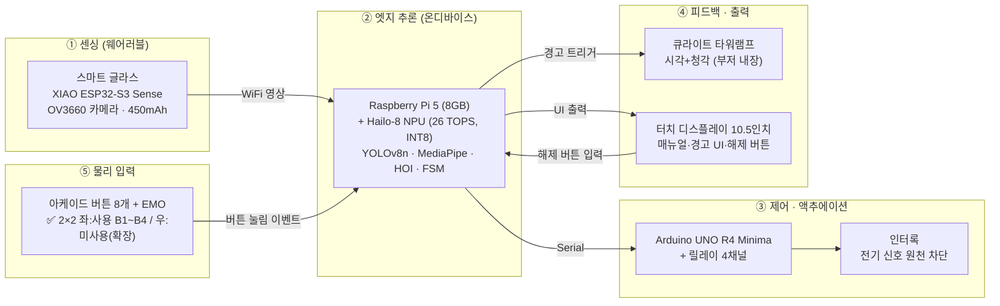
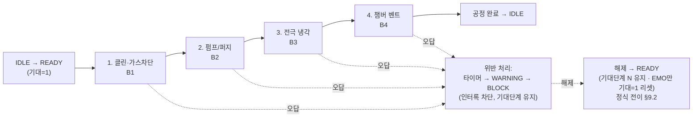
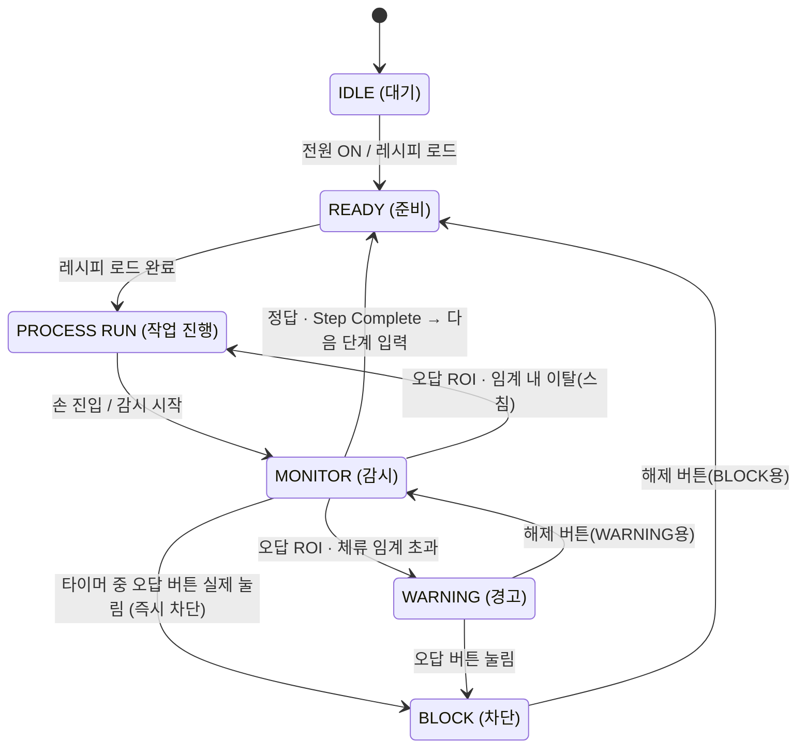

# 통합 수행·설계 문서
### Vision AI 기반 웨어러블 연동 작업자 Human Error 사전 예방 안전 콘솔
#### 한국폴리텍대학 청주캠퍼스 · 반도체시스템과 · 4조

---

> ### 📌 문서 안내
>
> **이 문서 하나로 프로젝트가 무엇을·왜·어떻게·어디까지 검증됐는지 모두 알 수 있게 하는 본체 문서**다. 전 15개 섹션(§1~§15)을 모두 담는다.
>
> - **단일 기준(Source of Truth)**: 프로젝트 지식의 **최신 기준 문서**(파일명 `프로젝트 기준 문서_v*` 중 **버전 번호가 가장 높은 본**). 드라이브·과거 자료·발표 PDF와 충돌 시 **항상 최신 기준 문서 우선**. ※ 본문의 "근거: 기준문서 §X" 표기는 기준문서 계열의 섹션 번호를 가리킨다(통합문서 자체의 §번호와 별개). ※ 모델 명칭(`person_v1`/`console_v1`) 정합 완료. ※ **일정·사이클·마일스톤·마감은 이 문서에서 다루지 않으며 Linear·Google Calendar가 정본이다**(§14.2). §12 회로도·핀맵은 Drive 정본 기준 자리표시자 유지. (본 통합문서 최종 정합: 2026-06-05; 이후 갱신: 2026-06-07 공정 시퀀스 정비(PM)화·PoC 1차 결과, 2026-06-09 버튼 배치 확정)
> - **상태 표기**: `✅ 확정` / `🔄 검토·진행 중` / `⏸ 보류` / `❌ 폐기` / `[확인 필요]`
> - **구조 형식**: 이브와 제작설계서의 *시스템 구성도·알고리즘 명세서* 형식을 차용(화면설계서 자리를 FSM·AI·공정 로직으로 대체). 형식만 참고하며 그쪽 내용(화면·ERD·코드)은 따르지 않는다.
> - **⚠️ Google Drive 미연결 상태**: 수치·로직·상태는 모두 v6에 근거가 있어 확정적으로 기술하되, 도식·그래프·회로의 **원본 자산**(FSM 순서도 `.drawio`, 학습 곡선·혼동행렬, 회로도·핀맵, 세션 로그, 구매 리스트 등)은 Drive에만 있으므로 **"📁 Drive 원본 확인 필요"** 로 표시한다. 본 문서의 Mermaid 다이어그램은 v6 본문 기반 재구성이며 **정본 도식은 Drive 원본**이다.
> - **📖 읽기 순서 설계**: 배경(§2) → 현재문제·개선방향(§3 AS-IS/TO-BE) → 요구사항(§4) → 시스템 개관(§5) → **시연이 무엇인지(§6 공정 시퀀스)** → 그것을 어떻게 인식·판정·차단하는지(§7 AI → §8 연결 → §9 FSM) → 검증·HW(§10~§12) 순으로, 구체적 시연 시나리오를 먼저 보여준 뒤 기술 상세로 들어가도록 배치했다.

## 목차

| # | 섹션 | 요약 |
| --- | --- | --- |
| 1 | 표지·프로젝트 개요 | 프로젝트명·정의·팀(8인)·두 트랙 |
| 2 | 프로젝트 배경·필요성 | 지식 기반 착오, 사후 반응 한계, 피지컬 AI 포지셔닝, 단일 공정 PoC, 진척 회고 |
| 3 | AS-IS / TO-BE | 사후 반응 → 사전 차단 레이어(＋α) |
| 4 | 요구사항 정의 | 기능/비기능/시스템/사용자 요구 |
| 5 | 시스템 구성도 | 센싱→추론→제어→피드백→입력 |
| 6 | 시연용 공정 시퀀스 (4단계) | B1~B4 + EMO, 순서 위반 감지 |
| 7 | AI·비전 파이프라인 (독립 A) | YOLOv8n · MediaPipe · HOI |
| 8 | 〈연결〉 인식→판정→제어 | AI(§7)와 FSM(§9)을 잇는 다리 |
| 9 | FSM 알고리즘 명세 (독립 B) | 정본 6단계 상태머신 |
| 10 | 성능 검증 데이터 | 학습 결과 · 통합 테스트 · PoC 순서인식 · KPI |
| 11 | 하드웨어 사양·개발 환경 | 확정 사양표 · 개발환경 |
| 12 | 하드웨어 상세 설계(회로도·핀맵) | 자리표시자 — 📁 Drive/작성예정 |
| 13 | 향후 확장 | 핵심에서 분리·보존된 기능 |
| 14 | 역할 분담 | 역할(확정) · 일정은 Linear·Calendar에서 관리 |
| 15 | 부록(소스·형상관리·BOM) | 형상관리 · 소스 · BOM · Drive 가이드 |

---

## 1. 표지·프로젝트 개요

| 항목 | 내용 |
| --- | --- |
| **프로젝트명** | Vision AI 기반 웨어러블 연동 작업자 Human Error 사전 예방 안전 콘솔 |
| **한 줄 정의** | 단일 **PECVD(플라스마 화학기상증착) 콘솔**에서 **공정 정비(PM·웻클린 make-safe) 시퀀스의 작업 순서 위반(누락·역순)** 을 비전 AI로 실시간 감지해, 오조작을 **버튼 입력 전에 사전 차단**하는 능동형 Fail-Safe 안전 시스템 |
| **소속** | 한국폴리텍대학 청주캠퍼스 · 반도체시스템과 · 2학년 B반 · 4조 |
| **지도교수** | 허주회 |
| **핵심 키워드** | `#VisionAI` `#EdgeAI` `#Wearable` `#FSM` `#Fail-Safe` |

**팀 구성 (8인)**

| 이름 | 역할 |
| --- | --- |
| 김응민 | 프로젝트 총괄 |
| 김동현 | 기획·발표 총괄 |
| 박송빈 | SW 책임 |
| 이재모 | HW 책임 |
| 김태현 | 운영 지원 책임 |
| 신희재 | SW–AI 데이터 담당 |
| 김선원 | HW 설계·제작 담당 |
| 천희동 | 운영 지원 담당 |

**두 트랙 관계 (한 줄)**
본 과제는 **융합프로젝트실습(학교 캡스톤, 본체)** 으로 진행되며, **한이음 드림업 프로젝트**는 별도 과제가 아니라 그 융합프로젝트의 **예산·멘토링 확보 및 공모전 출품을 위해 연계한 외부 프로그램**이다. (융합프로젝트 2026.02~10 / 한이음 수행기간 2026.04.01~10.30)

> **정의 범위 메모**: "단일 공정 시퀀스 1종의 순서 위반"으로 적용 범위를 **명시적으로 한정**한다(만능 시스템으로 보이지 않도록). 근거: 기준문서 §1·§3·§4.1.
>
> **공정 특정 메모 (PECVD)**: 본 통합 문서는 시연 공정을 **PECVD(플라스마 화학기상증착)** 로 구체화한다. PECVD는 **CVD(화학기상증착) 계열의 한 변형**이다(PECVD ⊂ CVD, 물리기상증착 PVD와는 다른 계열). 현재 4단계 시퀀스(클린·가스차단 → 펌프/퍼지 → 전극 냉각 → 챔버 벤트, §6)가 PECVD **정비(PM·웻클린 make-safe) 절차**와 대응한다(2026-06-07 갱신, 기존 기동 절차 대체). 기준문서 §4.1의 'CVD·PVD 설비 가정'을 **CVD 계열의 PECVD로 좁힌** 것이다.

---

## 2. 프로젝트 배경·필요성

> 본 배경은 **사회적 바탕 1개 + 제작자(팀) 도출 2개**로 구성한다. 휴먼 에러가 산업적으로 큰 문제라는 **외부·사회적 근거**(§2.1) 위에, 우리 팀이 공정 현장 맥락에서 직접 도출한 **두 가지 문제** — ① 기존 장비의 '사후 반응' 한계(§2.2), ② 작업 순서 위반의 위험성(§2.3) — 를 얹는다.

### 2.1 [사회적 바탕] 휴먼 에러는 산업 전반의 큰 문제다

제조·산업 현장에서 휴먼 에러가 차지하는 비중은 거시적으로도 작지 않다. 제조 품질 결함의 약 **80%** 가 휴먼 에러에서 비롯된다 *(미국 NIST 제조업 손실 분석·국제 공학연구 저널(IJERA) 데이터 기준, 중간발표 자료 재인용)*. 이것이 "왜 휴먼 에러를 다룰 가치가 있는가"에 대한 외부·사회적 근거다.

> ⚠️ 단, 이는 거시 배경일 뿐 본 프로젝트가 그 문제 전체를 푼다는 뜻이 아니다. 본 시스템은 그중 단일 공정의 순서 위반 1종만 다루는 PoC다(§2.5).

### 2.2 [제작자 도출 ①] 기존 장비의 '사후 반응' 구조적 한계

우리 팀이 공정 조작 맥락에서 도출한 첫 번째 문제는, 기존 콘솔 장비가 작업자가 **물리 버튼을 누른 '사후'에만 반응**한다는 점이다. 즉 "무엇을 먼저 해야 하는지 알지만 순서를 빠뜨리거나 뒤바꾸는" **지식 기반 착오(Mistake)** 가 이미 입력되어 장비가 오작동한 *뒤에야* 그 사실을 인지하는 구조이며, 이 한계는 두 갈래로 나타난다. (근거: 기준문서 §3)

- **사후 대응의 한계** — 사고가 발생한 뒤 보고·조사하는 방식으로는 *예방*이 불가능하다. → **사전 예측·예방형** 안전 장치가 필요하다.
- **인간 주의력 의존의 한계** — 반복 작업과 피로가 누적되면 인지 오류가 생긴다. 순서 검증을 사람의 집중력에만 맡길 수 없다. → 작업 맥락을 인식하는 **안전 알고리즘**이 필요하다.

> 이 도출은 안전공학으로도 뒷받침된다 — NIOSH **통제의 위계(Hierarchy of Controls)** 상, 경고·교육·절차 같은 **행정적 통제**는 사람이 매번 지켜야 해 신뢰성이 낮은 반면, 사람 행동과 무관하게 작동하는 **엔지니어링 제어**가 더 효과적·신뢰성 높은 것으로 분류된다. 본 시스템의 **인터록**이 바로 그 엔지니어링 제어다 *(미국 NIOSH·CDC·OSHA 위험 예방·통제 권고 기준)*. → 사후 경고 위에 사전 인터록을 더하는 §3 TO-BE의 근거.

### 2.3 [제작자 도출 ②] 작업 순서 위반(누락·역순)의 위험성

두 번째로 도출한 문제는 순서 위반 자체의 위험이다. 정해진 공정에는 **반드시 선행되어야 하는 단계**가 있어, 예컨대 가스를 차단하기 전에 다음 단계로 넘어가거나, 전극이 충분히 냉각되기 전에 챔버를 벤트·개방하는(누락) 식으로 단계를 건너뛰거나, 이미 지난 단계로 되돌아가 버튼을 누르면(역순), **장비 오작동·공정 불량·설비 손상, 나아가 작업자 안전 사고**로 이어질 수 있다. 순서 위반은 단순한 실수가 아니라 **앞 단계의 안전 전제가 무너진 상태에서 다음 동작이 실행되는 것**이기 때문에 위험하다. 본 시스템이 겨냥하는 지점이 바로 이 "잘못된 순서의 버튼 입력"이다.

> **🎯 도메인 앵커 — PECVD 웻클린 정비(PM)**
> 본 PoC가 겨냥하는 구체 시나리오는 **PECVD 챔버의 웻클린 정비(maintenance, make-safe) 작업**이다. 정비는 **플라즈마 클린·가스 차단 → 펌프/퍼지 → 전극 냉각 → 챔버 벤트**의 순서가 전부 안전 임계로 묶여 있어, 한 단계라도 누락·역순되면 잔류 가스·고온·잔압이 남은 상태에서 다음 동작이 실행되어 사고로 이어질 수 있다. 본 시스템은 이러한 정비 단계의 순서 위반을 **버튼 입력 직전에 사전 감지·차단**하는 것을 목표로 한다. (공정 4단계 정의는 §6, 시퀀스는 제조사 정비 매뉴얼류에 앵커링)

### 2.4 기술 포지셔닝 — 피지컬 AI(Physical AI)

> **🚀 피지컬 AI의 '눈'을 작업자에게 입힌다**
>
> 화면 속 데이터를 넘어 실세계를 직접 인식하고 물리적으로 행동하는 **피지컬 AI(Physical AI)**는 최근 산업계의 핵심 화두로 떠올랐다 *(젠슨 황(NVIDIA)이 CES 2025·2026 키노트에서 '피지컬 AI'를 차세대 핵심 흐름으로 제시)*. 앞서 짚은 정비 현장의 위험(작업 순서 위반, §2.3·§6)은 모니터 너머가 아니라 **사람의 손이 실제 장비를 다루는 물리 세계**에서 일어난다. 그래서 이런 위험은 데이터를 분석하는 소프트웨어 AI만으로는 막기 어렵고, **실세계를 직접 보고 물리적으로 개입하는 AI**라야 사고 이전에 차단할 수 있다.
>
> 로봇이 사람을 대신해 위험한 일을 떠맡는 흐름은 이미 현실이다 — 현대자동차그룹 무인 소방로봇은 사람이 들어갈 수 없는 화재 현장에 투입돼, 사람 눈이 닿지 못하는 곳을 적외선으로 대신 본다 *(현대자동차그룹이 자사 무인 소방로봇을 공식 'Physical AI' 사례로 소개)*. 같은 이치라면 위험한 반도체 정비도 로봇이 통째로 대신하는 것이 가장 이상적일 것이다. 그러나 위험한 정비를 사람 없이 대신하는 **완전자율 로봇은 아직 상용화되지 않았다.** 그래서 본 프로젝트는 **로봇 본체를 새로 만드는 대신, 피지컬 AI의 핵심인 '비전(눈)'만 떼어내 작업자가 착용하는 웨어러블 스마트 글라스(§5·§11)에 이식**하는 길을 택했다 — 작업자의 몸과 손은 그대로 두고 그 위에 피지컬 AI의 인식·판단을 얹어, **사람이 곧 로봇의 몸, AI가 그 눈과 두뇌가 되는** 구조다.
>
> 그 비전을 중심축으로, 작동은 피지컬 AI의 **폐루프 3요소**를 완성한다: ① 1인칭 비전으로 손동작을 **인식**(눈, §7) → ② SOP 순서 위반을 **판정**(두뇌, FSM §9) → ③ 위반 시 장비를 **인터록으로 물리 차단**(손발, §8). 사후에 반응하던 기존 안전을 **사고 이전의 인식·차단**으로 바꾸는 것이 본 시스템의 피지컬 AI 포지셔닝이다. *(§3 TO-BE의 '＋α 안전 레이어'와 정합)*

### 2.5 본 프로젝트의 범위 — 단일 공정 PoC로 한정

> **🎯 범위 단서 (반드시 함께 읽을 것)**
> 본 시스템은 휴먼 에러 전반을 막는 만능 시스템이 **아니다.** 위 거대한 문제 중에서도 **"작업 순서 위반(누락·역순)"이라는 단일 유형**을, **단일 PECVD 콘솔의 정해진 공정 시퀀스 1종**에 한정해 감지·차단하는 **개념증명(PoC)** 이다.
>
> 이는 멘토 피드백("벤처급으로 방대한 범위를 학생 학습 목적에 맞게 좁히고 단순화하라")을 반영한 의도적 스코프 설정이며, 검증된 자산(YOLO person 검출, 손-객체 HOI, FSM, 정답/오답 ROI)이 전부 이 단일 시나리오용이라는 점과도 일치한다. 그 외 시나리오(주변 안전 감시·로깅·기타 휴먼에러 등)는 **폐기가 아니라 §13 향후 확장**으로 분리되어 있다. (근거: 기준문서 v6 범위 축소 블록·§3·§4.1)

### 2.6 진척 회고 — 상반기 지연 원인

> 상반기(2~5월) 진행에서 발생한 지연의 배경을 기록한다. 결과보고서·회고 자산으로 보존하는 서술이며, 일정·작업 상태의 실시간 관리는 Linear·Google Calendar가 정본이다.

상반기에는 여러 작업을 착수했으나 준완성(팀 공유·확정 전) 상태가 많았고, 5/27 중간발표 시점의 진척은 제한적이었다. 주요 지연 원인은 다음 네 가지였다.

1. **물품 배송 지연**: 2차 물품이 약 6주간 지연 도착(04.04 신청 → 05.20 도착)하여 하드웨어 통합 착수가 밀렸다.
2. **1차 물품 성능 부족**: 초기 확보한 부품의 성능이 부족해 AI 가속기를 추가 발주(3차, 05.13)했다.
3. **초기 기획 완성도 부족**: 범위가 방대해 핵심 시나리오 확정·문서화가 늦어졌고, 이후 범위 축소(PECVD 순서 위반 PoC)로 재정비했다.
4. **학사 일정 집중**: 중간고사·체육대회 등 학사 일정과 겹쳐 개발 가용 시간이 줄었다.

> 위 지연을 반영해 6월 이후 일정을 현실적으로 재수립했고, 그 상세(사이클·마일스톤·마감)는 Linear와 Google Calendar에서 관리한다.

---

## 3. AS-IS / TO-BE

> 기존 콘솔(AS-IS)과 본 시스템(TO-BE)의 1:1 대응. 핵심 메시지는 **"대체가 아니라 안전 레이어의 추가"** 다. §2 배경에서 도출한 두 문제(사후 반응·순서 위반)에 대한 개선 방향을 보인다. (근거: 기준문서 §3·§4)

| 구분 | AS-IS (기존 콘솔) | TO-BE (본 안전 콘솔) |
| --- | --- | --- |
| **반응 시점** | 물리 버튼이 눌린 **'사후'에만** 반응 (오작동 후 인지) | 버튼 입력 **직전**에 사전 감지·차단하는 **레이어를 추가** |
| **순서 검증 방식** | 순서 위반을 **작업자의 주의력에 의존** | **비전 AI가 ROI 기준으로 자동 판정** (정답/오답 분기) |
| **사고 대응** | 오작동 발생 후 **보고·조사**(사후 처리) | **인터록으로 전기 신호를 원천 차단**(사전 차단) |

> **💡 핵심 메시지 — 플러스알파(＋α)**
> 본 시스템은 기존 콘솔을 **대체하거나 부정하지 않는다.** 기존 콘솔의 '사후 반응' 위에 **'버튼 입력 직전의 사전 감지·차단 레이어'를 얹는** 개선이다. 즉 기존 장비와의 대결 구도가 아니라, 그 위에 **안전 레이어를 더하는(＋α)** 구조다.

---

## 4. 요구사항 정의

> 핵심 시나리오(작업 순서 위반 감지·차단)를 기준으로 한 요구사항이다. 촉각(진동 팔찌 햅틱)·로깅·주변 안전 감시 등은 핵심 범위 밖(§13 확장)이므로 여기 포함하지 않는다. (근거: 기준문서 §3·§6·§7·§4.5)

### 4.1 기능 요구사항 (Functional Requirements)

| ID | 요구사항 | 설명 | 상태 |
| --- | --- | --- | --- |
| **FR-1** | 작업 순서 위반 감지 | 현재 기대단계 N 기준, **정답 ROI 외의 버튼 ROI**에 손이 접근하면 누락·역순을 위반으로 판정 | ✅ 확정 |
| **FR-2** | 시청각 피드백 | 위반 시 **시각(화면 팝업) + 청각(타워램프·부저)** 2층 피드백 출력 | ✅ 확정 *(촉각은 §13 확장)* |
| **FR-3** | 인터록 차단 | 오조작 강행 시 **장비로 가는 전기 신호를 원천 차단**(인터록) | ✅ 확정 |
| **FR-4** | 작업자 본인 해제 | 경고·차단 상태를 **작업자 본인이 디스플레이의 해제 버튼**으로 복구 (WARNING→감시 복귀 / BLOCK→준비 복귀) | ✅ 확정 *(관리자 승인 에스컬레이션은 §13)* |

### 4.2 비기능 요구사항 (Non-Functional Requirements)

| ID | 요구사항 | 목표값 | 상태 |
| --- | --- | --- | --- |
| **NFR-1** | 실시간 처리 | **30 fps** 안정 처리 | ✅ 통합테스트 30fps(USB 웹캠 경로) / 🔄 **실제 글래스 경로(ESP32-S3 WiFi) 재검증 필요**(§10.2) (기준문서 §7) |
| **NFR-2** | 응답시간 | 시각·청각·인터록 응답 **≤ 100 ms** | 🔄 목표값 — 데모 구동 시 실측 검증 필요 (기준문서 §7) |
| **NFR-3** | Edge 온디바이스 추론 | 클라우드 의존 없이 **엣지(RPi5 + Hailo-8)에서 온디바이스 추론** | ✅ 확정 (기준문서 §5·§6) |

### 4.3 시스템 요구사항 (한 줄)

**"FPV 단일 비전 + FSM 6상태 + 인터록 아키텍처를 구현한다."** — 즉 1인칭 웨어러블 카메라 한 대의 영상으로 손-ROI를 판정하고, 6단계 유한 상태 머신(FSM 6상태 정의는 §9)으로 정상/위반을 분기하며, 위반 강행 시 인터록으로 전기 입력을 차단하는 구조를 갖춘다. (Wide-View 주변 감시 병렬 구성은 §13 확장)

### 4.4 사용자 요구사항 (한 줄)

**"작업자가 잘못된 순서를 시도하면 시스템이 이를 감지하고, 시청각으로 피드백하며, 필요 시 입력을 차단한다."** (작업자 관점)

---

## 5. 시스템 구성도

> 핵심 시연 구성은 **FPV 단일 비전 + 엣지 온디바이스 추론 + 인터록 제어 + 시청각 피드백**이다. (근거: 기준문서 §5·§6.1) Wide-View 주변 감시(고정 카메라 병렬)와 진동 팔찌(촉각)는 핵심 구성에서 제외되어 §13 확장에 있다.

### 5.1 시스템 구성 블록도



> 📁 **Drive 원본 확인 필요**: 정밀 결선·전원 계통이 포함된 회로도·핀맵은 §12(자리표시자) 및 Drive 원본 참조.

### 5.2 통신 경로 (정본)

> 본 프로젝트 통신 경로의 **단일 정본 표**다. (위 §5.1 블록도가 같은 경로를 그림으로 보인다.)

| 구간 | 방식 | 내용 |
| --- | --- | --- |
| 글라스 → RPi5 | **WiFi** | 1인칭 영상 프레임 전송 |
| RPi5 → Arduino | **Serial** | 인터록 제어 신호 |
| RPi5 → 타워램프 | 신호 출력 | 위험도별 점멸·경고음 트리거 |
| RPi5 ↔ 디스플레이 | 출력 + 해제 입력 | 매뉴얼·경고 UI 출력 / 해제 버튼 입력 수신 |
| 버튼 → RPi5 | 디지털 입력 | 버튼 눌림 이벤트 |

> ※ **핵심 경로**: ESP32-S3(WiFi 영상) → RPi5(AI 분석) → Arduino(Serial 인터록).
> ※ ESP32-C3(BLE 햅틱)는 핵심 통신 경로에서 **제외**(§13 확장).
> ※ **WiFi 접속 흐름**(전원 ON→접속→영상 전송)은 FSM 상태 전이가 아니라 **통신 초기화 시퀀스**이므로 §13.3에서 별도로 관리한다.
> (근거: 기준문서 §6.1) 통신 핀 결선·회로 정밀 사양은 §12(회로도·핀맵, 자리표시자).

### 5.3 구성 요소 요약 (블록도 판독용)

> 전체 **확정 하드웨어 사양표**는 §11에서 정리한다. 여기서는 블록도를 읽는 데 필요한 수준만 요약한다. (근거: 기준문서 §5)

- **메인 허브** ✅: Raspberry Pi 5 (8GB)
- **AI 가속기 (주)** ✅: Hailo-8 (26 TOPS, INT8) — M.2 PCIe Gen3. *예비: Hailo-8L(13 TOPS)은 비상 대체용일 뿐 **주 사양으로 인용 금지**(§11·기준문서 §11).*
- **스마트 글라스** ✅: XIAO ESP32-S3 Sense (OV3660, WiFi 영상)
- **인터록 제어** ✅: Arduino UNO R4 Minima(주)/R3(예비) + 릴레이 4채널(주)/8채널(예비)
- **경보** ✅: 큐라이트 타워램프(부저 내장 — 별도 부품 아님)
- **터치 디스플레이** ✅: 제우스 Z10 10.5인치 — **출력 전용**(입력 아님), 단 해제 버튼 UI는 여기 배치
- **물리 입력 버튼** ✅ (2026-06-09 배치 확정): 동일 아케이드 버튼 **8개**(4색 흰·검·핑크·노랑 ×2개씩) + 비상정지(EMO). **좌 2×2 = 사용(하드웨어 연결) B1~B4 / 우 2×2 = 미사용(확장용)**. 색↔단계 = **B1 노랑·B2 흰·B3 핑크·B4 검정**. 좌·우 색 중복은 **미사용(우) 버튼 클릭면 스티커**로 구분, 비전은 **사용(좌) 그룹만 ROI**로 인식. 검정은 무광 배경·유광 버튼 대비로 검출, 미흡 시 스티커 폴백.
> **버튼 배치도 (2×2, 1인칭 시야 가운데 집중 — PoC 성공 배치 재현)**
> ```
>    사용(B1~B4) ─ 하드웨어 연결        미사용(확장) ─ 클릭면 스티커
>      [B1 노랑①] [B2 흰 ②]              [ ] [ ]
>      [B3 핑크③] [B4 검정④]             [ ] [ ]
>          순서 ①→②→③→④ (Z자)              · EMO는 별도 배치
> ```
- **외장재** ✅: 알루미늄 프로파일(DF3030) + MDF/포맥스
- *고정 카메라(ABKO APC900): Wide-View 주변 감시 용도는 §13 확장. 진동 팔찌(XIAO ESP32-C3): §13 확장.*

---

## 6. 시연용 공정 시퀀스 (4단계)

> ✅ **시연용 "공정 시퀀스 1종" 정본(2026-06-04 확정 → 2026-06-07 PECVD 정비(PM·웻클린 make-safe) 시퀀스로 갱신).** 핵심 시나리오 "작업 순서 누락/위반"을 시연하기 위한 4단계 공정이다. 기존 기동(운전) 시퀀스 대신, "모든 단계가 안전 임계라 한 단계라도 누락·역순되면 사고"라는 조건에 더 부합하는 **정비(make-safe) 시퀀스**(클린·가스차단 → 펌프/퍼지 → 전극 냉각 → 챔버 벤트)로 확정했다. **이 시퀀스가 이후 §7 AI 인식·§8 연결·§9 FSM이 다루는 구체적 대상**이므로 여기서 먼저 정의한다. (FSM 6상태 정의는 §9 참조) (근거: 기준문서 §4.5 + 2026-06-07 브레인스토밍 재설계)

> ### ⚠️ 콘솔 구성·라벨 주석 (반드시 읽을 것)
> 이 콘솔에는 **디스플레이·물리 버튼(다수)·타워램프·비상정지(EMO) 버튼만** 있고, **플라즈마 클린·가스 차단·펌프/퍼지·전극 냉각·챔버 벤트 등 실제 PECVD 정비 공정을 수행하는 기능은 없다.** 아래 단계명("클린·가스차단", "펌프/퍼지" 등)은 **버튼에 붙인 라벨(이름표)일 뿐 실제 물리 동작을 일으키지 않는다.** 버튼을 눌러도 가스가 차단되거나 챔버가 벤트되지 않는다. 시연이 증명하는 것은 오직 **"정해진 순서대로 버튼을 눌렀는가 / 순서를 위반했는가"를 비전 AI가 감지·차단**하는 것이다. (§2.5 "단일 공정 PoC" 전제와 정합)

### 6.1 4단계 공정 + 비상정지

| 단계 | 버튼 라벨 | 정답 ROI | 오답(위반) ROI | 오답 시 동작 (전이) | 정답 시 전이 |
| --- | --- | --- | --- | --- | --- |
| **1** | 클린·가스차단 (플라즈마클린 CF₄/O₂ + SiH₄ 차단) 〔노랑〕 | **B1** | B2·B3·B4 (누락=뒤 단계 건너뜀) | 오답 ROI→타이머→(스침)PROCESS RUN 복귀 / (체류)WARNING→해제 시 MONITOR / 오답 누름 시 BLOCK→해제 시 READY (**기대단계=1 유지**) | B1 정답→Step Complete→READY(기대=2) |
| **2** | 펌프/퍼지 (N₂ ≥2사이클) 〔흰〕 | **B2** | B1(역순)·B3·B4(누락) | 〃 (BLOCK 해제 시 **기대=2 유지**) | B2 정답→READY(기대=3) |
| **3** | 전극 냉각 (~300℃) 〔핑크〕 | **B3** | B1·B2(역순)·B4(누락) | 〃 (**기대=3 유지**) | B3 정답→READY(기대=4) |
| **4** | 챔버 벤트 → 개방 〔검정〕 | **B4** | B1·B2·B3(역순) | 〃 (**기대=4 유지**) | B4 정답→공정 완료→IDLE |
| **공통** | 비상정지 (EMO) | — | — (위반 판정 대상 아님) | EMO 누름 → **즉시 BLOCK**(안전 정지), 해제 시 **READY 복귀 + 기대단계=1로 리셋**(시퀀스 전체 중단·재시작) | — |

- **판정 규칙(한 줄)**: 시스템이 기대단계 N을 들고 있고, **BN ROI = 정답 / 그 외 공정 버튼 ROI = 오답.** 이 규칙 하나로 누락(뒤 버튼)·역순(앞 버튼)이 모두 잡힌다.
- **핵심 불변식**: 오답은 단계를 **절대 진전시키지 않는다.** 위반으로 BLOCK까지 가서 해제해도 기대단계는 유지된다(예: 2단계 위반 차단 후 복구해도 여전히 2단계).
- **역순/누락 구분**: 1단계는 앞 단계가 없어 오답이 전부 '누락', 4단계는 뒤 단계가 없어 전부 '역순', 2·3단계는 양쪽 모두 존재.
- **EMO 성격**: EMO는 오답 판정(타이머·필터링)을 거치지 않고 즉시 BLOCK되는 **긴급 안전 정지**라 오답 버튼과 성격이 다르다. 따라서 **EMO 해제는 위반 BLOCK과 달리 기대단계를 1로 리셋**한다(시퀀스 전체 중단·처음부터 재시작).

### 6.2 정상 / 이상 흐름



### 6.3 사용자 흐름 시나리오 (착용 → 기동 → 작업 → 감지 → 피드백/차단)

> 시청각 2층 피드백 기준(촉각/햅틱은 §13). FSM 상태·전이 상세는 §9.

- **도입**: 글라스 착용·전원 ON → WiFi 영상 연결(접속 과정은 §13.3 별도 통신 시퀀스) → 레시피 로드 → FSM **IDLE→READY**(기대=1)
- **정상**: 각 단계 BN ROI 진입 → MONITOR 정답 → 누름 → Step Complete → READY 복귀(기대 N+1). B4 완료 시 IDLE
- **이상**: 오답 ROI 진입 → 타이머 → (스침)복귀 / (체류)**WARNING**[시각 팝업 + 청각 타워램프] → 해제 버튼 시 MONITOR 복귀 / 오답 강행 시 **BLOCK** → 인터록 전기 차단 → 해제 버튼 시 READY 복귀

> 📁 **Drive 원본 확인 필요**: §9.2 상태도·§6.2 흐름도가 Mermaid 초안이며, 정식 시퀀스 다이어그램 원본은 Drive 산출물로 별도 관리 (작성·보관 예정).

---

## 7. AI · 비전 파이프라인 〔독립 섹션 A〕

> "인식" 단계를 담당하는 비전 파이프라인을 독립적으로 기술한다. 앞 §6 시연 시퀀스의 버튼을 인식 대상으로 하며, 이 파이프라인의 **출력**(손-버튼 ROI 접촉 이벤트)이 §8을 거쳐 §9 FSM의 입력이 된다. (근거: 기준문서 §6.1·§7)

### 7.1 스택 구성 (확정)

| 구분 | 확정 내용 | 상태 |
| --- | --- | --- |
| 객체 검출 | YOLOv8n (Hailo-8, INT8). **모델 2종** → 초기 `person_v1.pt`(person 단일 클래스, mAP50≈0.96 검증완료) / 최종 `console_v1.pt`(공정 객체: 버튼·디스플레이·타워램프, **미완** PRO-45) | 🔄 초기 ✅ / 최종 미완 |
| 입력 해상도 | **QVGA(320×320) 기본 채택**, RPi5+YOLO 실측 성능에 따라 **VGA(640×640) 업그레이드 가능** | 🔄 잠정 — 성능 검증 후 단일값 확정 [확인 필요] |
| 손 추적 | MediaPipe 0.10.x (CPU, Tasks API, **21점 랜드마크**) | ✅ |
| HOI 분석 | MediaPipe 손 랜드마크 + YOLO 바운딩 박스 **융합** → 손-객체 상호작용 판단 | ✅ |
| HOI 신뢰도 임계값 | **이중 0.70 / 0.55** | ✅ (기준문서 §7) |
| 데이터셋 | Roboflow / AnyLabeling 커스텀 라벨링 (클린룸 특화) — `cleanroom_person_detection_v3` | ✅ |
| 모델 변환 | Hailo DFC → **HEF**. **변환 대상 = 최종 `console_v1.pt` → `console_v1.hef`** (초기 person_v1 아님, PRO-14) | 🔄 최종 대상 |

> **🔖 모델 네이밍 규약 (정본)**: 초기 `person_v1.pt`(person만·검증완료) ↔ 최종 `console_v1.pt`(공정 객체 포함·시연용·미완) ↔ Hailo 변환본 `console_v1.hef`. §10의 mAP 0.96은 **person_v1** 결과이며, 최종 console_v1 성능·Hailo 변환·KPI 실측은 학습 후 진행한다. **본 문서에서 모델을 인용할 때는 이 규약을 단일 기준으로 한다.** (기준문서 §6.1 규약과 동일)

### 7.2 알고리즘 명세 — 손-객체 상호작용(HOI) 인식

**흐름도**


**처리 시나리오 (번호)**

1. ESP32-S3 글라스가 WiFi로 1인칭 영상 프레임을 전송 → RPi5 수신
2. YOLOv8n(Hailo-8, INT8)으로 프레임에서 person·객체 바운딩 박스 검출 *(입력 해상도 QVGA 기본, 🔄 VGA 업그레이드 여지)*
3. MediaPipe(CPU)로 손 21점 랜드마크 추출
4. **HOI 융합**: YOLO 바운딩 박스와 손 랜드마크 위치를 융합해 "손이 어느 버튼 ROI에 들어와 있는가"를 판단
5. **이중 신뢰도 임계값(0.70 / 0.55)** 으로 접촉/비접촉을 확정해 오인식 억제
6. 확정된 **손-ROI 접촉 이벤트**를 §8(인식→판정→제어)을 통해 §9 FSM 판정부로 전달

### 7.3 상세 설명

- **검증된 핵심**: 클린룸 person 검출 성능(mAP@50 ≈ 0.96 등)은 §10에서 정리한다(초기 `person_v1` 결과 — 네이밍 규약 §7.1).
- **변환 이슈와 해결(이력)**: YOLO→Hailo HEF 변환 후 객체 미탐지/오라벨 현상이 있었고, 원인은 NMS 방식 불일치·입력 형식 불일치(FLOAT32 vs UINT8)·클래스 수 불일치·파이프라인 호환성이었다. **Python 직접 처리 전환, 입력 형식 UINT8 통일, 클래스 14→10개 이하 재맵핑, 검증된 YOLO 기본 모델 적용**으로 해결했다. (근거: 기준문서 §8 해결 완료 항목)
- **해상도 정책**: QVGA를 기본으로 채택하되 RPi5+YOLO 실측 성능에 따라 VGA로 올릴 여지를 둔다(🔄, 성능 검증 후 단일값 확정).

### 7.4 🔄 검토 중 / 확장 분리

- 🔄 **검토 중**(확정 아님, 기준문서 §6.2): 공구 탐지(드라이버·스패너 등), FOUP **8"/12"** 식별, 비상정지(EMO) 버튼-손 상호작용 판정
- **§13 확장으로 이동**: 작업 완료 확인 제스처(MediaPipe `Thumb_Up`)·캡처 로깅은 로깅 기능과 함께 핵심에서 분리됨
- **학습 곡선·혼동행렬·데이터셋 원본**: 학습 결과 자산(`person_v1`)은 **§10에 Drive 링크로 정리**됨 → §10 참조. 데이터셋·라벨링 세트(`cleanroom_person_detection_v3`)는 Roboflow/AnyLabeling 원본.

---

## 8. 〈연결〉 인식 → 판정 → 제어 흐름

> AI 파이프라인(§7, 독립 A)과 FSM(§9, 독립 B)을 잇는 **다리** 섹션이다. 비전 파이프라인의 출력이 어떻게 FSM 판정으로 들어가고, 그 판정이 어떻게 물리 제어(인터록·피드백)로 이어지는지를 한 장에 보인다. (근거: 기준문서 §4.5·§6.1)


**연결 규칙 요약**

- **인식부(§7)** 는 "어느 버튼 ROI에 손이 있는가"라는 이벤트만 만든다. 정답/오답 여부는 *알지 못한다*.
- **판정부(§9 FSM)** 가 그 이벤트를 **현재 기대단계 N**과 대조해 의미를 부여한다 — 정답(B_N)인가, 오답(누락·역순)인가, 단순 스침인가.
- **제어부**는 판정 결과를 물리 출력으로 옮긴다 — 정상 진행 / 경고(시청각) / 차단(인터록). 응답시간 목표는 **≤ 100 ms**(🔄 목표값, 검증 필요).
- 이 분리 덕분에 비전 모델(§7)과 상태 로직(§9)을 **독립적으로 교체·개선**할 수 있다.

---

## 9. FSM 알고리즘 명세 〔독립 섹션 B〕

> ✅ **FSM 정본(2026.06.03 확정)을 단일 기준으로 한다.** 과거 자료의 5단계(v2)·7단계(4월 초안)·9단계(목차 표기) 불일치는 모두 폐기(기준문서 §11). **핵심 6단계 + 정상복귀/해제 경로**만 사용한다.
> **FSM 정본 도식 원본:** [FSM 알고리즘 순서도.drawio](https://drive.google.com/file/d/1UIovLGUSYUF8Q5Q-qpWguLZXJSk40MiD/view) (Drive `프로젝트 구매 물품 리스트` 상위 폴더, 2026-06-03 정본). 아래 Mermaid 상태도는 본문 기반 재구성이며, 정본 도식은 이 .drawio다. ⚠️ 구버전 도식(`FSM 알고리즘 단계.drawio`, `알고리즘 순서도 수정본.drawio` 등 5월본)은 6단계 정본 이전이므로 참조 금지.

### 9.1 상태 정의 (6개)

| # | 상태 | 의미 |
| --- | --- | --- |
| 1 | **IDLE** (대기) | 전원 대기 상태 |
| 2 | **READY** (준비) | 레시피(공정 매뉴얼) 로드 완료, 감시 대기 |
| 3 | **PROCESS RUN** (작업 진행) | 정상 공정 진행 중 |
| 4 | **MONITOR** (감시) | 손-ROI 판정 — 정답/오답 분기점 |
| 5 | **WARNING** (경고) | 시·청 경고 출력 (촉각은 §13) |
| 6 | **BLOCK** (차단) | 인터록으로 전기 입력 원천 차단 |

### 9.2 상태 전이도



> **EMO(비상정지) 공통 경로**: 어느 상태에서든 EMO를 누르면 오답 판정(타이머·필터링)을 거치지 않고 **즉시 BLOCK**(안전 정지), 해제 시 **READY 복귀 + 기대단계=1로 리셋**(시퀀스 전체 중단·처음부터 재시작). 위반 BLOCK이 기대단계를 유지하는 것과 구분됨. (상태도에는 생략, §6 표의 공통 행 참조)

### 9.3 전이 시나리오 (번호)

1. **IDLE → READY**: 전원 ON / 레시피 로드
2. **READY → PROCESS RUN**: 레시피 로드 완료
3. **PROCESS RUN → MONITOR**: 손 진입 / 감시 시작
4. **MONITOR(정답 분기)** → 작업 완료(Step Complete) → **다음 단계 버튼 입력 → READY 복귀** *(다단계 정상 루프)*
5. **MONITOR(오답 분기)** → 오답 ROI 진입 → **타이머 작동(체류시간 측정)** → 필터링 판단
   - 필터링 **"예"**(임계시간 내 이탈 = 단순 통과) → **PROCESS RUN 복귀** (오인식 방지)
   - 필터링 **"아니오"**(체류 지속, 임계 초과) → **WARNING**
   - ※ 타이머 작동 중이라도 **오답 버튼이 실제로 눌리면 곧장 BLOCK**(경고 생략, 즉시 차단)
6. **WARNING** 두 갈래: 해제 버튼(WARNING용)→**MONITOR 복귀** / 오답 버튼→**BLOCK**
7. **BLOCK** → 해제 버튼(BLOCK용) → **READY 복귀**

> **해제 버튼 2종 메모**: WARNING 해제(→MONITOR)와 BLOCK 해제(→READY)는 **복귀 지점이 다른 별도의 두 버튼**으로 설계하며, 둘 다 디스플레이(터치 모니터)에 배치한다.

### 9.4 임계값 정본

| 값 | 확정값 | 상태 |
| --- | --- | --- |
| 타이머 체류시간 임계 (스침 vs 위반 경계) | **dwell 0.5초 + 갭메우기 0.3초** (PoC 1차 검증값) | ✅ PoC 실측 — 스침 오탐 0% (§10.3) |
| 시각·청각·인터록 응답시간 | **≤ 100 ms** | 🔄 목표값 — 검증 필요 (§10 KPI) |
| HOI 신뢰도 임계 (이중) | **0.70 / 0.55** | ✅ (§7·§8) |
| BLOCK / WARNING 복구 주체 | **작업자 본인 해제** (디스플레이 해제 버튼 2종) | 🔄 신규 정책 |

> **타이머 근거 (2026-06-07 PoC 반영)**: PoC 1차 검증에서 **dwell 0.5초 + 갭메우기(채터 제거) 0.3초** 조합이 스침 오탐 0%·순서 정확 인식을 달성해 이 값을 정본으로 채택한다. 갭 메우기는 누름 순간 손이 버튼을 가려 인식이 끊기는 채터를 메우는 필수 요소다(§10.3·PoC 결과보고서). 통합설계 초안의 0.8~1.0초는 이 PoC 실측값으로 대체되었다.

### 9.5 §13 확장으로 분리된 FSM 요소

- **CAUTION(경계) 상태**: 임계시간 초과 시 타이머 리셋 / 경고 후 손 회수 시의 중간 상태 — 핵심 6단계에서 제외
- **관리자 승인 에스컬레이션(①②③회 카운트)**: 오류 누적 시 관리자 승인을 거쳐 해제·리셋하는 상위 안전 로직 — 핵심 복구 주체(작업자 본인)와 구분

---

## 10. 성능 검증 데이터

> ✅로 표기한 항목은 **실측·검증된 값**, KPI는 **달성 목표값**이다. 목표값 중 일부(위반 정확도·오답 ROI 감지율·응답시간)는 데모 구동 시 실측 검증이 필요하다. (근거: 기준문서 §7)

### 10.1 ✅ AI 학습 결과 (검증됨)

**초기 모델 `person_v1`** — 데이터셋 `cleanroom_person_detection_v3` / YOLOv8n / 약 40 epochs / **객체 = person 단일 클래스**

| 지표 | 값 |
| --- | --- |
| mAP@50 | **≈ 0.96** |
| mAP@50-95 | **≈ 0.74** |
| Precision | **≈ 0.94 – 0.97** |
| Recall | **≈ 0.90 – 0.93** |

> **모델 단계 메모**: 위 수치는 **초기 모델 `person_v1`**(person 단일 클래스)의 검증 결과다. 시연용 **최종 모델 `console_v1`**(공정 객체 포함)의 mAP·위반 정확도·오답 ROI 감지율은 **학습·통합 후 측정 예정**(목표 KPI는 동일 적용). 네이밍 규약 §7.1 참조.

### 10.2 ✅ 통합 테스트 (검증됨)

RPi5 + Hailo + USB 웹캠 환경

- 탐지 신뢰도 **60% 이상**
- 실시간 처리 **30 fps 안정**
- 정상 탐지 **3,921건** (단일 세션 기준)

> ⚠️ **실제 글래스 경로 미검증 단서 (2026-06-07 추가)**: 위 "30 fps 안정"은 **RPi5 + Hailo + USB 웹캠 + 초기 person 모델** 환경의 실측값이다. 실제 제품 경로인 **XIAO ESP32-S3(OV3660) WiFi 스트리밍 + 최종 console_v1** 조합의 FPS는 **아직 검증되지 않았다.** 예비 측정상 ESP32-S3 스트리밍은 640×480 약 **6.6 fps**(AP 모드)·QVGA 약 **22.5 fps**(핫스팟) 수준의 병목이 있어(640×480@28fps는 ESP32 HTTP 병목으로 불가, TCP/UDP 전환 개선 여지 있음), **실제 글래스 경로의 실시간성(30fps 목표)은 별도 재검증이 필요**하다. → PoC Phase 0 검증 항목 B(실제 경로 FPS)에서 측정 예정.

### 10.3 ✅ PoC 1차 — 1인칭 비전 순서 인식 (검증됨, 2026-06-07)

> **PoC 범위**: 버튼 검출 모델 없이 **사전학습 MediaPipe 손 + 색 기반 버튼 ROI + dwell**만으로, 1인칭 영상에서 "작업자가 어느 버튼을 어떤 순서로 조작했는가"를 비전이 읽는지 검증. (핵심 가설: 실제 '누름'은 하드웨어 신호, 비전은 누르기 직전 손-버튼 ROI를 사전 인식 — §6 콘솔 전제와 정합) 계측 `poc/roi_hover.py`, 채점 `poc/score.py`.

| 클립 | 손 검출률 | 검출 순서 vs 정답 | 판정 |
| --- | --- | --- | --- |
| 정상 | **100%** | 13/13, **편집거리 0 (완벽 일치)** | ✅ |
| 위반 | 97% | 13/14, 편집거리 1 | ✅ |
| 스침 | 100% | **오탐(잘못된 dwell) 0개** | ✅ |

- **성공기준 충족**: 순서 일치도 ≥80% → **정상 100% / 위반 93%**, 스침 오탐율 ≤10% → **0%**.
- **확정 파라미터**: dwell 0.5초 + 갭메우기 0.3초(§9.4), 색 기반 동적 ROI(핸드헬드 흔들림 자동 흡수).
- **핵심 교훈**: ① 프레이밍이 결정적 — 손 전체가 화면 안(버튼 가운데/글래스 화각)이어야 하며, 가장자리 버튼은 누를 때 손이 잘려 검출 실패. ② 검출 실패 원인은 색·조명이 아니라 늘 "손이 화면 밖"(가장자리 버튼·빠른 모션). ③ "접근→잠깐 멈춤→누름" 동작이면 누름 순간 가려져도 멈춤 구간에 ID를 확정해 순서가 정확.
- **한계·다음 단계**: 가림 순간 색 ID 미확보는 구조적 한계 → 실제 시스템에선 하드웨어 누름·접근 시 lock-on이 보완. **다음 = 최종 `console_v1` 버튼 동적 검출(§7.1, PRO-45)**.

> 원본: `poc/PoC_결과보고서.md`, 계측 결과 `poc/out3/`, 시각화 `overlay_{정상,위반,스침,dwell데모}.mp4`.
> ※ 위 §10.3 수치는 **색 기반(MediaPipe 손 + 색 ROI) 사전검증값**이며, §10.4 KPI(위반 정확도 등)는 **최종 `console_v1`(YOLO 버튼 검출) 기준의 별개 측정**이다. 둘은 측정 대상이 달라 직접 비교·대체되지 않는다.

### 10.4 🔄 KPI 목표값 (달성 목표)

| KPI | 목표 | 상태 |
| --- | --- | --- |
| mAP50 | ≥ 0.95 | ✅ 초기 person_v1 충족(0.96) / 최종 console_v1은 학습 후 측정 |
| **위반 정확도** | **90%** | 🔄 목표 — 데모 후 실측 필요 |
| 오답 ROI 감지율 | 95% | 🔄 목표 — 데모 후 실측 필요 |
| 인터록 응답 | ≤ 100 ms | 🔄 목표 — 실측 필요 |
| 시각·청각 응답 | ≤ 100 ms | 🔄 목표 — 실측 필요 |
| 데이터셋 규모 | > 1,000장 / 3종 | 🔄 목표 (학습셋 기준) |

> **KPI 귀속 메모(v6 정리)**:
> - ✅ **"위반 정확도 90%"** 는 *어떤 행동이 위반인지 아닌지를 **감지**하는 정확도*(ⓑ 의미)로 확정된 **핵심 KPI**다.
> - 오류 **유형 분류**('단순 망설임 vs 절차 위반', ⓐ 의미) 정확도와 **로깅 전용 KPI**(3종 로그 분류, 10개 이상 데이터 항목 등)는 로깅 기능과 함께 **§13 확장 목표**로 분리한다.
> - **햅틱 응답 ≤ 200 ms** 도 §13 확장 항목(촉각 피드백)으로 분리한다.
> - 핵심 시나리오의 1차 KPI는 **mAP50 · 위반 정확도 · 오답 ROI 감지율 · 인터록/피드백 응답시간**으로 한정한다.

> **학습 결과 원본(초기 `person_v1`)은 Drive 정본을 참조한다:** 학습 곡선 [results.png](https://drive.google.com/file/d/1CV_TZGgSfvaJsyT4-rTC3fBB58L0W_V7/view)·[results.csv](https://drive.google.com/file/d/1RTPmEy0L8mVL7MzP-5HN1PTmUh12VNo2/view), 혼동행렬 [confusion_matrix.png](https://drive.google.com/file/d/1L4FuJjI7lFT7hqKqpx9-yGr57gBTyuOx/view)·[정규화본](https://drive.google.com/file/d/1vYcLGKIrDnAUEQYe8DrFhRwOH2X8BAYU/view), PR/F1 곡선([PR](https://drive.google.com/file/d/15ixeGEyS__Nh2QbJa9w_Ve8BmlmI1hGM/view)·[P](https://drive.google.com/file/d/18hu2jm9ClKAofX__Kw2rf_vaMxBKeQ6Q/view)·[R](https://drive.google.com/file/d/1AKATaBzZWtB86gJxlqkFiQtVvdeZE4mj/view)·[F1](https://drive.google.com/file/d/19_wiKu6o13VvWhTnUdkZEQukApHI-4ll/view)). Drive `YOLO 모델 학습 관련` 폴더, 2026-05-17. ※ 위 수치는 초기 `person_v1` 결과(네이밍 규약 §7.1).

---

## 11. 하드웨어 사양·개발 환경

> §5 시스템 구성도의 **확정 하드웨어 사양 전체**를 한곳에 정리한다. (통신 경로 정본은 §5.2 참조) (근거: 기준문서 §5·§6.1)

### 11.1 ✅ 확정 하드웨어 사양

| 구분 | 확정 사양 | 비고 |
| --- | --- | --- |
| 메인 허브 | **Raspberry Pi 5 (8GB)** | ARM Cortex-A76 2.4GHz 4Core, LPDDR4X 8GB |
| AI 가속기 (주) | **Hailo-8 (26 TOPS, INT8) — 위더스 ZAIV-M.2** | M.2 PCIe Gen3. **주 사양** |
| AI 가속기 (예비) | Hailo-8L (13 TOPS) — RPi AI HAT+ | Hailo-8 미사용 시 한정 대체용. 저성능 구동 가능한 비상 예비. **주 사양으로 인용 금지** (기준문서 §11) |
| 스마트 글라스 | **XIAO ESP32-S3 Sense** | OV3660 카메라, WiFi 영상 전송, 리튬폴리머 450mAh |
| 진동 팔찌 *(§13 확장)* | XIAO ESP32-C3 | 코인 진동모터, BLE 햅틱. v5에서 핵심 제외 → §13. 부품은 보유 |
| 고정 카메라 | ABKO APC900 FHD 웹캠 | 1920×1080, 30fps, USB. Wide-View 주변 감시는 §13 확장 |
| 입력 버튼 | **아케이드 버튼 8개**(4색 흰·검·핑크·노랑 ×2) + 비상정지(EMO). 좌 2×2 사용(B1~B4)/우 2×2 미사용(확장) | ✅ **배치 확정(2026-06-09)**. 색↔단계 B1노랑·B2흰·B3핑크·B4검정 (배치도 §5.3) |
| 인터록 제어 | **Arduino UNO R4 Minima (주) / R3 (예비)** + **릴레이 4채널 (주) / 8채널 (예비)** | 전기 신호 차단 |
| 경보 장치 | **큐라이트 타워램프 (부저 내장)** | 위험도별 점멸·경고음. 부저는 타워램프에 포함(별도 부품 아님) |
| 터치 디스플레이 | **제우스 Z10 10.5인치 터치모니터** | **출력 전용**(입력 아님). 경고/차단 해제 버튼 UI는 여기 배치 |
| 외장재 | 알루미늄 프로파일(DF3030) + MDF/포맥스 | 안전 콘솔 프레임 |

> **부품별 단가·수량**은 §15.2의 [구매 리스트 정본 링크](https://drive.google.com/file/d/16yT3HqlKdSz05WTUURtAOku-UgGWQGJX/view)를, **통신 핀 결선·회로 정밀 사양**은 §12(회로도·핀맵, 자리표시자 — 도면 원본 Drive 작성 예정)를, **통신 경로**는 §5.2를 참조한다.

### 11.2 개발·운영 환경

- **형상관리**: GitHub
- **개발 도구**: Claude Code
- **원격·네트워크**: Tailscale(VPN), NoMachine(원격 데스크톱)

---

## 12. 하드웨어 상세 설계 (회로도·핀맵) — 자리표시자

> **이 섹션은 의도적으로 자리표시자다.** 회로도·핀맵의 **정본 원본은 Google Drive**에 있으며 일부는 작성 예정 상태다. Drive 미연결 상태에서는 결선·핀 번호를 **추측하지 않는다.** 확정 후 이 섹션을 실제 도면으로 교체한다. (근거: 기준문서 §4.2·§5, 통합 문서 섹션 계획)

작성 예정 항목(틀):

| 항목 | 내용(예정) | 상태 |
| --- | --- | --- |
| 인터록 릴레이 결선도 | RPi5 → Arduino(Serial) → 릴레이 4채널 → 장비 전기 신호 차단 경로 | 📁 Drive / 작성 예정 |
| Arduino 핀맵 | 릴레이 채널별 제어 핀, EMO 입력 핀, Serial(RX/TX) | 📁 Drive / 작성 예정 |
| 입력 버튼 배선 | 사용 B1~B4(좌 2×2) + EMO 디지털 입력 결선 (미사용 우 2×2는 비결선) | 🔄 **배치 확정(2026-06-09) — 결선도 작성 가능** |
| 타워램프 결선 | 위험도별 점멸·경고음 신호 결선 | 📁 Drive / 작성 예정 |
| 전원 계통 | RPi5·디스플레이·Arduino·램프 전원 분배 | 📁 Drive / 작성 예정 |

> 📁 **Drive 원본 확인 필요**: 위 도면 원본은 Drive(하드웨어 설계 폴더) 및 §15 구매 리스트와 연계해 확정한다.

---

## 13. 향후 확장 (Future Extensions)

> v3 범위 축소로 핵심에서 분리된 기능들을 **폐기가 아니라 여기 보존**한다. 학기 내 핵심 시나리오 완수 후 또는 후속 연구에서 확장 가능한 항목이다. (근거: 기준문서 §10)

### 13.1 핵심 → 확장으로 이동한 항목

- **주변 안전 감시 (Wide-View 독립 스레드)**: 고정형 웹캠으로 작업자 안전 구역 이탈·충돌 위험 객체를 FSM 공정 루프와 **독립 병렬** 감시. (4월 초안의 "System B / Phase α")
- **로깅 (오류 데이터 기록·활용)**: 작업 오류를 '단순 망설임(숙련도 부족)'과 '절차 위반'으로 분류, 발생 시간·ID 등과 함께 CSV/시스템 로그로 기록 → 맞춤형 재교육 자료로 활용. **관련 KPI(3종 로그 분류, 10개 이상 데이터 항목)도 이 영역.**
- **작업 완료 확인 제스처**: MediaPipe Gesture Recognizer의 `Thumb_Up` 인식으로 작업 완료 시 화면/프레임 캡처 트리거(지적확인환호 원리 차용). ※ 캡처 저장은 앱 코드로 구현 필요.
- **FSM CAUTION(경계) 상태**: 임계시간 초과 시 타이머 리셋 / 경고 후 손 회수 시의 중간 상태. 핵심 6단계에서 제외, 확장 시 복원.
- **FSM 관리자 승인 에스컬레이션 (①②③회 카운트)**: 오류 누적(1→2→3회) 시 관리자 승인을 거쳐 경고 해제·카운트 리셋하는 상위 안전 로직.
- **기타 휴먼에러 시나리오**: 화학물질 취급, 위험구역 침입, 보호구 착용 확인, 공정 식별(FOUP 8"/12"), 금지 물체 접촉 등.
- **촉각 피드백 (진동 팔찌 햅틱)** *(v5 이동)*: XIAO ESP32-C3 + 코인 진동모터로 위반 감지 시 BLE 햅틱 알림. 다층 피드백의 세 번째 층(시각·청각에 더하는 촉각). 구현 범위 과다(BLE 안정화 + 펌웨어 + 3D 팔찌 제작)로 핵심 시연 제외. **관련 KPI: 햅틱 응답 ≤ 200 ms.** 부품은 이미 보유(§11).

### 13.2 기존 확장 항목 (v2에서 유지)

- **마커 기반 화면 위치 인식 (디스플레이 입력 경로)**: 모니터 모서리에 ArUco/AprilTag 마커 부착 → 원근 보정(호모그래피)으로 화면을 정면 좌표계로 펴고 → 그리드 칸과 손 위치를 매핑. 글자 해상도 벽을 회피하며, 장비가 바뀌어도 **"장비별 1회 캘리브레이션"** 으로 확장 가능(기준문서 §4.3 방식 C의 발전형).
  - **선결 과제**: 단안 카메라 깊이(Z) 판정, 허공의 손 '선택 이벤트' 판정 모호함 해결.

### 13.3 별도 산출물로 분리 — WiFi 접속 흐름

> FSM 상태 전이가 아니라 **통신 초기화 시퀀스**이므로 FSM 순서도에서 분리해 별도 다이어그램으로 관리한다. 아래는 Mermaid 초안이며, 정식 도식·Drive 보관본은 작성 예정.


> 📁 **Drive 원본 확인 필요**: 위 Mermaid는 초안이며, 정식 시스템 다이어그램 원본은 Drive에 작성·보관 예정.

---

## 14. 역할 분담

### 14.1 ✅ 역할 분담 (확정)

> 중간발표(2026.05.27) 조직도 기준 + 박송빈 SW 책임 확정(2026-06-04). (근거: 기준문서 §2)

| 이름 | 역할 |
| --- | --- |
| 김응민 | 프로젝트 총괄 |
| 김동현 | 기획·발표 총괄 |
| 박송빈 | SW 책임 |
| 이재모 | HW 책임 |
| 김태현 | 운영 지원 책임 |
| 신희재 | SW–AI 데이터 담당 |
| 김선원 | HW 설계·제작 담당 |
| 천희동 | 운영 지원 담당 |

### 14.2 일정 — Linear · Google Calendar에서 관리

> **일정은 이 문서에서 관리하지 않는다.** 사이클(스프린트)·마일스톤(M1~M5)·고정 마감(한이음 중간평가·출품·평가·결과보고서, 학교 기말·최종 발표)·학사 제외 주간 등 모든 일정과 작업 상태(진행/이월/완료)는 **Linear(팀 `Project`, 프로젝트 "Vision AI 웨어러블 안전 콘솔(캡스톤)", PRO-1~52, 마일스톤 M1~M5)** 를 1차 정본으로, **Google Calendar** 를 시각화 수단으로 관리한다.
>
> 이 통합 문서는 프로젝트의 기획·설계·개발·테스트·결과를 담는 본체이며, 일정·작업 상태는 다루지 않는다. 상반기 지연 배경의 회고는 §2.6을 참조한다.

---

## 15. 부록 (소스·형상관리·BOM)

### 15.1 형상관리·소스

- **형상관리**: GitHub. 개발·운영 환경(Claude Code / Tailscale VPN / NoMachine 원격) 상세는 **§11.2** 참조.
- 📁 **Drive/저장소 확인 필요**: 저장소 URL·디렉터리 구조·코드 구조 상세는 GitHub 저장소 및 Drive 개발 로그 원본에서 확인. (코드 구조 세부는 본 문서 범위 밖)

### 15.2 BOM (구성 요소 목록)

> 아래는 §11 확정 사양 기준의 **구성 요소 목록**이다. **단가·수량·전체 재료비는 본 문서에서 추측하지 않는다** — 📁 Drive 구매 리스트 원본을 정본으로 한다.

| 구성 요소 | 모델/사양 | 비고 |
| --- | --- | --- |
| 메인 허브 | Raspberry Pi 5 (8GB) | — |
| AI 가속기(주) | Hailo-8 (26 TOPS) — 위더스 ZAIV-M.2 | 주 사양 |
| AI 가속기(예비) | Hailo-8L (13 TOPS) — RPi AI HAT+ | 예비(주 사양 인용 금지) |
| 스마트 글라스 | XIAO ESP32-S3 Sense (OV3660, 450mAh) | — |
| 인터록 | Arduino R4 Minima(주)/R3(예비) + 릴레이 4ch(주)/8ch(예비) | — |
| 경보 | 큐라이트 타워램프(부저 내장) | — |
| 디스플레이 | 제우스 Z10 10.5인치 터치 | 출력 전용 |
| 입력 버튼 | 아케이드 버튼 8개(4색 ×2) + EMO | ✅ 8개 확정 (사용4/미사용4) |
| 고정 카메라 | ABKO APC900 FHD | Wide-View는 §13 |
| 진동 팔찌 | XIAO ESP32-C3 + 코인 진동모터 | §13 확장(보유) |
| 외장재 | 알루미늄 프로파일(DF3030) + MDF/포맥스 | — |

> 단가·수량·합계·1안/2안 선택은 구매 리스트 정본을 참조한다(본문에 숫자 복제 안 함): [프로젝트 물품 구매 리스트 최종.xlsx](https://drive.google.com/file/d/16yT3HqlKdSz05WTUURtAOku-UgGWQGJX/view) (Drive `프로젝트 구매 물품 리스트` 폴더, 2026-06-03 갱신). 통합·1차·꿈드림·한이음·주요부품(1안/2안) 시트로 구성. ⚠️ Hailo-8L 줄은 예비 항목(주 사양 인용 금지). 가격이 바뀌면 이 xlsx만 갱신하면 된다.

### 15.3 Drive 자료 신뢰도 가이드 (요약)

> 2026-06-03 드라이브 정리 완료. 두 폴더 모두 `01_최신(_산출물)` / `02_참고자료` / `99_구버전`으로 분리. (근거: 기준문서 §12)

- **✅ 신뢰(최신·확정)**: `FSM 알고리즘 순서도.drawio`(FSM 정본 도식), 중간발표 발표자료(05.27), `YOLO 모델 학습 관련`(학습 결과 05.17~18), 주차별 보고서, `프로젝트 물품 구매 리스트 최종.xlsx`
- **🗄 구버전 보관(참조 금지)**: 각 폴더 `99_구버전` — 옛 주차보고서·구버전 FSM 순서도(CAUTION·관리자 승인·WiFi·로깅 포함본) 등
- **🔁 참고자료(외부 예시)**: `02_참고자료 > 멘토 참고 자료` — 타 프로젝트 예시(형식 참고용)
- **⚠️ 외부 구버전**: 한이음 수행계획서 — 일부 사양 구버전(특히 가속기 Hailo-8L 표기)

---

> **[문서 끝 — §1 ~ §15]**
> 본 문서는 프로젝트 지식의 **최신 기준 문서**(파일명 `프로젝트 기준 문서_v*` 중 버전 번호가 가장 높은 본)를 기준으로 정리한다. §12 회로도·핀맵은 **자리표시자**이며(Drive 정본), 도식·그래프·회로·BOM의 정본 원본은 Google Drive에 있다(📁 표시 항목). **일정·사이클·마일스톤·마감 및 작업 상태는 이 문서에서 다루지 않으며 Linear·Google Calendar가 정본이다(§14.2). 모델 명칭(person_v1/console_v1) 정합 완료.** (본 통합문서 최종 정합: 2026-06-05; 이후 갱신: 2026-06-07 공정 시퀀스 정비(PM)화·PoC 1차 결과, 2026-06-09 버튼 배치 확정)
