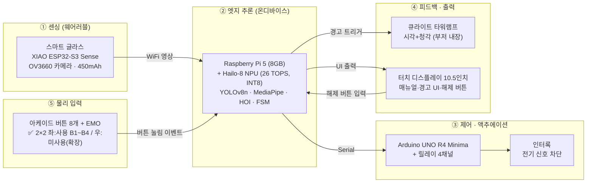
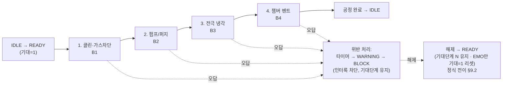
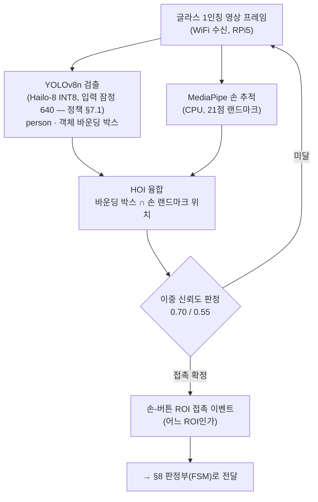
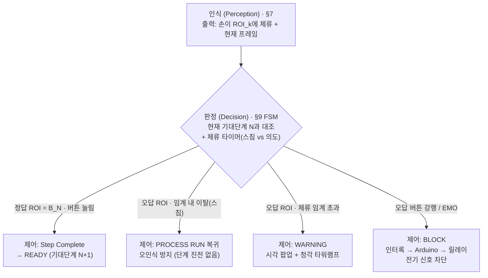
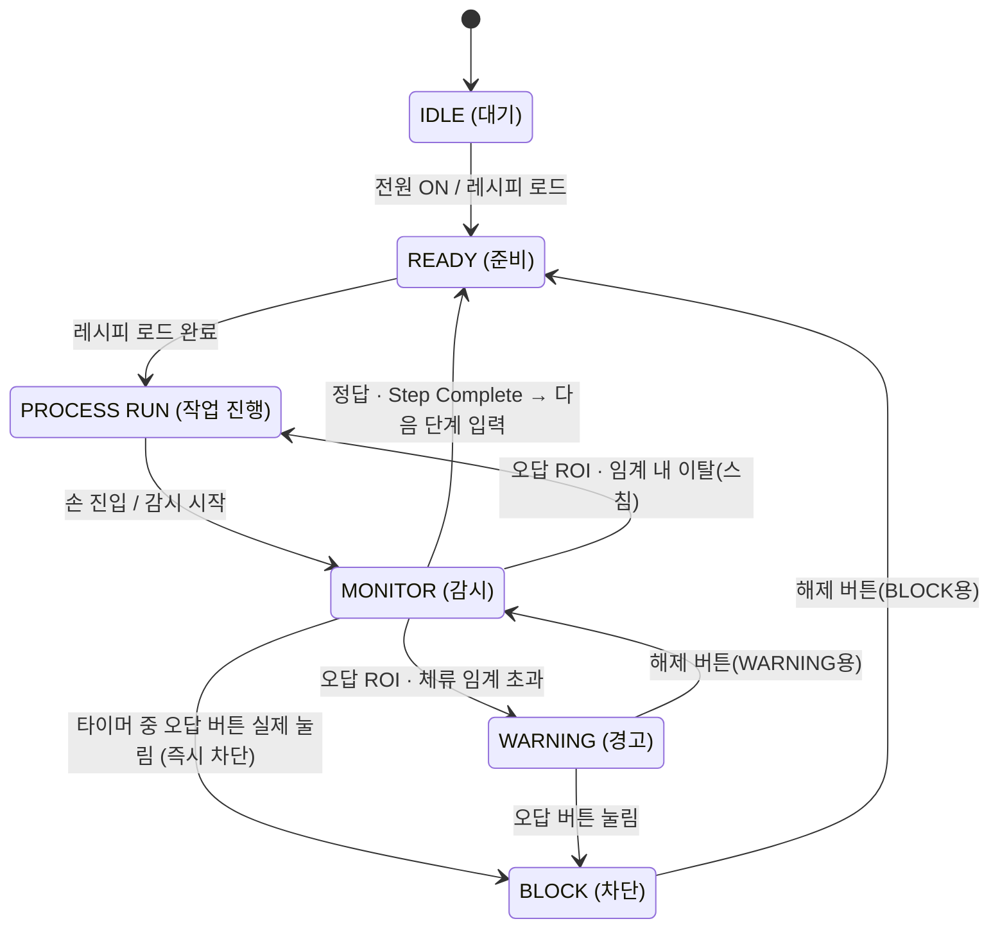
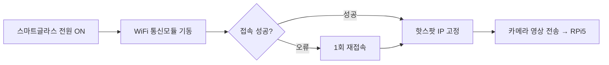

# 통합 수행·설계 문서
### 휴먼 에러 사전 예방 안전 시스템 — 1인칭 Vision AI × 웨어러블 기반 작업 순서 위반 실시간 감지·차단
#### 한국폴리텍대학 청주캠퍼스 · 반도체시스템과 · 4조

---

> ### 📌 문서 안내
>
> **이 문서 하나로 프로젝트가 무엇을·왜·어떻게·어디까지 검증됐는지 모두 알 수 있게 하는 본체 문서**다. 전 14개 섹션(§1~§14)을 모두 담는다.
>
> - **단일 기준(Source of Truth)**: 프로젝트 지식의 **최신 기준 문서**(파일명 `프로젝트 기준 문서_v*` 중 **버전 번호가 가장 높은 본**). 드라이브·과거 자료·발표 PDF와 충돌 시 **항상 최신 기준 문서 우선**. ※ 본문의 "근거: 기준문서 §X" 표기는 기준문서 계열의 섹션 번호를 가리킨다(통합문서 자체의 §번호와 별개). ※ 모델 명칭(`person_v1`/`console_v1`) 정합 완료. ※ **일정·작업 상태는 이 문서에서 다루지 않는다**. §12 회로도·핀맵 정본 = repo `dev/interlock`·`dev/glass` 결선도. Google Drive는 대용량 파일·팀 공유용(정본 아님, §14.3). (변경 이력은 [`타임라인.md`](타임라인.md) 참조)
> - **상태 표기**: `✅ 확정` / `🔄 검토·진행 중` / `⏸ 보류` / `❌ 폐기` / `[확인 필요]`
> - **구조 형식**: 이브와 제작설계서의 *시스템 구성도·알고리즘 명세서* 형식을 차용(화면설계서 자리를 FSM·AI·공정 로직으로 대체). 형식만 참고하며 그쪽 내용(화면·ERD·코드)은 따르지 않는다.
> - **자료 정본 = 본 문서 + repo**: 설계·사양·로직·결과는 본 통합 문서가 정본이며, 결선도·도식 등은 repo(`dev/*`)와 본문 Mermaid를 정본 초안으로 한다. **Google Drive는 정본이 아니라** 대용량 파일(영상·사진·발표자료) 저장·팀 공유용이다(§14.3). (이전 'Drive 원본 확인 필요' 표기 및 과거 Drive 링크는 폐기·무효)
> - **📖 읽기 순서 설계**: 배경(§2) → 현재문제·개선방향(§3 AS-IS/TO-BE) → 요구사항(§4) → 시스템 개관(§5) → **시연이 무엇인지(§6 공정 시퀀스)** → 그것을 어떻게 인식·판정·차단하는지(§7 AI → §8 연결 → §9 FSM) → 검증·HW(§10~§12) 순으로, 구체적 시연 시나리오를 먼저 보여준 뒤 기술 상세로 들어가도록 배치했다.

## 목차

| # | 섹션 | 요약 |
| --- | --- | --- |
| 1 | 표지·프로젝트 개요 | 프로젝트명·정의·팀(8인)·두 트랙 |
| 2 | 프로젝트 배경·필요성 | 지식 기반 착오, 사후 반응 한계, 피지컬 AI 포지셔닝, 단일 공정 범위 한정, 진척 회고 |
| 3 | AS-IS / TO-BE | 사후 반응 → 사전 차단 레이어(＋α) |
| 4 | 요구사항 정의 | 기능/비기능/시스템/사용자 요구 |
| 5 | 시스템 구성도 | 센싱→추론→제어→피드백→입력 |
| 6 | 시연용 공정 시퀀스 (4단계) | B1~B4 + EMO, 순서 위반 감지 |
| 7 | AI·비전 파이프라인 (독립 A) | YOLOv8n · MediaPipe · HOI |
| 8 | 〈연결〉 인식→판정→제어 | AI(§7)와 FSM(§9)을 잇는 다리 |
| 9 | FSM 알고리즘 명세 (독립 B) | 정본 6단계 상태머신 |
| 10 | 성능 검증 데이터 | 학습 결과 · 통합 테스트 · PoC 순서인식 · KPI |
| 11 | 하드웨어 사양·개발 환경 | 확정 사양표 · 개발환경 |
| 12 | 하드웨어 상세 설계(회로도·핀맵) | ✅ 결선도 작성(2026-06-12) + **인터락 전장 실물 결선·E2E 검증 완료(2026-07-15)** — dev/interlock·dev/glass + Drive drawio |
| 13 | 향후 확장 | 핵심에서 분리·보존된 기능 |
| 14 | 부록(소스·형상관리·BOM) | 형상관리 · 소스 · BOM · Drive 사용 방향 |

---

## 1. 표지·프로젝트 개요

| 항목 | 내용 |
| --- | --- |
| **프로젝트명** | 휴먼 에러 사전 예방 안전 시스템 |
| **부제** | 1인칭 Vision AI × 웨어러블 기반 작업 순서 위반 실시간 감지·차단 |
| **한 줄 정의** | 단일 **PECVD(플라스마 화학기상증착) 콘솔**에서 **공정 정비(PM·웻클린 make-safe) 시퀀스의 작업 순서 위반(누락·역순)** 을 비전 AI로 실시간 감지해, 오조작을 **버튼 입력 전에 사전 차단**하는 **휴먼 에러 사전 예방 시스템**(포카요케·인터락 기반). 순서 위반을 막아 공정·설비 손상과 작업자 안전 리스크를 함께 줄인다 |
| **소속** | 한국폴리텍대학 청주캠퍼스 · 반도체시스템과 · 2학년 B반 · 4조 |
| **지도교수** | 허주회 |
| **핵심 키워드** | `#VisionAI` `#EdgeAI` `#Wearable` `#FSM` `#HumanError` `#Pokayoke` |

**팀 구성 (8인)**

| 이름 | 역할 |
| --- | --- |
| 김응민 | 프로젝트 총괄 |
| 김동현 | 기획·발표 총괄 |
| 박송빈 | SW 책임 |
| 이재모 | HW 책임 |
| 김태현 | 운영 지원 책임 |
| 신희재 | SW–AI 데이터 담당 |
| 김선원 | HW 설계·제작 담당 |
| 천희동 | 운영 지원 담당 |

**두 트랙 관계 (한 줄)**
본 과제는 **융합프로젝트실습(학교 캡스톤, 본체)** 으로 진행되며, **한이음 드림업 프로젝트**는 별도 과제가 아니라 그 융합프로젝트의 **예산·멘토링 확보 및 공모전 출품을 위해 연계한 외부 프로그램**이다. (융합프로젝트 2026.02~10 / 한이음 수행기간 2026.04.01~10.30)

> **정의 범위 메모**: "단일 공정 시퀀스 1종의 순서 위반"으로 적용 범위를 **명시적으로 한정**한다(만능 시스템으로 보이지 않도록). 근거: 기준문서 §1·§3·§4.1.
>
> **목적 프레이밍 메모 (2026-06-13 확정)**: 본 시스템의 핵심 목적은 **작업 순서 위반(휴먼 에러)의 사전 예방**이다. '안전'은 목적이 아니라 그 **결과**(공정·설비 손상 방지 + 작업자 안전 리스크 감소)로 위치시킨다. 라이트커튼·세이프티도어 같은 **직접적 인적 보호장치가 아니며**, '안전'은 인적 안전보다 **공정 안전(make-safe)**에 가깝다. 따라서 '능동형 Fail-Safe'·'(전기 신호) 원천 차단' 같은 과장 표현은 지양하고, 'fail-safe'는 EMO NC 배선 등 **실제로 그러한 부분에만** 한정해 쓴다.
>
> **공정 특정 메모 (PECVD)**: 본 통합 문서는 시연 공정을 **PECVD(플라스마 화학기상증착)** 로 구체화한다. PECVD는 **CVD(화학기상증착) 계열의 한 변형**이다(PECVD ⊂ CVD, 물리기상증착 PVD와는 다른 계열). 현재 4단계 시퀀스(클린·가스차단 → 펌프/퍼지 → 전극 냉각 → 챔버 벤트, §6)가 PECVD **정비(PM·웻클린 make-safe) 절차**와 대응한다(2026-06-07 갱신, 기존 기동 절차 대체). 기준문서 §4.1의 'CVD·PVD 설비 가정'을 **CVD 계열의 PECVD로 좁힌** 것이다.

---

## 2. 프로젝트 배경·필요성

> 본 배경은 **사회적 바탕 1개 + 제작자(팀) 도출 2개**로 구성한다. 휴먼 에러가 산업적으로 큰 문제라는 **외부·사회적 근거**(§2.1) 위에, 우리 팀이 공정 현장 맥락에서 직접 도출한 **두 가지 문제** — ① 기존 장비의 '사후 반응' 한계(§2.2), ② 작업 순서 위반의 위험성(§2.3) — 를 얹는다.

### 2.1 [사회적 바탕] 휴먼 에러는 산업 전반의 큰 문제다

제조·산업 현장에서 휴먼 에러가 차지하는 비중은 거시적으로도 작지 않다. 제조 품질 결함의 약 **80%** 가 휴먼 에러에서 비롯된다 *(미국 NIST 제조업 손실 분석·국제 공학연구 저널(IJERA) 데이터 기준, 중간발표 자료 재인용)*. 이것이 "왜 휴먼 에러를 다룰 가치가 있는가"에 대한 외부·사회적 근거다.

최근 국내 반도체 현장에서도 화재·유독가스 누출 사고가 단기간에 잇따랐다 — ① **2026.06.01 SK하이닉스 청주 4캠퍼스 화재**(가스룸 화재·불소 누출, 약 3,600명 대피), ② **2026.06.12 같은 캠퍼스 M15X 화재**(같은 달 두 번째), ③ **2026.05.31 충북 보은 반도체 특수가스 업체 폭발**(독성 포스핀(PH3) 누출)(인명 중상 없음). 반도체 공정은 유독가스·화학물질·고온을 다루는 단계가 많다. *(출처: MBC·한국경제·조선비즈, 2026.05~06)*

> ⚠️ 단, 이는 거시 배경일 뿐 본 프로젝트가 그 문제 전체를 푼다는 뜻이 아니다. 본 시스템은 그중 단일 공정의 순서 위반 1종만 다룬다(§2.5).

### 2.2 [제작자 도출 ①] 기존 장비의 '사후 반응' 구조적 한계

우리 팀이 공정 조작 맥락에서 도출한 첫 번째 문제는, 기존 콘솔 장비가 작업자가 **물리 버튼을 누른 '사후'에만 반응**한다는 점이다. 즉 "무엇을 먼저 해야 하는지 알지만 순서를 빠뜨리거나 뒤바꾸는" **지식 기반 착오(Mistake)** 가 이미 입력되어 장비가 오작동한 *뒤에야* 그 사실을 인지하는 구조이며, 이 한계는 두 갈래로 나타난다. (근거: 기준문서 §3)

- **사후 대응의 한계** — 사고가 발생한 뒤 보고·조사하는 방식으로는 *예방*이 불가능하다. → **사전 예측·예방형** 안전 장치가 필요하다.
- **인간 주의력 의존의 한계** — 반복 작업과 피로가 누적되면 인지 오류가 생긴다. 순서 검증을 사람의 집중력에만 맡길 수 없다. → 작업 맥락을 인식하는 **안전 알고리즘**이 필요하다.

> 이 도출은 안전공학으로도 뒷받침된다 — NIOSH **통제의 위계(Hierarchy of Controls)** 상, 경고·교육·절차 같은 **행정적 통제**는 사람이 매번 지켜야 해 신뢰성이 낮은 반면, 사람 행동과 무관하게 작동하는 **엔지니어링 제어**가 더 효과적·신뢰성 높은 것으로 분류된다. 본 시스템의 **인터록**이 바로 그 엔지니어링 제어다 *(미국 NIOSH·CDC·OSHA 위험 예방·통제 권고 기준)*. → 사후 경고 위에 사전 인터록을 더하는 §3 TO-BE의 근거.

### 2.3 [제작자 도출 ②] 작업 순서 위반(누락·역순)의 위험성

두 번째로 도출한 문제는 순서 위반 자체의 위험이다. 정해진 공정에는 **반드시 선행되어야 하는 단계**가 있어, 예컨대 가스를 차단하기 전에 다음 단계로 넘어가거나, 전극이 충분히 냉각되기 전에 챔버를 벤트·개방하는(누락) 식으로 단계를 건너뛰거나, 이미 지난 단계로 되돌아가 버튼을 누르면(역순), **장비 오작동·공정 불량·설비 손상, 나아가 작업자 안전 사고**로 이어질 수 있다. 순서 위반은 단순한 실수가 아니라 **앞 단계의 안전 전제가 무너진 상태에서 다음 동작이 실행되는 것**이기 때문에 위험하다. 본 시스템이 겨냥하는 지점이 바로 이 "잘못된 순서의 버튼 입력"이다.

> **🎯 도메인 앵커 — PECVD 웻클린 정비(PM)**
> 본 시스템이 겨냥하는 구체 시나리오는 **PECVD 챔버의 웻클린 정비(maintenance, make-safe) 작업**이다. 정비는 **플라즈마 클린·가스 차단 → 펌프/퍼지 → 전극 냉각 → 챔버 벤트**의 순서가 전부 안전 임계로 묶여 있어, 한 단계라도 누락·역순되면 잔류 가스·고온·잔압이 남은 상태에서 다음 동작이 실행되어 사고로 이어질 수 있다. 본 시스템은 이러한 정비 단계의 순서 위반을 **버튼 입력 직전에 사전 감지·차단**하는 것을 목표로 한다. (공정 4단계 정의는 §6, 시퀀스는 제조사 정비 매뉴얼류에 앵커링)

### 2.4 기술 포지셔닝 — 피지컬 AI(Physical AI)

> **🚀 피지컬 AI의 '눈'을 작업자에게 입힌다**
>
> 화면 속 데이터를 넘어 실세계를 직접 인식하고 물리적으로 행동하는 **피지컬 AI(Physical AI)**는 최근 산업계의 핵심 화두로 떠올랐다 *(젠슨 황(NVIDIA)이 CES 2025·2026 키노트에서 '피지컬 AI'를 차세대 핵심 흐름으로 제시)*. 앞서 짚은 정비 현장의 위험(작업 순서 위반, §2.3·§6)은 모니터 너머가 아니라 **사람의 손이 실제 장비를 다루는 물리 세계**에서 일어난다. 그래서 이런 위험은 데이터를 분석하는 소프트웨어 AI만으로는 막기 어렵고, **실세계를 직접 보고 물리적으로 개입하는 AI**라야 사고 이전에 차단할 수 있다.
>
> 로봇이 사람을 대신해 위험한 일을 떠맡는 흐름은 이미 현실이다 — 현대자동차그룹 무인 소방로봇은 사람이 들어갈 수 없는 화재 현장에 투입돼, 사람 눈이 닿지 못하는 곳을 적외선으로 대신 본다 *(현대자동차그룹이 자사 무인 소방로봇을 공식 'Physical AI' 사례로 소개)*. 같은 이치라면 위험한 반도체 정비도 로봇이 통째로 대신하는 것이 가장 이상적일 것이다. 그러나 위험한 정비를 사람 없이 대신하는 **완전자율 로봇은 아직 상용화되지 않았다.** 그래서 본 프로젝트는 **로봇 본체를 새로 만드는 대신, 피지컬 AI의 핵심인 '비전(눈)'만 떼어내 작업자가 착용하는 웨어러블 스마트 글라스(§5·§11)에 이식**하는 길을 택했다 — 작업자의 몸과 손은 그대로 두고 그 위에 피지컬 AI의 인식·판단을 얹어, **사람이 곧 로봇의 몸, AI가 그 눈과 두뇌가 되는** 구조다.
>
> 그 비전을 중심축으로, 작동은 피지컬 AI의 **폐루프 3요소**를 완성한다: ① 1인칭 비전으로 손동작을 **인식**(눈, §7) → ② SOP 순서 위반을 **판정**(두뇌, FSM §9) → ③ 위반 시 장비를 **인터록으로 물리 차단**(손발, §8). 사후에 반응하던 기존 안전을 **사고 이전의 인식·차단**으로 바꾸는 것이 본 시스템의 피지컬 AI 포지셔닝이다. *(§3 TO-BE의 '＋α 안전 레이어'와 정합)*

### 2.5 본 프로젝트의 범위 — 단일 공정·순서위반 1종으로 한정

> **🎯 범위 단서 (반드시 함께 읽을 것)**
> 본 시스템은 휴먼 에러 전반을 막는 만능 시스템이 **아니다.** 위 거대한 문제 중에서도 **"작업 순서 위반(누락·역순)"이라는 단일 유형**을, **단일 PECVD 콘솔의 정해진 공정 시퀀스 1종**에 한정해 감지·차단하는 **시스템**이다. (콘솔은 시연용 모조품 — §6.)
>
> 이는 멘토 피드백("벤처급으로 방대한 범위를 학생 학습 목적에 맞게 좁히고 단순화하라")을 반영한 의도적 스코프 설정이며, 검증된 자산(YOLO person 검출, 손-객체 HOI, FSM, 정답/오답 ROI)이 전부 이 단일 시나리오용이라는 점과도 일치한다. 그 외 시나리오(주변 안전 감시·로깅·기타 휴먼에러 등)는 **폐기가 아니라 §13 향후 확장**으로 분리되어 있다. (근거: 기준문서 v6 범위 축소 블록·§3·§4.1)

### 2.6 진척 회고 — 상반기 지연 원인

> 상반기(2~5월) 진행에서 발생한 지연의 배경을 기록한다. 결과보고서·회고 자산으로 보존하는 서술이며, 일정·작업 상태의 실시간 추적은 이 문서의 범위 밖이다.

상반기에는 여러 작업을 착수했으나 준완성(팀 공유·확정 전) 상태가 많았고, 5/27 중간발표 시점의 진척은 제한적이었다. 주요 지연 원인은 다음 네 가지였다.

1. **물품 배송 지연**: 2차 물품이 약 6주간 지연 도착(04.04 신청 → 05.20 도착)하여 하드웨어 통합 착수가 밀렸다.
2. **1차 물품 성능 부족**: 초기 확보한 부품의 성능이 부족해 AI 가속기를 추가 발주(3차, 05.13)했다.
3. **초기 기획 완성도 부족**: 범위가 방대해 핵심 시나리오 확정·문서화가 늦어졌고, 이후 범위 축소(PECVD 순서 위반 감지로 한정)로 재정비했다.
4. **학사 일정 집중**: 중간고사·체육대회 등 학사 일정과 겹쳐 개발 가용 시간이 줄었다.

> 위 지연을 반영해 6월 이후 일정을 현실적으로 재수립했으며, 일정 추적 자체는 이 문서에서 다루지 않는다.

---

## 3. AS-IS / TO-BE

> 기존 콘솔(AS-IS)과 본 시스템(TO-BE)의 1:1 대응. 핵심 메시지는 **"대체가 아니라 에러 예방(안전) 레이어의 추가"** 다. §2 배경에서 도출한 두 문제(사후 반응·순서 위반)에 대한 개선 방향을 보인다. (근거: 기준문서 §3·§4)

| 구분 (비교 축) | AS-IS (기존 콘솔) | TO-BE (본 AI 콘솔) |
| --- | --- | --- |
| **Viewpoint (시점)** | 3인칭 고정 CCTV | **작업자 1인칭** 웨어러블 스마트 글라스 |
| **Timing (반응 시점)** | 물리 버튼이 눌린 **'사후'에만** 반응 (오작동 후 인지) | 버튼 입력 **직전**에 사전 감지·차단하는 **레이어를 추가** |
| **순서 검증 방식** | 순서 위반을 **작업자의 주의력에 의존** | **비전 AI가 ROI 기준으로 자동 판정** (정답/오답 분기) |
| **Response (대응 대상)** | **관리자**에게 알림 | **작업자 본인**에게 즉시 알림·피드백 |
| **사고 대응 (차단)** | 오작동 발생 후 **보고·조사**(사후 처리) | **인터록으로 전기 신호 차단**(사전 차단). ※본 시연은 실장비 없이 타워램프로 시각화 |
| **Processing (처리)** | **클라우드 서버** | **엣지 온디바이스**(Pi5 + Hailo-8) |

> **💡 핵심 메시지 — 플러스알파(＋α)**
> 본 시스템은 기존 콘솔을 **대체하거나 부정하지 않는다.** 기존 콘솔의 '사후 반응' 위에 **'버튼 입력 직전의 사전 감지·차단 레이어'를 얹는** 개선이다. 즉 기존 장비와의 대결 구도가 아니라, 그 위에 **에러 예방(안전) 레이어를 더하는(＋α)** 구조다.
>
> **구현 순서**: 사전 예방 레이어(본 시스템)를 **먼저 구현**하고, 기존 콘솔 계열 기능(와이드뷰 카메라·관리자 경고 해제 등)은 이후 **추가 확장**한다(§13).

---

## 4. 요구사항 정의

> 핵심 시나리오(작업 순서 위반 감지·차단)를 기준으로 한 요구사항이다. 촉각(진동 팔찌 햅틱)·로깅·주변 안전 감시 등은 핵심 범위 밖(§13 확장)이므로 여기 포함하지 않는다. (근거: 기준문서 §3·§6·§7·§4.5)

### 4.1 기능 요구사항 (Functional Requirements)

| ID | 요구사항 | 설명 | 상태 |
| --- | --- | --- | --- |
| **FR-1** | 작업 순서 위반 감지 | 현재 기대단계 N 기준, **정답 ROI 외의 버튼 ROI**에 손이 접근하면 누락·역순을 위반으로 판정 | ✅ 확정 |
| **FR-2** | 시청각 피드백 | 위반 시 **시각(화면 팝업) + 청각(타워램프·부저)** 2층 피드백 출력 | ✅ 확정 *(촉각은 §13 확장)* |
| **FR-3** | 인터록 차단 | 오조작 강행 시 **장비로 가는 전기 신호를 차단**(인터록). ※본 시연은 타워램프로 시각화 | ✅ 확정 |
| **FR-4** | 작업자 본인 해제 | 경고·차단 상태를 **작업자 본인이 디스플레이의 해제 버튼**으로 복구 (WARNING→감시 복귀 / BLOCK→준비 복귀) | ✅ 확정 *(관리자 승인 에스컬레이션은 §13)* |

### 4.2 비기능 요구사항 (Non-Functional Requirements)

| ID | 요구사항 | 목표값 | 상태 |
| --- | --- | --- | --- |
| **NFR-1** | 실시간 처리 | **15 fps** 안정 처리 (2026-06-13 하향 확정 — 30fps는 ESP32-S3 경로상 달성 불가) | ⚠️ ESP32-S3 TCP 실측 ~13fps는 **MediaPipe 미포함** 값 → HOI 추가 시 더 낮아질 수 있음. **15fps 목표에 맞춰 SW 최적화** 방향. console_v2·MediaPipe 포함 재측정 필요 (§10.6) |
| **NFR-2** | 응답시간 | 시각·청각·인터록 응답 **≤ 100 ms** | 🔄 목표값 — 데모 구동 시 실측 검증 필요 (기준문서 §7) |
| **NFR-3** | Edge 온디바이스 추론 | 클라우드 의존 없이 **엣지(RPi5 + Hailo-8)에서 온디바이스 추론** | ✅ 확정 (기준문서 §5·§6) |

### 4.3 시스템 요구사항 (한 줄)

**"FPV 단일 비전 + FSM 6상태 + 인터록 아키텍처를 구현한다."** — 즉 1인칭 웨어러블 카메라 한 대의 영상으로 손-ROI를 판정하고, 6단계 유한 상태 머신(FSM 6상태 정의는 §9)으로 정상/위반을 분기하며, 위반 강행 시 인터록으로 전기 입력을 차단하는 구조를 갖춘다. (Wide-View 주변 감시 병렬 구성은 §13 확장)

### 4.4 사용자 요구사항 (한 줄)

**"작업자가 잘못된 순서를 시도하면 시스템이 이를 감지하고, 시청각으로 피드백하며, 필요 시 입력을 차단한다."** (작업자 관점)

---

## 5. 시스템 구성도

> 핵심 시연 구성은 **FPV 단일 비전 + 엣지 온디바이스 추론 + 인터록 제어 + 시청각 피드백**이다. (근거: 기준문서 §5·§6.1) Wide-View 주변 감시(고정 카메라 병렬)와 진동 팔찌(촉각)는 핵심 구성에서 제외되어 §13 확장에 있다.

### 5.1 시스템 구성 블록도



> 정밀 결선·전원 계통이 포함된 회로도·핀맵은 **§12 및 repo `dev/interlock`·`dev/glass` 결선도** 참조.

### 5.2 통신 경로 (정본)

> 본 프로젝트 통신 경로의 **단일 정본 표**다. (위 §5.1 블록도가 같은 경로를 그림으로 보인다.)

| 구간 | 방식 | 내용 |
| --- | --- | --- |
| 글라스 → RPi5 | **WiFi** | 1인칭 영상 프레임 전송 |
| RPi5 → Arduino | **Serial** | 인터록 제어 신호 |
| RPi5 → 타워램프 | 신호 출력 | 위험도별 점멸·경고음 트리거 |
| RPi5 ↔ 디스플레이 | 출력 + 해제 입력 | 매뉴얼·경고 UI 출력 / 해제 버튼 입력 수신 |
| 버튼 → RPi5 | 디지털 입력 | 버튼 눌림 이벤트 |

> ※ **핵심 경로**: ESP32-S3(WiFi 영상) → RPi5(AI 분석) → Arduino(Serial 인터록).
> ※ ESP32-C3(BLE 햅틱)는 핵심 통신 경로에서 **제외**(§13 확장).
> ※ **WiFi 접속 흐름**(전원 ON→접속→영상 전송)은 FSM 상태 전이가 아니라 **통신 초기화 시퀀스**이므로 §13.3에서 별도로 관리한다.
> (근거: 기준문서 §6.1) 통신 핀 결선·회로 정밀 사양은 §12(회로도·핀맵) 참조.

### 5.3 구성 요소 요약 (블록도 판독용)

> 전체 **확정 하드웨어 사양표**는 §11에서 정리한다. 여기서는 블록도를 읽는 데 필요한 수준만 요약한다. (근거: 기준문서 §5)

- **메인 허브** ✅: Raspberry Pi 5 (8GB)
- **AI 가속기 (주)** ✅: Hailo-8 (26 TOPS, INT8) — M.2 PCIe Gen3. *예비: Hailo-8L(13 TOPS)은 비상 대체용일 뿐 **주 사양으로 인용 금지**(§11·기준문서 §11).*
- **스마트 글라스** ✅: XIAO ESP32-S3 Sense (OV3660, WiFi 영상)
- **인터록 제어** ✅: Arduino UNO R4 Minima(주)/R3(예비) + 릴레이 4채널(주)/8채널(예비)
- **경보** ✅: 큐라이트 타워램프(부저 내장 — 별도 부품 아님)
- **터치 디스플레이** ✅: 제우스 Z10 10.5인치 — **출력 전용**(입력 아님), 단 해제 버튼 UI는 여기 배치
- **물리 입력 버튼** ✅ (2026-06-09 배치 확정): 동일 아케이드 버튼 **8개**(4색 흰·검·핑크·노랑 ×2개씩) + 비상정지(EMO). **좌 2×2 = 사용(하드웨어 연결) B1~B4 / 우 2×2 = 미사용(확장용)**. 색↔단계 = **B1 노랑·B2 흰·B3 핑크·B4 검정+🔵파랑 원 스티커**. 좌·우 색 중복은 **미사용(우) 버튼 클릭면 스티커**로 구분, 비전은 **사용(좌) 그룹만 ROI**로 인식.
  - 🔵 **B4 스티커 폴백 발동(2026-07-13 확정, §10.12)**: 당초 "검정은 무광 배경·유광 버튼 대비로 검출, **미흡 시 스티커 폴백**"으로 설계했는데, **그 미흡이 실제로 확인**됐다(검정 버튼 on 검정 패널 → 대비 8~15/255, ESP32에서 B4 검출 0%). → **버튼 면에 파랑 원 스티커 부착**. 채도 대비 ΔS 9.1 → **98.0**(10.8배), 블러·JPEG·저해상도에 **무손상**. B4가 색으로 구분되는 클래스가 됐다.
> **버튼 배치도 (2×2, 1인칭 시야 가운데 집중 — PoC 성공 배치 재현)**
> ```
>    사용(B1~B4) ─ 하드웨어 연결        미사용(확장) ─ 클릭면 스티커
>      [B1 노랑①] [B2 흰 ②]              [ ] [ ]
>      [B3 핑크③] [B4 검정+🔵파랑스티커④]   [ ] [ ]
>          순서 ①→②→③→④ (Z자)              · EMO는 별도 배치
> ```
- **외장재** ✅: 알루미늄 프로파일(DF3030) + MDF/포맥스
- *고정 카메라(ABKO APC900): Wide-View 주변 감시 용도는 §13 확장. 진동 팔찌(XIAO ESP32-C3): §13 확장.*

---

## 6. 시연용 공정 시퀀스 (4단계)

> ✅ **시연용 "공정 시퀀스 1종" 정본(2026-06-04 확정 → 2026-06-07 PECVD 정비(PM·웻클린 make-safe) 시퀀스로 갱신).** 핵심 시나리오 "작업 순서 누락/위반"을 시연하기 위한 4단계 공정이다. 기존 기동(운전) 시퀀스 대신, "모든 단계가 안전 임계라 한 단계라도 누락·역순되면 사고"라는 조건에 더 부합하는 **정비(make-safe) 시퀀스**(클린·가스차단 → 펌프/퍼지 → 전극 냉각 → 챔버 벤트)로 확정했다. **이 시퀀스가 이후 §7 AI 인식·§8 연결·§9 FSM이 다루는 구체적 대상**이므로 여기서 먼저 정의한다. (FSM 6상태 정의는 §9 참조) (근거: 기준문서 §4.5 + 2026-06-07 브레인스토밍 재설계)

> ### ⚠️ 콘솔 구성·라벨 주석 (반드시 읽을 것)
> 이 콘솔에는 **디스플레이·물리 버튼(다수)·타워램프·비상정지(EMO) 버튼만** 있고, **플라즈마 클린·가스 차단·펌프/퍼지·전극 냉각·챔버 벤트 등 실제 PECVD 정비 공정을 수행하는 기능은 없다.** 아래 단계명("클린·가스차단", "펌프/퍼지" 등)은 **버튼에 붙인 라벨(이름표)일 뿐 실제 물리 동작을 일으키지 않는다.** 버튼을 눌러도 가스가 차단되거나 챔버가 벤트되지 않는다. 시연이 증명하는 것은 오직 **"정해진 순서대로 버튼을 눌렀는가 / 순서를 위반했는가"를 비전 AI가 감지·차단**하는 것이다. (§2.5 "단일 공정 범위 한정" 전제와 정합)

### 6.1 4단계 공정 + 비상정지

| 단계 | 버튼 라벨 | 정답 ROI | 오답(위반) ROI | 오답 시 동작 (전이) | 정답 시 전이 |
| --- | --- | --- | --- | --- | --- |
| **1** | 클린·가스차단 (플라즈마클린 CF₄/O₂ + SiH₄ 차단) 〔노랑〕 | **B1** | B2·B3·B4 (누락=뒤 단계 건너뜀) | 오답 ROI→타이머→(스침)PROCESS RUN 복귀 / (체류)WARNING→해제 시 MONITOR / 오답 누름 시 BLOCK→해제 시 READY (**기대단계=1 유지**) | B1 정답→Step Complete→READY(기대=2) |
| **2** | 펌프/퍼지 (N₂ ≥2사이클) 〔흰〕 | **B2** | B1(역순)·B3·B4(누락) | 〃 (BLOCK 해제 시 **기대=2 유지**) | B2 정답→READY(기대=3) |
| **3** | 전극 냉각 (~300℃) 〔핑크〕 | **B3** | B1·B2(역순)·B4(누락) | 〃 (**기대=3 유지**) | B3 정답→READY(기대=4) |
| **4** | 챔버 벤트 → 개방 〔검정〕 | **B4** | B1·B2·B3(역순) | 〃 (**기대=4 유지**) | B4 정답→공정 완료→IDLE |
| **공통** | 비상정지 (EMO) | — | — (위반 판정 대상 아님) | EMO 누름 → **즉시 BLOCK**(안전 정지), 해제 시 **READY 복귀 + 기대단계=1로 리셋**(시퀀스 전체 중단·재시작) | — |

- **판정 규칙(한 줄)**: 시스템이 기대단계 N을 들고 있고, **BN ROI = 정답 / 그 외 공정 버튼 ROI = 오답.** 이 규칙 하나로 누락(뒤 버튼)·역순(앞 버튼)이 모두 잡힌다.
- **핵심 불변식**: 오답은 단계를 **절대 진전시키지 않는다.** 위반으로 BLOCK까지 가서 해제해도 기대단계는 유지된다(예: 2단계 위반 차단 후 복구해도 여전히 2단계).
- **역순/누락 구분**: 1단계는 앞 단계가 없어 오답이 전부 '누락', 4단계는 뒤 단계가 없어 전부 '역순', 2·3단계는 양쪽 모두 존재.
- **EMO 성격**: EMO는 오답 판정(타이머·필터링)을 거치지 않고 즉시 BLOCK되는 **긴급 안전 정지**라 오답 버튼과 성격이 다르다. 따라서 **EMO 해제는 위반 BLOCK과 달리 기대단계를 1로 리셋**한다(시퀀스 전체 중단·처음부터 재시작).

### 6.2 정상 / 이상 흐름



### 6.3 사용자 흐름 시나리오 (착용 → 기동 → 작업 → 감지 → 피드백/차단)

> 시청각 2층 피드백 기준(촉각/햅틱은 §13). FSM 상태·전이 상세는 §9.

- **도입**: 글라스 착용·전원 ON → WiFi 영상 연결(접속 과정은 §13.3 별도 통신 시퀀스) → 레시피 로드 → FSM **IDLE→READY**(기대=1)
- **정상**: 각 단계 BN ROI 진입 → MONITOR 정답 → 누름 → Step Complete → READY 복귀(기대 N+1). B4 완료 시 IDLE
- **이상**: 오답 ROI 진입 → 타이머 → (스침)복귀 / (체류)**WARNING**[시각 팝업 + 청각 타워램프] → 해제 버튼 시 MONITOR 복귀 / 오답 강행 시 **BLOCK** → 인터록 전기 차단 → 해제 버튼 시 READY 복귀

> §9.2 상태도·§6.2 흐름도는 본문 Mermaid를 정본 초안으로 한다(정식 도식은 추후 repo에 작성 예정).

---

## 7. AI · 비전 파이프라인 〔독립 섹션 A〕

> "인식" 단계를 담당하는 비전 파이프라인을 독립적으로 기술한다. 앞 §6 시연 시퀀스의 버튼을 인식 대상으로 하며, 이 파이프라인의 **출력**(손-버튼 ROI 접촉 이벤트)이 §8을 거쳐 §9 FSM의 입력이 된다. (근거: 기준문서 §6.1·§7)

### 7.1 스택 구성 (확정)

| 구분 | 확정 내용 | 상태 |
| --- | --- | --- |
| 객체 검출 | YOLOv8n (Hailo-8, INT8). **모델 3단계** → ①초기 `person_v1.pt`(person 단일, mAP50≈0.96 검증완료) / ②`console_v1`(버튼 5클래스 B1~B4+EMO, **1차 검증 테스트용** — .hef 파이 통합·실추론·벤치마크 완료, B4 미탐지 확인 → **console_v2 재학습 확정**) / ③`console_v2`(**최종 시연 모델** — 정확도 보강 재학습, 추후) | ✅ ① / ✅ ② 실추론완료 / ⬜ ③ |
| 입력 해상도 | console_v1 = **640×640**(HEF 빌드 규격, 검증됨). **결정 규칙(2026-06-13)**: MediaPipe 포함 FPS 실측 후 — 15fps 목표 미달이면 **QVGA(320) 고려**, 충분하면 **640 유지 + SW 최적화**. console_v2 재학습 시 단일값 확정 | ⚠️ 조건부 보류 — 잠정 640 |
| 손 추적 | MediaPipe 0.10.x (CPU, Tasks API, **21점 랜드마크**) | ⚠️ **Python 3.13 / aarch64 미지원** — hailo_platform이 Python 3.13 전용이라 충돌. PoC에서 HOI 검증 보류 |
| HOI 분석 | MediaPipe 손 랜드마크 + YOLO 바운딩 박스 **융합** → 손-객체 상호작용 판단 | ⚠️ MediaPipe 미지원으로 PoC 보류 |
| HOI 신뢰도 임계값 | **이중 0.70 / 0.55** | ✅ (기준문서 §7) |
| 데이터셋 | Roboflow / AnyLabeling 커스텀 라벨링 (클린룸 특화) — `cleanroom_person_detection_v3` | ✅ |
| 모델 변환 | Hailo DFC(3.33.1) → **HEF**. `console_v1.onnx` → `console_v1.hef` **파이 통합 완료**(5클래스, 입력 uint8 640×640, HailoRT NMS 내장, HailoRT 4.23.0). 상세 변환 과정(Model Zoo 2.18 짝맞춤·end-node 6지점·캘리브·설치 트러블슈팅): `dev/ai_model/참고/YOLOv8n_Hailo8_변환_작업기록.md` 참고. 최종 시연용 `console_v2` 변환은 추후 | ✅ v1 실추론완료(B4 실패·B1~B3·EMO 검출) / ⬜ v2 |

> **🔖 모델 네이밍 규약 (정본, 3단계)**: ①`person_v1.pt` = **초기 검증**(person 단일·mAP50≈0.96 완료) → ②`console_v1`(.pt/.onnx/.hef) = **버튼검출 1차 검증 테스트·검증 모델**(5클래스 B1~B4+EMO. Hailo 경로·버튼 동적검출 파이프라인 **검증 완료**. 2026-06-11 실추론 벤치마크: B1·B2·B3·EMO 검출 확인, **B4 완전 미탐지**(ESP32 경로) — **원인 재분석 §10.7**(양자화 반증·카메라 입력 품질 주가설·모델 저대비 부가설, 미확정). **→ console_v2 재학습 확정**) → ③`console_v2` = **최종 시연 모델**(정확도 보강 재학습, GPU+캘리브 1024+장, **추후**). §10의 mAP 0.96은 **person_v1** 결과다. **console_v1은 "버튼검출이 되는지" 검증 완료**이고, 시연 KPI 실측·최종 정확도는 **console_v2** 기준이다. 모델 인용 시 이 규약을 단일 기준으로 한다. (기준문서 §6.1 규약과 정합)

> **🎯 console_v2 재학습 SW 목표치 (2026-06-29 발표 반영)**: 다음을 목표로 설정한다 — 데이터셋 **버튼 클래스당 1,000장**(버튼 외 클래스 500~700장), **오탐지율 ≤ 10%**, **클래스 신뢰도 ≥ 90%**(모두 보수적 수치). 타이머 체류 임계값은 실물 전장 구성 후 재측정한다(잠정 1.5초, §9.4). ※ **이 목표치는 B4 미탐지의 부 가설(모델 저대비) 대응**이다 — **주 가설=카메라 입력 품질(§10.7)은 데이터 보강으로 해결되지 않으므로**, 입력 품질 대응(카메라·전처리)은 별도 축으로 다룬다.

### 7.2 알고리즘 명세 — 손-객체 상호작용(HOI) 인식

**흐름도**



**처리 시나리오 (번호)**

1. ESP32-S3 글라스가 WiFi로 1인칭 영상 프레임을 전송 → RPi5 수신
2. YOLOv8n(Hailo-8, INT8)으로 프레임에서 person·객체 바운딩 박스 검출 *(입력 해상도 잠정 640 — 결정 규칙 §7.1)*
3. MediaPipe(CPU)로 손 21점 랜드마크 추출
4. **HOI 융합**: YOLO 바운딩 박스와 손 랜드마크 위치를 융합해 "손이 어느 버튼 ROI에 들어와 있는가"를 판단
5. **이중 신뢰도 임계값(0.70 / 0.55)** 으로 접촉/비접촉을 확정해 오인식 억제
6. 확정된 **손-ROI 접촉 이벤트**를 §8(인식→판정→제어)을 통해 §9 FSM 판정부로 전달

### 7.3 상세 설명

- **검증된 핵심**: 클린룸 person 검출 성능(mAP@50 ≈ 0.96 등)은 §10에서 정리한다(초기 `person_v1` 결과 — 네이밍 규약 §7.1).
- **변환 이슈와 해결(이력)**: YOLO→Hailo HEF 변환 후 객체 미탐지/오라벨 현상이 있었고, 원인은 NMS 방식 불일치·입력 형식 불일치(FLOAT32 vs UINT8)·클래스 수 불일치·파이프라인 호환성이었다. **Python 직접 처리 전환, 입력 형식 UINT8 통일, 클래스 14→10개 이하 재맵핑, 검증된 YOLO 기본 모델 적용**으로 해결했다. (근거: 기준문서 §8 해결 완료 항목)
- **해상도 정책(2026-06-13 갱신)**: console_v1은 **640** 검증 완료. 최종값은 **MediaPipe(HOI) 포함 FPS 실측** 후 결정 — 15fps 목표 미달이면 QVGA(320) 다운, 충분하면 640 유지 + SW 최적화. (§10.6)

### 7.4 🔄 검토 중 / 확장 분리

- 🔄 **검토 중**(확정 아님, 기준문서 §6.2): 공구 탐지(드라이버·스패너 등), FOUP **8"/12"** 식별, 비상정지(EMO) 버튼-손 상호작용 판정
- **§13 확장으로 이동**: 작업 완료 확인 제스처(MediaPipe `Thumb_Up`)·캡처 로깅은 로깅 기능과 함께 핵심에서 분리됨
- **학습 곡선·혼동행렬**: 초기 `person_v1` 학습 결과 수치는 **§10** 참조(그래프 이미지 파일은 팀 공유 드라이브 보관). 데이터셋·라벨링 세트(`cleanroom_person_detection_v3`)는 Roboflow/AnyLabeling 원본.

---

## 8. 〈연결〉 인식 → 판정 → 제어 흐름

> AI 파이프라인(§7, 독립 A)과 FSM(§9, 독립 B)을 잇는 **다리** 섹션이다. 비전 파이프라인의 출력이 어떻게 FSM 판정으로 들어가고, 그 판정이 어떻게 물리 제어(인터록·피드백)로 이어지는지를 한 장에 보인다. (근거: 기준문서 §4.5·§6.1)



**연결 규칙 요약**

- **인식부(§7)** 는 "어느 버튼 ROI에 손이 있는가"라는 이벤트만 만든다. 정답/오답 여부는 *알지 못한다*.
- **판정부(§9 FSM)** 가 그 이벤트를 **현재 기대단계 N**과 대조해 의미를 부여한다 — 정답(B_N)인가, 오답(누락·역순)인가, 단순 스침인가.
- **제어부**는 판정 결과를 물리 출력으로 옮긴다 — 정상 진행 / 경고(시청각) / 차단(인터록). 응답시간 목표는 **≤ 100 ms**(🔄 목표값, 검증 필요).
- 이 분리 덕분에 비전 모델(§7)과 상태 로직(§9)을 **독립적으로 교체·개선**할 수 있다.

---

## 9. FSM 알고리즘 명세 〔독립 섹션 B〕

> ✅ **FSM 정본(2026.06.03 확정)을 단일 기준으로 한다.** 과거 자료의 5단계(v2)·7단계(4월 초안)·9단계(목차 표기) 불일치는 모두 폐기(기준문서 §11). **핵심 6단계 + 정상복귀/해제 경로**만 사용한다.
> **FSM 정본 = 아래 6상태 정의(§9) + 본문 Mermaid 상태도.** (별도 `.drawio` 도식 파일은 팀 공유 드라이브에 보관)

### 9.1 상태 정의 (6개)

| # | 상태 | 의미 |
| --- | --- | --- |
| 1 | **IDLE** (대기) | 전원 대기 상태 |
| 2 | **READY** (준비) | 레시피(공정 매뉴얼) 로드 완료, 감시 대기 |
| 3 | **PROCESS RUN** (작업 진행) | 정상 공정 진행 중 |
| 4 | **MONITOR** (감시) | 손-ROI 판정 — 정답/오답 분기점 |
| 5 | **WARNING** (경고) | 시·청 경고 출력 (촉각은 §13) |
| 6 | **BLOCK** (차단) | 인터록으로 전기 입력 차단 (시연=타워램프 시각화) |

### 9.2 상태 전이도



> **EMO(비상정지) 공통 경로**: 어느 상태에서든 EMO를 누르면 오답 판정(타이머·필터링)을 거치지 않고 **즉시 BLOCK**(안전 정지), 해제 시 **READY 복귀 + 기대단계=1로 리셋**(시퀀스 전체 중단·처음부터 재시작). 위반 BLOCK이 기대단계를 유지하는 것과 구분됨. (상태도에는 생략, §6 표의 공통 행 참조)

### 9.3 전이 시나리오 (번호)

1. **IDLE → READY**: 전원 ON / 레시피 로드
2. **READY → PROCESS RUN**: 레시피 로드 완료
3. **PROCESS RUN → MONITOR**: 손 진입 / 감시 시작
4. **MONITOR(정답 분기)** → 작업 완료(Step Complete) → **다음 단계 버튼 입력 → READY 복귀** *(다단계 정상 루프)*
5. **MONITOR(오답 분기)** → 오답 ROI 진입 → **타이머 작동(체류시간 측정)** → 필터링 판단
   - 필터링 **"예"**(임계시간 내 이탈 = 단순 통과) → **PROCESS RUN 복귀** (오인식 방지)
   - 필터링 **"아니오"**(체류 지속, 임계 초과) → **WARNING**
   - ※ 타이머 작동 중이라도 **오답 버튼이 실제로 눌리면 곧장 BLOCK**(경고 생략, 즉시 차단)
6. **WARNING** 두 갈래: 해제 버튼(WARNING용)→**MONITOR 복귀** / 오답 버튼→**BLOCK**
7. **BLOCK** → 해제 버튼(BLOCK용) → **READY 복귀**

> **해제 버튼 2종 메모**: WARNING 해제(→MONITOR)와 BLOCK 해제(→READY)는 **복귀 지점이 다른 별도의 두 버튼**으로 설계하며, 둘 다 디스플레이(터치 모니터)에 배치한다.

### 9.4 임계값 정본

| 값 | 확정값 | 상태 |
| --- | --- | --- |
| 타이머 체류시간 임계 (스침 vs 위반 경계) | **dwell 0.5초 + 갭메우기 0.3초** (PoC 1차 검증값) | ✅ PoC 실측 — 스침 오탐 0% (§10.3) |
| 시각·청각·인터록 응답시간 | **≤ 100 ms** | 🔄 목표값 — 검증 필요 (§10 KPI) |
| HOI 신뢰도 임계 (이중) | **0.70 / 0.55** | ✅ (§7·§8) |
| BLOCK / WARNING 복구 주체 | **작업자 본인 해제** (디스플레이 해제 버튼 2종) | 🔄 신규 정책 |

> **타이머 근거 (2026-06-07 PoC 반영)**: PoC 1차 검증에서 **dwell 0.5초 + 갭메우기(채터 제거) 0.3초** 조합이 스침 오탐 0%·순서 정확 인식을 달성해 이 값을 정본으로 채택한다. 갭 메우기는 누름 순간 손이 버튼을 가려 인식이 끊기는 채터를 메우는 필수 요소다(§10.3·PoC 결과보고서). 통합설계 초안의 0.8~1.0초는 이 PoC 실측값으로 대체되었다.
>
> **실전 임계값 재측정 계획 (2026-06-29 발표 반영)**: 위 **0.5초**는 색 ROI PoC(비전 dwell)의 검증값으로 유지한다. 별도로, 물리 버튼 전장 구성이 완료되면 **시스템 없이 사람이 버튼에 처음 닿기까지·버튼 간 이동에 걸리는 시간**을 실제 작업처럼 시뮬레이션 측정해 **console_v2·실물 기준 임계값을 재설정**한다. 현재는 보수적으로 **약 1.5초**를 잠정 목표로 둔다(측정 맥락이 PoC 0.5초와 달라 병기 — 전자는 사람 동작 소요시간, 후자는 비전 dwell 검증값).

### 9.5 §13 확장으로 분리된 FSM 요소

- **CAUTION(경계) 상태**: 임계시간 초과 시 타이머 리셋 / 경고 후 손 회수 시의 중간 상태 — 핵심 6단계에서 제외
- **관리자 승인 에스컬레이션(①②③회 카운트)**: 오류 누적 시 관리자 승인을 거쳐 해제·리셋하는 상위 안전 로직 — 핵심 복구 주체(작업자 본인)와 구분

---

## 10. 성능 검증 데이터

> ✅로 표기한 항목은 **실측·검증된 값**, KPI는 **달성 목표값**이다. 목표값 중 일부(위반 정확도·오답 ROI 감지율·응답시간)는 데모 구동 시 실측 검증이 필요하다. (근거: 기준문서 §7)

### 10.1 ✅ AI 학습 결과 (검증됨)

**초기 모델 `person_v1`** — 데이터셋 `cleanroom_person_detection_v3` / YOLOv8n / 약 40 epochs / **객체 = person 단일 클래스**

| 지표 | 값 |
| --- | --- |
| mAP@50 | **≈ 0.96** |
| mAP@50-95 | **≈ 0.74** |
| Precision | **≈ 0.94 – 0.97** |
| Recall | **≈ 0.90 – 0.93** |

> **모델 단계 메모**: 위 수치는 **초기 모델 `person_v1`**(person 단일 클래스)의 검증 결과다. 버튼검출 **`console_v1`(1차 검증 테스트)** 은 학습(mAP50 0.993, §10.5)·실추론 벤치마크(§10.6) 모두 완료했으나 실추론에서 **B4 미탐지**(원인 재분석 §10.7 — 양자화 반증·카메라 입력 품질 주가설)이며, 시연 KPI(위반 정확도·오답 ROI 감지율)·최종 mAP는 **최종 모델 `console_v2`** 기준으로 재학습·통합 후 측정 예정(목표 KPI 동일 적용). 네이밍 규약 §7.1 참조.

### 10.2 ✅ 통합 테스트 (검증됨)

RPi5 + Hailo + USB 웹캠 환경

- 탐지 신뢰도 **60% 이상**
- 실시간 처리 **30 fps 안정**
- 정상 탐지 **3,921건** (단일 세션 기준)

> ⚠️ **실제 글래스 경로 확인 단서 (2026-06-07 추가 / 2026-06-11 실측 확정)**: 위 "30 fps 안정"은 **RPi5 + Hailo + USB 웹캠 + 초기 person 모델** 환경의 실측값이다. 실제 제품 경로인 **XIAO ESP32-S3(OV3660) WiFi TCP 스트리밍 + console_v1** 조합은 2026-06-11 `bench_detector.py`로 **실측 완료**: 전체 파이프라인 평균 **~13fps**(Hailo 추론 단독 ~11ms = 90fps급이나 TCP 수신 상한이 ~13fps). 640×480 TCP 경로 병목이 하드웨어 한계이며 소프트웨어 최적화로 해결 불가. **→ NFR-1 30fps 목표 달성 불가 — 카메라 경로 변경 또는 해상도 정책(§7.1) 재검토 필요. §10.6 참조.**

### 10.3 ✅ PoC 1차 — 1인칭 비전 순서 인식 (검증됨, 2026-06-07)

> **PoC 범위**: 버튼 검출 모델 없이 **사전학습 MediaPipe 손 + 색 기반 버튼 ROI + dwell**만으로, 1인칭 영상에서 "작업자가 어느 버튼을 어떤 순서로 조작했는가"를 비전이 읽는지 검증. (핵심 가설: 실제 '누름'은 하드웨어 신호, 비전은 누르기 직전 손-버튼 ROI를 사전 인식 — §6 콘솔 전제와 정합) 계측 `dev/poc/roi_hover.py`, 채점 `dev/poc/score.py`.

| 클립 | 손 검출률 | 검출 순서 vs 정답 | 판정 |
| --- | --- | --- | --- |
| 정상 | **100%** | 13/13, **편집거리 0 (완벽 일치)** | ✅ |
| 위반 | 97% | 13/14, 편집거리 1 | ✅ |
| 스침 | 100% | **오탐(잘못된 dwell) 0개** | ✅ |

- **성공기준 충족**: 순서 일치도 ≥80% → **정상 100% / 위반 93%**, 스침 오탐율 ≤10% → **0%**.
- **확정 파라미터**: dwell 0.5초 + 갭메우기 0.3초(§9.4), 색 기반 동적 ROI(핸드헬드 흔들림 자동 흡수).
- **핵심 교훈**: ① 프레이밍이 결정적 — 손 전체가 화면 안(버튼 가운데/글래스 화각)이어야 하며, 가장자리 버튼은 누를 때 손이 잘려 검출 실패. ② 검출 실패 원인은 색·조명이 아니라 늘 "손이 화면 밖"(가장자리 버튼·빠른 모션). ③ "접근→잠깐 멈춤→누름" 동작이면 누름 순간 가려져도 멈춤 구간에 ID를 확정해 순서가 정확.
- **한계·다음 단계**: 가림 순간 색 ID 미확보는 구조적 한계 → 실제 시스템에선 하드웨어 누름·접근 시 lock-on이 보완. **다음 = `console_v1` 버튼 동적 검출 통합·실추론(§7.1)** — 최종 정확도는 `console_v2`.

> 원본: `dev/poc/PoC_결과보고서.md`, 계측 결과 `dev/poc/out3/`, 시각화 `media/overlay_{정상,위반,스침,dwell데모}.mp4`.
> ※ 위 §10.3 수치는 **색 기반(MediaPipe 손 + 색 ROI) 사전검증값**이며, §10.4 KPI(위반 정확도 등)는 **`console_v1`/`console_v2`(YOLO 버튼 검출) 기준의 별개 측정**이다. 둘은 측정 대상이 달라 직접 비교·대체되지 않는다.

### 10.4 🔄 KPI 목표값 (달성 목표)

| KPI | 목표 | 상태 |
| --- | --- | --- |
| mAP50 | ≥ 0.95 | ✅ person_v1 충족(0.96) / console_v1(1차 검증 테스트) 빌드완료·정확도 측정 예정 / 최종 console_v2 추후 |
| **위반 정확도** | **90%** | 🔄 목표 — 데모 후 실측 필요 |
| 오답 ROI 감지율 | 95% | 🔄 목표 — 데모 후 실측 필요 |
| 인터록 응답 | ≤ 100 ms | 🔄 목표 — 실측 필요 |
| 시각·청각 응답 | ≤ 100 ms | 🔄 목표 — 실측 필요 |
| 데이터셋 규모 | > 1,000장 / 3종 | 🔄 목표 (학습셋 기준) |

> **KPI 귀속 메모(v6 정리)**:
> - ✅ **"위반 정확도 90%"** 는 *어떤 행동이 위반인지 아닌지를 **감지**하는 정확도*(ⓑ 의미)로 확정된 **핵심 KPI**다.
> - 오류 **유형 분류**('단순 망설임 vs 절차 위반', ⓐ 의미) 정확도와 **로깅 전용 KPI**(3종 로그 분류, 10개 이상 데이터 항목 등)는 로깅 기능과 함께 **§13 확장 목표**로 분리한다.
> - **햅틱 응답 ≤ 200 ms** 도 §13 확장 항목(촉각 피드백)으로 분리한다.
> - 핵심 시나리오의 1차 KPI는 **mAP50 · 위반 정확도 · 오답 ROI 감지율 · 인터록/피드백 응답시간**으로 한정한다.

> **초기 `person_v1` 학습 결과**(학습 곡선·혼동행렬·PR/F1 곡선)의 그래프 이미지 파일은 팀 공유 드라이브에 보관한다(본문엔 수치만). ※ 위 수치는 초기 `person_v1` 결과(네이밍 규약 §7.1).

### 10.5 ✅ console_v1 학습 결과 (Colab T4, 2026-06-11)

> 버튼검출 모델 `console_v1`의 **학습 단계** 검증값이다. COCO 사전학습 `yolov8n.pt`를 버튼 5클래스로 **전이학습**(출력 head 80→5 교체, backbone 재사용), 학습은 Google Colab(T4). 상세 데이터셋·라벨링·학습·`.hef` 변환 과정은 `dev/ai_model/참고/세션_작업정리.md`·`dev/ai_model/참고/YOLOv8n_Hailo8_변환_작업기록.md` 참고.

#### 데이터셋
- 라벨 **1,589개 전부 박스 형식**(폴리곤 0개 → SAM3 회피 검증), 5클래스 균형: B1 320 / B2 323 / B3 308 / **B4 342(최다)** / EMO 296
- 분할: train 369 / valid 35 / test 18 (증강 3×), 배경 Null 3장. `data.yaml` `nc:5`
- 라벨 규칙: 가린 버튼도 amodal 박스로 라벨(※ v1 당시 규칙 — **v2부터는 Modal(보이는 부분만)로 정정**, COCO 표준. 기준 = `Rpi5/Demo/labeling_guide.md`. 2026-07-14 Fable 점검 정정), **색 증강 금지**(hsv 억제 — 클래스를 색으로 구분하므로)

#### 학습 성능 (Test)
| 지표 | 값 |
|---|---|
| mAP50 | **0.993** |
| mAP50-95 | **0.835** |
| 클래스별 mAP50 | B1 0.991 / B2 0.995 / B3 0.995 / **B4 0.987** / EMO 0.995 |

- Ultralytics 8.4.63, 100 epoch 설정 → **58ep 조기종료**(best=ep38), 색 증강 억제(`hsv_h 0 / s 0.2 / v 0.3`)
- B3↔EMO 색 혼동 없음(색 증강 억제 효과)
- ⚠️ **지표 낙관 주의**: train/val/test가 **같은 2개 영상**의 랜덤 분할이라 프레임이 닮은꼴 → 다른 환경 배포 시 새 영상으로 재검증 필요.

#### 🔑 학습 vs 실추론 대조 (B4)
| 단계 | B4 결과 |
|---|---|
| 학습 (.pt) | mAP50 **0.987 — 정상** |
| 파이 실추론 (.hef) | **0회 탐지** (§10.6) |

→ **B4 미탐지는 학습/데이터 문제가 아니다**(.pt·양자화 모두 정상 검출). **실제 원인 재분석은 §10.7 참조** (양자화 반증·카메라 입력 품질 주가설).

---

### 10.6 ✅ console_v1 실추론 벤치마크 (2026-06-11)

> RPi5 + Hailo-8 + ESP32-S3 TCP 스트림 환경에서 `console_v1.hef`(5클래스 B1~B4+EMO) 실추론 성능을 측정한 첫 실측값이다. 총 5회 측정(900+600프레임). 측정 도구: `Rpi5/Demo/test/bench_detector.py`, 원시 데이터: `test-artifacts` 브랜치.

#### 성능 (FPS / 추론 지연)

| 항목 | 실측값 | 판정 |
|---|---|---|
| Hailo 추론 시간 | **11ms** | ✅ 가속기 자체 성능 충분 |
| 전체 파이프라인 평균 FPS | **~13fps** (MediaPipe 미포함) | NFR-1 목표 30fps→**15fps 하향**(2026-06-13). MediaPipe 포함 시 재측정 필요 |
| FPS 병목 원인 | ESP32-S3 TCP 스트림 한계 (~13fps 상한) | 소프트웨어 최적화로 해결 불가 |

> **NFR-1 = 15fps로 하향 확정(2026-06-13)**: 30fps는 ESP32-S3 WiFi TCP 경로상 달성 불가(~13fps 상한). ⚠️ 이 ~13fps는 **MediaPipe 미포함** 값이라 HOI 추가 시 더 낮아질 수 있음 → **15fps 목표에 맞춰 SW 최적화**하는 방향. 해상도(640 유지 vs 320 다운)는 **MediaPipe 포함 실측 후** 결정(§7.1).

#### 클래스별 탐지율 (900프레임, 최적화 전 3회 합산)

| 클래스 | 탐지 횟수 | 평균 신뢰도 | 판정 |
|---|---|---|---|
| B1 (노랑) | 414회 | 0.727 | ✅ |
| B2 (흰) | 499회 | 0.742 | ✅ |
| B3 (핑크) | 375회 | 0.715 | ✅ |
| **B4 (검정)** | **0회** | — | 🔴 **완전 미탐지** |
| EMO (빨강) | 439회 | 0.706 | ✅ |

> **B4 미탐지 원인 분석**: 이 벤치마크는 **ESP32-S3(OV3660) TCP 경로** 측정임에 유의. 600프레임 추가 측정에서도 동일하게 0회. **원인 재분석 = §10.7** — 당초 'level-0 양자화 + 저대비' 추정이었으나 2026-07-03 에뮬레이션으로 **양자화 원인은 반증**되었고, **카메라 입력 품질(주가설)·모델 저대비(부가설)** 로 정정(미확정, 재테스트로 확정 예정).

#### 트랙 안정성 (YOLO_MAX_MISS=5 적용 후, 600프레임)

| 클래스 | 평균 트랙 수명 | 최장 수명 | 판정 |
|---|---|---|---|
| B1 | 19.7프레임 (~1.5초) | 110프레임 | ✅ FSM 체류 임계(1.0초) 충족 |
| B2 | 13.5프레임 (~1.0초) | 72프레임 | ✅ 임계 경계 |
| B3 | 13.9프레임 (~1.1초) | 41프레임 | ✅ |
| EMO | 26.5프레임 (~2.0초) | 98프레임 | ✅ |

#### 클래스 혼동
**없음** — B3↔EMO 색 혼동 우려가 있었으나 전 측정 구간에서 발생하지 않음.

#### 종합 판단

| 항목 | 결과 |
|---|---|
| Hailo 추론 속도 | ✅ 충분 (11ms) |
| 전체 FPS | ⚠️ ~13fps — ESP32 한계, 소프트웨어 해결 불가 |
| B4 탐지 | 🔴 **완전 실패 → console_v2 재학습 필요** |
| 트랙 안정성 | ✅ MAX_MISS=5 적용 후 FSM 체류 판정 충족 수준 |
| 클래스 혼동 | ✅ 없음 |

---

### 10.7 🔬 console_v1 B4 미탐지 원인 재분석 (2026-07-03, Hailo 에뮬레이션 검증)

> §10.6의 하드웨어 B4=0을 당초 'level-0 양자화'로 추정했으나, 실제 `.hef`를 재검증하여 **원인을 정정**한다.

#### 검증 방법
실제 `console_v1` 컴파일 HAR(`D:\Hailo_DFC/yolov8n.har`, compiled 상태 = native+quantized 포함)을 Hailo SDK 에뮬레이터로 **native(float)/quantized(int8, 온칩 NMS 포함)** 두 모드에 동일 이미지를 추론해 B4 검출 여부를 대조.

#### 결과 — 양자화 모델은 B4를 정상 검출
| 단계 | B4 결과 | 판정 |
|---|---|---|
| float .pt (에뮬) | max 0.94, 40장 중 35장 검출 | ✅ 정상 |
| **양자화 int8 (실 .hef·온칩 NMS)** | **max 0.95, 60장 중 55장 검출(최다)** | ✅ **정상** |
| 하드웨어 실추론 (ESP32-S3) | **0회** (§10.6) | 🔴 실패 |

#### 🔑 확정 결론 (데이터 기반)
- **양자화는 B4 미탐지의 원인이 아니다(반증).** level-0 양자화가 일어난 것은 사실(캘리브 64장·GPU 미사용)이나, 그 `.hef`가 깨끗한 이미지에서 B4를 최고 신뢰도로 검출하므로 B4를 죽이지 않았다.
- 고장은 **"양자화 모델 ↔ 파이 실환경" 사이**, 즉 모델 변환이 아니라 **배포·입력 단계**에 있다.

#### 🟡 이중 가설 (미확정 — 재테스트로 확정 예정)
- **주 가설 = 카메라 입력 품질**: ESP32-S3(OV3660) 저해상도 + JPEG/TCP 압축이 **저대비 검정 버튼(B4)을 입력 단계에서 소실**. 5세션 내내 정확히 0회(타 클래스 1000+건)인 계통적 실패와 부합.
- **부 가설 = 모델 B4 저대비 취약**: USB 웹캠(FHD)에선 B4가 **검출됐으나** EMO 오인·저신뢰였다는 2026-06월 테스트 증언(단 **raw 미저장·기억 의존** → 미확정).

#### 확정에 필요한 재테스트 (raw 데이터 미보유)
1. **USB 웹캠 vs ESP32 동일조건 비교** — 같은 콘솔·조명·모델·스크립트, **카메라만 변수**. 클래스별 검출률·신뢰도 분포·**B4→EMO 오인 카운트** raw 저장.
2. **ESP32 수신 프레임 원본을 HAR에 직접 입력** — har가 B4 검출 시 '카메라 화질' 확정, 미검출 시 파이프라인/도메인.

#### console_v2 함의
데이터 보강(§7.1의 클래스당 1000장·오탐 ≤10%·신뢰도 ≥90%)은 **부 가설(모델 저대비) 대응**으로 유효하나, **주 가설=카메라 입력 품질은 재학습으로 해결되지 않는다** → **카메라/입력 품질 대응을 별도 축**으로 다뤄야 한다(카메라 업그레이드·전처리 대비 보정·USB 경로 등).

#### 근거 raw
- ④ 하드웨어 5세션 클래스별 합산(`test-artifacts` 브랜치): B1 1,124 / B2 1,362 / B3 1,001 / EMO 1,074 / **B4 0**.
- ⑤ 에뮬레이션(이번 세션, `D:\Hailo_DFC` HAR): 위 결과표.

---

### 10.8 🔬 USB vs ESP32 카메라 대조 실측 (2026-07-10, 1차)

> §10.7이 요구한 재테스트를 파이에서 수행. 같은 `.hef`·같은 추론 코드·같은 임계값, **카메라만 변수**.
> 계측 도구 = `Rpi5/Demo/test/bench_detector.py`(`--source {esp32,usb}`). **트래킹 이전 raw 검출(≥`YOLO_CONF_LOW` 0.50)** 로깅을 신설 — 기존 로그는 confirmed 트랙(≥`YOLO_CONF_HIGH` 0.65)만 담아 저신뢰 구간이 보이지 않았다.

#### 결과 — confirmed 트랙 클래스 분포

| 카메라 | 프레임 | B1(노랑) | B2(흰) | B3(핑크) | B4(검정) | EMO(빨강) |
|---|---|---|---|---|---|---|
| ESP32-S3 (OV3660) | 349 | 175 (13%) | 718 (53%) | 159 (12%) | **0 (0%)** | 292 (22%) |
| USB 웹캠 (APC900) | 350 | 6 (0%) | **1,166 (94%)** | **0 (0%)** | **55 (4%)** | 12 (1%) |

B4 raw 검출(≥0.50) 상세 — ESP32: **1건**(max 0.526, 임계값 0.65 **한 번도 미달**) / USB: **29건**(median 0.622, **max 0.813**, 13건이 임계값 통과).

#### 🔑 1차 판정 — 주가설(카메라 입력 품질) 지지
- **같은 모델·같은 코드에서 카메라만 바꾸자 B4가 살아났다.** ESP32는 349프레임 내내 B4가 confirm 임계값을 넘지 못했고, USB는 55회 confirmed 트랙으로 등장.
- **과노출 덕분이라는 반론은 반증됨**: USB의 B4 raw 29건 중 **28건이 자동노출 수렴 이후**(61프레임~) 발생. 화면이 날아간 초반 구간 기여는 1건뿐.
- ⚠️ 1차는 카메라 위치·각도 미통제 + **양쪽 카메라 모두 정반사 오염**(USB 99.1% / ESP32 37.5%, 아래 참조) → **2차 측정(아래 §10.9)으로 확정.**

#### ⚠️ 조건부 위험 — 정반사에 의한 B1·B3 → B2 오분류 (각도·재질 의존, 통제 시 무시 가능)

> ⚠️ **2026-07-13 재검증으로 정정**. 최초 기술은 "USB 고유 문제"로 읽혔고 ESP32 근거로 단발 관찰(`B2 0.88`)을 들었으나, **양쪽 카메라 모두에서 발생**함이 확인됐다. 아래는 재검증 후 확정 내용이다.
>
> ⚠️ **톤 정정(2026-07-16) — "구조적 약점" → "조건부 위험".** 아래 표가 스스로 보여주듯 오분류율은 **촬영 조건에 좌우**된다: 극단값 99.1%는 **USB+AE+각도흔들기** 최악 조합이고, **데이터셋을 만든 ESP32 실촬영은 1.5%·통제(정지)는 양쪽 0%**다. ESP32 AE가 포화를 물리적으로 억제한다(§10.13). 즉 상시 발현하는 구조적 결함이 아니라 **각도·재질에 의존하는 조건부 위험**이다. 다만 ① 배포는 1인칭 헤드캠이라 각도 변동이 크고 ② 실콘솔(포맥스판) 재질 반사특성이 미확인이므로 **0으로 치부하지는 않는다**. → 증강에서는 **"보험 수준 소량"**(정반사 합성), 주력은 저조도(`augmentation_plan.md`·§10.13).

- **현상**: 아케이드 버튼은 표면이 광택이라 조명이 정반사되면 버튼 면이 하얗게 포화된다. **B1·B2·B3는 형태가 완전히 동일하고 오직 색으로만 구분**되므로, 색이 날아가면 전부 "흰 버튼 = B2"가 된다.

- **계측 지표 = 프레임당 B2 중복 검출(≥2건)**. 흰 버튼은 1개뿐이므로 한 프레임에 B2가 2개 이상이면 다른 버튼이 B2로 오인된 것이다.
  ※ **`confusion_log`로는 잡히지 않는다** — 그 로그는 *트랙의 클래스 전환*만 기록하는데, 실제 오분류는 **처음부터 B2로 인식**되어 전환이 없다. 6개 세션 전부 confusion 0건인데도 오분류는 실재했다. **계측 도구의 사각지대**(→ 중복 검출 지표를 별도로 봐야 함).

| 세션 | 촬영 조건 | B2 중복 프레임율 |
|---|---|---|
| USB 1차 | **AE 자동** · 각도 변화 | **99.1%** |
| **ESP32 1차** | 수동 촬영 · **각도 변화** | **37.5%** |
| USB raw | 노출 고정 · 각도 변화 | 3.0% |
| ESP32 raw | 각도·거리 변화 | 1.5% |
| ESP32 2차 | 삼각대 고정 · **정지** | **0.0%** |
| USB 2차 | 노출 고정 · **정지** | **0.0%** |

- **🔑 결정 요인은 카메라 종류가 아니라 촬영 조건(각도·조명)이다.** ESP32도 각도를 흔든 1차에서 **37.5%** 오분류가 났고(프레임 156: 노란 버튼 중심이 포화되어 `B2 0.89`, B1 라벨 소실 — 육안 확인), 삼각대 고정 정지 장면에서는 **0%** 였다. **USB의 자동 노출(AE)은 원인이 아니라 악화 요인**이다(99.1% vs 37.5%).
- **⚠️ ESP32의 색 마진이 오히려 더 낮다**: 버튼 표면 채도 실측 — B1 118.9(USB 153.4) / B3 96.0(120.8) / EMO 101.3(128.6). **ESP32가 20~25% 낮다.** 정반사에 구조적으로 강한 것이 아니라, 조건이 나빠지면 **ESP32가 먼저 무너질 수도** 있다.

- **B4 미탐지와 별개 문제**: B4(검정)는 **형태·경계 디테일**로 구분해야 해 해상도가 부족하면 죽고, B1·B3는 **색 충실도**가 필요해 정반사에 죽는다. 실패 축이 다르다.

- **대응(3축)**:
  1. **촬영/입력** — 조명을 **측면·확산**으로 돌려 정반사 억제(가장 근본적). 웹캠은 AE·AWB 수동 고정(`bench_detector.py --lock-exposure`, 노출값은 `test/tune_exposure.py --detect`로 선정).
  2. **console_v2 재학습** — 정반사·포화 상태 이미지를 학습 데이터에 포함(증강), 색 이외 특징(테두리·각인·위치)도 학습되도록 데이터 구성. §7.1의 클래스당 1,000장 목표에 **정반사 조건 분량 배정** 필요.
  3. **계측** — 중복 검출 지표를 벤치에 추가(현 `confusion_log`는 이 오분류를 못 잡음).

- **🔴 실콘솔 이관 시 재검증 필수**: 테스트에 쓴 모조 콘솔은 **박스 + 검정 스프레이(무광)**, 실콘솔은 **포맥스판**이다. 재질이 바뀌면 반사 특성이 바뀌므로 **어느 카메라든** 정반사가 심해질 수 있다. 실콘솔 제작 후 **버튼 표면 채도·포화도 측정**으로 확인한다. (근거는 "ESP32에서 관측됐다"가 아니라 "재질이 바뀌면 양쪽 다 당한다"이다.)

#### 근거 raw
- 로그·영상: `Rpi5/Demo/test/logs/20260710_160822_esp32_*`, `20260710_162050_usb_*` + `videos/*_bench.mp4` (gitignore → `test-artifacts` 브랜치 보관).

---

### 10.9 ✅ B4 미탐지 원인 확정 (2026-07-10, 2차 통제 측정 + 요인 분리)

> 1차(§10.8)의 교란(카메라 위치 미통제·정반사 오염)을 제거한 **정지 장면·노출 고정** 조건의 재측정. 삼각대 고정, 5버튼 모두 화면 내, 각 400프레임. USB는 `--lock-exposure`(exposure 250, WB 자동).

#### 2차 결과 — 오직 B4만 갈린다

| 클래스 | ESP32 프레임율 / median / max | USB 프레임율 / median / max |
|---|---|---|
| B1 | 99.0% / 0.725 / 0.889 | 100.0% / 0.755 / 0.774 |
| B2 | 100.0% / 0.813 / 0.904 | 100.0% / 0.893 / 0.912 |
| B3 | 96.8% / 0.751 / 0.876 | 100.0% / 0.776 / 0.813 |
| **B4** | **0.0% (raw 검출 0건)** | **100.0% / 0.736 / 0.816** |
| EMO | 100.0% / 0.884 / 0.939 | 100.0% / 0.710 / 0.828 |

confirmed 트랙: ESP32 = B1 413 · B2 405 · B3 398 · **B4 0** · EMO 405 / USB = 5클래스 각 ~400.
**정반사 오염 없음** — B2 중복 검출 프레임율이 **양쪽 0.0%**(삼각대 고정·정지 장면). ※ 이 판정의 근거는 `confusion_log`(양쪽 0건)가 **아니다** — 그 로그는 오분류를 못 잡는다(§10.8 계측 사각지대). **B2 중복 검출 지표**로 별도 확인한 값이다.
**B1·B2·B3·EMO가 양쪽 97~100%로 동일**하므로 장면·노출·프레이밍은 대등했다. 그 조건에서 **B4만 0% vs 100%**. ESP32 영상에서 B4는 육안으로 명확히 보이나 검출 박스가 붙지 않는다.

#### 🔬 요인 분리 — USB raw 프레임에 저하를 인위적으로 가함
USB 실시간 raw 프레임(노출 250)에 ESP32 경로의 열화 요인을 하나씩 적용하고 `console_v1.hef`로 추론:

| 조건 | B4 검출 | B1·B2·B3·EMO |
|---|---|---|
| 원본 USB raw | **20/20** (median 0.687) | 모두 정상 |
| 해상도↓(버튼 28px 상당 = ESP32와 동일 크기) | **0/20** | 모두 정상 |
| JPEG q=30 | **0/20** | 모두 정상 |
| JPEG q=12 | **0/20** | 모두 정상 |

**해상도 저하와 JPEG 압축이 각각 단독으로 B4를 죽인다. 다른 4개 클래스는 모든 조건에서 무사하다.**

임계점 탐색 (15프레임):

| JPEG 품질 | ≤50 | 70 | 80 | 90 | 95 |
|---|---|---|---|---|---|
| B4 검출 | 0/15 | 1/15 | 8/15 | 15/15 | 15/15 |
| median | – | 0.519 | 0.563 | **0.629** ⚠️ | 0.694 |

| 리샘플 scale | 0.74(28px) | 0.90(34px) | 0.95(36px) | 1.00(38px) |
|---|---|---|---|---|
| B4 검출 | 0/15 | 0/15 | 1/15 | **15/15** |

| 가우시안 블러 σ | 0.0 | 0.5 | 0.8 |
|---|---|---|---|
| B4 검출 | 15/15 (0.691) | 15/15 (**0.603** ⚠️) | **0/15** |

#### 🔑 확정 결론 — 이중 가설은 둘 다 참이며 서로 맞물린다
- **주가설(카메라 입력 품질) = 확정.** 통제된 조건에서 카메라만 바꾸자 B4가 0% → 100%. ESP32 경로(저해상도 + JPEG/TCP 압축)가 B4를 죽인다.
- **부가설(모델 B4 취약) = 실증.** 단, 단순 '저대비 취약'이 아니라 **모델의 B4 표현이 고주파 경계에만 의존**한다. **σ=0.8 블러 / JPEG q≤50 / 5% 리샘플**만으로 붕괴하고, q=90에서도 median 0.629로 confirm 임계값(0.65) 아래다. 정상적인 검출기라면 이 정도 열화로 무너지지 않는다.
- **근본 원인**: B4는 **검은 버튼이 검은 패널 위**에 있어 색·밝기 대비가 거의 없다(패널 대비 최대 ~15/255). 오직 경계·광택 하이라이트로만 검출되므로 고주파 성분이 조금만 손상돼도 사라진다.

#### 대응 (2축, 둘 다 필요)
1. **입력 경로** — ESP32 JPEG 품질 상향(q≥95)으로 되살릴 여지는 있으나 q=90에서도 임계값 미달이라 **여유가 없다**. 대역폭·FPS(§10.6) 트레이드오프도 있어 **카메라 경로 개선만으로는 불안정**.
2. **console_v2 재학습(필수)** — **블러·JPEG 압축·저해상도 증강**을 학습에 포함해 고주파 의존을 깨야 한다. §7.1의 클래스당 1,000장에 **열화 조건 분량을 배정**한다. 추가로 **B4 대비 자체를 높이는 물리적 개선**(밝은 베젤·패널 색 분리 등)을 검토한다.

> ⚠️ **정정(2026-07-16) — 위 "2. 재학습" 처방은 검정 B4 전용이며 전제가 소멸했다.** §10.12에서 **파랑 원 스티커**로 B4가 색-의존(저주파) 클래스가 되어 블러·JPEG·저해상도에 무손상이 됐다(§10.12 열화내성표). 따라서 **블러·JPEG·저해상도 증강의 목표(고주파 의존 깨기)는 더 이상 유효하지 않다.** 5클래스 전부 색-의존이 된 현재, 증강이 방어할 적은 **"고주파 손실"이 아니라 "색 손실(저조도 ≫ 정반사)"**이다. 재설계된 증강 스펙 = **§10.13 하단 + `Rpi5/Demo/augmentation_plan.md`**. (위 "1. 입력 경로"의 화질↔FPS 충돌은 §10.11의 별개 과제로 유효)

#### ⚠️ 측정상 유의
- 요인 분리는 **시뮬레이션**(USB raw에 인위적 열화)이며 ESP32 실제 파이프라인과 1:1은 아니다. ESP32 펌웨어의 실제 JPEG 품질은 미확인. USB 프레임도 UVC MJPG 협상 시 이미 1회 압축됐을 수 있어 **임계값의 절대치는 참고치**, 방향성(압축·블러가 B4만 죽인다)이 결론이다.
- ✅ **raw 저장 요건 해소(2026-07-10)** — `bench_detector.py`가 저장하던 영상은 **검출 오버레이가 그려진 mp4**라 재분석 불가였다(위 요인분리를 그 영상으로 시도했다가 원본에서도 B4 0/20이 나와 무효, 실시간 재실행함). → **`--save-raw`** 신설: `detect()`에 건네지는 배열을 **무손실 PNG**(~250KB/frame)로 저장 + `manifest.json`(소스·플립·노출·hef·임계값). 손실 압축 금지 — B4는 JPEG q90에도 임계값 아래로 떨어지므로 저장 행위가 증거를 파괴한다. 짝 도구 **`test/replay_raw.py`** 로 임의 `.hef` 재생(`--hef`)·열화 재현(`--ablation`)·임계값 튜닝(`--conf-high`) 가능 → **console_v2를 v1이 실패한 바로 그 프레임에 하드웨어 재세팅 없이 평가**할 수 있다.

---

### 10.10 📐 입력 품질의 직접 측정 — 선명도 지표와 열화 재현 (2026-07-10, raw 확보 후)

> `--save-raw` 도입 후 ESP32·USB 각 2세션(200프레임씩, 각도·거리 변화 포함)의 **무손실 raw**를 확보. 지금까지의 요인 분리는 'USB에 인위적 열화'라는 시뮬레이션이었으나, 이제 **실제 ESP32 입력**과 직접 대조할 수 있다.

#### raw 충실성 검증
저장된 PNG를 `replay_raw.py`로 재추론한 결과가 **라이브 측정 CSV와 4세션 × 5클래스 = 20항목 전부 정확히 일치**. raw는 라이브 촬영과 동등한 자격을 가진다(= `detect()`에 건네진 배열 그대로).

#### 🔑 입력 품질을 숫자로 — 선명도(Laplacian 분산)
같은 640×480인데 고주파 에너지가 **60배** 차이난다. PNG 용량(68KB vs 366KB)도 같은 이야기다.

| | ESP32-S3 (OV3660) | USB (APC900) |
|---|---|---|
| Laplacian 분산 | **16.3** | **984.0** |
| PNG 크기(프레임당) | 68~84 KB | 366~372 KB |

지금까지 '카메라 입력 품질'은 **추론 결과를 통한 간접 추정**이었으나, 이 지표로 **입력 자체를 직접 측정**한다.

#### 🔬 열화 재현 — 고주파 손실만으로 ESP32 서명이 재현된다
USB raw(60프레임)에 가우시안 블러만 가해 선명도를 ESP32 수준으로 낮춤:

| 조건 | Lap.분산 | B1 | B2 | B3 | **B4** | EMO |
|---|---|---|---|---|---|---|
| USB 원본 | 984 | 99% | 100% | 100% | **50%** | 99% |
| USB + σ0.8 | 108 | 95% | 100% | 100% | **15%** | 100% |
| USB + σ1.2 | 33 | 98% | 100% | 100% | **0%** | 100% |
| USB + σ1.6 | 12 | 100% | 100% | 100% | **0%** | 100% |
| **실제 ESP32** | **16** | 53% | 77% | 88% | **0%** | 95% |

**고주파 손실 하나만으로 'B4만 0, 나머지 4개는 정상'이라는 ESP32의 실패 서명이 완전히 재현된다.** ESP32의 선명도 16.3은 B4 사멸 임계점(σ0.8 ≈ 108)을 한 자릿수 이상 지나쳐 있다.

#### 두 개의 독립된 열화 메커니즘
- **블러·저해상도** = 경계를 **지운다**. Lap.분산이 함께 떨어진다.
- **JPEG 압축** = 경계를 **가짜 블로킹 노이즈로 오염**시킨다. Lap.분산은 오히려 유지된다(q12에서도 724). 그런데도 B4는 죽는다(§10.9).
→ 두 메커니즘은 별개이며 **ESP32는 둘 다** 겪는다. 그래서 선명도 지표만으로 안심할 수 없다.

#### console_v2 평가 준비 완료
확보한 raw 4세션(ESP32 2 + USB 2, 각 200프레임)은 **console_v2의 시험대**다. 재학습 후 하드웨어 재세팅 없이:
```
python3 test/replay_raw.py test/raw/<esp32세션> --hef models/console_v2.hef
```
로 **v1이 B4를 0/200으로 놓친 바로 그 프레임**에 v2를 평가한다. 목표는 이 ESP32 raw에서 B4 검출률·신뢰도를 임계값(0.65) 위로 올리는 것.

#### 근거 raw
- `Rpi5/Demo/test/raw/20260710_173555_esp32/`, `_173621_esp32/`, `_173711_usb/`, `_173727_usb/` (각 200 PNG + manifest.json, 총 166MB).
- 2차 통제 측정 로그: `test/logs/20260710_170402_esp32_*`, `20260710_170249_usb_*`.
- gitignore → `test-artifacts` 브랜치 보관.

---

### 10.11 🎥 카메라 적합성 판단 — ESP32(OV3660) vs USB (2026-07-10 결정)

> §10.8~§10.10의 실측을 근거로 **주 카메라 기기의 적합성**을 평가하고 방향을 결정한다.

#### 실측 대조 (추론시간은 양쪽 동일 — 병목은 카메라 경로)

| 항목 | ESP32-S3 (OV3660) | USB (APC900) | 목표 |
|---|---|---|---|
| B4 검출률 | **0%** | 100% | — |
| 선명도(Laplacian 분산) | **16.3** | 984.0 | — |
| **전체 FPS** | **12.5** | 30.2 | **15 (NFR-1)** |
| Hailo 추론 시간 | 11.3 ms | 10.9 ms | — |

**추론 시간이 양쪽 11ms로 동일** = Hailo는 병목이 아니다. FPS 격차는 **전적으로 카메라 경로**(ESP32 WiFi TCP + JPEG) 때문이다.

#### 🔴 결정적 문제 — ESP32에서 화질과 속도가 정면 충돌한다
- B4를 살리려면 **JPEG 품질 상향**(q≥95, §10.9) → **프레임당 바이트 증가**
- TCP 경로가 이미 FPS 병목(§10.6) → **FPS는 더 떨어진다**
- 그런데 FPS는 **이미 NFR-1 미달**(12.5 < 15). 게다가 이 수치는 **MediaPipe(HOI) 미포함**이라 HOI 추가 시 더 낮아진다.

→ **ESP32에서는 하나를 고치면 다른 하나가 나빠진다. 여유가 없다.**

#### 판단
- **현재 구성 그대로의 ESP32-S3(OV3660)는 주 카메라로 부적합**하다(B4 0% + FPS 미달).
- 그러나 **USB 전환은 단순한 부품 교체가 아니다** — USB 웹캠은 **고정 카메라**이고, 주 카메라로 쓰면 본 프로젝트의 핵심인 **"1인칭 Vision AI × 웨어러블"** 컨셉(§1)이 사라진다. 스마트글라스 3D 외장은 제작 완료 상태다.
- **B4 실패는 아직 모델과 교란돼 있다**: 카메라 화질뿐 아니라 **console_v1의 B4 표현이 고주파 경계에만 의존하는 취약성**(σ0.8 블러로도 사멸, §10.9)도 원인이다. **블러·압축 증강으로 학습한 console_v2라면 ESP32 화질에서도 B4를 잡을 가능성이 실재**한다.

#### ✅ 결정 (2026-07-10) — ESP32 유지 + console_v2로 구제 시도
1. **console_v2를 블러·JPEG압축·저해상도 증강으로 학습** → **ESP32 raw에 평가**(`replay_raw.py --hef console_v2.hef`, 시험대 §10.10 확보됨). 하드웨어 재세팅 불필요.
2. **B4가 살아나면** → 남는 문제는 FPS뿐. 별도 과제로 다룬다(해상도 정책 §7.1 재검토·스트림 최적화·NFR 재조정).
3. **B4가 여전히 죽으면** → **카메라 하드웨어 교체가 확정**된다. 이 경우에도 웨어러블 컨셉 유지를 위해 **USB 전환이 아니라 웨어러블 카메라 업그레이드**(더 나은 센서·스트림 모듈)를 우선 검토한다.

> ⚠️ **FPS 미달(12.5 < 15)은 console_v2로 해결되지 않는다.** 이는 카메라 경로의 문제이며 **이미 확정된 별개 실패**다. 위 결정은 B4 원인의 모델 측 교란을 먼저 제거하자는 것이지, FPS 문제를 유보하는 것이 아니다.

---

### 10.12 🔵 B4 물리 개선 — 파랑 원 스티커 (2026-07-13, 확정)

> §10.9의 근본 원인("검은 버튼 on 검은 패널 → 고주파 경계에만 의존")에 대한 **물리적 해법**.
> 재학습으로 없는 정보를 복원시키려는 대신, **입력 신호 자체를 만들어냈다.**

#### 조치
B4(검정 아케이드 버튼) **표면에 파랑 원 스티커**를 부착(버튼 면 전체). 테두리 링 방식도 시험했으나 얇아서 원거리에서 절반이 소실 → **면적을 채우는 원**으로 확정.

#### ESP32 실측 — 검출 채널이 바뀌었다

| 항목 | 검정(기존) | 파랑 링 | **파랑 원(확정)** |
|---|---|---|---|
| 파랑 면적 | – | 254 px | **1,107 px** |
| B4 채도 | 37.4 | 71.5 | **117.2** |
| **채도 대비 ΔS** | **9.1** | 46.4 | **98.0** (10.8배) |
| 밝기 대비 ΔL | 3.4 | 0.3 | 7.9 |

#### 🔑 열화 내성 — 사실상 무손상
ESP32 실측 프레임에 §10.9의 사멸 조건을 그대로 가해도 채도 대비가 유지된다:

| 조건 | ΔS |
|---|---|
| 원본 | 98.0 |
| 블러 σ3.0 (B4 사멸점 σ0.8의 4배) | 98.6 |
| JPEG q12 | 104.1 |
| 해상도 25% | 98.7 |
| **25% 축소 + σ2.0 + q20 (3중 복합)** | **102.8** |

**이유**: 블러·JPEG·저해상도는 **고주파를 공격**하는데, 면적이 큰 색 영역은 **저주파 신호**다. 경계가 뭉개져도 "이 영역이 파랗다"는 정보는 남는다. B1·B2·B3·EMO가 ESP32에서 멀쩡히 검출되는 이유가 바로 색 의존이었고, **B4가 그 대열에 합류**한 것이다.

#### 색 충돌 없음
5클래스 Hue 분리도(ESP32 실측): B1 22.1 / EMO 46.4 / B2 85.5(채도 6.5 = 무채색) / **B4 109.1** / B3 178.4.
B4는 **채도 170.5로 5개 중 최고** — 정반사가 생겨도 가장 늦게 무너진다.

#### 함의
- **§10.11의 "ESP32 유지 + console_v2 구제" 성공 확률이 크게 상승.** ESP32의 저선명도(16.3)는 더 이상 B4의 사형선고가 아니다. 증강 학습이 "없는 정보를 복원하라"는 무리한 요구에서 "잘 보이는 색을 읽어라"는 평범한 과제로 바뀌었다.
- ⚠️ **console_v1으로는 여전히 B4 검출 0%다.** v1은 검정 버튼으로 학습돼 파랑 원은 **학습 분포 밖**이다. 이는 실패가 아니라 당연한 결과이며, **console_v2 재학습으로만 효용이 발현**된다.
- 🔴 **기존 데이터셋·raw(검정 B4)는 B4 학습용으로 무효.** 파랑 스티커 상태로 **전면 재촬영 필요**(→ §10.13).
- 🔴 **스티커 사양(제품명·지름·재질·색) 기록 + 여분 확보 필수.** 실콘솔에 동일한 것을 붙여야 두 데이터셋이 호환된다. 참조값: Hue 109.1 · 채도 170.5 · 근거리 bbox 38×39px.
- ⚠️ 스티커는 **유광**(하이라이트 강도 146.4). 무광 스티커를 전 버튼에 붙이면 §10.8의 정반사 오분류도 물리적으로 차단할 수 있으나, **이번에는 채택하지 않았다**(현 상태로 v2를 학습해 결과를 보고 판단).

---

### 10.13 📸 console_v2 학습 데이터 촬영 (2026-07-13, 모조 콘솔)

> 파랑 스티커 부착 상태로 **전면 재촬영**. v1의 데이터 실패(§10.5 각주: 같은 2개 영상을 프레임 랜덤 분할 → mAP 0.993인데 실추론 B4 0%)를 반복하지 않는 것이 설계 목표다.

#### 🔑 설계 원칙 — 두 함정을 분리해서 막는다
연속 프레임이 낳는 문제는 **두 가지이고 해법이 다르다**. 섞으면 안 된다.

| 문제 | 증상 | 해법 |
|---|---|---|
| **중복(redundancy)** | 같은 그림 여러 장 → 라벨링 낭비·과적합 | **pHash 제거** (`dedupe_raw.py`) |
| **누출(leakage)** | train/test에 닮은 프레임 → **mAP가 거짓말** | **세션 단위 분할** (프레임 섞기 금지) |

> Ultralytics 창시자 권고(정적 배경·소수 영상 상황): *"정적 카메라·배경에서 프레임을 섞으면 거의 항상 장면 단서가 누출되어 mAP가 부풀려진다. 테스트 영상 하나를 통째로 떼어놓고 개발 내내 건드리지 마라."*

**실측으로 확인한 사실**: 고유 프레임 수는 촬영 장수가 아니라 **자세를 얼마나 실제로 바꿨는가**로 결정된다. 7/10 세션(소극적 이동)은 200장 중 고유 39장(중복 80%)이었으나, 7/13 세션(적극적 자세 변화)은 800장 중 **고유 447장**(중복 44%)이었다.

#### 촬영 결과 (ESP32, `--save-raw --raw-every 5`)

| 세션 | 촬영 | 저장 | **고유** | 조건 |
|---|---|---|---|---|
| `20260713_174153` | 4,000 | 800 | **447** | 각도(±30°)·거리 변화 |
| `20260713_175129` | 1,200 | 240 | **174** | 정반사(라이트) — B2 중복 오분류 13% |
| `20260713_175658` | 800 | 160 | **105** | 원거리 + 배경 다양(냉장고·제빙기·선반) |
| `20260713_180016` | 800 | 160 | **122** | **저조도**(밝기 중앙 37.6, 선명도 7.6) |
| **합계** | 6,800 | 1,360 | **848장** | 중복 38% 제거 |

#### 🔬 촬영 중 발견 — ESP32의 자동 노출(AE)이 조명 조건을 방어한다
- **정반사를 물리적으로 만들기 어렵다.** 핸드폰 라이트를 비춰도 AE가 전체 노출을 낮춰 하이라이트를 억제한다. 강한 포화(≥15%) 프레임은 1%뿐. 밝기가 109~156에 갇힌다.
- **역광·저조도도 AE가 보정한다.** 1차 저조도 시도는 밝기가 전혀 안 내려갔다(중앙 122).
- **다만 AE에도 한계가 있다.** 조명을 충분히 끄자 밝기 중앙 **37.6**까지 떨어졌고(어두운 프레임 100%), 이때 **B3(핑크)가 완전 미검출(0%)**, EMO도 64%→29%로 반감했다. **저조도에서는 B3도 B4처럼 죽는다** — 지금까지 B4만 문제라 여겼으나 새로 드러난 위험이다.
- 함의: 실전에서 ESP32는 조명 변화에 **어느 정도 자체 방어**된다(좋은 소식). 억지로 극단 조건을 만들기보다 **증강으로 합성**하는 편이 통제하기 쉽다.

#### 준비 도구 (`Rpi5/Demo/test/`)
- **`dedupe_raw.py`** — pHash 중복 제거. 파일명에 세션명을 넣어 **출처 보존**(세션 단위 분할이 필수이므로). `--report`로 측정만 가능.
- **`export_labels.py`** — `rawdet_log.csv` → YOLO 라벨. **v1의 검출을 프리라벨로 재사용**한다. 배경 오탐 필터: 실측 15,577건 기준 버튼 bbox는 **폭 19~94px·종횡비 ~1.0**이므로 그 밖(배경의 둥근 흰 물체, 예: 제빙기 뚜껑 폭 116px)을 제외.

#### ⚠️ 프리라벨의 한계 — 수작업이 절반 남는다
v1이 그려주는 것은 프레임당 **2~3개**(5개 중)다. 검수 없이 쓰면 v1의 오류를 그대로 물려받는다.

| 클래스 | 프레임당 프리라벨 | 수작업 |
|---|---|---|
| B1 | 0.20~0.60 | 40~80% 보충 |
| B2 | 0.43~0.87 | 13~57% 보충 |
| B3 | **0.00~0.53** | 47~**100%**(저조도는 전무) |
| **B4** | **0.00** | **전량 수동** (파랑 스티커 = 학습 분포 밖) |

**정반사 세션의 정답 라벨은 "진짜 버튼 정체"다** — 노란 버튼이 하얗게 보여도 **B1**로 라벨링해야 색 이외의 단서를 학습한다.

#### Roboflow 업로드 (2026-07-13)
- 프로젝트 **`eung-min/console_v2-mjefr`**(무료 워크스페이스는 public만 가능 → MIT). **848장 · train 677 / valid 171 / test 0**(업로드 시점).
  - ⭐ **최종 상태(2026-07-16, 라벨링 완료 후)**: 라벨링 중 **흔들림·잔상 프레임을 제거**해 **848 → 652장**. **세션별 시간순 80/20 재분할 = train 522 / valid 130 / test 0**(세션별 장수 174153:311 · 175129:141 · 175658:78 · 180016:122). ⚠️ Roboflow 자동 Rebalance(무작위) 금지 — **세션마다 뒤 20%(시간순 마지막)를 valid로 수동 지정**(누출 방지·각 조건이 train·valid 양쪽에 존재, 특히 저조도 180016). 버전 생성 **Preprocessing = Auto-Orient + Resize "Stretch 640×640"**(파이 `detector.py`의 `cv2.resize` stretch 추론과 정합·letterbox 아님) · **Augmentation = 0**(증강은 학습 코드에서, `augmentation_plan.md`).
- **분할은 업로드 시점에 명시**한다(Roboflow 자동 랜덤분할 금지 — 프레임을 섞으면 누출). train/valid는 **세션 내 시간순 80/20** — 세션을 통째로 떼면 그 조건(저조도 등)이 학습에서 완전히 빠지므로.
- 🔴 **두 번 물린 함정**(재현 절차서 `Rpi5/Demo/dataset_pipeline.md`에 기록):
  ① `annotation_labelmap` 없으면 클래스가 **숫자("0","1")로** 올라간다(YOLO 라벨은 클래스가 숫자뿐).
  ② `annotation_overwrite=True` 없으면 Roboflow의 **이미지 해시 캐시** 때문에 `already annotated`로 스킵되고 **옛 라벨이 그대로 남는다.** 프로젝트를 지워도 캐시가 살아 있어 새 프로젝트에서도 재현됐다.
  → **전량 업로드 전 3장으로 검증**하는 절차 필수.
- ❌ **색 기반 자동 라벨러는 채택하지 않았다.** 달성률 42%→79%로 오르고 B4(파랑 스티커)도 81% 잡지만, **EMO↔B3 오분류 122건**이 발생한다(빨강·핑크는 Hue가 인접). **틀린 라벨은 없는 라벨보다 해롭다** → v1 프리라벨을 쓰고 B4·오분류는 사람이 Roboflow에서 수정한다.

#### 증강은 Roboflow가 아니라 학습 코드에서
Roboflow 증강은 **오프라인**이라 데이터셋을 물리 복제하고 매 epoch 같은 증강본을 본다. 학습 시 **실시간 증강(Albumentations)** 이 매 epoch 다른 변형을 보여 더 효과적이다. 게다가 우리에게 필요한 **JPEG 압축·저해상도 다운스케일·정반사 합성**이 Roboflow에 **없다**.
> **증강의 목적은 양 보완이 아니라 강건성 학습이다.** v1의 실패 원인이 "B4 표현이 고주파 경계에만 의존"이었고, 블러·압축·저해상도 증강이 **바로 그 처방**이다. 증강으로 양을 3배 늘려도 새 정보가 생기지는 않는다 — 양이 부족하면 **더 찍어야** 한다.

> ⚠️ **증강 우선순위 재설정(2026-07-16) — 파랑 버튼 기준.** 위 "JPEG·저해상도·정반사·블러" 우선순위는 **검정 B4 시절 것**이다. §10.12 파랑 스티커로 **5클래스 전부 색-의존**이 되어, 방어 대상이 **고주파 손실 → 색 손실**로 바뀌었다. 재설계 스펙:
> - **광도**: **저조도(밝기·채도↓+노이즈) = 주력**(§10.13 저조도서 B3 사멸·EMO 반감) / **정반사 합성 = 보험(소량)**(AE가 방어·B4 최내성) / 블러·JPEG·저해상도 = **강등**(파랑 무손상) / **Hue jitter = 금지**(`hsv_h=0`, 색이 클래스 정의).
> - **기하**: translate·scale·소폭회전(**±10~15°만**, 180° 뒤집기 금지)·mosaic로 위치 지름길 방어. **EMO 상대위치는 증강 불가 → 데이터로**(실콘솔 EMO 위치가 모조와 다름).
> - ⚠️ **저조도에서 파랑 B4 생존 여부 미측정**(v1 프리라벨 0) → 저조도 세션(`test/raw/20260713_180016`) raw로 `replay_raw.py --hef console_v2.hef` 평가에서 확인. **단 그 평가는 학습 데이터로 시험 보는 것이라 한계가 있다 — 유효한 판정법(세션 간 비교)은 §10.16.**
> - **스펙 정본 = `Rpi5/Demo/augmentation_plan.md`**(GPU 재학습 시점 참조).

#### 🔴 남은 것
- **test 세션 미촬영** — 반드시 **다른 날·다른 조명**으로 별도 촬영하고 **학습에 단 한 장도 넣지 않는다**. 이것이 없으면 v2의 성능을 정직하게 알 수 없다.
- ✅ **라벨링(사람) 완료(2026-07-16)** — B4 전량 추가 · 배경 오탐 삭제 · 정반사 오분류 수정(**정답은 진짜 버튼 정체** — 노란 버튼이 하얗게 보여도 B1) · 저조도 B3 보충. 흔들림·잔상 제거로 **652장 확정**(위 업로드 항목의 최종 상태 참조). → ▶ 다음 = 데이터셋 export → 데스크톱 GPU 재학습(`dev/ai_model/console_v2_학습가이드.md`).
- 실콘솔(포맥스판) 제작 후 추가 촬영 → 합류. **test는 실콘솔로만 구성**(§10.8의 재질 변경 재검증과 연동).
- **데이터 양 부족 인지**: 848장은 Ultralytics 권고(클래스당 1,500장)의 1/2 수준. 다만 우리 문제는 고정 5버튼·단일 장면이라 훨씬 쉽다. **일단 학습해 기준선을 만들고 부족하면 보강**한다. 보강 시 **같은 방에서 더 찍어봐야 중복만 쌓인다 — 장소·배경을 바꾸는 것이 가장 효과적**이다(세션 간 교차중복은 1%였으나 세션 내부는 배경 고정이라 반복적).
- ~~**DFC 캘리브레이션 1024+장 vs 고유 848장**~~ → ✅ **해소(2026-07-16) — 단, "1024장 확보"라는 과제 자체가 무효였다.** DFC 3.33.1 소스(`mo_config.py`) 확인 결과 **전제가 둘 다 틀렸다**: ①**GPU가 없으면 장수와 무관하게 optimization level 0**으로 덮어써진다(`if dataset_length < 1024: opt=1` **다음에** `if not has_gpu: opt=0`) ②**`calibset_size` 기본값이 64**라 이미지를 더 넣어도 64장만 쓴다(v1이 122장 넣고 64장만 쓴 원인 — 버그가 아니었다).
  → **실제 해법 = 레벨 명시로 자동 축소 우회**(`optimization_level=1`, GPU 불필요한 `bias_correction`까지 획득) + **`calibset_size=652` 명시**. 채택 = **학습 이미지 652장 그대로**(raw 추출·오프라인 증강본 **둘 다 불필요**). 근거·절차 = `dev/ai_model/console_v2_학습가이드.md` §④.
  - **증강본을 캘리브에 넣지 않는다** — 캘리브는 **실제 배포 입력 분포**를 대표해야 하는데 합성 저조도·플레어는 실제 입력이 아니어서 양자화 범위를 비현실적으로 벌린다. 실제 저조도는 이미 652장 안에 있다(180016 세션 122장).
  - **raw를 쓰지 않는 이유**: 652장은 이미 **640×640 Stretch** = 파이 추론 입력과 동일 형식이라 리사이즈 재현 오차 위험이 없다. raw는 파이의 stretch를 직접 재현해야 하고 어긋나면 **조용히** 캘리브가 틀어진다. 또 중복 제거되어 같은 장수로 커버리지가 넓다.
  - ⚠️ 652장엔 **버튼 없는 프레임이 0장**(학습 스캔 `0 backgrounds`). 실전엔 있다 → ⑤에서 **배경 오탐이 실측으로 드러나면** 그때 raw 배경 프레임을 섞어 재변환(현재는 근거 없어 보류).
- **Roboflow 유료 체험 만료일 = 2026-07-27** (시작 7/13, 14일 무료 체험 — 사용자 확인 2026-07-14). 만료 시 팀 2명으로 축소 → **라벨링(7/19)·검수(7/18)는 여유 있게 기간 내**, 만료 후엔 Review 워크플로·팀 20명 개방이 사라짐을 전제로 계획할 것.

---

### 10.14 ✅ console_v2 학습 결과 (데스크톱 RTX 5060 + WSL2, 2026-07-16)

> 파랑 스티커 B4(§10.12) 데이터셋 652장(§10.13)으로 재학습한 **학습 단계** 검증값. 절차·환경 = `dev/ai_model/console_v2_학습가이드.md`, 실행 스크립트 = `dev/ai_model/train_console_v2.py`, 증강 근거 = `Rpi5/Demo/augmentation_plan.md`.
> **🔴 이 절의 수치로 B4 미탐지 해결을 판정할 수 없다** — 근거는 아래 "B4 판정 불가" 참조.

#### 환경·설정
- RTX 5060(8GB, sm_120) + WSL2 / `torch 2.11.0+cu128` · **Ultralytics 8.4.96** · `albumentations 2.0.8` (v1은 Colab T4·Ultralytics 8.4.63)
- `yolov8n.pt` 전이학습, imgsz 640(Stretch), batch 16, **workers 2**(WSL2 필수 — 8이면 pin memory에서 CUDA OOM), seed 0
- 증강: `hsv_h=0`(색 동결)·`hsv_s 0.3`·`hsv_v 0.4`·`degrees 12`·`translate 0.1`·`scale 0.5`·`fliplr 0.5`·`flipud 0`·`mosaic 1.0` + 커스텀 albumentations 6종(저조도 주력)을 **공식 `augmentations=` 파라미터**로 주입(몽키패치 불요). 로그에서 `ToGray`·`CLAHE` 제거 및 지정값 적용 확인.
- **200 epoch 설정 → 153ep 조기종료**(patience 40, best = **ep113**), 학습 시간 **9.6분**

#### 학습 성능 (valid 130장)
| 지표 | 값 |
|---|---|
| mAP50 | **0.995** |
| mAP50-95 | **0.797** |
| 클래스별 mAP50 | B1 0.995 / B2 0.995 / B3 0.995 / **B4 0.993** / EMO 0.995 |
| 클래스별 mAP50-95 | B1 0.817 / B2 0.789 / B3 0.823 / **B4 0.728(최저)** / EMO 0.829 |
| 추론 속도(데스크톱 GPU) | 1.3ms/장 (전처리 0.1 / 후처리 2.1) |

- 수렴: ep5에 mAP50 0.980 → ep11에 0.994(천장) → ep113까지 mAP50-95만 완만히 개선(박스 정밀도 다듬기). 정상 패턴.
- 산출물 `console_v2.pt`(6.3MB) — 클래스맵 `{0:B1, 1:B2, 2:B3, 3:B4, 4:EMO}` 검증(파이 `detector.py` 규격과 일치).

#### ⚠️ v1 대비 — **직접 비교 불가**
| | console_v1 (§10.5) | console_v2 |
|---|---|---|
| 측정 셋 | **test 18장**(증강 3×) | **valid 130장** |
| mAP50 | 0.993 | 0.995 |
| mAP50-95 | **0.835** | **0.797** |
| B4 mAP50 | 0.987 | 0.993 |

**v2의 mAP50-95가 낮은 것은 성능 저하가 아니다.** 조건이 다르다:
1. 🔴 **라벨 규칙 변경(Amodal→Modal)** — v1은 가린 부분까지 그려 박스 크기가 일정했고, v2는 보이는 부분만 그려 가림 정도에 따라 크기가 변한다. **mAP50-95(정밀 IoU) 하락은 구조적으로 당연**하다.
2. **분할 방식** — v1은 같은 2개 영상 **랜덤 분할**(누출 심함 → 낙관), v2는 **세션별 시간순 80/20**(상대적으로 정직).
3. **측정 셋 크기** — v1의 test 18장은 통계적으로 불안정.
4. **데이터셋 자체가 다름** — v1 검정 B4·2개 영상 / v2 파랑 B4·4세션 652장.
→ **두 숫자를 우열로 읽지 말 것.** v2의 0.797이 오히려 더 정직한 측정일 가능성이 높다.

#### 🔑 B4 판정 불가 — v1이 남긴 반례
| 모델 | B4 학습(.pt) | B4 파이 실추론(.hef) |
|---|---|---|
| console_v1 | mAP50 **0.987 — 정상** | **0회 탐지** (§10.6) |
| console_v2 | mAP50 **0.993 — 정상** | **미측정** |

**v1은 `.pt`에서 B4가 정상이었는데도 실추론에서 0회였다**(원인 = 카메라 입력 품질 주·모델 저대비 부, §10.7·§10.9에서 둘 다 참으로 확정). v2의 0.993도 **v1이 이미 통과했던 관문**이므로 B4에 대해 아무것도 증명하지 않는다.
→ **B4 판정은 `.pt` 단계에서 불가능하다.** 다음 관문 = `.hef` 변환 후 `replay_raw.py`로 실 ESP32 raw 세션 재생(저조도 `20260713_180016` · 정반사 `20260713_175129`)이지만, **⑤도 최종 판정은 못 한다(누출·정답 없음) — 한계와 올바른 판정 기준은 §10.16 참조.** 최종 판정의 유일한 근거는 **미촬영 test 세션**이다.

#### ⚠️ 이 수치의 한계 (valid = 자기 시험지)
- best.pt를 **valid로 골랐으므로** valid 점수는 낙관적이다.
- valid 130장은 **train과 같은 4세션에서 시간순으로 자른 옆 프레임**(같은 날·조명·모조 콘솔, 몇 분 차). **ep11에 이미 mAP50 0.994에 도달**한 것 자체가 valid의 변별력이 거의 없다는 증거다.
- → **다른 날·조명·위치·배경(실콘솔)의 test 세션이 없으면 v2의 일반화는 알 수 없다**(§10.13 "남은 것" 참조). test가 **위치·배경 소재가 다른 실콘솔**이면 그것은 일반화 시험이 아니라 **도메인 전이 시험**이며, 실패 시 처방은 증강이 아니라 **데이터 보충**이다(§10.13 증강 재설정: "EMO 상대위치는 증강 불가 → 데이터로").

---

### 10.15 ✅ console_v2 .hef 변환 (DFC 3.33.1 · CPU, 2026-07-16)

> `console_v2.pt`(§10.14) → `console_v2.hef`. 절차·근거 정본 = `dev/ai_model/console_v2_학습가이드.md` §④, v1 원본 기록 = `dev/ai_model/참고/YOLOv8n_Hailo8_변환_작업기록.md`.
> **🔴 이 절의 수치로도 B4 미탐지 해결을 판정할 수 없다** — v1의 `.hef`도 아래 검증을 전부 통과하고 에뮬레이션서 B4를 0.95로 검출했으나 파이 실추론에선 0회였다(§10.5·§10.6·§10.7). 판정 = ⑤ `replay_raw` 실 ESP32 프레임.

#### 환경·설정
- **DFC 3.33.1 / hailo_model_zoo 2.18.0 / `~/hailo-venv`(Python 3.12.3)** — v1 구축분 재사용(model zoo `v2.18` + 패치 4개).
- **CPU 전용** — RTX 5060(Blackwell/sm_120)은 DFC의 TF 2.18에 커널이 없어 **사용 불가**(근거·대안 GPU 목록 = 학습가이드 §④).
- ONNX: opset 11 · 입력 `[1,3,640,640]` · 출력 `[1,9,8400]`(= 4 bbox + 5 cls) · `--end-node-names` 6개(헤드 conv, v1과 동일 노드명).
- alls = 기본 `yolov8n.alls` + **2줄**: `model_optimization_flavor(optimization_level=1)` · `model_optimization_config(calibration, calibset_size=652)`
- 캘리브 = **학습 이미지 652장**(train 522 + valid 130, 640×640 Stretch, 4세션 전부). raw 추출·오프라인 증강본 **미사용**(근거 §10.13 정정 항목).

#### 소요 시간 (CPU)
| 단계 | 시간 |
|---|---|
| Statistics Collector (652장) | 1분 31초 |
| **Bias Correction (652장, 73블록)** | **29분 21초** (23.82초/블록) |
| Layer Noise Analysis | 1분 27초 |
| Mapping / HEF 빌드 | 13초 / 6초 |
| **전체** | **약 35분** |

#### 산출물·리소스
| 항목 | console_v2 | console_v1 (참고) |
|---|---|---|
| `.hef` 크기 | **4,444,519 B (4.4MB)** | 4,429,033 B |
| optimization level | **1** (equalization + **bias_correction**) | 0 (equalization만) |
| calibset_size | **652** | 64 |
| compression level | 0 | 0 |
| 하드웨어 할당 | control 75% / compute **43.2%** / memory **27.6%** | control 75% / compute 43% / memory 28% |

- **v1이 받던 `Reducing optimization level to 0 ... there's no available GPU` 경고가 뜨지 않았다** — `optimization_level` 명시로 자동 축소를 우회(§10.13 정정). 대신 `Reducing compression level to 0 because requested optimization level equal or less than 1`(= 의도된 동작, 4bit 압축 회피).
- 할당률이 v1과 사실상 동일 → 같은 아키텍처·클래스 수 확인.

#### ✅ HAR 검증 — §10.6 3대 미탐지 원인 차단 (전부 통과)
| 항목 | 결과 |
|---|---|
| 입력 형식 | `normalization1`이 **네트워크 내부**에 존재 → 입력 **uint8**(raw 0–255). 파이에서 float 정규화 금지 |
| NMS | `yolov8_nms_postprocess`(meta_arch=yolov8, engine=cpu), 출력 **`[-1, 5, 5, 100]`** = [클래스5, bbox 5값, 최대제안 100] |
| 클래스 수 | nms config **`"classes": 5`** (원본 COCO 80 → hailomz 자동 수정 확인) + 출력 shape 이중 확인 |
| sigmoid 위치 | cls(conv42/53/63) = **sigmoid** / reg(conv41/52/62) = **linear** |
| 입력 shape | `[-1, 640, 640, 3]` (NHWC) |

#### ▶ 다음 — ⑤ replay 평가 (파이에서). **판정 기준 정본 = 아래 §10.16**
`console_v2.hef` → `Rpi5/Demo/models/` 배포 완료(2026-07-16, Rpi5 `a1c54f3`). ※ **HailoRT 4.x 유지 필수**(DFC 3.33.1 `.hef`와 호환 / 5.x 금지). ※ `config.HEF_MODEL_PATH`도 **v2로 전환**(2026-07-16) — `bench_detector.py`·`run_demo.sh`엔 `--hef` 옵션이 없어 config가 유일한 모델 선택 수단이라 실시간 테스트를 하려면 전환이 필요했다. 🔴 **전환은 검증이 아니다** — B4는 여전히 미판정(§10.16). ⑤가 하한선에서 실패하면 config를 v1로 되돌린다. (`replay_raw.py`만 `--hef`로 런타임 지정 가능)

---

### 10.16 ⚠️ ⑤ replay 평가의 한계와 올바른 판정 기준 (2026-07-16 정정)

> **⑤에 "v1 대비 B4 검출률 상승"이라는 기준을 쓰면 안 된다.** 그 기준은 무의미하며, 아래가 정본이다. (기존에 §10.13·학습가이드·`Rpi5/CLAUDE.md`·`augmentation_plan.md`에 퍼져 있던 "v1 대비" 문구를 이 절로 통일)

#### 무엇을 하는 평가인가 (사실관계)
`replay_raw.py`는 **`test/raw/<세션>`의 무손실 PNG**를 `.hef`에 먹인다. 그 PNG는 `detector.detect()`에 건네진 **바로 그 배열**(수직플립·undistort 반영 후)이라 **파이 실추론의 입력을 100% 재현**한다 — 입력 충실도는 매우 높다.
**그러나 그 폴더가 곧 학습 데이터의 출처다**(`dataset_pipeline.md`: 촬영 → `test/raw/<세션>` → dedupe → Roboflow → 652장 → 학습). 즉 **학습에 쓴 이미지(와 dedupe로 걸러진 그 쌍둥이)로 시험을 본다.**

#### 🔴 "v1 대비 비교"가 무의미한 이유 — 양쪽 다 결과가 예정돼 있다
| 모델 | 이 프레임(파랑 B4)에서 | 이유 |
|---|---|---|
| v1 | **0%가 당연** | v1은 **검정 B4로 학습** → 파랑 스티커는 **학습 분포 밖**(§10.12에 이미 "v1으론 여전히 0%(학습 분포 밖 — 당연)"로 기록됨) |
| v2 | **잘 나오는 게 당연** | **이 프레임들로 학습**했다 |

⚠️ **두 개의 "B4 0%"를 혼동하지 말 것**: ①§10.6의 0회(6월, **검정** B4, 원인 = 카메라 입력 품질 §10.9) ②파랑 프레임에서 v1의 0%(단순 분포 밖). **완전히 다른 현상이다.**

#### ✅ ⑤가 실제로 답할 수 있는 것 (이것만 쓴다)
1. **하한선(치명 여부)** — v2가 **자기 학습 데이터에서조차** B4를 못 잡으면 → 즉시 중단·원인 재분석. *(실패는 강한 증거, 통과는 약한 증거 — 비대칭 테스트)*
2. **세션 간 비교 (⭐ 핵심)** — 누출이 **4세션에 균등**하므로 상쇄된다. **저조도(`180016`)만 다른 세션 대비 무너지면 그 차이는 누출이 아니라 조명 탓** = 유효한 신호. 이것이 §10.13 **"저조도 파랑 B4 생존 미측정"** 플래그에 답하는 유일한 경로다.
3. **`.hef` vs `.pt` 대조** — 같은 프레임에 둘 다 돌려 **양자화 손실만** 분리 측정(변인 통제됨). 라벨 있는 valid 130장에 돌리면 정답 기준 측정도 가능.

#### ❌ ⑤가 답할 수 없는 것
- **실전 성능** — 누출 + `replay_raw`는 **정답(ground truth)이 없다**(출력 = 검출 수·프레임율·median/max confidence뿐. precision/recall/mAP 없음 → "B4 검출"이 올바른 위치·클래스인지 알 수 없다).
- **일반화** — 같은 날·같은 조명·모조 콘솔 2세션뿐. 실시간 AE 적응·움직임·타이밍도 없다.
- **전체 파이프라인** — 손 검출(MediaPipe)·FSM·인터락 미포함.

#### 🔴 정직한 판정은 test 세션 없이는 불가능
| 평가 | 답하는 질문 | 상태 |
|---|---|---|
| ③ valid mAP (§10.14) | (거의 아무것도 — 자기 시험지) | 완료 |
| ④ HAR 검증 (§10.15) | 규격이 맞나 (v1도 통과했음) | 완료 |
| **⑤ replay** | **v1 실패 모드의 부검 · 저조도 하한선** | 대기 |
| **test 세션** | **실전에서 되나** | 🔴 **미촬영 — 최종 판정의 유일한 근거** |

→ **test 세션 촬영**(다른 날·조명, 저조도 포함, 실콘솔) 시 **B4 파랑 스티커 동일 사양 필수**. 위치·배경 소재가 다르면 그것은 일반화가 아니라 **도메인 전이** 시험이며, 실패 시 처방은 증강이 아니라 **데이터 보충**이다(§10.13). 넉넉히 촬영해 **절반은 train 보충용 / 절반은 끝까지 손대지 않는 test용**으로 미리 분리할 것.

---

### 10.17 ✅ ⑤ console_v2 replay 평가 실측 (파이, 2026-07-16)

> §10.16의 판정 기준을 그대로 적용한 결과. **"v1 대비 상승"은 쓰지 않았다**(무의미 — §10.16).

#### 실행 조건
`console_v2.hef`(4.4MB, §10.15) · **hailo_platform 4.23.0**(4.x 요건 충족) · `/dev/hailo0` · `conf_high=0.65` · `replay_raw.py --hef models/console_v2.hef`(런타임 지정 — config 무관). 5세션 전량.

#### 결과 — 프레임 검출율 (원본, 열화 미적용)

| 세션 | 조건 | 프레임 | B1 | B2 | B3 | **B4** | EMO | 학습 사용 |
|---|---|---|---|---|---|---|---|---|
| `174153` | 각도·거리 **(기준선)** | 800 | 91.5% | 90.0% | 84.8% | **83.8%** | 89.0% | ✅ |
| `175129` | 정반사 | 240 | 90.0% | 95.4% | 96.2% | **87.5%** | 96.7% | ✅ |
| `175658` | 원거리·배경 | 160 | 91.9% | 91.9% | 87.5% | **90.0%** | 94.4% | ✅ |
| **`180016`** | **저조도** | 160 | 91.9% | 93.8% | 92.5% | **92.5%** | 91.9% | ✅ |
| **`173728`** | (누출-프리) | 53 | 94.3% | 100% | 100% | **94.3%** | 100% | ❌ **미사용** |

**B4 confidence 상세** (median / max):
`174153` 0.876/0.946 · `175129` 0.905/0.946 · `175658` 0.861/0.909 · **`180016` 0.802/0.876** · `173728` 0.881/0.920

#### 🔑 판정 (§10.16 기준으로만)
1. **하한선 = ✅ 통과.** v2가 자기 학습 데이터에서 B4를 **83.8~92.5%** 검출. 즉시 중단·`config` v1 롤백 사유 **없음**.
2. **⭐ 세션 간 비교 = ✅ 저조도가 무너지지 않았다 (유일한 유효 신호).** v1 시절 저조도에서 **B3 완전 미검출(0%)·EMO 64%→29% 반감**이던 것(§10.13)이, v2에서는 **B3 92.5% · EMO 91.9% · B4 92.5%** 로 **기준선(`174153`: B3 84.8%·B4 83.8%)보다 오히려 높다.** → **저조도 붕괴 소멸.** §10.13의 **"저조도 파랑 B4 생존 미측정"** 플래그에 답: **B4 92.5%로 생존**.
3. **누출-프리 보너스** — 학습에 **쓰지 않은** 유일한 파랑 세션 `173728`에서 B4 94.3%·전 클래스 94~100%. 53프레임·같은 날·같은 방이라 강한 증거는 아니나, **학습 프레임 암기가 아니라는 약한 반증**은 된다.
4. **`.hef` vs `.pt` 대조(§10.16 기준③) = 미실시** — 파이에서 불가(`replay_raw`는 `--hef`만 받고 `create_detector()`가 `config.INFERENCE_BACKEND`를 읽으며, 파이에 `console_v2.pt`가 없다). 필요 시 데스크톱 DFC 에뮬레이션으로(§10.7이 쓴 방식).

#### ⚠️ 남는 신호 두 가지
- **B4의 confidence 마진이 저조도에서 가장 얇다** — median **0.802**(타 세션 0.861~0.905), max **0.876**(유일하게 0.9 미만). 검출률은 높으나 임계값 0.65 대비 **여유가 상대적으로 적다.** 실전 저조도가 더 나빠지면 **B4가 먼저 흔들릴 자리**다.
- **`173728`에서 B3 검출 54건 > 53프레임** — 일부 프레임에 B3가 2개(버튼은 1개뿐) = **중복 검출**. §10.8의 B2 중복 지표와 같은 성격이나 소수. `replay_raw`엔 정답이 없어 어느 쪽이 오검인지는 **판별 불가**.

#### 🔴 그래도 "B4 해결"은 선언하지 않는다
§10.16대로 **통과는 약한 증거**다(비대칭 테스트) — 학습에 쓴 장면으로 시험 봤고, `replay_raw`엔 **정답이 없어 위치·클래스 정확성을 알 수 없다**. v1도 `.pt` mAP·HAR 검증은 전부 통과했으나 파이 실추론에서 0회였다(§10.5~§10.7).
→ **최종 판정의 유일한 근거 = 미촬영 test 세션**(다른 날·조명·실콘솔, 파랑 스티커 동일 사양).

---

## 11. 하드웨어 사양·개발 환경

> §5 시스템 구성도의 **확정 하드웨어 사양 전체**를 한곳에 정리한다. (통신 경로 정본은 §5.2 참조) (근거: 기준문서 §5·§6.1)

### 11.1 ✅ 확정 하드웨어 사양

| 구분 | 확정 사양 | 비고 |
| --- | --- | --- |
| 메인 허브 | **Raspberry Pi 5 (8GB)** | ARM Cortex-A76 2.4GHz 4Core, LPDDR4X 8GB |
| AI 가속기 (주) | **Hailo-8 (26 TOPS, INT8) — 위더스 ZAIV-M.2** | M.2 PCIe Gen3. **주 사양** |
| AI 가속기 (예비) | Hailo-8L (13 TOPS) — RPi AI HAT+ | Hailo-8 미사용 시 한정 대체용. 저성능 구동 가능한 비상 예비. **주 사양으로 인용 금지** (기준문서 §11) |
| 스마트 글라스 | **XIAO ESP32-S3 Sense** | OV3660 카메라, WiFi 영상 전송, 리튬폴리머 450mAh. **외장 = 3D 모델링 설계 + 3D 프린팅(외주 제작 완료)** |
| 진동 팔찌 *(§13 확장)* | XIAO ESP32-C3 | 코인 진동모터, BLE 햅틱. v5에서 핵심 제외 → §13. 부품은 보유 |
| 고정 카메라 | ABKO APC900 FHD 웹캠 | 1920×1080, 30fps, USB. Wide-View 주변 감시는 §13 확장 |
| 입력 버튼 | **아케이드 버튼 8개**(4색 흰·검·핑크·노랑 ×2) + 비상정지(EMO). 좌 2×2 사용(B1~B4)/우 2×2 미사용(확장) | ✅ **배치 확정(2026-06-09)**. 색↔단계 B1노랑·B2흰·B3핑크·**B4검정+🔵파랑 원 스티커**(2026-07-13 스티커 폴백 발동 — 검정 on 검정은 ESP32에서 검출 0%. §10.12) (배치도 §5.3) |
| 인터록 제어 | **Arduino UNO R4 Minima (주) / R3 (예비)** + **릴레이 4채널 (주) / 8채널 (예비)** | 전기 신호 차단 |
| 경보 장치 | **큐라이트 타워램프 (부저 내장)** | 위험도별 점멸·경고음. 부저는 타워램프에 포함(별도 부품 아님) |
| 터치 디스플레이 | **제우스 Z10 10.5인치 터치모니터** | **출력 전용**(입력 아님). 경고/차단 해제 버튼 UI는 여기 배치 |
| 전원·마스터 스위치 | **콘솔 전체 마스터 = 스위치형 멀티탭(강원전자 NM-SF630)**. Pi는 GUI `⏻ 시스템 종료`(안전 종료) 후 멀티탭 OFF. Pi 27W USB-C·12V 2A(SZH-PSU03) 어댑터. (로커 RL2-321N은 **미사용** — 보유분) | ✅ 확정(2026-06-13). AC 손배선 0. 상세 §12·결선도 §8 |
| 외장재 | 알루미늄 프로파일(DF3030) + MDF/포맥스 | AI 콘솔 프레임 |

> **부품별 단가·수량**은 §14.2를, **통신 핀 결선·회로 정밀 사양**은 §12(회로도·핀맵)를, **통신 경로**는 §5.2를 참조한다.

### 11.2 개발·운영 환경

- **형상관리**: GitHub
- **개발 도구**: Claude Code
- **원격·네트워크**: Tailscale(VPN), NoMachine(원격 데스크톱)
- **운영 환경 가정**: 클린룸 조명 — **옐로우 라이트 또는 백색등 500Lx 이상**에서 동작 가정(데이터셋·버튼 검출 튜닝 기준).

---

## 12. 하드웨어 상세 설계 (회로도·핀맵)

> **인터락(트랙 A) 결선도 확정 초안 작성 완료(2026-06-12).** 전 부품 실물·데이터시트 검증, 핀-투-핀·전원·배선까지 확정. 정본 작업 초안 = **`dev/interlock/결선도_초안.md`**(시각 도면 `.drawio`는 팀 공유 드라이브 보관). 스마트 글라스 결선 = `dev/glass/결선_초안.md`. (근거: 기준문서 §4.2·§5)

| 항목 | 내용 | 상태 |
| --- | --- | --- |
| 인터록 릴레이 결선도 | RPi5 → Arduino(Serial) → 릴레이 → 타워램프(적·황·녹·갈) 차단. **최종 4채널 사용 / 8채널 모듈은 테스트·확장용** | ✅ **작성됨** → `dev/interlock/결선도_초안.md` §2~4 |
| Arduino 핀맵 | D7~D4 → 릴레이 IN1~4, 5V/GND, active LOW | ✅ **작성됨** → 결선도 §3.2 |
| 입력 버튼 배선 | B1~B4 → Pi GPIO5/6/13/19(active-low), EMO(NC) → GPIO26(fail-safe, 비상=HIGH), GND 공통 | ✅ **작성됨** → 결선도 §3.1 / **코드 구현됨** `Rpi5 Demo/gpio_input.py`(gpiozero) |
| 타워램프 결선 | 흑(공통)·적·황·녹·갈(부저), 12V, 릴레이 NO 스위칭 | ✅ **작성됨** → 결선도 §3.3 |
| 전원 계통·마스터 | AC 인입 2갈래(Pi 27W USB-C·12V 2A), **마스터=멀티탭 NM-SF630**, Pi=GUI 안전종료(`sudo shutdown`). 로커 RL2-321N 미사용. 5V/12V·GND 도메인 분리 | ✅ **작성됨** → 결선도 §6~§8 |
| 스마트 글라스 결선 | LiPo→TP4056(SZH-LIP001)→스위치→XIAO, U.FL 안테나 | ✅ **작성됨** → `dev/glass/결선_초안.md` |
| 통합 작동 테스트 | **Raspberry Pi + Arduino + 아케이드 버튼 + 4채널 릴레이 + 타워램프(12V)**로 입력→판정→릴레이 출력 경로 작동 테스트 수행(릴레이 클릭 테스트·데모 실행 스크립트) | ✅ **완료(2026-07-15)** — 실물 결선 + E2E 검증(아래 상세) |
| 부품 핵심 스펙 | 릴레이 JQC-3FF-S-Z(코일 71.4mA·active LOW), EMO KGE-Y4R1R(1a1b·NC), 타워램프 ST45L-BZ-3-12 | ✅ 검증 완료 |

> 🖼️ **시각 도면(drawio)**: `인터락_결선도_핀맵.drawio`(핀 단위)·`인터락_결선도.drawio`(블록)는 팀 공유 드라이브에 보관. §12 결선도(`dev/interlock`)와 연계.
> ✅ **인터락 코드 완료(2026-06-13)**: 출력부 `interlock.py`(pyserial→Arduino 릴레이, RUN/WARN/BLOCK+ACK, 실연결 검증) + 입력부 `gpio_input.py`(버튼·EMO→FSM, Mock 검증) + GUI 시스템 종료. 입력→판정(FSM)→출력(릴레이/타워램프) 경로가 코드상 완성. (Rpi5 `feature/fsm-interlock`)
> ✅ **전장 실물 결선 + E2E 통합 검증 완료(2026-07-15)** — 결선도 §3 그대로 배선·전 구간 실물 검증:
> - **입력부**: B1~B4(GPIO5/6/13/19)·EMO(NC, GPIO26) 라이브 눌림 테스트 전 매핑 정합, EMO 비상/복귀 왕복 정상.
> - **출력부**: 시리얼 RUN/WARN/BLOCK ACK 4/4, D7~D4→릴레이 IN1~4 채널 순서 정합, 12V 타워램프 실점등(녹/황/적+부저) 정상.
> - **E2E(run_demo.sh)**: 정상 시퀀스 B1→B4 녹 유지·단계 진행 / 순서 위반 시 즉시 BLOCK(적+부저)·해제 복귀 / EMO 즉시 BLOCK+기대단계 1 리셋.
> - **폴트 시나리오**: ①Arduino USB 분리 중 위반 → 무ACK 폴트 경고창 + 재연결 시 BLOCK 자동 복원 ②EMO 단선 상태 부팅 → 즉시 BLOCK(fail-safe) ③정상 결선 복귀 후 ACK 회귀 — 전부 통과.
> - **발견·조치**: ⓐArduino 펌웨어 미탑재 상태였음 → `console_interlock.ino` 재업로드로 해결(배선 문제 아님) ⓑ**EMO 비상 유지 중 GUI BLOCK 해제가 통과되는 결함 발견 → 수정**: `gpio_input.py`에 레벨 조회 `emo_active()` 추가, 해제 시 EMO 미복귀면 거부·경고창(Rpi5 `feature/fsm-interlock`).

---

## 13. 향후 확장 (Future Extensions)

> v3 범위 축소로 핵심에서 분리된 기능들을 **폐기가 아니라 여기 보존**한다. 학기 내 핵심 시나리오 완수 후 또는 후속 연구에서 확장 가능한 항목이다. (근거: 기준문서 §10)

### 13.1 핵심 → 확장으로 이동한 항목

- **주변 안전 감시 (Wide-View 독립 스레드)**: 고정형 웹캠으로 작업자 안전 구역 이탈·충돌 위험 객체를 FSM 공정 루프와 **독립 병렬** 감시. (4월 초안의 "System B / Phase α")
- **로깅 (오류 데이터 기록·활용)**: 작업 오류를 '단순 망설임(숙련도 부족)'과 '절차 위반'으로 분류, 발생 시간·ID 등과 함께 CSV/시스템 로그로 기록 → 맞춤형 재교육 자료로 활용. **관련 KPI(3종 로그 분류, 10개 이상 데이터 항목)도 이 영역.**
- **작업 완료 확인 제스처**: MediaPipe Gesture Recognizer의 `Thumb_Up` 인식으로 작업 완료 시 화면/프레임 캡처 트리거(지적확인환호 원리 차용). ※ 캡처 저장은 앱 코드로 구현 필요.
- **FSM CAUTION(경계) 상태**: 임계시간 초과 시 타이머 리셋 / 경고 후 손 회수 시의 중간 상태. 핵심 6단계에서 제외, 확장 시 복원.
- **FSM 관리자 승인 에스컬레이션 (①②③회 카운트)**: 오류 누적(1→2→3회) 시 관리자 승인을 거쳐 경고 해제·카운트 리셋하는 상위 안전 로직.
- **기타 휴먼에러 시나리오**: 화학물질 취급, 위험구역 침입, 보호구 착용 확인, 공정 식별(FOUP 8"/12"), 금지 물체 접촉 등.
- **촉각 피드백 (진동 팔찌 햅틱)** *(v5 이동)*: XIAO ESP32-C3 + 코인 진동모터로 위반 감지 시 BLE 햅틱 알림. 다층 피드백의 세 번째 층(시각·청각에 더하는 촉각). 구현 범위 과다(BLE 안정화 + 펌웨어 + 3D 팔찌 제작)로 핵심 시연 제외. **관련 KPI: 햅틱 응답 ≤ 200 ms.** 부품은 이미 보유(§11).

### 13.2 기존 확장 항목 (v2에서 유지)

- **마커 기반 화면 위치 인식 (디스플레이 입력 경로)**: 모니터 모서리에 ArUco/AprilTag 마커 부착 → 원근 보정(호모그래피)으로 화면을 정면 좌표계로 펴고 → 그리드 칸과 손 위치를 매핑. 글자 해상도 벽을 회피하며, 장비가 바뀌어도 **"장비별 1회 캘리브레이션"** 으로 확장 가능(기준문서 §4.3 방식 C의 발전형).
  - **선결 과제**: 단안 카메라 깊이(Z) 판정, 허공의 손 '선택 이벤트' 판정 모호함 해결.

### 13.3 별도 산출물로 분리 — WiFi 접속 흐름

> FSM 상태 전이가 아니라 **통신 초기화 시퀀스**이므로 FSM 순서도에서 분리해 별도 다이어그램으로 관리한다. 아래는 Mermaid 초안이며, 정식 도식은 추후 작성 예정.



> 위 Mermaid는 초안이며, 정식 시스템 다이어그램은 추후 작성 예정.

---

## 14. 부록 (소스·형상관리·BOM)

### 14.1 형상관리·소스

- **형상관리**: GitHub. 개발·운영 환경(Claude Code / Tailscale VPN / NoMachine 원격) 상세는 **§11.2** 참조.
- 저장소 URL·디렉터리 구조·코드 구조 상세는 **GitHub 저장소**에서 확인. (코드 구조 세부는 본 문서 범위 밖)

### 14.2 BOM (구성 요소 목록)

> 아래는 §11 확정 사양 기준의 **구성 요소 목록**이다. **단가·수량·전체 재료비는 본 문서에서 다루지 않으며**, 팀 공유 드라이브의 구매 리스트 파일로 별도 관리한다.

| 구성 요소 | 모델/사양 | 비고 |
| --- | --- | --- |
| 메인 허브 | Raspberry Pi 5 (8GB) | — |
| AI 가속기(주) | Hailo-8 (26 TOPS) — 위더스 ZAIV-M.2 | 주 사양 |
| AI 가속기(예비) | Hailo-8L (13 TOPS) — RPi AI HAT+ | 예비(주 사양 인용 금지) |
| 스마트 글라스 | XIAO ESP32-S3 Sense (OV3660, 450mAh) | — |
| 인터록 | Arduino R4 Minima(주)/R3(예비) + 릴레이 4ch(주)/8ch(예비) | — |
| 경보 | 큐라이트 타워램프(부저 내장) | — |
| 디스플레이 | 제우스 Z10 10.5인치 터치 | 출력 전용 |
| 입력 버튼 | 아케이드 버튼 8개(4색 ×2) + EMO | ✅ 8개 확정 (사용4/미사용4) |
| 고정 카메라 | ABKO APC900 FHD | Wide-View는 §13 |
| 진동 팔찌 | XIAO ESP32-C3 + 코인 진동모터 | §13 확장(보유) |
| 외장재 | 알루미늄 프로파일(DF3030) + MDF/포맥스 | — |

> 단가·수량·합계·1안/2안 선택은 **팀 공유 구매 리스트 파일**로 별도 관리한다(본문에 숫자 복제 안 함). ⚠️ Hailo-8L 줄은 예비 항목(주 사양 인용 금지).

### 14.3 Google Drive 사용 방향

> 본 통합 문서가 설계·사양·결과의 **정본**이 된 이후, Google Drive는 **정본 원본이 아니다.** Drive는 GitHub에 두지 않는 **대용량 파일(영상·사진·발표자료 등) 저장**과 **팀원 간 문서 공유** 용도로만 사용한다. (이전 '01_최신/02_참고자료/99_구버전' 정리·'Drive 원본 확인 필요' 표기는 본문 정본화로 폐기. 폴더 재정리로 과거 Drive 링크는 무효.)

---

> **[문서 끝 — §1 ~ §14]**
> 본 문서는 프로젝트 지식의 **최신 기준 문서**(파일명 `프로젝트 기준 문서_v*` 중 버전 번호가 가장 높은 본)를 기준으로 정리한다. §12 회로도·핀맵의 정본은 repo `dev/interlock`·`dev/glass` 결선도다. **일정·작업 상태는 이 문서에서 다루지 않는다. 모델 명칭(person_v1/console_v1) 정합 완료.** Google Drive는 대용량 파일·팀 공유용이며 정본이 아니다(§14.3). (변경 이력은 [`타임라인.md`](타임라인.md) 참조)
